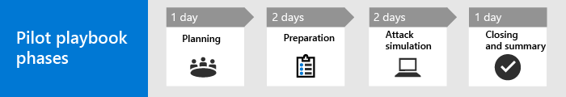

# Uw testfase microsoft 365 Defender-project uitvoeren 

[!INCLUDE [Microsoft 365 Defender rebranding](../includes/microsoft-defender.md)]

**Van toepassing op:**
- Microsoft 365 Defender

Deze handleiding helpt u bij het uitvoeren van een pilotproject door pointers te bieden om ervoor te zorgen dat u over een goed gestructureerd plan kunt beschikken, om u te begeleiden door de functie voor de aanvalsversleuteling te gebruiken en ten slotte de test af te sluiten met belangrijke take-aways om de resultaten te bekijken en vast te stellen.

Het uitvoeren van een testfase helpt u om effectief vast te stellen wat de voordelen zijn van het gebruik van Microsoft 365 Defender. Voordat u Microsoft 365 Defender inschakelen in uw productieomgeving en uw use cases start, kunt u het beste plannen welke taken u moet uitvoeren voor uw pilotproject en de criteria voor succes instellen. 

## Dit playbook gebruiken in de testfase

Deze handleiding bevat een overzicht van Microsoft 365 Defender en stapsgewijste instructies voor het instellen van uw pilotproject. 

Microsoft 365 Defender is een geïntegreerde pre- en post-breach Enterprise Defense Suite die ingebouwde beveiliging, detectie, preventie, onderzoek en antwoorden voor eindpunten, identiteiten, e-mail en toepassingen coördineren om geïntegreerde beveiliging tegen geavanceerde aanvallen te bieden. Dit doet u door de volgende mogelijkheden te combineren en te verbeteren in één beveiligingsoplossing:
  - Microsoft Defender voor eindpunt, de nieuwe naam voor Microsoft Defender Advanced Threat Protection (eindpunten)
  - Microsoft Defender voor Office 365, de nieuwe naam voor Office 365 ATP (e-mail) 
  - Microsoft Defender for Identity, de nieuwe naam voor Azure ATP (identity) 
  - Beveiliging van Microsoft Cloud-apps (apps)

Met de geïntegreerde Microsoft 365 Defender-oplossing kunnen beveiligingsprofessionals samenwerken aan de bedreigingssignalen die Microsoft Defender voor Eindpunt, Microsoft Defender voor Office 365, Microsoft Defender voor identiteit en Microsoft Cloud App Security ontvangen, en bepalen wat het volledige bereik en de invloed van de bedreiging zijn, hoe de bedreiging is ingevoerd in de omgeving, wat de gevolgen zijn en hoe deze op dit moment van invloed is op de organisatie. Microsoft 365 Defender onderneemt automatische acties om de aanval en postvakken, eindpunten en gebruikersidentiteiten te voorkomen of te stoppen. Zie het [overzicht van Microsoft 365 Defender](https://docs.microsoft.com/microsoft-365/security/mtp/microsoft-threat-protection) voor meer informatie.

De volgende voorbeeldtijdlijn varieert afhankelijk van de juiste resources in uw omgeving. Sommige detecties en werkstromen hebben mogelijk meer leertijd nodig dan de andere.

>[!IMPORTANT]
>Voor optimale resultaten volgt u de instructies van de testfase zo goed mogelijk.

### Fases van playbook pilot 

Een Microsoft 365 Defender-testfase bestaat uit vier fasen:

|Fase | Beschrijving | 
|:-------|:-----|
| [Planning](mtp-pilot-plan.md)  ~ 1 dag| Lees waar u aan moet denken voordat u een Microsoft 365 Defender-testproject gaat uitvoeren:   - Bereik   - Use cases  - Vereisten  - Testplan   - Criteria voor succes   - Scorecard 
| [Voorbereiding](mtp-evaluation.md)  ~2 dagen|  Krijg toegang tot het Microsoft 365-beveiligingscentrum om uw Microsoft 365 Defender-testomgeving in te stellen. U wordt begeleid bij het volgende:  - Identificeer belanghebbenden en zoek het aanmelden voor uw testfase   - Aandachtspunten voor de omgeving  - Access  - Azure Active Directory instellen   - Configuratieorder   - Aanmelden voor de proefversie van Microsoft 365 E5   - Domein configureren  - Microsoft 365 E5-licenties toewijzen   - Voltooi de installatiewizard in de portal|
| [Aanvalssyrulatie](mtp-pilot-simulate.md)  ~2 dagen| Als u een aanval wilt simuleren, kunt u het volgende doen:  - De vereisten voor de testomgeving controleren  - Deulatie uitvoeren  - Een incident onderzoeken  - het incident oplossen 
| [Afsluiting en samenvatting](mtp-pilot-close.md)  ~ 1 dag| Wanneer u het einde van het proces hebt bereikt, kunt u het volgende doen:  - De uiteindelijke uitvoer door - Presenteert uw uitvoer aan uw belanghebbenden  - Feedback geven  - Neem de volgende stappen 

## Volgende stap
|[Planningsfase](mtp-pilot-plan.md) | Uw Microsoft 365 Defender-pilotproject plannen 
|:-------|:-----|
