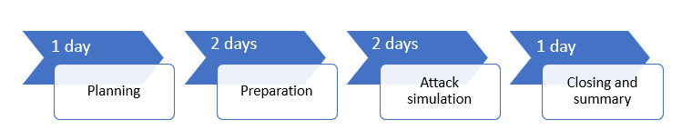

# Voer uw proefproject voor Microsoft Threat Protection uit.Run your pilot Microsoft Threat Protection project 

[!INCLUDE [Microsoft 365 Defender rebranding](../includes/microsoft-defender.md)]

**Van toepassing op:****Applies to:**
- Microsoft Threat ProtectionMicrosoft Threat Protection

Als u de voordelen en aanneming van Microsoft Threat Protection (MTP) daadwerkelijk wilt bepalen, kunt u een proefproject uitvoeren.To effectively determine the benefit and adoption of Microsoft Threat Protection (MTP), you can run a pilot project. Voordat u Microsoft Threat Protection in uw productieomgeving inschakelt en aan de slag gaat, kunt u het beste een planningsproces treffen voor het bepalen van de taken die moeten worden uitgevoerd in dit prototypeproject en de succescriteria.Before enabling Microsoft Threat Protection in your production environment and starting with defined use cases, it is best to go through a planning process to determine the tasks that must be accomplished in this pilot project, and the success criteria. 

## Het gebruik van deze pilot-PlaybookHow to use this pilot playbook

Deze handleiding biedt een overzicht van Microsoft Threat Protection en stapsgewijze instructies voor het instellen van uw proefproject.This guide provides an overview of Microsoft Threat Protection and step-by-step instructions on how to set up your pilot project. 

Het volgende voorbeeld van een tijdlijn is afhankelijk van de juiste bronnen in uw omgeving.The following sample timeline varies depending on having the right resources in your environment. Voor sommige detecties en werkstromen is mogelijk meer leer tijd nodig dan voor de andere.Some detections and workflows might need more learning time than the others.

>[!IMPORTANT]
>Volg voor optimale resultaten de instructies voor het testen.For optimum results, follow the pilot instructions as closely as possible.

### Playbook fasen voor prototypePilot playbook phases 

Er zijn vier fasen in het uitvoeren van een pilot van Microsoft Threat Protection:There are four phases in running a Microsoft Threat Protection pilot:

|FasePhase | BeschrijvingDescription | 
|:-------|:-----|
|  [PlanningPlanning](mtp-pilot-plan.md)| Meer informatie over wat u moet doen voordat u uw Microsoft Threat Protection-proefproject kunt uitvoeren:Learn what you need to consider before running your Microsoft Threat Protection pilot project:   -Bereik- Scope   -Use cases- Use cases  -Vereisten- Requirements  Test plan- Test plan   -Succescriteria- Success criteria   -Scorecard- Scorecard 
|   [UitwerkingPreparation](mtp-evaluation.md)|  Open Microsoft 365-Beveiligingscentrum om uw testomgeving voor Microsoft Threat Protection te installeren.Access Microsoft 365 Security Center to setup your Microsoft Threat Protection pilot  environment. U wordt begeleid bij:You will be guided to:  -Belanghebbenden identificeren en zich afmelden voor uw pilot- Identify stakeholders and seek sign-off for your pilot   -Aandachtspunten voor de omgeving- Environment considerations  -Access- Access  -Configuratie van Azure Active Directory- Azure Active Directory setup   -De configuratie volgorde- Configuration order   -Registreren voor Microsoft 365 E5-proefabonnement- Sign up for Microsoft 365 E5 Trial   Domein configureren- Configure domain  -Microsoft 365 E5-licenties toewijzen- Assign Microsoft 365 E5 licenses   -De wizard Setup voltooien in de portal- Complete the setup wizard in the portal|
|   [Simulatie van aanvalAttack simulation](mtp-pilot-simulate.md) | U wordt begeleid bij het maken van een aanval:To simulate an attack, you will be guided to:  -Controleer de vereisten voor de testomgeving- Verify the test environment requirements  -De simulatie uitvoeren-  Run the simulation  -Onderzoek een incident- Investigate an incident  -het incident oplossen- resolve the incident 
|   [Sluiten en samenvattingClosing and summary](mtp-pilot-close.md) | Wanneer u het einde van het proces hebt bereikt, wordt u begeleid bij het volgende:When you've reached the end of the process, you will be guided to:  -Doorgaan met de laatste uitvoer- Go through your final output -De uitvoer presenteren aan de belanghebbenden- Present your output to your stakeholders  -Feedback geven- Provide feedback  -Voer de volgende stappen uit- Take next steps 

## Volgende stapNext step
|  [PlanningfasePlanning phase](mtp-pilot-plan.md) | Uw proefproject voor Microsoft Threat Protection plannenPlan your Microsoft Threat Protection pilot project 
|:-------|:-----|
