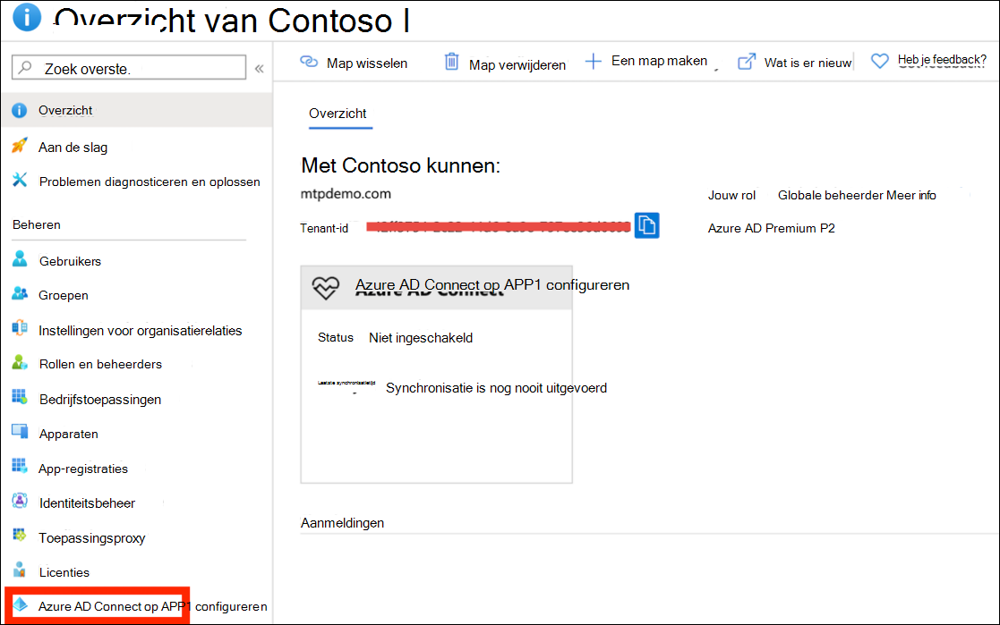
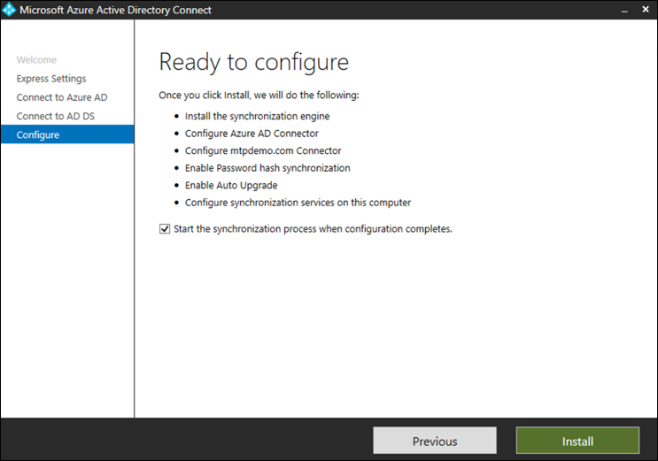

# Uw proefabonnement voor Microsoft 365 Defender of pilot omgeving voorbereidenPrepare your Microsoft 365 Defender trial lab or pilot environment

[!INCLUDE [Microsoft 365 Defender rebranding](../includes/microsoft-defender.md)]

**Van toepassing op:****Applies to:**
- Microsoft 365 DefenderMicrosoft 365 Defender

U maakt een Microsoft 365-proefabonnement voor proef omgevingen of pilot omgevingen en de implementatie ervan is een proces van drie fasen:Creating a Microsoft 365 Defender trial lab or pilot environment and deploying it is a three-phase process:

 
<table border="0" width="100%" align="center">
  <tr style="text-align:center;">
    <td align="center" style="width:25%; border:0;" bgcolor="#d5f5e3">
      <a href= "https://docs.microsoft.com/microsoft-365/security/mtp/prepare-mtpeval"> 
        
       Fase 1: voorbereiding </a>Phase 1: Prepare </a> 
    </td>
     <td align="center"  >
      <a href="https://docs.microsoft.com/microsoft-365/security/mtp/setup-mtpeval">
        
       Fase 2: instellen </a>Phase 2: Setup </a> 
        </td>
    <td align="center">
      <a href="https://docs.microsoft.com/microsoft-365/security/mtp/config-mtpeval">
        
       Fase 3: & onboard configureren</a>Phase 3: Configure & Onboard</a> 
</td>
  </tr>
  <tr>
    <td style="width:25%; border:0;">
   
    </td>
    <td valign="top" style="width:25%; border:0;">
    
</td>
    <td valign="top" style="width:25%; border:0;">

</td>    
  </tr>
</table>

U bevindt zich in de voorbereidende fase.You're currently in the preparation phase.

De voorbereiding is essentieel voor een succesvolle implementatie.Preparation is key to any successful deployment. In deze sectie wordt uitgelegd wat u moet doen als u een proefabonnement voor de implementatie van Microsoft 365 wilt maken.This section will guide you through what you need to consider as you prepare to create a trial lab or pilot environment for your Microsoft 365 Defender deployment.

## VereistenPrerequisites
Meer informatie over de licenties, hardware-en softwarevereisten en andere configuratie-instellingen voor het inrichten en gebruiken van Microsoft 365 Defender.Learn about the licensing, hardware and software requirements, and other configuration settings to provision and use Microsoft 365 Defender. Zie de minimale vereisten voor [Microsoft 365 Defender](https://docs.microsoft.com/microsoft-365/security/mtp/prerequisites), [Microsoft Defender for endpoints](https://docs.microsoft.com/windows/security/threat-protection/microsoft-defender-atp/minimum-requirements), [microsoft Defender for Office 365](https://docs.microsoft.com/office365/servicedescriptions/office-365-advanced-threat-protection-service-description), Microsoft-app [voor identiteit](https://docs.microsoft.com/azure-advanced-threat-protection/atp-prerequisites), beveiliging van de [Cloud-app van Microsoft](https://docs.microsoft.com/azure-advanced-threat-protection/atp-prerequisites).See the minimum requirements for [Microsoft 365 Defender](https://docs.microsoft.com/microsoft-365/security/mtp/prerequisites), [Microsoft Defender for Endpoint](https://docs.microsoft.com/windows/security/threat-protection/microsoft-defender-atp/minimum-requirements), [Microsoft Defender for Office 365](https://docs.microsoft.com/office365/servicedescriptions/office-365-advanced-threat-protection-service-description), [Microsoft Defender for Identity](https://docs.microsoft.com/azure-advanced-threat-protection/atp-prerequisites), [Microsoft Cloud App Security](https://docs.microsoft.com/azure-advanced-threat-protection/atp-prerequisites).

## Belanghebbenden en afmeldenStakeholders and sign-off
Identificeer alle belanghebbenden die deelnemen aan het project en wie kan zich mogelijk registreren, beoordelen, of op de hoogte blijven, of u nu een proefproject wilt maken of uitvoeren.Identify all the stakeholders that are involved in the project and who may need to sign-off, review, or stay informed, whether for evaluation or running a pilot project.

>[!NOTE]
>Het kan zijn dat niet alle organisaties de beveiliging van de organisatie hebben voor deze rollen.Not all organizations might have the security organization maturity to have such roles. Neem in dat geval contact op met uw leiderschaps team over controle en goedkeuring accountabilities.In such case, consult with your leadership team on review and approval accountabilities.

Voeg belanghebbenden toe aan de onderstaande tabel voor uw organisatie.Add stakeholders to the table below as appropriate for your organization.

-   DUS = afmelden voor dit projectSO = Sign-off on this project

-   R = het project controleren en de invoer gevenR = Review this project and provide input

-   I = op de hoogte gesteld van dit projectI = Informed of this project

| NaamName                 | RolRole                                                                                                                                                                                                          | ActierijAction |
|----------------------|---------------------------------------------------------------------------------------------------------------------------------------------------------------------------------------------------------------|--------|
| Voer naam en e-mailadres inEnter name and email | **Chief Information Security Officer (ciso)** *een vertegenwoordiger van de directeur die fungeert als sponsor binnen de organisatie voor de nieuwe technologie-implementatie.***Chief Information Security Officer (CISO)** *An executive representative who serves as sponsor inside the organization for the new technology deployment.*                                                  | ZOVEELSO     |
| Voer naam en e-mailadres inEnter name and email | **Hoofd van Cyber defensie Operations Center (CDOC)** *een medewerker van het CDOC-team dat verantwoordelijk is voor het bepalen van de manier waarop deze wijziging wordt uitgelijnd met de processen in het team beveiligingsactiviteiten.***Head of Cyber Defense Operations Center (CDOC)** *A representative from the CDOC team in charge of defining how this change is aligned with the processes in the customers security operations team.*       | ZOVEELSO     |
| Voer naam en e-mailadres inEnter name and email | **Beveiligings architect** *een medewerker van het beveiligingsteam dat verantwoordelijk is voor het bepalen van de manier waarop deze wijziging wordt afgestemd op de kern beveiligingsarchitectuur van de organisatie.***Security Architect** *A representative from the Security team in charge of defining how this change is aligned with the core Security architecture in the organization.*                         | SR      |
| Voer naam en e-mailadres inEnter name and email | **Workplace architect** *een medewerker van het IT-team die verantwoordelijk is voor het bepalen van de manier waarop deze wijziging wordt uitgelijnd met de core Workplace Architecture van de organisatie.***Workplace Architect** *A representative from the IT team in charge of defining how this change is aligned with the core workplace architecture in the organization.*                             | SR      |
| Voer naam en e-mailadres inEnter name and email | **Beveiligings analist** *een vertegenwoordiger van het CDOC-team die feedback kan geven over de detectie functies, de gebruikerservaring en de algehele bruikbaarheid van deze wijziging vanuit een oogpunt van beveiligingsactiviteiten.***Security Analyst** *A representative from the CDOC team who can provide feedback on the detection capabilities, user experience, and overall usefulness of this change from a security operations perspective.* | VindI      |

## Azure Active Directory voorbereidenPrepare your Azure Active Directory
Sla deze stap over als u al synchronisatie tussen Active Directory en Azure Active Directory hebt ingeschakeld.Skip this step if you have already enabled synchronization between Active Directory and Azure Active Directory on premises. Bekijk bestaande documentatie voor aanbevolen procedures van Azure Active Directory.Review existing best practices documentation from Azure Active Directory. De volgende stappen zijn geoptimaliseerd voor het evalueren of uitvoeren van een pilot Microsoft 365 Defender-project.The following steps are optimized to evaluate or run a pilot Microsoft 365 Defender project.

1. Ga naar [Azure Active Directory](https://portal.azure.com/#blade/Microsoft_AAD_IAM/ActiveDirectoryMenuBlade) Portal > **Azure AD Connect**.Go to the [Azure Active Directory](https://portal.azure.com/#blade/Microsoft_AAD_IAM/ActiveDirectoryMenuBlade) portal > **Azure AD Connect**. 
   

2. Klik op **downloaden** van **Microsoft Azure Active Directory Connect** en breng dit over naar de domein controller.Click **Download** from **Microsoft Azure Active Directory Connect** and transfer it to your Domain Controller.
  

3. Op de domeincontroller volgt u de wizard Azure Active Directory Connect.On the domain controller, follow the Azure Active Directory Connect wizard. Lees de licentievoorwaarden en het Privacy-kennisgeving en schakel het selectievakje in als u ermee akkoord gaat.Read the license terms and privacy notice and select the checkbox if you agree. Klik op **Continue**.Click **Continue**.
  

4. Ga naar **instellingen voor expres**.Navigate to **Express Settings**.
  

5. Voer uw globale-beheerdersreferenties in.Enter your global administrator credentials. Klik op **Volgende**.Click **Next**.
  

6. Voer de referenties van uw Active Directory Domain Services Enterprise-beheerder in.Enter your Active Directory Domain Services enterprise administrator credentials. Klik op **Volgende**.Click **Next**.
  

7. Klik op **installeren** om de configuratie te bevestigen.Click **Install** to confirm the configuration.
  

8. Gefeliciteerd, u hebt Azure Active Directory Connect geconfigureerd.Congratulations, you have successfully configured Azure Active Directory Connect.
  

U kunt nu [gebruikers en groepen toevoegen aan Active Directory](https://docs.microsoft.com/azure-advanced-threat-protection/atp-playbook-setup-lab#bkmk_hydrate) en [een SAM-R-beleid configureren](https://docs.microsoft.com/azure-advanced-threat-protection/atp-playbook-setup-lab#configure-sam-r-capabilities-from-contosodc).You can now [add users and groups to Active Directory](https://docs.microsoft.com/azure-advanced-threat-protection/atp-playbook-setup-lab#bkmk_hydrate) and [configure a SAM-R policy](https://docs.microsoft.com/azure-advanced-threat-protection/atp-playbook-setup-lab#configure-sam-r-capabilities-from-contosodc).  

## Configuratie volgordeConfiguration order
In de volgende tabel wordt aangegeven welke volgorde Microsoft adviseert voor het configureren van de Microsoft 365-onderdelen voor de implementatie van proefversie of pilot omgeving.The following table indicates the order Microsoft recommends for configuring the Microsoft 365 Defender components for your trial lab or pilot environment deployment.

| InvoertComponent                               | BeschrijvingDescription                                                                                                                                                                                                                                                                                                                                                                                                                                                                                                                                                                                                                                                                                              | Rangschikking van de configuratie volgordeConfiguration order rank |
|-----------------------------------------|----------------------------------------------------------------------------------------------------------------------------------------------------------------------------------------------------------------------------------------------------------------------------------------------------------------------------------------------------------------------------------------------------------------------------------------------------------------------------------------------------------------------------------------------------------------------------------------------------------------------------------------------------------------------------------------------------------|---------------------|
|Microsoft Defender voor Office 365Microsoft Defender for Office 365|Microsoft Defender voor Office 365 beschermt uw organisatie tegen kwaadaardige bedreigingen van e-mailberichten, koppelingen (Url's) en samenwerkingsprogramma's.Microsoft Defender for Office 365 safeguards your organization against malicious threats posed by email messages, links (URLs), and collaboration tools.   [Meer informatie.Learn more.](https://docs.microsoft.com/microsoft-365/security/office-365-security/office-365-atp)                                                                                                                                                                                                                                             | 11                   |
|Microsoft Defender voor identiteitMicrosoft Defender for Identity|Microsoft Defender for Identity maakt gebruik van Active Directory-signalen voor het identificeren, detecteren en onderzoeken van geavanceerde bedreigingen, compromisloze identiteiten, en het uitvoeren van schadelijke Insider-acties die worden doorgestuurd naar uw organisatie.Microsoft Defender for Identity uses Active Directory signals to identify, detect, and investigate advanced threats, compromised identities, and malicious insider actions directed at your organization.   [Meer informatie](https://docs.microsoft.com/azure-advanced-threat-protection/).[Learn more](https://docs.microsoft.com/azure-advanced-threat-protection/).| 32 |
|Microsoft Cloud App SecurityMicrosoft Cloud App Security| Microsoft Cloud-app-beveiliging is een Cloud Access Security Broker (CASB) die op meerdere clouds werkt.Microsoft Cloud App Security is a Cloud Access Security Broker (CASB) that operates on multiple clouds. Het biedt uitgebreide zichtbaarheid, controle over gegevens reis en geavanceerde analyses voor het identificeren en bestrijden van cyberthreats in alle cloudservices.It provides rich visibility, control over data travel, and sophisticated analytics to identify and combat cyberthreats across all your cloud services.   [Meer informatie](https://docs.microsoft.com/cloud-app-security/).[Learn more](https://docs.microsoft.com/cloud-app-security/).                                                                                                                                                                                                                                                                                                                                                                       |driefasig3                   |
|Microsoft Defender voor eindpuntMicrosoft Defender for Endpoint | Microsoft Defender voor detectie van eindpunten voor eindpunten biedt geavanceerde aanvals detectie die bij realtime en actie mogelijk zijn.Microsoft Defender for Endpoint endpoint detection and response capabilities provide advanced attack detections that are near real-time and actionable. Beveiligings analisten kunnen waarschuwingen effectiever uitstellen, inzicht krijgen in de volledige reikwijdte van een overtreding en antwoord acties uitvoeren om bedreigingen te herstellen.Security analysts can prioritize alerts effectively, gain visibility into the full scope of a breach, and take response actions to remediate threats.   [Meer informatie.Learn more.](https://docs.microsoft.com/windows/security/threat-protection/microsoft-defender-atp/microsoft-defender-advanced-threat-protection)                                     |34                   |                                                                                                                                                                                                                                    

## Volgende stapNext step
|  [Fase 2: instellenPhase 2: Setup](setup-mtpeval.md) | Uw proefabonnement voor Microsoft 365 Defender of pilot omgeving instellenSet up your Microsoft 365 Defender trial lab or pilot environment
|:-------|:-----|

