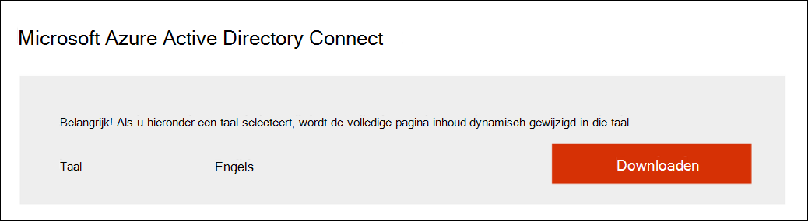

# Uw proefversie van Microsoft Threat Protection voorbereidenPrepare your Microsoft Threat Protection trial lab environment

**Geldt voor:****Applies to:**
- Microsoft Threat ProtectionMicrosoft Threat Protection

Het maken van een Microsoft Threat Protection trial lab omgeving en het implementeren ervan is een proces in drie fasen:Creating a Microsoft Threat Protection trial lab environment and deploying it is a three-phase process:

 
<table border="0" width="100%" align="center">
  <tr style="text-align:center;">
    <td align="center" style="width:25%; border:0;" bgcolor="#d5f5e3">
      <a href= "https://docs.microsoft.com/microsoft-365/security/mtp/prepare-mtpeval"> 
        
       Fase 1: Voorbereiden</a>Phase 1: Prepare </a> 
    </td>
     <td align="center"  >
      <a href="https://docs.microsoft.com/microsoft-365/security/mtp/setup-mtpeval">
        
       Fase 2: Setup</a>Phase 2: Setup </a> 
        </td>
    <td align="center">
      <a href="https://docs.microsoft.com/microsoft-365/security/mtp/config-mtpeval">
        
       Fase 3: & configureren</a>Phase 3: Configure & Onboard</a> 
</td>
  </tr>
  <tr>
    <td style="width:25%; border:0;">
   
    </td>
    <td valign="top" style="width:25%; border:0;">
    
</td>
    <td valign="top" style="width:25%; border:0;">

</td>    
  </tr>
</table>

Je zit momenteel in de voorbereidingsfase.You're currently in the preparation phase.

Voorbereiding is de sleutel tot een succesvolle implementatie.Preparation is key to any successful deployment. In deze sectie wordt u doorgeleid naar wat u moet overwegen bij het maken van een proeflabomgeving voor uw Microsoft Threat Protection-implementatie.This section will guide you through what you need to consider as you prepare to create a trial lab environment for your Microsoft Threat Protection deployment.

## VereistenPrerequisites
Meer informatie over de vereisten voor licenties, hardware en software en andere configuratie-instellingen voor het inrichten en gebruiken van Microsoft Threat Protection.Learn about the licensing, hardware and software requirements, and other configuration settings to provision and use Microsoft Threat Protection. Zie de minimumvereisten voor [Microsoft Threat Protection](https://docs.microsoft.com/microsoft-365/security/mtp/prerequisites?view=o365-worldwide), Microsoft Defender [ATP](https://docs.microsoft.com/windows/security/threat-protection/microsoft-defender-atp/minimum-requirements), [Office 365 ATP](https://docs.microsoft.com/office365/servicedescriptions/office-365-advanced-threat-protection-service-description), Azure [ATP](https://docs.microsoft.com/azure-advanced-threat-protection/atp-prerequisites), Microsoft Cloud [App Security](https://docs.microsoft.com/azure-advanced-threat-protection/atp-prerequisites).See the minimum requirements for [Microsoft Threat Protection](https://docs.microsoft.com/microsoft-365/security/mtp/prerequisites?view=o365-worldwide), [Microsoft Defender ATP](https://docs.microsoft.com/windows/security/threat-protection/microsoft-defender-atp/minimum-requirements), [Office 365 ATP](https://docs.microsoft.com/office365/servicedescriptions/office-365-advanced-threat-protection-service-description), [Azure ATP](https://docs.microsoft.com/azure-advanced-threat-protection/atp-prerequisites), [Microsoft Cloud App Security](https://docs.microsoft.com/azure-advanced-threat-protection/atp-prerequisites).

## Belanghebbenden en afmeldingStakeholders and sign-off
Het volgende gedeelte dient om alle belanghebbenden te identificeren die betrokken zijn bij het project en die mogelijk moeten ondertekenen, beoordelen of op de hoogte blijven, zelfs voor een evaluatie of een proof of concept dry-run.The following section serves to identify all the stakeholders that are involved in the project and who may need to sign-off, review, or stay informed, even for an evaluation or proof of concept dry-run.

>[!NOTE]
>Niet alle organisaties hebben mogelijk de volwassenheid van de beveiligingsorganisatie om dergelijke rollen te hebben.Not all organizations might have the security organization maturity to have such roles. In dat geval u overleggen met uw leiderschapsteam over beoordeling en goedkeuringsverantwoordelijkheden.In such case, consult with your leadership team on review and approval accountabilities.

Voeg belanghebbenden toe aan de onderstaande tabel, indien van toepassing op uw organisatie.Add stakeholders to the table below as appropriate for your organization.

-   SO = Aanmelden voor dit projectSO = Sign-off on this project

-   R = Dit project bekijken en input leverenR = Review this project and provide input

-   I = Op de hoogte van dit projectI = Informed of this project

| NameName                 | RolRole                                                                                                                                                                                                          | ActieAction |
|----------------------|---------------------------------------------------------------------------------------------------------------------------------------------------------------------------------------------------------------|--------|
| Naam en e-mail invoerenEnter name and email | **Chief Information Security Officer (CISO)** *Een executive vertegenwoordiger die fungeert als sponsor binnen de organisatie voor de nieuwe technologie inzet.***Chief Information Security Officer (CISO)** *An executive representative who serves as sponsor inside the organization for the new technology deployment.*                                                  | DusSO     |
| Naam en e-mail invoerenEnter name and email | **Hoofd van Cyber Defense Operations Center (CDOC)** *Een vertegenwoordiger van het CDOC-team dat bepaalt hoe deze verandering is afgestemd op de processen in het beveiligingsteam van klanten.***Head of Cyber Defense Operations Center (CDOC)** *A representative from the CDOC team in charge of defining how this change is aligned with the processes in the customers security operations team.*       | DusSO     |
| Naam en e-mail invoerenEnter name and email | **Security Architect** *Een vertegenwoordiger van het Security team dat bepaalt hoe deze verandering is afgestemd op de kern Security architectuur in de organisatie.***Security Architect** *A representative from the Security team in charge of defining how this change is aligned with the core Security architecture in the organization.*                         | RR      |
| Naam en e-mail invoerenEnter name and email | **Workplace Architect** *Een vertegenwoordiger van het IT-team dat bepaalt hoe deze verandering is afgestemd op de kernwerkplekarchitectuur in de organisatie.***Workplace Architect** *A representative from the IT team in charge of defining how this change is aligned with the core workplace architecture in the organization.*                             | RR      |
| Naam en e-mail invoerenEnter name and email | **Security Analyst** *Een vertegenwoordiger van het CDOC-team die input kan leveren over de detectiemogelijkheden, gebruikerservaring en het algehele nut van deze wijziging vanuit het oogpunt van beveiligingsactiviteiten.***Security Analyst** *A representative from the CDOC team who can provide input on the detection capabilities, user experience, and overall usefulness of this change from a security operations perspective.* | II      |

## Uw Azure Active Directory voorbereidenPrepare your Azure Active Directory
Sla deze stap over als u synchronisatie tussen Active Directory en Azure Active Directory on-premises al hebt ingeschakeld.Skip this step if you have already enabled synchronization between Active Directory and Azure Active Directory on premises. Bekijk bestaande best practices-documentatie vanuit Azure Active Directory.Review existing best practices documentation from Azure Active Directory. De volgende stappen zijn geoptimaliseerd om Microsoft Threat Protection te evalueren.The following steps are optimized to evaluate Microsoft Threat Protection.

1. Ga naar de [Azure Active Directory-portal](https://portal.azure.com/#blade/Microsoft_AAD_IAM/ActiveDirectoryMenuBlade) > **Azure AD Connect**.Go to the [Azure Active Directory](https://portal.azure.com/#blade/Microsoft_AAD_IAM/ActiveDirectoryMenuBlade) portal > **Azure AD Connect**. 
   

2. Klik **op Downloaden** van Microsoft Azure Active Directory **Connect** en zet deze over naar uw domeincontroller.Click **Download** from **Microsoft Azure Active Directory Connect** and transfer it to your Domain Controller.
  

3. Volg op de domeincontroller de wizard Azure Active Directory Connect.On the domain controller, follow the Azure Active Directory Connect wizard. Lees de licentievoorwaarden en privacyverklaring en schakel het selectievakje in als u hiermee akkoord gaat.Read the license terms and privacy notice and select the checkbox if you agree. Klik op **Continue**.Click **Continue**.
  

4. Navigeer naar **Expresinstellingen**.Navigate to **Express Settings**.
  

5. Voer uw globale beheerdersreferenties in.Enter your global administrator credentials. Klik op **Volgende**.Click **Next**.
  

6. Voer de referenties van de bedrijfsbeheerder van Active Directory Domain Services in.Enter your Active Directory Domain Services enterprise administrator credentials. Klik op **Volgende**.Click **Next**.
  

7. Klik **op Installeren** om de configuratie te bevestigen.Click **Install** to confirm the configuration.
  

8. Gefeliciteerd, u hebt Azure Active Directory Connect geconfigureerd.Congratulations, you have successfully configured Azure Active Directory Connect.
  

U nu [gebruikers en groepen toevoegen aan Active Directory](https://docs.microsoft.com/azure-advanced-threat-protection/atp-playbook-setup-lab#bkmk_hydrate) en een [SAM-R-beleid configureren.](https://docs.microsoft.com/azure-advanced-threat-protection/atp-playbook-setup-lab#configure-sam-r-capabilities-from-contosodc)You can now [add users and groups to Active Directory](https://docs.microsoft.com/azure-advanced-threat-protection/atp-playbook-setup-lab#bkmk_hydrate) and [configure a SAM-R policy](https://docs.microsoft.com/azure-advanced-threat-protection/atp-playbook-setup-lab#configure-sam-r-capabilities-from-contosodc).  

## ConfiguratievolgordeConfiguration order
De onderstaande tabel geeft de volgorde aan die Microsoft aanbeveelt voor het configureren van de Microsoft Threat Protection-componenten voor de implementatie van uw proeflabomgeving.The table below indicates the order Microsoft recommends for configuring the Microsoft Threat Protection components for your trial lab environment deployment.

| ComponentComponent                               | BeschrijvingDescription                                                                                                                                                                                                                                                                                                                                                                                                                                                                                                                                                                                                                                                                                              | ConfiguratievolgorderangConfiguration order rank |
|-----------------------------------------|----------------------------------------------------------------------------------------------------------------------------------------------------------------------------------------------------------------------------------------------------------------------------------------------------------------------------------------------------------------------------------------------------------------------------------------------------------------------------------------------------------------------------------------------------------------------------------------------------------------------------------------------------------------------------------------------------------|---------------------|
| Office 365 Advanced Threat ProtectionOffice 365 Advanced Threat Protection| Office 365 ATP beschermt uw organisatie tegen schadelijke bedreigingen van e-mailberichten, koppelingen en samenwerkingstools.Office 365 ATP safeguards your organization against malicious threats posed by email messages, links (URLs), and collaboration tools.   [Meer informatie.Learn more.](https://docs.microsoft.com/microsoft-365/security/office-365-security/office-365-atp?view=o365-worldwide)                                                                                                                                                                                                                                             | 11                   |
|Azure Advanced Threat ProtectionAzure Advanced Threat Protection|Azure ATP gebruikt Active Directory-signalen om geavanceerde bedreigingen, gecompromitteerde identiteiten en schadelijke insideracties gericht op uw organisatie te identificeren, te detecteren en te onderzoeken.Azure ATP uses Active Directory signals to identify, detect, and investigate advanced threats, compromised identities, and malicious insider actions directed at your organization.   [Meer informatie](https://docs.microsoft.com/azure-advanced-threat-protection/).[Learn more](https://docs.microsoft.com/azure-advanced-threat-protection/).| 22 |
|Microsoft Cloud App SecurityMicrosoft Cloud App Security| Microsoft Cloud App Security is een Cloud Access Security Broker (CASB) die op meerdere clouds werkt.Microsoft Cloud App Security is a Cloud Access Security Broker (CASB) that operates on multiple clouds. Het biedt een rijke zichtbaarheid, controle over gegevensreizen en geavanceerde analyses om cyberbedreigingen in al uw cloudservices te identificeren en te bestrijden.It provides rich visibility, control over data travel, and sophisticated analytics to identify and combat cyberthreats across all your cloud services.   [Meer informatie](https://docs.microsoft.com/cloud-app-security/).[Learn more](https://docs.microsoft.com/cloud-app-security/).                                                                                                                                                                                                                                                                                                                                                                       |33                   |
|Microsoft Defender Advanced Threat ProtectionMicrosoft Defender Advanced Threat Protection | Microsoft Defender ATP-eindpuntdetectie- en -reactiemogelijkheden bieden geavanceerde aanvalsdetecties die bijna realtime en bruikbaar zijn.Microsoft Defender ATP endpoint detection and response capabilities provide advanced attack detections that are near real-time and actionable. Beveiligingsanalisten kunnen waarschuwingen effectief prioriteren, inzicht krijgen in het volledige bereik van een inbreuk en reactieacties ondernemen om bedreigingen te verwerkeren.Security analysts can prioritize alerts effectively, gain visibility into the full scope of a breach, and take response actions to remediate threats.   [Meer informatie.Learn more.](https://docs.microsoft.com/windows/security/threat-protection/microsoft-defender-atp/microsoft-defender-advanced-threat-protection)                                     |44                   |                                                                                                                                                                                                                                    

## Volgende stapNext step
|||
|:-------|:-----|
|  [Fase 2: SetupPhase 2: Setup](setup-mtpeval.md) | Uw proefversie van Microsoft Threat Protection instellenSet up your Microsoft Threat Protection trial lab environment

