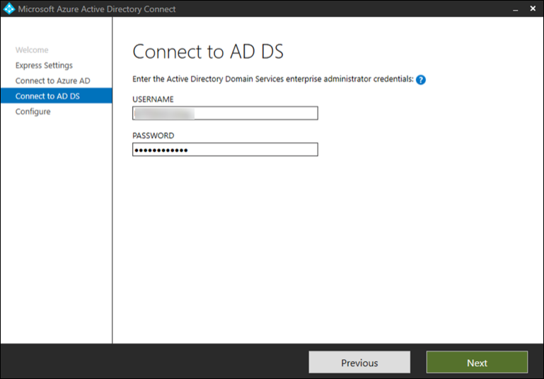

# De testtest of testomgeving van Microsoft 365 Defender voorbereiden

[!INCLUDE [Microsoft 365 Defender rebranding](../includes/microsoft-defender.md)]

**Van toepassing op:**
- Microsoft 365 Defender

Het maken van een testtest of pilotomgeving van Microsoft 365 Defender en deze implementeren bestaat uit drie fasen:

| Fase 1: Voorbereiden | [Fase 2: Instellen](setup-mtpeval.md) | [Fase 3: Onboard](config-mtpeval.md) |  [Terug naar pilot playbook](mtp-pilot.md) |
|--|--|--|--|
|*U bent hier!* | || |

U zit momenteel in de voorbereidingsfase.

Voorbereiding is belangrijk voor elke succesvolle implementatie. In deze sectie wordt u begeleid bij wat u moet overwegen wanneer u zich voorbereidt op het maken van een testtestomgeving of pilotomgeving voor uw Microsoft 365 Defender-implementatie.

## Vereisten
Meer informatie over de licentie-, hardware- en softwarevereisten en andere configuratie-instellingen voor het inrichten en gebruiken van Microsoft 365 Defender. Bekijk de minimale vereisten voor [Microsoft 365 Defender,](https://docs.microsoft.com/microsoft-365/security/mtp/prerequisites) [Microsoft Defender voor](https://docs.microsoft.com/windows/security/threat-protection/microsoft-defender-atp/minimum-requirements)eindpunt, Microsoft Defender voor [Office 365,](https://docs.microsoft.com/office365/servicedescriptions/office-365-advanced-threat-protection-service-description) [Microsoft Defender voor identiteit,](https://docs.microsoft.com/azure-advanced-threat-protection/atp-prerequisites) [Microsoft Cloud App-beveiliging.](https://docs.microsoft.com/azure-advanced-threat-protection/atp-prerequisites)

## Belanghebbenden en aanmelding
Identificeer alle belanghebbenden die bij het project zijn betrokken en wie zich mogelijk moet afloggen, beoordelen of op de hoogte moeten blijven, ongeacht of ze willen worden geëvalueerd of een pilot moeten uitvoeren.

>[!NOTE]
>Mogelijk hebben niet alle organisaties de vervaldatum van de beveiligingsorganisatie om dergelijke rollen te hebben. Neem in dat geval contact op met uw managementteam over accountmogelijkheden voor beoordeling en goedkeuring.

Voeg belanghebbenden toe aan de onderstaande tabel, voor uw organisatie.

-   SO = Sign-off voor dit project

-   R = Dit project bekijken en input geven

-   I = goed geïnformeerd over dit project

| Naam                 | Rol                                                                                                                                                                                                          | Actie |
|----------------------|---------------------------------------------------------------------------------------------------------------------------------------------------------------------------------------------------------------|--------|
| Naam en e-mailadres invoeren | **Chief Information Security Officer (CISO) Een** leidinggevende die fungeert als sponsor binnen de organisatie *voor de implementatie van nieuwe technologie.*                                                  | SO     |
| Naam en e-mailadres invoeren | **Head of Cyber Defense Operations Center (CDOC)** A representative from the CDOC team charge of defining how this change is aligned with the *processes in the customers security operations team.*       | SO     |
| Naam en e-mailadres invoeren | **Beveiligingsarchitectuur** *Een vertegenwoordiger van het beveiligingsteam* die verantwoordelijk is voor het definiëren van de manier waarop deze wijziging wordt afgestemd op de kernbeveiligingsarchitectuur van de organisatie.                         | R      |
| Naam en e-mailadres invoeren | **Workplace Architect** *Een vertegenwoordiger van het IT-team* die verantwoordelijk is voor het definiëren van deze wijziging, komt overeen met de architectuur van de kernwerkplaats in de organisatie.                             | R      |
| Naam en e-mailadres invoeren | **Beveiligingsanalist** Een vertegenwoordiger van het CDOC-team die feedback kan geven over de detectiemogelijkheden, gebruikerservaring en de algehele bruikbaarheid van deze wijziging vanuit het perspectief van *beveiligingsbewerkingen.* | I      |

## Uw Azure Active Directory voorbereiden
Sla deze stap over als synchronisatie tussen Active Directory en Azure Active Directory on-premises al is ingeschakeld. Bekijk de bestaande documentatie over best practices vanuit Azure Active Directory. De volgende stappen zijn geoptimaliseerd voor het evalueren of uitvoeren van een testfase van het Microsoft 365 Defender-project.

1. Ga naar de [Azure Active Directory-portal](https://portal.azure.com/#blade/Microsoft_AAD_IAM/ActiveDirectoryMenuBlade) > **Azure AD Connect.** 
   

2. Klik **op Downloaden** van Microsoft Azure Active Directory **Connect** en breng dit over naar uw domeincontroller.
  

3. Volg op de domeincontroller de wizard Azure Active Directory Connect. Lees de licentievoorwaarden en de privacyverklaring en schakel het selectievakje in als u ermee akkoord gaat. Klik op **Continue**.
  

4. Ga naar **Expresinstellingen.**
  

5. Voer uw globale beheerdersreferenties in. Klik op **Volgende**.
  

6. Voer de beheerdersreferenties voor Active Directory Domain Services voor bedrijven in. Klik op **Volgende**.
  

7. Klik **op Installeren** om de configuratie te bevestigen.
  

8. Gefeliciteerd, u hebt Azure Active Directory Connect geconfigureerd.
  

U kunt nu [gebruikers en groepen toevoegen aan Active Directory](https://docs.microsoft.com/azure-advanced-threat-protection/atp-playbook-setup-lab#bkmk_hydrate) en een [SAM-R-beleid configureren.](https://docs.microsoft.com/azure-advanced-threat-protection/atp-playbook-setup-lab#configure-sam-r-capabilities-from-contosodc)  

## Configuratieorder
In de volgende tabel wordt de volgorde aangegeven die Microsoft aanbeveelt voor het configureren van de Microsoft 365 Defender-onderdelen voor de implementatie van uw testtest of pilotomgeving.

| Onderdeel                               | Beschrijving                                                                                                                                                                                                                                                                                                                                                                                                                                                                                                                                                                                                                                                                                              | Rang van configuratieorder |
|-----------------------------------------|----------------------------------------------------------------------------------------------------------------------------------------------------------------------------------------------------------------------------------------------------------------------------------------------------------------------------------------------------------------------------------------------------------------------------------------------------------------------------------------------------------------------------------------------------------------------------------------------------------------------------------------------------------------------------------------------------------|---------------------|
|Microsoft Defender voor Office 365|Microsoft Defender voor Office 365 beschermt je organisatie tegen kwaadwillende bedreigingen afkomstig van e-mailberichten, koppelingen (URL’s) en hulpmiddelen voor samenwerking.   [Meer informatie.](https://docs.microsoft.com/microsoft-365/security/office-365-security/office-365-atp)                                                                                                                                                                                                                                             | 1                   |
|Microsoft Defender for Identity|Microsoft Defender for Identity gebruikt Active Directory-signalen voor het identificeren, detecteren en onderzoeken van geavanceerde bedreigingen, gekromde identiteiten en kwaadaardige insideracties die zijn gericht op uw organisatie.   [Meer informatie](https://docs.microsoft.com/azure-advanced-threat-protection/).| 2 |
|Microsoft Cloud App Security| Microsoft Cloud App Security is een cloudtoegangsbeveiligingsagent (CASB) die op meerdere clouds werkt. Het biedt uitgebreide zichtbaarheid, controle over gegevensreizen en geavanceerde analyses om cyberaanvallen in al uw cloudservices te identificeren en te bestrijden.   [Meer informatie](https://docs.microsoft.com/cloud-app-security/).                                                                                                                                                                                                                                                                                                                                                                       |3                   |
|Microsoft Defender for Endpoint | De detectie- en antwoordmogelijkheden van het Eindpunt van Microsoft Defender voor eindpunt bieden geavanceerde detectie van aanvallen die in realtime bijna in realtime zijn en die kunnen worden ondernomen. Beveiligingsanalisten kunnen waarschuwingen effectief prioriteit geven, inzicht krijgen in het volledige bereik van een inbreuk en reactieacties ondernemen om bedreigingen te herstellen.   [Meer informatie.](https://docs.microsoft.com/windows/security/threat-protection/microsoft-defender-atp/microsoft-defender-advanced-threat-protection)                                     |4                   |                                                                                                                                                                                                                                    

## Volgende stap
|  [Fase 2: Installatie](setup-mtpeval.md) | Uw Test lab of pilotomgeving met Microsoft 365 Defender instellen
|:-------|:-----|

