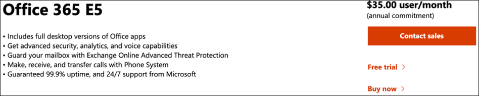
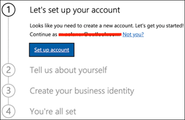
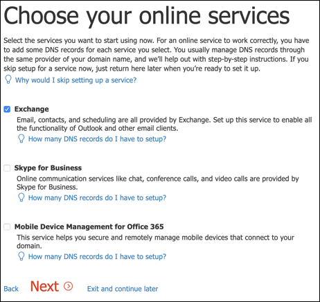

# Uw Microsoft Threat Protection-proefomgeving instellenSet up your Microsoft Threat Protection trial lab environment 

**Van toepassing op:****Applies to:**
- Microsoft Threat ProtectionMicrosoft Threat Protection 

Het maken van een Microsoft Threat Protection-proeflabomgeving en het implementeren ervan is een proces in drie fasen:Creating a Microsoft Threat Protection trial lab environment and deploying it is a three-phase process:

 
<table border="0" width="100%" align="center">
  <tr style="text-align:center;">
    <td align="center" style="width:25%; border:0;" >
      <a href= "https://docs.microsoft.com/microsoft-365/security/mtp/prepare-mtpeval?view=o365-worldwide"> 
        
       Fase 1: Voorbereiden</a>Phase 1: Prepare </a> 
    </td>
     <td align="center"bgcolor="#d5f5e3">
      <a href="https://docs.microsoft.com/microsoft-365/security/mtp/setup-mtpeval?view=o365-worldwide">
        
       Fase 2: Setup</a>Phase 2: Setup </a> 
    </td>
    <td align="center">
      <a href="https://docs.microsoft.com/microsoft-365/security/mtp/config-mtpeval?view=o365-worldwide">
        
       Fase 3: & onboard configureren</a>Phase 3: Configure & Onboard </a> 
</td>

  </tr>
</table>

U bevindt zich momenteel in de opgezette fase.You are currently in the set up phase. Neem de eerste stappen om toegang te krijgen tot Microsoft 365 Security Center en stel vervolgens uw proeflabomgeving in.Take the initial steps to access Microsoft 365 Security Center then setup your trial lab environment.

Meld u aan voor een Office 365- of Azure Active Directory-abonnement om een *.onmicrosoft.com* tenant te genereren waarmee u zich aanmelden voor uw Microsoft 365 E5-licentie.Sign up for an Office 365 or Azure Active Directory subscription to generate a *.onmicrosoft.com* tenant that you can use to sign up for your Microsoft 365 E5 license. 

>[!NOTE]
>Als u al een bestaand Office 365- of Azure Active Directory-abonnement hebt, u de stappen voor het maken van proef tenant voor Office 365 E5 overslaan.If you already have an existing Office 365 or Azure Active Directory subscription, you can skip the Office 365 E5 trial tenant creation steps.

In deze fase wordt u begeleid naar:In this phase, you'll be guided to:
- Een proef tenant voor Office 365 E5 makenCreate an Office 365 E5 trial tenant
- Microsoft 365-proefabonnement inschakelenEnable Microsoft 365 trial subscription

## Een proef tenant voor Office 365 E5 makenCreate an Office 365 E5 trial tenant
>[!NOTE]
>Als u al een bestaand Office 365- of Azure Active Directory-abonnement hebt, u de stappen voor het maken van proef tenant voor Office 365 E5 overslaan.If you already have an existing Office 365 or Azure Active Directory subscription, you can skip the Office 365 E5 trial tenant creation steps.

1. Ga naar de [Office 365 E5-productportal](https://www.microsoft.com/microsoft-365/business/office-365-enterprise-e5-business-software?activetab=pivot%3aoverviewtab) en selecteer **Gratis proefversie**.Go to the [Office 365 E5 product portal](https://www.microsoft.com/microsoft-365/business/office-365-enterprise-e5-business-software?activetab=pivot%3aoverviewtab) and select **Free trial**.
  
  
2. Voltooi de proefregistratie door uw e-mailadres (persoonlijk of zakelijk) in te voeren.Complete the trial registration by entering your email address (personal or corporate). Klik **op Account instellen**.Click **Set up account**.
   

3. Vul uw voornaam, achternaam, bedrijfstelefoonnummer, bedrijfsnaam, bedrijfsgrootte en land of regio in.Fill in your first name, last name, business phone number, company name, company size and country or region.  
   
>[!NOTE]
>Het land of de regio die u hier instelt, bepaalt de regio van het datacenter die uw Office 365 ontvangt.The country or region you set here determines the data center region your Office 365 will be hosted.
  
4. Kies uw verificatievoorkeur: via een sms of oproep.Choose your verification preference: through a text message or call. Klik **op Verificatiecode verzenden**.Click **Send Verification Code**. 
  

5. Stel de aangepaste domeinnaam in voor uw tenant en klik vervolgens op **Volgende**.Set the custom domain name for your tenant, then click **Next**.
   
 
6. Stel de eerste identiteit in die een globale beheerder voor de tenant zal zijn.Set up the first identity which will be a Global Administrator for the tenant. Geef **naam** en **wachtwoord in**.Fill in **Name** and **Password**. Klik **op Aanmelden**.Click **Sign up**.
  

7. Klik **op Ga naar Setup** om de inrichting van office 365 E5-proef tenanten te voltooien.Click **Go to Setup** to complete the Office 365 E5 trial tenant provisioning.
   

8. Verbind uw bedrijfsdomein met de Office 365-tenant.Connect your corporate domain to the Office 365 tenant. [Optioneel] Kies **Een domein verbinden dat u al bezit** en typ uw domeinnaam.[Optional] Choose **Connect a domain you already own** and type in your domain name. Klik op **Volgende**.Click **Next**.
   
 
9. U moet een TXT- of MX-record toevoegen om het domeineigendom te valideren.You will need to add a TXT or MX record to validate the domain ownership. Nadat u de TXT- of MX-record aan uw domein hebt toegevoegd, selecteert u **Verifiëren**.Once you’ve added the TXT or MX record to your domain, select **Verify**.
   
 
10. [Optioneel] Maak meer gebruikersaccounts voor uw tenant.[Optional] Create more user accounts for your tenant. U deze stap overslaan door op **Volgende**te klikken.You can skip this step by clicking **Next**.
  
 
11. [Optioneel] Office-apps downloaden.[Optional] Download Office apps. Klik **op Volgende** om deze stap over te slaan.Click **Next** to skip this step. 
   

12. [Optioneel] E-mailberichten migreren.[Optional] Migrate email messages. Nogmaals, u deze stap overslaan.Again, you can skip this step.
   
 
13. Kies online services.Choose online services. Selecteer **Exchange** en klik op **Volgende**.Select **Exchange** and click **Next**. 
   

14. Voeg MX-, CNAME- en TXT-records toe aan uw domein.Add MX, CNAME and TXT records to your domain. Selecteer **Verifiëren**wanneer u voltooid bent.When completed, select **Verify**.
   
 
15. Gefeliciteerd, u hebt de inrichting van uw Office 365-tenant voltooid.Congratulations, you have completed the provisioning of your Office 365 tenant.
   

## Microsoft 365-proefabonnement inschakelenEnable Microsoft 365 trial subscription

>[!NOTE]
>Als u zich aanmeldt voor een proefabonnement, u 25 gebruikerslicenties voor een maand gebruiken.Signing up for a trial gives you 25 user licenses to use for a month. Zie [Probeer of koop een M365-abonnement](https://docs.microsoft.com/microsoft-365/commerce/try-or-buy-microsoft-365?view=o365-worldwide#try-or-buy-a-microsoft-365-subscription-1) voor meer informatie.See [Try or Buy an M365 subscription](https://docs.microsoft.com/microsoft-365/commerce/try-or-buy-microsoft-365?view=o365-worldwide#try-or-buy-a-microsoft-365-subscription-1) for details.

1. Klik in [microsoft 365-beheercentrum](https://admin.microsoft.com/)op **Facturering** en navigeer vervolgens naar **Services kopen**.From [Microsoft 365 Admin Center](https://admin.microsoft.com/), click **Billing** and then navigate to **Purchase services**.

2. Selecteer **Microsoft 365 E5** en klik op **Gratis proefperiode starten.**Select **Microsoft 365 E5** and click **Start free trial**. 
  

3. Kies uw verificatievoorkeur: via een sms of oproep.Choose your verification preference: through a text message or call. Zodra u hebt besloten, voert u het telefoonnummer in, selecteert u **Sms me** of **Bel mij** afhankelijk van uw selectie.Once you have decided, enter the phone number, select **Text me** or **Call me** depending on your selection.
  
 
4. Voer de verificatiecode in en klik op **Uw gratis proefperiode starten.**Enter the verification code and click **Start your free trial**. 
   

5. Klik **op Probeer nu** om uw Microsoft 365 E5-proefversie te bevestigen.Click **Try now** to confirm your Microsoft 365 E5 trial.
   
 
6. Ga naar de gebruikers van **het Microsoft 365-beheercentrum**  >  **Users**  >  **Gebruikers Actieve gebruikers**.Go to the **Microsoft 365 Admin Center** > **Users** > **Active users**. Selecteer uw gebruikersaccount, selecteer **Productlicenties beheren**en wissel de licentie van Office 365 E5 naar **Microsoft 365 E5**.Select your user account, select **Manage product licenses**, then swap the license from Office 365 E5 to **Microsoft 365 E5**. Klik op **Opslaan**.Click **Save**.
  
 
7. Selecteer het globale beheerdersaccount opnieuw en klik op **Gebruikersnaam beheren**.Select the global administrator account again then click **Manage username**.
   

8. [Optioneel] Wijzig het domein van *onmicrosoft.com* naar uw eigen domein, afhankelijk van wat u hebt gekozen in de vorige stappen.[Optional] Change the domain from *onmicrosoft.com* to your own domain—depending on what you chose on the previous steps. Klik op **Wijzigingen opslaan**.Click **Save changes**.
   

## Volgende stapNext step
|||
|:-------|:-----|
|  [Fase 3: & onboard configurerenPhase 3: Configure & Onboard](config-mtpeval.md) | Configureer elke Microsoft Threat Protection-pijler voor uw Microsoft Threat Protection-evaluatielab en aan boord van uw eindpunten.Configure each Microsoft Threat Protection pillar for your Microsoft Threat Protection evaluation lab and onboard your endpoints.
