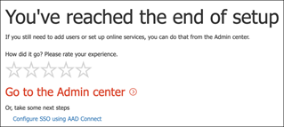

# Uw proefversie van Microsoft Threat Protection instellen 

**Geldt voor:**
- Microsoft Threat Protection 

Het maken van een Microsoft Threat Protection trial lab omgeving en het implementeren ervan is een proces in drie fasen:

 
<table border="0" width="100%" align="center">
  <tr style="text-align:center;">
    <td align="center" style="width:25%; border:0;" >
      <a href= "https://docs.microsoft.com/microsoft-365/security/mtp/prepare-mtpeval?view=o365-worldwide"> 
        
       Fase 1: Voorbereiden</a> 
    </td>
     <td align="center"bgcolor="#d5f5e3">
      <a href="https://docs.microsoft.com/microsoft-365/security/mtp/setup-mtpeval?view=o365-worldwide">
        
       Fase 2: Setup</a> 
    </td>
    <td align="center">
      <a href="https://docs.microsoft.com/microsoft-365/security/mtp/config-mtpeval?view=o365-worldwide">
        
       Fase 3: & configureren</a> 
</td>

  </tr>
</table>

U bevindt zich momenteel in de fase van de set-up. Voer de eerste stappen uit om toegang te krijgen tot Microsoft 365 Security Center en stel vervolgens uw proeflabomgeving in.

Meld u aan voor een Office 365- of Azure Active Directory-abonnement om een *.onmicrosoft.com* tenant te genereren waarmee u zich aanmelden voor uw Microsoft 365 E5-licentie. 

>[!NOTE]
>Als u al een bestaand Office 365- of Azure Active Directory-abonnement hebt, u de stappen voor het maken van de proefversie van Office 365 E5 overslaan.

In deze fase wordt u begeleid naar:
- Een proefversietenant van Office 365 E5 maken
- Microsoft 365-proefabonnement inschakelen

## Een proefversietenant van Office 365 E5 maken
>[!NOTE]
>Als u al een bestaand Office 365- of Azure Active Directory-abonnement hebt, u de stappen voor het maken van de proefversie van Office 365 E5 overslaan.

1. Ga naar de [Productportal van Office 365 E5](https://www.microsoft.com/microsoft-365/business/office-365-enterprise-e5-business-software?activetab=pivot%3aoverviewtab) en selecteer **Gratis proefversie**.
  
  
2. Voltooi de proefregistratie door uw e-mailadres (persoonlijk of zakelijk) in te voeren. Klik **op Account instellen**.
   

3. Vul uw voornaam, achternaam, zakelijk telefoonnummer, bedrijfsnaam, bedrijfsgrootte en land of regio in.  
   
>[!NOTE]
>Het land of de regio die u hier instelt, bepaalt de datacenterregio die uw Office 365 ontvangt.
  
4. Kies uw verificatievoorkeur: via een sms of oproep. Klik **op Verificatiecode verzenden**. 
  

5. Stel de aangepaste domeinnaam voor uw tenant in en klik op **Volgende**.
   
 
6. Stel de eerste identiteit in die een globale beheerder voor de tenant zal zijn. **Naam** en **wachtwoord**invullen . Klik **op Aanmelden**.
  

7. Klik **op Ga naar Setup** om de installatie van de Office 365 E5-proeftenant te voltooien.
   

8. Verbind uw bedrijfsdomein met de Office 365-tenant. [Optioneel] Kies **Een domein verbinden dat u al bezit** en typ uw domeinnaam. Klik op **Volgende**.
   
 
9. U moet een TXT- of MX-record toevoegen om het domeineigendom te valideren. Zodra u de TXT- of MX-record aan uw domein hebt toegevoegd, selecteert u **Verifiëren**.
   
 
10. [Optioneel] Maak meer gebruikersaccounts voor uw tenant. U deze stap overslaan door op **Volgende te**klikken.
  
 
11. [Optioneel] Office-apps downloaden. Klik **op Volgende** om deze stap over te slaan. 
   

12. [Optioneel] E-mailberichten migreren. Nogmaals, u deze stap overslaan.
   
 
13. Kies online services. Selecteer **Exchange** en klik op **Volgende**. 
   

14. Voeg MX-, CNAME- en TXT-records toe aan uw domein. Wanneer u klaar bent, selecteert u **Verifiëren**.
   
 
15. Gefeliciteerd, u hebt de inrichting van uw Office 365-tenant voltooid.
   

## Microsoft 365-proefabonnement inschakelen

>[!NOTE]
>Als u zich aanmeldt voor een proefversie, u een maand lang 25 gebruikerslicenties gebruiken. Zie [Een M365-abonnement uitproberen of kopen](https://docs.microsoft.com/microsoft-365/commerce/try-or-buy-microsoft-365?view=o365-worldwide#try-or-buy-a-microsoft-365-subscription-1) voor meer informatie.

1. Klik in [het Microsoft 365-beheercentrum](https://admin.microsoft.com/)op **Facturering** en navigeer vervolgens naar **Services kopen**.

2. Selecteer **Microsoft 365 E5** en klik op **Gratis proefversie starten**. 
  

3. Kies uw verificatievoorkeur: via een sms of oproep. Zodra u hebt besloten, voert u het telefoonnummer in, selecteert **u Tekst mij** of Bel **me** afhankelijk van uw selectie.
  
 
4. Voer de verificatiecode in en klik op **Uw gratis proefversie starten**. 
   

5. Klik **op Nu proberen** om uw Proefversie van Microsoft 365 E5 te bevestigen.
   
 
6. Ga naar de gebruikers van het **Microsoft 365-beheercentrum**  >  **Users**  >  **Actieve gebruikers**. Selecteer uw gebruikersaccount, selecteer **Productlicenties beheren**en wissel de licentie vervolgens om van Office 365 E5 naar **Microsoft 365 E5**. Klik op **Opslaan**.
  
 
7. Selecteer het globale beheerdersaccount opnieuw en klik op **Gebruikersnaam beheren**.
   

8. [Optioneel] Wijzig het domein van *onmicrosoft.com* naar uw eigen domein, afhankelijk van wat u in de vorige stappen hebt gekozen. Klik op **Wijzigingen opslaan**.
   

## Volgende stap
||| |:-------|:-----|config-onboard.png)  [Fase 3: & aan boord configureren](config-mtpeval.md) | Configureer elke microsoft threat protection-pijler voor uw Microsoft Threat Protection-proeflabomgeving en aan boord van uw eindpunten.
