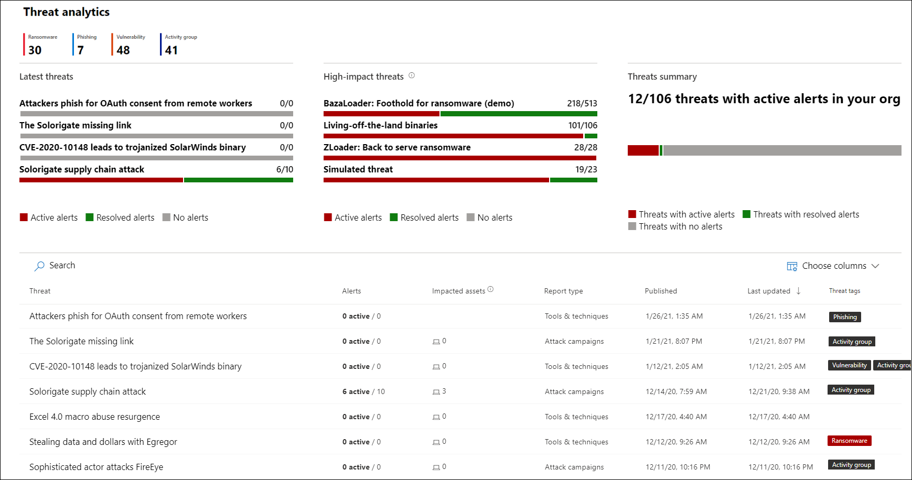
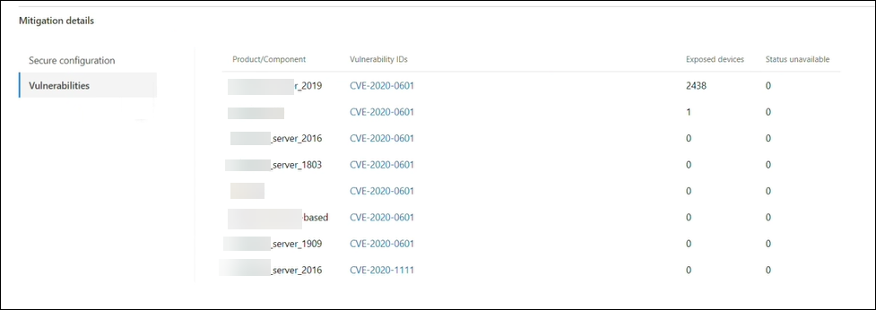

# Nieuwe bedreigingen bijhouden en beantwoorden met bedreigingsanalyseTrack and respond to emerging threats with threat analytics 

[!INCLUDE [Microsoft 365 Defender rebranding](../includes/microsoft-defender.md)]

**Van toepassing op:****Applies to:**
- Microsoft 365 DefenderMicrosoft 365 Defender

> Wilt u Microsoft 365 Defender ervaren?Want to experience Microsoft 365 Defender? U kunt [het project evalueren in een labomgeving](./mtp-evaluation.md?ocid=cx-docs-MTPtriallab) of uw [pilotproject uitvoeren in productie.](./mtp-pilot.md?ocid=cx-evalpilot)You can [evaluate it in a lab environment](./mtp-evaluation.md?ocid=cx-docs-MTPtriallab) or [run your pilot project in production](./mtp-pilot.md?ocid=cx-evalpilot).
>

[!INCLUDE [Prerelease](../includes/prerelease.md)]

Bedreigingsanalyse is onze in-product threat intelligence-oplossing van deskundige Microsoft-beveiligingsonderzoekers, ontworpen om beveiligingsteams te helpen zo efficiënt mogelijk te werken terwijl ze geconfronteerd worden met nieuwe bedreigingen, zoals:Threat analytics is our in-product threat intelligence solution from expert Microsoft security researchers, designed to assist security teams to be as efficient as possible while facing emerging threats, including:

- Actieve bedreigingsacteurs en hun campagnesActive threat actors and their campaigns
- Populaire en nieuwe aanvalstechniekenPopular and new attack techniques
- Kritieke beveiligingslekkenCritical vulnerabilities
- Veelvoorkomende aanvalsoppervlakkenCommon attack surfaces
- Voorkomende malwarePrevalent malware

Bekijk deze korte video voor meer informatie over hoe u met bedreigingsanalyse de meest recente bedreigingen kunt bijhouden en stoppen.Watch this short video to learn more about how threat analytics can help you track the latest threats and stop them.

>[!VIDEO https://www.microsoft.com/en-us/videoplayer/embed/RWwJfU]

U hebt toegang tot bedreigingsanalyse via de linkerbovenhoek van de navigatiebalk van de Microsoft 365-beveiligingsportal of via een speciale dashboardkaart met de belangrijkste bedreigingen in uw organisatie. Als u inzicht krijgt in actieve of lopende campagnes en weet wat u moet doen via bedreigingsanalyses, kunt u uw beveiligingsteam voorzien van weloverwogen beslissingen.You can access threat analytics either from the upper left-hand side of Microsoft 365 security portal’s navigation bar, or from a dedicated dashboard card which shows the top threats in your org. Getting visibility on active or ongoing campaigns and knowing what to do through threat analytics can help equip your security operations team with informed decisions. 

_Waar toegang tot bedreigingsanalyse__Where to access threat analytics_

Met geavanceerdere tegenstanders en nieuwe bedreigingen die regelmatig en regelmatig verschijnen, is het essentieel om snel te kunnen:With more sophisticated adversaries and new threats emerging frequently and prevalently, it's critical to be able to quickly:

- Nieuwe bedreigingen identificeren en erop reagerenIdentify and react to emerging threats 
- Informatie over of u momenteel wordt aangevallenLearn if you are currently under attack
- Het effect van de bedreiging voor uw activa beoordelenAssess the impact of the threat to your assets
- Uw tolerantie voor of blootstelling aan de bedreigingen controlerenReview your resilience against or exposure to the threats
- Identificeer de risicobeperkings-, herstel- of preventieacties die u kunt ondernemen om de bedreigingen te stoppen of te bevattenIdentify the mitigation, recovery, or prevention actions you can take to stop or contain the threats

Elk rapport bevat een analyse van een bijgespoorde bedreiging en uitgebreide richtlijnen voor het beschermen tegen die bedreiging.Each report provides an analysis of a tracked threat and extensive guidance on how to defend against that threat. Het bevat ook gegevens uit uw netwerk, waarmee wordt aangegeven of de bedreiging actief is en of u over toepasselijke beveiliging beschikt.It also incorporates data from your network, indicating whether the threat is active and if you have applicable protections in place.

## Het dashboard bedreigingsanalyse bekijkenView the threat analytics dashboard

In het dashboard bedreigingsanalyse[(security.microsoft.com/threatanalytics3)](https://security.microsoft.com/threatanalytics3)worden de rapporten belicht die het meest relevant zijn voor uw organisatie.The threat analytics dashboard ([security.microsoft.com/threatanalytics3](https://security.microsoft.com/threatanalytics3)) highlights the reports that are most relevant to your organization. De bedreigingen worden in de volgende secties samengevat:It summarizes the threats in the following sections:

- **Meest recente bedreigingen:** bevat de meest recent gepubliceerde of bijgewerkte bedreigingsrapporten, samen met het aantal actieve en opgeloste waarschuwingen.**Latest threats**—lists the most recently published or updated threat reports, along with the number of active and resolved alerts.
- **Bedreigingen met een hoge** impact : hier worden de bedreigingen vermeld die de grootste impact hebben op uw organisatie.**High-impact threats**—lists the threats that have the highest impact to your organization. In deze sectie worden eerst bedreigingen met het hoogste aantal actieve en opgeloste waarschuwingen vermeld.This section lists threats with the highest number of active and resolved alerts first.
- **Overzicht van** bedreigingen: geeft de algehele impact van alle bijgespoorde bedreigingen door het aantal bedreigingen met actieve en opgeloste waarschuwingen weer te geven.**Threat summary**—provides the overall impact of all tracked threats by showing the number of threats with active and resolved alerts.

Selecteer een bedreiging in het dashboard om het rapport voor die bedreiging weer te geven.Select a threat from the dashboard to view the report for that threat.

_Dashboard Bedreigingsanalyse. U kunt ook op het pictogram Zoeken klikken om een sleutel te geven in een trefwoord dat betrekking heeft op het rapport bedreigingsanalyse dat u wilt lezen.__Threat analytics dashboard. You can also click the Search icon to key in a keyword related to the threat analytics report that you'd like to read._ 

## Een bedreigingsanalyserapport weergevenView a threat analytics report

Elk bedreigingsanalyserapport bevat informatie in verschillende secties:Each threat analytics report provides information in several sections: 

- [**Overzicht****Overview**](#overview-quickly-understand-the-threat-assess-its-impact-and-review-defenses) 
- [**Analistrapport****Analyst report**](#analyst-report-get-expert-insight-from-microsoft-security-researchers)
- [**Gerelateerde incidenten****Related incidents**](#related-incidents-view-and-manage-related-incidents)
- [**Beïnvloede activa****Impacted assets**](#impacted-assets-get-list-of-impacted-devices-and-mailboxes)
- [**E-mailpogingen voorkomen****Prevented email attempts**](#prevented-email-attempts-view-blocked-or-junked-threat-emails)
- [**Risico's****Mitigations**](#mitigations-review-list-of-mitigations-and-the-status-of-your-devices)

### Overzicht: Snel inzicht krijgen in de bedreiging, de impact ervan beoordelen en verdedigingslinie bekijkenOverview: Quickly understand the threat, assess its impact, and review defenses

De **sectie** Overzicht bevat een voorbeeld van het gedetailleerde analistenrapport.The **Overview** section provides a preview of the detailed analyst report. Het bevat ook grafieken die de impact van de bedreiging voor uw organisatie en uw blootstelling markeren via verkeerd geconfigureerde en ongepatchte apparaten.It also provides charts that highlight the impact of the threat to your organization and your exposure through misconfigured and unpatched devices.

_Overzichtssectie van een rapport voor bedreigingsanalyse__Overview section of a threat analytics report_

#### De impact op uw organisatie beoordelenAssess impact on your organization
Elk rapport bevat grafieken die zijn ontworpen om informatie te verstrekken over de invloed van een bedreiging op de organisatie:Each report includes charts designed to provide information about the organizational impact of a threat:
- **Gerelateerde incidenten**: geeft een overzicht van de impact van de bijgespoorde bedreiging voor uw organisatie met de volgende gegevens:**Related incidents**—provides an overview of the impact of the tracked threat to your organization with the following data:
  - Aantal actieve waarschuwingen en het aantal actieve incidenten dat aan deze meldingen is gekoppeldNumber of active alerts and the number of active incidents they are associated with
  - Ernst van actieve incidentenSeverity of active incidents
- **Waarschuwingen in de tijd**: toont het aantal gerelateerde **actieve** en **opgeloste** waarschuwingen in de tijd.**Alerts over time**—shows the number of related **Active** and **Resolved** alerts over time. Het aantal opgeloste waarschuwingen geeft aan hoe snel uw organisatie reageert op waarschuwingen die zijn gekoppeld aan een bedreiging.The number of resolved alerts indicates how quickly your organization responds to alerts associated with a threat. In het ideale kader moet de grafiek binnen enkele dagen waarschuwingen weergeven die zijn opgelost.Ideally, the chart should be showing alerts resolved within a few days.
- **Beïnvloede activa:** toont het aantal verschillende apparaten en e-mailaccounts (postvakken) dat momenteel ten minste één actieve waarschuwing aan de bijgespoorde bedreiging heeft gekoppeld.**Impacted assets**—shows the number of distinct devices and email accounts (mailboxes) that currently have at least one active alert associated with the tracked threat. Waarschuwingen worden geactiveerd voor postvakken die e-mailberichten met bedreigingen hebben ontvangen.Alerts are triggered for mailboxes that received threat emails. Controleer zowel het beleid op organisatie- als gebruikersniveau voor overschrijven die de bezorging van e-mailberichten met bedreigingen veroorzaken.Review both org- and user-level policies for overrides that cause the delivery of threat emails.
- **E-mailpogingen voorkomen:** toont het aantal e-mailberichten van de afgelopen zeven dagen dat vóór de bezorging is geblokkeerd of die zijn bezorgd in de map ongewenste e-mail.**Prevented email attempts**—shows the number of emails from the past seven days that were either blocked before delivery or delivered to the junk mail folder.

#### Beveiligingsweerbaarheid en -houding controlerenReview security resilience and posture
Elk rapport bevat grafieken die een overzicht geven van hoe veerkrachtig uw organisatie is tegen een bepaalde bedreiging:Each report includes charts that provide an overview of how resilient your organization is against a given threat:
- **Veilige configuratiestatus:** toont het aantal apparaten met verkeerd geconfigureerde beveiligingsinstellingen.**Secure configuration status**—shows the number of devices with misconfigured security settings. Pas de aanbevolen beveiligingsinstellingen toe om de bedreiging te beperken.Apply the recommended security settings to help mitigate the threat. Apparaten worden beschouwd **als Veilig** als ze alle _bijgespoorde_ instellingen hebben toegepast.Devices are considered **Secure** if they have applied _all_ the tracked settings.
- **Beveiligingspatchingstatus**: geeft het aantal kwetsbare apparaten weer.**Vulnerability patching status**—shows the number of vulnerable devices. Pas beveiligingsupdates of patches toe om beveiligingsproblemen aan te pakken die door de bedreiging worden misbruikt.Apply security updates or patches to address vulnerabilities exploited by the threat.

### Analistrapport: Krijg inzicht van microsoft-beveiligingsonderzoekersAnalyst report: Get expert insight from Microsoft security researchers
Lees in **de sectie Rapportanalist** de gedetailleerde expert-write-up door.In the **Analyst report** section, read through the detailed expert write-up. De meeste rapporten bevatten gedetailleerde beschrijvingen van aanvalsketens, waaronder tactieken en technieken die zijn toegesneden op het MITRE ATT&CK-framework, uitgebreide lijsten met aanbevelingen en krachtige richtlijnen voor het zoeken naar [bedreigingen.](advanced-hunting-overview.md)Most reports provide detailed descriptions of attack chains, including tactics and techniques mapped to the MITRE ATT&CK framework, exhaustive lists of recommendations, and powerful [threat hunting](advanced-hunting-overview.md) guidance.

[Meer informatie over het analistenrapportLearn more about the analyst report](threat-analytics-analyst-reports.md)

### Verwante incidenten: Gerelateerde incidenten weergeven en beherenRelated incidents: View and manage related incidents
Het **tabblad Gerelateerde incidenten** bevat de lijst met alle incidenten met betrekking tot de bijgespoorde bedreiging.The **Related incidents** tab provides the list of all incidents related to the tracked threat. U kunt incidenten toewijzen of waarschuwingen beheren die aan elk incident zijn gekoppeld.You can assign incidents or manage alerts linked to each incident. 

_Sectie Verwante incidenten van een rapport over bedreigingsanalyse__Related incidents section of a threat analytics report_

### Beïnvloede activa: Lijst met beïnvloede apparaten en postvakkenImpacted assets: Get list of impacted devices and mailboxes
Een activum wordt als beïnvloed beschouwd als het wordt beïnvloed door een actieve, niet-opgeloste waarschuwing.An asset is considered impacted if it is affected by an active, unresolved alert. Het **tabblad Beïnvloede activa** bevat de volgende typen beïnvloede activa:The **Impacted assets** tab lists the following types of impacted assets:
- **Beïnvloede apparaten:** eindpunten met niet-opgeloste waarschuwingen van Microsoft Defender voor eindpunten.**Impacted devices**—endpoints that have unresolved Microsoft Defender for Endpoint alerts. Deze waarschuwingen worden meestal gebruikt voor waarnemingen van bekende bedreigingsindicatoren en -activiteiten.These alerts typically fire on sightings of known threat indicators and activities.
- **Beïnvloede postvakken:** postvakken die e-mailberichten hebben ontvangen die microsoft Defender voor Office 365-waarschuwingen hebben geactiveerd.**Impacted mailboxes**—mailboxes that have received email messages that have triggered Microsoft Defender for Office 365 alerts. Hoewel de meeste berichten die waarschuwingen activeren meestal worden geblokkeerd, kunnen beleidsregels op gebruikers- of organisatieniveau filters overschrijven.While most messages that trigger alerts are typically blocked, user- or org-level policies can override filters.

_Sectie Beïnvloede activa van een rapport voor bedreigingsanalyse__Impacted assets section of a threat analytics report_

### E-mailpogingen voorkomen: geblokkeerde of ongewenste e-mailberichten weergevenPrevented email attempts: View blocked or junked threat emails
Microsoft Defender voor Office 365 blokkeert meestal e-mailberichten met bekende bedreigingsindicatoren, waaronder schadelijke koppelingen of bijlagen.Microsoft Defender for Office 365 typically blocks emails with known threat indicators, including malicious links or attachments. In sommige gevallen worden met proactieve filtermechanismen die controleren op verdachte inhoud, in plaats daarvan e-mailberichten met bedreigingen naar de map ongewenste e-mail verzonden.In some cases, proactive filtering mechanisms that check for suspicious content will instead send threat emails to the junk mail folder. In beide gevallen is de kans op het starten van malwarecode voor bedreigingen op het apparaat kleiner.In either case, the chances of the threat launching malware code on the device is reduced.

Op **het tabblad Pogingen voor e-mail** voorkomen worden alle e-mailberichten weergegeven die vóór de bezorging zijn geblokkeerd of die door Microsoft Defender voor Office 365 naar de map ongewenste e-mail zijn verzonden.The **Prevented email attempts** tab lists all the emails that have either been blocked before delivery or sent to the junk mail folder by Microsoft Defender for Office 365. 

_Sectie E-mailpogingen voorkomen in een rapport voor bedreigingsanalyse__Prevented email attempts section of a threat analytics report_

### Risicobeperking: Lijst met risico's en de status van uw apparaten controlerenMitigations: Review list of mitigations and the status of your devices
Bekijk in **de sectie Mitigaties** de lijst met specifieke actie-aanbevelingen die u kunnen helpen uw organisatieweerbaarheid tegen de bedreiging te vergroten.In the **Mitigations** section, review the list of specific actionable recommendations that can help you increase your organizational resilience against the threat. De lijst met bijgespoorde risico's bevat:The list of tracked mitigations includes:

- **Beveiligingsupdates**: implementatie van ondersteunde softwarebeveiligingsupdates voor beveiligingsproblemen die zijn gevonden op onboarded-apparaten**Security updates**—deployment of supported software security updates for vulnerabilities found on onboarded devices
- **Ondersteunde beveiligingsconfiguraties****Supported security configurations**
  - Beveiliging in de cloudCloud-delivered protection  
  - Potentieel ongewenste toepassingsbeveiliging (PUA)Potentially unwanted application (PUA) protection
  - Realtime beveiligingReal-time protection
 
Mitigatiegegevens in deze sectie bevatten gegevens van bedreigings- en kwetsbaarheidsbeheer, die ook gedetailleerde inzoomgegevens bevatten van verschillende koppelingen in het rapport.Mitigation information in this section incorporates data from [threat and vulnerability management](/windows/security/threat-protection/microsoft-defender-atp/next-gen-threat-and-vuln-mgt), which also provides detailed drill-down information from various links in the report.

 

_Sectie Risicobeperking van een rapport voor bedreigingsanalyse__Mitigations section of a threat analytics report_

## Aanvullende rapportdetails en -beperkingenAdditional report details and limitations
>[!NOTE]
>Als onderdeel van de geïntegreerde beveiligingservaring is bedreigingsanalyse nu niet alleen beschikbaar voor Microsoft Defender voor Eindpunt, maar ook voor licentiehouders van Microsoft Defender voor Office E5.As part of the unified security experience, threat analytics is now available not just for Microsoft Defender for Endpoint, but also for Microsoft Defender for Office E5 license holders.
>Als u de Microsoft 365-beveiligingsportal (Microsoft 365 Defender) niet gebruikt, kunt u ook de rapportdetails (zonder de Microsoft Defender voor Office-gegevens) zien in de Microsoft Defender-beveiligingscentrumportal (Microsoft Defender voor Eindpunt).If you are not using the Microsoft 365 security portal (Microsoft 365 Defender), you can also see the report details (without the Microsoft Defender for Office data) in the Microsoft Defender Security Center portal (Microsoft Defender for Endpoint). 

Voor toegang tot het rapport Bedreigingsanalyse hebt u bepaalde rollen en machtigingen nodig.To access threat analytics report you need certain roles and permissions. Zie [Aangepaste rollen in op rollen gebaseerd toegangsbeheer voor Microsoft 365 Defender voor](custom-roles.md) meer informatie.See [Custom roles in role-based access control for Microsoft 365 Defender](custom-roles.md) for details.
  - Als u waarschuwingen, incidenten of beïnvloede activagegevens wilt weergeven, moet u machtigingen hebben voor Microsoft Defender voor Office of Microsoft Defender voor eindpuntwaarschuwingen, of beide.To view alerts, incidents, or impacted assets data, you need to have permissions to Microsoft Defender for Office or Microsoft Defender for Endpoint alerts data, or both.
  - Als u verhinderde e-mailpogingen wilt bekijken, moet u machtigingen hebben voor microsoft Defender voor Office-gegevens.To view prevented email attempts, you need to have permissions to Microsoft Defender for Office hunting data. 
  - Als u risicobeperking wilt weergeven, moet u over machtigingen voor gegevens voor bedreigings- en kwetsbaarheidsbeheer in Microsoft Defender voor Eindpunt zijn.To view mitigations, you need to have permissions to threat and vulnerability management data in Microsoft Defender for Endpoint.

Houd rekening met de volgende factoren bij het bekijken van de bedreigingsanalysegegevens:When looking at the threat analytics data, remember the following factors:
- Grafieken geven alleen risico's weer die worden bijgespoord.Charts reflect only mitigations that are tracked. Controleer het rapportoverzicht op aanvullende risico's die niet in de grafieken worden weergegeven.Check the report overview for additional mitigations that are not shown in the charts.
- Risicobeperking garandeert geen volledige tolerantie.Mitigations don't guarantee complete resilience. De geleverde risico's weerspiegelen de best mogelijke acties die nodig zijn om de tolerantie te verbeteren.The provided mitigations reflect the best possible actions needed to improve resiliency.
- Apparaten worden geteld als 'niet beschikbaar' als ze geen gegevens naar de service hebben verzonden.Devices are counted as "unavailable" if they have not transmitted data to the service.
- Antivirusgerelateerde statistieken zijn gebaseerd op de antivirusinstellingen van Microsoft Defender.Antivirus-related statistics are based on Microsoft Defender Antivirus settings. Apparaten met antivirusoplossingen van derden kunnen worden weergegeven als 'blootgesteld'.Devices with third-party antivirus solutions can appear as "exposed".

## Verwante onderwerpenRelated topics
- [Proactief bedreigingen zoeken met geavanceerde jachtProactively find threats with advanced hunting](advanced-hunting-overview.md) 
- [De sectie Analistrapport begrijpenUnderstand the analyst report section](threat-analytics-analyst-reports.md)
- [Beveiligingszwakheden en blootstellingen beoordelen en oplossenAssess and resolve security weaknesses and exposures](/windows/security/threat-protection/microsoft-defender-atp/next-gen-threat-and-vuln-mgt)