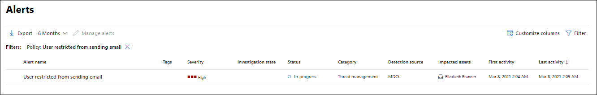
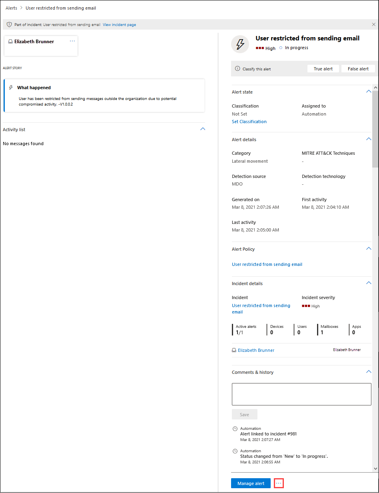

# Gecompromitteerde gebruikersaccounts adresseerde met geautomatiseerde onderzoeken en antwoorden

**Van toepassing op**
- [Exchange Online Protection](exchange-online-protection-overview.md)
- [Abonnement 1 en abonnement 2 voor Microsoft Defender voor Office 365](defender-for-office-365.md)
- [Microsoft 365 Defender](../defender/microsoft-365-defender.md)

[Microsoft Defender voor Office 365 Plan 2](defender-for-office-365.md#microsoft-defender-for-office-365-plan-1-and-plan-2) bevat krachtige air-mogelijkheden (Automated [Investigation and Response).](office-365-air.md) Dergelijke mogelijkheden kunnen uw beveiligingsbewerkingsteam veel tijd en moeite besparen bij het omgaan met bedreigingen. Microsoft blijft de beveiligingsmogelijkheden verbeteren. Onlangs zijn de AIR-mogelijkheden uitgebreid met een gecompromitteerde playbook voor gebruikersbeveiliging (momenteel in preview). Lees dit artikel voor meer informatie over de gecompromitteerde playbook voor gebruikersbeveiliging. En zie het blogbericht [Beperk](https://techcommunity.microsoft.com/t5/Security-Privacy-and-Compliance/Speed-up-time-to-detect-and-respond-to-user-compromise-and-limit/ba-p/977053) de tijd om gebruikerscompromitteerd gedrag op te sporen en te beantwoorden en het bereik van inbreuken met Microsoft Defender te beperken Office 365 voor meer informatie.

Met de gecompromitteerde playbook voor gebruikersbeveiliging kan het beveiligingsteam van uw organisatie het volgende doen:

- De detectie van gecompromitteerde gebruikersaccounts versnellen;
- Beperk het bereik van een inbreuk wanneer een account wordt gecompromitteerd; en
- Reageer effectiever en efficiënter op gecompromitteerde gebruikers.

## Meldingen van gecompromitteerde gebruikers

Wanneer een gebruikersaccount wordt gecompromitteerd, treden atypische of afwijkende gedragingen op. Phishing- en spamberichten kunnen bijvoorbeeld intern worden verzonden vanuit een vertrouwd gebruikersaccount. Defender voor Office 365 dergelijke afwijkingen in e-mailpatronen en samenwerkingsactiviteit binnen de Office 365. Wanneer dit gebeurt, worden waarschuwingen geactiveerd en wordt het risicobeperkingsproces gestart.

Hier ziet u bijvoorbeeld een waarschuwing die is geactiveerd vanwege verdachte e-mail verzenden:

En hier is een voorbeeld van een waarschuwing die is geactiveerd wanneer een verzendende limiet voor een gebruiker is bereikt:

## Een gecompromitteerde gebruiker onderzoeken en hierop reageren

Wanneer een gebruikersaccount wordt gecompromitteerd, worden waarschuwingen geactiveerd. En in sommige gevallen wordt dat gebruikersaccount geblokkeerd en kunnen er geen verdere e-mailberichten worden verzonden totdat het probleem is opgelost door het beveiligingsteam van uw organisatie. In andere gevallen wordt een geautomatiseerd onderzoek gestart dat kan leiden tot aanbevolen acties die uw beveiligingsteam moet uitvoeren.

- [Beperkte gebruikers weergeven en onderzoeken](#view-and-investigate-restricted-users)

- [Details over geautomatiseerde onderzoeken weergeven](#view-details-about-automated-investigations)

> [!IMPORTANT]
> U moet de juiste machtigingen hebben om de volgende taken uit te voeren. Zie [Vereiste machtigingen voor het gebruik van AIR-mogelijkheden.](office-365-air.md#required-permissions-to-use-air-capabilities)

### Beperkte gebruikers weergeven en onderzoeken

U hebt een paar opties voor het navigeren naar een lijst met beperkte gebruikers. In de Microsoft 365 Defender portal kunt u bijvoorbeeld naar **E-mail** & Beperkte gebruikers \>  \> **controleren.** In de volgende procedure wordt navigatie beschreven **met** behulp van het dashboard Waarschuwingen. Dit is een goede manier om verschillende soorten waarschuwingen te zien die mogelijk zijn geactiveerd.

1. Open de Microsoft 365 Defender portal <https://security.microsoft.com> () en ga naar **Incidenten & waarschuwingen** \> **Waarschuwingen.** Of als u rechtstreeks naar de pagina **Waarschuwingen wilt** gaan, gebruikt <https://security.microsoft.com/alerts> u .

2. Filter op **de pagina** Waarschuwingen de resultaten op tijdsperiode en het beleid met de naam Gebruiker beperkt het verzenden **van e-mail.**

   

3. Als u het item selecteert door  op de naam te klikken, wordt een gebruiker die geen e-mailpagina mag verzenden, geopend met aanvullende informatie die u kunt controleren. Naast de knop Waarschuwing **beheren** kunt u klikken op Pictogram Meer opties Meer opties en vervolgens Beperkte gebruikersgegevens weergeven selecteren om naar de pagina Beperkte gebruikers te gaan, waar u de beperkte gebruiker   [vrijgeven.](removing-user-from-restricted-users-portal-after-spam.md)  

   

### Details over geautomatiseerde onderzoeken weergeven

Wanneer een geautomatiseerd onderzoek is gestart, kunt u de details en resultaten ervan zien in het & Compliance center. Ga naar **Threat Management** \> **Investigations** en selecteer vervolgens een onderzoek om de details ervan weer te geven.

Zie Details van een onderzoek weergeven voor [meer informatie.](air-view-investigation-results.md)

## Houd rekening met de volgende punten

- **Blijf op de hoogte van uw waarschuwingen.** Zoals u weet, hoe langer een compromis niet wordt gedetecteerd, hoe groter de kans op grootschalige gevolgen en kosten voor uw organisatie, klanten en partners. Vroegtijdige detectie en tijdige reactie zijn essentieel om bedreigingen te beperken, vooral wanneer het account van een gebruiker wordt gehackt.

- Automatisering helpt uw team voor beveiligingsbewerkingen, maar **vervangt deze niet.** Met geautomatiseerde onderzoeks- en antwoordmogelijkheden kan een gecompromitteerde gebruiker al vroeg worden gedetecteerd, maar uw team voor beveiligingsbewerkingen moet waarschijnlijk onderzoek doen en herstellen. Hebt u hier hulp bij nodig? Zie [Acties controleren en goedkeuren.](air-review-approve-pending-completed-actions.md)

- **Vertrouw niet op een verdachte aanmeldingsmelding als enige indicator.** Wanneer een gebruikersaccount is gehackt, kan dit een verdachte aanmeldingsmelding al dan niet activeren. Soms is het de reeks activiteiten die plaatsvinden nadat een account is gecompromitteerd, die een waarschuwing activeert. Wilt u meer weten over waarschuwingen? Zie [Waarschuwingsbeleid](../../compliance/alert-policies.md).

## Volgende stappen

- [De vereiste machtigingen controleren voor het gebruik van AIR-mogelijkheden](office-365-air.md#required-permissions-to-use-air-capabilities)

- [Schadelijke e-mail zoeken en onderzoeken in Office 365](investigate-malicious-email-that-was-delivered.md)

- [Meer informatie over AIR in Microsoft Defender voor Eindpunt](/windows/security/threat-protection/microsoft-defender-atp/automated-investigations)

- [Ga naar Microsoft 365 routekaart om te zien wat er binnenkort komt en uit te rollen](https://www.microsoft.com/microsoft-365/roadmap?filters=)