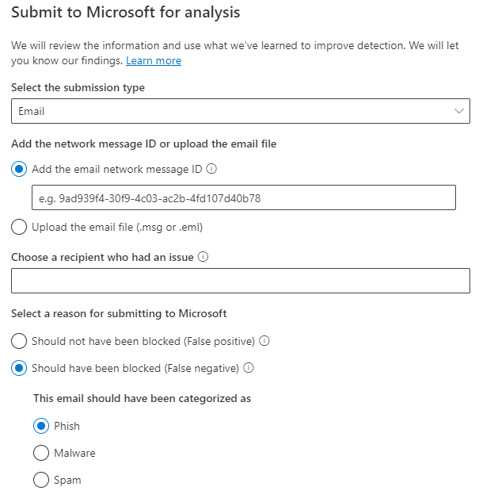

# Beheerdersinzending gebruiken om verdachte spam, phish, URL's en bestanden naar Microsoft te verzenden

[!INCLUDE [Microsoft 365 Defender rebranding](../includes/microsoft-defender-for-office.md)]

**Van toepassing op**
- [Exchange Online Protection](exchange-online-protection-overview.md)
- [Abonnement 1 en abonnement 2 voor Microsoft Defender voor Office 365](defender-for-office-365.md)

In Microsoft 365 organisaties met Exchange Online-postvakken kunnen beheerders de portal Inzendingen in de Microsoft 365 Defender-portal gebruiken om e-mailberichten, URL's en bijlagen bij Microsoft in te dienen voor scannen.

Wanneer u een e-mailbericht indient, krijgt u het volgende:

- **Controle voor e-mailverificatie:** Details over het al dan niet geslaagd zijn van e-mailverificatie wanneer deze is bezorgd.
- **Beleidstreffers:** Informatie over beleidsregels die de inkomende e-mail mogelijk hebben toegestaan of geblokkeerd in uw tenant, waardoor onze servicefilters worden overgenomen.
- **Payload reputation/detonation**: Onderzoek van URL's en bijlagen in het bericht.
- **Beoordelingsanalyse:** controleren door menselijke cijferaars om te controleren of berichten schadelijk zijn of niet.

> [!IMPORTANT]
> Payload reputation/detonation and grader analysis are not done in all tenants. Informatie wordt geblokkeerd om buiten de organisatie te gaan wanneer gegevens niet de tenantgrens moeten verlaten voor nalevingsdoeleinden.

Zie Berichten en bestanden rapporteren bij Microsoft voor andere manieren om e-mailberichten, URL's en bijlagen bij [Microsoft in te dienen.](report-junk-email-messages-to-microsoft.md)

## Wat moet u weten voordat u begint?

- U opent de Microsoft 365 Defender-portal bij <https://security.microsoft.com/>. Als u rechtstreeks naar de pagina **Inzendingen wilt** gaan, gebruikt u <https://security.microsoft.com/reportsubmission> .

- Als u berichten en bestanden wilt verzenden naar Microsoft, moet u lid zijn van een van de volgende rollengroepen:
  - **Organisatiebeheer** of **Beveiligingslezer** in de [Microsoft 365 Defender portal.](permissions-microsoft-365-security-center.md)
  
    Houd er rekening mee dat lidmaatschap van deze rollengroep vereist is om gebruikersinzendingen in het aangepaste [postvak](#view-user-submissions-to-microsoft) weer te geven, zoals verder wordt beschreven in dit artikel.

- Zie Berichten en bestanden rapporteren bij Microsoft voor meer informatie over hoe gebruikers berichten en bestanden kunnen indienen [bij Microsoft.](report-junk-email-messages-to-microsoft.md)

## Verdachte inhoud rapporteren aan Microsoft

1. Ga in Microsoft 365 Defender portal naar **E-mail &** \> **samenwerkingsinzendingen.**

2. Controleer op **de pagina Inzendingen** of het tabblad Ingediend voor analyse is geselecteerd en klik vervolgens op   **analyse.**

3. Gebruik de **flyout Verzenden bij Microsoft** voor controle die wordt weergegeven om het bericht, de URL of de e-mailbijlage in te dienen, zoals beschreven in de volgende secties.

### Een twijfelachtige e-mail verzenden naar Microsoft

1. Controleer in **het vak Selecteer het inzendingstype** of **E-mail** is geselecteerd in de vervolgkeuzelijst.

2. Gebruik een van de volgende opties in de sectie **Netwerkbericht-id toevoegen** of het e-mailbestand uploaden:
   - **De** e-mailnetwerkbericht-id toevoegen: dit is een GUID-waarde die beschikbaar is in de koptekst **X-MS-Exchange-Organization-Network-Message-Id** in het bericht of in de **X-MS-Office365-Filtering-Correlation-Id-header** in in quarantaine geplaatste berichten.
   - **Upload het e-mailbestand (.msg of .eml)**: Klik op **Bestanden bladeren.** Zoek en selecteer in het dialoogvenster dat wordt geopend het .eml- of .msg-bestand en klik vervolgens op **Openen.**

   > [!NOTE]
   > De mogelijkheid om berichten zo oud als 30 dagen in te dienen, is tijdelijk opgeschort voor Defender voor Office 365 klanten. Beheerders kunnen slechts 7 dagen teruggaan.

3. Geef in **het vak Kies een geadresseerde met een probleem** de geadresseerde op tegen wie u een beleidscontrole wilt uitvoeren. Met de beleidscontrole wordt bepaald of het scannen per e-mail is overgeslagen vanwege gebruikers- of organisatiebeleid.

4. Selecteer in **de sectie Selecteer** een reden voor het indienen bij Microsoft een van de volgende opties:
   - **Had niet moeten worden geblokkeerd (onwaar positief)**
   - **Moet zijn geblokkeerd:** Selecteer  een van de volgende waarden (als u het niet zeker weet, gebruik uw beste beoordeling) in de sectie Het e-mailbericht moet zijn gecategoriseerd als sectie die wordt weergegeven:
     - **Phishing**
     - **Spam**
     - **Malware**

5. Wanneer u klaar bent, klikt u op de **knop** Verzenden.

> [!div class="mx-imgBorder"]
> 

### Een verdachte URL naar Microsoft verzenden

1. Selecteer url in de vervolgkeuzelijst **in** het vak Selecteer het inzendingstype. 

2. Voer in het vak **URL** dat wordt weergegeven de volledige URL in `https://www.fabrikam.com/marketing.html` (bijvoorbeeld).

3. Selecteer in **de sectie Selecteer** een reden voor het indienen bij Microsoft een van de volgende opties:
   - **Had niet moeten worden geblokkeerd (onwaar positief)**
   - **Moet zijn geblokkeerd:** Selecteer **Phish** of Malware in de sectie Deze **URL** moet zijn gecategoriseerd als sectie die wordt **weergegeven.**

4. Wanneer u klaar bent, klikt u op de **knop** Verzenden.

> [!div class="mx-imgBorder"]
> 

### Een verdachte e-mailbijlage indienen bij Microsoft

1. Selecteer bestand in de vervolgkeuzelijst in het vak Selecteer het  **inzendingstype.**

2. Klik in **de** sectie Bestand die wordt weergegeven op **Bestanden bladeren.** Zoek en selecteer het bestand in het dialoogvenster dat wordt geopend en klik vervolgens op **Openen.**

3. Selecteer in **de sectie Selecteer** een reden voor het indienen bij Microsoft een van de volgende opties:
   - **Had niet moeten worden geblokkeerd (onwaar positief)**
   - **Moet zijn geblokkeerd:** In de deze **URL** moet zijn gecategoriseerd als sectie die wordt weergegeven, **Malware** is de enige keuze en wordt automatisch geselecteerd.

4. Wanneer u klaar bent, klikt u op de **knop** Verzenden.

> [!div class="mx-imgBorder"]
> 

## Beheerdersinzendingen weergeven bij Microsoft

1. Ga in Microsoft 365 Defender portal naar **E-mail &** \> **samenwerkingsinzendingen.**

2. Controleer op **de pagina Inzendingen** of het tabblad **Ingediend voor analyse** is geselecteerd.

   - U kunt de items sorteren door op een beschikbare kolomkop te klikken. Klik **op Kolommen aanpassen** om maximaal zeven kolommen weer te geven. Standaardwaarden worden aangegeven met een sterretje (\*):
     - **Inzendingsnaam**\*
     - **Afzender**\*
     - **Verzonden datum**\*
     - **Inzendingstype**\*
     - **Reden voor het indienen**\*
     - **Status opnieuw scannen**\*
     - **Resultaat opnieuw scannen**\*
     - **Filter-uitspraak**
     - **Reden voor bezorging/blokkering**
     - **Inzending-id**
     - **Netwerkbericht-id/object-id**
     - **Richting**
     - **Ip-afzender**
     - **Bulk compliant level (BCL)**
     - **Destination**
     - **Beleidsactie**
     - **Ingediend door**

     Wanneer u klaar bent, klikt u op **Toepassen.**

   - Als u de items wilt filteren, klikt u op **Filteren.** De beschikbare filters zijn:
     - **Verzonden datum**: **Begindatum** en **einddatum**.
     - **Inzendingstype:** **E-mail,** **URL** of **Bestand.**
     - **Inzending-id:** een GUID-waarde die aan elke inzending is toegewezen.
     - **Netwerkbericht-id**
     - **Afzender**

     Wanneer u klaar bent, klikt u op **Toepassen.**

     > [!div class="mx-imgBorder"]
     > 

   - Als u de items wilt groepeert, klikt u **op Groep** en selecteert u een van de volgende waarden in de vervolgkeuzelijst:
     - **Geen**
     - **Type**
     - **Reden**
     - **Status**
     - **Resultaat opnieuw scannen**

   - Als u de items wilt exporteren, klikt u op **Exporteren.** Sla in het dialoogvenster dat wordt weergegeven het .csv op.

### Details van de inzending van beheerders opnieuw scannen

Berichten die worden verzonden in beheerdersinzendingen, worden beoordeeld en de resultaten worden weergegeven in de flyout details van de inzendingen:

- Of er tijdens de levering een fout zat in de e-mailverificatie van de afzender.
- Informatie over eventuele beleidstreffers die het oordeel over een bericht kunnen hebben beïnvloed of overschreven.
- Huidige deactiveringsresultaten om te zien of de URL's of bestanden in het bericht schadelijk waren of niet.
- Feedback van cijferaars.

Als een overschrijving is gevonden, zou het opnieuw scannen in enkele minuten moeten zijn voltooid. Als er geen probleem was bij e-mailverificatie of bezorging werd niet beïnvloed door een overschrijven, kan de feedback van cijferaars maximaal een dag duren.

## Gebruikersinzendingen weergeven bij Microsoft

Als u de invoegvoeging Rapportbericht , de [invoeging](enable-the-report-message-add-in.md) [Phishing](enable-the-report-phish-add-in.md)melden of personen de [ingebouwde](report-junk-email-and-phishing-scams-in-outlook-on-the-web-eop.md)rapportage in webversie van Outlook hebt  geïmplementeerd, kunt u zien wat gebruikers rapporteren op het tabblad Bericht van gebruiker gerapporteerd.

1. Ga in Microsoft 365 Defender portal naar **E-mail &** \> **samenwerkingsinzendingen.**

2. Selecteer op **de pagina Inzendingen** het tabblad **Gerapporteerde berichten van gebruiker.**

   - U kunt de items sorteren door op een beschikbare kolomkop te klikken. Klik **op Kolommen aanpassen** om maximaal zeven kolommen weer te geven. Standaardwaarden worden aangegeven met een sterretje (\*):

     - **Onderwerp e-mail**\*
     - **Gerapporteerd door**\*
     - **Datum gerapporteerd**\*
     - **Afzender**\*
     - **Gerapporteerde reden**\*
     - **Resultaat opnieuw scannen**\*
     - **Bericht gerapporteerde id**
     - **Netwerkbericht-id**
     - **Ip-afzender**
     - **Phish-simulatie**

     Wanneer u klaar bent, klikt u op **Toepassen.**

   - Als u de items wilt filteren, klikt u op **Filteren.** De beschikbare filters zijn:
     - **Datum gerapporteerd**: **Begindatum** en **einddatum**.
     - **Gerapporteerd door**
     - **E-mail onderwerp**
     - **Bericht gerapporteerde id**
     - **Netwerkbericht-id**
     - **Afzender**
     - **Gerapporteerde reden:** **Geen ongewenste** e-mail, **Phish** of **Spam.**
     - **Phish-simulatie:** **Ja** of **Nee**

     Wanneer u klaar bent, klikt u op **Toepassen.**

     > [!div class="mx-imgBorder"]
     > 

   - Als u de items wilt groepeert, klikt u **op Groep** en selecteert u een van de volgende waarden in de vervolgkeuzelijst:
     - **Geen**
     - **Reden**
     - **Afzender**
     - **Gerapporteerd door**
     - **Resultaat opnieuw scannen**
     - **Phish-simulatie**

   - Als u de items wilt exporteren, klikt u op **Exporteren.** Sla in het dialoogvenster dat wordt weergegeven het .csv op.

> [!NOTE]
> Als organisaties zijn geconfigureerd om alleen gerapporteerde berichten van gebruikers naar het aangepaste postvak te verzenden, worden gerapporteerde berichten niet opnieuw verzonden en zijn de resultaten in **door** de gebruiker gerapporteerde berichten altijd leeg.

### Gebruikersinzendingen ongedaan maken

Wanneer een gebruiker een verdachte e-mail naar het aangepaste postvak heeft verzonden, hebben de gebruiker en beheerder geen optie om de inzending ongedaan te maken. Als de gebruiker de e-mail wil herstellen, is deze beschikbaar voor herstel in de mappen Verwijderde items of Ongewenste e-mail.

### Berichten verzenden naar Microsoft vanuit het aangepaste postvak

Als u het aangepaste postvak hebt geconfigureerd om door de gebruiker gerapporteerde berichten te onderscheppen zonder de berichten naar Microsoft te verzenden, kunt u specifieke berichten zoeken en verzenden naar Microsoft voor analyse. Hiermee wordt een inzending van een gebruiker daadwerkelijk verplaatst naar een beheerdersinzending.

Selecteer op **het tabblad Gerapporteerde** berichten van gebruiker een bericht in de lijst, klik op Verzenden bij **Microsoft** voor analyse en selecteer vervolgens een van de volgende waarden in de vervolgkeuzelijst:

- **Rapport opschoon**
- **Phishing melden**
- **Malware rapporteren**
- **Spam rapporteren**
- **Onderzoek starten**

> [!div class="mx-imgBorder"]
> 
