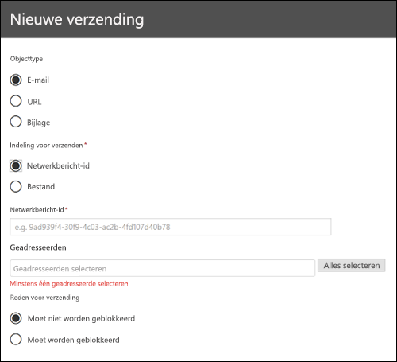
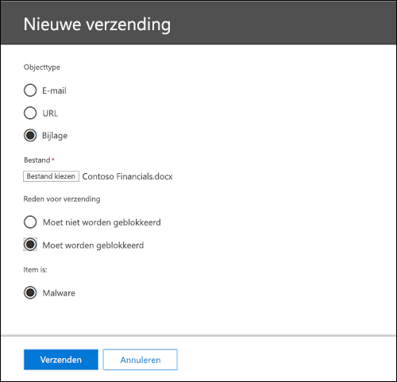
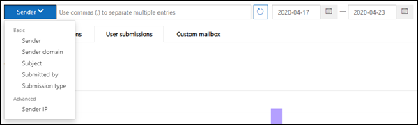
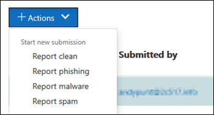

# Gebruik beheer ter verzending om verdachte spam, phishing, Url's en bestanden bij Microsoft te verzenden.Use Admin Submission to submit suspected spam, phish, URLs, and files to Microsoft

In Microsoft 365-organisaties met postvakken in Exchange Online kunnen beheerders de portal voor ingediende vragen in het beveiligings & nalevings centrum gebruiken voor het verzenden van e-mailberichten, Url's en bijlagen bij Microsoft voor het scannen.In Microsoft 365 organizations with mailboxes in Exchange Online, admins can use the Submissions portal in the Security & Compliance Center to submit email messages, URLs, and attachments to Microsoft for scanning.

Wanneer u een e-mailbericht verzendt, krijgt u informatie over de beleidsregels die de inkomende e-mail in uw Tenant hebben toegestaan en van het onderzoek van Url's en bijlagen in het e-mailbericht.When you submit an email, you will get information about any policies that may have allowed the incoming email into your tenant, as well as examination of any URLs and attachments in the mail. Beleidsregels die een e-mailbericht kunnen hebben, bestaan uit de lijst met veilige afzenders van een individuele gebruiker en beleid voor tenantniveau, zoals Exchange-e-mail stroom regels (ook wel transport-regels genoemd).Policies that may have allowed a mail include an individual user's safe sender list as well as tenant level policies such as Exchange mail flow rules (also known as transport rules).

Zie [berichten en bestanden rapporteren aan Microsoft](report-junk-email-messages-to-microsoft.md)voor andere manieren om e-mailberichten, url's en bijlagen bij Microsoft in te dienen.For other ways to submit email messages, URLs, and attachments to Microsoft, see [Report messages and files to Microsoft](report-junk-email-messages-to-microsoft.md).

## Wat moet u weten voordat u begint?What do you need to know before you begin?

- U opent het Beveiligings- en compliancecentrum in <https://protection.office.com/>.You open the Security & Compliance Center at <https://protection.office.com/>. Als u rechtstreeks naar de **Verzend** pagina wilt gaan, gebruikt u <https://protection.office.com/reportsubmission> .To go directly to the **Submission** page, use <https://protection.office.com/reportsubmission>.

- U moet beschikken over bepaalde machtigingen om de procedures in dit onderwerp te kunnen uitvoeren:You need to be assigned permissions before you can do the procedures in this topic:

  - Als u berichten en bestanden bij Microsoft wilt verzenden, moet u lid zijn van een van de volgende rollen groepen:To submit messages and files to Microsoft, you need to be a member of one of the following role groups:

    - **Organisatiebeheer** of **Beveiligingsbeheerder** in het [Beveiligings- en compliancecentrum](permissions-in-the-security-and-compliance-center.md).**Organization Management** or **Security Administrator** in the [Security & Compliance Center](permissions-in-the-security-and-compliance-center.md).
    - **Organisatiebeheer** of **Hygiënebeheer** in [Exchange Online](https://docs.microsoft.com/Exchange/permissions-exo/permissions-exo#role-groups).**Organization Management** or **Hygiene Management** in [Exchange Online](https://docs.microsoft.com/Exchange/permissions-exo/permissions-exo#role-groups).

  - Voor alleen-lezen toegang tot de portal van ingediende items moet u lid zijn van een van de volgende rollen groepen:For read-only access to the Submissions portal, you need to be a member of one of the following role groups:

    - **Beveiligingslezer** in het [Beveiligings- en compliancecentrum](permissions-in-the-security-and-compliance-center.md).**Security Reader** in the [Security & Compliance Center](permissions-in-the-security-and-compliance-center.md).
    - **Alleen-lezen organisatiebeheer** in [Exchange Online](https://docs.microsoft.com/Exchange/permissions-exo/permissions-exo#role-groups).**View-Only Organization Management** in [Exchange Online](https://docs.microsoft.com/Exchange/permissions-exo/permissions-exo#role-groups).

- Zie [berichten en bestanden rapporteren aan Microsoft](report-junk-email-messages-to-microsoft.md)voor meer informatie over hoe gebruikers berichten en bestanden kunnen indienen bij Microsoft.For more information about how users can submit messages and files to Microsoft, see [Report messages and files to Microsoft](report-junk-email-messages-to-microsoft.md).

## Verdachte inhoud rapporteren aan MicrosoftReport suspicious content to Microsoft

1. Ga in het beveiligings & compliance naar beheerberichten voor **risicobeheer** door \> **geven** \> **Admin submission messages**.In the Security & Compliance Center, go to **Threat management** \> **Review** \> **Admin submission messages**.

2. Op de pagina **items** die wordt weergegeven, klikt u op de knop **nieuwe aanvraag** .On the **Submissions** page that appears, click the **New submission** button.

3. Gebruik de nieuwe flyout voor **indienen** die wordt weergegeven om het bericht, de URL of de bijlage te verzenden, zoals beschreven in de volgende secties.Use **New submission** flyout that appears to submit the message, URL, or attachment as described in the following sections.

### Een dubieuze e-mail naar Microsoft verzendenSubmit a questionable email to Microsoft

1. Selecteer in de sectie **object type** de optie **e-mail**.In the **Object type** section, select **Email**. Gebruik een van de volgende opties in de sectie **opmaak van indiening** .In the **Submission format** section, use one of the following options:

   - **Netwerkbericht-id**: dit is een GUID-waarde die beschikbaar is in de header **X-MS-Exchange-Organization-Network-Message-ID** in het bericht.**Network Message ID**: This is a GUID value that's available in the **X-MS-Exchange-Organization-Network-Message-Id** header in the message.

   - **Bestand**: Klik op **bestand kiezen**.**File**: Click **Choose file**. In het dialoogvenster dat wordt geopend, zoekt en selecteert u het bestand. eml of. msg en klikt u vervolgens op **openen**.In the dialog that opens, find and select the .eml or .msg file, and then click **Open**.

2. Geef in de sectie **geadresseerden** een of meer geadresseerden op waarvoor u een beleid wilt uitvoeren.In the **Recipients** section, specify one or more recipients that you would like to run a policy check against. Met de beleidscontrole wordt bepaald of het e-mailbericht dat wordt genegeerd vanwege het beleid van de gebruiker of organisatie.The policy check will determine if the email bypassed scanning due to user or organization policies.

3. Selecteer een van de volgende opties in de sectie **reden voor indiening** .In the **Reason for submission** section, select one of the following options:

   - **Mag niet zijn geblokkeerd****Should not have been blocked**

   - **Is geblokkeerd**: Selecteer **spam**, **phishing**of **malware**.**Should have been blocked**: Select **Spam**, **Phishing**, or **Malware**. Als u niet zeker weet of u niet weet, kunt u het beste de beste beslissing gebruiken.If you're not sure, use your best judgment.

4. Als het filter werd genegeerd vanwege beleidsregels bij het verzenden, ziet u informatie over dat beleid.If the filter was bypassed due to policies upon submission, you'll see information about that policy.

   Als het filter niet door een of meer beleidsregels werd genegeerd, wordt de scan over enkele minuten voltooid.If the filter was not bypassed due to one or more policies, the scan will complete in several minutes. Als u op de koppeling naar de status klikt, ziet u aanvullende informatie over de verzending.You'll see additional information about the submission by clicking on the status link. Dit omvat de resultaten van de beleidscontrole en de rescan-Verdict.This includes the results of the policy check and the rescan verdict. Opmerking Hiermee wordt de e-mail niet uitgevoerd via de Office 365 ATP-stack voor volledig filteren, maar wordt een gedeeltelijk herscan uitgevoerd op basis van bepaalde kenmerken van de e-mail, URL of het bestand.Note this does not run the email through the Office 365 ATP full filtering stack again but runs a partial rescan based on certain attributes of the mail, URL, or file.

5. Wanneer u klaar bent, klikt u op de knop **verzenden** .When you're finished, click the **Submit** button.

### Een verdachte URL naar Microsoft verzendenSend a suspect URL to Microsoft

1. Selecteer in de sectie **object type** de optie **URL**.In the **Object type** section, select **URL**. Voer in het vak dat wordt weergegeven, de volledige URL in (bijvoorbeeld <https://www.fabrikam.com/marketing.html> ).In the box that appears, enter the full URL (for example, <https://www.fabrikam.com/marketing.html>).

2. Selecteer een van de volgende opties in de sectie **reden voor indiening** .In the **Reason for submission** section, select one of the following options:

   - **Mag niet zijn geblokkeerd****Should not have been blocked**

   - **Moet zijn geblokkeerd**: Selecteer **phishing** of **malware**.**Should have been blocked**: Select **Phishing** or **Malware**.

3. Wanneer u klaar bent, klikt u op de knop **verzenden** .When you're finished, click the **Submit** button.

### Een verdacht bestand bij Microsoft indienenSubmit a suspected file to Microsoft

1. Selecteer in de sectie **object type** de optie **bijlage**.In the **Object type** section, select **Attachment**.

2. Klik op **bestand kiezen**.Click **Choose File**. In het dialoogvenster dat wordt weergegeven, zoekt en selecteert u het bestand en klikt u vervolgens op **openen**.In the dialog that opens, find and select the file, and then click **Open**.

3. Selecteer een van de volgende opties in de sectie **reden voor indiening** .In the **Reason for submission** section, select one of the following options:

   - **Mag niet zijn geblokkeerd****Should not have been blocked**

   - Is **geblokkeerd**: **malware** is de enige keuze en wordt automatisch geselecteerd...**Should have been blocked**: **Malware** is the only choice, and is automatically selected..

4. Wanneer u klaar bent, klikt u op de knop **verzenden** .When you're finished, click the **Submit** button.

## Beheerders inzendingen weergevenView admin submissions

1. Ga in het beveiligings & compliance naar beheerberichten voor **risicobeheer** door \> **geven** \> **Admin submission messages**.In the Security & Compliance Center, go to **Threat management** \> **Review** \> **Admin submission messages**.

2. Op de pagina **items** die wordt weergegeven, controleert u of het tabblad **beheerder submissies** is geselecteerd.On the **Submissions** page that appears, verify that the **Admin submissions** tab is selected.

Boven aan de pagina kunt u een begindatum, een einddatum en (standaard) filteren met **id voor indienen** (een GUID-waarde die is toegewezen aan elke verzending) door een waarde in te voeren in het vak en op de  .Near the top of the page, you can enter a start date, an end date, and (by default) you can filter by **Submission ID** (a GUID value that's assigned to every submission) by entering a value in the box and clicking . U kunt meerdere waarden opgeven, gescheiden door komma's.You can enter multiple values separated by commas.

Als u de filtercriteria wilt wijzigen, klikt u op de knop voor de **leverings-id** en kiest u een van de volgende waarden:To change the filter criteria, click the **Submission ID** button and choose one of the following values:

- **Afzender****Sender**
- **Onderwerp/URL/bestandsnaam****Subject/URL/File name**
- **Verzonden door****Submitted by**
- **Type levering****Submission type**
- **Status****Status**

Als u de resultaten wilt exporteren, klikt u boven aan de pagina op **exporteren** en selecteert u gegevens of **tabellen**van de **grafiek** .To export the results, click **Export** near the top of the page and select **Chart data** or **Table**. Sla het CSV-bestand op in het dialoogvenster dat wordt weergegeven.In the dialog that appears, save the .csv file.

Onder de grafiek bevinden zich drie tabbladen: **e-mail** (standaard), **URL**en **bijlage**.Below the graph, there are three tabs: **Email** (default), **URL**, and **Attachment**.

### E-mail inzendingen van de beheerder weergevenView admin email submissions

Selecteer het tabblad **e-mail** .Click the **Email** tab.

U kunt op de knop **kolom opties** onder aan de pagina klikken om kolommen toe te voegen aan of te verwijderen uit de weergave:You can click the **Column options** button near the bottom of the page to add or remove columns from the view:

- **Einddatum****Date**
- **Ingediende id**: een GUID-waarde die is toegewezen aan elke verzending.**Submission ID**: A GUID value that's assigned to every submission.
- **Verzonden door**\***Submitted by**\*
- **Onderwerp**\***Subject**\*
- **Afzender****Sender**
- **IP van afzender**\***Sender IP**\*
- **Type levering****Submission type**
- **Bezorgings reden****Delivery reason**
- **Status**\***Status**\*
- **Typebesturingselement****Control type**
- **Besturingselementbron****Control source**

  \*Als u op deze waarde klikt, wordt er meer informatie weergegeven in een flyout.\* If you click this value, detailed information is displayed in a flyout.

### Ingediende items van de beheerders-URL weergevenView admin URL submissions

Klik op het tabblad **URL** .Click the **URL** tab.

U kunt op de knop **kolom opties** onder aan de pagina klikken om kolommen toe te voegen aan of te verwijderen uit de weergave:You can click the **Column options** button near the bottom of the page to add or remove columns from the view:

- **Einddatum****Date**
- **Verzendings-ID****Submission ID**
- **Verzonden door**\***Submitted by**\*
- **URL**\***URL**\*
- **Type levering****Submission type**
- **Status**\***Status**\*

  \*Als u op deze waarde klikt, wordt er meer informatie weergegeven in een flyout.\* If you click this value, detailed information is displayed in a flyout.

### Ingediende beheerders bijlagen weergevenView admin attachment submissions

Klik op het tabblad **bijlagen** .Click the **Attachments** tab.

U kunt op de knop **kolom opties** onder aan de pagina klikken om kolommen toe te voegen aan of te verwijderen uit de weergave:You can click the **Column options** button near the bottom of the page to add or remove columns from the view:

- **Einddatum****Date**
- **Verzendings-ID****Submission ID**
- **Verzonden door**\***Submitted by**\*
- **Bestandsnaam**\***File name**\*
- **Type levering****Submission type**
- **Status**\***Status**\*

  \*Als u op deze waarde klikt, wordt er meer informatie weergegeven in een flyout.\* If you click this value, detailed information is displayed in a flyout.

## Naar Microsoft verzonden gebruikers inzendingen weergevenView user submissions to Microsoft

Als u de [invoegtoepassing bericht rapporteren](enable-the-report-message-add-in.md)hebt geïmplementeerd of personen de [ingebouwde rapporten gebruiken in de webversie van Outlook](report-junk-email-and-phishing-scams-in-outlook-on-the-web-eop.md), kunt u zien wat gebruikers rapporteren op het tabblad **gebruikers** namen.If you've deployed the [Report Message add-in](enable-the-report-message-add-in.md), or people use the [built-in reporting in Outlook on the web](report-junk-email-and-phishing-scams-in-outlook-on-the-web-eop.md), you can see what users are reporting on the **User submissions** tab.

1. Ga in het beveiligings & compliance naar beheerberichten voor **risicobeheer** door \> **geven** \> **Admin submission messages**.In the Security & Compliance Center, go to **Threat management** \> **Review** \> **Admin submission messages**.

2. Op de pagina **items** die wordt weergegeven, klikt u op het tabblad **gebruikers items** .On the **Submissions** page that appears, click the **User submissions** tab.

U kunt op de knop **kolom opties** onder aan de pagina klikken om kolommen toe te voegen aan of te verwijderen uit de weergave:You can click the **Column options** button near the bottom of the page to add or remove columns from the view:

- **Ingediend op****Submitted on**
- **Verzonden door**\***Submitted by**\*
- **Onderwerp**\***Subject**\*
- **Afzender****Sender**
- **IP van afzender**\***Sender IP**\*
- **Type levering****Submission type**

\*Als u op deze waarde klikt, wordt er meer informatie weergegeven in een flyout.\* If you click this value, detailed information is displayed in a flyout.

Boven aan de pagina kunt u een begindatum, een einddatum en (standaard) u kunt filteren op **afzender** door een waarde in te voeren in het vak en op de  .Near the top of the page, you can enter a start date, an end date, and (by default) you can filter by **Sender** by entering a value in the box and clicking . U kunt meerdere waarden opgeven, gescheiden door komma's.You can enter multiple values separated by commas.

Als u de filtercriteria wilt wijzigen, klikt u op de knop **afzender** en kiest u een van de volgende waarden:To change the filter criteria, click the **Sender** button and choose one of the following values:

- **Afzenderdomein****Sender domain**
- **Onderwerp****Subject**
- **Verzonden door****Submitted by**
- **Type levering****Submission type**
- **IP van afzender****Sender IP**

Als u de resultaten wilt exporteren, klikt u boven aan de pagina op **exporteren** en selecteert u gegevens of **tabellen**van de **grafiek** .To export the results, click **Export** near the top of the page and select **Chart data** or **Table**. Sla het CSV-bestand op in het dialoogvenster dat wordt weergegeven.In the dialog that appears, save the .csv file.

## Gebruikers inzendingen weergeven voor het aangepaste PostvakView user submissions to the custom mailbox

Als u [een aangepast postvak hebt geconfigureerd](user-submission.md) om door de gebruiker gerapporteerde berichten te ontvangen, kunt u berichten weergeven en ook verzenden die zijn bezorgd in het rapportage postvak.If you've [configured a custom mailbox](user-submission.md) to receive user reported messages, you can view and also submit messages that were delivered to the reporting mailbox.

1. Ga in het beveiligings & compliance naar beheerberichten voor **risicobeheer** door \> **geven** \> **Admin submission messages**.In the Security & Compliance Center, go to **Threat management** \> **Review** \> **Admin submission messages**.

2. Op de pagina **items** die wordt weergegeven, klikt u op het tabblad **aangepast postvak** .On the **Submissions** page that appears, click the **Custom mailbox** tab.

U kunt op de knop **kolom opties** onder aan de pagina klikken om kolommen toe te voegen aan of te verwijderen uit de weergave:You can click the **Column options** button near the bottom of the page to add or remove columns from the view:

- **Ingediend op****Submitted on**
- **Verzonden door**\***Submitted by**\*
- **Onderwerp**\***Subject**\*
- **Afzender****Sender**
- **IP van afzender**\***Sender IP**\*
- **Type levering****Submission type**

Boven aan de pagina kunt u een begindatum, een einddatum en u kunt filteren op **ingediend** door een waarde in te voeren in het vak en op de  .Near the top of the page, you can enter a start date, an end date, and you can filter by **Submitted by** by entering a value in the box and clicking . U kunt meerdere waarden opgeven, gescheiden door komma's.You can enter multiple values separated by commas.

Als u de resultaten wilt exporteren, klikt u boven aan de pagina op **exporteren** en selecteert u gegevens of **tabellen**van de **grafiek** .To export the results, click **Export** near the top of the page and select **Chart data** or **Table**. Sla het CSV-bestand op in het dialoogvenster dat wordt weergegeven.In the dialog that appears, save the .csv file.

### Berichten indienen bij Microsoft vanuit het aangepaste PostvakSubmit messages to Microsoft from the custom mailbox

Als u het aangepaste postvak hebt geconfigureerd om door de gebruiker gerapporteerde berichten te onderscheppen zonder de berichten naar Microsoft te verzenden, kunt u specifieke berichten zoeken en naar Microsoft voor analyse verzenden.If you've configured the custom mailbox to intercept user-reported messages without sending the messages to Microsoft, you can find and send specific messages to Microsoft for analysis. Hiermee verplaatst u een gebruiker bij het indienen van een beheerder.This effectively moves a user submission to an admin submission.

Selecteer op het tabblad **aangepast postvak** een bericht in de lijst, klik op de knop **actie** en voer een van de volgende opties uit:On the **Custom mailbox** tab, select a message in the list, click the **Action** button, and make one of the following selections:

- **Rapport opschonen****Report clean**
- **Phishing melden****Report phishing**
- **Malware melden****Report malware**
- **Spam rapporteren****Report spam**

