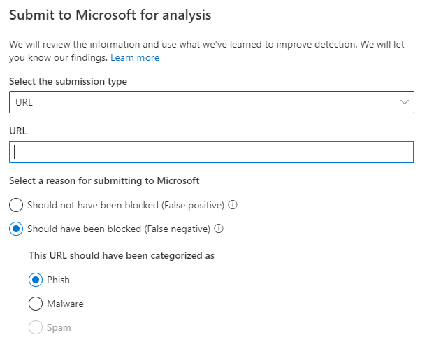

# Beheerbeheer gebruiken om vermoedelijke spam, phish, URL's en bestanden bij Microsoft in te dienen

Als u een beheerder bent in een Office 365-organisatie met postvakken in Exchange Online, u de portal Inzendingen in het Office 365 Security & Compliance Center gebruiken om e-mailberichten, URL's en bijlagen bij Microsoft in te dienen om te scannen.

Wanneer u een e-mail indient, ontvangt u informatie over het beleid dat de binnenkomende e-mail mogelijk in uw tenant heeft toegestaan, evenals het onderzoeken van URL's en bijlagen in de e-mail. Beleidsregels waarmee een e-mail mogelijk is toegestaan, bevatten de lijst met veilige afzenders van een individuele gebruiker en beleid op tenantniveau, zoals de regels voor de e-mailstroom van Exchange (ook wel transportregels genoemd).

Zie voor andere manieren om e-mailberichten, URL's en bijlagen bij Microsoft in te dienen 

## Wat moet u weten voordat u begint?

- U opent het Beveiligings- en compliancecentrum in <https://protection.office.com/>. Als u rechtstreeks naar de <https://protection.office.com/reportsubmission>pagina **Indiening** wilt gaan, gebruikt u .

- Zie [Verbinding maken met Exchange Online PowerShell](https://docs.microsoft.com/powershell/exchange/exchange-online/connect-to-exchange-online-powershell/connect-to-exchange-online-powershell) als u verbinding wilt maken met Exchange Online PowerShell. Zie [Verbinding maken met Exchange Online Protection PowerShell](https://docs.microsoft.com/powershell/exchange/exchange-eop/connect-to-exchange-online-protection-powershell) als u verbinding wilt maken met standalone Exchange Online Protection PowerShell.

- U moet beschikken over bepaalde machtigingen om deze procedures te kunnen uitvoeren. Als u antispambeleid wilt toevoegen, wijzigen en verwijderen, moet u lid zijn van de rolgroepen **Organisatiebeheer,** **Beveiligingsbeheerder**of **Beveiligingslezer.** Zie [Machtigingen in het Office 365-beveiligings- en compliancecentrum](permissions-in-the-security-and-compliance-center.md) voor meer informatie over groepen in het Beveiligings- en compliancecentrum.

- Zie Berichten en bestanden rapporteren aan Microsoft voor meer informatie over hoe gebruikers berichten en bestanden kunnen verzenden naar [Microsoft.](report-junk-email-messages-to-microsoft.md)

## Verdachte inhoud doorsturen naar het scannen van Microsoft voor Office 365

Als u inhoud wilt verzenden naar Microsoft, klikt u op de knop **Nieuwe indiening** in de linkerbovenhoek van de inzendingenpagina. Er wordt een flyout aan de rechterkant van de pagina weergegeven met de optie om een e-mail, URL of bestand in te dienen.

### Een twijfelachtige e-mail verzenden naar Microsoft

1. Als u een e-mail wilt verzenden, selecteert u **e-mail** en geeft u de e-mailbericht-id op of uploadt u het e-mailbestand. **network message ID**

2. Geef de ontvanger(s) op waartegen u de beleidscontrole wilt uitvoeren. De beleidscontrole bepaalt of de e-mail scannen omzeild als gevolg van gebruiker of tenant niveau beleid.

3. Geef op of de e-mail had moeten worden geblokkeerd of niet. Als de e-mail had moeten worden geblokkeerd, geeft u op of deze had moeten worden geblokkeerd als Spam, Phishing of Malware. Als u niet zeker weet welk type het zou kunnen zijn, gebruik dan uw beste oordeel.

   - Als het filter is omzeild vanwege het beleid bij indiening, ziet u informatie over dat beleid.

   - Als het filter niet is omzeild vanwege een of meer beleidsregels, wordt de scan binnen enkele minuten voltooid. U ziet aanvullende informatie over de indiening door op de statuskoppeling te klikken. Dit omvat de resultaten van de beleidscontrole en het rescanvonnis. Houd er rekening mee dat de e-mail niet opnieuw wordt uitgevoerd via de volledige filterstapel van Office 365 ATP, maar dat er een gedeeltelijke recan wordt uitgevoerd op basis van bepaalde kenmerken van de e-mail, URL of het bestand.

4. Klik **op Verzenden.**

### Een verdachte URL naar Microsoft verzenden

1. Als u een URL wilt verzenden, selecteert u **URL** in de flyout. Typ de volledige URL inclusief het protocol **(https://).**

   Als u Moet hebben **gefilterd,** geeft u op of de URL phishing of malware is.

2. Klik **op Verzenden.**

### Een verdacht bestand indienen bij Microsoft

1. Als u een bestand wilt verzenden, selecteert u **Bestand** uit de flyout en uploadt u het bestand dat u wilt scannen.

2. Klik **op Verzenden.**
