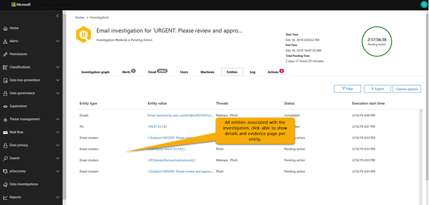

# Details en resultaten van een geautomatiseerd onderzoek in Office 365Details and results of an automated investigation in Office 365

Wanneer een [geautomatiseerd onderzoek](office-365-air.md) plaatsvindt in [Office 365 Advanced Threat Protection,](office-365-atp.md)zijn details over dat onderzoek beschikbaar tijdens en na het geautomatiseerde onderzoeksproces.When an [automated investigation](office-365-air.md) occurs in [Office 365 Advanced Threat Protection](office-365-atp.md), details about that investigation are available during and after the automated investigation process. Als u over de benodigde machtigingen beschikt, u deze gegevens bekijken in een weergave met onderzoeksdetails.If you have the necessary permissions, you can view those details in an investigation details view. De weergave onderzoeksdetails biedt u de up-to-date status en de mogelijkheid om alle lopende acties goed te keuren.The investigation details view provides you with up-to-date status and the ability to approve any pending actions. 

## Details van een onderzoek weergevenView details of an investigation

1. Ga [https://protection.office.com](https://protection.office.com) naar en meld je aan.Go to [https://protection.office.com](https://protection.office.com) and sign in. Dit brengt u naar het Security & Compliance Center.This takes you to the the Security & Compliance Center.

2. Voer een van de volgende handelingen uit:Do one of the following:

    - Ga naar **Threat Management** > **Dashboard**.Go to **Threat management** > **Dashboard**. Dit brengt u naar het [beveiligingsdashboard.](security-dashboard.md)This takes you to the [Security Dashboard](security-dashboard.md). Uw AIR-widgets worden boven aan het [beveiligingsdashboard](security-dashboard.md)weergegeven.Your AIR widgets appear across the top of the [Security Dashboard](security-dashboard.md). Selecteer een widget, zoals **overzicht Onderzoeken**.Select a widget, such as **Investigations summary**.

    - Ga naar **Threat Management** > **Investigations**.Go to **Threat management** > **Investigations**. 

    Beide methoden brengen je naar een lijst van onderzoeken.Either method takes you to a list of investigations.

     

3. Selecteer in de lijst met onderzoeken een item in de kolom **ID.**In the list of investigations, select an item in the **ID** column. Dit opent de pagina met onderzoeksdetails, te beginnen met de onderzoeksgrafiek in beeld.This opens investigation details page, starting with the investigation graph in view.

    

   Gebruik de verschillende tabbladen om meer te weten te komen over het onderzoek.Use the various tabs to learn more about the investigation.

## Details weergeven over een waarschuwing met betrekking tot een onderzoekView details about an alert related to an investigation

Bepaalde soorten waarschuwingen leiden tot geautomatiseerd onderzoek in Office 365.Certain kinds of alerts trigger automated investigation in Office 365. Zie [Waarschuwingen](automated-investigation-response-office.md#alerts)voor meer informatie.To learn more, see [Alerts](automated-investigation-response-office.md#alerts). Gebruik de volgende procedure om details over een waarschuwing te bekijken die is gekoppeld aan een geautomatiseerd onderzoek.Use the following procedure to view details about an alert that is associated with an automated investigation.

1. Ga [https://protection.office.com](https://protection.office.com) naar en meld je aan.Go to [https://protection.office.com](https://protection.office.com) and sign in. Dit brengt u naar het Security & Compliance Center.This takes you to the the Security & Compliance Center.

2. Ga naar **Threat Management** > **Investigations**.Go to **Threat management** > **Investigations**.

3. Selecteer in de lijst met onderzoeken een item in de kolom **ID.**In the list of investigations, select an item in the **ID** column. 

4. Als details van een onderzoek zijn geopend, selecteert u het tabblad **Waarschuwingen.** Alle waarschuwingen die het onderzoek hebben geactiveerd, worden hier vermeld.With details of an investigation open, select the **Alerts** tab. Any alerts that triggered the investigation are listed here.

5. Selecteer een item in de lijst.Select an item in the list. Er wordt een flyout geopend, met details over de waarschuwing en koppelingen naar aanvullende informatie en acties.A flyout opens, with details about the alert and links to additional information and actions.

6. Controleer de informatie over de flyout en onderneem, afhankelijk van de specifieke waarschuwing, een actie, zoals **Oplossen,** **Onderdrukken**of **Gebruikers op de hoogte stellen**.Review the information on the flyout, and, depending on the particular alert, take an action, such as **Resolve**, **Suppress**, or **Notify users**. 

    - **Oplossen** is gelijk aan het sluiten van een waarschuwing**Resolve** is equivalent to closing an alert
    
    - **Onderdrukken** zorgt ervoor dat een beleid gedurende een bepaalde periode geen waarschuwingen activeert**Suppress** causes a policy to not trigger alerts for a specified period of time
    
    - **Gebruikers op de hoogte** stellen start een e-mail met de e-mailadressen van gebruikers die al zijn ingevoerd en stelt uw beveiligingsteam in staat om een bericht aan die gebruikers te typen.**Notify users** starts an email with users' email addresses already entered, and enables your security operations team to type a message to those users. (Dit is vergelijkbaar met het verzenden van een bericht naar ontvangers met Behulp van [Threat Explorer](threat-explorer.md).)(This is similar to sending a message to recipients using [Threat Explorer](threat-explorer.md).)  

## De verschillende tabbladen gebruikenHow to use the various tabs

De volgende secties lopen u door de verschillende tabbladen op de geautomatiseerde onderzoeken pagina en hoe u de informatie gebruiken.The following sections walk you through the various tabs on the automated investigations page and how you can use the information.

### Pagina Geautomatiseerde onderzoekenAutomated investigations page

De pagina met geautomatiseerde onderzoeken toont de onderzoeken van uw organisatie en hun huidige status.The automated investigations page shows your organization's investigations and their current states.

 
  
U kunt:You can:
- Navigeer rechtstreeks naar een onderzoek (selecteer een **onderzoeks-id).**Navigate directly to an investigation (select an **Investigation ID**).
- Filters toepassen.Apply filters. Kies **uit Onderzoekstype,** **Tijdbereik,** **Status**of een combinatie hiervan.Choose from **Investigation Type**, **Time range**, **Status**, or a combination of these.
- Exporteer de gegevens naar een CSV-bestand.Export the data to a .csv file.

De onderzoeksstatus geeft de voortgang van de analyse en acties aan.The investigation status indicates the progress of the analysis and actions. Naarmate het onderzoek wordt uitgevoerd, verandert de status om aan te geven of er bedreigingen zijn gevonden en of acties zijn goedgekeurd.As the investigation runs, status changes to indicate whether threats were found, and whether actions have been approved. 

|StatusStatus  |Wat het betekentWhat it means  |
|---------|---------|
|StartenStarting | Het onderzoek is gestart en wacht om te beginnen met lopen.The investigation has been triggered and waiting to start running. Dit is de eerste stap.This is the first step. |
|MetRunning | Het onderzoek is gestart en is in volle gang.The investigation process has started and is underway. Deze status treedt ook op wanneer [lopende acties](https://docs.microsoft.com/microsoft-365/security/office-365-security/air-review-approve-pending-completed-actions#approve-or-reject-pending-actions) zijn goedgekeurd.This state also occurs when [pending actions](https://docs.microsoft.com/microsoft-365/security/office-365-security/air-review-approve-pending-completed-actions#approve-or-reject-pending-actions) are approved. |
|Geen bedreigingen gevondenNo Threats Found | Het onderzoek is voltooid en er zijn geen bedreigingen (gebruikersaccount, e-mailbericht, URL of bestand) geïdentificeerd.The investigation has finished and no threats (user account, email message, URL, or file) were identified.   **TIP:** Als u vermoedt dat er iets is gemist (zoals een vals negatief), u actie ondernemen met Behulp van [Threat Explorer](https://docs.microsoft.com/microsoft-365/security/office-365-security/threat-explorer).**TIP**: If you suspect something was missed (such as a false negative), you can take action using [Threat Explorer](https://docs.microsoft.com/microsoft-365/security/office-365-security/threat-explorer). |
|Beëindigd per systeemTerminated By System | Het onderzoek is gestopt.The investigation stopped. Dit kan om een aantal redenen gebeuren.This can happen for a number of reasons. Hier zijn de twee meest voorkomende redenen:Here are the two most common reasons: - De lopende acties van het onderzoek zijn verlopen.- The investigation's pending actions expired. In afwachting van acties time-out na in afwachting van goedkeuring voor een week.Pending actions time out after awaiting approval for one week.  - Er zijn te veel acties.- There are too many actions. Als er bijvoorbeeld te veel gebruikers op kwaadaardige URL's klikken, kan dit de mogelijkheid van het onderzoek om alle analysers uit te voeren, overschrijden, zodat het onderzoek wordt stopgezet.For example, if there are too many users clicking on malicious URLs, it can exceed the investigation's ability to run all the analyzers, so the investigation halts.   **TIP:** Als een onderzoek wordt gestopt voordat er acties zijn ondernomen, probeert u [Threat Explorer](https://docs.microsoft.com/microsoft-365/security/office-365-security/threat-explorer) te gebruiken om bedreigingen te vinden en aan te pakken.**TIP**: If an investigation halts before actions were taken, try using [Threat Explorer](https://docs.microsoft.com/microsoft-365/security/office-365-security/threat-explorer) to find and address threats.  |
|Actie in behandelingPending Action | Het onderzoek heeft een bedreiging gevonden, zoals een kwaadaardige e-mail, een kwaadaardige URL, of een riskante mailbox instelling, en een actie om die dreiging te verwerkte is in afwachting van [goedkeuring](https://docs.microsoft.com/microsoft-365/security/office-365-security/air-review-approve-pending-completed-actions).The investigation has found a threat, such as a malicious email, a malicious URL, or a risky mailbox setting, and an action to remediate that threat is awaiting [approval](https://docs.microsoft.com/microsoft-365/security/office-365-security/air-review-approve-pending-completed-actions).  De status In behandeling zijnde actie wordt geactiveerd wanneer een bedreiging met een overeenkomstige actie wordt gevonden; Houd er echter rekening mee dat het onderzoek mogelijk nog niet helemaal voltooid is.The Pending Action state is triggered when any threat with a corresponding action is found; however, note that the investigation might not be entirely complete yet.  Controleer het [onderzoekslogboek](https://docs.microsoft.com/microsoft-365/security/office-365-security/air-view-investigation-results#playbook-log) om te zien of andere items nog in behandeling zijn.Check the [investigation log](https://docs.microsoft.com/microsoft-365/security/office-365-security/air-view-investigation-results#playbook-log) to see if other items are still pending completion. |
|GesaneerdRemediated | Het onderzoek werd afgerond en alle acties werden goedgekeurd (volledig gesaneerd).The investigation finished and all actions were approved (fully remediated).  **OPMERKING**: Goedgekeurde herstelacties kunnen fouten bevatten die voorkomen dat de acties worden uitgevoerd.**NOTE**: Approved remediation actions can have errors that prevent the actions from being taken. Dit verandert niets aan de onderzoeksstatus.This does not change investigation status. Controleer het [onderzoekslogboek](https://docs.microsoft.com/microsoft-365/security/office-365-security/air-view-investigation-results) voor gedetailleerde resultaten.Check the [investigation log](https://docs.microsoft.com/microsoft-365/security/office-365-security/air-view-investigation-results) for detailed results. |
|Gedeeltelijk gesaneerdPartially Remediated | Het onderzoek resulteerde in saneringsacties, en sommige werden goedgekeurd en voltooid.The investigation resulted in remediation actions, and some were approved and completed. Andere acties zijn nog [in behandeling](https://docs.microsoft.com/microsoft-365/security/office-365-security/air-review-approve-pending-completed-actions).Other actions are still [pending](https://docs.microsoft.com/microsoft-365/security/office-365-security/air-review-approve-pending-completed-actions). |
|MisluktFailed | Ten minste een onderzoek analyzer liep in een probleem waar het niet goed kon voltooien.At least one investigation analyzer ran into a problem where it could not complete properly.   **OPMERKING**: Als een onderzoek mislukt nadat herstelacties zijn goedgekeurd, zijn de herstelacties mogelijk nog steeds geslaagd.**NOTE**: If an investigation fails after remediation actions were approved, the remediation actions might still have succeeded. Controleer het [onderzoekslogboek](https://docs.microsoft.com/microsoft-365/security/office-365-security/air-view-investigation-results) voor gedetailleerde resultaten.Check the [investigation log](https://docs.microsoft.com/microsoft-365/security/office-365-security/air-view-investigation-results) for detailed results. |
|In de wachtrij door throttlingQueued By Throttling | Een onderzoek staat in de rij.An investigation is being held in a queue. Wanneer andere onderzoeken zijn voltooid, beginnen onderzoeken in de wachtrij.When other investigations complete, queued investigations begin. Dit helpt slechte serviceprestaties te voorkomen.This helps avoid poor service performance.   **TIP:** Lopende acties kunnen beperken hoeveel nieuwe onderzoeken kunnen worden uitgevoerd.**TIP**: Pending actions can limit how many new investigations can run. Zorg ervoor dat [u in behandeling zijnde acties goedkeurt (of afwijst).](https://docs.microsoft.com/microsoft-365/security/office-365-security/air-review-approve-pending-completed-actions#approve-or-reject-pending-actions)Make sure to [approve (or reject) pending actions](https://docs.microsoft.com/microsoft-365/security/office-365-security/air-review-approve-pending-completed-actions#approve-or-reject-pending-actions). |
|Beëindigd door beperkingTerminated By Throttling | Als een onderzoek te lang in de wachtrij wordt gehouden, wordt het gestopt.If an investigation is held in the queue too long, it is stopped.   **TIP:** U [een onderzoek starten vanuit Threat Explorer.](https://docs.microsoft.com/microsoft-365/security/office-365-security/automated-investigation-response-office#example-a-security-administrator-triggers-an-investigation-from-threat-explorer)**TIP**: You can [start an investigation from Threat Explorer](https://docs.microsoft.com/microsoft-365/security/office-365-security/automated-investigation-response-office#example-a-security-administrator-triggers-an-investigation-from-threat-explorer). |

### OnderzoeksgrafiekInvestigation graph

Wanneer u een specifiek onderzoek opent, ziet u de pagina met de onderzoeksgrafiek.When you open a specific investigation, you see the investigation graph page. Op deze pagina worden alle verschillende entiteiten weergegeven: e-mailberichten, gebruikers (en hun activiteiten) en apparaten die automatisch zijn onderzocht als onderdeel van de waarschuwing die is geactiveerd.This page shows all the different entities: email messages, users (and their activities), and devices that were automatically investigated as part of the alert that was triggered.

U kunt:You can:
- Krijg een visueel overzicht van het huidige onderzoek.Get a visual overview of the current investigation.
- Bekijk een samenvatting van de duur van het onderzoek.View a summary of the investigation duration.
- Selecteer een knooppunt in de visualisatie om details voor dat knooppunt weer te geven.Select a node in the visualization to view details for that node.
- Selecteer een tabblad bovenom details voor dat tabblad weer te geven.Select a tab across the top to view details for that tab.

### WaarschuwingsonderzoekAlert investigation

Op het tabblad **Waarschuwingen** voor een onderzoek ziet u waarschuwingen die relevant zijn voor het onderzoek.On the **Alerts** tab for an investigation, you can see alerts relevant to the investigation. Details omvatten de waarschuwing die het onderzoek heeft geactiveerd en andere gecorreleerde waarschuwingen, zoals risicovolle aanmelding, DLP-beleidsschendingen, enz., die zijn gecorreleerd aan het onderzoek.Details include the alert that triggered the investigation and other correlated alerts, such as risky sign-in, DLP policy violations, etc., that are correlated to the investigation. Op deze pagina kan een beveiligingsanalist ook aanvullende details over afzonderlijke waarschuwingen bekijken.From this page, a security analyst can also view additional details on individual alerts.

U kunt:You can:
- Krijg een visueel overzicht van de huidige triggering alert en eventuele bijbehorende waarschuwingen.Get a visual overview of the current triggering alert and any associated alerts.
- Selecteer een waarschuwing in de lijst om een fly-outpagina te openen met volledige waarschuwingsgegevens.Select an alert in the list to open a fly-out page that shows full alert details.

### E-mailonderzoekEmail investigation

Op het tabblad **E-mail** voor een onderzoek ziet u de oorspronkelijke e-mails en de clusters van vergelijkbare e-mails die als onderdeel van het onderzoek zijn geïdentificeerd.On the **Email** tab for an investigation, you can see the original emails and the clusters of similar email identified as part of the investigation. 

Gezien de enorme hoeveelheid e-mail die gebruikers in een organisatie verzenden en ontvangen, plus de aard van e-mailcommunicatie en -aanvallen met meerdere gebruikers,Given the sheer volume of email that users in an organization send and receive, plus the multi-user nature of email communications and attacks, the process of 
- e-mailberichten clusteren op basis van vergelijkbare kenmerken van een berichtkoptekst, hoofdtekst, URL en bijlagen;clustering email messages based on similar attributes from a message header, body, URL, and attachments; 
- het scheiden van kwaadaardige e-mail van de goede e-mail; Enseparating malicious email from the good email; and 
- actie ondernemen tegen schadelijke e-mailberichtentaking action on malicious email messages 

kan veel tijd in beslag nemen.can take significant time. AIR automatiseert dit proces nu, waardoor het beveiligingsteam van uw organisatie tijd en moeite bespaart.AIR now automates this process, saving your organization's security team time and effort. 

Tijdens de e-mailanalysestap kunnen twee verschillende typen e-mailclusters worden geïdentificeerd: gelijkenisclusters en indicatorclusters.Two different types of email clusters may be identified during the email analysis step: similarity clusters and indicator clusters. 
- Vergelijkbare clusters zijn e-mailberichten die worden geïdentificeerd door te jagen op e-mails met vergelijkbare afzender- en inhoudskenmerken.Similarity clusters are email messages identified by hunting for emails with similar sender and content attributes. Deze clusters worden beoordeeld op schadelijke inhoud op basis van de oorspronkelijke detectiebevindingen.These clusters are evaluated for malicious content based on the original detection findings. E-mailclusters die voldoende schadelijke e-maildetecties bevatten, worden als kwaadaardig beschouwd.Email clusters that contain enough malicious email detections are considered malicious.
- Indicatorclusters zijn e-mailberichten die worden geïdentificeerd door te jagen op dezelfde indicatorentiteit (bestandshash of URL) van de oorspronkelijke e-mail.Indicator clusters are email messages that are identified by hunting for the same indicator entity (file hash or URL) from the original email. Wanneer de oorspronkelijke bestands-/URL-entiteit als kwaadaardig wordt geïdentificeerd, past AIR het indicatorvonnis toe op het hele cluster van e-mailberichten dat die entiteit bevat.When the original file/URL entity is identified as malicious, AIR applies the indicator verdict to the entire cluster of email messages containing that entity. Een bestand geïdentificeerd als malware betekent dat het cluster van e-mailberichten met dat bestand worden behandeld als malware e-mailberichten.A file identified as malware means that the cluster of email messages containing that file are treated as malware email messages.

Het doel van clustering is om te jagen en andere gerelateerde e-mailberichten te vinden die door dezelfde afzender worden verzonden als onderdeel van een aanval of een campagne.The goal of clustering is to hunt and find other related email messages that are sent by the same sender as part of an attack or a campaign.  In sommige gevallen kan legitieme e-mail een onderzoek ingang brengen (bijvoorbeeld een gebruiker meldt een marketinge-mail).In some cases, legitimate email may trigger an investigation (e.g. a user reports a marketing email).  In deze scenario's moet de e-mailclustering identificeren dat e-mailclusters niet kwaadaardig zijn - wanneer dit op de juiste manier wordt aangegeven, wordt **geen** bedreiging aangegeven en wordt het verwijderen van e-mail niet aanbevolen.In these scenarios, the email clustering should identify that email clusters are not malicious – when it appropriately does so, it will **not** indicate a threat nor will it recommend email removal.

Het tabblad **E-mail** toont ook e-mailitems met betrekking tot het onderzoek, zoals de door de gebruiker gerapporteerde e-mailgegevens, de oorspronkelijke e-mail die is gerapporteerd, het e-mailbericht(en) zapped als gevolg van malware / phish, enz.The **Email** tab also shows email items related to the investigation, such as the user-reported email details, the original email reported, the email message(s) zapped due to malware/phish, etc.

Het aantal e-mail dat op het tabblad e-mail wordt geïdentificeerd, vertegenwoordigt momenteel de som van alle e-mailberichten die op het tabblad **E-mail worden** weergegeven. Omdat e-mailberichten aanwezig zijn in meerdere clusters, is het werkelijke totale aantal geïdentificeerde e-mailberichten (en beïnvloed door herstelacties) het aantal unieke e-mailberichten dat aanwezig is in alle clusters en de e-mailberichten van de oorspronkelijke geadresseerden.The email count identified on the email tab currently represents the sum total of all email messages shown on the **Email** tab. Because email messages are present in multiple clusters, the actual total count of email messages identified (and affected by remediation actions) is the count of unique email messages present across all of the clusters and original recipients' email messages. 

Zowel Explorer als AIR tellen e-mailberichten per ontvanger, omdat de beveiligingsvonnissen, acties en leveringslocaties per ontvanger verschillen.Both Explorer and AIR count email messages on a per recipient basis, since the security verdicts, actions, and delivery locations vary on a per recipient basis. Dus een originele e-mail verzonden naar drie gebruikers tellen als een totaal van drie e-mailberichten in plaats van een e-mail.Thus an original email sent to three users count as a total of three email messages instead of one email. Houd er rekening mee dat er gevallen kunnen zijn waarin een e-mail twee of meer keer wordt geteld, omdat de e-mail meerdere acties kan hebben en er meerdere kopieën van de e-mail kunnen zijn zodra alle acties plaatsvinden.Note there may be cases where an email gets counted two or more times, since the email may have multiple actions on it and there may be multiple copies of the email once all actions occur. Een malware-e-mail die bij levering wordt gedetecteerd, kan bijvoorbeeld leiden tot zowel een geblokkeerde (in quarantaine geplaatste) e-mail en een vervangen e-mail (bedreigingsbestand dat wordt vervangen door een waarschuwingsbestand en vervolgens wordt bezorgd in het postvak van de gebruiker).For example, a malware email that is detected at delivery may result in both a blocked (quarantined) email and a replaced email (threat file replaced with a warning file, then delivered to user's mailbox). Aangezien er letterlijk twee kopieën van de e-mail in het systeem zijn, kunnen beide worden meegeteld in clustertellingen.Since there are literally two copies of the email in the system, both might be counted in cluster counts. 

E-mailtellingen worden berekend op het moment van het onderzoek en sommige tellingen worden opnieuw berekend wanneer u flyouts van onderzoek opent (op basis van een onderliggende query).Email counts are calculated at the time of the investigation and some counts are recalculated when you open investigation flyouts (based on an underlying query). De e-mailtellingen die worden weergegeven voor de e-mailclusters op het e-mailtabblad en de e-mailhoeveelheidswaarde die wordt weergegeven op clusterflyout, worden berekend op het moment van het onderzoek en worden niet gewijzigd.The email counts shown for the email clusters on the email tab and the email quantity value shown on cluster flyout are calculated at the time of investigation and do not change. Het aantal e-maildat onder aan het e-mailtabblad van de flyout van het e-mailcluster wordt weergegeven en het aantal e-mailberichten dat in Explorer wordt weergegeven, weerspiegelen e-mailberichten die zijn ontvangen na de eerste analyse van het onderzoek.The email count shown at the bottom of the email tab of the email cluster flyout and the count of email messages shown in Explorer reflect email messages received after the investigation's initial analysis. Zo zou een e-mailcluster met een originele hoeveelheid van 10 e-mailberichten een totaal van 15 e-mailtonen wanneer er nog vijf e-mailberichten binnenkomen tussen de onderzoeksanalysefase en wanneer de beheerder het onderzoek bekijkt.Thus an email cluster that shows an original quantity of 10 email messages would show an email list total of 15 when five more email messages arrive between the investigation analysis phase and when the admin reviews the investigation.  Ook oude onderzoeken kunnen beginnen met grotere tellingen dan Explorer query's laten zien, omdat ATP P2 verloopt gegevens na 7 dagen voor proeven en 30 dagen voor betaalde licenties.Likewise old investigations may start having bigger counts than Explorer queries show, since ATP P2 expires data after 7 days for trials and 30 days for paid licenses.  Het weergeven van zowel het aantal historische als de huidige tellingen in verschillende weergaven wordt gedaan om de e-mailimpact op het moment van het onderzoek en de huidige impact aan te geven tot het moment dat de hersteling wordt uitgevoerd.Showing both count historical and current counts in different views is done to indicate the email impact at the time of investigation and the current impact up until the time that remediation is run.

Denk bijvoorbeeld aan het volgende scenario.As an example, consider the following scenario. Het eerste cluster van drie e-mailberichten werd beschouwd als phish.The first cluster of three email messages were deemed to be phish. Een andere cluster van soortgelijke berichten met hetzelfde IP-en onderwerp werd gevonden en beschouwd als kwaadaardig, zoals sommige van hen werden geïdentificeerd als phish tijdens de eerste detectie.Another cluster of similar messages with the same IP and subject was found and considered malicious, as some of them were identified as phish during initial detection. 

U kunt:You can:
- Krijg een visueel overzicht van de huidige clusteringresultaten en bedreigingen die worden gevonden.Get a visual overview of the current clustering results and threats found.
- Klik op een clusterentiteit of een bedreigingslijst om een fly-outpagina te openen met de volledige waarschuwingsgegevens.Click a cluster entity or a threat list to open a fly-out page that shows the full alert details.
- Onderzoek het e-mailcluster verder door boven aan het tabblad 'E-mailclusterdetails' te klikken op de koppeling 'Openen in Explorer'Further investigate the email cluster by clicking the 'Open in Explorer' link at the top of the 'Email cluster details' tab

> [!NOTE]
> In de context van e-mail ziet u mogelijk een volumeanomaliebedreiging als onderdeel van het onderzoek.In the context of email, you may see a volume anomaly threat surface as part of the investigation. Een volumeafwijking duidt op een piek in vergelijkbare e-mailberichten rond de gebeurtenistijd van het onderzoek in vergelijking met eerdere termijnen.A volume anomaly indicates a spike in similar email messages around the investigation event time compared to earlier timeframes. Deze piek in e-mailverkeer met vergelijkbare kenmerken (bijvoorbeeld onderwerp- en afzenderdomein, gelijkenis met het lichaam en afzender-IP) is typerend voor het begin van e-mailcampagnes of -aanvallen.This spike in email traffic with similar characteristics (e.g. subject and sender domain, body similarity and sender IP) is typical of the start of email campaigns or attacks. Echter, bulk, spam, en legitieme e-mailcampagnes delen vaak deze kenmerken.However, bulk, spam, and legitimate email campaigns commonly share these characteristics. Volumeafwijkingen vormen een potentiële bedreiging en kunnen daarom minder ernstig zijn in vergelijking met malware of phish-bedreigingen die worden geïdentificeerd met behulp van antivirusengines, ontploffing of kwaadwillige reputatie.Volume anomalies represent a potential threat, and accordingly could be less severe compared to malware or phish threats that are identified using anti-virus engines, detonation or malicious reputation.

### GebruikersonderzoekUser investigation

Op het tabblad **Gebruikers** ziet u alle gebruikers die zijn geïdentificeerd als onderdeel van het onderzoek.On the **Users** tab, you can see all the users identified as part of the investigation. Gebruikersaccounts worden in het onderzoek weergegeven wanneer er een gebeurtenis of aanwijzing is dat deze gebruikersaccounts kunnen worden beïnvloed of gecompromitteerd.User accounts appear in the investigation when there is an event or indication that those user accounts might be affected or compromised.

In de volgende afbeelding heeft AIR bijvoorbeeld indicatoren van compromissen en afwijkingen geïdentificeerd op basis van een nieuwe inboxregel die is gemaakt.For example, in the following image, AIR has identified indicators of compromise and anomalies based on a new inbox rule that was created. Aanvullende details (bewijs) van het onderzoek zijn beschikbaar via gedetailleerde weergaven op dit tabblad. Indicatoren van compromissen en afwijkingen kunnen ook anomaliedetecties van [Microsoft Cloud App Security](https://docs.microsoft.com/cloud-app-security)bevatten.Additional details (evidence) of the investigation are available through detailed views within this tab. Indicators of compromise and anomalies may also include anomaly detections from [Microsoft Cloud App Security](https://docs.microsoft.com/cloud-app-security).

U kunt:You can:
- Krijg een visueel overzicht van de geïdentificeerde gebruikersresultaten en -risico's.Get a visual overview of identified user results and risks found.
- Selecteer een gebruiker om een fly-outpagina te openen met de volledige waarschuwingsgegevens.Select a user to open a fly-out page that shows the full alert details.

### MachineonderzoekMachine investigation

Op het tabblad **Machines** ziet u alle machines die zijn geïdentificeerd als onderdeel van het onderzoek.On the **Machines** tab, you can see all the machines identified as part of the investigation. 

Als onderdeel van sommige playbooks correleert AIR e-mailbedreigingen naar apparaten (bijvoorbeeld Zapped-malware).As part of some playbooks, AIR correlates email threats to devices (e.g. Zapped malware). Een onderzoek geeft bijvoorbeeld een kwaadaardige bestandshash door aan [Microsoft Defender ATP](https://docs.microsoft.com/windows/security/threat-protection/microsoft-defender-atp/microsoft-defender-advanced-threat-protection
) om dit te onderzoeken.For example, an investigation passes a malicious file hash across to [Microsoft Defender ATP](https://docs.microsoft.com/windows/security/threat-protection/microsoft-defender-atp/microsoft-defender-advanced-threat-protection
) to investigate. Dit maakt geautomatiseerd onderzoek van relevante machines voor uw gebruikers mogelijk, om ervoor te zorgen dat bedreigingen zowel in de cloud als in uw eindpunten worden aangepakt.This allows for automated investigation of relevant machines for your users, to help ensure that threats are addressed both in the cloud and across your endpoints. 

U kunt:You can:
- Krijg een visueel overzicht van de huidige machines en bedreigingen gevonden.Get a visual overview of the current machines and threats found.
- Selecteer een machine om een weergave te openen die wordt gebruikt voor de gerelateerde [Microsoft Defender ATP-onderzoeken](https://docs.microsoft.com/windows/security/threat-protection/microsoft-defender-atp/automated-investigations) in het Microsoft Defender Security Center.Select a machine to open a view that into the related [Microsoft Defender ATP investigations](https://docs.microsoft.com/windows/security/threat-protection/microsoft-defender-atp/automated-investigations) in the Microsoft Defender Security Center.

### EntiteitsonderzoekEntity investigation

Op het tabblad **Entiteiten** ziet u de entiteiten die zijn geïdentificeerd en geanalyseerd als onderdeel van het onderzoek.On the **Entities** tab, you can see the entities identified and analyzed as part of the investigation. 

Hier ziet u de onderzochte entiteiten en details van de typen entiteiten, zoals e-mailberichten, clusters, IP-adressen, gebruikers en meer.Here, you can see the investigated entities and details of the types of entities, such as email messages, clusters, IP addresses, users, and more. U ook zien hoeveel entiteiten zijn geanalyseerd en welke bedreigingen aan elk van deze entiteiten zijn gekoppeld.You can also see how many entities were analyzed, and the threats that were associated with each. 

U kunt:You can:
- Krijg een visueel overzicht van de gevonden onderzoeksentiteiten en bedreigingen.Get a visual overview of the investigation entities and threats found.
- Selecteer een entiteit om een fly-outpagina te openen die de gerelateerde entiteitsgegevens weergeeft.Select an entity to open a fly-out page that shows the related entity details.

### LogboeklogboekPlaybook log

Op het tabblad **Logboek** ziet u alle stappen in de draaimap die tijdens het onderzoek zijn opgetreden.On the **Log** tab, you can see all the playbook steps that have occurred during the investigation. Het logboek bevat een volledige inventaris van alle analyseapparaten en acties die zijn voltooid door de mogelijkheden voor automatisch onderzoek van Office 365 als onderdeel van AIR.The log captures a complete inventory of all analyzers and actions completed by Office 365 auto-investigation capabilities as part of AIR. Het geeft een duidelijk beeld van alle genomen stappen, inclusief de actie zelf, een beschrijving en de duur van de werkelijke van begin tot eind.It provides a clear view of all the steps taken, including the action itself, a description, and the duration of the actual from start to finish. 

U kunt:You can:
- Bekijk een visueel overzicht van de stappen die zijn genomen.Get see a visual overview of the playbook steps taken.
- Exporteer de resultaten naar een CSV-bestand.Export the results to a CSV file.
- Filter de weergave.Filter the view.

|AnalyzerAnalyzer | BeschrijvingDescription |
|-----|-----|
|DLP overtredingen onderzoekDLP violations investigation |Eventuele overtredingen onderzoeken die zijn gedetecteerd door [Office 365 Data Loss Prevention](../../compliance/data-loss-prevention-policies.md) (DLP)Investigate any violations detected by [Office 365 Data Loss Prevention](../../compliance/data-loss-prevention-policies.md) (DLP) |
|Extractie van e-mailindicatorenEmail indicators extraction |Indicatoren uit de koptekst, het hoofd en de inhoud van een e-mailbericht voor onderzoek extraherenExtract indicators from the header, body, and content of an email message for investigation |
|Reputatie van bestandshashFile Hash Reputation |Afwijkingen detecteren op basis van bestandshashes voor gebruikers en machines in uw organisatieDetect anomalies based on file hashes for users and machines in your organization |
|Identificatie van e-mailclusterMail cluster identification |Analyse van e-mailcluster op basis van koptekst, hoofdtekst, inhoud en URL'sEmail cluster analysis based on header, body, content, and URLs |
|Volumeanalyse van het e-mailclusterMail cluster volume analysis |E-mailclusteranalyse op basis van uitgaande volumepatronen van e-mailstroomEmail cluster analysis based on outbound mail flow volume patterns |
|Onderzoek naar de delegatie van e-mailMail delegation investigation |Toegang tot e-maildelegatieonderzoeken voor gebruikerspostvakken in verband met dit onderzoekInvestigate mail delegation access for user mailboxes related to this investigation |
|Onderzoek naar regels voor het doorsturen van e-mailMail forwarding rules investigation |Alle regels voor het doorsturen van e-mail onderzoeken voor postvakken van gebruikers die verband houden met dit onderzoekInvestigate any mail forwarding rules for user mailboxes related to this investigation |
|Gemiste malware gedetecteerdMissed malware detected |Gemiste malware detecteren die in uw organisatie in het postvak van de gebruiker wordt geleverdDetect missed malware delivered to user's mailbox in your organization |
|On-demand ontploffingOn-demand detonation |On-demand ontploffing geactiveerd voor e-mailberichten, bijlagen en URL'sOn-demand detonation triggered for email messages, attachments, and URLs |
|Uitgaand e-mailanomalieonderzoekOutbound mail anomaly investigation |Afwijkingen detecteren op basis van historische verzendpatronen voor e-mailstromen voor gebruikers in uw organisatieDetect anomalies based on historical mail flow sending patterns for users in your organization |
|Uitgaand malware- en spamanomalieonderzoekOutbound malware and spam anomaly investigation |Detecteer intra-org en uitgaande malware, phish of spam afkomstig van gebruikers in uw organisatieDetect intra-org and outbound malware, phish, or spam originating from users in your organization |
|Onderzoek naar afzenderdomeinSender domain investigation |On-demand controle van de domeinreputatie van de [Microsoft Intelligent Security Graph](https://www.microsoft.com/security/operations/intelligence) en externe threat intelligence bronnenOn-demand check of domain reputation from the [Microsoft Intelligent Security Graph](https://www.microsoft.com/security/operations/intelligence) and external threat intelligence sources |
|IP-onderzoek afzenderSender IP investigation | On-demand controle van ip-reputatie van de [Microsoft Intelligent Security Graph](https://www.microsoft.com/security/operations/intelligence) en externe threat intelligence bronnenOn-demand check of IP reputation from the [Microsoft Intelligent Security Graph](https://www.microsoft.com/security/operations/intelligence) and external threat intelligence sources |
|ONDERZOEK NAAR URL-klikkenURL clicks investigation | Clicks onderzoeken van gebruikers die zijn beschermd door Veilige Koppelingen van [Office 365 ATP](atp-safe-links.md) in uw organisatieInvestigate clicks  from users protected by [Office 365 ATP Safe Links](atp-safe-links.md) in your organization |
|URL reputatie onderzoekURL reputation investigation |On-demand controle op de reputatie van de URL van de [Microsoft Intelligent Security Graph](https://www.microsoft.com/security/operations/intelligence) en externe threat intelligence bronnenOn-demand check on URL reputation from the [Microsoft Intelligent Security Graph](https://www.microsoft.com/security/operations/intelligence) and external threat intelligence sources |
|Onderzoek naar gebruikersactiviteitenUser activity investigation |Afwijkingen van gebruikersactiviteiten analyseren in [Microsoft Cloud App Security](https://docs.microsoft.com/cloud-app-security/what-is-cloud-app-security)Analyze user activity anomalies in [Microsoft Cloud App Security](https://docs.microsoft.com/cloud-app-security/what-is-cloud-app-security) |
|Door de gebruiker gerapporteerde e-mails indicatoren extractieUser-reported emails indicators extraction |Indicatoren uit de header, body en inhoud van [door de gebruiker gerapporteerde e-mail](enable-the-report-message-add-in.md) voor onderzoek extraherenExtract indicators from the header, body, and content of [user-reported email](enable-the-report-message-add-in.md) for investigation |

### Aanbevolen actiesRecommended actions

Op het tabblad **Acties** ziet u alle playbook-acties die worden aanbevolen voor herstel nadat het onderzoek is voltooid.On the **Actions** tab, you can see all the playbook actions that are recommended for remediation after the investigation has completed. 

Acties leggen de stappen vast die Microsoft aanhet einde van een onderzoek aanbeveelt.Actions capture the steps Microsoft recommends you take at the end of an investigation. U hier herstelacties uitvoeren door een of meer acties te selecteren.You can take remediation actions here by selecting one or more actions. Als u op **Goedkeuren klikt,** kan de herstelprocedure beginnen.Clicking **Approve** allows remediation to begin. (Er zijn passende machtigingen nodig - de rol 'Zoeken en verwijderen' is vereist om acties uit te voeren vanuit Explorer en AIR).(Appropriate permissions are needed - the 'Search And Purge' role is required to run actions from Explorer and AIR). Een beveiligingslezer kan bijvoorbeeld acties bekijken, maar deze niet goedkeuren.For example, a Security Reader can view actions but not approve them. Opmerking: Je hoeft niet elke actie goed te keuren.Note: You do not have to approve every action. Als u het niet eens bent met de aanbevolen actie of als uw organisatie bepaalde soorten acties niet kiest, u ervoor kiezen om de acties af te **wijzen** of ze gewoon te negeren en geen actie te ondernemen.If you do not agree with the recommended action or your organization does not choose certain types of actions, then you can choose to **Reject** the actions or simply ignore them and take no action. Door alle acties goed te keuren en/of af te wijzen, kan het onderzoek volledig worden afgesloten (status wordt gesaneerd), terwijl sommige acties onvolledig blijven, waardoor de onderzoeksstatus verandert in een gedeeltelijk gesaneerd toestand.Approving and/or rejecting all actions lets the investigation fully close (status becomes remediated), while leaving some actions incomplete results in the investigation status changing to a partially remediated state.

U kunt:You can:
- Krijg een visueel overzicht van de acties die aan de playbook worden aanbevolen.Get a visual overview of the playbook-recommended actions.
- Selecteer één actie of meerdere acties.Select a single action or multiple actions.
- Aanbevolen acties goedkeuren of afwijzen met opmerkingen.Approve or reject recommended actions with comments.
- Exporteer de resultaten naar een CSV-bestand.Export the results to a CSV file.
- Filter de weergave.Filter the view.

## Volgende stappenNext steps

- [In behandeling zijnde acties controleren en goedkeurenReview and approve pending actions](https://review.docs.microsoft.com/microsoft-365/security/office-365-security/air-review-approve-pending-completed-actions)

- [Meer informatie over geautomatiseerd onderzoek en reactie in Microsoft Threat ProtectionLearn about automated investigation and response in Microsoft Threat Protection](https://docs.microsoft.com/microsoft-365/security/mtp/mtp-autoir)
