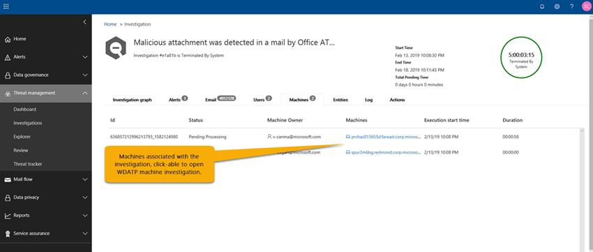

# Details en resultaten van een geautomatiseerd onderzoek in Microsoft 365Details and results of an automated investigation in Microsoft 365

[!INCLUDE [Microsoft 365 Defender rebranding](../includes/microsoft-defender-for-office.md)]

Wanneer er een [geautomatiseerd onderzoek](office-365-air.md) plaatsvindt in [Microsoft Defender voor Office 365](office-365-atp.md), is er informatie over dat onderzoek beschikbaar tijdens en na het proces voor automatisch onderzoek.When an [automated investigation](office-365-air.md) occurs in [Microsoft Defender for Office 365](office-365-atp.md), details about that investigation are available during and after the automated investigation process. Als u de benodigde machtigingen hebt, kunt u deze gegevens weergeven in het Microsoft 365-Beveiligingscentrum.If you have the necessary permissions, you can view those details in the Microsoft 365 security center. Onderzoek Details bieden u de nieuwste status en de mogelijkheid om alle in behandeling zijnde acties goed te keuren.Investigation details provide you with up-to-date status, and the ability to approve any pending actions.

## Status van onderzoekInvestigation status

Met de status van onderzoek wordt de voortgang van de analyse en acties aangegeven.The investigation status indicates the progress of the analysis and actions. Wanneer het onderzoek wordt uitgevoerd, wordt de status gewijzigd om aan te geven of er bedreigingen zijn gevonden en of de acties zijn goedgekeurd.As the investigation runs, status changes to indicate whether threats were found, and whether actions have been approved.

|StatusStatus|BeschrijvingDescription|
|---|---|
|**Starten****Starting**|Het onderzoek is geactiveerd en wacht tot de uitvoering is begonnen.The investigation has been triggered and waiting to start running.|
|**Werking****Running**|Het onderzoek proces is begonnen en wordt uitgevoerd.The investigation process has started and is underway. Deze status treedt ook op wanneer [acties in behandeling](air-review-approve-pending-completed-actions.md#approve-or-reject-pending-actions) zijn goedgekeurd.This state also occurs when [pending actions](air-review-approve-pending-completed-actions.md#approve-or-reject-pending-actions) are approved.|
|**Geen bedreigingen gevonden****No Threats Found**|Het onderzoek is voltooid en er zijn geen bedreigingen (gebruikersaccount, e-mailbericht, URL of bestand) vastgesteld.The investigation has finished and no threats (user account, email message, URL, or file) were identified. 
 **Tip**: als u vermoedt dat er iets mis is, kunt u de actie ondernemen met behulp van de [Threat Explorer](threat-explorer.md).**TIP**: If you suspect something was missed (such as a false negative), you can take action using [Threat Explorer](threat-explorer.md).|
|**Bedreigingen gevonden****Threats Found**|Het geautomatiseerde onderzoek heeft problemen gevonden, maar er zijn geen specifieke herstelacties om deze problemen op te lossen.The automated investigation found issues, but there are no specific remediation actions to resolve those issues. 
 De status van de **bedreigingen blijkt** te bestaan wanneer sommige typen gebruikersactiviteiten zijn gevonden, maar er zijn geen opruimings acties beschikbaar.The **Threats Found** status can occur when some type of user activity was identified but no cleanup actions are available. Voorbeelden hiervan zijn een van de volgende gebruikersactiviteiten:Examples include any of the following user activities: <ul><li>Een gebeurtenis van [preventie van gegevensverlies](https://docs.microsoft.com/Microsoft-365/compliance/data-loss-prevention-policies) (DLP)A [data loss prevention](https://docs.microsoft.com/Microsoft-365/compliance/data-loss-prevention-policies) (DLP) event</li><li>Een afwijkende e-mail verzendenAn email sending anomaly</li><li>Malware verzondenSent malware</li><li>Verstuurde phishingSent phish</li></ul> 
 Het onderzoek vond geen schadelijke Url's, bestanden of e-mailberichten die u wilt herstellen, en geen activiteiten van het postvak voor het oplossen van problemen, zoals het uitschakelen van doorstuurregels of delegatie.The investigation found no malicious URLs, files, or email messages to remediate, and no mailbox activity to fix, such as turning off forwarding rules or delegation. 
 **Tip**: als u vermoedt dat er een fout is opgetreden (zoals een onwaar negatief), kunt u onderzoek doen en actie ondernemen met behulp van de [Threat Explorer](threat-explorer.md).**TIP**: If you suspect something was missed (such as a false negative), you can investigate and take action using [Threat Explorer](threat-explorer.md).|
|**Beëindigd door systeem****Terminated By System**|Het onderzoek is gestopt.The investigation stopped. Een onderzoek kan om verschillende redenen worden beëindigd:An investigation can stop for several reasons: <ul><li>De in behandeling zijnde acties van het onderzoek zijn verlopen.The investigation's pending actions expired. Time-out van activiteiten in behandeling na goedkeuring voor één week.Pending actions time out after awaiting approval for one week.</li><li>Er zijn te veel acties.There are too many actions. Als u bijvoorbeeld wilt dat te veel gebruikers op schadelijke Url's klikken, kan dit de mogelijkheid voor het onderzoek van alle analyseren te lang zijn, zodat het onderzoek stopt.For example, if there are too many users clicking on malicious URLs, it can exceed the investigation's ability to run all the analyzers, so the investigation halts.</li></ul> 
 **Tip**: als een onderzoek stopt voordat er een actie is ondernomen, kunt u de [bedreigings Verkenner](threat-explorer.md) gebruiken om bedreigingen te vinden en op te lossen.**TIP**: If an investigation halts before actions were taken, try using [Threat Explorer](threat-explorer.md) to find and address threats.|
|**Actie in behandeling****Pending Action**|Het onderzoek heeft een bedreiging gevonden, zoals een kwaadaardige e-mail, een schadelijke URL of een instelling voor risicoieve postvakken, en een actie om te voorkomen dat de bedreiging op de [goedkeuring wacht](air-review-approve-pending-completed-actions.md).The investigation has found a threat, such as a malicious email, a malicious URL, or a risky mailbox setting, and an action to remediate that threat is [awaiting approval](air-review-approve-pending-completed-actions.md). 
 De **Actiestatus in behandeling** wordt geactiveerd wanneer er een risico bestaat met een bijbehorende actie.The **Pending Action** state is triggered when any threat with a corresponding action is found. De lijst met acties die in behandeling zijn, kan echter toenemen wanneer een onderzoek wordt uitgevoerd.However, the list of pending actions can increase as an investigation runs. Bekijk het [onderzoek logboek](#playbook-log) om te zien of andere items nog niet zijn voltooid.Check the [investigation log](#playbook-log) to see if other items are still pending completion.|
|**Herstelde****Remediated**|Het onderzoek is voltooid en alle verwerkings acties zijn goedgekeurd (dit wordt als volledig doorgevoerd aangegeven).The investigation finished and all remediation actions were approved (this is noted as fully remediated). 
 **Opmerking**: goedgekeurde herstelacties kunnen fouten bevatten waarmee de bewerkingen niet worden uitgevoerd.**NOTE**: Approved remediation actions can have errors that prevent the actions from being taken. De status van onderzoek heeft geen invloed op het feit of herstelacties succesvol zijn voltooid.Regardless of whether remediation actions are successfully completed, the investigation status does not change. Bekijk het [onderzoek logboek](#playbook-log) voor uitgebreide resultaten.Check the [investigation log](#playbook-log) for detailed results.|
|**Gedeeltelijk opgelost****Partially Remediated**|Het onderzoek vertoont een herstelactie en sommige zijn goedgekeurd en voltooid.The investigation resulted in remediation actions, and some were approved and completed. Andere acties zijn nog steeds [in behandeling](air-review-approve-pending-completed-actions.md).Other actions are still [pending](air-review-approve-pending-completed-actions.md).|
|**Mislukt****Failed**|Minstens één onderzoek analyse heeft een probleem voorgedaan waarbij het niet goed kon worden voltooid.At least one investigation analyzer ran into a problem where it could not complete properly. 
 **Opmerking**: als een onderzoek mislukt nadat de acties zijn goedgekeurd, zijn de herstelacties mogelijk nog steeds geslaagd.**NOTE**: If an investigation fails after remediation actions were approved, the remediation actions might still have succeeded. Bekijk het [onderzoek logboek](#playbook-log) voor uitgebreide resultaten.Check the [investigation log](#playbook-log) for detailed results.|
|**In wachtrij geplaatst door beperking****Queued By Throttling**|Er wordt een onderzoek in een wachtrij gehouden.An investigation is being held in a queue. Wanneer andere tests zijn voltooid, begint het in de wachtrij geplaatste onderzoek.When other investigations complete, queued investigations begin. Beperking helpt de prestaties van de service te voorkomen.Throttling helps avoid poor service performance.  
 **Tip**: met de actie in behandeling kunnen de hoeveelheid nieuwe onderzoeken worden beperkt.**TIP**: Pending actions can limit how many new investigations can run. Zorg ervoor dat de [actie in behandeling is goedgekeurd (of genegeerd)](air-review-approve-pending-completed-actions.md#approve-or-reject-pending-actions).Make sure to [approve (or reject) pending actions](air-review-approve-pending-completed-actions.md#approve-or-reject-pending-actions).|
|**Beëindigd door de beperking****Terminated By Throttling**|Als een onderzoek te lang wordt in de wachtrij gehouden, stopt dit.If an investigation is held in the queue too long, it stops. 
 **Tip**: u kunt [een onderzoek starten vanuit de Threat Explorer](automated-investigation-response-office.md#example-a-security-administrator-triggers-an-investigation-from-threat-explorer).**TIP**: You can [start an investigation from Threat Explorer](automated-investigation-response-office.md#example-a-security-administrator-triggers-an-investigation-from-threat-explorer).|
|

## Details van een onderzoek weergevenView details of an investigation

1. Ga naar de beveiligings & nalevings centrum ( [https://protection.office.com](https://protection.office.com) ) en meld u aan.Go to the Security & Compliance Center ([https://protection.office.com](https://protection.office.com)) and sign in.

2. Voer een van de volgende handelingen uit:Do one of the following actions:

    - Ga naar **Threat management** \> **Dashboard** Threat Management.Go to **Threat management** \> **Dashboard**. U gaat nu naar het [beveiligings dashboard](security-dashboard.md).This takes you to the [Security Dashboard](security-dashboard.md). Uw lucht widgets worden weergegeven boven aan het [beveiligings dashboard](security-dashboard.md).Your AIR widgets appear across the top of the [Security Dashboard](security-dashboard.md). Selecteer een widget, zoals **onderzoek samenvatting**.Select a widget, such as **Investigations summary**.

    - Ga naar onderzoek voor **Threat Management** \> **Investigations**.Go to **Threat management** \> **Investigations**.

    Met beide methoden gaat u naar een lijst met onderzoek.Either method takes you to a list of investigations.

    

3. Selecteer een item in de kolom **id** van de lijst met onderzoek.In the list of investigations, select an item in the **ID** column. Hiermee opent u de pagina met onderzoek Details, beginnend bij de weergave onderzoek.This opens investigation details page, starting with the investigation graph in view.

    

   U kunt de verschillende tabbladen gebruiken voor meer informatie over het onderzoek.Use the various tabs to learn more about the investigation.

## Details weergeven van een waarschuwing die is gerelateerd aan een onderzoekView details about an alert related to an investigation

Bepaalde soorten waarschuwingen activeren geautomatiseerd onderzoek in Microsoft 365.Certain kinds of alerts trigger automated investigation in Microsoft 365. Zie voor meer informatie: [waarschuwings beleid voor het activeren van geautomatiseerde onderzoeken](office-365-air.md#which-alert-policies-trigger-automated-investigations).To learn more, see [alert policies that trigger automated investigations](office-365-air.md#which-alert-policies-trigger-automated-investigations).

Gebruik de volgende procedure om details weer te geven van een waarschuwing die is gekoppeld aan een geautomatiseerd onderzoek.Use the following procedure to view details about an alert that is associated with an automated investigation.

1. Ga naar de beveiligings & nalevings centrum ( [https://protection.office.com](https://protection.office.com) ) en meld u aan.Go to the Security & Compliance Center ([https://protection.office.com](https://protection.office.com)) and sign in.

2. Ga naar onderzoek voor **Threat Management** \> **Investigations**.Go to **Threat management** \> **Investigations**.

3. Selecteer een item in de kolom **id** van de lijst met onderzoek.In the list of investigations, select an item in the **ID** column.

4. Wanneer u meer wilt weten over een onderzoek, selecteert u het tabblad **meldingen** . Alle meldingen die het onderzoek veroorzaken, worden hier vermeld.With details of an investigation open, select the **Alerts** tab. Any alerts that triggered the investigation are listed here.

5. Selecteer een item in de lijst.Select an item in the list. Er verschijnt een flyout met details over de waarschuwing en koppelingen naar aanvullende informatie en acties.A flyout opens, with details about the alert and links to additional information and actions.

6. De gegevens in het vervolgmenu bekijken en, afhankelijk van de bepaalde melding, een actie uitvoeren, zoals het **oplossen**, **onderdrukken** of waarschuwen van **gebruikers**.Review the information on the flyout, and, depending on the particular alert, take an action, such as **Resolve**, **Suppress**, or **Notify users**.

    - **Oplossing** is gelijk aan het sluiten van een waarschuwing**Resolve** is equivalent to closing an alert

    - **Onderdrukken** zorgt ervoor dat een beleid geen waarschuwingen activeert voor een bepaalde tijdsperiode**Suppress** causes a policy to not trigger alerts for a specified period of time

    - **Gebruikers laten weten** dat de e-mailadressen van gebruikers al zijn ingevoerd en het team van uw beveiligingsactiviteiten de mogelijkheid bieden een bericht te typen voor deze gebruikers.**Notify users** starts an email with users' email addresses already entered, and enables your security operations team to type a message to those users. (Dit is vergelijkbaar met het verzenden van een bericht naar geadresseerden met behulp van de [bedreigings Verkenner](threat-explorer.md).)(This is similar to sending a message to recipients using [Threat Explorer](threat-explorer.md).)

## De verschillende tabbladen gebruikenHow to use the various tabs

In de volgende secties vindt u meer informatie over de verschillende tabbladen op de pagina met geautomatiseerde onderzoeken en de manier waarop u deze gegevens kunt gebruiken.The following sections walk you through the various tabs on the automated investigations page and how you can use the information.

### Pagina met automatisch onderzoekAutomated investigations page

Op de pagina geautomatiseerd onderzoek ziet u de onderzoeken en de huidige status van uw organisatie.The automated investigations page shows your organization's investigations and their current states.

U kunt:You can:

- Ga rechtstreeks naar een onderzoek (Selecteer een **onderzoek-id**).Navigate directly to an investigation (select an **Investigation ID**).

- Filters toepassen.Apply filters. Kies uit **onderzoek type**, **tijdsbereik**, **status** of een combinatie van deze.Choose from **Investigation Type**, **Time range**, **Status**, or a combination of these.

- Exporteer de gegevens naar een CSV-bestand.Export the data to a .csv file.

### Onderzoek grafiekInvestigation graph

Wanneer u een specifiek onderzoek opent, ziet u de pagina onderzoeksteam.When you open a specific investigation, you see the investigation graph page. Op deze pagina worden alle verschillende entiteiten weergegeven: e-mailberichten, gebruikers (en hun activiteiten) en apparaten die automatisch zijn onderzocht als onderdeel van de waarschuwing die is geactiveerd.This page shows all the different entities: email messages, users (and their activities), and devices that were automatically investigated as part of the alert that was triggered.

U kunt:You can:

- Een visueel overzicht van het huidige onderzoek.Get a visual overview of the current investigation.
- Een overzicht van de duur van het onderzoek weergeven.View a summary of the investigation duration.
- Selecteer een knooppunt in de visualisatie om Details voor dat knooppunt weer te geven.Select a node in the visualization to view details for that node.
- Selecteer boven aan het tabblad een tabblad om Details voor dat tabblad weer te geven.Select a tab across the top to view details for that tab.

### Waarschuwing voor onderzoekAlert investigation

Op het tabblad **waarschuwingen** voor een onderzoek kunt u meldingen van belangrijke informatie voor onderzoek bekijken.On the **Alerts** tab for an investigation, you can see alerts relevant to the investigation. Details omvat de melding dat het onderzoek en andere gerelateerde meldingen zijn geactiveerd, zoals risicoieve aanmelding, [DLP-beleids](https://docs.microsoft.com/Microsoft-365/compliance/data-loss-prevention-policies) schendingen, etc., die zijn gerelateerd aan het onderzoek.Details include the alert that triggered the investigation and other correlated alerts, such as risky sign-in, [DLP policy](https://docs.microsoft.com/Microsoft-365/compliance/data-loss-prevention-policies) violations, etc., that are correlated to the investigation. Op deze pagina kunnen beveiligings analist ook aanvullende Details voor afzonderlijke waarschuwingen bekijken.From this page, a security analyst can also view additional details on individual alerts.

U kunt:You can:

- Een visueel overzicht van de huidige trigger en bijbehorende waarschuwingen weergeven.Get a visual overview of the current triggering alert and any associated alerts.
- Selecteer een waarschuwing in de lijst om een uitklap pagina te openen waarin de details van de volledige waarschuwing worden weergegeven.Select an alert in the list to open a fly-out page that shows full alert details.

### E-mail onderzoekEmail investigation

Op het tabblad **e-mail** voor een onderzoek ziet u de oorspronkelijke e-mailberichten en de clusters met soortgelijke e-mail geïdentificeerd als onderdeel van het onderzoek.On the **Email** tab for an investigation, you can see the original emails and the clusters of similar email identified as part of the investigation. Het tabblad **e-mail** bevat ook e-mail items die betrekking hebben op het onderzoek, zoals de door de gebruiker gerapporteerde e-mail gegevens, het oorspronkelijke e-mailbericht, het e-mailbericht of de e-mailberichten zapped vanwege malware/phishing, enzovoort.The **Email** tab also shows email items related to the investigation, such as the user-reported email details, the original email reported, the email message(s) zapped due to malware/phish, etc.

Met een onderzoek via e-mail kunt u:With email investigation, you can:

- Een visueel overzicht van de huidige cluster resultaten en-bedreigingen weergeven.Get a visual overview of the current clustering results and threats found.
- Klik op een cluster entiteit of een lijst met bedreigingen om een uitklap pagina te openen waarop de details van de volledige waarschuwing worden weergegeven.Click a cluster entity or a threat list to open a fly-out page that shows the full alert details.
- Onderzoek het e-mail cluster verder door te klikken op de koppeling **openen in Verkenner** boven aan het tabblad **Details van e-mail cluster**Further investigate the email cluster by clicking the **Open in Explorer** link at the top of the **Email cluster details** tab

De volgende stappen kunnen veel tijd in beslag nemen, wat het volume van de e-mail is die gebruikers in een organisatie verzenden en ontvangen, plus de meerdere gebruikers aard van e-mail communicatie en aanvallen:Given the sheer volume of email that users in an organization send and receive, plus the multi-user nature of email communications and attacks, the following process can take a significant amount of time:

1. U kunt e-mailberichten in een cluster afronden op basis van vergelijkbare kenmerken van een kop, hoofdtekst, URL en bijlagen van een bericht.Clustering email messages based on similar attributes from a message header, body, URL, and attachments.
2. Het scheiden van kwaadaardige e-mail van de goede e-mail.Separating malicious email from the good email.
3. Actie te ondernemen op schadelijke e-mailberichten.Taking action on malicious email messages.

AIR automatiseert dit proces en bespaart de tijd en inspanning van uw organisatie.AIR automates this process, saving your organization's security team time and effort.

#### Typen e-mail clustersTypes of email clusters

Er kunnen drie verschillende typen e-mail clusters worden geïdentificeerd tijdens de stap voor de analyse van e-mail: gelijkenis clusters (alle controles), indicator clusters (alle controles) en Postvak/gebruikers clusters.Three different types of email clusters can be identified during the email analysis step: similarity clusters (all investigations), indicator clusters (all investigations), and mailbox/user clusters. In de volgende tabel worden deze typen e-mail clusters beschreven.The following table describes these types of email clusters.

|E-mail clusterEmail cluster|BeschrijvingDescription|
|---|---|
|Gelijkenis clustersSimilarity clusters|E-mailberichten die worden geïdentificeerd door jacht voor e-mailberichten met soortgelijke afzender en inhouds kenmerken.Email messages identified by hunting for emails with similar sender and content attributes. Deze clusters worden geëvalueerd voor schadelijke inhoud op basis van de oorspronkelijke detectie bevindingen.These clusters are evaluated for malicious content based on the original detection findings. E-mail clusters met voldoende schadelijke e-mail detectie worden als schadelijk beschouwd.Email clusters that contain enough malicious email detections are considered malicious.|
|Indicator clustersIndicator clusters|E-mailberichten die worden geïdentificeerd door te zoeken naar dezelfde indicator entiteit (bestandshash of URL) van het oorspronkelijke e-mailbericht.Email messages that are identified by hunting for the same indicator entity (file hash or URL) from the original email. Wanneer de oorspronkelijke bestands-en URL-entiteit als schadelijk wordt geïdentificeerd, past de ether de indicator verdict toe aan het volledige cluster van e-mailberichten die de desbetreffende entiteit bevatten.When the original file/URL entity is identified as malicious, AIR applies the indicator verdict to the entire cluster of email messages containing that entity. Een bestand dat is geïdentificeerd als malware betekent dat het cluster van e-mailberichten met dat bestand als malware-e-mailberichten wordt behandeld.A file identified as malware means that the cluster of email messages containing that file are treated as malware email messages.|
|Postvak/gebruikers clustersMailbox/user clusters|E-mailberichten met betrekking tot de gebruiker bij een aanvaller onderzoek.Email messages related to the user involved in a user compromise investigation. Deze e-mail clusters zijn voor verdere analyse door het team van beveiligingsactiviteiten en genereren geen herstelacties voor e-mailberichten.These email clusters are for further analysis by the security operations team and will not generate email remediation actions. 
 De beveiligings Playbook van de gebruiker bekijkt de e-mailberichten die worden verzonden wanneer de gebruiker wordt geanalyseerd om inzicht te krijgen in de mogelijke gevolgen van e-mailberichten die vanuit het postvak worden verzonden.The compromised user security playbook  reviews the emails being sent by the user being analyzed in order to understand the potential impact of the emails being sent from the mailbox.|

> [!NOTE]
> Het doel van clustering is om andere verwante e-mailberichten te zoeken die door dezelfde afzender worden verzonden als onderdeel van een aanval of een campagne.The goal of clustering is to hunt and find other related email messages that are sent by the same sender as part of an attack or a campaign.  In sommige gevallen kan via legitiem e-mail onderzoek een onderzoek plaatsvinden (bijvoorbeeld een gebruiker heeft een marketing-e-mail).In some cases, legitimate email might trigger an investigation (for example, a user reports a marketing email).  In deze scenario's moet in het cluster van e-mail clusters wordt aangegeven dat e-mail clusters niet schadelijk zijn, op voor willekeurige wijze, geen bedreiging en **geen** e-mailberichten worden verwijderd.In these scenarios, the email clustering should identify that email clusters are not malicious – when it appropriately does so, it will **not** indicate a threat, nor will it recommend email removal.

#### Categorieën voor e-mailEmail classifications

Wanneer e-mailberichten worden geanalyseerd, worden deze geclassificeerd als *schadelijk*, *verdacht* of *schoon* (zoals in, *niet aangeduid als bedreiging*):As email messages are analyzed, they are classified as *malicious*, *suspicious*, or *clean* (as in, *not identified as a threat*):

- *Kwaadwillende e-mailberichten* die zijn verzonden via het postvak/van de gebruiker, geven de mogelijke compromissen van het postvak/account aan*Malicious emails* sent from the mailbox/user  indicate potential compromise of the mailbox/account. Andere gebruikers/postvakken waarop kwaadaardige e-mail als onderdeel van een aanval is aangetast, worden weergegeven.Other users/mailboxes that are potentially impacted by malicious email as part of a compromise are shown.

- *Verdachte e-mailberichten* die door het postvak zijn verzonden, geven de mogelijkheid aan dat een niet-aangetaste e-mail activiteit of een ongewenst*Suspicious emails* sent by the mailbox/user indicate the potential for a compromised account or unwanted email activity. Deze berichten bevatten spam-en bulk-e-mailberichten die vanuit het postvak zijn verzonden.These messages include any spam/bulk email sent from the mailbox.

- *Overbodige e-mailberichten* (e-mailberichten die worden beschouwd als geen bedreiging) die door het postvak worden verzonden*Clean emails* (emails that are considered not a threat) sent by the mailbox/user can provide your security operations team with a view of legitimate user emails sent. Deze e-mailberichten kunnen echter ook gegevens exfiltration bevatten als het e-mailaccount wordt aangetast.However, these emails can also include data exfiltration if the email account is compromised.

#### Meer informatie over het aantal e-mailberichtenMore about email counts

Het aantal e-mailberichten dat wordt aangegeven op het tabblad e-mail, staat momenteel voor het totaal van alle e-mailberichten die worden weergegeven op het tabblad **e-mail** . Aangezien e-mailberichten in meerdere clusters zijn opgenomen, wordt het totale aantal e-mailberichten dat wordt aangeduid (en beïnvloed door acties voor herbemiddeling) het aantal unieke e-mailberichten die in alle clusters en e-mailberichten van de oorspronkelijke geadresseerden zijn aangegeven.The email count identified on the email tab currently represents the sum total of all email messages that shown on the **Email** tab. Because email messages are present in multiple clusters, the actual total count of email messages identified (and affected by remediation actions) is the count of unique email messages present across all of the clusters and original recipients' email messages.

E-mail van de type [Explorer](threat-explorer.md) en Air wordt per geadresseerde verzonden, aangezien de beveiligings-Verdicts,-acties en de bezorgingslocaties verschillen per geadresseerde.Both [Explorer](threat-explorer.md) and AIR count email messages on a per-recipient basis, because the security verdicts, actions, and delivery locations vary on a per-recipient basis. Daarom telt een oorspronkelijk e-mailbericht dat naar drie gebruikers is verzonden, een totaal van drie e-mailberichten in plaats van één e-mailbericht.Thus, an original email sent to three users counts as a total of three email messages instead of one email.

Er kunnen situaties zijn waarin een e-mailbericht twee of meer keren wordt geteld, bijvoorbeeld wanneer een e-mail meerdere acties bevat, of als er meerdere kopieën van de e-mail zijn wanneer alle acties plaatsvinden.There might be cases where an email gets counted two or more times, such as when an email has multiple actions on it, or when there are multiple copies of the email when all the actions occur.

Als u bijvoorbeeld een malware-e-mailbericht dat bij de bezorging is gedetecteerd, wordt weergegeven in zowel een vergrendelde e-mail als een vervangend e-mailbericht (bedreigings bestand vervangen door een waarschuwings bestand, vervolgens bezorgd in het postvak van de gebruiker).For example, a malware email that is detected at delivery can result in both a blocked (quarantined) email and a replaced email (threat file replaced with a warning file, then delivered to user's mailbox). Aangezien er in het systeem wel of meerdere kopieën van de e-mail worden weergegeven, worden beide mogelijk geteld in het aantal clusters.Because there are literally two copies of the email in the system, both might be counted in cluster counts.

> [!IMPORTANT]
> Hier volgen enkele punten waarmee u rekening moet houden:Here are a few points to keep in mind:
>
> - Het aantal e-mailberichten wordt berekend op het moment van het onderzoek en sommige tellingen worden herberekend wanneer u onderzoek-flyouten opent (gebaseerd op een onderliggende query).Email counts are calculated at the time of the investigation, and some counts are recalculated when you open investigation flyouts (based on an underlying query).
>
> - Het aantal e-mailberichten dat wordt weergegeven voor de e-mail clusters op het tabblad **e-mail** en de waarde voor e-mail hoeveelheid weergegeven in het cluster flyout worden op het moment van onderzoek berekend en niet gewijzigd.The email counts shown for the email clusters on the **Email** tab and the email quantity value shown on cluster flyout are calculated at the time of investigation, and do not change.
>
> - Het aantal e-mailberichten onderaan het tabblad **e-mail** van de flyout e-mail cluster en het aantal e-mailberichten in Explorer weerspiegelt de e-mailberichten die zijn ontvangen na de eerste analyse van het onderzoek.The email count shown at the bottom of the **Email** tab of the email cluster flyout and the count of email messages shown in Explorer reflect email messages received after the investigation's initial analysis.

Daarom wordt in een e-mail cluster met een oorspronkelijk aantal tien e-mailberichten een e-mail lijst weergegeven met het totaal aantal van 15 wanneer vijf e-mailberichten binnenkomen tussen de fase onderzoek analyse en wanneer de beheerder het onderzoek beoordeelt.Thus, an email cluster that shows an original quantity of 10 email messages would show an email list total of 15 when five more email messages arrive between the investigation analysis phase and when the admin reviews the investigation. Op deze manier kunnen oude onderzoeken ook beginnen met het weergeven van de resultaten van de Verkenner, omdat gegevens in Microsoft Defender voor Office 365, abonnement 2 na 7 dagen voor trials en 30 dagen voor betaalde licenties, verlopen.Likewise, old investigations might start showing higher counts than Explorer queries show, because data in Microsoft Defender for Office 365 Plan 2 expires after 7 days for trials and after 30 days for paid licenses.

Als u de weergave van zowel historische als huidige aantallen in verschillende weergaven wilt weergeven, wordt het e-mailbericht op het moment van het onderzoek en de huidige impact op het moment van herstel weergegeven.Showing both count historical and current counts in different views is done to indicate the email impact at the time of investigation and the current impact up until the time that remediation is run.

> [!NOTE]
> In het context van e-mail ziet u mogelijk een volume anomalie risico, als onderdeel van het onderzoek.In the context of email, you might see a volume anomaly threat surface as part of the investigation. Een volume anomalie geeft een Prikker aan in soortgelijke e-mailberichten over de tijd voor onderzoek gebeurtenissen, vergeleken met eerdere tijds gebieden.A volume anomaly indicates a spike in similar email messages around the investigation event time compared to earlier timeframes. Deze Prikker in het e-mail verkeer met vergelijkbare kenmerken (zoals onderwerp en e-mailadres van de afzender, Tekstsoort gelijke en IP-adres van de afzender is gebruikelijk van het starten van e-mail campagnes of aanvallen.This spike in email traffic with similar characteristics (e.g. subject and sender domain, body similarity and sender IP) is typical of the start of email campaigns or attacks.
> Met grote hoeveelheden spam en legitieme e-mail campagnes deelt u deze kenmerken vaak.However, bulk, spam, and legitimate email campaigns commonly share these characteristics.
>
> Volume afwijkingen vormen een potentiële bedreiging, en zijn daarom minder sterk, vergeleken met malware of phishing-bedreigingen die worden aangeduid met anti-virus motoren, detonatie of kwaadaardige reputatie.Volume anomalies represent a potential threat, and accordingly could be less severe compared to malware or phish threats that are identified using anti-virus engines, detonation or malicious reputation.

### Gebruikers onderzoekUser investigation

Op het tabblad **gebruikers** ziet u alle gebruikers die als onderdeel van het onderzoek worden geïdentificeerd.On the **Users** tab, you can see all the users identified as part of the investigation. Gebruikersaccounts worden weergegeven in het onderzoek wanneer er sprake is van een gebeurtenis of aanduiding dat deze gebruikersaccounts mogelijk worden beïnvloed of gemanipuleerd.User accounts appear in the investigation when there is an event or indication that those user accounts might be affected or compromised.

In de volgende afbeelding heeft lucht bijvoorbeeld indicatoren voor compromissen en afwijkingen aangegeven op basis van een nieuwe regel voor Postvak in die is gemaakt.For example, in the following image, AIR has identified indicators of compromise and anomalies based on a new inbox rule that was created. Aanvullende informatie (het bewijs) van het onderzoek bevindt zich via gedetailleerde weergaven op dit tabblad. Indicatoren van compromissen en anomalieën kunnen ook afwijkende detecties van de beveiliging van de [Microsoft Cloud app](https://docs.microsoft.com/cloud-app-security)bevatten.Additional details (evidence) of the investigation are available through detailed views within this tab. Indicators of compromise and anomalies might also include anomaly detections from [Microsoft Cloud App Security](https://docs.microsoft.com/cloud-app-security).

U kunt:You can:

- Een visueel overzicht van geïdentificeerde resultaten en Risico's van gebruikers gevonden.Get a visual overview of identified user results and risks found.

- Selecteer een gebruiker voor het openen van een uitklap pagina waarop de details van de volledige waarschuwing worden weergegeven.Select a user to open a fly-out page that shows the full alert details.

### Computer onderzoekMachine investigation

Op het tabblad **computers** ziet u alle systemen die als onderdeel van het onderzoek zijn geïdentificeerd.On the **Machines** tab, you can see all the machines identified as part of the investigation.

Als onderdeel van sommige playbooks, verbindt lucht een e-mail bedreiging met apparaten (bijvoorbeeld zapped malware).As part of some playbooks, AIR correlates email threats to devices (for example, Zapped malware). Een onderzoek geeft bijvoorbeeld een kwaadaardige bestandshash in [Microsoft Defender voor eindpunten](https://docs.microsoft.com/windows/security/threat-protection/microsoft-defender-atp/microsoft-defender-advanced-threat-protection
) om te onderzoeken.For example, an investigation passes a malicious file hash across to [Microsoft Defender for Endpoint](https://docs.microsoft.com/windows/security/threat-protection/microsoft-defender-atp/microsoft-defender-advanced-threat-protection
) to investigate. Dit helpt voor een geautomatiseerde onderzoek van de relevante computers voor uw gebruikers, zodat bedreigingen zowel in de Cloud als in de eindpunten worden opgelost.This allows for automated investigation of relevant machines for your users, to help ensure that threats are addressed both in the cloud and across your endpoints.

U kunt:You can:

- Bekijk een visueel overzicht van de huidige systemen en bedreigingen.Get a visual overview of the current machines and threats found.

- Selecteer een machine om een weergave te openen in de verwante [Microsoft Defender voor eindpunten](https://docs.microsoft.com/windows/security/threat-protection/microsoft-defender-atp/automated-investigations) in het Microsoft Defender-Beveiligingscentrum.Select a machine to open a view that into the related [Microsoft Defender for Endpoint investigations](https://docs.microsoft.com/windows/security/threat-protection/microsoft-defender-atp/automated-investigations) in the Microsoft Defender Security Center.

### Dienst onderzoekEntity investigation

Op het tabblad **entiteiten** ziet u de entiteiten geïdentificeerd en analyseren als onderdeel van het onderzoek.On the **Entities** tab, you can see the entities identified and analyzed as part of the investigation.

Hier ziet u de onderzochte entiteiten en Details van de typen entiteiten, zoals e-mailberichten, clusters, IP-adressen, gebruikers en meer.Here, you can see the investigated entities and details of the types of entities, such as email messages, clusters, IP addresses, users, and more. U kunt ook zien hoeveel entiteiten zijn geanalyseerd, en de bedreigingen waarmee elk van deze personen is geassocieerd.You can also see how many entities were analyzed, and the threats that were associated with each.

U kunt:You can:

- Een visueel overzicht van de onderzoeksinstellingen en bedreigingen voor onderzoek.Get a visual overview of the investigation entities and threats found.

- Selecteer een entiteit om een uitklap pagina te openen waarin de details van de gerelateerde entiteit worden weergegeven.Select an entity to open a fly-out page that shows the related entity details.

### Playbook logboekPlaybook log

Op het tabblad **logboek** ziet u alle Playbook stappen die tijdens het onderzoek zijn opgetreden.On the **Log** tab, you can see all the playbook steps that have occurred during the investigation. In het logboek wordt een volledige inventaris opgenomen van alle analysefuncties en acties die zijn voltooid door Office 365, als onderdeel van de lucht.The log captures a complete inventory of all analyzers and actions completed by Office 365 auto-investigation capabilities as part of AIR. Het biedt een duidelijke weergave van alle genomen stappen, waaronder de actie zelf, een beschrijving en de duur van de werkelijke duur van begin tot einde.It provides a clear view of all the steps taken, including the action itself, a description, and the duration of the actual from start to finish.

U kunt:You can:

- Bekijk een visueel overzicht van de stappen die u hebt gemaakt in Playbook.Get see a visual overview of the playbook steps taken.
- De resultaten naar een CSV-bestand exporteren.Export the results to a CSV file.
- Filter de weergave.Filter the view.

### Aanbevolen actiesRecommended actions

Op het tabblad **acties** ziet u alle Playbook-acties die worden aanbevolen voor herstel na voltooiing van het onderzoek.On the **Actions** tab, you can see all the playbook actions that are recommended for remediation after the investigation has completed. Acties vastleggen de stappen Microsoft raadt u aan het einde van een onderzoek aan te nemen.Actions capture the steps Microsoft recommends you take at the end of an investigation. Door een of meer acties te selecteren, kunt u deze stappen uitvoeren.You can take remediation actions here by selecting one or more actions.

Wanneer u **goedkeuring** selecteert, kunt u beginnen met herstellen.Selecting **Approve** allows remediation to begin. (De juiste machtigingen zijn vereist-de rol **zoeken en wissen** is vereist voor het uitvoeren van acties van Explorer en Air).(Appropriate permissions are needed - the **Search And Purge** role is required to run actions from Explorer and AIR).

Een beveiligings lezer kan bijvoorbeeld acties weergeven, maar deze niet goedkeuren.For example, a Security Reader can view actions, but not approve them.

> [!IMPORTANT]
> U hoeft niet elke actie te keuren.You do not have to approve every action. Als u niet akkoord gaat met de aanbevolen actie of als uw organisatie bepaalde typen acties niet kiest, kunt u ervoor kiezen **om de acties te negeren of** ze gewoon te negeren en geen actie te ondernemen.If you do not agree with the recommended action or your organization does not choose certain types of actions, then you can choose to **Reject** the actions or simply ignore them and take no action.
> Als u alle acties goedkeurt en/of weigert, kunt u het onderzoek volledig sluiten (de status wordt hersteld), terwijl sommige acties niet-compleet worden uitgevoerd, worden de status van het onderzoek wijzigen in een gedeeltelijk herstelstatus.Approving and/or rejecting all actions lets the investigation fully close (status becomes remediated), while leaving some actions incomplete results in the investigation status changing to a partially remediated state.

U kunt:You can:

- Een visueel overzicht van de aanbevolen acties in Playbook.Get a visual overview of the playbook-recommended actions.
- Selecteer één actie of meerdere acties.Select a single action or multiple actions.
- Aanbevolen acties met opmerkingen goedkeuren of afwijzen.Approve or reject recommended actions with comments.
- De resultaten naar een CSV-bestand exporteren.Export the results to a CSV file.
- Filter de weergave.Filter the view.

## Volgende stappenNext steps

- [In behandeling zijnde acties controleren en goedkeurenReview and approve pending actions](air-review-approve-pending-completed-actions.md#approve-or-reject-pending-actions)
