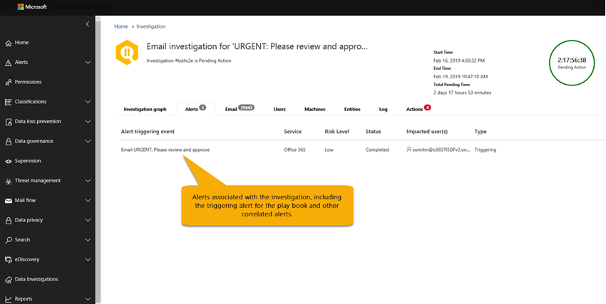
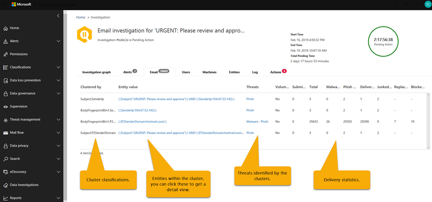

# Details en resultaten van een geautomatiseerd onderzoek in Microsoft 365Details and results of an automated investigation in Microsoft 365

[!INCLUDE [Microsoft 365 Defender rebranding](../includes/microsoft-defender-for-office.md)]

Wanneer er een [geautomatiseerd onderzoek](office-365-air.md) plaatsvindt in [Microsoft Defender voor Office 365](office-365-atp.md), is er informatie over dat onderzoek beschikbaar tijdens en na het proces voor automatisch onderzoek.When an [automated investigation](office-365-air.md) occurs in [Microsoft Defender for Office 365](office-365-atp.md), details about that investigation are available during and after the automated investigation process. Als u de benodigde machtigingen hebt, kunt u deze gegevens bekijken in de weergave Details van onderzoek.If you have the necessary permissions, you can view those details in an investigation details view. De weergave onderzoek Details biedt u de actuele status en de mogelijkheid om alle in behandeling zijnde acties goed te keuren.The investigation details view provides you with up-to-date status and the ability to approve any pending actions.

## Status van onderzoekInvestigation status

Met de status van onderzoek wordt de voortgang van de analyse en acties aangegeven.The investigation status indicates the progress of the analysis and actions. Wanneer het onderzoek wordt uitgevoerd, wordt de status gewijzigd om aan te geven of er bedreigingen zijn gevonden en of de acties zijn goedgekeurd.As the investigation runs, status changes to indicate whether threats were found, and whether actions have been approved.

****

|StatusStatus|Wat betekent dit?What it means|
|---|---|
|StartenStarting| Het onderzoek is geactiveerd en wacht tot de uitvoering is begonnen.The investigation has been triggered and waiting to start running.|
|WerkingRunning| Het onderzoek proces is begonnen en wordt uitgevoerd.The investigation process has started and is underway. Deze status treedt ook op wanneer [acties in behandeling](https://docs.microsoft.com/microsoft-365/security/office-365-security/air-review-approve-pending-completed-actions#approve-or-reject-pending-actions) zijn goedgekeurd.This state also occurs when [pending actions](https://docs.microsoft.com/microsoft-365/security/office-365-security/air-review-approve-pending-completed-actions#approve-or-reject-pending-actions) are approved.|
|Geen bedreigingen gevondenNo Threats Found| Het onderzoek is voltooid en er zijn geen bedreigingen (gebruikersaccount, e-mailbericht, URL of bestand) vastgesteld.The investigation has finished and no threats (user account, email message, URL, or file) were identified.   **Tip** : als u vermoedt dat er iets mis is, kunt u de actie ondernemen met behulp van de [Threat Explorer](https://docs.microsoft.com/microsoft-365/security/office-365-security/threat-explorer).**TIP** : If you suspect something was missed (such as a false negative), you can take action using [Threat Explorer](https://docs.microsoft.com/microsoft-365/security/office-365-security/threat-explorer).|
|Bedreigingen gevondenThreats Found|Het geautomatiseerde onderzoek heeft problemen gevonden, maar er zijn geen specifieke herstelacties om deze problemen op te lossen.The automated investigation found issues, but there are no specific remediation actions to resolve those issues.   De status van de bedreigingen blijkt te bestaan wanneer sommige typen gebruikersactiviteiten zijn gevonden, maar er zijn geen opruimings acties beschikbaar.The Threats Found status can occur when some type of user activity was identified but no cleanup actions are available. Voorbeelden hiervan zijn een van de volgende gebruikersactiviteiten:Examples include any of the following user activities:  -Een gebeurtenis van [preventie van gegevensverlies](https://docs.microsoft.com/Microsoft-365/compliance/data-loss-prevention-policies) (DLP)- A [data loss prevention](https://docs.microsoft.com/Microsoft-365/compliance/data-loss-prevention-policies) (DLP) event  -Een afwijkende e-mail verzenden- An email sending anomaly  -Verstuur malware- Sent malware  -Verzonden phishing- Sent phish Het onderzoek vond geen schadelijke Url's, bestanden of e-mailberichten die u wilt herstellen, en geen activiteiten van het postvak voor het oplossen van problemen, zoals het uitschakelen van doorstuurregels of delegatie.The investigation found no malicious URLs, files, or email messages to remediate, and no mailbox activity to fix, such as turning off forwarding rules or delegation.   **Tip** : als u vermoedt dat er een fout is opgetreden (zoals een onwaar negatief), kunt u onderzoek doen en actie ondernemen met behulp van de [Threat Explorer](https://docs.microsoft.com/microsoft-365/security/office-365-security/threat-explorer).**TIP** : If you suspect something was missed (such as a false negative), you can investigate and take action using [Threat Explorer](https://docs.microsoft.com/microsoft-365/security/office-365-security/threat-explorer).|
|Beëindigd door systeemTerminated By System| Het onderzoek is gestopt.The investigation stopped. Een onderzoek kan om verschillende redenen worden beëindigd:An investigation can stop for several reasons: -De acties die in behandeling zijn verlopen.- The investigation's pending actions expired. Time-out van activiteiten in behandeling na goedkeuring voor één week.Pending actions time out after awaiting approval for one week.  -Er zijn te veel acties.- There are too many actions. Als u bijvoorbeeld wilt dat te veel gebruikers op schadelijke Url's klikken, kan dit de mogelijkheid voor het onderzoek van alle analyseren te lang zijn, zodat het onderzoek stopt.For example, if there are too many users clicking on malicious URLs, it can exceed the investigation's ability to run all the analyzers, so the investigation halts.   **Tip** : als een onderzoek stopt voordat er een actie is ondernomen, kunt u de [bedreigings Verkenner](https://docs.microsoft.com/microsoft-365/security/office-365-security/threat-explorer) gebruiken om bedreigingen te vinden en op te lossen.**TIP** : If an investigation halts before actions were taken, try using [Threat Explorer](https://docs.microsoft.com/microsoft-365/security/office-365-security/threat-explorer) to find and address threats.|
|Actie in behandelingPending Action| Het onderzoek heeft een bedreiging gevonden, zoals een kwaadaardige e-mail, een schadelijke URL of een instelling voor risicoieve postvakken, en een actie om te voorkomen dat de bedreiging op de [goedkeuring](https://docs.microsoft.com/microsoft-365/security/office-365-security/air-review-approve-pending-completed-actions)wacht.The investigation has found a threat, such as a malicious email, a malicious URL, or a risky mailbox setting, and an action to remediate that threat is awaiting [approval](https://docs.microsoft.com/microsoft-365/security/office-365-security/air-review-approve-pending-completed-actions).  De Actiestatus in behandeling wordt geactiveerd wanneer er een risico bestaat met een bijbehorende actie.The Pending Action state is triggered when any threat with a corresponding action is found. De lijst met acties die in behandeling zijn, kan echter toenemen wanneer een onderzoek wordt uitgevoerd.However, the list of pending actions can increase as an investigation runs. Bekijk het [onderzoek logboek](https://docs.microsoft.com/microsoft-365/security/office-365-security/air-view-investigation-results#playbook-log) om te zien of andere items nog niet zijn voltooid.Check the [investigation log](https://docs.microsoft.com/microsoft-365/security/office-365-security/air-view-investigation-results#playbook-log) to see if other items are still pending completion.|
|HersteldeRemediated| Het onderzoek is voltooid en alle acties zijn goedgekeurd (volledig hersteld).The investigation finished and all actions were approved (fully remediated).  **Opmerking** : goedgekeurde herstelacties kunnen fouten bevatten waarmee de bewerkingen niet worden uitgevoerd.**NOTE** : Approved remediation actions can have errors that prevent the actions from being taken. De status van onderzoek heeft geen invloed op het feit of herstelacties succesvol zijn voltooid.Regardless of whether remediation actions are successfully completed, the investigation status does not change. Bekijk het [onderzoek logboek](https://docs.microsoft.com/microsoft-365/security/office-365-security/air-view-investigation-results) voor uitgebreide resultaten.Check the [investigation log](https://docs.microsoft.com/microsoft-365/security/office-365-security/air-view-investigation-results) for detailed results.|
|Gedeeltelijk opgelostPartially Remediated| Het onderzoek vertoont een herstelactie en sommige zijn goedgekeurd en voltooid.The investigation resulted in remediation actions, and some were approved and completed. Andere acties zijn nog steeds [in behandeling](https://docs.microsoft.com/microsoft-365/security/office-365-security/air-review-approve-pending-completed-actions).Other actions are still [pending](https://docs.microsoft.com/microsoft-365/security/office-365-security/air-review-approve-pending-completed-actions).|
|MisluktFailed| Minstens één onderzoek analyse heeft een probleem voorgedaan waarbij het niet goed kon worden voltooid.At least one investigation analyzer ran into a problem where it could not complete properly.   **Opmerking** : als een onderzoek mislukt nadat de acties zijn goedgekeurd, zijn de herstelacties mogelijk nog steeds geslaagd.**NOTE** : If an investigation fails after remediation actions were approved, the remediation actions might still have succeeded. Bekijk het [onderzoek logboek](https://docs.microsoft.com/microsoft-365/security/office-365-security/air-view-investigation-results) voor uitgebreide resultaten.Check the [investigation log](https://docs.microsoft.com/microsoft-365/security/office-365-security/air-view-investigation-results) for detailed results.|
|In wachtrij geplaatst door beperkingQueued By Throttling| Er wordt een onderzoek in een wachtrij gehouden.An investigation is being held in a queue. Wanneer andere tests zijn voltooid, begint het in de wachtrij geplaatste onderzoek.When other investigations complete, queued investigations begin. Beperking helpt de prestaties van de service te voorkomen.Throttling helps avoid poor service performance.   **Tip** : met de actie in behandeling kunnen de hoeveelheid nieuwe onderzoeken worden beperkt.**TIP** : Pending actions can limit how many new investigations can run. Zorg ervoor dat de [actie in behandeling is goedgekeurd (of genegeerd)](https://docs.microsoft.com/microsoft-365/security/office-365-security/air-review-approve-pending-completed-actions#approve-or-reject-pending-actions).Make sure to [approve (or reject) pending actions](https://docs.microsoft.com/microsoft-365/security/office-365-security/air-review-approve-pending-completed-actions#approve-or-reject-pending-actions).|
|Beëindigd door de beperkingTerminated By Throttling| Als een onderzoek te lang wordt in de wachtrij gehouden, stopt dit.If an investigation is held in the queue too long, it stops.   **Tip** : u kunt [een onderzoek starten vanuit de Threat Explorer](https://docs.microsoft.com/microsoft-365/security/office-365-security/automated-investigation-response-office#example-a-security-administrator-triggers-an-investigation-from-threat-explorer).**TIP** : You can [start an investigation from Threat Explorer](https://docs.microsoft.com/microsoft-365/security/office-365-security/automated-investigation-response-office#example-a-security-administrator-triggers-an-investigation-from-threat-explorer).|
|

## Details van een onderzoek weergevenView details of an investigation

1. Ga naar de beveiligings & nalevings centrum ( [https://protection.office.com](https://protection.office.com) ) en meld u aan.Go to the Security & Compliance Center ([https://protection.office.com](https://protection.office.com)) and sign in.

2. Voer een van de volgende bewerkingen uit:Do one of the following:

    - Ga naar **Threat management**  >  **Dashboard** Threat Management.Go to **Threat management** > **Dashboard**. U gaat nu naar het [beveiligings dashboard](security-dashboard.md).This takes you to the [Security Dashboard](security-dashboard.md). Uw lucht widgets worden weergegeven boven aan het [beveiligings dashboard](security-dashboard.md).Your AIR widgets appear across the top of the [Security Dashboard](security-dashboard.md). Selecteer een widget, zoals **onderzoek samenvatting**.Select a widget, such as **Investigations summary**.

    - Ga naar onderzoek voor **Threat Management**  >  **Investigations**.Go to **Threat management** > **Investigations**.

    Met beide methoden gaat u naar een lijst met onderzoek.Either method takes you to a list of investigations.

    

3. Selecteer een item in de kolom **id** van de lijst met onderzoek.In the list of investigations, select an item in the **ID** column. Hiermee opent u de pagina met onderzoek Details, beginnend bij de weergave onderzoek.This opens investigation details page, starting with the investigation graph in view.

    

   U kunt de verschillende tabbladen gebruiken voor meer informatie over het onderzoek.Use the various tabs to learn more about the investigation.

## Details weergeven van een waarschuwing die is gerelateerd aan een onderzoekView details about an alert related to an investigation

Bepaalde soorten waarschuwingen activeren geautomatiseerd onderzoek in Microsoft 365.Certain kinds of alerts trigger automated investigation in Microsoft 365. Zie [waarschuwingen](automated-investigation-response-office.md#alerts)voor meer informatie.To learn more, see [Alerts](automated-investigation-response-office.md#alerts). Gebruik de volgende procedure om details weer te geven van een waarschuwing die is gekoppeld aan een geautomatiseerd onderzoek.Use the following procedure to view details about an alert that is associated with an automated investigation.

1. Ga naar de beveiligings & nalevings centrum ( [https://protection.office.com](https://protection.office.com) ) en meld u aan.Go to the Security & Compliance Center ([https://protection.office.com](https://protection.office.com)) and sign in.

2. Ga naar onderzoek voor **Threat Management**  >  **Investigations**.Go to **Threat management** > **Investigations**.

3. Selecteer een item in de kolom **id** van de lijst met onderzoek.In the list of investigations, select an item in the **ID** column.

4. Wanneer u meer wilt weten over een onderzoek, selecteert u het tabblad **meldingen** . Alle meldingen die het onderzoek veroorzaken, worden hier vermeld.With details of an investigation open, select the **Alerts** tab. Any alerts that triggered the investigation are listed here.

5. Selecteer een item in de lijst.Select an item in the list. Er verschijnt een flyout met details over de waarschuwing en koppelingen naar aanvullende informatie en acties.A flyout opens, with details about the alert and links to additional information and actions.

6. De gegevens in het vervolgmenu bekijken en, afhankelijk van de bepaalde melding, een actie uitvoeren, zoals het **oplossen** , **onderdrukken** of waarschuwen van **gebruikers**.Review the information on the flyout, and, depending on the particular alert, take an action, such as **Resolve** , **Suppress** , or **Notify users**.

    - **Oplossing** is gelijk aan het sluiten van een waarschuwing**Resolve** is equivalent to closing an alert

    - **Onderdrukken** zorgt ervoor dat een beleid geen waarschuwingen activeert voor een bepaalde tijdsperiode**Suppress** causes a policy to not trigger alerts for a specified period of time

    - **Gebruikers laten weten** dat de e-mailadressen van gebruikers al zijn ingevoerd en het team van uw beveiligingsactiviteiten de mogelijkheid bieden een bericht te typen voor deze gebruikers.**Notify users** starts an email with users' email addresses already entered, and enables your security operations team to type a message to those users. (Dit is vergelijkbaar met het verzenden van een bericht naar geadresseerden met behulp van de [bedreigings Verkenner](threat-explorer.md).)(This is similar to sending a message to recipients using [Threat Explorer](threat-explorer.md).)

## De verschillende tabbladen gebruikenHow to use the various tabs

In de volgende secties vindt u meer informatie over de verschillende tabbladen op de pagina met geautomatiseerde onderzoeken en de manier waarop u deze gegevens kunt gebruiken.The following sections walk you through the various tabs on the automated investigations page and how you can use the information.

### Pagina met automatisch onderzoekAutomated investigations page

Op de pagina geautomatiseerd onderzoek ziet u de onderzoeken en de huidige status van uw organisatie.The automated investigations page shows your organization's investigations and their current states.

U kunt:You can:

- Ga rechtstreeks naar een onderzoek (Selecteer een **onderzoek-id** ).Navigate directly to an investigation (select an **Investigation ID** ).
- Filters toepassen.Apply filters. Kies uit **onderzoek type** , **tijdsbereik** , **status** of een combinatie van deze.Choose from **Investigation Type** , **Time range** , **Status** , or a combination of these.
- Exporteer de gegevens naar een CSV-bestand.Export the data to a .csv file.

### Onderzoek grafiekInvestigation graph

Wanneer u een specifiek onderzoek opent, ziet u de pagina onderzoeksteam.When you open a specific investigation, you see the investigation graph page. Op deze pagina worden alle verschillende entiteiten weergegeven: e-mailberichten, gebruikers (en hun activiteiten) en apparaten die automatisch zijn onderzocht als onderdeel van de waarschuwing die is geactiveerd.This page shows all the different entities: email messages, users (and their activities), and devices that were automatically investigated as part of the alert that was triggered.

U kunt:You can:

- Een visueel overzicht van het huidige onderzoek.Get a visual overview of the current investigation.
- Een overzicht van de duur van het onderzoek weergeven.View a summary of the investigation duration.
- Selecteer een knooppunt in de visualisatie om Details voor dat knooppunt weer te geven.Select a node in the visualization to view details for that node.
- Selecteer boven aan het tabblad een tabblad om Details voor dat tabblad weer te geven.Select a tab across the top to view details for that tab.

### Waarschuwing voor onderzoekAlert investigation

Op het tabblad **waarschuwingen** voor een onderzoek kunt u meldingen van belangrijke informatie voor onderzoek bekijken.On the **Alerts** tab for an investigation, you can see alerts relevant to the investigation. Details omvat de melding dat het onderzoek en andere gerelateerde meldingen zijn geactiveerd, zoals risicoieve aanmelding, [DLP-beleids](https://docs.microsoft.com/Microsoft-365/compliance/data-loss-prevention-policies) schendingen, etc., die zijn gerelateerd aan het onderzoek.Details include the alert that triggered the investigation and other correlated alerts, such as risky sign-in, [DLP policy](https://docs.microsoft.com/Microsoft-365/compliance/data-loss-prevention-policies) violations, etc., that are correlated to the investigation. Op deze pagina kunnen beveiligings analist ook aanvullende Details voor afzonderlijke waarschuwingen bekijken.From this page, a security analyst can also view additional details on individual alerts.

U kunt:You can:

- Een visueel overzicht van de huidige trigger en bijbehorende waarschuwingen weergeven.Get a visual overview of the current triggering alert and any associated alerts.
- Selecteer een waarschuwing in de lijst om een uitklap pagina te openen waarin de details van de volledige waarschuwing worden weergegeven.Select an alert in the list to open a fly-out page that shows full alert details.

### E-mail onderzoekEmail investigation

Op het tabblad **e-mail** voor een onderzoek ziet u de oorspronkelijke e-mailberichten en de clusters met soortgelijke e-mail geïdentificeerd als onderdeel van het onderzoek.On the **Email** tab for an investigation, you can see the original emails and the clusters of similar email identified as part of the investigation.

De hoeveelheid e-mail die gebruikers in een organisatie verzenden en ontvangen, en de meerdere gebruikers van e-mail communicatie en aanvallen, het proces vanGiven the sheer volume of email that users in an organization send and receive, plus the multi-user nature of email communications and attacks, the process of

- het cluster van e-mailberichten op basis van soortgelijke kenmerken van een kop, hoofdtekst, URL en bijlage in een berichtclustering email messages based on similar attributes from a message header, body, URL, and attachments;
- het scheiden van kwaadaardige e-mail van de goede e-mail; enseparating malicious email from the good email; and
- actie ondernemen op kwaadwillende e-mailberichtentaking action on malicious email messages

kan veel tijd in beslag nemen.can take significant time. AIR automatiseert dit proces nu en bespaart de tijd en inspanning van uw organisatie.AIR now automates this process, saving your organization's security team time and effort.

Er worden drie verschillende typen e-mail clusters aangegeven tijdens de stap voor de analyse van e-mail: gelijkenis clusters (alle controles), indicator clusters (alle controles) en Postvak/gebruikers clusters.Three different types of email clusters may be identified during the email analysis step: similarity clusters (all investigations), indicator clusters (all investigations), and mailbox/user clusters.

- Gelijkenis clusters zijn e-mailberichten die worden aangegeven met de jacht voor e-mailberichten met soortgelijke afzender en inhouds kenmerken.Similarity clusters are email messages identified by hunting for emails with similar sender and content attributes. Deze clusters worden geëvalueerd voor schadelijke inhoud op basis van de oorspronkelijke detectie bevindingen.These clusters are evaluated for malicious content based on the original detection findings. E-mail clusters met voldoende schadelijke e-mail detectie worden als schadelijk beschouwd.Email clusters that contain enough malicious email detections are considered malicious.
- Indicator clusters zijn e-mailberichten die worden geïdentificeerd door te zoeken naar dezelfde indicator entiteit (bestandshash of URL) van het oorspronkelijke e-mailbericht.Indicator clusters are email messages that are identified by hunting for the same indicator entity (file hash or URL) from the original email. Wanneer het ouserriginal-bestand/de URL-entiteit als schadelijk wordt geïdentificeerd, past lucht de indicator verdict toe op het hele cluster van e-mailberichten die de desbetreffende entiteit bevatten.When the ouserriginal file/URL entity is identified as malicious, AIR applies the indicator verdict to the entire cluster of email messages containing that entity. Een bestand dat is geïdentificeerd als malware betekent dat het cluster van e-mailberichten met dat bestand als malware-e-mailberichten wordt behandeld.A file identified as malware means that the cluster of email messages containing that file are treated as malware email messages.
- Postvak/gebruikers clusters zijn e-mailberichten die zijn gerelateerd aan de gebruiker bij een aanvaller onderzoek.Mailbox/user clusters are email messages related to the user involved in a user compromise investigation.  Houd er rekening mee dat deze e-mail clusters voor verdere analyse door het team van beveiligingsbewerkingen zijn bedoeld en geen acties voor het doorsturen van e-mailberichten kunnen genereren.Note that these email clusters are for further analysis by the security operations team and will not generate email remediation actions.  Het postvak/gebruikers clusters van de compromis van Playbook beoordeelt de e-mail die wordt verzonden door de gebruiker die wordt geanalyseerd, zodat u inzicht krijgt in de mogelijke gevolgen van e-mailberichten die worden verzonden via het postvak:The compromise playbook's mailbox/user clusters reviews the emails being sent by the user being analyzed, in order to understand the potential impact of the emails being sent from the mailbox:
    - Kwaadwillende e-mailberichten die zijn verzonden via het postvak of de gebruiker, die de mogelijke compromissen van het postvak of de account weergeven en worden andere gebruikers/postvakken weergegeven die schadelijk kunnen zijn als onderdeel van een aanval.Malicious emails sent from the mailbox/user, which indicate potential compromise of the mailbox/account and will show other users/mailboxes potentially impacted by malicious sent as part of a compromise.
    - Verdachte e-mailberichten die zijn verzonden door het postvak of de gebruiker, met ongewenste e-mail/bulk berichten die vanuit het postvak zijn verzonden en die mogelijk te maken hebben met mogelijke compromissen of ten minste een ongewenste activiteit van het e-mailaccount aangeven.Suspicious emails sent by the mailbox/user, showing any spam/bulk email sent from the mailbox, which may be related to potential compromise or at least indicate potential unwanted activity from the email account.
    - U kunt e-mailberichten die zijn verzonden door het postvak of de gebruiker wissen, waarmee het beveiligingsactiviteiten team een weergave biedt van legitieme gebruikers e-mailberichten die een weergave van geldige e-mail e-mailaccounts bevat.Clean emails sent by the mailbox/user, which will provide the security operations team a view of legitimate user emails sent, but may include exfiltration of data when the email account is compromised.

Het doel van clustering is om andere verwante e-mailberichten te zoeken die door dezelfde afzender worden verzonden als onderdeel van een aanval of een campagne.The goal of clustering is to hunt and find other related email messages that are sent by the same sender as part of an attack or a campaign.  In sommige gevallen kan via legitiem e-mail onderzoek een onderzoek worden gestart (bijvoorbeeld een gebruiker heeft een marketing-e-mail).In some cases, legitimate email may trigger an investigation (for example, a user reports a marketing email).  In deze scenario's moet in het cluster van e-mail clusters wordt aangegeven dat e-mail clusters niet schadelijk zijn, op voor willekeurige wijze, en het is **niet mogelijk** om e-mail te verwijderen.In these scenarios, the email clustering should identify that email clusters are not malicious – when it appropriately does so, it will **not** indicate a threat nor will it recommend email removal.

Het tabblad **e-mail** bevat ook e-mail items die betrekking hebben op het onderzoek, zoals de door de gebruiker gerapporteerde e-mail gegevens, het oorspronkelijke e-mailbericht, het e-mailbericht of de e-mailberichten zapped vanwege malware/phishing, enzovoort.The **Email** tab also shows email items related to the investigation, such as the user-reported email details, the original email reported, the email message(s) zapped due to malware/phish, etc.

Het aantal e-mailberichten dat wordt aangegeven op het tabblad e-mail, staat momenteel voor het totaal van alle e-mailberichten die worden weergegeven op het tabblad **e-mail** . Aangezien e-mailberichten in meerdere clusters zijn opgenomen, wordt het totale aantal e-mailberichten dat wordt aangeduid (en beïnvloed door acties voor herbemiddeling) het aantal unieke e-mailberichten die in alle clusters en e-mailberichten van de oorspronkelijke geadresseerden zijn aangegeven.The email count identified on the email tab currently represents the sum total of all email messages shown on the **Email** tab. Because email messages are present in multiple clusters, the actual total count of email messages identified (and affected by remediation actions) is the count of unique email messages present across all of the clusters and original recipients' email messages.

E-mail van de Verkenner en de ether worden per geadresseerde verzonden, aangezien de beveiligings-Verdicts,-acties en-bezorgingslocaties verschillen per geadresseerde.Both Explorer and AIR count email messages on a per recipient basis, because the security verdicts, actions, and delivery locations vary on a per-recipient basis. Daarom telt een oorspronkelijk e-mailbericht dat naar drie gebruikers is verzonden, een totaal van drie e-mailberichten in plaats van één e-mailbericht.Thus, an original email sent to three users counts as a total of three email messages instead of one email. Er kunnen situaties zijn waarin een e-mailbericht twee of meer keren wordt geteld, bijvoorbeeld wanneer een e-mail meerdere acties bevat, of als er meerdere kopieën van de e-mail zijn wanneer alle acties plaatsvinden.There might be cases where an email gets counted two or more times, such as when an email has multiple actions on it, or when there are multiple copies of the email when all the actions occur. Als u bijvoorbeeld een malware-e-mailbericht dat bij de bezorging is gedetecteerd, wordt weergegeven in zowel een vergrendelde e-mail als een vervangend e-mailbericht (bedreigings bestand vervangen door een waarschuwings bestand, vervolgens bezorgd in het postvak van de gebruiker).For example, a malware email that is detected at delivery can result in both a blocked (quarantined) email and a replaced email (threat file replaced with a warning file, then delivered to user's mailbox). Aangezien er in het systeem wel of meerdere kopieën van de e-mail worden weergegeven, worden beide mogelijk geteld in het aantal clusters.Because there are literally two copies of the email in the system, both might be counted in cluster counts.

Het aantal e-mailberichten wordt berekend op het moment van het onderzoek en sommige tellingen worden herberekend wanneer u onderzoek-flyouten opent (op basis van een onderliggende query).Email counts are calculated at the time of the investigation and some counts are recalculated when you open investigation flyouts (based on an underlying query). Het aantal e-mailberichten dat wordt weergegeven voor de e-mail clusters op het tabblad e-mail en de waarde voor e-mail hoeveelheid die wordt weergegeven in het cluster flyout, worden berekend op het moment van onderzoek en niet gewijzigd.The email counts shown for the email clusters on the email tab and the email quantity value shown on cluster flyout are calculated at the time of investigation and do not change. Het aantal e-mailberichten onderaan het tabblad e-mail van de flyout e-mail cluster en het aantal e-mailberichten in Explorer weerspiegelt de e-mailberichten die zijn ontvangen na de eerste analyse van het onderzoek.The email count shown at the bottom of the email tab of the email cluster flyout and the count of email messages shown in Explorer reflect email messages received after the investigation's initial analysis. Daarom wordt in een e-mail cluster met een oorspronkelijk aantal tien e-mailberichten een e-mail lijst met het totaal aantal tien weergegeven wanneer vijf e-mailberichten binnenkomen tussen de fase onderzoek analyse en wanneer de beheerder het onderzoek beoordeelt.Thus an email cluster that shows an original quantity of 10 email messages would show an email list total of 15 when five more email messages arrive between the investigation analysis phase and when the admin reviews the investigation.  Op deze manier kunnen ook oude onderzoeken beginnen met het maken van een groter aantal van de Verkenner-query's, aangezien de versie van de versie van de versie van de versie van Office 365 P2 na 7 dagen voor proefperiode en 30 dagen voor betaalde licentiesLikewise old investigations may start having bigger counts than Explorer queries show, since Defender for Office 365 P2 expires data after 7 days for trials and 30 days for paid licenses.  Als u de weergave van zowel historische als huidige aantallen in verschillende weergaven wilt weergeven, wordt het e-mailbericht op het moment van het onderzoek en de huidige impact op het moment van herstel weergegeven.Showing both count historical and current counts in different views is done to indicate the email impact at the time of investigation and the current impact up until the time that remediation is run.

U kunt bijvoorbeeld het volgende scenario volgen.As an example, consider the following scenario. Het eerste cluster van drie e-mailberichten werd als phishing beschouwd.The first cluster of three email messages were deemed to be phish. Een ander cluster met soortgelijke berichten met hetzelfde IP-adres en onderwerp werd gevonden en als schadelijk werd beschouwd, omdat sommige hiervan zijn geïdentificeerd als phishing tijdens de eerste detectie.Another cluster of similar messages with the same IP and subject was found and considered malicious, as some of them were identified as phish during initial detection.

U kunt:You can:
- Een visueel overzicht van de huidige cluster resultaten en-bedreigingen weergeven.Get a visual overview of the current clustering results and threats found.
- Klik op een cluster entiteit of een lijst met bedreigingen om een uitklap pagina te openen waarop de details van de volledige waarschuwing worden weergegeven.Click a cluster entity or a threat list to open a fly-out page that shows the full alert details.
- Onderzoek het e-mail cluster verder door te klikken op de koppeling openen in Verkenner boven aan het tabblad Details van e-mail clusterFurther investigate the email cluster by clicking the 'Open in Explorer' link at the top of the 'Email cluster details' tab

> [!NOTE]
> In het context van e-mailberichten ziet u mogelijk een volume anomalie risico, als onderdeel van het onderzoek.In the context of email, you may see a volume anomaly threat surface as part of the investigation. Een volume anomalie geeft een Prikker aan in soortgelijke e-mailberichten over de tijd voor onderzoek gebeurtenissen, vergeleken met eerdere tijds gebieden.A volume anomaly indicates a spike in similar email messages around the investigation event time compared to earlier timeframes. Deze Prikker in het e-mail verkeer met vergelijkbare kenmerken (zoals onderwerp en e-mailadres van de afzender, Tekstsoort gelijke en IP-adres van de afzender is gebruikelijk van het starten van e-mail campagnes of aanvallen.This spike in email traffic with similar characteristics (e.g. subject and sender domain, body similarity and sender IP) is typical of the start of email campaigns or attacks. Met grote hoeveelheden spam en legitieme e-mail campagnes deelt u deze kenmerken vaak.However, bulk, spam, and legitimate email campaigns commonly share these characteristics. Volume afwijkingen vormen een potentiële bedreiging, en zijn daarom minder sterk, vergeleken met malware of phishing-bedreigingen die worden aangeduid met anti-virus motoren, detonatie of kwaadaardige reputatie.Volume anomalies represent a potential threat, and accordingly could be less severe compared to malware or phish threats that are identified using anti-virus engines, detonation or malicious reputation.

### Gebruikers onderzoekUser investigation

Op het tabblad **gebruikers** ziet u alle gebruikers die als onderdeel van het onderzoek worden geïdentificeerd.On the **Users** tab, you can see all the users identified as part of the investigation. Gebruikersaccounts worden weergegeven in het onderzoek wanneer er sprake is van een gebeurtenis of aanduiding dat deze gebruikersaccounts mogelijk worden beïnvloed of gemanipuleerd.User accounts appear in the investigation when there is an event or indication that those user accounts might be affected or compromised.

In de volgende afbeelding heeft lucht bijvoorbeeld indicatoren voor compromissen en afwijkingen aangegeven op basis van een nieuwe regel voor Postvak in die is gemaakt.For example, in the following image, AIR has identified indicators of compromise and anomalies based on a new inbox rule that was created. Aanvullende informatie (het bewijs) van het onderzoek bevindt zich via gedetailleerde weergaven op dit tabblad. Indicatoren voor compromissen en anomalieën kunnen ook afwijkende detecties van de beveiliging van de [Microsoft Cloud app](https://docs.microsoft.com/cloud-app-security)omvatten.Additional details (evidence) of the investigation are available through detailed views within this tab. Indicators of compromise and anomalies may also include anomaly detections from [Microsoft Cloud App Security](https://docs.microsoft.com/cloud-app-security).

U kunt:You can:
- Een visueel overzicht van geïdentificeerde resultaten en Risico's van gebruikers gevonden.Get a visual overview of identified user results and risks found.
- Selecteer een gebruiker voor het openen van een uitklap pagina waarop de details van de volledige waarschuwing worden weergegeven.Select a user to open a fly-out page that shows the full alert details.

### Computer onderzoekMachine investigation

Op het tabblad **computers** ziet u alle systemen die als onderdeel van het onderzoek zijn geïdentificeerd.On the **Machines** tab, you can see all the machines identified as part of the investigation.

Als onderdeel van een playbooks, verbindt lucht de vorm van e-mail Risico's met apparaten (bijvoorbeeld zapped malware).As part of some playbooks, AIR correlates email threats to devices (e.g. Zapped malware). Een onderzoek geeft bijvoorbeeld een kwaadaardige bestandshash in [Microsoft Defender voor eindpunten](https://docs.microsoft.com/windows/security/threat-protection/microsoft-defender-atp/microsoft-defender-advanced-threat-protection
) om te onderzoeken.For example, an investigation passes a malicious file hash across to [Microsoft Defender for Endpoint](https://docs.microsoft.com/windows/security/threat-protection/microsoft-defender-atp/microsoft-defender-advanced-threat-protection
) to investigate. Dit helpt voor een geautomatiseerde onderzoek van de relevante computers voor uw gebruikers, zodat bedreigingen zowel in de Cloud als in de eindpunten worden opgelost.This allows for automated investigation of relevant machines for your users, to help ensure that threats are addressed both in the cloud and across your endpoints.

U kunt:You can:

- Bekijk een visueel overzicht van de huidige systemen en bedreigingen.Get a visual overview of the current machines and threats found.
- Selecteer een machine om een weergave te openen in de verwante [Microsoft Defender voor eindpunten](https://docs.microsoft.com/windows/security/threat-protection/microsoft-defender-atp/automated-investigations) in het Microsoft Defender-Beveiligingscentrum.Select a machine to open a view that into the related [Microsoft Defender for Endpoint investigations](https://docs.microsoft.com/windows/security/threat-protection/microsoft-defender-atp/automated-investigations) in the Microsoft Defender Security Center.

### Dienst onderzoekEntity investigation

Op het tabblad **entiteiten** ziet u de entiteiten geïdentificeerd en analyseren als onderdeel van het onderzoek.On the **Entities** tab, you can see the entities identified and analyzed as part of the investigation.

Hier ziet u de onderzochte entiteiten en Details van de typen entiteiten, zoals e-mailberichten, clusters, IP-adressen, gebruikers en meer.Here, you can see the investigated entities and details of the types of entities, such as email messages, clusters, IP addresses, users, and more. U kunt ook zien hoeveel entiteiten zijn geanalyseerd, en de bedreigingen waarmee elk van deze personen is geassocieerd.You can also see how many entities were analyzed, and the threats that were associated with each.

U kunt:You can:
- Een visueel overzicht van de onderzoeksinstellingen en bedreigingen voor onderzoek.Get a visual overview of the investigation entities and threats found.
- Selecteer een entiteit om een uitklap pagina te openen waarin de details van de gerelateerde entiteit worden weergegeven.Select an entity to open a fly-out page that shows the related entity details.

### Playbook logboekPlaybook log

Op het tabblad **logboek** ziet u alle Playbook stappen die tijdens het onderzoek zijn opgetreden.On the **Log** tab, you can see all the playbook steps that have occurred during the investigation. In het logboek wordt een volledige inventaris opgenomen van alle analysefuncties en acties die zijn voltooid door Office 365, als onderdeel van de lucht.The log captures a complete inventory of all analyzers and actions completed by Office 365 auto-investigation capabilities as part of AIR. Het biedt een duidelijke weergave van alle genomen stappen, waaronder de actie zelf, een beschrijving en de duur van de werkelijke duur van begin tot einde.It provides a clear view of all the steps taken, including the action itself, a description, and the duration of the actual from start to finish.

U kunt:You can:

- Bekijk een visueel overzicht van de stappen die u hebt gemaakt in Playbook.Get see a visual overview of the playbook steps taken.
- De resultaten naar een CSV-bestand exporteren.Export the results to a CSV file.
- Filter de weergave.Filter the view.

****

|AnalyzerAnalyzer| BeschrijvingDescription|
|---|---|
|DLP-schendingen onderzoekDLP violations investigation|Schendingen van [preventie van gegevensverlies](../../compliance/data-loss-prevention-policies.md) (DLP) onderzoekenInvestigate any violations detected by [Data Loss Prevention](../../compliance/data-loss-prevention-policies.md) (DLP)|
|Extractie van e-mail indicatorenEmail indicators extraction|Indicatoren uitpakken uit de koptekst, hoofdtekst en inhoud van een e-mailbericht voor onderzoekExtract indicators from the header, body, and content of an email message for investigation|
|Reputatie van bestands hashFile Hash Reputation|Afwijkingen detecteren op basis van bestands-hashes voor gebruikers en computers in uw organisatieDetect anomalies based on file hashes for users and machines in your organization|
|E-mail cluster identificatieMail cluster identification|Analyse van e-mail cluster op basis van koptekst, hoofdtekst, inhoud, bestanden en Url'sEmail cluster analysis based on header, body, content, files, and URLs|
|Analyse van clustervolume in mailMail cluster volume analysis|Analyse van e-mail cluster op basis van uitgaande e-mail patronen volume patronenEmail cluster analysis based on outbound mail flow volume patterns|
|Verificatie van e-mail overdrachtMail delegation investigation|De toegang tot gebruikerspostvakken voor dit onderzoek onderzoekenInvestigate mail delegation access for user mailboxes related to this investigation|
|Onderzoek van regels voor het doorsturen van e-mailMail forwarding rules investigation|Alle regels voor het doorsturen van e-mail onderzoeken voor postvakken van gebruikers die zijn gekoppeld aan dit onderzoekInvestigate any mail forwarding rules for user mailboxes related to this investigation|
|Gemiste malware gedetecteerdMissed malware detected|Gemiste malware van gebruikerspostvak in uw organisatie detecterenDetect missed malware delivered to user's mailbox in your organization|
|Op aanvraag detonatieOn-demand detonation|Detonatie met een uitbellen geactiveerd voor e-mailberichten, bijlagen en Url'sOn-demand detonation triggered for email messages, attachments, and URLs|
|Voor uitgaand e-mail anomalie onderzoekOutbound mail anomaly investigation|Afwijkingen detecteren op basis van de historische e-mail stroom voor het verzenden van patronen voor gebruikers binnen uw organisatieDetect anomalies based on historical mail flow sending patterns for users in your organization|
|Spam onderzoek uitgaande malware en spamOutbound malware and spam anomaly investigation|Intra-organisatie en uitgaande malware, phishing of spam detecteren van gebruikers in uw organisatieDetect intra-org and outbound malware, phish, or spam originating from users in your organization|
|Onderzoek domein van afzenderSender domain investigation|Controle op aanvraag van domein via de [Microsoft intelligent Security Graph](https://www.microsoft.com/security/operations/intelligence) en externe bedreigings informatiebronnenOn-demand check of domain reputation from the [Microsoft Intelligent Security Graph](https://www.microsoft.com/security/operations/intelligence) and external threat intelligence sources|
|IP-onderzoek van afzenderSender IP investigation| Controle op aanvraag van IP-reputatie via [Microsoft intelligent Security Graph](https://www.microsoft.com/security/operations/intelligence) en externe bedreigings informatiebronnenOn-demand check of IP reputation from the [Microsoft Intelligent Security Graph](https://www.microsoft.com/security/operations/intelligence) and external threat intelligence sources|
|URL'S klikken onderzoekURL clicks investigation| Onderzoek klikken van gebruikers die zijn beveiligd via [veilige koppelingen in Microsoft Defender voor Office 365](atp-safe-links.md) in uw organisatieInvestigate clicks from users protected by [Safe Links in Microsoft Defender for Office 365](atp-safe-links.md) in your organization|
|URL-reputatie onderzoekURL reputation investigation|Vraag over de URL op aanvraag van de [Microsoft intelligent Security Graph](https://www.microsoft.com/security/operations/intelligence) en externe bedreigings informatiebronnenOn-demand check on URL reputation from the [Microsoft Intelligent Security Graph](https://www.microsoft.com/security/operations/intelligence) and external threat intelligence sources|
|Onderzoek van gebruikersactiviteitUser activity investigation|Afwijkingen van gebruikersactiviteiten analyseren in de [Microsoft Cloud-app-beveiliging](https://docs.microsoft.com/cloud-app-security/what-is-cloud-app-security)Analyze user activity anomalies in [Microsoft Cloud App Security](https://docs.microsoft.com/cloud-app-security/what-is-cloud-app-security)|
|Door de gebruiker gerapporteerde e-mail indicatorenUser-reported emails indicators extraction|Indicatoren uitpakken uit de koptekst, hoofdtekst en inhoud van door de [gebruiker gerapporteerde e-mail](enable-the-report-message-add-in.md) voor onderzoekExtract indicators from the header, body, and content of [user-reported email](enable-the-report-message-add-in.md) for investigation|
|

### Aanbevolen actiesRecommended actions

Op het tabblad **acties** ziet u alle Playbook-acties die worden aanbevolen voor herstel na voltooiing van het onderzoek.On the **Actions** tab, you can see all the playbook actions that are recommended for remediation after the investigation has completed.

Acties vastleggen de stappen Microsoft raadt u aan het einde van een onderzoek aan te nemen.Actions capture the steps Microsoft recommends you take at the end of an investigation. Door een of meer acties te selecteren, kunt u deze stappen uitvoeren.You can take remediation actions here by selecting one or more actions. Met klikken op **goedkeuren** kunt u beginnen met herstellen.Clicking **Approve** allows remediation to begin. (De juiste machtigingen zijn vereist-de rol ' zoeken en wissen ' is vereist voor het uitvoeren van acties van Explorer en AIR).(Appropriate permissions are needed - the 'Search And Purge' role is required to run actions from Explorer and AIR). Een beveiligings lezer kan bijvoorbeeld acties weergeven maar deze niet goedkeuren.For example, a Security Reader can view actions but not approve them. Opmerking: u hoeft niet elke actie goed te keuren.Note: You do not have to approve every action. Als u niet akkoord gaat met de aanbevolen actie of als uw organisatie bepaalde typen acties niet kiest, kunt u ervoor kiezen **om de acties te negeren of** ze gewoon te negeren en geen actie te ondernemen.If you do not agree with the recommended action or your organization does not choose certain types of actions, then you can choose to **Reject** the actions or simply ignore them and take no action. Als u alle acties goedkeurt en/of weigert, kunt u het onderzoek volledig sluiten (de status wordt hersteld), terwijl sommige acties niet-compleet worden uitgevoerd, worden de status van het onderzoek wijzigen in een gedeeltelijk herstelstatus.Approving and/or rejecting all actions lets the investigation fully close (status becomes remediated), while leaving some actions incomplete results in the investigation status changing to a partially remediated state.

U kunt:You can:

- Een visueel overzicht van de aanbevolen acties in Playbook.Get a visual overview of the playbook-recommended actions.
- Selecteer één actie of meerdere acties.Select a single action or multiple actions.
- Aanbevolen acties met opmerkingen goedkeuren of afwijzen.Approve or reject recommended actions with comments.
- De resultaten naar een CSV-bestand exporteren.Export the results to a CSV file.
- Filter de weergave.Filter the view.

## Volgende stappenNext steps

- [In behandeling zijnde acties controleren en goedkeurenReview and approve pending actions](air-review-approve-pending-completed-actions.md#approve-or-reject-pending-actions)

- [Meer informatie over een automatisch onderzoek en antwoord in Microsoft 365 DefenderLearn about automated investigation and response in Microsoft 365 Defender](https://docs.microsoft.com/microsoft-365/security/mtp/mtp-autoir)
