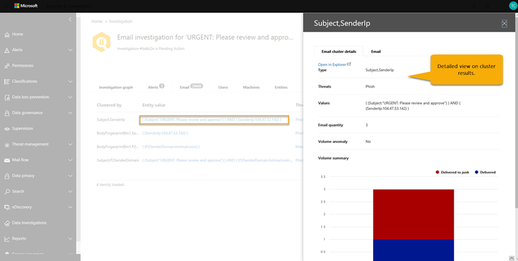

# Details en resultaten van een geautomatiseerd onderzoek in Microsoft 365

[!INCLUDE [Microsoft 365 Defender rebranding](../includes/microsoft-defender-for-office.md)]

Wanneer een [geautomatiseerd onderzoek](office-365-air.md) zich voordoet in [Office 365 Advanced Threat Protection](office-365-atp.md), zijn er in en na het proces voor automatisch onderzoek informatie over dat onderzoek beschikbaar. Als u de benodigde machtigingen hebt, kunt u deze gegevens bekijken in de weergave Details van onderzoek. De weergave onderzoek Details biedt u de actuele status en de mogelijkheid om alle in behandeling zijnde acties goed te keuren.

## Status van onderzoek

Met de status van onderzoek wordt de voortgang van de analyse en acties aangegeven. Wanneer het onderzoek wordt uitgevoerd, wordt de status gewijzigd om aan te geven of er bedreigingen zijn gevonden en of de acties zijn goedgekeurd.

****

|Status|Wat betekent dit?|
|---|---|
|Starten| Het onderzoek is geactiveerd en wacht tot de uitvoering is begonnen.|
|Werking| Het onderzoek proces is begonnen en wordt uitgevoerd. Deze status treedt ook op wanneer [acties in behandeling](https://docs.microsoft.com/microsoft-365/security/office-365-security/air-review-approve-pending-completed-actions#approve-or-reject-pending-actions) zijn goedgekeurd.|
|Geen bedreigingen gevonden| Het onderzoek is voltooid en er zijn geen bedreigingen (gebruikersaccount, e-mailbericht, URL of bestand) vastgesteld.   **Tip**: als u vermoedt dat er iets mis is, kunt u de actie ondernemen met behulp van de [Threat Explorer](https://docs.microsoft.com/microsoft-365/security/office-365-security/threat-explorer).|
|Bedreigingen gevonden|Het geautomatiseerde onderzoek heeft problemen gevonden, maar er zijn geen specifieke herstelacties om deze problemen op te lossen.   De status van de bedreigingen blijkt te bestaan wanneer sommige typen gebruikersactiviteiten zijn gevonden, maar er zijn geen opruimings acties beschikbaar. Voorbeelden hiervan zijn een van de volgende gebruikersactiviteiten:  -Een gebeurtenis van [preventie van gegevensverlies](https://docs.microsoft.com/Microsoft-365/compliance/data-loss-prevention-policies) (DLP)  -Een afwijkende e-mail verzenden  -Verstuur malware  -Verzonden phishing Het onderzoek vond geen schadelijke Url's, bestanden of e-mailberichten die u wilt herstellen, en geen activiteiten van het postvak voor het oplossen van problemen, zoals het uitschakelen van doorstuurregels of delegatie.   **Tip**: als u vermoedt dat er een fout is opgetreden (zoals een onwaar negatief), kunt u onderzoek doen en actie ondernemen met behulp van de [Threat Explorer](https://docs.microsoft.com/microsoft-365/security/office-365-security/threat-explorer).|
|Beëindigd door systeem| Het onderzoek is gestopt. Een onderzoek kan om verschillende redenen worden beëindigd: -De acties die in behandeling zijn verlopen. Time-out van activiteiten in behandeling na goedkeuring voor één week.  -Er zijn te veel acties. Als u bijvoorbeeld wilt dat te veel gebruikers op schadelijke Url's klikken, kan dit de mogelijkheid voor het onderzoek van alle analyseren te lang zijn, zodat het onderzoek stopt.   **Tip**: als een onderzoek stopt voordat er een actie is ondernomen, kunt u de [bedreigings Verkenner](https://docs.microsoft.com/microsoft-365/security/office-365-security/threat-explorer) gebruiken om bedreigingen te vinden en op te lossen.|
|Actie in behandeling| Het onderzoek heeft een bedreiging gevonden, zoals een kwaadaardige e-mail, een schadelijke URL of een instelling voor risicoieve postvakken, en een actie om te voorkomen dat de bedreiging op de [goedkeuring](https://docs.microsoft.com/microsoft-365/security/office-365-security/air-review-approve-pending-completed-actions)wacht.  De Actiestatus in behandeling wordt geactiveerd wanneer er een risico bestaat met een bijbehorende actie. De lijst met acties die in behandeling zijn, kan echter toenemen wanneer een onderzoek wordt uitgevoerd. Bekijk het [onderzoek logboek](https://docs.microsoft.com/microsoft-365/security/office-365-security/air-view-investigation-results#playbook-log) om te zien of andere items nog niet zijn voltooid.|
|Herstelde| Het onderzoek is voltooid en alle acties zijn goedgekeurd (volledig hersteld).  **Opmerking**: goedgekeurde herstelacties kunnen fouten bevatten waarmee de bewerkingen niet worden uitgevoerd. De status van onderzoek heeft geen invloed op het feit of herstelacties succesvol zijn voltooid. Bekijk het [onderzoek logboek](https://docs.microsoft.com/microsoft-365/security/office-365-security/air-view-investigation-results) voor uitgebreide resultaten.|
|Gedeeltelijk opgelost| Het onderzoek vertoont een herstelactie en sommige zijn goedgekeurd en voltooid. Andere acties zijn nog steeds [in behandeling](https://docs.microsoft.com/microsoft-365/security/office-365-security/air-review-approve-pending-completed-actions).|
|Mislukt| Minstens één onderzoek analyse heeft een probleem voorgedaan waarbij het niet goed kon worden voltooid.   **Opmerking**: als een onderzoek mislukt nadat de acties zijn goedgekeurd, zijn de herstelacties mogelijk nog steeds geslaagd. Bekijk het [onderzoek logboek](https://docs.microsoft.com/microsoft-365/security/office-365-security/air-view-investigation-results) voor uitgebreide resultaten.|
|In wachtrij geplaatst door beperking| Er wordt een onderzoek in een wachtrij gehouden. Wanneer andere tests zijn voltooid, begint het in de wachtrij geplaatste onderzoek. Beperking helpt de prestaties van de service te voorkomen.   **Tip**: met de actie in behandeling kunnen de hoeveelheid nieuwe onderzoeken worden beperkt. Zorg ervoor dat de [actie in behandeling is goedgekeurd (of genegeerd)](https://docs.microsoft.com/microsoft-365/security/office-365-security/air-review-approve-pending-completed-actions#approve-or-reject-pending-actions).|
|Beëindigd door de beperking| Als een onderzoek te lang wordt in de wachtrij gehouden, stopt dit.   **Tip**: u kunt [een onderzoek starten vanuit de Threat Explorer](https://docs.microsoft.com/microsoft-365/security/office-365-security/automated-investigation-response-office#example-a-security-administrator-triggers-an-investigation-from-threat-explorer).|
|

## Details van een onderzoek weergeven

1. Ga naar de beveiligings & nalevings centrum ( [https://protection.office.com](https://protection.office.com) ) en meld u aan.

2. Voer een van de volgende bewerkingen uit:

    - Ga naar **Threat management**  >  **Dashboard**Threat Management. U gaat nu naar het [beveiligings dashboard](security-dashboard.md). Uw lucht widgets worden weergegeven boven aan het [beveiligings dashboard](security-dashboard.md). Selecteer een widget, zoals **onderzoek samenvatting**.

    - Ga naar onderzoek voor **Threat Management**  >  **Investigations**.

    Met beide methoden gaat u naar een lijst met onderzoek.

    

3. Selecteer een item in de kolom **id** van de lijst met onderzoek. Hiermee opent u de pagina met onderzoek Details, beginnend bij de weergave onderzoek.

    

   U kunt de verschillende tabbladen gebruiken voor meer informatie over het onderzoek.

## Details weergeven van een waarschuwing die is gerelateerd aan een onderzoek

Bepaalde soorten waarschuwingen activeren geautomatiseerd onderzoek in Microsoft 365. Zie [waarschuwingen](automated-investigation-response-office.md#alerts)voor meer informatie. Gebruik de volgende procedure om details weer te geven van een waarschuwing die is gekoppeld aan een geautomatiseerd onderzoek.

1. Ga naar de beveiligings & nalevings centrum ( [https://protection.office.com](https://protection.office.com) ) en meld u aan.

2. Ga naar onderzoek voor **Threat Management**  >  **Investigations**.

3. Selecteer een item in de kolom **id** van de lijst met onderzoek.

4. Wanneer u meer wilt weten over een onderzoek, selecteert u het tabblad **meldingen** . Alle meldingen die het onderzoek veroorzaken, worden hier vermeld.

5. Selecteer een item in de lijst. Er verschijnt een flyout met details over de waarschuwing en koppelingen naar aanvullende informatie en acties.

6. De gegevens in het vervolgmenu bekijken en, afhankelijk van de bepaalde melding, een actie uitvoeren, zoals het **oplossen**, **onderdrukken**of waarschuwen van **gebruikers**.

    - **Oplossing** is gelijk aan het sluiten van een waarschuwing

    - **Onderdrukken** zorgt ervoor dat een beleid geen waarschuwingen activeert voor een bepaalde tijdsperiode

    - **Gebruikers laten weten** dat de e-mailadressen van gebruikers al zijn ingevoerd en het team van uw beveiligingsactiviteiten de mogelijkheid bieden een bericht te typen voor deze gebruikers. (Dit is vergelijkbaar met het verzenden van een bericht naar geadresseerden met behulp van de [bedreigings Verkenner](threat-explorer.md).)

## De verschillende tabbladen gebruiken

In de volgende secties vindt u meer informatie over de verschillende tabbladen op de pagina met geautomatiseerde onderzoeken en de manier waarop u deze gegevens kunt gebruiken.

### Pagina met automatisch onderzoek

Op de pagina geautomatiseerd onderzoek ziet u de onderzoeken en de huidige status van uw organisatie.

U kunt:

- Ga rechtstreeks naar een onderzoek (Selecteer een **onderzoek-id**).
- Filters toepassen. Kies uit **onderzoek type**, **tijdsbereik**, **status**of een combinatie van deze.
- Exporteer de gegevens naar een CSV-bestand.

### Onderzoek grafiek

Wanneer u een specifiek onderzoek opent, ziet u de pagina onderzoeksteam. Op deze pagina worden alle verschillende entiteiten weergegeven: e-mailberichten, gebruikers (en hun activiteiten) en apparaten die automatisch zijn onderzocht als onderdeel van de waarschuwing die is geactiveerd.

U kunt:

- Een visueel overzicht van het huidige onderzoek.
- Een overzicht van de duur van het onderzoek weergeven.
- Selecteer een knooppunt in de visualisatie om Details voor dat knooppunt weer te geven.
- Selecteer boven aan het tabblad een tabblad om Details voor dat tabblad weer te geven.

### Waarschuwing voor onderzoek

Op het tabblad **waarschuwingen** voor een onderzoek kunt u meldingen van belangrijke informatie voor onderzoek bekijken. Details omvat de melding dat het onderzoek en andere gerelateerde meldingen zijn geactiveerd, zoals risicoieve aanmelding, [DLP-beleids](https://docs.microsoft.com/Microsoft-365/compliance/data-loss-prevention-policies) schendingen, etc., die zijn gerelateerd aan het onderzoek. Op deze pagina kunnen beveiligings analist ook aanvullende Details voor afzonderlijke waarschuwingen bekijken.

U kunt:

- Een visueel overzicht van de huidige trigger en bijbehorende waarschuwingen weergeven.
- Selecteer een waarschuwing in de lijst om een uitklap pagina te openen waarin de details van de volledige waarschuwing worden weergegeven.

### E-mail onderzoek

Op het tabblad **e-mail** voor een onderzoek ziet u de oorspronkelijke e-mailberichten en de clusters met soortgelijke e-mail geïdentificeerd als onderdeel van het onderzoek.

De hoeveelheid e-mail die gebruikers in een organisatie verzenden en ontvangen, en de meerdere gebruikers van e-mail communicatie en aanvallen, het proces van

- het cluster van e-mailberichten op basis van soortgelijke kenmerken van een kop, hoofdtekst, URL en bijlage in een bericht
- het scheiden van kwaadaardige e-mail van de goede e-mail; en
- actie ondernemen op kwaadwillende e-mailberichten

kan veel tijd in beslag nemen. AIR automatiseert dit proces nu en bespaart de tijd en inspanning van uw organisatie.

Er worden drie verschillende typen e-mail clusters aangegeven tijdens de stap voor de analyse van e-mail: gelijkenis clusters (alle controles), indicator clusters (alle controles) en Postvak/gebruikers clusters.

- Gelijkenis clusters zijn e-mailberichten die worden aangegeven met de jacht voor e-mailberichten met soortgelijke afzender en inhouds kenmerken. Deze clusters worden geëvalueerd voor schadelijke inhoud op basis van de oorspronkelijke detectie bevindingen. E-mail clusters met voldoende schadelijke e-mail detectie worden als schadelijk beschouwd.
- Indicator clusters zijn e-mailberichten die worden geïdentificeerd door te zoeken naar dezelfde indicator entiteit (bestandshash of URL) van het oorspronkelijke e-mailbericht. Wanneer het ouserriginal-bestand/de URL-entiteit als schadelijk wordt geïdentificeerd, past lucht de indicator verdict toe op het hele cluster van e-mailberichten die de desbetreffende entiteit bevatten. Een bestand dat is geïdentificeerd als malware betekent dat het cluster van e-mailberichten met dat bestand als malware-e-mailberichten wordt behandeld.
- Postvak/gebruikers clusters zijn e-mailberichten die zijn gerelateerd aan de gebruiker bij een aanvaller onderzoek.  Houd er rekening mee dat deze e-mail clusters voor verdere analyse door het team van beveiligingsbewerkingen zijn bedoeld en geen acties voor het doorsturen van e-mailberichten kunnen genereren.  Het postvak/gebruikers clusters van de compromis van Playbook beoordeelt de e-mail die wordt verzonden door de gebruiker die wordt geanalyseerd, zodat u inzicht krijgt in de mogelijke gevolgen van e-mailberichten die worden verzonden via het postvak:
    - Kwaadwillende e-mailberichten die zijn verzonden via het postvak of de gebruiker, die de mogelijke compromissen van het postvak of de account weergeven en worden andere gebruikers/postvakken weergegeven die schadelijk kunnen zijn als onderdeel van een aanval.
    - Verdachte e-mailberichten die zijn verzonden door het postvak of de gebruiker, met ongewenste e-mail/bulk berichten die vanuit het postvak zijn verzonden en die mogelijk te maken hebben met mogelijke compromissen of ten minste een ongewenste activiteit van het e-mailaccount aangeven.
    - U kunt e-mailberichten die zijn verzonden door het postvak of de gebruiker wissen, waarmee het beveiligingsactiviteiten team een weergave biedt van legitieme gebruikers e-mailberichten die een weergave van geldige e-mail e-mailaccounts bevat.

Het doel van clustering is om andere verwante e-mailberichten te zoeken die door dezelfde afzender worden verzonden als onderdeel van een aanval of een campagne.  In sommige gevallen kan via legitiem e-mail onderzoek een onderzoek worden gestart (bijvoorbeeld een gebruiker heeft een marketing-e-mail).  In deze scenario's moet in het cluster van e-mail clusters wordt aangegeven dat e-mail clusters niet schadelijk zijn, op voor willekeurige wijze, en het is **niet mogelijk** om e-mail te verwijderen.

Het tabblad **e-mail** bevat ook e-mail items die betrekking hebben op het onderzoek, zoals de door de gebruiker gerapporteerde e-mail gegevens, het oorspronkelijke e-mailbericht, het e-mailbericht of de e-mailberichten zapped vanwege malware/phishing, enzovoort.

Het aantal e-mailberichten dat wordt aangegeven op het tabblad e-mail, staat momenteel voor het totaal van alle e-mailberichten die worden weergegeven op het tabblad **e-mail** . Aangezien e-mailberichten in meerdere clusters zijn opgenomen, wordt het totale aantal e-mailberichten dat wordt aangeduid (en beïnvloed door acties voor herbemiddeling) het aantal unieke e-mailberichten die in alle clusters en e-mailberichten van de oorspronkelijke geadresseerden zijn aangegeven.

E-mail van de Verkenner en de ether worden per geadresseerde verzonden, aangezien de beveiligings-Verdicts,-acties en-bezorgingslocaties verschillen per geadresseerde. Daarom telt een oorspronkelijk e-mailbericht dat naar drie gebruikers is verzonden, een totaal van drie e-mailberichten in plaats van één e-mailbericht. Er kunnen situaties zijn waarin een e-mailbericht twee of meer keren wordt geteld, bijvoorbeeld wanneer een e-mail meerdere acties bevat, of als er meerdere kopieën van de e-mail zijn wanneer alle acties plaatsvinden. Als u bijvoorbeeld een malware-e-mailbericht dat bij de bezorging is gedetecteerd, wordt weergegeven in zowel een vergrendelde e-mail als een vervangend e-mailbericht (bedreigings bestand vervangen door een waarschuwings bestand, vervolgens bezorgd in het postvak van de gebruiker). Aangezien er in het systeem wel of meerdere kopieën van de e-mail worden weergegeven, worden beide mogelijk geteld in het aantal clusters.

Het aantal e-mailberichten wordt berekend op het moment van het onderzoek en sommige tellingen worden herberekend wanneer u onderzoek-flyouten opent (op basis van een onderliggende query). Het aantal e-mailberichten dat wordt weergegeven voor de e-mail clusters op het tabblad e-mail en de waarde voor e-mail hoeveelheid die wordt weergegeven in het cluster flyout, worden berekend op het moment van onderzoek en niet gewijzigd. Het aantal e-mailberichten onderaan het tabblad e-mail van de flyout e-mail cluster en het aantal e-mailberichten in Explorer weerspiegelt de e-mailberichten die zijn ontvangen na de eerste analyse van het onderzoek. Daarom wordt in een e-mail cluster met een oorspronkelijk aantal tien e-mailberichten een e-mail lijst met het totaal aantal tien weergegeven wanneer vijf e-mailberichten binnenkomen tussen de fase onderzoek analyse en wanneer de beheerder het onderzoek beoordeelt.  Ook oude onderzoeken kunnen beginnen met het groter maken van de weergave van Verkenner-query's, aangezien ATP P2 gegevens na 7 dagen verloopt voor proefversies en 30 dagen voor betaalde licenties.  Als u de weergave van zowel historische als huidige aantallen in verschillende weergaven wilt weergeven, wordt het e-mailbericht op het moment van het onderzoek en de huidige impact op het moment van herstel weergegeven.

U kunt bijvoorbeeld het volgende scenario volgen. Het eerste cluster van drie e-mailberichten werd als phishing beschouwd. Een ander cluster met soortgelijke berichten met hetzelfde IP-adres en onderwerp werd gevonden en als schadelijk werd beschouwd, omdat sommige hiervan zijn geïdentificeerd als phishing tijdens de eerste detectie.

U kunt:
- Een visueel overzicht van de huidige cluster resultaten en-bedreigingen weergeven.
- Klik op een cluster entiteit of een lijst met bedreigingen om een uitklap pagina te openen waarop de details van de volledige waarschuwing worden weergegeven.
- Onderzoek het e-mail cluster verder door te klikken op de koppeling openen in Verkenner boven aan het tabblad Details van e-mail cluster

> [!NOTE]
> In het context van e-mailberichten ziet u mogelijk een volume anomalie risico, als onderdeel van het onderzoek. Een volume anomalie geeft een Prikker aan in soortgelijke e-mailberichten over de tijd voor onderzoek gebeurtenissen, vergeleken met eerdere tijds gebieden. Deze Prikker in het e-mail verkeer met vergelijkbare kenmerken (zoals onderwerp en e-mailadres van de afzender, Tekstsoort gelijke en IP-adres van de afzender is gebruikelijk van het starten van e-mail campagnes of aanvallen. Met grote hoeveelheden spam en legitieme e-mail campagnes deelt u deze kenmerken vaak. Volume afwijkingen vormen een potentiële bedreiging, en zijn daarom minder sterk, vergeleken met malware of phishing-bedreigingen die worden aangeduid met anti-virus motoren, detonatie of kwaadaardige reputatie.

### Gebruikers onderzoek

Op het tabblad **gebruikers** ziet u alle gebruikers die als onderdeel van het onderzoek worden geïdentificeerd. Gebruikersaccounts worden weergegeven in het onderzoek wanneer er sprake is van een gebeurtenis of aanduiding dat deze gebruikersaccounts mogelijk worden beïnvloed of gemanipuleerd.

In de volgende afbeelding heeft lucht bijvoorbeeld indicatoren voor compromissen en afwijkingen aangegeven op basis van een nieuwe regel voor Postvak in die is gemaakt. Aanvullende informatie (het bewijs) van het onderzoek bevindt zich via gedetailleerde weergaven op dit tabblad. Indicatoren voor compromissen en anomalieën kunnen ook afwijkende detecties van de beveiliging van de [Microsoft Cloud app](https://docs.microsoft.com/cloud-app-security)omvatten.

U kunt:
- Een visueel overzicht van geïdentificeerde resultaten en Risico's van gebruikers gevonden.
- Selecteer een gebruiker voor het openen van een uitklap pagina waarop de details van de volledige waarschuwing worden weergegeven.

### Computer onderzoek

Op het tabblad **computers** ziet u alle systemen die als onderdeel van het onderzoek zijn geïdentificeerd.

Als onderdeel van een playbooks, verbindt lucht de vorm van e-mail Risico's met apparaten (bijvoorbeeld zapped malware). Een onderzoek geeft bijvoorbeeld een kwaadaardige bestandshash in [Microsoft Defender ATP](https://docs.microsoft.com/windows/security/threat-protection/microsoft-defender-atp/microsoft-defender-advanced-threat-protection
) om te onderzoeken. Dit helpt voor een geautomatiseerde onderzoek van de relevante computers voor uw gebruikers, zodat bedreigingen zowel in de Cloud als in de eindpunten worden opgelost.

U kunt:

- Bekijk een visueel overzicht van de huidige systemen en bedreigingen.
- Selecteer een machine om een weergave te openen in de verwante [Microsoft Defender ATP-onderzoeken](https://docs.microsoft.com/windows/security/threat-protection/microsoft-defender-atp/automated-investigations) in het Microsoft Defender-Beveiligingscentrum.

### Dienst onderzoek

Op het tabblad **entiteiten** ziet u de entiteiten geïdentificeerd en analyseren als onderdeel van het onderzoek.

Hier ziet u de onderzochte entiteiten en Details van de typen entiteiten, zoals e-mailberichten, clusters, IP-adressen, gebruikers en meer. U kunt ook zien hoeveel entiteiten zijn geanalyseerd, en de bedreigingen waarmee elk van deze personen is geassocieerd.

U kunt:
- Een visueel overzicht van de onderzoeksinstellingen en bedreigingen voor onderzoek.
- Selecteer een entiteit om een uitklap pagina te openen waarin de details van de gerelateerde entiteit worden weergegeven.

### Playbook logboek

Op het tabblad **logboek** ziet u alle Playbook stappen die tijdens het onderzoek zijn opgetreden. In het logboek wordt een volledige inventaris opgenomen van alle analysefuncties en acties die zijn voltooid door Office 365, als onderdeel van de lucht. Het biedt een duidelijke weergave van alle genomen stappen, waaronder de actie zelf, een beschrijving en de duur van de werkelijke duur van begin tot einde.

U kunt:

- Bekijk een visueel overzicht van de stappen die u hebt gemaakt in Playbook.
- De resultaten naar een CSV-bestand exporteren.
- Filter de weergave.

****

|Analyzer| Beschrijving|
|---|---|
|DLP-schendingen onderzoek|Schendingen van [preventie van gegevensverlies](../../compliance/data-loss-prevention-policies.md) (DLP) onderzoeken|
|Extractie van e-mail indicatoren|Indicatoren uitpakken uit de koptekst, hoofdtekst en inhoud van een e-mailbericht voor onderzoek|
|Reputatie van bestands hash|Afwijkingen detecteren op basis van bestands-hashes voor gebruikers en computers in uw organisatie|
|E-mail cluster identificatie|Analyse van e-mail cluster op basis van koptekst, hoofdtekst, inhoud, bestanden en Url's|
|Analyse van clustervolume in mail|Analyse van e-mail cluster op basis van uitgaande e-mail patronen volume patronen|
|Verificatie van e-mail overdracht|De toegang tot gebruikerspostvakken voor dit onderzoek onderzoeken|
|Onderzoek van regels voor het doorsturen van e-mail|Alle regels voor het doorsturen van e-mail onderzoeken voor postvakken van gebruikers die zijn gekoppeld aan dit onderzoek|
|Gemiste malware gedetecteerd|Gemiste malware van gebruikerspostvak in uw organisatie detecteren|
|Op aanvraag detonatie|Detonatie met een uitbellen geactiveerd voor e-mailberichten, bijlagen en Url's|
|Voor uitgaand e-mail anomalie onderzoek|Afwijkingen detecteren op basis van de historische e-mail stroom voor het verzenden van patronen voor gebruikers binnen uw organisatie|
|Spam onderzoek uitgaande malware en spam|Intra-organisatie en uitgaande malware, phishing of spam detecteren van gebruikers in uw organisatie|
|Onderzoek domein van afzender|Controle op aanvraag van domein via de [Microsoft intelligent Security Graph](https://www.microsoft.com/security/operations/intelligence) en externe bedreigings informatiebronnen|
|IP-onderzoek van afzender| Controle op aanvraag van IP-reputatie via [Microsoft intelligent Security Graph](https://www.microsoft.com/security/operations/intelligence) en externe bedreigings informatiebronnen|
|URL'S klikken onderzoek| Onderzoek klikken van gebruikers die zijn beschermd door [Office 365 ATP veilige koppelingen](atp-safe-links.md) in uw organisatie|
|URL-reputatie onderzoek|Vraag over de URL op aanvraag van de [Microsoft intelligent Security Graph](https://www.microsoft.com/security/operations/intelligence) en externe bedreigings informatiebronnen|
|Onderzoek van gebruikersactiviteit|Afwijkingen van gebruikersactiviteiten analyseren in de [Microsoft Cloud-app-beveiliging](https://docs.microsoft.com/cloud-app-security/what-is-cloud-app-security)|
|Door de gebruiker gerapporteerde e-mail indicatoren|Indicatoren uitpakken uit de koptekst, hoofdtekst en inhoud van door de [gebruiker gerapporteerde e-mail](enable-the-report-message-add-in.md) voor onderzoek|
|

### Aanbevolen acties

Op het tabblad **acties** ziet u alle Playbook-acties die worden aanbevolen voor herstel na voltooiing van het onderzoek.

Acties vastleggen de stappen Microsoft raadt u aan het einde van een onderzoek aan te nemen. Door een of meer acties te selecteren, kunt u deze stappen uitvoeren. Met klikken op **goedkeuren** kunt u beginnen met herstellen. (De juiste machtigingen zijn vereist-de rol ' zoeken en wissen ' is vereist voor het uitvoeren van acties van Explorer en AIR). Een beveiligings lezer kan bijvoorbeeld acties weergeven maar deze niet goedkeuren. Opmerking: u hoeft niet elke actie goed te keuren. Als u niet akkoord gaat met de aanbevolen actie of als uw organisatie bepaalde typen acties niet kiest, kunt u ervoor kiezen **om de acties te negeren of** ze gewoon te negeren en geen actie te ondernemen. Als u alle acties goedkeurt en/of weigert, kunt u het onderzoek volledig sluiten (de status wordt hersteld), terwijl sommige acties niet-compleet worden uitgevoerd, worden de status van het onderzoek wijzigen in een gedeeltelijk herstelstatus.

U kunt:

- Een visueel overzicht van de aanbevolen acties in Playbook.
- Selecteer één actie of meerdere acties.
- Aanbevolen acties met opmerkingen goedkeuren of afwijzen.
- De resultaten naar een CSV-bestand exporteren.
- Filter de weergave.

## Volgende stappen

- [In behandeling zijnde acties controleren en goedkeuren](https://docs.microsoft.com/microsoft-365/security/office-365-security/air-review-approve-pending-completed-actions?view=o365-worldwide#approve-or-reject-pending-actions)

- [Meer informatie over het geautomatiseerde onderzoek en antwoord in Microsoft Threat Protection](https://docs.microsoft.com/microsoft-365/security/mtp/mtp-autoir)
