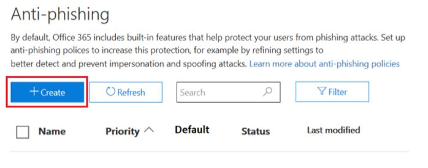
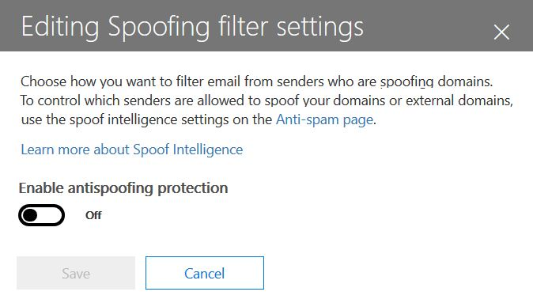
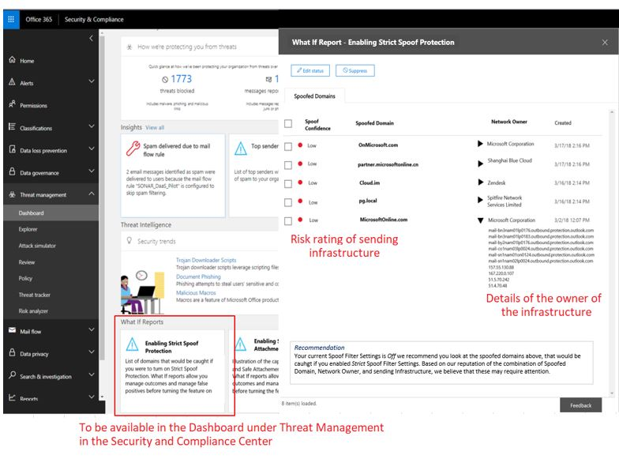
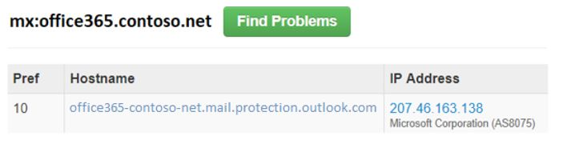

# <a name="anti-spoofing-protection-in-office-365"></a>Bescherming tegen adresvervalsing in Office 365

In dit artikel wordt beschreven hoe Office 365 phishingaanvallen tegengaat die gebruikmaken van domeinen die zijn vervalst, wat ook wel 'spoofing' wordt genoemd. Het doet dit door berichten te analyseren en degenen te blokkeren die niet kunnen worden geverifieerd met behulp van standaard e-mailverificatiemethoden, noch met andere afzendertechnieken. Deze wijziging is doorgevoerd om het aantal phishingaanvallen te verminderen waaraan organisaties in Office 365 worden blootgesteld.

Dit artikel beschrijft ook waarom deze wijziging wordt doorgevoerd, hoe klanten zich kunnen voorbereiden op deze wijziging, hoe ze berichten die worden beïnvloed kunnen bekijken, hoe berichten kunnen worden gerapporteerd, hoe fout-positieven kunnen worden beperkt, en hoe afzenders naar Microsoft zich moeten voorbereiden op deze verandering.

De anti-adresvervalsingtechnologie van Microsoft werd aanvankelijk geïmplementeerd bij haar organisaties die een Office 365 Enterprise E5-abonnement hadden of de invoegtoepassing Office 365 Advanced Threat Protection (ATP) voor hun abonnement hadden aangeschaft. Vanaf oktober 2018 hebben we de bescherming uitgebreid naar organisaties die ook Exchange Online Protection (EOP) hebben. Vanwege de manier waarop al onze filters van elkaar leren, kunnen ook Outlook.com-gebruikers worden beïnvloed.

## <a name="how-spoofing-is-used-in-phishing-attacks"></a>Hoe adresvervalsing wordt gebruikt in phishingaanvallen

Wanneer het gaat om het beschermen van haar gebruikers, neemt Microsoft de dreiging van phishing zeer serieus. Een van de technieken die spammers en phishers vaak gebruiken, is adresvervalsing. Hierbij wordt de afzender vervalst, waardoor een bericht afkomstig lijkt te zijn van iemand of ergens anders dan de daadwerkelijke bron. Deze techniek wordt vaak gebruikt in phishingcampagnes die zijn ontworpen om gebruikersgegevens te verkrijgen. De anti-adresvervalsingtechnologie van Microsoft onderzoekt specifiek de vervalsing van de kop 'Van:', die wordt weergegeven in een e-mailclient zoals Outlook. Wanneer Microsoft verdenkt dat de kop Van: is vervalst, wordt het bericht geïdentificeerd als een spoof.

Adresvervalsingberichten hebben twee negatieve gevolgen voor gebruikers:

### <a name="1-spoofed-messages-deceive-users"></a>1. Vervalste berichten misleiden gebruikers

Ten eerste kan een vervalst bericht een gebruiker ertoe verleiden op een koppeling te klikken en zijn of haar aanmeldingsgegevens op te geven, malware te downloaden of te reageren op een bericht met gevoelige inhoud (de laatste staat bekend als Business Email Compromise). In het volgende voorbeeld ziet u een phishingbericht met een vervalste afzender msoutlook94@service.outlook.com:


Het bovenstaande kwam niet echt van service.outlook.com, maar werd in plaats daarvan vervalst door de phisher om het er zo uit te laten zien. Het probeert een gebruiker te misleiden om op de koppeling in het bericht te klikken.

In het volgende voorbeeld wordt contoso.com gespooft:


Het bericht ziet er legitiem uit, maar in feite gaat het om een spoof. Dit phishingbericht is een soort zakelijke e-mailaanval. Het is een subcategorie van phishing.

### <a name="2-users-confuse-real-messages-for-fake-ones"></a>2. Gebruikers verwarren echte berichten met valse berichten

Ten tweede creëren vervalste berichten onzekerheid voor gebruikers die op de hoogte zijn van phishingberichten, maar het verschil niet kunnen zien tussen een echt bericht en een vervalst bericht. Hieronder ziet u een voorbeeld van een daadwerkelijk wachtwoordherstelbericht verstuurd vanaf het e-mailadres van het Microsoft Security-account:


Het bovenstaande bericht is afkomstig van Microsoft, maar tegelijkertijd zijn gebruikers gewend phishingberichten te ontvangen die een gebruiker kunnen verleiden om op een koppeling te klikken en hun gegevens op te geven, malware te downloaden of te reageren op een bericht met gevoelige inhoud. Omdat het moeilijk is om het verschil te zien tussen echte en vervalste wachtwoordherstelberichten negeren veel gebruikers deze berichten. Men meldt ze als spam of aan Microsoft als verijdelde poging tot phishing.

Om adresvervalsing te stoppen, heeft de e-mailfilterindustrie e-mailverificatieprotocollen ontwikkeld zoals [SPF](https://docs.microsoft.com/office365/SecurityCompliance/set-up-spf-in-office-365-to-help-prevent-spoofing), [DKIM](https://docs.microsoft.com/office365/SecurityCompliance/use-dkim-to-validate-outbound-email) en [DMARC](https://docs.microsoft.com/office365/SecurityCompliance/use-dmarc-to-validate-email). DMARC voorkomt dat adresvervalsing de afzender van een bericht onderzoekt. Dat wil zeggen, de afzender die gebruikers in hun e-mailclient zien (in de bovenstaande voorbeelden is dit service.outlook.com, outlook.com en accountprotection.microsoft.com). Bovendien kunnen gebruikers ook zien dat het domein door SPF of DKIM is geverifieerd, wat betekent dat het domein is geverifieerd en daarom niet is vervalst. Zie de sectie ‘*Begrijpen waarom e-mailverificatie niet altijd voldoende is om adresvervalsing te stoppen*’ verderop in dit artikel voor een uitgebreidere bespreking.

Het probleem is echter dat records voor e-mailverificatie optioneel zijn en niet vereist. Daarom zijn domeinen met een sterk authenticatiebeleid zoals microsoft.com en skype.com beschermd tegen adresvervalsing, maar domeinen die een zwakker authenticatiebeleid hanteren, of helemaal geen beleid, zijn doelen om te worden vervalst. Slechts 9% van de domeinen van bedrijven in de Fortune 500 hanteerde in maart 2018 een sterk e-mailverificatiebeleid. De resterende 91% kan worden vervalst door een phisher en kan, tenzij het e-mailfilter dit met ander beleid detecteert, aan een eindgebruiker worden bezorgd en hen misleiden:


Het aandeel kleine tot middelgrote bedrijven die niet in de Fortune 500 zitten en die een sterk e-mailverificatiebeleid hanteren is klein en nog kleiner voor domeinen buiten Noord-Amerika en West-Europa.

Dit is een groot probleem, omdat ondernemingen misschien niet op de hoogte zijn van hoe e-mailverificatie werkt, maar phishers begrijpen en profiteren van het gebrek daaraan.

Zie de sectie '*klanten van Office 365 '* verderop in dit document voor meer informatie over het instellen van SPF, DKIM en DMARC.

## <a name="stopping-spoofing-with-implicit-email-authentication"></a>Adresvervalsing stoppen met impliciete e-mailverificatie

Omdat phishing en spear-phishing zo'n groot probleem vormen en vanwege de beperkte acceptatie van een sterk e-mailverificatiebeleid, blijft Microsoft investeren in mogelijkheden om haar klanten te beschermen. Daarom introduceert Microsoft *impliciete e-mailverificatie*: als een domein niet wordt geverifieerd, zal Microsoft het behandelen alsof het e-mailverificatierecords heeft gepubliceerd en blokkeren als het niet door de controle komt.

Om dit te bereiken heeft Microsoft talloze uitbreidingen van reguliere e-mailverificatie gebouwd, waaronder de reputatie van de afzender, de geschiedenis van de afzender/geadresseerde, gedragsanalyse en andere geavanceerde technieken. Een bericht dat wordt verzonden vanaf een domein dat geen e-mailverificatie hanteert, wordt gemarkeerd als spoof, tenzij het andere kenmerken bevat die aangeven dat het legitiem is.

Hierdoor kunnen eindgebruikers erop vertrouwen dat een naar hen verstuurde e-mail niet is vervalst, kunnen afzenders erop vertrouwen dat niemand zich voordoet als hun domein en kunnen klanten van Office 365 nog betere bescherming bieden, zoals bescherming tegen identiteitsvervalsing.

Zie [A Sea of Phish Part 2 - Enhanced Anti-spoofing in Office 365](https://techcommunity.microsoft.com/t5/Security-Privacy-and-Compliance/Schooling-A-Sea-of-Phish-Part-2-Enhanced-Anti-spoofing/ba-p/176209) om de algemene aankondiging van Microsoft te lezen.

## <a name="identifying-that-a-message-is-classified-as-spoofed"></a>Identificeren dat een bericht is geclassificeerd als vervalst

### <a name="composite-authentication"></a>Samengestelde verificatie

Hoewel SPF, DKIM en DMARC op zichzelf allemaal nuttig zijn, geven ze niet genoeg verificatie-informatie wanneer een bericht geen expliciete verificatierecords heeft. Microsoft heeft een algoritme ontwikkeld waarin meerdere signalen worden gecombineerd tot één waarde met de naam Samengestelde verificatie, of compauth. Klanten in Office 365 hebben compauth-waarden gestempeld in de header *Authentication-Results* in de berichtkoppen.

```text
Authentication-Results:
  compauth=<fail|pass|softpass|none> reason=<yyy>
```

|**CompAuth-resultaat**|**Beschrijving**|
|:-----|:-----|
|mislukt|Bericht is niet geslaagd voor de expliciete verificatie (verzendend domein heeft records expliciet in DNS gepubliceerd) of impliciete verificatie (verzendend domein publiceerde geen records in DNS, dus Office 365 interpoleerde het resultaat alsof het records had gepubliceerd).|
|geslaagd|Bericht geslaagd voor expliciete authenticatie (bericht geslaagd voor DMARC of [Best Guess Passed DMARC](https://blogs.msdn.microsoft.com/tzink/2015/05/06/what-is-dmarc-bestguesspass-in-office-365)) of impliciete verificatie met hoog vertrouwen (verzendend domein publiceert geen e-mailverificatierecords, maar Office 365 krijgt sterke backend-signalen die aangeven dat het bericht waarschijnlijk legitiem is).|
|softpass|Bericht heeft impliciete verificatie doorgegeven met een laag tot gemiddeld vertrouwen (het verzendende domein publiceert geen e-mailverificatie, maar Office 365 krijgt backendsignalen die aangeven dat het bericht legitiem is, maar de sterkte van het signaal is zwakker).|
|geen|Bericht is niet geverifieerd (of is geverifieerd maar is niet uitgelijnd), maar samengestelde verificatie is niet toegepast vanwege de afzenderreputatie of andere factoren.|

|||
|:-----|:-----|
|**Reden**|**Beschrijving**|
|0xx |Bericht is niet geslaagd voor samengestelde verificatie.<br/>**000** betekent dat het bericht is verworpen door DMARC met als actie weigering of quarantaine.  <br/>**001** betekent dat het bericht niet is geslaagd voor impliciete e-mailverificatie. Dit houdt in dat het verzendende domein geen e-mail records voor e-mailverificatie heeft gepubliceerd of dat ze een zwakker foutbeleid hanteerden (SPF-softfail of Neutraal, DMARC-beleid p=geen).  <br/>**002** betekent dat de organisatie een beleid heeft voor het afzender/domein-paar dat expliciet is uitgesloten van het verzenden van vervalste e-mail. Deze instelling is handmatig ingesteld door een beheerder.  <br/>**010** betekent dat het bericht is verworpen door DMARC met als actie weigering of quarantaine, en het verzendende domein is een van de geaccepteerde domeinen van uw organisatie (dit is onderdeel van self-to-self- of intra-org-adresvervalsing).|
|1xx, 2xx, 3xx, 4xx, en 5xx|Komt overeen met verschillende interne codes waarom een bericht impliciete authenticatie heeft doorstaan, of geen authenticatie had maar waarop geen actie werd toegepast.|
|6xx|Betekent dat het bericht is verworpen door impliciete e-mailverificatie, en het verzendende domein is een van de geaccepteerde domeinen van uw organisatie (dit is onderdeel van self-to-self- of intra-org-adresvervalsing).|

Door te kijken naar de berichtkoppen van een bericht kan een beheerder of zelfs een eindgebruiker bepalen hoe Office 365 tot de conclusie komt dat de afzender mogelijk is gespooft.

### <a name="differentiating-between-different-types-of-spoofing"></a>Onderscheid maken tussen verschillende typen adresvervalsing

Microsoft maakt onderscheid tussen twee verschillende typen adresvervalsingberichten:

#### <a name="intra-org-spoofing"></a>Adresvervalsing binnen de organisatie

Ook wel bekend als self-to-self spoofing, dit gebeurt wanneer het domein in het Van-adres hetzelfde is als, of overeenkomt met, het ontvangende domein (wanneer het ontvangende domein een van de [geaccepteerde domeinen](https://docs.microsoft.com/exchange/mail-flow-best-practices/manage-accepted-domains/manage-accepted-domains) van uw organisatie is); of, wanneer het domein in het Van-adres deel uitmaakt van dezelfde organisatie.

In het volgende voorbeeld zijn de afzender en de geadresseerde van hetzelfde domein (contoso.com). Er zijn spaties aan het e-mailadres toegevoegd om spambot-oogsten op deze pagina te voorkomen):

> Van: afzender @ contoso.com <br/> Aan: geadresseerde @ contoso.com

De volgende domeinen van afzender en geadresseerde zijn afgestemd op het organisatiedomein (fabrikam.com):

> Van: afzender @ foo.fabrikam.com <br/> Aan: geadresseerde @ bar.fabrikam.com

De volgende domeinnamen van de afzender en de geadresseerde zijn verschillend (microsoft.com en bing.com), maar ze behoren tot dezelfde organisatie (dat wil zeggen, beide maken deel uit van de geaccepteerde domeinen van de organisatie):

> Van: sender @ microsoft.com <br/> Aan: geadresseerde @ bing.com

Berichten die op adresvervalsing binnen de organisatie duiden, bevatten de volgende waarden in de koppen:

`X-Forefront-Antispam-Report: ...CAT:SPM/HSPM/PHSH;...SFTY:9.11`

De CAT is de categorie van het bericht en wordt normaal gesproken bestempeld als SPM (spam), maar kan af en toe HSPM (hoogstwaarschijnlijk spam) of PHISH (phishing) zijn, afhankelijk van wat voor andere soorten patronen in het bericht voorkomen.

De SFTY geeft het beveiligingsniveau van het bericht, het eerste cijfer (9) betekent dat het om een phishingbericht gaat en een tweede reeks cijfers achter de punt (11) betekent dat het om adresvervalsing binnen de organisatie gaat.

Er is geen specifieke redencode voor samengestelde authenticatie voor adresvervalsing binnen organisaties, die later in 2018 zal worden uitgegeven (tijdlijn nog niet gedefinieerd).

#### <a name="cross-domain-spoofing"></a>Adresvervalsing tussen domeinen

Dit gebeurt wanneer het verzendende domein in het Van-adres een extern domein voor de ontvangende organisatie is. Berichten waarvoor de samengestelde authenticatie is mislukt vanwege adresvervalsing tussen domeinen bevatten de volgende waarden in de koppen:

`Authentication-Results: ... compauth=fail reason=000/001`

`X-Forefront-Antispam-Report: ...CAT:SPOOF;...SFTY:9.22`

In beide gevallen wordt de volgende rode veiligheidstip in het bericht geplaatst of een equivalent dat is aangepast aan de taal van het postvak van de geadresseerde:


Alleen door naar het Van-adres te kijken en te weten wat de e-mail van uw geadresseerde is, of door de e-mailheaders te inspecteren, kunt u onderscheid maken tussen adresvervalsing binnen uw organisatie en tussen domeinen.

## <a name="how-customers-of-office-365-can-prepare-themselves-for-the-new-anti-spoofing-protection"></a>Hoe klanten van Office 365 zich kunnen voorbereiden op de nieuwe bescherming tegen adresvervalsing

### <a name="information-for-administrators"></a>Informatie voor beheerders

Als beheerder van een organisatie in Office 365 zijn er verschillende belangrijke stukjes informatie waarmee u rekening moet houden.

### <a name="understanding-why-email-authentication-is-not-always-enough-to-stop-spoofing"></a>Begrijpen waarom e-mailverificatie niet altijd voldoende is om adresvervalsing te stoppen

De nieuwe bescherming tegen adresvervalsing is afhankelijk van e-mailverificatie (SPF, DKIM en DMARC) om een bericht niet als adresvervalsing te markeren. Een bekend voorbeeld is wanneer een verzendend domein nooit SPF-records heeft gepubliceerd. Als er geen SPF-records zijn of als ze niet correct zijn ingesteld, wordt een verzonden bericht gemarkeerd als vervalst, tenzij Microsoft beschikt over back-endintelligentie die zegt dat het bericht legitiem is.

Voordat bijvoorbeeld anti-adresvervalsing werd geïmplementeerd, zag een bericht er mogelijk als volgt uit zonder SPF-record, zonder DKIM-record en zonder DMARC-record:

```text
Authentication-Results: spf=none (sender IP is 1.2.3.4)
  smtp.mailfrom=fabrikam.com; contoso.com; dkim=none
  (message not signed) header.d=none; contoso.com; dmarc=none
  action=none header.from=fabrikam.com;
From: sender @ fabrikam.com
To: receiver @ contoso.com
```

Na anti-adresvervalsing wordt in Office 365 Enterprise E5, EOP of ATP de compauth-waarde afgestempeld:

```text
Authentication-Results: spf=none (sender IP is 1.2.3.4)
  smtp.mailfrom=fabrikam.com; contoso.com; dkim=none
  (message not signed) header.d=none; contoso.com; dmarc=none
  action=none header.from=fabrikam.com; compauth=fail reason=001
From: sender @ fabrikam.com
To: receiver @ contoso.com
```

Als fabrikam.com dit heeft verholpen door een SPF-record in te stellen, maar geen DKIM-record, zou dit de samengestelde verificatie doorstaan omdat het domein dat SPF heeft doorgegeven, is uitgelijnd met het domein in het Van-adres:

```text
Authentication-Results: spf=pass (sender IP is 1.2.3.4)
  smtp.mailfrom=fabrikam.com; contoso.com; dkim=none
  (message not signed) header.d=none; contoso.com; dmarc=bestguesspass
  action=none header.from=fabrikam.com; compauth=pass reason=109
From: sender @ fabrikam.com
To: receiver @ contoso.com
```

Of, als ze een DKIM-record instellen maar geen SPF-record, zou dit ook samengestelde verificatie doorstaan omdat het domein in de DKIM-handtekening dat is doorgegeven, is uitgelijnd met het domein in het Van-adres:

```text
Authentication-Results: spf=none (sender IP is 1.2.3.4)
  smtp.mailfrom=fabrikam.com; contoso.com; dkim=pass
  (signature was verified) header.d=outbound.fabrikam.com;
  contoso.com; dmarc=bestguesspass action=none
  header.from=fabrikam.com; compauth=pass reason=109
From: sender @ fabrikam.com
To: receiver @ contoso.com
```

Een phisher kan echter ook SPF en DKIM instellen en het bericht ondertekenen met hun eigen domein, maar een ander domein opgeven in het Van-adres. Noch SPF noch DKIM vereist dat het domein overeenkomt met het domein in het Van-adres, dus tenzij fabrikam.com DMARC-records publiceerde, zou dit niet worden gemarkeerd als een spoof met DMARC:

```text
Authentication-Results: spf=pass (sender IP is 5.6.7.8)
  smtp.mailfrom=maliciousDomain.com; contoso.com; dkim=pass
  (signature was verified) header.d=maliciousDomain.com;
  contoso.com; dmarc=none action=none header.from=fabrikam.com;
From: sender @ fabrikam.com
To: receiver @ contoso.com
```

In de e-mailclient (Outlook, de webversie van Outlook of een andere e-mailclient) wordt alleen het Van-domein weergegeven, niet het domein in de SPF of DKIM, en dat kan de gebruiker misleiden door te suggereren dat het bericht afkomstig is van fabrikam.com, terwijl het eigenlijk van maliciousDomain.com afkomstig is.


Om die reden vereist Office 365 dat het domein in het Van-adres overeenkomt met het domein in de SPF- of DKIM-handtekening en als dat niet zo is, andere signalen bevat die aangeven dat het bericht legitiem is. Anders is het bericht een compauth-mislukking.

```text
Authentication-Results: spf=none (sender IP is 5.6.7.8)
  smtp.mailfrom=maliciousDomain.com; contoso.com; dkim=pass
  (signature was verified) header.d=maliciousDomain.com;
  contoso.com; dmarc=none action=none header.from=contoso.com;
  compauth=fail reason=001
From: sender@contoso.com
To: someone@fabrikam.com
```

Office 365-anti beschermt zo tegen adresvervalsing van domeinen zonder verificatie en tegen domeinen die verificatie hebben ingesteld, maar die niet overeenkomen met het domein in het Van-adres dat de gebruiker ziet en waarvan hij gelooft dat het de afzender van het bericht is. Dit geldt voor zowel domeinen buiten uw organisatie als voor domeinen binnen uw organisatie.

Als u ooit een bericht ontvangt waarvan de gecombineerde verificatie mislukt dat wordt gemarkeerd als spoofed, ook al komt het bericht goed door SPF en DKIM, dan is dat omdat het domein dat goed door SPF en DKIM kwam, niet overeenkomt met het domein in het Van-adres.

### <a name="understanding-changes-in-how-spoofed-emails-are-treated"></a>Wijzigingen begrijpen in de behandeling van valse e-mails

Momenteel geldt voor alle organisaties in Office 365 (ATP en niet-ATP) dat als DMARC voor een bericht is mislukt en de organisatie heeft een beleid om berichten af te wijzen of in quarantaine te plaatsen, het bericht wordt gemarkeerd als spam en dat de actie voor Hoogstwaarschijnlijk spam wordt uitgevoerd of soms de normale spamactie (afhankelijk of andere spamregels het bericht eerder identificeren als spam). Voor adresvervalsing binnen de organisatie wordt de normale spamactie uitgevoerd. Dit hoeft niet te worden ingeschakeld en kan ook niet worden uitgeschakeld.

Voor adresvervalsing tussen meerdere domeinen gingen vóór deze wijziging echter berichten door de normale spam-, phishing- en malwarecontroles en als andere onderdelen van het filter ze als verdacht identificeerden, werden ze als spam, phishing of malware gemarkeerd. Met de nieuwe bescherming tegen adresvervalsing tussen domeinen wordt voor elk bericht dat niet kan worden geverifieerd, standaard de actie uitgevoerd die is gedefinieerd in het antiphishing- en anti-adresvervalsingbeleid. Als een van beide niet is gedefinieerd, wordt het bericht verplaatst naar de map Ongewenste e-mail van een gebruiker. In sommige gevallen wordt in de berichten ook de rode veiligheidstip toegevoegd aan het bericht.

Dit kan als gevolg hebben dat berichten die eerder werden gemarkeerd als spam, nog steeds worden gemarkeerd als spam, maar nu ook de rode veiligheidstip hebben. In andere gevallen worden berichten die eerder werden gemarkeerd als niet-spam, nu worden gemarkeerd als spam (CAT:SPOOF) met een toegevoegde rode veiligheidstip. In weer andere gevallen zullen klanten die alle spam en phishingberichten in quarantaine plaatsten, ze nu verplaatst zien worden naar de map Ongewenste e-mail (dit gedrag kan worden aangepast, zie [Anti-adresvervalsing-instellingen wijzigen](#changing-your-anti-spoofing-settings)).

Er zijn verschillende manieren om een bericht te vervalsen (zie [Onderscheid maken tussen verschillende typen adresvervalsing](#differentiating-between-different-types-of-spoofing) eerder in dit artikel), maar sinds maart 2018 is de manier waarop Office 365 deze berichten behandelt nog niet geïntegreerd. De volgende tabel is een beknopt overzicht met het nieuwe gedrag van de beveiliging tegen adresvervalsing tussen domeinen:

|**Type spoof**|**Categorie**|**Veiligheidstip toegevoegd?**|**Van toepassing op**|
|:-----|:-----|:-----|:-----|
|DMARC mislukt (quarantaine of afwijzen)|HSPM (standaard), kan ook SPM of PHSH zijn|Nee (nog niet)|Alle Office 365-gebruikers, Outlook.com|
|Self-to-self|SPM|Ja|Alle Office 365-organisaties, Outlook.com|
|Verschillende domeinen|SPOOF|Ja|Office 365-Advanced Threat Protection- en E5-klanten|

### <a name="changing-your-anti-spoofing-settings"></a>Anti-adresvervalsinginstellingen wijzigen

Als u uw anti-adresvervalsinginstellingen (tussen domeinen) wilt maken of bijwerken, gaat u naar Antiphishing- en anti-adresvervalsinginstellingen onder het tabblad Risicobeheer en -beleid in het Beleids- en compliancecentrum. Als u nog niet eerder antiphishinginstellingen hebt gemaakt, moet u er een maken:



Als u het al hebt, kunt u dat als volgt wijzigen: 


Selecteer het beleid dat u zojuist hebt gemaakt en ga verder met de stappen die zijn beschreven in [Meer informatie over adresvervalsingintelligentie](learn-about-spoof-intelligence.md).




Om nieuw beleid te maken met PowerShell:

```powershell
$org = Get-OrganizationConfig
$name = "My first anti-phishing policy for " + $org.Name
# Note: The name should not exclude 64 characters, including spaces.
# If it does, you will need to pick a smaller name.
# Next, create a new anti-phishing policy with the default values
New-AntiphishPolicy -Name $Name
# Select the domains to scope it to
# Multiple domains are specified in a comma-separated list
$domains = "domain1.com, domain2.com, domain3.com"
# Next, create the anti-phishing rule, scope it to the anti-phishing rule
New-AntiphishRule -Name $name -AntiphishPolicy $name -RecipientDomainIs $domains
```

kunt u vervolgens de parameters voor het anti-adresvervalsingbeleid wijzigen met PowerShell, volgens de documentatie op [Set-AntiphishPolicy](https://docs.microsoft.com/powershell/module/exchange/advanced-threat-protection/Set-AntiPhishPolicy). kunt u de $name opgeven als parameter:

```powershell
Set-AntiphishPolicy -Identity $name <fill in rest of parameters>
```

Later in 2018 wordt, in plaats van dat u standaardbeleid moet maken, beleid voor u aangemaakt dat alle geadresseerden in uw organisatie omvat, zodat u dat niet handmatig hoeft op te geven (de schermafbeeldingen hieronder worden mogelijk gewijzigd voor de uiteindelijke implementatie).


In tegenstelling tot beleid dat u maakt, kunt u het standaardbeleid niet verwijderen, de prioriteit aanpassen of kiezen op welke gebruikers, domeinen of groepen het van toepassing is.


Om uw standaardbeveiliging in te stellen met PowerShell:

```powershell
$defaultAntiphishPolicy = Get-AntiphishPolicy | ? {$_.IsDefault -eq $true}
Set-AntiphishPolicy -Identity $defaultAntiphishPolicy.Name -EnableAntispoofEnforcement <$true|$false>
```

U moet alleen de bescherming tegen adresvervalsing uitschakelen als u een andere e-mailserver of servers voor Office 365 hebt (zie Legitieme scenario’s om anti-adresvervalsing uit te schakelen voor meer informatie).

```powershell
$defaultAntiphishPolicy = Get-AntiphishiPolicy | ? {$_.IsDefault $true}
Set-AntiphishPolicy -Identity $defaultAntiphishPolicy.Name -EnableAntispoofEnforcement $false
```

> [!IMPORTANT]
> Als de eerste halte in uw e-mailpad Office 365 is en er te veel legitieme e-mail wordt gemarkeerd als spoof, moet u eerst uw afzenders instellen die vervalste e-mail mogen verzenden naar uw domein (zie de sectie [Legitieme afzenders beheren die niet-geverifieerde e-mail zenden](#managing-legitimate-senders-who-are-sending-unauthenticated-email) in dit artikel. Als u nog steeds te veel fout-positieven krijgt (dat legitieme berichten worden gemarkeerd als adresvervalsing), raden we NIET aan de volledige bescherming tegen adresvervalsing uit te schakelen. U wordt geadviseerd te kiezen voor de beschermingsoptie Basis in plaats van Hoog. Het is beter om te werken met fout-positieven dan uw organisatie bloot te stellen aan adresvervalsing-e-mail die u aanmerkelijk meer zou kunnen kosten op de langere termijn.

### <a name="managing-legitimate-senders-who-are-sending-unauthenticated-email"></a>Legitieme afzenders beheren die niet-geverifieerde e-mail zenden

In Office 365 wordt bijgehouden wie niet-geverifieerde e-mail naar uw organisatie stuurt. Als de service de afzender niet verifieert, wordt die gemarkeerd als een *compauth*-mislukking. Dit wordt geclassificeerd als SPOOF, hoewel dit afhankelijk is van het anti-adresvervalsingbeleid dat op het bericht is toegepast.

Als beheerder kunt u echter opgeven welke afzenders spoof-e-mail mogen verzenden en de beslissing van Office 365 negeren.

#### <a name="method-1---if-your-organization-owns-the-domain-set-up-email-authentication"></a>Methode 1: e-mailverificatie instellen als uw organisatie eigenaar is van het domein

Deze methode kan worden gebruikt om adresvervalsing binnen de organisatie op te lossen en adresvervalsing tussen domeinen in de gevallen waar u eigenaar bent van of interactie hebt met meerdere tenants. Het helpt ook adresvervalsing tussen domeinen op te lossen wanneer u naar andere klanten binnen Office 365 zendt en ook derden die worden gehost door andere providers.

Zie [klanten van Office 365](#customers-of-office-365)voor meer informatie.

#### <a name="method-2---use-spoof-intelligence-to-configure-permitted-senders-of-unauthenticated-email"></a>Methode 2: gebruik Spoof Intelligence om toegestane afzenders van niet-geverifieerde e-mail te configureren

U kunt [Spoof Intelligence](learn-about-spoof-intelligence.md) ook gebruiken om afzenders toe te staan niet-geverifieerde berichten naar uw organisatie te verzenden.

Voor externe domeinen is de vervalste gebruiker het domein in het Van-adres, terwijl de verzendende infrastructuur ofwel het verzendende IP-adres is (onderverdeeld in /24 CIDR-bereiken) ofwel het organisatiedomein van het PTR-record (in de onderstaande schermafbeelding kan het IP-adres 131.107.18.4 zijn, waarvan het PTR-record outbound.mail.protection.outlook.com is, en dit zou verschijnen als outlook.com voor de verzendende infrastructuur).

Om deze afzender toe te staan niet-geverifieerde e-mail te verzenden, wijzigt u **Nee** in **Ja**.


U kunt ook PowerShell gebruiken om specifieke afzenders toestemming te geven niet-geverifieerde e-mail naar uw domein te zenden:

```powershell
$file = "C:\My Documents\Summary Spoofed Internal Domains and Senders.csv"
Get-PhishFilterPolicy -Detailed -SpoofAllowBlockList -SpoofType External | Export-CSV $file
```


In de vorige afbeelding zijn extra regeleinden toegevoegd om de schermafbeelding passend te maken. Normaliter worden alle waarden weergegeven op een enkele regel.

Bewerk het bestand en zoek naar de regel die overeenkomt met outlook.com en bing.com en wijzig de vermelding AllowedToSpoof van Nee in Ja:


Bewaar het bestand en voer de volgende opdracht uit:

```powershell
$UpdateSpoofedSenders = Get-Content -Raw "C:\My Documents\Spoofed Senders.csv"
Set-PhishFilterPolicy -Identity Default -SpoofAllowBlockList $UpdateSpoofedSenders
```

Hierdoor kan bing.com niet-geverifieerde e-mail sturen vanuit \*.outlook.com.

#### <a name="method-3---create-an-allow-entry-for-the-senderrecipient-pair"></a>Methode 3: een vermelding met toestemming maken voor het afzender/geadresseerde-paar

U kunt er ook voor kiezen alle spamfilters te negeren voor een specifieke afzender. Zie [Een afzender veilig toevoegen aan een lijst met geaccepteerde adressen in Office 365](https://blogs.msdn.microsoft.com/tzink/2017/11/29/how-to-securely-add-a-sender-to-an-allow-list-in-office-365/) voor meer informatie.

Als u deze methode gebruikt, wordt het spamfilter en bepaalde phishingfilters overgeslagen, maar niet de malware-filters.

#### <a name="method-4---contact-the-sender-and-ask-them-to-set-up-email-authentication"></a>Methode 4: contact opnemen met de afzender en die vragen e-mailverificatie in te stellen

Vanwege de problemen met spam en phishing, raadt Microsoft aan dat alle afzenders e-mailverificatie instellen. Als u een beheerder van het zendende domein kent, neem daar dan contact mee op en vraag of hij e-mailverificatierecords wil instellen, zodat u geen uitzonderingen hoeft toe te voegen. Zie [Beheerders van domeinen die geen Office 365-klanten zijn](#administrators-of-domains-that-are-not-office-365-customers) verderop in dit artikel voor meer informatie.

Hoewel het in het begin misschien moeilijk is om zendende domeinen zo ver te krijgen dat ze verifiëren, zullen ze na verloop van tijd, als er meer en meer e-mailfilters hun e-mail als ongewenst markeren of zelfs afwijzen, de juiste records instellen voor betere aflevering.

### <a name="viewing-reports-of-how-many-messages-were-marked-as-spoofed"></a>Rapporten bekijken over hoeveel berichten zijn gemarkeerd als vervalst

Wanneer uw anti-adresvervalsingbeleid is ingeschakeld, kunt u de mogelijkheden risico-onderzoek en reacties gebruiken om te bepalen hoeveel berichten als phishing zijn gemarkeerd. Ga hiervoor naar het Beveiligings- en compliancecentrum (SCC) onder Risicobeheer \> Verkenner, stel de weergave in op Phishing en groepeer op Zendend domein of Beveiligingsstatus:


U kunt wisselen tussen de verschillende rapporten om te zien hoeveel berichten zijn gemarkeerd als phishing, met inbegrip van de berichten die zijn gemarkeerd als SPOOF. Zie [Aan de slag met bedreigingenonderzoek en reacties van Office 365](office-365-ti.md) voor meer informatie.

U kunt nog geen onderscheid maken tussen berichten die zijn gemarkeerd als adresvervalsing en andere typen van phishing (algemeen phishing, domein- of gebruikersimitatie, enzovoort). Later zult u dit echter wel kunnen doen via het Beveiligings- en compliancecentrum. Wanneer u dat doet, kunt u dit rapport gebruiken als uitgangspunt voor de identificatie van zendende domeinen die legitiem kunnen zijn, maar worden gemarkeerd als adresvervalsing vanwege mislukte verificatie.

De volgende schermafbeelding is een voorstelling van hoe deze gegevens eruit zullen zien, maar die nog kan worden gewijzigd wanneer ze worden uitgebracht:


Voor niet-ATP- en E5-klanten zijn deze rapporten later beschikbaar onder de Statusrapporten risicobeveiliging (TPS), maar worden ze ten minste 24 uur uitgesteld. Deze pagina wordt bijgewerkt wanneer die zijn geïntegreerd in het Beveiligings- en compliancecentrum.

### <a name="predicting-how-many-messages-will-be-marked-as-spoof"></a>Voorspellen hoeveel berichten worden gemarkeerd als spoof

Zodra de instellingen van Office 365 zijn bijgewerkt zodat u de functie voor het afdwingen van controle op vervalsing uit kunt schakelen of de bescherming op Basis of Hoog kunt instellen, krijgt u de mogelijkheid om te zien hoe berichtrangschikking zal veranderen in de verschillende instellingen. Dat wil zeggen, dat als de bescherming tegen adresvervalsing is uitgeschakeld, u kunt zien hoeveel berichten worden gemarkeerd als adresvervalsing als u de bescherming op Basis instelt, of, als die al is ingesteld op Basis, hoeveel meer berichten zullen worden gemarkeerd als adresvervalsing als u die wijzigt in Hoog.

Deze functie wordt momenteel ontwikkeld. Wanneer er meer details zijn gedefinieerd, wordt deze pagina bijgewerkt met zowel schermafbeeldingen van het Beveiligings- en compliancecentrum als met PowerShell-voorbeelden.




### <a name="legitimate-scenarios-to-disable-anti-spoofing"></a>Legitieme scenario’s om anti-adresvervalsing uit te schakelen

Anti-adresvervalsing beschermt klanten beter tegen phishingaanvallen en het wordt daarom met klem afgeraden deze bescherming uit te schakelen. Door de bescherming uit te schakelen, kunt u misschien op de korte termijn een aantal fout-positieven oplossen, maar op de lange termijn loopt u meer risico. De kosten voor het instellen van verificatie aan de kant van de afzender of aanpassingen aanbrengen in het antiphisingbeleid zijn meestal eenmalige gebeurtenissen of vereisen alleen minimaal, periodiek onderhoud. De kosten om te herstellen van een phishingaanval waar gegevens zijn blootgegeven of activa in gevaar zijn geweest, zijn veel hoger.

Om die reden is het beter om te werken met fout-positieven dan de adresvervalsingbescherming uit te schakelen.

Er is echter een legitiem scenario waarin anti-adresvervalsing moet zijn uitgeschakeld en dat is wanneer er zich aanvullende e-mailfilterproducten in de berichtroutering bevinden en Office 365 niet de eerste halte is in het e-mailpad:


De andere server kan een on-premises Exchange-e-mailserver zijn, een e-mailfiltermiddel als Ironport of een andere cloudservice.

Als het MX-record van het ontvangende domein niet verwijst naar Office 365, is het niet nodig om anti-adresvervalsing uit te schakelen, omdat Office 365 het MX-record van het ontvangende domein opzoekt en anti-adresvervalsing onderdrukt als het verwijst naar een andere service. Als u niet weet of uw domein een andere server ervoor hebt, kunt u een website als MX Toolbox gebruiken om het MX-record op te zoeken. Dit kan er bijvoorbeeld zo uitzien:


Dit domein heeft een MX-record dat niet verwijst naar Office 365, dus Office 365 zou geen anti-adresvervalsinghandhaving toepassen.

Als het MX-record van het ontvangende domein *wel* naar Office 365 verwijst, ook al is er een andere service vóór Office 365, moet u anti-adresvervalsing uitschakelen. Het meest voorkomende voorbeeld is het gebruik van een herschrijving van een geadresseerde:


Het MX-record van domein contoso.com verwijst naar de lokale server, terwijl het MX-record van domain @ office365.contoso.net naar Office 365 verwijst omdat het MX-record \*.protection.outlook.com of \*.eo.outlook.com bevat:



Zorg ervoor dat u onderscheid maakt wanneer het MX-record van een ontvangend domein niet naar Office 365 verwijst en wanneer het een herschrijving van een geadresseerde heeft ondergaan. Het is belangrijk om onderscheid tussen deze twee gevallen te maken.

Als u niet zeker weet of uw ontvangende domein al dan niet een herschrijving van de geadresseerde heeft ondergaan, kunt u dit soms zien door naar de berichtkoppen te kijken.

a) Kijk eerst naar de headers in het bericht voor het ontvangende domein in de header Authentication-Results:

```text
Authentication-Results: spf=fail (sender IP is 1.2.3.4)
  smtp.mailfrom=fabrikam.com; office365.contoso.net; dkim=fail
  (body hash did not verify) header.d=simple.fabrikam.com;
  office365.contoso.net; dmarc=none action=none
  header.from=fabrikam.com; compauth=fail reason=001
```

Het ontvangende domein is niet gevonden in de vetgedrukte rode tekst erboven, in dit geval office365.contoso.net. Dit kan afwijken van de geadresseerde in de header Aan:

Aan: Voorbeeldgeadresseerde \< geadresseerde @ contoso.com\>

Voer een MX-recordzoekactie uit van het feitelijke ontvangende domein. Als dit \*.protection.outlook.com, mail.messaging.microsoft.com, \*.eo.outlook.com, or mail.global.frontbridge.com bevat, betekent dit dat het MX verwijst naar Office 365.

Als het deze waarden niet bevat, betekent het dat het MX niet naar Office 365 verwijst. Een hulpprogramma dat u kunt gebruiken om dit te verifiëren is MX Toolbox.

Voor dit specifieke voorbeeld wordt aangegeven dat contoso.com, het domein dat lijkt op de geadresseerde, omdat het de Aan:-header was, een MX-record heeft dat verwijst naar een on-premises server:


De feitelijke geadresseerde is office365.contoso.net wiens MX-record wel verwijst naar Office 365:


Daarom is dit bericht waarschijnlijk herschreven door een geadresseerde.

b) Zorg er dan voor dat u onderscheid maakt tussen gewone use cases van herschrijvingen van geadresseerden. Als u het ontvangende domein gaat herschrijven naar \*.onmicrosoft.com, herschrijf het dan in plaats daarvan naar \*.mail.onmicrosoft.com.

Wanneer u het uiteindelijke domein hebt geïdentificeerd dat zich achter een andere server bevindt en het MX-record van het ontvangende domein verwijst naar Office 365 (zoals gepubliceerd in de DNS-records), kunt u doorgaan en anti-adresvervalsing uitschakelen.

Denk eraan, u wilt anti-adresvervalsing niet uitschakelen als de eerste halte van het domein in het routeringspad Office 365 is, maar alleen wanneer die zich achter een of meer services bevindt.

### <a name="how-to-disable-anti-spoofing"></a>Anti-adresvervalsing uitschakelen

Als u al een antiphishingfilter hebt gemaakt, stelt u de parameter *EnableAntispoofEnforcement* in op $false:

```powershell
$name = "<name of policy>"
Set-AntiphishPolicy -Identity $name -EnableAntiSpoofEnforcement $false
```

Als u de naam van het beleid dat u wilt uitschakelen niet weet, kunt u deze weergeven:

```powershell
Get-AntiphishPolicy | Format-List Name
```

Als u geen bestaand antiphishingbeleid hebt, kunt u het maken en het vervolgens uitschakelen (zelfs als u geen beleid hebt, wordt anti-adresvervalsing nog steeds toegepast; later in 2018 wordt er een standaardbeleid gemaakt voor u en kunt u dat vervolgens uitschakelen in plaats van beleid te maken). U moet dit in meerdere stappen doen:

```powershell
$org = Get-OrganizationConfig
$name = "My first anti-phishing policy for " + $org.Name
# Note: If the name is more than 64 characters, you will need to choose a smaller one
```

```powershell
# Next, create a new anti-phishing policy with the default values
New-AntiphishPolicy -Name $Name
# Select the domains to scope it to
# Multiple domains are specified in a comma-separated list
$domains = "domain1.com, domain2.com, domain3.com"
# Next, create the anti-phishing rule, scope it to the anti-phishing rule
New-AntiphishRule -Name $name -AntiphishPolicy -RecipientDomainIs $domains
# Finally, scope the anti-phishing policy to the domains
Set-AntiphishPolicy -Identity $name -EnableAntispoofEnforcement $false
```

Het uitschakelen van anti-adresvervalsing is alleen beschikbaar via cmdlet (later zal het beschikbaar komen in het Beveiligings- en compliancecentrum). Als u geen toegang hebt tot PowerShell, maakt u een ondersteuningsticket.

Onthoud dat dit alleen moet worden toegepast op domeinen die indirect worden gerouteerd naar Office 365. Weersta de verleiding om anti-adresvervalsing uit te schakelen vanwege een aantal fout-positieven, het zal op de lange termijn beter zijn om deze te accepteren.

### <a name="information-for-individual-users"></a>Informatie voor afzonderlijke gebruikers

Afzonderlijke gebruikers zijn beperkt in de manier waarop ze kunnen omgaan met de beveiligingstips voor de bescherming tegen adresvervalsing. Er zijn echter verschillende dingen die u kunt doen om veelvoorkomende scenario's op te lossen.

### <a name="common-scenario-discussion-lists"></a>Veelvoorkomend scenario: discussielijsten

Van discussielijsten is bekend dat ze problemen hebben met anti-adresvervalsing vanwege de manier waarop ze het bericht doorsturen en de inhoud ervan wijzigen, maar het oorspronkelijke Van-adres behouden.

Stel dat Gabriela Laureano (glaureano @ contoso.com) geïnteresseerd is in vogels spotten en lid wordt van de discussielijst vogelspotters @ fabrikam.com. Wanneer ze een bericht naar de discussielijst verzendt, ziet dit er als volgt uit:

> **Van:** Gabriela Laureano \<glaureano @ contoso.com\> <br/> **Aan:** Discussielijst Vogelspotters \<vogelspotters @ fabrikam.com\> <br/> 
**Betreft:** Geweldig treffen van blauwe gaaien op de top van de Wageningse Berg deze week <br/><br/>Wil iedereen de bezichtiging zien deze week vanaf de Wageningse Berg?

Wanneer de e-maillijst het bericht ontvangt, wordt het bericht geformatteerd, de inhoud ervan gewijzigd en doorgespeeld aan de rest van de leden op de discussielijst, die bestaat uit deelnemers van veel verschillende e-mailontvangers.

> **Van:** Gabriela Laureano \<glaureano @ contoso.com\> <br/> **Aan:** Discussielijst Vogelspotters \<vogelspotters @ fabrikam.com\> <br/> **Betreft:** [VOGELSPOTTERS] Geweldig treffen van blauwe gaaien op de top van de Wageningse Berg deze week <br/><br/> Wil iedereen de bezichtiging zien deze week vanaf de Wageningse Berg? <br/><br/> Dit bericht is verzonden naar de Vogelspotters-discussielijst. U kunt zich op elk moment weer afmelden.

In dit voorbeeld heeft het opnieuw afgespeelde bericht hetzelfde Van-adres (glaureano @ contoso.com), maar het oorspronkelijke bericht is gewijzigd door een tag toe te voegen aan de Onderwerpregel en een voettekst onderaan het bericht. Dit type berichtwijziging komt veel voor in adressenlijsten en kan leiden tot fout-positieven.

Als u of iemand in uw organisatie een beheerder van een adressenlijst is, kunt u deze mogelijk configureren om anti-adresvervalsingcontroles te herkennen.

- Bekijk de veelgestelde vragen op DMARC.org: [Ik heb een adressenlijst en ik wil samenwerken met DMARC, wat moet ik doen?](https://dmarc.org/wiki/FAQ#I_operate_a_mailing_list_and_I_want_to_interoperate_with_DMARC.2C_what_should_I_do.3F)

- Lees de instructies in dit blogbericht: [Een tip voor adressenlijstbeheerders om samen te werken met DMARC om fouten te voorkomen](https://blogs.msdn.microsoft.com/tzink/2017/03/22/a-tip-for-mailing-list-operators-to-interoperate-with-dmarc-to-avoid-failures/)

- Als u updates op de adressenlijstserver wilt installeren om ARC te ondersteunen, raadpleegt u [https://arc-spec.org](https://arc-spec.org/)

Als u niet de eigenaar van de adressenlijst bent:

- U kunt de beheerder van de adressenlijst vragen om een van de vorige opties te implementeren (hij moet ook e-mailverificatie hebben ingesteld voor het domein waar vandaan de adressenlijst wordt doorgestuurd).

- U kunt postvakregels maken in uw e-mailclient om berichten naar postvak IN te verplaatsen. U kunt ook de beheerders van uw organisatie vragen om toestemmingsregels of overrides in te stellen, zoals besproken in de sectie [Beheren van legitieme afzenders die niet-geverifieerde e-mail verzenden](#managing-legitimate-senders-who-are-sending-unauthenticated-email) van dit artikel.

- U kunt met Office 365 een ondersteuningsticket maken om een override voor de adressenlijst te maken om deze als legitiem te beschouwen.

### <a name="other-scenarios"></a>Andere scenario's

1. Als geen van de bovenstaande veelvoorkomende scenario's op uw situatie van toepassing is, stuurt u het bericht als fout-positief door aan Microsoft. Voor meer informatie raadpleegt u de sectie [Hoe kan ik spam of niet-spamberichten doorgeven aan Microsoft?](#how-can-i-report-spam-or-non-spam-messages-back-to-microsoft), verderop in dit artikel.

2. U kunt ook contact opnemen met uw e-mailbeheerder die een ondersteuningsticket kan genereren bij Microsoft. Het technische team van Microsoft zal onderzoeken waarom het bericht als spoof is gemarkeerd.

3. Bovendien, als u weet wie de afzender is en er zeker van bent dat ze niet met opzet worden gespooft, kunt u de afzender antwoorden met de mededeling dat ze berichten verzenden van een mailserver die niet is geverifieerd. Dit heeft soms tot gevolg dat de oorspronkelijke afzender contact opneemt met zijn IT-beheerder, die de vereiste e-mailverificatierecords zal instellen.

   Wanneer voldoende afzenders aan domeineigenaren antwoorden dat ze e-mailverificatierecords moeten instellen, zet dit hen aan tot actie. Hoewel Microsoft ook met domeineigenaren samenwerkt om de vereiste records te publiceren, is het nog beter wanneer afzonderlijke gebruikers erom vragen.

4. Voeg desgewenst de afzender toe aan de lijst met veilige afzenders. Houd er echter rekening mee dat als een phisher dit account vervalst, het wordt bezorgd in uw postvak. Deze optie moet daarom spaarzaam worden gebruikt.

## <a name="how-senders-to-microsoft-should-prepare-for-anti-spoofing-protection"></a>Hoe afzenders naar Microsoft zich moeten voorbereiden op bescherming tegen adresvervalsing

Als u een beheerder bent die momenteel berichten naar Microsoft verzendt, hetzij Office 365 of Outlook.com, moet u ervoor zorgen dat uw e-mail correct is geverifieerd, anders kan deze worden gemarkeerd als spam of phishing.

### <a name="customers-of-office-365"></a>Klanten van Office 365

Als u een Office 365-klant bent en u gebruikt Office 365 om uitgaande e-mail te verzenden:

- Voor uw domeinen [SPF instellen in Office 365 om adresvervalsing te voorkomen](set-up-spf-in-office-365-to-help-prevent-spoofing.md)

- Voor uw primaire domeinen [DKIM gebruiken voor het valideren van uitgaande e-mail die is verzonden via uw aangepaste domein in Office 365](use-dkim-to-validate-outbound-email.md)

- [U kunt overwegen om DMARC records in te stellen](use-dmarc-to-validate-email.md) voor uw domein om te bepalen wie uw legitieme afzenders zijn

Microsoft biedt geen gedetailleerde implementatierichtlijnen voor SPF, DKIM en DMARC. Er wordt echter veel informatie online gepubliceerd. Er zijn ook andere bedrijven die uw organisatie kunnen helpen bij het opzetten van e-mailverificatierecords.

### <a name="administrators-of-domains-that-are-not-office-365-customers"></a>Beheerders van domeinen die geen Office 365-klanten zijn

Als u een domeinbeheerder bent maar geen Office 365-klant, gaat u als volgt te werk:

- U moet SPF instellen om de verzend-IP-adressen van uw domein te publiceren en ook DKIM (indien beschikbaar) instellen om berichten digitaal te ondertekenen. U kunt ook overwegen om DMARC-records in te stellen.

- Als u bulkafzenders hebt die namens u e-mail verzenden, moet u met hen samenwerken om e-mail zodanig te verzenden dat het verzendende domein in het Van-adres (als het van u is) overeenkomt met het domein dat SPF of DMARC doorgeeft.

- Als u lokale e-mailservers hebt, of verzendt van een Software-as-a-service-provider of van een cloud-hostingservice zoals Microsoft Azure, GoDaddy, Rackspace, Amazon Web Services of iets dergelijks, moet u ervoor zorgen dat deze wordt toegevoegd aan uw SPF-record.

- Als u een klein domein bent dat wordt gehost door een internetprovider, moet u uw SPF-record instellen volgens de instructies die uw internetprovider u heeft verstrekt. De meeste internetproviders bieden dit soort instructies die zijn te vinden op de ondersteuningspagina's van de organisatie.

- Zelfs als u voorheen geen e-mailverificatierecords hoefde te publiceren en alles prima werkte, moet u nog steeds e-mailverificatierecords publiceren om naar Microsoft te verzenden. Door dit te doen, helpt u de strijd tegen phishing en verkleint u de kans dat u, of organisaties naar wie u verstuurt, met phishing te maken krijgen.

### <a name="what-if-you-dont-know-who-sends-email-as-your-domain"></a>Wat als u niet weet wie e-mail als uw domein verstuurt?

Door veel domeinen worden SPF-records niet gepubliceerd omdat ze niet weten wie alle afzenders zijn. Dat is geen probleem, u hoeft niet te weten wie dit allemaal zijn. In plaats daarvan moet u beginnen met een SPF-record te publiceren voor degenen die u wel kent, vooral waar uw zakelijke verkeer zich bevindt, en een neutraal SPF-beleid, `?all`te publiceren:

```text
fabrikam.com IN TXT "v=spf1 include:spf.fabrikam.com ?all"
```

Het neutrale SPF-beleid betekent dat elke e-mail die uit uw organisatie-infrastructuur komt, e-mailverificatie doorgeeft aan alle andere e-mailontvangers. E-mail die afkomstig is van afzenders die u niet kent, wordt weer neutraal, wat bijna hetzelfde is als het publiceren van helemaal geen SPF-record.

Bij verzending naar Office 365 wordt e-mail die afkomstig is van uw zakelijke verkeer gemarkeerd als geverifieerd, maar de e-mail die afkomstig is van bronnen die u niet kent, kan nog steeds worden gemarkeerd als spoof (afhankelijk van of Office 365 het al dan niet impliciet kan verifiëren). Dit is echter nog steeds een verbetering in plaats van dat alle e-mail door Office 365 als spoof wordt gemarkeerd.

Als u eenmaal bent begonnen met een SPF-record met een terugvalbeleid van ?Alles, kunt u geleidelijk meer en meer verzendinfrastructuur opnemen en vervolgens een strikter beleid publiceren.

### <a name="what-if-you-are-the-owner-of-a-mailing-list"></a>Wat als u de eigenaar bent van een mailinglijst?

Zie de sectie [Veelvoorkomend scenario: Discussielijsten](#common-scenario-discussion-lists) eerder in dit artikel.

### <a name="what-if-you-are-an-infrastructure-provider-such-as-an-internet-service-provider-isp-email-service-provider-esp-or-cloud-hosting-service"></a>Wat moet u doen als u een infrastructuurprovider bent, zoals een internetprovider (ISP), e-mailserviceprovider (ESP) of Cloud Hosting Service?

Als u de e-mail van een domein host en deze e-mail verzendt of een hosting-infrastructuur biedt die e-mail kan verzenden, moet u het volgende doen:

- Zorg ervoor dat uw klanten documentatie hebben die aangeeft wat ze in hun SPF-records moeten publiceren

- U kunt DKIM-handtekeningen ondertekenen voor uitgaande e-mail, zelfs als de klant deze niet expliciet instelt (met een standaarddomein). U kunt zelfs het e-mailbericht met DKIM-handtekeningen dubbel ondertekenen (eenmaal met het domein van de klant als ze het hebben ingesteld, en een tweede keer met de handtekening van de DKIM van uw organisatie).

Bezorging aan Microsoft is niet gegarandeerd, zelfs niet als u e-mail verifieert die afkomstig is van uw platform, maar het zorgt er in ieder geval voor dat Microsoft uw e-mail niet als spam markeert, omdat deze niet is geverifieerd. Als u meer wilt weten over de manier waarop Outlook.com e-mail filtert, raadpleegt u de pagina [Outlook.com Postbeheerder](https://postmaster.live.com/pm/postmaster.aspx).

Zie voor meer informatie over aanbevolen procedures voor serviceproviders [M3AAWG aanbevolen procedures voor mobiele berichten voor serviceproviders](https://www.m3aawg.org/sites/default/files/M3AAWG-Mobile-Messaging-Best-Practices-Service-Providers-2015-08.pdf).

## <a name="frequently-asked-questions"></a>Veelgestelde vragen

### <a name="why-is-microsoft-making-this-change"></a>Waarom voert Microsoft deze wijziging door?

Vanwege de impact van phishingaanvallen en omdat e-mailverificatie al meer dan 15 jaar bestaat, is Microsoft van mening dat het risico om niet-geverifieerde e-mail te blijven toestaan, groter is dan het risico om legitieme e-mail te verliezen.

### <a name="will-this-change-cause-legitimate-email-to-be-marked-as-spam"></a>Kan deze wijziging ervoor zorgen dat legitieme e-mail als spam wordt gemarkeerd?

In eerste instantie zijn er enkele berichten die als spam worden gemarkeerd. In de loop van de tijd zullen afzenders zich echter aanpassen en zal het aantal verkeerd gelabelde vervalste berichten voor de meeste e-mailpaden verwaarloosbaar zijn.

Microsoft heeft deze functie eerst enkele weken zelf toegepast, voordat deze bij de rest van haar klanten werd geïmplementeerd. Hoewel er aanvankelijk sprake was van verstoring, nam deze geleidelijk af.

### <a name="will-microsoft-bring-this-feature-to-outlookcom-and-non-advanced-threat-protection-customers-of-office-365"></a>Gaat Microsoft deze functie introduceren bij klanten met Outlook.com en niet-geavanceerde bedreigingsbescherming van Office 365?

De anti-adresvervalsingtechnologie van Microsoft werd aanvankelijk geïmplementeerd bij haar organisaties die een Office 365 Enterprise E5-abonnement hadden of de invoegtoepassing Office 365 Advanced Threat Protection (ATP) voor hun abonnement hadden aangeschaft. Vanaf oktober 2018 hebben we de bescherming uitgebreid naar organisaties die ook Exchange Online Protection (EOP) hebben. In de toekomst kunnen we het voor Outlook.com vrijgeven. Als we dat doen, zijn er wellicht enkele mogelijkheden die niet worden toegepast, zoals rapportage en aangepaste overschrijvingen.

### <a name="how-can-i-report-spam-or-non-spam-messages-back-to-microsoft"></a>Hoe kan ik spam- of niet-spamberichten terugmelden bij Microsoft?

U kunt de invoegtoepassing [Bericht rapporteren voor Outlook](https://support.office.com/article/b5caa9f1-cdf3-4443-af8c-ff724ea719d2) gebruiken of, als deze niet is geïnstalleerd, [Spam-, niet-spam- en phishingscamberichten verzenden naar Microsoft voor analyse](submit-spam-non-spam-and-phishing-scam-messages-to-microsoft-for-analysis.md).

### <a name="im-a-domain-administrator-who-doesnt-know-who-all-my-senders-are"></a>Ik ben een domeinbeheerder die niet weet wie al mijn afzenders zijn.

Zie [beheerders van domeinen die geen Office 365-klant zijn](#administrators-of-domains-that-are-not-office-365-customers).

### <a name="what-happens-if-i-disable-anti-spoofing-protection-for-my-organization-even-though-office-365-is-my-primary-filter"></a>Wat gebeurt er als ik anti-adresvervalsingbescherming uitschakel voor mijn organisatie, ook al is Office 365 mijn primaire filter?

We raden dit af omdat u wordt blootgesteld aan meer gemiste phishing- en spamberichten. Niet alle phishingberichten zijn spoofs en niet alle spoofberichten worden gemist. Uw risico is echter groter dan bij een klant die anti-adresvervalsing heeft ingeschakeld.

### <a name="does-enabling-anti-spoofing-protection-mean-i-will-be-protected-from-all-phishing"></a>Betekent het inschakelen van anti-adresvervalsingbescherming dat ik beschermd ben tegen alle phishing?

Helaas niet, omdat phishers zich zullen aanpassen om andere technieken te gebruiken, zoals gecompromitteerde accounts of het opzetten van accounts van gratis services. Antiphishingbeveiliging werkt echter veel beter om deze andere soorten phishingmethoden te detecteren, omdat de beschermingslagen van Office 365 zijn ontworpen om samen te werken en op elkaar zijn afgestemd.

### <a name="do-other-large-email-receivers-block-unauthenticated-email"></a>Blokkeren andere grote e-mailontvangers niet-geverifieerde e-mailberichten?

Bijna alle grote e-mailontvangers implementeren traditionele SPF, DKIM en DMARC. Sommige geadresseerden hebben andere controles die strenger zijn dan alleen die standaarden, maar slechts weinigen gaan zo ver als Office 365 om niet-geverifieerde e-mail te blokkeren en die als adresvervalsing te behandelen. Het grootste deel van de branche wordt echter steeds strenger over dit specifieke type e-mail, vooral vanwege het probleem van phishing.

### <a name="do-i-still-need-to-enable-the-advanced-spam-filter-asf-setting-spf-record-hard-fail-_markasspamspfrecordhardfail_-if-i-enable-anti-spoofing"></a>Moet ik nog steeds de ASF-instelling (Advanced Spam Filter) ‘SPF record: hard fail’ (_MarkAsSpamSpfRecordHardFail_) inschakelen als ik anti-adresvervalsing inschakel?

Nee, deze optie is niet langer vereist omdat de anti-adresvervalsingfunctie niet alleen SPF-hardfails meet, maar een veel bredere verzameling met criteria. Als u anti-adresvervalsing hebt ingeschakeld en het **SPF-record: hard fail** (_MarkAsSpamSpfRecordHardFail_) is ingeschakeld, krijgt u waarschijnlijk meer fout-positieven.

We raden aan om deze functie uit te schakelen, omdat deze nauwelijks extra resultaten oplevert voor spam of phishing, en in plaats daarvan voornamelijk fout-positieven zou genereren. Zie [ASF-instellingen (Advanced Spam Filter) in Office 365](advanced-spam-filtering-asf-options.md) voor meer informatie.

### <a name="does-sender-rewriting-scheme-srs-help-fix-forwarded-email"></a>Helpt het herschrijven van het afzenderschema (SRS) bij het oplossen van doorgestuurde e-mailberichten?

SRS lost het probleem van doorgestuurde e-mail slechts gedeeltelijk op. Door de SMTP MAIL FROM te herschrijven, kan SRS ervoor zorgen dat het doorgestuurde bericht SPF doorgeeft op de volgende bestemming. Omdat anti-adresvervalsing echter is gebaseerd op het Van-adres in combinatie met ofwel het MAIL FROM- of DKIM-ondertekeningsdomein (of andere signalen), is het niet voldoende om te voorkomen dat doorgestuurde e-mail als adresvervalsing wordt gemarkeerd.
