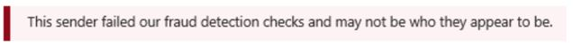
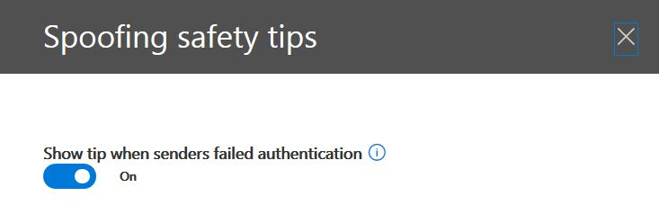
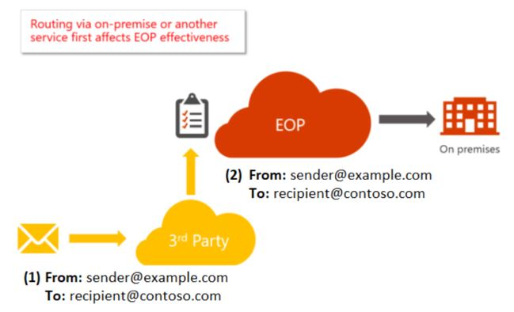

# <a name="anti-spoofing-protection-in-office-365"></a><span data-ttu-id="b7317-105">Bescherming tegen adresvervalsing in Office 365</span><span class="sxs-lookup"><span data-stu-id="b7317-105">Anti-spoofing protection in Office 365</span></span>

<span data-ttu-id="b7317-106">In dit artikel wordt beschreven hoe Office 365 phishingaanvallen tegengaat die gebruikmaken van domeinen die zijn vervalst, wat ook wel 'spoofing' wordt genoemd.</span><span class="sxs-lookup"><span data-stu-id="b7317-106">This article describes how Office 365 mitigates against phishing attacks that use forged sender domains, that is, domains that are spoofed.</span></span> <span data-ttu-id="b7317-107">Het doet dit door berichten te analyseren en degenen te blokkeren die niet kunnen worden geverifieerd met behulp van standaard e-mailverificatiemethoden, noch met andere afzendertechnieken.</span><span class="sxs-lookup"><span data-stu-id="b7317-107">It accomplishes this by analyzing the messages and blocking the ones that cannot be authenticated using standard email authentication methods, nor other sender reputation techniques.</span></span> <span data-ttu-id="b7317-108">Deze wijziging is doorgevoerd om het aantal phishingaanvallen te verminderen waaraan organisaties in Office 365 worden blootgesteld.</span><span class="sxs-lookup"><span data-stu-id="b7317-108">This change was implemented to reduce the number of phishing attacks to which organizations in Office 365 are exposed.</span></span>

<span data-ttu-id="b7317-109">Dit artikel beschrijft ook waarom deze wijziging wordt doorgevoerd, hoe klanten zich kunnen voorbereiden op deze wijziging, hoe ze berichten die worden beïnvloed kunnen bekijken, hoe berichten kunnen worden gerapporteerd, hoe fout-positieven kunnen worden beperkt, en hoe afzenders naar Microsoft zich moeten voorbereiden op deze verandering.</span><span class="sxs-lookup"><span data-stu-id="b7317-109">This article also describes why this change is being made, how customers can prepare for this change, how to view messages that will be affected, how to report on messages, how to mitigate false positives, as well as how senders to Microsoft should prepare for this change.</span></span>

<span data-ttu-id="b7317-110">De anti-adresvervalsingtechnologie van Microsoft werd aanvankelijk geïmplementeerd bij haar organisaties die een Office 365 Enterprise E5-abonnement hadden of de invoegtoepassing Office 365 Advanced Threat Protection (ATP) voor hun abonnement hadden aangeschaft.</span><span class="sxs-lookup"><span data-stu-id="b7317-110">Microsoft's anti-spoofing technology was initially deployed to its organizations that had an Office 365 Enterprise E5 subscription or had purchased the Office 365 Advanced Threat Protection (ATP) add-on for their subscription.</span></span> <span data-ttu-id="b7317-111">Vanaf oktober 2018 hebben we de bescherming uitgebreid naar organisaties die ook Exchange Online Protection (EOP) hebben.</span><span class="sxs-lookup"><span data-stu-id="b7317-111">As of October, 2018 we extended the protection to organizations that have Exchange Online Protection (EOP) as well.</span></span> <span data-ttu-id="b7317-112">Vanwege de manier waarop al onze filters van elkaar leren, kunnen ook Outlook.com-gebruikers worden beïnvloed.</span><span class="sxs-lookup"><span data-stu-id="b7317-112">Additionally, because of the way all of our filters learn from each other, Outlook.com users may also be affected.</span></span>

## <a name="how-spoofing-is-used-in-phishing-attacks"></a><span data-ttu-id="b7317-113">Hoe adresvervalsing wordt gebruikt in phishingaanvallen</span><span class="sxs-lookup"><span data-stu-id="b7317-113">How spoofing is used in phishing attacks</span></span>

<span data-ttu-id="b7317-114">Wanneer het gaat om het beschermen van haar gebruikers, neemt Microsoft de dreiging van phishing zeer serieus.</span><span class="sxs-lookup"><span data-stu-id="b7317-114">When it comes to protecting its users, Microsoft takes the threat of phishing seriously.</span></span> <span data-ttu-id="b7317-115">Een van de technieken die spammers en phishers vaak gebruiken, is adresvervalsing. Hierbij wordt de afzender vervalst, waardoor een bericht afkomstig lijkt te zijn van iemand of ergens anders dan de daadwerkelijke bron.</span><span class="sxs-lookup"><span data-stu-id="b7317-115">One of the techniques that spammers and phishers commonly use is spoofing, which is when the sender is forged, and a message appears to originate from someone or somewhere other than the actual source.</span></span> <span data-ttu-id="b7317-116">Deze techniek wordt vaak gebruikt in phishingcampagnes die zijn ontworpen om gebruikersgegevens te verkrijgen.</span><span class="sxs-lookup"><span data-stu-id="b7317-116">This technique is often used in phishing campaigns designed to obtain user credentials.</span></span> <span data-ttu-id="b7317-117">De anti-adresvervalsingtechnologie van Microsoft onderzoekt specifiek de vervalsing van de kop 'Van:', die wordt weergegeven in een e-mailclient zoals Outlook.</span><span class="sxs-lookup"><span data-stu-id="b7317-117">Microsoft's Anti-spoof technology specifically examines forgery of the 'From: header' which is the one that shows up in an email client like Outlook.</span></span> <span data-ttu-id="b7317-118">Wanneer Microsoft verdenkt dat de kop Van: is vervalst, wordt het bericht geïdentificeerd als een spoof.</span><span class="sxs-lookup"><span data-stu-id="b7317-118">When Microsoft has high confidence that the From: header is spoofed, it identifies the message as a spoof.</span></span>

<span data-ttu-id="b7317-119">Adresvervalsingberichten hebben twee negatieve gevolgen voor gebruikers:</span><span class="sxs-lookup"><span data-stu-id="b7317-119">Spoofing messages have two negative implications for real life users:</span></span>

### <a name="1-spoofed-messages-deceive-users"></a><span data-ttu-id="b7317-120">1. Vervalste berichten misleiden gebruikers</span><span class="sxs-lookup"><span data-stu-id="b7317-120">1. Spoofed messages deceive users</span></span>

<span data-ttu-id="b7317-121">Ten eerste kan een vervalst bericht een gebruiker ertoe verleiden op een koppeling te klikken en zijn of haar aanmeldingsgegevens op te geven, malware te downloaden of te reageren op een bericht met gevoelige inhoud (de laatste staat bekend als Business Email Compromise).</span><span class="sxs-lookup"><span data-stu-id="b7317-121">First, a spoofed message may trick a user into clicking a link and giving up their credentials, downloading malware, or replying to a message with sensitive content (the latter of which is known as Business Email Compromise).</span></span> <span data-ttu-id="b7317-122">In het volgende voorbeeld ziet u een phishingbericht met een vervalste afzender msoutlook94@service.outlook.com:</span><span class="sxs-lookup"><span data-stu-id="b7317-122">For example, the following is a phishing message with a spoofed sender of msoutlook94@service.outlook.com:</span></span>


<span data-ttu-id="b7317-124">Het bovenstaande kwam niet echt van service.outlook.com, maar werd in plaats daarvan vervalst door de phisher om het er zo uit te laten zien.</span><span class="sxs-lookup"><span data-stu-id="b7317-124">The above did not actually come from service.outlook.com, but instead was spoofed by the phisher to make it look like it did.</span></span> <span data-ttu-id="b7317-125">Het probeert een gebruiker te misleiden om op de koppeling in het bericht te klikken.</span><span class="sxs-lookup"><span data-stu-id="b7317-125">It is attempting to trick a user into clicking the link within the message.</span></span>

<span data-ttu-id="b7317-126">In het volgende voorbeeld wordt contoso.com gespooft:</span><span class="sxs-lookup"><span data-stu-id="b7317-126">The next example is spoofing contoso.com:</span></span>


<span data-ttu-id="b7317-128">Het bericht ziet er legitiem uit, maar in feite gaat het om een spoof.</span><span class="sxs-lookup"><span data-stu-id="b7317-128">The message looks legitimate, but in fact is a spoof.</span></span> <span data-ttu-id="b7317-129">Dit phishingbericht is een soort zakelijke e-mailaanval. Het is een subcategorie van phishing.</span><span class="sxs-lookup"><span data-stu-id="b7317-129">This phishing message is a type of Business Email Compromise which is a subcategory of phishing.</span></span>

### <a name="2-users-confuse-real-messages-for-fake-ones"></a><span data-ttu-id="b7317-130">2. Gebruikers verwarren echte berichten met valse berichten</span><span class="sxs-lookup"><span data-stu-id="b7317-130">2. Users confuse real messages for fake ones</span></span>

<span data-ttu-id="b7317-131">Ten tweede creëren vervalste berichten onzekerheid voor gebruikers die op de hoogte zijn van phishingberichten, maar het verschil niet kunnen zien tussen een echt bericht en een vervalst bericht.</span><span class="sxs-lookup"><span data-stu-id="b7317-131">Second, spoofed messages create uncertainty for users who know about phishing messages but cannot tell the difference between a real message and spoofed one.</span></span> <span data-ttu-id="b7317-132">Hieronder ziet u een voorbeeld van een daadwerkelijk wachtwoordherstelbericht verstuurd vanaf het e-mailadres van het Microsoft Security-account:</span><span class="sxs-lookup"><span data-stu-id="b7317-132">For example, the following is an example of an actual password reset from the Microsoft Security account email address:</span></span>


<span data-ttu-id="b7317-134">Het bovenstaande bericht is afkomstig van Microsoft, maar tegelijkertijd zijn gebruikers gewend phishingberichten te ontvangen die een gebruiker kunnen verleiden om op een koppeling te klikken en hun gegevens op te geven, malware te downloaden of te reageren op een bericht met gevoelige inhoud.</span><span class="sxs-lookup"><span data-stu-id="b7317-134">The above message did come from Microsoft, but at the same time, users are used to getting phishing messages that may trick a user into clicking a link and giving up their credentials, downloading malware, or replying to a message with sensitive content.</span></span> <span data-ttu-id="b7317-135">Omdat het moeilijk is om het verschil te zien tussen echte en vervalste wachtwoordherstelberichten negeren veel gebruikers deze berichten. Men meldt ze als spam of aan Microsoft als verijdelde poging tot phishing.</span><span class="sxs-lookup"><span data-stu-id="b7317-135">Because it is difficult to tell the difference between a real password reset and a fake one, many users ignore these messages, report them as spam, or unnecessarily report the messages back to Microsoft as missed phishing scams.</span></span>

<span data-ttu-id="b7317-136">Om adresvervalsing te stoppen, heeft de e-mailfilterindustrie e-mailverificatieprotocollen ontwikkeld zoals [SPF](set-up-spf-in-office-365-to-help-prevent-spoofing.md), [DKIM](use-dkim-to-validate-outbound-email.md) en [DMARC](use-dmarc-to-validate-email.md).</span><span class="sxs-lookup"><span data-stu-id="b7317-136">To stop spoofing, the email filtering industry has developed email authentication protocols such as [SPF](set-up-spf-in-office-365-to-help-prevent-spoofing.md), [DKIM](use-dkim-to-validate-outbound-email.md), and [DMARC](use-dmarc-to-validate-email.md).</span></span> <span data-ttu-id="b7317-137">DMARC voorkomt dat adresvervalsing de afzender van een bericht onderzoekt.</span><span class="sxs-lookup"><span data-stu-id="b7317-137">DMARC prevents spoofing from examining a message's sender.</span></span> <span data-ttu-id="b7317-138">Dat wil zeggen, de afzender die gebruikers in hun e-mailclient zien (in de bovenstaande voorbeelden is dit service.outlook.com, outlook.com en accountprotection.microsoft.com).</span><span class="sxs-lookup"><span data-stu-id="b7317-138">That is, the sender that users see in their email client (in the examples above it is service.outlook.com, outlook.com, and accountprotection.microsoft.com).</span></span> <span data-ttu-id="b7317-139">Bovendien kunnen gebruikers ook zien dat het domein door SPF of DKIM is geverifieerd, wat betekent dat het domein is geverifieerd en daarom niet is vervalst.</span><span class="sxs-lookup"><span data-stu-id="b7317-139">Furthermore, users can also see that the domain has passed SPF or DKIM, which means that the domain has been authenticated and is therefore not spoofed.</span></span> <span data-ttu-id="b7317-140">Zie de sectie ‘*Begrijpen waarom e-mailverificatie niet altijd voldoende is om adresvervalsing te stoppen*’ verderop in dit artikel voor een uitgebreidere bespreking.</span><span class="sxs-lookup"><span data-stu-id="b7317-140">For a more complete discussion, see the section "*Understanding why email authentication is not always enough to stop spoofing"*  later on in this article.</span></span>

<span data-ttu-id="b7317-141">Het probleem is echter dat records voor e-mailverificatie optioneel zijn en niet vereist.</span><span class="sxs-lookup"><span data-stu-id="b7317-141">However, the problem is that email authentication records are optional, not required.</span></span> <span data-ttu-id="b7317-142">Daarom zijn domeinen met een sterk authenticatiebeleid zoals microsoft.com en skype.com beschermd tegen adresvervalsing, maar domeinen die een zwakker authenticatiebeleid hanteren, of helemaal geen beleid, zijn doelen om te worden vervalst.</span><span class="sxs-lookup"><span data-stu-id="b7317-142">Therefore, while domains with strong authentication policies like microsoft.com and skype.com are protected from spoofing, domains that publish weaker authentication policies, or no policy at all, are targets for being spoofed.</span></span> <span data-ttu-id="b7317-143">Slechts 9% van de domeinen van bedrijven in de Fortune 500 hanteerde in maart 2018 een sterk e-mailverificatiebeleid.</span><span class="sxs-lookup"><span data-stu-id="b7317-143">As of March 2018, only 9% of domains of companies in the Fortune 500 publish strong email authentication policies.</span></span> <span data-ttu-id="b7317-144">De resterende 91% kan worden vervalst door een phisher en kan, tenzij het e-mailfilter dit met ander beleid detecteert, aan een eindgebruiker worden bezorgd en hen misleiden:</span><span class="sxs-lookup"><span data-stu-id="b7317-144">The remaining 91% may be spoofed by a phisher, and unless the email filter detects it using another policy, may be delivered to an end user and deceive them:</span></span>


<span data-ttu-id="b7317-146">Het aandeel kleine tot middelgrote bedrijven die niet in de Fortune 500 zitten en die een sterk e-mailverificatiebeleid hanteren is klein en nog kleiner voor domeinen buiten Noord-Amerika en West-Europa.</span><span class="sxs-lookup"><span data-stu-id="b7317-146">The proportion of small-to-medium sized companies that are not in the Fortune 500 that publish strong email authentication policies is smaller, and smaller still for domains that are outside of North America and western Europe.</span></span>

<span data-ttu-id="b7317-147">Dit is een groot probleem, omdat ondernemingen misschien niet op de hoogte zijn van hoe e-mailverificatie werkt, maar phishers begrijpen en profiteren van het gebrek daaraan.</span><span class="sxs-lookup"><span data-stu-id="b7317-147">This is a big problem because while enterprises may not be aware of how email authentication works, phishers do understand and take advantage of the lack of it.</span></span>

<span data-ttu-id="b7317-148">Zie de sectie '*klanten van Office 365 '* verderop in dit document voor meer informatie over het instellen van SPF, DKIM en DMARC.</span><span class="sxs-lookup"><span data-stu-id="b7317-148">For information on setting up SPF, DKIM, and DMARC, see the section "*Customers of Office 365"*  later on in this document.</span></span>

## <a name="stopping-spoofing-with-implicit-email-authentication"></a><span data-ttu-id="b7317-149">Adresvervalsing stoppen met impliciete e-mailverificatie</span><span class="sxs-lookup"><span data-stu-id="b7317-149">Stopping spoofing with implicit email authentication</span></span>

<span data-ttu-id="b7317-150">Omdat phishing en spear-phishing zo'n groot probleem vormen en vanwege de beperkte acceptatie van een sterk e-mailverificatiebeleid, blijft Microsoft investeren in mogelijkheden om haar klanten te beschermen.</span><span class="sxs-lookup"><span data-stu-id="b7317-150">Because phishing and spear phishing is such a problem, and because of the limited adoption of strong email authentication policies, Microsoft continues to invest in capabilities to protect its customers.</span></span> <span data-ttu-id="b7317-151">Daarom introduceert Microsoft *impliciete e-mailverificatie*: als een domein niet wordt geverifieerd, zal Microsoft het behandelen alsof het e-mailverificatierecords heeft gepubliceerd en blokkeren als het niet door de controle komt.</span><span class="sxs-lookup"><span data-stu-id="b7317-151">Therefore, Microsoft is moving ahead with  *implicit email authentication* - if a domain doesn't authenticate, Microsoft will treat it as if it had published email authentication records and treat it accordingly if it doesn't pass.</span></span>

<span data-ttu-id="b7317-152">Om dit te bereiken heeft Microsoft talloze uitbreidingen van reguliere e-mailverificatie gebouwd, waaronder de reputatie van de afzender, de geschiedenis van de afzender/geadresseerde, gedragsanalyse en andere geavanceerde technieken.</span><span class="sxs-lookup"><span data-stu-id="b7317-152">To accomplish this, Microsoft has built numerous extensions to regular email authentication including sender reputation, sender/recipient history, behavioral analysis, and other advanced techniques.</span></span> <span data-ttu-id="b7317-153">Een bericht dat wordt verzonden vanaf een domein dat geen e-mailverificatie hanteert, wordt gemarkeerd als spoof, tenzij het andere kenmerken bevat die aangeven dat het legitiem is.</span><span class="sxs-lookup"><span data-stu-id="b7317-153">A message sent from a domain that doesn't publish email authentication will be marked as spoof unless it contains other signals to indicate that it is legitimate.</span></span>

<span data-ttu-id="b7317-154">Hierdoor kunnen eindgebruikers erop vertrouwen dat een naar hen verstuurde e-mail niet is vervalst, kunnen afzenders erop vertrouwen dat niemand zich voordoet als hun domein en kunnen klanten van Office 365 nog betere bescherming bieden, zoals bescherming tegen identiteitsvervalsing.</span><span class="sxs-lookup"><span data-stu-id="b7317-154">By doing this, end users can have confidence that an email sent to them has not been spoofed, senders can be confident that nobody is impersonating their domain, and customers of Office 365 can offer even better protection such as Impersonation protection.</span></span>

<span data-ttu-id="b7317-155">Zie [A Sea of Phish Part 2 - Enhanced Anti-spoofing in Office 365](https://techcommunity.microsoft.com/t5/Security-Privacy-and-Compliance/Schooling-A-Sea-of-Phish-Part-2-Enhanced-Anti-spoofing/ba-p/176209) om de algemene aankondiging van Microsoft te lezen.</span><span class="sxs-lookup"><span data-stu-id="b7317-155">To see Microsoft's general announcement, see [A Sea of Phish Part 2 - Enhanced Anti-spoofing in Office 365](https://techcommunity.microsoft.com/t5/Security-Privacy-and-Compliance/Schooling-A-Sea-of-Phish-Part-2-Enhanced-Anti-spoofing/ba-p/176209).</span></span>

## <a name="identifying-that-a-message-is-classified-as-spoofed"></a><span data-ttu-id="b7317-156">Identificeren dat een bericht is geclassificeerd als vervalst</span><span class="sxs-lookup"><span data-stu-id="b7317-156">Identifying that a message is classified as spoofed</span></span>

### <a name="composite-authentication"></a><span data-ttu-id="b7317-157">Samengestelde verificatie</span><span class="sxs-lookup"><span data-stu-id="b7317-157">Composite authentication</span></span>

<span data-ttu-id="b7317-158">Hoewel SPF, DKIM en DMARC op zichzelf allemaal nuttig zijn, geven ze niet genoeg verificatie-informatie wanneer een bericht geen expliciete verificatierecords heeft.</span><span class="sxs-lookup"><span data-stu-id="b7317-158">While SPF, DKIM, and DMARC are all useful by themselves, they don't communicate enough authentication status in the event a message has no explicit authentication records.</span></span> <span data-ttu-id="b7317-159">Microsoft heeft een algoritme ontwikkeld waarin meerdere signalen worden gecombineerd tot één waarde met de naam Samengestelde verificatie, of compauth.</span><span class="sxs-lookup"><span data-stu-id="b7317-159">Therefore, Microsoft has developed an algorithm that combines multiple signals into a single value called Composite Authentication, or compauth for short.</span></span> <span data-ttu-id="b7317-160">Klanten in Office 365 hebben compauth-waarden gestempeld in de header *Authentication-Results* in de berichtkoppen.</span><span class="sxs-lookup"><span data-stu-id="b7317-160">Customers in Office 365 have compauth values stamped into the *Authentication-Results* header in the message headers.</span></span>

```text
Authentication-Results:
  compauth=<fail|pass|softpass|none> reason=<yyy>
```

|<span data-ttu-id="b7317-161">**CompAuth-resultaat**</span><span class="sxs-lookup"><span data-stu-id="b7317-161">**CompAuth result**</span></span>|<span data-ttu-id="b7317-162">**Beschrijving**</span><span class="sxs-lookup"><span data-stu-id="b7317-162">**Description**</span></span>|
|:-----|:-----|
|<span data-ttu-id="b7317-163">mislukt</span><span class="sxs-lookup"><span data-stu-id="b7317-163">fail</span></span>|<span data-ttu-id="b7317-164">Bericht is niet geslaagd voor de expliciete verificatie (verzendend domein heeft records expliciet in DNS gepubliceerd) of impliciete verificatie (verzendend domein publiceerde geen records in DNS, dus Office 365 interpoleerde het resultaat alsof het records had gepubliceerd).</span><span class="sxs-lookup"><span data-stu-id="b7317-164">Message failed explicit authentication (sending domain published records explicitly in DNS) or implicit authentication (sending domain did not publish records in DNS, so Office 365 interpolated the result as if it had published records).</span></span>|
|<span data-ttu-id="b7317-165">geslaagd</span><span class="sxs-lookup"><span data-stu-id="b7317-165">pass</span></span>|<span data-ttu-id="b7317-166">Bericht geslaagd voor expliciete authenticatie (bericht geslaagd voor DMARC of [Best Guess Passed DMARC](https://blogs.msdn.microsoft.com/tzink/2015/05/06/what-is-dmarc-bestguesspass-in-office-365)) of impliciete verificatie met hoog vertrouwen (verzendend domein publiceert geen e-mailverificatierecords, maar Office 365 krijgt sterke backend-signalen die aangeven dat het bericht waarschijnlijk legitiem is).</span><span class="sxs-lookup"><span data-stu-id="b7317-166">Message passed explicit authentication (message passed DMARC, or [Best Guess Passed DMARC](https://blogs.msdn.microsoft.com/tzink/2015/05/06/what-is-dmarc-bestguesspass-in-office-365)) or implicit authentication with high confidence (sending domain does not publish email authentication records, but Office 365 has strong backend signals to indicate the message is likely legitimate).</span></span>|
|<span data-ttu-id="b7317-167">softpass</span><span class="sxs-lookup"><span data-stu-id="b7317-167">softpass</span></span>|<span data-ttu-id="b7317-168">Bericht heeft impliciete verificatie doorgegeven met een laag tot gemiddeld vertrouwen (het verzendende domein publiceert geen e-mailverificatie, maar Office 365 krijgt backendsignalen die aangeven dat het bericht legitiem is, maar de sterkte van het signaal is zwakker).</span><span class="sxs-lookup"><span data-stu-id="b7317-168">Message passed implicit authentication with low-to-medium confidence (sending domain does not publish email authentication, but Office 365 has backend signals to indicate the message is legitimate but the strength of the signal is weaker).</span></span>|
|<span data-ttu-id="b7317-169">geen</span><span class="sxs-lookup"><span data-stu-id="b7317-169">none</span></span>|<span data-ttu-id="b7317-170">Bericht is niet geverifieerd (of is geverifieerd maar is niet uitgelijnd), maar samengestelde verificatie is niet toegepast vanwege de afzenderreputatie of andere factoren.</span><span class="sxs-lookup"><span data-stu-id="b7317-170">Message did not authenticate (or it did authenticate but did not align), but composite authentication not applied due to sender reputation or other factors.</span></span>|

|||
|:-----|:-----|
|<span data-ttu-id="b7317-171">**Reden**</span><span class="sxs-lookup"><span data-stu-id="b7317-171">**Reason**</span></span>|<span data-ttu-id="b7317-172">**Beschrijving**</span><span class="sxs-lookup"><span data-stu-id="b7317-172">**Description**</span></span>|
|<span data-ttu-id="b7317-173">0xx</span><span class="sxs-lookup"><span data-stu-id="b7317-173">0xx</span></span> |<span data-ttu-id="b7317-174">Bericht is niet geslaagd voor samengestelde verificatie.</span><span class="sxs-lookup"><span data-stu-id="b7317-174">Message failed composite authentication.</span></span><br/><span data-ttu-id="b7317-175">**000** betekent dat het bericht is verworpen door DMARC met als actie weigering of quarantaine.</span><span class="sxs-lookup"><span data-stu-id="b7317-175">**000** means the message failed DMARC with an action of reject or quarantine.</span></span>  <br/><span data-ttu-id="b7317-176">**001** betekent dat het bericht niet is geslaagd voor impliciete e-mailverificatie.</span><span class="sxs-lookup"><span data-stu-id="b7317-176">**001** means the message failed implicit email authentication.</span></span> <span data-ttu-id="b7317-177">Dit houdt in dat het verzendende domein geen e-mail records voor e-mailverificatie heeft gepubliceerd of dat ze een zwakker foutbeleid hanteerden (SPF-softfail of Neutraal, DMARC-beleid p=geen).</span><span class="sxs-lookup"><span data-stu-id="b7317-177">This means that the sending domain did not have email authentication records published, or if they did, they had a weaker failure policy (SPF soft fail or neutral, DMARC policy of p=none).</span></span>  <br/><span data-ttu-id="b7317-178">**002** betekent dat de organisatie een beleid heeft voor het afzender/domein-paar dat expliciet is uitgesloten van het verzenden van vervalste e-mail. Deze instelling is handmatig ingesteld door een beheerder.</span><span class="sxs-lookup"><span data-stu-id="b7317-178">**002** means the organization has a policy for the sender/domain pair that is explicitly prohibited from sending spoofed email, this setting is manually set by an administrator.</span></span>  <br/><span data-ttu-id="b7317-179">**010** betekent dat het bericht is verworpen door DMARC met als actie weigering of quarantaine, en het verzendende domein is een van de geaccepteerde domeinen van uw organisatie (dit is onderdeel van self-to-self- of intra-org-adresvervalsing).</span><span class="sxs-lookup"><span data-stu-id="b7317-179">**010** means the message failed DMARC with an action of reject or quarantine, and the sending domain is one of your organization's accepted-domains (this is part of self-to-self, or intra-org, spoofing).</span></span>|
|<span data-ttu-id="b7317-180">1xx, 2xx, 3xx, 4xx, en 5xx</span><span class="sxs-lookup"><span data-stu-id="b7317-180">1xx, 2xx, 3xx, 4xx, and 5xx</span></span>|<span data-ttu-id="b7317-181">Komt overeen met verschillende interne codes waarom een bericht impliciete authenticatie heeft doorstaan, of geen authenticatie had maar waarop geen actie werd toegepast.</span><span class="sxs-lookup"><span data-stu-id="b7317-181">Correspond to various internal codes for why a message passed implicit authentication, or had no authentication but no action was applied.</span></span>|
|<span data-ttu-id="b7317-182">6xx</span><span class="sxs-lookup"><span data-stu-id="b7317-182">6xx</span></span>|<span data-ttu-id="b7317-183">Betekent dat het bericht is verworpen door impliciete e-mailverificatie, en het verzendende domein is een van de geaccepteerde domeinen van uw organisatie (dit is onderdeel van self-to-self- of intra-org-adresvervalsing).</span><span class="sxs-lookup"><span data-stu-id="b7317-183">Means the message failed implicit email authentication, and the sending domain is one of your organization's accepted domains (this is part of self-to-self, or intra-org, spoofing).</span></span>|

<span data-ttu-id="b7317-184">Door te kijken naar de berichtkoppen van een bericht kan een beheerder of zelfs een eindgebruiker bepalen hoe Office 365 tot de conclusie komt dat de afzender mogelijk is gespooft.</span><span class="sxs-lookup"><span data-stu-id="b7317-184">By looking at the headers of a message, an administrator or even an end user can determine how Office 365 arrives at the conclusion that the sender may be spoofed.</span></span>

### <a name="differentiating-between-different-types-of-spoofing"></a><span data-ttu-id="b7317-185">Onderscheid maken tussen verschillende typen adresvervalsing</span><span class="sxs-lookup"><span data-stu-id="b7317-185">Differentiating between different types of spoofing</span></span>

<span data-ttu-id="b7317-186">Microsoft maakt onderscheid tussen twee verschillende typen adresvervalsingberichten:</span><span class="sxs-lookup"><span data-stu-id="b7317-186">Microsoft differentiates between two different types of spoofing messages:</span></span>

#### <a name="intra-org-spoofing"></a><span data-ttu-id="b7317-187">Adresvervalsing binnen de organisatie</span><span class="sxs-lookup"><span data-stu-id="b7317-187">Intra-org spoofing</span></span>

<span data-ttu-id="b7317-188">Ook wel bekend als self-to-self spoofing, dit gebeurt wanneer het domein in het Van-adres hetzelfde is als, of overeenkomt met, het ontvangende domein (wanneer het ontvangende domein een van de [geaccepteerde domeinen](https://docs.microsoft.com/exchange/mail-flow-best-practices/manage-accepted-domains/manage-accepted-domains) van uw organisatie is); of, wanneer het domein in het Van-adres deel uitmaakt van dezelfde organisatie.</span><span class="sxs-lookup"><span data-stu-id="b7317-188">Also known as self-to-self spoofing, this occurs when the domain in the From: address is the same as, or aligns with, the recipient domain (when recipient domain is one of your organization's [accepted domains](https://docs.microsoft.com/exchange/mail-flow-best-practices/manage-accepted-domains/manage-accepted-domains)); or, when the domain in the From: address is part of the same organization.</span></span>

<span data-ttu-id="b7317-189">In het volgende voorbeeld zijn de afzender en de geadresseerde van hetzelfde domein (contoso.com).</span><span class="sxs-lookup"><span data-stu-id="b7317-189">For example, the following has sender and recipient from the same domain (contoso.com).</span></span> <span data-ttu-id="b7317-190">Er zijn spaties aan het e-mailadres toegevoegd om spambot-oogsten op deze pagina te voorkomen):</span><span class="sxs-lookup"><span data-stu-id="b7317-190">Spaces are inserted into the email address to prevent spambot harvesting on this page):</span></span>

> <span data-ttu-id="b7317-191">Van: afzender @ contoso.com</span><span class="sxs-lookup"><span data-stu-id="b7317-191">From: sender @ contoso.com</span></span> <br/> <span data-ttu-id="b7317-192">Aan: geadresseerde @ contoso.com</span><span class="sxs-lookup"><span data-stu-id="b7317-192">To: recipient @ contoso.com</span></span>

<span data-ttu-id="b7317-193">De volgende domeinen van afzender en geadresseerde zijn afgestemd op het organisatiedomein (fabrikam.com):</span><span class="sxs-lookup"><span data-stu-id="b7317-193">The following has the sender and recipient domains aligning with the organizational domain (fabrikam.com):</span></span>

> <span data-ttu-id="b7317-194">Van: afzender @ foo.fabrikam.com</span><span class="sxs-lookup"><span data-stu-id="b7317-194">From: sender @ foo.fabrikam.com</span></span> <br/> <span data-ttu-id="b7317-195">Aan: geadresseerde @ bar.fabrikam.com</span><span class="sxs-lookup"><span data-stu-id="b7317-195">To: recipient @ bar.fabrikam.com</span></span>

<span data-ttu-id="b7317-196">De volgende domeinnamen van de afzender en de geadresseerde zijn verschillend (microsoft.com en bing.com), maar ze behoren tot dezelfde organisatie (dat wil zeggen, beide maken deel uit van de geaccepteerde domeinen van de organisatie):</span><span class="sxs-lookup"><span data-stu-id="b7317-196">The following sender and recipient domains are different (microsoft.com and bing.com), but they belong to the same organization (that is, both are part of the organization's Accepted Domains):</span></span>

> <span data-ttu-id="b7317-197">Van: sender @ microsoft.com</span><span class="sxs-lookup"><span data-stu-id="b7317-197">From: sender @ microsoft.com</span></span> <br/> <span data-ttu-id="b7317-198">Aan: geadresseerde @ bing.com</span><span class="sxs-lookup"><span data-stu-id="b7317-198">To: recipient @ bing.com</span></span>

<span data-ttu-id="b7317-199">Berichten die op adresvervalsing binnen de organisatie duiden, bevatten de volgende waarden in de koppen:</span><span class="sxs-lookup"><span data-stu-id="b7317-199">Messages that fail intra-org spoofing contain the following values in the headers:</span></span>

`X-Forefront-Antispam-Report: ...CAT:SPM/HSPM/PHSH;...SFTY:9.11`

<span data-ttu-id="b7317-200">De CAT is de categorie van het bericht en wordt normaal gesproken bestempeld als SPM (spam), maar kan af en toe HSPM (hoogstwaarschijnlijk spam) of PHISH (phishing) zijn, afhankelijk van wat voor andere soorten patronen in het bericht voorkomen.</span><span class="sxs-lookup"><span data-stu-id="b7317-200">The CAT is the category of the message, and it is normally stamped as SPM (spam), but occasionally may be HSPM (high confidence spam) or PHISH (phishing) depending upon what other types of patterns occur in the message.</span></span>

<span data-ttu-id="b7317-201">De SFTY geeft het beveiligingsniveau van het bericht, het eerste cijfer (9) betekent dat het om een phishingbericht gaat en een tweede reeks cijfers achter de punt (11) betekent dat het om adresvervalsing binnen de organisatie gaat.</span><span class="sxs-lookup"><span data-stu-id="b7317-201">The SFTY is the safety level of the message, the first digit (9) means the message is phishing, and second set of digits after the dot (11) means it is intra-org spoofing.</span></span>

<span data-ttu-id="b7317-202">Er is geen specifieke redencode voor samengestelde authenticatie voor adresvervalsing binnen organisaties, die later in 2018 zal worden uitgegeven (tijdlijn nog niet gedefinieerd).</span><span class="sxs-lookup"><span data-stu-id="b7317-202">There is no specific reason code for Composite Authentication for intra-org spoofing, that will be stamped later in 2018 (timeline not yet defined).</span></span>

#### <a name="cross-domain-spoofing"></a><span data-ttu-id="b7317-203">Adresvervalsing tussen domeinen</span><span class="sxs-lookup"><span data-stu-id="b7317-203">Cross-domain spoofing</span></span>

<span data-ttu-id="b7317-204">Dit gebeurt wanneer het verzendende domein in het Van-adres een extern domein voor de ontvangende organisatie is.</span><span class="sxs-lookup"><span data-stu-id="b7317-204">This occurs when the sending domain in the From: address is an external domain to the receiving organization.</span></span> <span data-ttu-id="b7317-205">Berichten waarvoor de samengestelde authenticatie is mislukt vanwege adresvervalsing tussen domeinen bevatten de volgende waarden in de koppen:</span><span class="sxs-lookup"><span data-stu-id="b7317-205">Messages that fail Composite Authentication due to cross-domain spoofing contain the following values in the headers:</span></span>

`Authentication-Results: ... compauth=fail reason=000/001`

`X-Forefront-Antispam-Report: ...CAT:SPOOF;...SFTY:9.22`

<span data-ttu-id="b7317-206">In beide gevallen wordt de volgende rode veiligheidstip in het bericht geplaatst of een equivalent dat is aangepast aan de taal van het postvak van de geadresseerde:</span><span class="sxs-lookup"><span data-stu-id="b7317-206">In both cases, the following red safety tip is stamped in the message, or an equivalent that is customized to the recipient mailbox's language:</span></span>



<span data-ttu-id="b7317-208">Alleen door naar het Van-adres te kijken en te weten wat de e-mail van uw geadresseerde is, of door de e-mailheaders te inspecteren, kunt u onderscheid maken tussen adresvervalsing binnen uw organisatie en tussen domeinen.</span><span class="sxs-lookup"><span data-stu-id="b7317-208">It's only by looking at the From: address and knowing what your recipient email is, or by inspecting the email headers, that you can differentiate between intra-org and cross-domain spoofing.</span></span>

## <a name="how-customers-of-office-365-can-prepare-themselves-for-the-new-anti-spoofing-protection"></a><span data-ttu-id="b7317-209">Hoe klanten van Office 365 zich kunnen voorbereiden op de nieuwe bescherming tegen adresvervalsing</span><span class="sxs-lookup"><span data-stu-id="b7317-209">How customers of Office 365 can prepare themselves for the new anti-spoofing protection</span></span>

### <a name="information-for-administrators"></a><span data-ttu-id="b7317-210">Informatie voor beheerders</span><span class="sxs-lookup"><span data-stu-id="b7317-210">Information for administrators</span></span>

<span data-ttu-id="b7317-211">Als beheerder van een organisatie in Office 365 zijn er verschillende belangrijke stukjes informatie waarmee u rekening moet houden.</span><span class="sxs-lookup"><span data-stu-id="b7317-211">As an administrator of an organization in Office 365, there are several key pieces of information you should be aware of.</span></span>

### <a name="understanding-why-email-authentication-is-not-always-enough-to-stop-spoofing"></a><span data-ttu-id="b7317-212">Begrijpen waarom e-mailverificatie niet altijd voldoende is om adresvervalsing te stoppen</span><span class="sxs-lookup"><span data-stu-id="b7317-212">Understanding why email authentication is not always enough to stop spoofing</span></span>

<span data-ttu-id="b7317-213">De nieuwe bescherming tegen adresvervalsing is afhankelijk van e-mailverificatie (SPF, DKIM en DMARC) om een bericht niet als adresvervalsing te markeren.</span><span class="sxs-lookup"><span data-stu-id="b7317-213">The new anti-spoofing protection relies on email authentication (SPF, DKIM, and DMARC) to not mark a message as spoofing.</span></span> <span data-ttu-id="b7317-214">Een bekend voorbeeld is wanneer een verzendend domein nooit SPF-records heeft gepubliceerd.</span><span class="sxs-lookup"><span data-stu-id="b7317-214">A common example is when a sending domain has never published SPF records.</span></span> <span data-ttu-id="b7317-215">Als er geen SPF-records zijn of als ze niet correct zijn ingesteld, wordt een verzonden bericht gemarkeerd als vervalst, tenzij Microsoft beschikt over back-endintelligentie die zegt dat het bericht legitiem is.</span><span class="sxs-lookup"><span data-stu-id="b7317-215">If there are no SPF records or they are incorrectly set up, a sent message will be marked as spoofed unless Microsoft has back-end intelligence that says the message is legitimate.</span></span>

<span data-ttu-id="b7317-216">Voordat bijvoorbeeld anti-adresvervalsing werd geïmplementeerd, zag een bericht er mogelijk als volgt uit zonder SPF-record, zonder DKIM-record en zonder DMARC-record:</span><span class="sxs-lookup"><span data-stu-id="b7317-216">For example, prior to anti-spoofing being deployed, a message may have looked like the following with no SPF record, no DKIM record, and no DMARC record:</span></span>

```text
Authentication-Results: spf=none (sender IP is 1.2.3.4)
  smtp.mailfrom=fabrikam.com; contoso.com; dkim=none
  (message not signed) header.d=none; contoso.com; dmarc=none
  action=none header.from=fabrikam.com;
From: sender @ fabrikam.com
To: receiver @ contoso.com
```

<span data-ttu-id="b7317-217">Na anti-adresvervalsing wordt in Office 365 Enterprise E5, EOP of ATP de compauth-waarde afgestempeld:</span><span class="sxs-lookup"><span data-stu-id="b7317-217">After anti-spoofing, if you have Office 365 Enterprise E5, EOP, or ATP, the compauth value is stamped:</span></span>

```text
Authentication-Results: spf=none (sender IP is 1.2.3.4)
  smtp.mailfrom=fabrikam.com; contoso.com; dkim=none
  (message not signed) header.d=none; contoso.com; dmarc=none
  action=none header.from=fabrikam.com; compauth=fail reason=001
From: sender @ fabrikam.com
To: receiver @ contoso.com
```

<span data-ttu-id="b7317-218">Als fabrikam.com dit heeft verholpen door een SPF-record in te stellen, maar geen DKIM-record, zou dit de samengestelde verificatie doorstaan omdat het domein dat SPF heeft doorgegeven, is uitgelijnd met het domein in het Van-adres:</span><span class="sxs-lookup"><span data-stu-id="b7317-218">If fabrikam.com fixed this by setting up an SPF record but not a DKIM record, this would pass composite authentication because the domain that passed SPF aligned with the domain in the From: address:</span></span>

```text
Authentication-Results: spf=pass (sender IP is 1.2.3.4)
  smtp.mailfrom=fabrikam.com; contoso.com; dkim=none
  (message not signed) header.d=none; contoso.com; dmarc=bestguesspass
  action=none header.from=fabrikam.com; compauth=pass reason=109
From: sender @ fabrikam.com
To: receiver @ contoso.com
```

<span data-ttu-id="b7317-219">Of, als ze een DKIM-record instellen maar geen SPF-record, zou dit ook samengestelde verificatie doorstaan omdat het domein in de DKIM-handtekening dat is doorgegeven, is uitgelijnd met het domein in het Van-adres:</span><span class="sxs-lookup"><span data-stu-id="b7317-219">Or, if they set up a DKIM record but not an SPF record, this would also pass composite authentication because the domain in the DKIM-Signature that passed aligned with the domain in the From: address:</span></span>

```text
Authentication-Results: spf=none (sender IP is 1.2.3.4)
  smtp.mailfrom=fabrikam.com; contoso.com; dkim=pass
  (signature was verified) header.d=outbound.fabrikam.com;
  contoso.com; dmarc=bestguesspass action=none
  header.from=fabrikam.com; compauth=pass reason=109
From: sender @ fabrikam.com
To: receiver @ contoso.com
```

<span data-ttu-id="b7317-220">Een phisher kan echter ook SPF en DKIM instellen en het bericht ondertekenen met hun eigen domein, maar een ander domein opgeven in het Van-adres.</span><span class="sxs-lookup"><span data-stu-id="b7317-220">However, a phisher may also set up SPF and DKIM and sign the message with their own domain, but specify a different domain in the From: address.</span></span> <span data-ttu-id="b7317-221">Noch SPF noch DKIM vereist dat het domein overeenkomt met het domein in het Van-adres, dus tenzij fabrikam.com DMARC-records publiceerde, zou dit niet worden gemarkeerd als een spoof met DMARC:</span><span class="sxs-lookup"><span data-stu-id="b7317-221">Neither SPF nor DKIM requires the domain to align with the domain in the From: address, so unless fabrikam.com published DMARC records, this would not be marked as a spoof using DMARC:</span></span>

```text
Authentication-Results: spf=pass (sender IP is 5.6.7.8)
  smtp.mailfrom=maliciousDomain.com; contoso.com; dkim=pass
  (signature was verified) header.d=maliciousDomain.com;
  contoso.com; dmarc=none action=none header.from=fabrikam.com;
From: sender @ fabrikam.com
To: receiver @ contoso.com
```

<span data-ttu-id="b7317-222">In de e-mailclient (Outlook, de webversie van Outlook of een andere e-mailclient) wordt alleen het Van-domein weergegeven, niet het domein in de SPF of DKIM, en dat kan de gebruiker misleiden door te suggereren dat het bericht afkomstig is van fabrikam.com, terwijl het eigenlijk van maliciousDomain.com afkomstig is.</span><span class="sxs-lookup"><span data-stu-id="b7317-222">In the email client (Outlook, Outlook on the web, or any other email client), only the From: domain is displayed, not the domain in the SPF or DKIM, and that can mislead the user into thinking the message came from fabrikam.com, but actually came from maliciousDomain.com.</span></span>


<span data-ttu-id="b7317-224">Om die reden vereist Office 365 dat het domein in het Van-adres overeenkomt met het domein in de SPF- of DKIM-handtekening en als dat niet zo is, dat het andere signalen bevat die aangeven dat het bericht legitiem is.</span><span class="sxs-lookup"><span data-stu-id="b7317-224">For that reason, Office 365 requires that the domain in the From: address aligns with the domain in the SPF or DKIM signature, and if it doesn't, contains some other internal signals that indicates that the message is legitimate.</span></span> <span data-ttu-id="b7317-225">Anders is het bericht een compauth-mislukking.</span><span class="sxs-lookup"><span data-stu-id="b7317-225">Otherwise, the message would be a compauth fail.</span></span>

```text
Authentication-Results: spf=none (sender IP is 5.6.7.8)
  smtp.mailfrom=maliciousDomain.com; contoso.com; dkim=pass
  (signature was verified) header.d=maliciousDomain.com;
  contoso.com; dmarc=none action=none header.from=contoso.com;
  compauth=fail reason=001
From: sender@contoso.com
To: someone@fabrikam.com
```

<span data-ttu-id="b7317-226">Office 365-anti beschermt zo tegen adresvervalsing van domeinen zonder verificatie en tegen domeinen die verificatie hebben ingesteld, maar die niet overeenkomen met het domein in het Van-adres dat de gebruiker ziet en waarvan hij gelooft dat het de afzender van het bericht is.</span><span class="sxs-lookup"><span data-stu-id="b7317-226">Thus, Office 365 anti-spoofing protects against domains with no authentication, and against domains who set up authentication but mismatch against the domain in the From: address as that is the one that the user sees and believes is the sender of the message.</span></span> <span data-ttu-id="b7317-227">Dit geldt voor zowel domeinen buiten uw organisatie als voor domeinen binnen uw organisatie.</span><span class="sxs-lookup"><span data-stu-id="b7317-227">This is true both of domains external to your organization, as well as domains within your organization.</span></span>

<span data-ttu-id="b7317-228">Als u ooit een bericht ontvangt waarvan de gecombineerde verificatie mislukt en dat wordt gemarkeerd als spoofed, ook al komt het bericht goed door SPF en DKIM, dan is dat omdat het domein dat goed door SPF en DKIM kwam, niet overeenkomt met het domein in het Van-adres.</span><span class="sxs-lookup"><span data-stu-id="b7317-228">Therefore, if you ever receive a message that failed composite authentication and is marked as spoofed, even though the message passed SPF and DKIM, it's because the domain that passed SPF and DKIM are not aligned with the domain in the From: address.</span></span>

### <a name="understanding-changes-in-how-spoofed-emails-are-treated"></a><span data-ttu-id="b7317-229">Wijzigingen begrijpen in de behandeling van valse e-mails</span><span class="sxs-lookup"><span data-stu-id="b7317-229">Understanding changes in how spoofed emails are treated</span></span>

<span data-ttu-id="b7317-230">Momenteel geldt voor alle organisaties in Office 365 (ATP en niet-ATP) dat als DMARC voor een bericht is mislukt en de organisatie heeft een beleid om berichten af te wijzen of in quarantaine te plaatsen, het bericht wordt gemarkeerd als spam en dat de actie voor Hoogstwaarschijnlijk spam wordt uitgevoerd of soms de normale spamactie (afhankelijk of andere spamregels het bericht eerder identificeren als spam).</span><span class="sxs-lookup"><span data-stu-id="b7317-230">Currently, for all organizations in Office 365 - ATP and non-ATP - messages that fail DMARC with a policy of reject or quarantine are marked as spam and usually take the high confidence spam action, or sometimes the regular spam action (depending on whether other spam rules first identify it as spam).</span></span> <span data-ttu-id="b7317-231">Voor adresvervalsing binnen de organisatie wordt de normale spamactie uitgevoerd.</span><span class="sxs-lookup"><span data-stu-id="b7317-231">Intra-org spoof detections take the regular spam action.</span></span> <span data-ttu-id="b7317-232">Dit hoeft niet te worden ingeschakeld en kan ook niet worden uitgeschakeld.</span><span class="sxs-lookup"><span data-stu-id="b7317-232">This behavior does not need to be enabled, nor can it be disabled.</span></span>

<span data-ttu-id="b7317-233">Voor adresvervalsing tussen meerdere domeinen gingen vóór deze wijziging echter berichten door de normale spam-, phishing- en malwarecontroles en als andere onderdelen van het filter ze als verdacht identificeerden, werden ze als spam, phishing of malware gemarkeerd.</span><span class="sxs-lookup"><span data-stu-id="b7317-233">However, for cross-domain spoofing messages, before this change they would go through regular spam, phish, and malware checks and if other parts of the filter identified them as suspicious, would mark them as spam, phish, or malware respectively.</span></span> <span data-ttu-id="b7317-234">Met de nieuwe bescherming tegen adresvervalsing tussen domeinen wordt voor elk bericht dat niet kan worden geverifieerd, standaard de actie uitgevoerd die is gedefinieerd in het antiphishing- en anti-adresvervalsingbeleid.</span><span class="sxs-lookup"><span data-stu-id="b7317-234">With the new cross-domain spoofing protection, any message that can't be authenticated will, by default, take the action defined in the Anti-phishing \> Anti-spoofing policy.</span></span> <span data-ttu-id="b7317-235">Als een van beide niet is gedefinieerd, wordt het bericht verplaatst naar de map Ongewenste e-mail van een gebruiker.</span><span class="sxs-lookup"><span data-stu-id="b7317-235">If one is not defined, it will be moved to a users Junk Email folder.</span></span> <span data-ttu-id="b7317-236">In sommige gevallen wordt in de berichten ook de rode veiligheidstip toegevoegd aan het bericht.</span><span class="sxs-lookup"><span data-stu-id="b7317-236">In some cases, more suspicious messages will also have the red safety tip added to the message.</span></span>

<span data-ttu-id="b7317-237">Dit kan als gevolg hebben dat berichten die eerder werden gemarkeerd als spam, nog steeds worden gemarkeerd als spam, maar nu ook de rode veiligheidstip hebben. In andere gevallen worden berichten die eerder werden gemarkeerd als niet-spam, nu worden gemarkeerd als spam (CAT:SPOOF) met een toegevoegde rode veiligheidstip.</span><span class="sxs-lookup"><span data-stu-id="b7317-237">This may result in some messages that were previously marked as spam still getting marked as spam but will now also have a red safety tip; in other cases, messages that were previously marked as non-spam will start getting marked as spam (CAT:SPOOF) with a red safety tip added.</span></span> <span data-ttu-id="b7317-238">In weer andere gevallen zullen klanten die alle spam en phishingberichten in quarantaine plaatsten, ze nu verplaatst zien worden naar de map Ongewenste e-mail (dit gedrag kan worden aangepast, zie [Anti-adresvervalsing-instellingen wijzigen](#changing-your-anti-spoofing-settings)).</span><span class="sxs-lookup"><span data-stu-id="b7317-238">In still other cases, customers that were moving all spam and phish to the quarantine would now see them going to the Junk Mail Folder (this behavior can be changed, see [Changing your anti-spoofing settings](#changing-your-anti-spoofing-settings)).</span></span>

<span data-ttu-id="b7317-239">Er zijn verschillende manieren om een bericht te vervalsen (zie [Onderscheid maken tussen verschillende typen adresvervalsing](#differentiating-between-different-types-of-spoofing) eerder in dit artikel), maar sinds maart 2018 is de manier waarop Office 365 deze berichten behandelt nog niet geïntegreerd.</span><span class="sxs-lookup"><span data-stu-id="b7317-239">There are multiple different ways a message can be spoofed (see  [Differentiating between different types of spoofing](#differentiating-between-different-types-of-spoofing) earlier in this article) but as of March 2018 the way Office 365 treats these messages is not yet unified.</span></span> <span data-ttu-id="b7317-240">De volgende tabel is een beknopt overzicht met het nieuwe gedrag van de beveiliging tegen adresvervalsing tussen domeinen:</span><span class="sxs-lookup"><span data-stu-id="b7317-240">The following table is a quick summary, with Cross-domain spoofing protection being new behavior:</span></span>

|<span data-ttu-id="b7317-241">**Type spoof**</span><span class="sxs-lookup"><span data-stu-id="b7317-241">**Type of spoof**</span></span>|<span data-ttu-id="b7317-242">**Categorie**</span><span class="sxs-lookup"><span data-stu-id="b7317-242">**Category**</span></span>|<span data-ttu-id="b7317-243">**Veiligheidstip toegevoegd?**</span><span class="sxs-lookup"><span data-stu-id="b7317-243">**Safety tip added?**</span></span>|<span data-ttu-id="b7317-244">**Van toepassing op**</span><span class="sxs-lookup"><span data-stu-id="b7317-244">**Applies to**</span></span>|
|:-----|:-----|:-----|:-----|
|<span data-ttu-id="b7317-245">DMARC mislukt (quarantaine of afwijzen)</span><span class="sxs-lookup"><span data-stu-id="b7317-245">DMARC fail (quarantine or reject)</span></span>|<span data-ttu-id="b7317-246">HSPM (standaard), kan ook SPM of PHSH zijn</span><span class="sxs-lookup"><span data-stu-id="b7317-246">HSPM (default), may also be SPM or PHSH</span></span>|<span data-ttu-id="b7317-247">Nee (nog niet)</span><span class="sxs-lookup"><span data-stu-id="b7317-247">No (not yet)</span></span>|<span data-ttu-id="b7317-248">Alle Office 365-gebruikers, Outlook.com</span><span class="sxs-lookup"><span data-stu-id="b7317-248">All Office 365 customers, Outlook.com</span></span>|
|<span data-ttu-id="b7317-249">Self-to-self</span><span class="sxs-lookup"><span data-stu-id="b7317-249">Self-to-self</span></span>|<span data-ttu-id="b7317-250">SPM</span><span class="sxs-lookup"><span data-stu-id="b7317-250">SPM</span></span>|<span data-ttu-id="b7317-251">Ja</span><span class="sxs-lookup"><span data-stu-id="b7317-251">Yes</span></span>|<span data-ttu-id="b7317-252">Alle Office 365-organisaties, Outlook.com</span><span class="sxs-lookup"><span data-stu-id="b7317-252">All Office 365 organizations, Outlook.com</span></span>|
|<span data-ttu-id="b7317-253">Verschillende domeinen</span><span class="sxs-lookup"><span data-stu-id="b7317-253">Cross-domain</span></span>|<span data-ttu-id="b7317-254">SPOOF</span><span class="sxs-lookup"><span data-stu-id="b7317-254">SPOOF</span></span>|<span data-ttu-id="b7317-255">Ja</span><span class="sxs-lookup"><span data-stu-id="b7317-255">Yes</span></span>|<span data-ttu-id="b7317-256">Office 365-Advanced Threat Protection- en E5-klanten</span><span class="sxs-lookup"><span data-stu-id="b7317-256">Office 365 Advanced Threat Protection and E5 customers</span></span>|

### <a name="changing-your-anti-spoofing-settings"></a><span data-ttu-id="b7317-257">Anti-adresvervalsinginstellingen wijzigen</span><span class="sxs-lookup"><span data-stu-id="b7317-257">Changing your anti-spoofing settings</span></span>

<span data-ttu-id="b7317-258">Als u uw anti-adresvervalsinginstellingen (tussen domeinen) wilt maken of bijwerken, gaat u naar Antiphishing- en anti-adresvervalsinginstellingen onder het tabblad Risicobeheer en -beleid in het Beleids- en compliancecentrum.</span><span class="sxs-lookup"><span data-stu-id="b7317-258">To create or update your (cross-domain) anti-spoofing settings, navigate to the Anti-phishing \> Anti-spoofing settings under the Threat Management \> Policy tab in the Security & Compliance Center.</span></span> <span data-ttu-id="b7317-259">Als u nog niet eerder antiphishinginstellingen hebt gemaakt, moet u er een maken:</span><span class="sxs-lookup"><span data-stu-id="b7317-259">If you have never created any anti-phishing settings, you will need to create one:</span></span>


<span data-ttu-id="b7317-261">Als u het al hebt, kunt u dat als volgt wijzigen: </span><span class="sxs-lookup"><span data-stu-id="b7317-261">If you've already created one, you can select it to modify it:</span></span>


<span data-ttu-id="b7317-263">Selecteer het beleid dat u zojuist hebt gemaakt en ga verder met de stappen die zijn beschreven in [Meer informatie over adresvervalsingintelligentie](learn-about-spoof-intelligence.md).</span><span class="sxs-lookup"><span data-stu-id="b7317-263">Select the policy you just created and proceed through the steps as described in [Learn more about spoof intelligence](learn-about-spoof-intelligence.md).</span></span>




<span data-ttu-id="b7317-266">Om nieuw beleid te maken met PowerShell:</span><span class="sxs-lookup"><span data-stu-id="b7317-266">To create a new policy by using PowerShell:</span></span>

```powershell
$org = Get-OrganizationConfig
$name = "My first anti-phishing policy for " + $org.Name
# Note: The name should not exclude 64 characters, including spaces.
# If it does, you will need to pick a smaller name.
# Next, create a new anti-phishing policy with the default values
New-AntiphishPolicy -Name $Name
# Select the domains to scope it to
# Multiple domains are specified in a comma-separated list
$domains = "domain1.com, domain2.com, domain3.com"
# Next, create the anti-phishing rule, scope it to the anti-phishing rule
New-AntiphishRule -Name $name -AntiphishPolicy $name -RecipientDomainIs $domains
```

<span data-ttu-id="b7317-267">kunt u vervolgens de parameters voor het anti-adresvervalsingbeleid wijzigen met PowerShell, volgens de documentatie op [Set-AntiphishPolicy](https://docs.microsoft.com/powershell/module/exchange/advanced-threat-protection/Set-AntiPhishPolicy).</span><span class="sxs-lookup"><span data-stu-id="b7317-267">You may then modify the anti-phishing policy parameters using PowerShell, following the documentation at [Set-AntiphishPolicy](https://docs.microsoft.com/powershell/module/exchange/advanced-threat-protection/Set-AntiPhishPolicy).</span></span> <span data-ttu-id="b7317-268">kunt u de $name opgeven als parameter:</span><span class="sxs-lookup"><span data-stu-id="b7317-268">You may specify the $name as a parameter:</span></span>

```powershell
Set-AntiphishPolicy -Identity $name <fill in rest of parameters>
```

<span data-ttu-id="b7317-269">Later in 2018 wordt, in plaats van dat u standaardbeleid moet maken, beleid voor u aangemaakt dat alle geadresseerden in uw organisatie omvat, zodat u dat niet handmatig hoeft op te geven (de schermafbeeldingen hieronder worden mogelijk gewijzigd voor de uiteindelijke implementatie).</span><span class="sxs-lookup"><span data-stu-id="b7317-269">Later in 2018, rather than you having to create a default policy, one will be created for you that is scoped to all the recipients in your organization so you don't have to specify it manually (the screenshots below are subject to change before the final implementation).</span></span>


<span data-ttu-id="b7317-271">In tegenstelling tot beleid dat u maakt, kunt u het standaardbeleid niet verwijderen, de prioriteit aanpassen of kiezen op welke gebruikers, domeinen of groepen het van toepassing is.</span><span class="sxs-lookup"><span data-stu-id="b7317-271">Unlike a policy that you create, you cannot delete the default policy, modify its priority, or choose which users, domains, or groups to scope it to.</span></span>


<span data-ttu-id="b7317-273">Om uw standaardbeveiliging in te stellen met PowerShell:</span><span class="sxs-lookup"><span data-stu-id="b7317-273">To set up your default protection by using PowerShell:</span></span>

```powershell
$defaultAntiphishPolicy = Get-AntiphishPolicy | ? {$_.IsDefault -eq $true}
Set-AntiphishPolicy -Identity $defaultAntiphishPolicy.Name -EnableAntispoofEnforcement <$true|$false>
```

<span data-ttu-id="b7317-274">U moet alleen de bescherming tegen adresvervalsing uitschakelen als u een andere e-mailserver of servers voor Office 365 hebt (zie Legitieme scenario’s om anti-adresvervalsing uit te schakelen voor meer informatie).</span><span class="sxs-lookup"><span data-stu-id="b7317-274">You should only disable anti-spoofing protection if you have another mail server or servers in front of Office 365 (see Legitimate scenarios to disable anti-spoofing for more details).</span></span>

```powershell
$defaultAntiphishPolicy = Get-AntiphishiPolicy | ? {$_.IsDefault $true}
Set-AntiphishPolicy -Identity $defaultAntiphishPolicy.Name -EnableAntispoofEnforcement $false
```

> [!IMPORTANT]
> <span data-ttu-id="b7317-275">Als de eerste halte in uw e-mailpad Office 365 is en er te veel legitieme e-mail wordt gemarkeerd als spoof, moet u eerst uw afzenders instellen die vervalste e-mail mogen verzenden naar uw domein (zie de sectie [Legitieme afzenders beheren die niet-geverifieerde e-mail zenden](#managing-legitimate-senders-who-are-sending-unauthenticated-email) in dit artikel.</span><span class="sxs-lookup"><span data-stu-id="b7317-275">If the first hop in your email path is Office 365, and you are getting too many legitimate emails marked as spoof, you should first set up your senders that are allowed to send spoofed email to your domain (see the  [Managing legitimate senders who are sending unauthenticated email](#managing-legitimate-senders-who-are-sending-unauthenticated-email) section in this topic.</span></span> <span data-ttu-id="b7317-276">Als u nog steeds te veel fout-positieven krijgt (dat legitieme berichten worden gemarkeerd als adresvervalsing), raden we NIET aan de volledige bescherming tegen adresvervalsing uit te schakelen.</span><span class="sxs-lookup"><span data-stu-id="b7317-276">If you are still getting too many false positives (that is, legitimate messages marked as spoof), we do NOT recommend disabling anti-spoofing protection altogether.</span></span> <span data-ttu-id="b7317-277">U wordt geadviseerd te kiezen voor de beschermingsoptie Basis in plaats van Hoog.</span><span class="sxs-lookup"><span data-stu-id="b7317-277">Instead, we recommend choosing Basic instead of High protection.</span></span> <span data-ttu-id="b7317-278">Het is beter om te werken met fout-positieven dan uw organisatie bloot te stellen aan adresvervalsing-e-mail die u aanmerkelijk meer zou kunnen kosten op de langere termijn.</span><span class="sxs-lookup"><span data-stu-id="b7317-278">It is better to work through false positives than to expose your organization to spoofed email which could end up imposing significantly higher costs in the long term.</span></span>

### <a name="managing-legitimate-senders-who-are-sending-unauthenticated-email"></a><span data-ttu-id="b7317-279">Legitieme afzenders beheren die niet-geverifieerde e-mail zenden</span><span class="sxs-lookup"><span data-stu-id="b7317-279">Managing legitimate senders who are sending unauthenticated email</span></span>

<span data-ttu-id="b7317-280">In Office 365 wordt bijgehouden wie niet-geverifieerde e-mail naar uw organisatie stuurt.</span><span class="sxs-lookup"><span data-stu-id="b7317-280">Office 365 keeps track of who is sending unauthenticated email to your organization.</span></span> <span data-ttu-id="b7317-281">Als de service de afzender niet verifieert, wordt die gemarkeerd als een *compauth*-mislukking.</span><span class="sxs-lookup"><span data-stu-id="b7317-281">If the service thinks the sender is not legitimate, it will mark it as a *compauth* failure.</span></span> <span data-ttu-id="b7317-282">Dit wordt geclassificeerd als SPOOF, hoewel dit afhankelijk is van het anti-adresvervalsingbeleid dat op het bericht is toegepast.</span><span class="sxs-lookup"><span data-stu-id="b7317-282">This will be classified as SPOOF although it depends on your anti-spoofing policy that was applied to the message.</span></span>

<span data-ttu-id="b7317-283">Als beheerder kunt u echter opgeven welke afzenders spoof-e-mail mogen verzenden en de beslissing van Office 365 negeren.</span><span class="sxs-lookup"><span data-stu-id="b7317-283">However, as an administrator, you can specify which senders are permitted to send spoofed email, overriding Office 365's decision.</span></span>

#### <a name="method-1---if-your-organization-owns-the-domain-set-up-email-authentication"></a><span data-ttu-id="b7317-284">Methode 1: e-mailverificatie instellen als uw organisatie eigenaar is van het domein</span><span class="sxs-lookup"><span data-stu-id="b7317-284">Method 1 - If your organization owns the domain, set up email authentication</span></span>

<span data-ttu-id="b7317-285">Deze methode kan worden gebruikt om adresvervalsing binnen de organisatie op te lossen en adresvervalsing tussen domeinen in de gevallen waar u eigenaar bent van of interactie hebt met meerdere tenants.</span><span class="sxs-lookup"><span data-stu-id="b7317-285">This method can be used to resolve intra-org spoofing, and cross-domain spoofing in cases where you own or interact with multiple tenants.</span></span> <span data-ttu-id="b7317-286">Het helpt ook adresvervalsing tussen domeinen op te lossen wanneer u naar andere klanten binnen Office 365 zendt en ook derden die worden gehost door andere providers.</span><span class="sxs-lookup"><span data-stu-id="b7317-286">It also helps resolve cross-domain spoofing where you send to other customers within Office 365, and also third parties that are hosted in other providers.</span></span>

<span data-ttu-id="b7317-287">Zie [klanten van Office 365](#customers-of-office-365)voor meer informatie.</span><span class="sxs-lookup"><span data-stu-id="b7317-287">For more details, see [Customers of Office 365](#customers-of-office-365).</span></span>

#### <a name="method-2---use-spoof-intelligence-to-configure-permitted-senders-of-unauthenticated-email"></a><span data-ttu-id="b7317-288">Methode 2: gebruik Spoof Intelligence om toegestane afzenders van niet-geverifieerde e-mail te configureren</span><span class="sxs-lookup"><span data-stu-id="b7317-288">Method 2 - Use Spoof intelligence to configure permitted senders of unauthenticated email</span></span>

<span data-ttu-id="b7317-289">U kunt [Spoof Intelligence](learn-about-spoof-intelligence.md) ook gebruiken om afzenders toe te staan niet-geverifieerde berichten naar uw organisatie te verzenden.</span><span class="sxs-lookup"><span data-stu-id="b7317-289">You can also use [Spoof Intelligence](learn-about-spoof-intelligence.md) to permit senders to transmit unauthenticated messages to your organization.</span></span>

<span data-ttu-id="b7317-290">Voor externe domeinen is de vervalste gebruiker het domein in het Van-adres, terwijl de verzendende infrastructuur ofwel het verzendende IP-adres is (onderverdeeld in /24 CIDR-bereiken) ofwel het organisatiedomein van het PTR-record (in de onderstaande schermafbeelding kan het IP-adres 131.107.18.4 zijn, waarvan het PTR-record outbound.mail.protection.outlook.com is, en dit zou verschijnen als outlook.com voor de verzendende infrastructuur).</span><span class="sxs-lookup"><span data-stu-id="b7317-290">For external domains, the spoofed user is the domain in the From address, while the sending infrastructure is either the sending IP address (divided up into /24 CIDR ranges), or the organizational domain of the PTR record (in the screenshot below, the sending IP might be 131.107.18.4 whose PTR record is outbound.mail.protection.outlook.com, and this would show up as outlook.com for the sending infrastructure).</span></span>

<span data-ttu-id="b7317-291">Om deze afzender toe te staan niet-geverifieerde e-mail te verzenden, wijzigt u **Nee** in **Ja**.</span><span class="sxs-lookup"><span data-stu-id="b7317-291">To permit this sender to send unauthenticated email, change the **No** to a **Yes**.</span></span>


<span data-ttu-id="b7317-293">U kunt ook PowerShell gebruiken om een specifieke afzender toe te staan uw domein te vervalsen:</span><span class="sxs-lookup"><span data-stu-id="b7317-293">You can also use PowerShell to allow specific sender to spoof your domain:</span></span>

```powershell
$file = "C:\My Documents\Summary Spoofed Internal Domains and Senders.csv"
Get-PhishFilterPolicy -Detailed -SpoofAllowBlockList -SpoofType External | Export-CSV $file
```


<span data-ttu-id="b7317-295">In de vorige afbeelding zijn extra regeleinden toegevoegd om de schermafbeelding passend te maken.</span><span class="sxs-lookup"><span data-stu-id="b7317-295">In the previous image, additional line breaks have been added to make this screenshot fit.</span></span> <span data-ttu-id="b7317-296">Normaliter worden alle waarden weergegeven op een enkele regel.</span><span class="sxs-lookup"><span data-stu-id="b7317-296">Normally, all the values would appear on a single line.</span></span>

<span data-ttu-id="b7317-297">Bewerk het bestand en zoek naar de regel die overeenkomt met outlook.com en bing.com en wijzig de vermelding AllowedToSpoof van Nee in Ja:</span><span class="sxs-lookup"><span data-stu-id="b7317-297">Edit the file and look for the line that corresponds to outlook.com and bing.com, and change the AllowedToSpoof entry from No to Yes:</span></span>


<span data-ttu-id="b7317-299">Bewaar het bestand en voer de volgende opdracht uit:</span><span class="sxs-lookup"><span data-stu-id="b7317-299">Save the file, and then run:</span></span>

```powershell
$UpdateSpoofedSenders = Get-Content -Raw "C:\My Documents\Spoofed Senders.csv"
Set-PhishFilterPolicy -Identity Default -SpoofAllowBlockList $UpdateSpoofedSenders
```

<span data-ttu-id="b7317-300">Hierdoor kan bing.com niet-geverifieerde e-mail sturen vanuit \*.outlook.com.</span><span class="sxs-lookup"><span data-stu-id="b7317-300">This will now allow bing.com to send unauthenticated email from \*.outlook.com.</span></span>

#### <a name="method-3---create-an-allow-entry-for-the-senderrecipient-pair"></a><span data-ttu-id="b7317-301">Methode 3: een vermelding met toestemming maken voor het afzender/geadresseerde-paar</span><span class="sxs-lookup"><span data-stu-id="b7317-301">Method 3 - Create an allow entry for the sender/recipient pair</span></span>

<span data-ttu-id="b7317-302">U kunt er ook voor kiezen alle spamfilters te negeren voor een specifieke afzender.</span><span class="sxs-lookup"><span data-stu-id="b7317-302">You can also choose to bypass all spam filtering for a particular sender.</span></span> <span data-ttu-id="b7317-303">Zie [Een afzender veilig toevoegen aan een lijst met geaccepteerde adressen in Office 365](https://blogs.msdn.microsoft.com/tzink/2017/11/29/how-to-securely-add-a-sender-to-an-allow-list-in-office-365/) voor meer informatie.</span><span class="sxs-lookup"><span data-stu-id="b7317-303">For more details, see [How to securely add a sender to an allow list in Office 365](https://blogs.msdn.microsoft.com/tzink/2017/11/29/how-to-securely-add-a-sender-to-an-allow-list-in-office-365/).</span></span>

<span data-ttu-id="b7317-304">Als u deze methode gebruikt, wordt het spamfilter en bepaalde phishingfilters overgeslagen, maar niet de malware-filters.</span><span class="sxs-lookup"><span data-stu-id="b7317-304">If you use this method, it will skip spam and some of the phish filtering, but not malware filtering.</span></span>

#### <a name="method-4---contact-the-sender-and-ask-them-to-set-up-email-authentication"></a><span data-ttu-id="b7317-305">Methode 4: contact opnemen met de afzender en die vragen e-mailverificatie in te stellen</span><span class="sxs-lookup"><span data-stu-id="b7317-305">Method 4 - Contact the sender and ask them to set up email authentication</span></span>

<span data-ttu-id="b7317-306">Vanwege de problemen met spam en phishing, raadt Microsoft aan dat alle afzenders e-mailverificatie instellen.</span><span class="sxs-lookup"><span data-stu-id="b7317-306">Because of the problem of spam and phishing, Microsoft recommends all senders set up email authentication.</span></span> <span data-ttu-id="b7317-307">Als u een beheerder van het zendende domein kent, neem daar dan contact mee op en vraag of hij e-mailverificatierecords wil instellen, zodat u geen uitzonderingen hoeft toe te voegen.</span><span class="sxs-lookup"><span data-stu-id="b7317-307">If you know an administrator of the sending domain, contact them and request that they set up email authentication records so you do not have to add any overrides.</span></span> <span data-ttu-id="b7317-308">Zie [Beheerders van domeinen die geen Office 365-klanten zijn](#administrators-of-domains-that-are-not-office-365-customers) verderop in dit artikel voor meer informatie.</span><span class="sxs-lookup"><span data-stu-id="b7317-308">For more information, see [Administrators of domains that are not Office 365 customers](#administrators-of-domains-that-are-not-office-365-customers)" later in this article.</span></span>

<span data-ttu-id="b7317-309">Hoewel het in het begin misschien moeilijk is om zendende domeinen zo ver te krijgen dat ze verifiëren, zullen ze na verloop van tijd, als er meer en meer e-mailfilters hun e-mail als ongewenst markeren of zelfs afwijzen, de juiste records instellen voor betere aflevering.</span><span class="sxs-lookup"><span data-stu-id="b7317-309">While it may be difficult at first to get sending domains to authenticate, over time, as more and more email filters start junking or even rejecting their email, it will cause them to set up the proper records to ensure better delivery.</span></span>

### <a name="viewing-reports-of-how-many-messages-were-marked-as-spoofed"></a><span data-ttu-id="b7317-310">Rapporten bekijken over hoeveel berichten zijn gemarkeerd als vervalst</span><span class="sxs-lookup"><span data-stu-id="b7317-310">Viewing reports of how many messages were marked as spoofed</span></span>

<span data-ttu-id="b7317-311">Wanneer uw anti-adresvervalsingbeleid is ingeschakeld, kunt u de mogelijkheden risico-onderzoek en reacties gebruiken om te bepalen hoeveel berichten als phishing zijn gemarkeerd.</span><span class="sxs-lookup"><span data-stu-id="b7317-311">Once your anti-spoofing policy is enabled, you can use threat investigation and response capabilities to get numbers around how many messages are marked as phish.</span></span> <span data-ttu-id="b7317-312">Ga hiervoor naar het Beveiligings- en compliancecentrum (SCC) onder Risicobeheer \> Verkenner, stel de weergave in op Phishing en groepeer op Zendend domein of Beveiligingsstatus:</span><span class="sxs-lookup"><span data-stu-id="b7317-312">To do this, go into the Security & Compliance Center (SCC) under Threat Management \> Explorer, set the View to Phish, and group by Sender Domain or Protection Status:</span></span>


<span data-ttu-id="b7317-314">U kunt wisselen tussen de verschillende rapporten om te zien hoeveel berichten zijn gemarkeerd als phishing, met inbegrip van de berichten die zijn gemarkeerd als SPOOF.</span><span class="sxs-lookup"><span data-stu-id="b7317-314">You can interact with the various reports to see how many were marked as phishing, including messages marked as SPOOF.</span></span> <span data-ttu-id="b7317-315">Zie [Aan de slag met bedreigingenonderzoek en reacties van Office 365](office-365-ti.md) voor meer informatie.</span><span class="sxs-lookup"><span data-stu-id="b7317-315">To learn more, see [Get started with Office 365 Threat investigation and response](office-365-ti.md).</span></span>

<span data-ttu-id="b7317-316">U kunt nog geen onderscheid maken tussen berichten die zijn gemarkeerd als adresvervalsing en andere typen van phishing (algemeen phishing, domein- of gebruikersimitatie, enzovoort).</span><span class="sxs-lookup"><span data-stu-id="b7317-316">You can't yet split out which messages were marked due to spoofing as opposed to other types of phishing (general phishing, domain or user impersonation, and so on).</span></span> <span data-ttu-id="b7317-317">Later zult u dit echter wel kunnen doen via het Beveiligings- en compliancecentrum.</span><span class="sxs-lookup"><span data-stu-id="b7317-317">However, later, you will be able to do this through the Security & Compliance Center.</span></span> <span data-ttu-id="b7317-318">Wanneer u dat doet, kunt u dit rapport gebruiken als uitgangspunt voor de identificatie van zendende domeinen die legitiem kunnen zijn, maar worden gemarkeerd als adresvervalsing vanwege mislukte verificatie.</span><span class="sxs-lookup"><span data-stu-id="b7317-318">Once you do, you can use this report as a starting place to identify sending domains that may be legitimate that are being marked as spoof due to failing authentication.</span></span>

<span data-ttu-id="b7317-319">De volgende schermafbeelding is een voorstelling van hoe deze gegevens eruit zullen zien, maar die nog kunnen worden gewijzigd wanneer ze worden uitgebracht:</span><span class="sxs-lookup"><span data-stu-id="b7317-319">The following screenshot is a proposal for how this data will look, but may change when released:</span></span>


<span data-ttu-id="b7317-321">Voor niet-ATP- en E5-klanten zijn deze rapporten later beschikbaar onder de Statusrapporten risicobeveiliging (TPS), maar worden ze ten minste 24 uur uitgesteld.</span><span class="sxs-lookup"><span data-stu-id="b7317-321">For non-ATP and E5 customers, these reports will be available later under the Threat Protection Status (TPS) reports, but will be delayed by at least 24 hours.</span></span> <span data-ttu-id="b7317-322">Deze pagina wordt bijgewerkt wanneer die zijn geïntegreerd in het Beveiligings- en compliancecentrum.</span><span class="sxs-lookup"><span data-stu-id="b7317-322">This page will be updated as they are integrated into the Security & Compliance Center.</span></span>

### <a name="predicting-how-many-messages-will-be-marked-as-spoof"></a><span data-ttu-id="b7317-323">Voorspellen hoeveel berichten worden gemarkeerd als spoof</span><span class="sxs-lookup"><span data-stu-id="b7317-323">Predicting how many messages will be marked as spoof</span></span>

<span data-ttu-id="b7317-324">Zodra de instellingen van Office 365 zijn bijgewerkt zodat u de functie voor het afdwingen van controle op vervalsing uit kunt schakelen of de bescherming op Basis of Hoog kunt instellen, krijgt u de mogelijkheid om te zien hoe berichtrangschikking zal veranderen in de verschillende instellingen.</span><span class="sxs-lookup"><span data-stu-id="b7317-324">Once Office 365 updates its settings to let you turn the anti-spoofing enforcement Off, or on with Basic or High enforcement, you will be given the ability to see how message disposition will change at the various settings.</span></span> <span data-ttu-id="b7317-325">Dat wil zeggen, dat als de bescherming tegen adresvervalsing is uitgeschakeld, u kunt zien hoeveel berichten worden gemarkeerd als adresvervalsing als u de bescherming op Basis instelt, of, als die al is ingesteld op Basis, hoeveel meer berichten zullen worden gemarkeerd als adresvervalsing als u die wijzigt in Hoog.</span><span class="sxs-lookup"><span data-stu-id="b7317-325">That is, if anti-spoofing is Off, you will be able to see how many messages will be detected as Spoof if you turn to Basic; or, if it's Basic, you will be able to see how many more messages will be detected as Spoof if you turn it to High.</span></span>

<span data-ttu-id="b7317-326">Deze functie wordt momenteel ontwikkeld.</span><span class="sxs-lookup"><span data-stu-id="b7317-326">This feature is currently under development.</span></span> <span data-ttu-id="b7317-327">Wanneer er meer details zijn gedefinieerd, wordt deze pagina bijgewerkt met zowel schermafbeeldingen van het Beveiligings- en compliancecentrum als met PowerShell-voorbeelden.</span><span class="sxs-lookup"><span data-stu-id="b7317-327">As more details are defined, this page will be updated both with screenshots of the Security and Compliance Center, and with PowerShell examples.</span></span>


### <a name="legitimate-scenarios-to-disable-anti-spoofing"></a><span data-ttu-id="b7317-330">Legitieme scenario’s om anti-adresvervalsing uit te schakelen</span><span class="sxs-lookup"><span data-stu-id="b7317-330">Legitimate scenarios to disable anti-spoofing</span></span>

<span data-ttu-id="b7317-331">Anti-adresvervalsing beschermt klanten beter tegen phishingaanvallen en het wordt daarom met klem afgeraden deze bescherming uit te schakelen.</span><span class="sxs-lookup"><span data-stu-id="b7317-331">Anti-spoofing better protects customers from phishing attacks, and therefore disabling anti-spoofing protection is strongly discouraged.</span></span> <span data-ttu-id="b7317-332">Door de bescherming uit te schakelen, kunt u misschien op de korte termijn een aantal fout-positieven oplossen, maar op de lange termijn loopt u meer risico.</span><span class="sxs-lookup"><span data-stu-id="b7317-332">By disabling it, you may resolve some short-term false positives, but long term you will be exposed to more risk.</span></span> <span data-ttu-id="b7317-333">De kosten voor het instellen van verificatie aan de kant van de afzender of aanpassingen aanbrengen in het antiphisingbeleid zijn meestal eenmalige gebeurtenissen of vereisen alleen minimaal, periodiek onderhoud.</span><span class="sxs-lookup"><span data-stu-id="b7317-333">The cost for setting up authentication on the sender side, or making adjustments in the phishing policies, are usually one-time events or require only minimal, periodic maintenance.</span></span> <span data-ttu-id="b7317-334">De kosten om te herstellen van een phishingaanval waar gegevens zijn blootgegeven of activa in gevaar zijn geweest, zijn veel hoger.</span><span class="sxs-lookup"><span data-stu-id="b7317-334">However, the cost to recover from a phishing attack where data has been exposed, or assets have been compromised is much higher.</span></span>

<span data-ttu-id="b7317-335">Om die reden is het beter om te werken met fout-positieven dan de adresvervalsingbescherming uit te schakelen.</span><span class="sxs-lookup"><span data-stu-id="b7317-335">For this reason, it is better to work through anti-spoofing false positives than to disable anti-spoof protection.</span></span>

<span data-ttu-id="b7317-336">Er is echter een legitiem scenario waarin anti-adresvervalsing moet zijn uitgeschakeld en dat is wanneer er zich aanvullende e-mailfilterproducten in de berichtroutering bevinden en Office 365 niet de eerste halte is in het e-mailpad:</span><span class="sxs-lookup"><span data-stu-id="b7317-336">However, there is a legitimate scenario where anti-spoofing should be disabled, and that is when there are additional mail-filtering products in the message routing, and Office 365 is not the first hop in the email path:</span></span>



<span data-ttu-id="b7317-338">De andere server kan een on-premises Exchange-e-mailserver zijn, een e-mailfiltermiddel als Ironport of een andere cloudservice.</span><span class="sxs-lookup"><span data-stu-id="b7317-338">The other server may be an Exchange on-premises mail server, a mail filtering device such as Ironport, or another cloud hosted service.</span></span>

<span data-ttu-id="b7317-339">Als het MX-record van het ontvangende domein niet verwijst naar Office 365, is het niet nodig om anti-adresvervalsing uit te schakelen, omdat Office 365 het MX-record van het ontvangende domein opzoekt en anti-adresvervalsing onderdrukt als het verwijst naar een andere service.</span><span class="sxs-lookup"><span data-stu-id="b7317-339">If the MX record of the recipient domain does not point to Office 365, then there is no need to disable anti-spoofing because Office 365 looks up your receiving domain's MX record and suppresses anti-spoofing if it points to another service.</span></span> <span data-ttu-id="b7317-340">Als u niet weet of uw domein een andere server ervoor hebt, kunt u een website als MX Toolbox gebruiken om het MX-record op te zoeken.</span><span class="sxs-lookup"><span data-stu-id="b7317-340">If you don't know if your domain has another server in front, you can use a website like MX Toolbox to look up the MX record.</span></span> <span data-ttu-id="b7317-341">Dit kan er bijvoorbeeld zo uitzien:</span><span class="sxs-lookup"><span data-stu-id="b7317-341">It might say something like the following:</span></span>


<span data-ttu-id="b7317-343">Dit domein heeft een MX-record dat niet verwijst naar Office 365, dus Office 365 zou geen anti-adresvervalsinghandhaving toepassen.</span><span class="sxs-lookup"><span data-stu-id="b7317-343">This domain has an MX record that does not point to Office 365, so Office 365 would not apply anti-spoofing enforcement.</span></span>

<span data-ttu-id="b7317-344">Als het MX-record van het ontvangende domein *wel* naar Office 365 verwijst, ook al is er een andere service vóór Office 365, moet u anti-adresvervalsing uitschakelen.</span><span class="sxs-lookup"><span data-stu-id="b7317-344">However, if the MX record of the recipient domain  *does*  point to Office 365, even though there is another service in front of Office 365, then you should disable anti-spoofing.</span></span> <span data-ttu-id="b7317-345">Het meest voorkomende voorbeeld is het gebruik van een herschrijving van een geadresseerde:</span><span class="sxs-lookup"><span data-stu-id="b7317-345">The most common example is through the use of a recipient rewrite:</span></span>


<span data-ttu-id="b7317-347">Het MX-record van domein contoso.com verwijst naar de lokale server, terwijl het MX-record van domain @ office365.contoso.net naar Office 365 verwijst omdat het MX-record \*.protection.outlook.com of \*.eo.outlook.com bevat:</span><span class="sxs-lookup"><span data-stu-id="b7317-347">The domain contoso.com's MX record points to the on-premises server, while the domain @office365.contoso.net's MX record points to Office 365 because it contains \*.protection.outlook.com, or \*.eo.outlook.com in the MX record:</span></span>


<span data-ttu-id="b7317-349">Zorg ervoor dat u onderscheid maakt wanneer het MX-record van een ontvangend domein niet naar Office 365 verwijst en wanneer het een herschrijving van een geadresseerde heeft ondergaan.</span><span class="sxs-lookup"><span data-stu-id="b7317-349">Be sure to differentiate when a recipient domain's MX record does not point to Office 365, and when it has undergone a recipient rewrite.</span></span> <span data-ttu-id="b7317-350">Het is belangrijk om onderscheid tussen deze twee gevallen te maken.</span><span class="sxs-lookup"><span data-stu-id="b7317-350">It is important to tell the difference between these two cases.</span></span>

<span data-ttu-id="b7317-351">Als u niet zeker weet of uw ontvangende domein al dan niet een herschrijving van de geadresseerde heeft ondergaan, kunt u dit soms zien door naar de berichtkoppen te kijken.</span><span class="sxs-lookup"><span data-stu-id="b7317-351">If you are unsure whether or not your receiving domain has undergone a recipient-rewrite, sometimes you can tell by looking at the message headers.</span></span>

<span data-ttu-id="b7317-352">a) Kijk eerst naar de headers in het bericht voor het ontvangende domein in de header Authentication-Results:</span><span class="sxs-lookup"><span data-stu-id="b7317-352">a) First, look at the headers in the message for the recipient domain in the Authentication-Results header:</span></span>

```text
Authentication-Results: spf=fail (sender IP is 1.2.3.4)
  smtp.mailfrom=fabrikam.com; office365.contoso.net; dkim=fail
  (body hash did not verify) header.d=simple.fabrikam.com;
  office365.contoso.net; dmarc=none action=none
  header.from=fabrikam.com; compauth=fail reason=001
```

<span data-ttu-id="b7317-353">Het ontvangende domein is niet gevonden in de vetgedrukte rode tekst erboven, in dit geval office365.contoso.net.</span><span class="sxs-lookup"><span data-stu-id="b7317-353">The recipient domain is found in the bold red text above, in this case office365.contoso.net.</span></span> <span data-ttu-id="b7317-354">Dit kan afwijken van de geadresseerde in de header Aan:</span><span class="sxs-lookup"><span data-stu-id="b7317-354">This may be different that the recipient in the To: header:</span></span>

<span data-ttu-id="b7317-355">Aan: Voorbeeldgeadresseerde \< geadresseerde @ contoso.com\></span><span class="sxs-lookup"><span data-stu-id="b7317-355">To: Example Recipient \<recipient @ contoso.com\></span></span>

<span data-ttu-id="b7317-356">Voer een MX-recordzoekactie uit van het feitelijke ontvangende domein.</span><span class="sxs-lookup"><span data-stu-id="b7317-356">Perform an MX-record lookup of the actual recipient domain.</span></span> <span data-ttu-id="b7317-357">Als dit \*.protection.outlook.com, mail.messaging.microsoft.com, \*.eo.outlook.com, of mail.global.frontbridge.com bevat, betekent dit dat de MX verwijst naar Office 365.</span><span class="sxs-lookup"><span data-stu-id="b7317-357">If it contains \*.protection.outlook.com, mail.messaging.microsoft.com, \*.eo.outlook.com, or mail.global.frontbridge.com, that means that the MX points to Office 365.</span></span>

<span data-ttu-id="b7317-358">Als het deze waarden niet bevat, betekent het dat de MX niet naar Office 365 verwijst.</span><span class="sxs-lookup"><span data-stu-id="b7317-358">If it does not contain those values, then it means that the MX does not point to Office 365.</span></span> <span data-ttu-id="b7317-359">Een hulpprogramma dat u kunt gebruiken om dit te verifiëren is MX Toolbox.</span><span class="sxs-lookup"><span data-stu-id="b7317-359">One tool you can use to verify this is MX Toolbox.</span></span>

<span data-ttu-id="b7317-360">Voor dit specifieke voorbeeld wordt aangegeven dat contoso.com, het domein dat lijkt op de geadresseerde, omdat het de Aan:-header was, een MX-record heeft dat verwijst naar een on-premises server:</span><span class="sxs-lookup"><span data-stu-id="b7317-360">For this particular example, the following says that contoso.com, the domain that looks like the recipient since it was the To: header, has MX record points to an on-prem server:</span></span>


<span data-ttu-id="b7317-362">De feitelijke geadresseerde is office365.contoso.net wiens MX-record wel verwijst naar Office 365:</span><span class="sxs-lookup"><span data-stu-id="b7317-362">However, the actual recipient is office365.contoso.net whose MX record does point to Office 365:</span></span>


<span data-ttu-id="b7317-364">Daarom is dit bericht waarschijnlijk herschreven door een geadresseerde.</span><span class="sxs-lookup"><span data-stu-id="b7317-364">Therefore, this message has likely undergone a recipient-rewrite.</span></span>

<span data-ttu-id="b7317-365">b) Zorg er dan voor dat u onderscheid maakt tussen gewone use cases van herschrijvingen van geadresseerden.</span><span class="sxs-lookup"><span data-stu-id="b7317-365">b) Second, be sure to distinguish between common use cases of recipient rewrites.</span></span> <span data-ttu-id="b7317-366">Als u het ontvangende domein gaat herschrijven naar \*.onmicrosoft.com, herschrijf het dan in plaats daarvan naar \*.mail.onmicrosoft.com.</span><span class="sxs-lookup"><span data-stu-id="b7317-366">If you are going to rewrite the recipient domain to \*.onmicrosoft.com, instead rewrite it to \*.mail.onmicrosoft.com.</span></span>

<span data-ttu-id="b7317-367">Wanneer u het uiteindelijke domein hebt geïdentificeerd dat zich achter een andere server bevindt en het MX-record van het ontvangende domein verwijst naar Office 365 (zoals gepubliceerd in de DNS-records), kunt u doorgaan en anti-adresvervalsing uitschakelen.</span><span class="sxs-lookup"><span data-stu-id="b7317-367">Once you have identified the final recipient domain that is routed behind another server and the recipient domain's MX record actually points to Office 365 (as published in its DNS records), you may proceed to disable anti-spoofing.</span></span>

<span data-ttu-id="b7317-368">Denk eraan, u wilt anti-adresvervalsing niet uitschakelen als de eerste halte van het domein in het routeringspad Office 365 is, maar alleen wanneer die zich achter een of meer services bevindt.</span><span class="sxs-lookup"><span data-stu-id="b7317-368">Remember, you don't want to disable anti-spoofing if the domain's first hop in the routing path is Office 365, only when it's behind one or more services.</span></span>

### <a name="how-to-disable-anti-spoofing"></a><span data-ttu-id="b7317-369">Anti-adresvervalsing uitschakelen</span><span class="sxs-lookup"><span data-stu-id="b7317-369">How to disable anti-spoofing</span></span>

<span data-ttu-id="b7317-370">Als u al een antiphishingfilter hebt gemaakt, stelt u de parameter *EnableAntispoofEnforcement* in op $false:</span><span class="sxs-lookup"><span data-stu-id="b7317-370">If you already have an Anti-phishing policy created, set the *EnableAntispoofEnforcement* parameter to $false:</span></span>

```powershell
$name = "<name of policy>"
Set-AntiphishPolicy -Identity $name -EnableAntiSpoofEnforcement $false
```

<span data-ttu-id="b7317-371">Als u de naam van het beleid dat u wilt uitschakelen niet weet, kunt u deze weergeven:</span><span class="sxs-lookup"><span data-stu-id="b7317-371">If you don't know the name of the policy (or policies) to disable, you can display them:</span></span>

```powershell
Get-AntiphishPolicy | Format-List Name
```

<span data-ttu-id="b7317-372">Als u geen bestaand antiphishingbeleid hebt, kunt u het maken en het vervolgens uitschakelen (zelfs als u geen beleid hebt, wordt anti-adresvervalsing nog steeds toegepast; later in 2018 wordt er een standaardbeleid gemaakt voor u en kunt u dat vervolgens uitschakelen in plaats van beleid te maken).</span><span class="sxs-lookup"><span data-stu-id="b7317-372">If you don't have any existing anti-phishing policies, you can create one and then disable it (even if you don't have a policy, anti-spoofing is still applied; later on in 2018, a default policy will be created for you and you can then disable that instead of creating one).</span></span> <span data-ttu-id="b7317-373">U moet dit in meerdere stappen doen:</span><span class="sxs-lookup"><span data-stu-id="b7317-373">You will have to do this in multiple steps:</span></span>

```powershell
$org = Get-OrganizationConfig
$name = "My first anti-phishing policy for " + $org.Name
# Note: If the name is more than 64 characters, you will need to choose a smaller one
```

```powershell
# Next, create a new anti-phishing policy with the default values
New-AntiphishPolicy -Name $Name
# Select the domains to scope it to
# Multiple domains are specified in a comma-separated list
$domains = "domain1.com, domain2.com, domain3.com"
# Next, create the anti-phishing rule, scope it to the anti-phishing rule
New-AntiphishRule -Name $name -AntiphishPolicy -RecipientDomainIs $domains
# Finally, scope the anti-phishing policy to the domains
Set-AntiphishPolicy -Identity $name -EnableAntispoofEnforcement $false
```

<span data-ttu-id="b7317-374">Het uitschakelen van anti-adresvervalsing is alleen beschikbaar via cmdlet (later zal het beschikbaar komen in het Beveiligings- en compliancecentrum).</span><span class="sxs-lookup"><span data-stu-id="b7317-374">Disabling anti-spoofing is only available via cmdlet (later it will be available in the Security & Compliance Center).</span></span> <span data-ttu-id="b7317-375">Als u geen toegang hebt tot PowerShell, maakt u een ondersteuningsticket.</span><span class="sxs-lookup"><span data-stu-id="b7317-375">If you do not have access to PowerShell, create a support ticket.</span></span>

<span data-ttu-id="b7317-376">Onthoud dat dit alleen moet worden toegepast op domeinen die indirect worden gerouteerd naar Office 365.</span><span class="sxs-lookup"><span data-stu-id="b7317-376">Remember, this should only be applied to domains that undergo indirect routing when sent to Office 365.</span></span> <span data-ttu-id="b7317-377">Weersta de verleiding om anti-adresvervalsing uit te schakelen vanwege een aantal fout-positieven, het zal op de lange termijn beter zijn om deze te accepteren.</span><span class="sxs-lookup"><span data-stu-id="b7317-377">Resist the temptation to disable anti-spoofing because of some false positives, it will be better in the long run to work through them.</span></span>

### <a name="information-for-individual-users"></a><span data-ttu-id="b7317-378">Informatie voor afzonderlijke gebruikers</span><span class="sxs-lookup"><span data-stu-id="b7317-378">Information for individual users</span></span>

<span data-ttu-id="b7317-379">Afzonderlijke gebruikers zijn beperkt in de manier waarop ze kunnen omgaan met de beveiligingstips voor de bescherming tegen adresvervalsing.</span><span class="sxs-lookup"><span data-stu-id="b7317-379">Individual users are limited in how they can interact with the anti-spoofing safety tip.</span></span> <span data-ttu-id="b7317-380">Er zijn echter verschillende dingen die u kunt doen om veelvoorkomende scenario's op te lossen.</span><span class="sxs-lookup"><span data-stu-id="b7317-380">However, there are several things you can do to resolve common scenarios.</span></span>

### <a name="common-scenario-discussion-lists"></a><span data-ttu-id="b7317-381">Veelvoorkomend scenario: discussielijsten</span><span class="sxs-lookup"><span data-stu-id="b7317-381">Common scenario: Discussion lists</span></span>

<span data-ttu-id="b7317-382">Van discussielijsten is bekend dat ze problemen hebben met anti-adresvervalsing vanwege de manier waarop ze het bericht doorsturen en de inhoud ervan wijzigen, maar het oorspronkelijke Van-adres behouden.</span><span class="sxs-lookup"><span data-stu-id="b7317-382">Discussion lists are known to have problems with anti-spoofing due to the way they forward the message and modify its contents yet retain the original From: address.</span></span>

<span data-ttu-id="b7317-383">Stel dat Gabriela Laureano (glaureano @ contoso.com) geïnteresseerd is in vogels spotten en lid wordt van de discussielijst vogelspotters @ fabrikam.com.</span><span class="sxs-lookup"><span data-stu-id="b7317-383">For example, suppose Gabriela Laureano (glaureano @ contoso.com) is interested in bird watching and joins the discussion list birdwatchers @ fabrikam.com.</span></span> <span data-ttu-id="b7317-384">Wanneer ze een bericht naar de discussielijst verzendt, ziet dit er als volgt uit:</span><span class="sxs-lookup"><span data-stu-id="b7317-384">When she send a message to the discussion list, it looks like this:</span></span>

> <span data-ttu-id="b7317-385">**Van:** Gabriela Laureano \<glaureano @ contoso.com\></span><span class="sxs-lookup"><span data-stu-id="b7317-385">**From:** Gabriela Laureano \<glaureano @ contoso.com\></span></span> <br/> <span data-ttu-id="b7317-386">**Aan:** Discussielijst Vogelspotters \<vogelspotters @ fabrikam.com\></span><span class="sxs-lookup"><span data-stu-id="b7317-386">**To:** Birdwatcher's Discussion List \<birdwatchers @ fabrikam.com\></span></span> <br/><span data-ttu-id="b7317-387"> \
\**Betreft:\** Geweldig treffen van blauwe gaaien op de top van de</span><span class="sxs-lookup"><span data-stu-id="b7317-387"> \
\**Subject:\** Great viewing of blue jays at the top of Mt.</span></span> <span data-ttu-id="b7317-388">Wageningse Berg deze week</span><span class="sxs-lookup"><span data-stu-id="b7317-388">Rainier this week</span></span> <br/><br/><span data-ttu-id="b7317-389">Wil iedereen de bezichtiging zien deze week vanaf de</span><span class="sxs-lookup"><span data-stu-id="b7317-389">Anyone want to check out the viewing this week from Mt.</span></span> <span data-ttu-id="b7317-390">Wageningse Berg?</span><span class="sxs-lookup"><span data-stu-id="b7317-390">Rainier?</span></span>

<span data-ttu-id="b7317-391">Wanneer de e-maillijst het bericht ontvangt, wordt het bericht geformatteerd, de inhoud ervan gewijzigd en doorgespeeld aan de rest van de leden op de discussielijst, die bestaat uit deelnemers van veel verschillende e-mailontvangers.</span><span class="sxs-lookup"><span data-stu-id="b7317-391">When the email list receives the message, they format the message, modify its contents, and replay it to the rest of the members on the discussion list which, is made up of participants from many different email receivers.</span></span>

> <span data-ttu-id="b7317-392">**Van:** Gabriela Laureano \<glaureano @ contoso.com\></span><span class="sxs-lookup"><span data-stu-id="b7317-392">**From:** Gabriela Laureano \<glaureano @ contoso.com\></span></span> <br/> <span data-ttu-id="b7317-393">**Aan:** Discussielijst Vogelspotters \<vogelspotters @ fabrikam.com\></span><span class="sxs-lookup"><span data-stu-id="b7317-393">**To:** Birdwatcher's Discussion List \<birdwatchers @ fabrikam.com\></span></span> <br/> <span data-ttu-id="b7317-394">**Betreft:** [VOGELSPOTTERS] Geweldig treffen van blauwe gaaien op de top van de</span><span class="sxs-lookup"><span data-stu-id="b7317-394">**Subject:** [BIRDWATCHERS] Great viewing of blue jays at the top of Mt.</span></span> <span data-ttu-id="b7317-395">Wageningse Berg deze week</span><span class="sxs-lookup"><span data-stu-id="b7317-395">Rainier this week</span></span> <br/><br/> <span data-ttu-id="b7317-396">Wil iedereen de bezichtiging zien deze week vanaf de</span><span class="sxs-lookup"><span data-stu-id="b7317-396">Anyone want to check out the viewing this week from Mt.</span></span> <span data-ttu-id="b7317-397">Wageningse Berg?</span><span class="sxs-lookup"><span data-stu-id="b7317-397">Rainier?</span></span> <br/><br/> <span data-ttu-id="b7317-398">Dit bericht is verzonden naar de Vogelspotters-discussielijst.</span><span class="sxs-lookup"><span data-stu-id="b7317-398">This message was sent to the Birdwatchers Discussion List.</span></span> <span data-ttu-id="b7317-399">U kunt zich op elk moment weer afmelden.</span><span class="sxs-lookup"><span data-stu-id="b7317-399">You can unsubscribe at any time.</span></span>

<span data-ttu-id="b7317-400">In dit voorbeeld heeft het opnieuw afgespeelde bericht hetzelfde Van-adres (glaureano @ contoso.com), maar het oorspronkelijke bericht is gewijzigd door een tag toe te voegen aan de Onderwerpregel en een voettekst onderaan het bericht.</span><span class="sxs-lookup"><span data-stu-id="b7317-400">In this example, the replayed message has the same From: address (glaureano @ contoso.com) but the original message has been modified by adding a tag to the Subject line, and a footer to the bottom of the message.</span></span> <span data-ttu-id="b7317-401">Dit type berichtwijziging komt veel voor in adressenlijsten en kan leiden tot fout-positieven.</span><span class="sxs-lookup"><span data-stu-id="b7317-401">This type of message modification is common in mailing lists, and may result in false positives.</span></span>

<span data-ttu-id="b7317-402">Als u of iemand in uw organisatie een beheerder van een adressenlijst is, kunt u deze mogelijk configureren om anti-adresvervalsingcontroles te herkennen.</span><span class="sxs-lookup"><span data-stu-id="b7317-402">If you or someone in your organization is an administrator of the mailing list, you may be able to configure it to pass anti-spoofing checks.</span></span>

- <span data-ttu-id="b7317-403">Bekijk de veelgestelde vragen op DMARC.org: [Ik heb een adressenlijst en ik wil samenwerken met DMARC, wat moet ik doen?](https://dmarc.org/wiki/FAQ#I_operate_a_mailing_list_and_I_want_to_interoperate_with_DMARC.2C_what_should_I_do.3F)</span><span class="sxs-lookup"><span data-stu-id="b7317-403">Check the FAQ at DMARC.org: [I operate a mailing list and I want to interoperate with DMARC, what should I do?](https://dmarc.org/wiki/FAQ#I_operate_a_mailing_list_and_I_want_to_interoperate_with_DMARC.2C_what_should_I_do.3F)</span></span>

- <span data-ttu-id="b7317-404">Lees de instructies in dit blogbericht: [Een tip voor adressenlijstbeheerders om samen te werken met DMARC om fouten te voorkomen](https://blogs.msdn.microsoft.com/tzink/2017/03/22/a-tip-for-mailing-list-operators-to-interoperate-with-dmarc-to-avoid-failures/)</span><span class="sxs-lookup"><span data-stu-id="b7317-404">Read the instructions at this blog post: [A tip for mailing list operators to interoperate with DMARC to avoid failures](https://blogs.msdn.microsoft.com/tzink/2017/03/22/a-tip-for-mailing-list-operators-to-interoperate-with-dmarc-to-avoid-failures/)</span></span>

- <span data-ttu-id="b7317-405">Als u updates op de adressenlijstserver wilt installeren om ARC te ondersteunen, raadpleegt u [https://arc-spec.org](https://arc-spec.org/)</span><span class="sxs-lookup"><span data-stu-id="b7317-405">Consider installing updates on your mailing list server to support ARC, see [https://arc-spec.org](https://arc-spec.org/)</span></span>

<span data-ttu-id="b7317-406">Als u niet de eigenaar van de adressenlijst bent:</span><span class="sxs-lookup"><span data-stu-id="b7317-406">If you don't own the mailing list:</span></span>

- <span data-ttu-id="b7317-407">U kunt de beheerder van de adressenlijst vragen om een van de vorige opties te implementeren (hij moet ook e-mailverificatie hebben ingesteld voor het domein waar vandaan de adressenlijst wordt doorgestuurd).</span><span class="sxs-lookup"><span data-stu-id="b7317-407">You can request the maintainer of the mailing list to implement one of the previous options (they should also have email authentication set up for the domain the mailing list is relaying from).</span></span>

- <span data-ttu-id="b7317-408">U kunt postvakregels maken in uw e-mailclient om berichten naar postvak IN te verplaatsen.</span><span class="sxs-lookup"><span data-stu-id="b7317-408">You can create mailbox rules in your email client to move messages to the Inbox.</span></span> <span data-ttu-id="b7317-409">U kunt ook de beheerders van uw organisatie vragen om toestemmingsregels of overrides in te stellen, zoals besproken in de sectie [Beheren van legitieme afzenders die niet-geverifieerde e-mail verzenden](#managing-legitimate-senders-who-are-sending-unauthenticated-email) van dit artikel.</span><span class="sxs-lookup"><span data-stu-id="b7317-409">You can also request your organization's administrators to set up allow rules, or overrides as discussed in the [Managing legitimate senders who are sending unauthenticated email](#managing-legitimate-senders-who-are-sending-unauthenticated-email)section in this topic.</span></span>

- <span data-ttu-id="b7317-410">U kunt met Office 365 een ondersteuningsticket maken om een override voor de adressenlijst te maken om deze als legitiem te beschouwen.</span><span class="sxs-lookup"><span data-stu-id="b7317-410">You can create a support ticket with Office 365 to create an override for the mailing list to treat it as legitimate.</span></span>

### <a name="other-scenarios"></a><span data-ttu-id="b7317-411">Andere scenario's</span><span class="sxs-lookup"><span data-stu-id="b7317-411">Other scenarios</span></span>

1. <span data-ttu-id="b7317-412">Als geen van de bovenstaande veelvoorkomende scenario's op uw situatie van toepassing is, stuurt u het bericht als fout-positief door aan Microsoft.</span><span class="sxs-lookup"><span data-stu-id="b7317-412">If neither of the above common scenarios applies to your situation, report the message as a false positive back to Microsoft.</span></span> <span data-ttu-id="b7317-413">Voor meer informatie raadpleegt u de sectie [Hoe kan ik spam of niet-spamberichten doorgeven aan Microsoft?](#how-can-i-report-spam-or-non-spam-messages-back-to-microsoft), verderop in dit artikel.</span><span class="sxs-lookup"><span data-stu-id="b7317-413">For more information, see the section [How can I report spam or non-spam messages back to Microsoft?](#how-can-i-report-spam-or-non-spam-messages-back-to-microsoft) later in this article.</span></span>

2. <span data-ttu-id="b7317-414">U kunt ook contact opnemen met uw e-mailbeheerder die een ondersteuningsticket kan genereren bij Microsoft.</span><span class="sxs-lookup"><span data-stu-id="b7317-414">You may also contact your email administrator who can raise it as a support ticket with Microsoft.</span></span> <span data-ttu-id="b7317-415">Het technische team van Microsoft zal onderzoeken waarom het bericht als spoof is gemarkeerd.</span><span class="sxs-lookup"><span data-stu-id="b7317-415">The Microsoft engineering team will investigate why the message was marked as a spoof.</span></span>

3. <span data-ttu-id="b7317-416">Bovendien, als u weet wie de afzender is en er zeker van bent dat ze niet met opzet worden gespooft, kunt u de afzender antwoorden met de mededeling dat ze berichten verzenden van een mailserver die niet is geverifieerd.</span><span class="sxs-lookup"><span data-stu-id="b7317-416">Additionally, if you know who the sender is and are confident they are not being maliciously spoofed, you may reply back to the sender indicating that they are sending messages from a mail server that does not authenticate.</span></span> <span data-ttu-id="b7317-417">Dit heeft soms tot gevolg dat de oorspronkelijke afzender contact opneemt met zijn IT-beheerder, die de vereiste e-mailverificatierecords zal instellen.</span><span class="sxs-lookup"><span data-stu-id="b7317-417">This sometimes results in the original sender contacting their IT administrator who will set up the required email authentication records.</span></span>

   <span data-ttu-id="b7317-418">Wanneer voldoende afzenders aan domeineigenaren antwoorden dat ze e-mailverificatierecords moeten instellen, zet dit hen aan tot actie.</span><span class="sxs-lookup"><span data-stu-id="b7317-418">When enough senders reply back to domain owners that they should set up email authentication records, it spurs them into taking action.</span></span> <span data-ttu-id="b7317-419">Hoewel Microsoft ook met domeineigenaren samenwerkt om de vereiste records te publiceren, is het nog beter wanneer afzonderlijke gebruikers erom vragen.</span><span class="sxs-lookup"><span data-stu-id="b7317-419">While Microsoft also works with domain owners to publish the required records, it helps even more when individual users request it.</span></span>

4. <span data-ttu-id="b7317-420">Voeg desgewenst de afzender toe aan de lijst met veilige afzenders.</span><span class="sxs-lookup"><span data-stu-id="b7317-420">Optionally, add the sender to your Safe Senders list.</span></span> <span data-ttu-id="b7317-421">Houd er echter rekening mee dat als een phisher dit account vervalst, het wordt bezorgd in uw postvak.</span><span class="sxs-lookup"><span data-stu-id="b7317-421">However, be aware that if a phisher spoofs that account, it will be delivered to your mailbox.</span></span> <span data-ttu-id="b7317-422">Deze optie moet daarom spaarzaam worden gebruikt.</span><span class="sxs-lookup"><span data-stu-id="b7317-422">Therefore, this option should be used sparingly.</span></span>

## <a name="how-senders-to-microsoft-should-prepare-for-anti-spoofing-protection"></a><span data-ttu-id="b7317-423">Hoe afzenders naar Microsoft zich moeten voorbereiden op bescherming tegen adresvervalsing</span><span class="sxs-lookup"><span data-stu-id="b7317-423">How senders to Microsoft should prepare for anti-spoofing protection</span></span>

<span data-ttu-id="b7317-424">Als u een beheerder bent die momenteel berichten naar Microsoft verzendt, hetzij Office 365 of Outlook.com, moet u ervoor zorgen dat uw e-mail correct is geverifieerd, anders kan deze worden gemarkeerd als spam of phishing.</span><span class="sxs-lookup"><span data-stu-id="b7317-424">If you are an administrator who currently sends messages to Microsoft, either Office 365 or Outlook.com, you should ensure that your email is properly authenticated otherwise it may be marked as spam or phish.</span></span>

### <a name="customers-of-office-365"></a><span data-ttu-id="b7317-425">Klanten van Office 365</span><span class="sxs-lookup"><span data-stu-id="b7317-425">Customers of Office 365</span></span>

<span data-ttu-id="b7317-426">Als u een Office 365-klant bent en u gebruikt Office 365 om uitgaande e-mail te verzenden:</span><span class="sxs-lookup"><span data-stu-id="b7317-426">If you are an Office 365 customer and you use Office 365 to send outbound email:</span></span>

- <span data-ttu-id="b7317-427">Voor uw domeinen [SPF instellen in Office 365 om adresvervalsing te voorkomen](set-up-spf-in-office-365-to-help-prevent-spoofing.md)</span><span class="sxs-lookup"><span data-stu-id="b7317-427">For your domains, [Set up SPF in Office 365 to help prevent spoofing](set-up-spf-in-office-365-to-help-prevent-spoofing.md)</span></span>

- <span data-ttu-id="b7317-428">Voor uw primaire domeinen [DKIM gebruiken voor het valideren van uitgaande e-mail die is verzonden via uw aangepaste domein in Office 365](use-dkim-to-validate-outbound-email.md)</span><span class="sxs-lookup"><span data-stu-id="b7317-428">For your primary domains, [Use DKIM to validate outbound email sent from your custom domain in Office 365](use-dkim-to-validate-outbound-email.md)</span></span>

- <span data-ttu-id="b7317-429">[U kunt overwegen om DMARC records in te stellen](use-dmarc-to-validate-email.md) voor uw domein om te bepalen wie uw legitieme afzenders zijn</span><span class="sxs-lookup"><span data-stu-id="b7317-429">[Consider setting up DMARC records](use-dmarc-to-validate-email.md) for your domain to determine who are your legitimate senders</span></span>

<span data-ttu-id="b7317-430">Microsoft biedt geen gedetailleerde implementatierichtlijnen voor SPF, DKIM en DMARC.</span><span class="sxs-lookup"><span data-stu-id="b7317-430">Microsoft does not provide detailed implementation guidelines for each of SPF, DKIM, and DMARC.</span></span> <span data-ttu-id="b7317-431">Er wordt echter veel informatie online gepubliceerd.</span><span class="sxs-lookup"><span data-stu-id="b7317-431">However, there is a lot of information published online.</span></span> <span data-ttu-id="b7317-432">Er zijn ook andere bedrijven die uw organisatie kunnen helpen bij het opzetten van e-mailverificatierecords.</span><span class="sxs-lookup"><span data-stu-id="b7317-432">There are also 3rd party companies dedicated to helping your organization set up email authentication records.</span></span>

### <a name="administrators-of-domains-that-are-not-office-365-customers"></a><span data-ttu-id="b7317-433">Beheerders van domeinen die geen Office 365-klanten zijn</span><span class="sxs-lookup"><span data-stu-id="b7317-433">Administrators of domains that are not Office 365 customers</span></span>

<span data-ttu-id="b7317-434">Als u een domeinbeheerder bent maar geen Office 365-klant, gaat u als volgt te werk:</span><span class="sxs-lookup"><span data-stu-id="b7317-434">If you are a domain administrator but are not an Office 365 customer:</span></span>

- <span data-ttu-id="b7317-435">U moet SPF instellen om de verzend-IP-adressen van uw domein te publiceren en ook DKIM (indien beschikbaar) instellen om berichten digitaal te ondertekenen.</span><span class="sxs-lookup"><span data-stu-id="b7317-435">You should set up SPF to publish your domain's sending IP addresses, and also set up DKIM (if available) to digitally sign messages.</span></span> <span data-ttu-id="b7317-436">U kunt ook overwegen om DMARC-records in te stellen.</span><span class="sxs-lookup"><span data-stu-id="b7317-436">You may also consider setting up DMARC records.</span></span>

- <span data-ttu-id="b7317-437">Als u bulkafzenders hebt die namens u e-mail verzenden, moet u met hen samenwerken om e-mail zodanig te verzenden dat het verzendende domein in het Van-adres (als het van u is) overeenkomt met het domein dat SPF of DMARC doorgeeft.</span><span class="sxs-lookup"><span data-stu-id="b7317-437">If you have bulk senders who are transmitting email on your behalf, you should work with them to send email in a way such that the sending domain in the From: address (if it belongs to you) aligns with the domain that passes SPF or DMARC.</span></span>

- <span data-ttu-id="b7317-438">Als u lokale e-mailservers hebt, of verzendt van een Software-as-a-service-provider of van een cloud-hostingservice zoals Microsoft Azure, GoDaddy, Rackspace, Amazon Web Services of iets dergelijks, moet u ervoor zorgen dat deze wordt toegevoegd aan uw SPF-record.</span><span class="sxs-lookup"><span data-stu-id="b7317-438">If you have on-premises mail servers, or send from a Software-as-a-service provider, or from a cloud-hosting service like Microsoft Azure, GoDaddy, Rackspace, Amazon Web Services, or similar, you should ensure that they are added to your SPF record.</span></span>

- <span data-ttu-id="b7317-439">Als u een klein domein bent dat wordt gehost door een internetprovider, moet u uw SPF-record instellen volgens de instructies die uw internetprovider u heeft verstrekt.</span><span class="sxs-lookup"><span data-stu-id="b7317-439">If you are a small domain that is hosted by an ISP, you should set up your SPF record according to the instructions that is provided to you by your ISP.</span></span> <span data-ttu-id="b7317-440">De meeste internetproviders bieden dit soort instructies die zijn te vinden op de ondersteuningspagina's van de organisatie.</span><span class="sxs-lookup"><span data-stu-id="b7317-440">Most ISPs provide these types of instructions and can be found on the company's support pages.</span></span>

- <span data-ttu-id="b7317-441">Zelfs als u voorheen geen e-mailverificatierecords hoefde te publiceren en alles prima werkte, moet u nog steeds e-mailverificatierecords publiceren om naar Microsoft te verzenden.</span><span class="sxs-lookup"><span data-stu-id="b7317-441">Even if you have not had to publish email authentication records before, and it worked fine, you must still publish email authentication records to send to Microsoft.</span></span> <span data-ttu-id="b7317-442">Door dit te doen, helpt u de strijd tegen phishing en verkleint u de kans dat u, of organisaties naar wie u verstuurt, met phishing te maken krijgen.</span><span class="sxs-lookup"><span data-stu-id="b7317-442">By doing so, you are helping in the fight against phishing, and reducing the possibility that either you, or organizations you send to, will get phished.</span></span>

### <a name="what-if-you-dont-know-who-sends-email-as-your-domain"></a><span data-ttu-id="b7317-443">Wat als u niet weet wie e-mail als uw domein verstuurt?</span><span class="sxs-lookup"><span data-stu-id="b7317-443">What if you don't know who sends email as your domain?</span></span>

<span data-ttu-id="b7317-444">Door veel domeinen worden SPF-records niet gepubliceerd omdat ze niet weten wie alle afzenders zijn.</span><span class="sxs-lookup"><span data-stu-id="b7317-444">Many domains do not publish SPF records because they do not know who all their senders are.</span></span> <span data-ttu-id="b7317-445">Dat is geen probleem, u hoeft niet te weten wie dit allemaal zijn.</span><span class="sxs-lookup"><span data-stu-id="b7317-445">That's okay, you do not need to know who all of them are.</span></span> <span data-ttu-id="b7317-446">In plaats daarvan moet u beginnen met een SPF-record te publiceren voor degenen die u wel kent, vooral waar uw zakelijke verkeer zich bevindt, en een neutraal SPF-beleid, `?all`te publiceren:</span><span class="sxs-lookup"><span data-stu-id="b7317-446">Instead, you should get started by publishing an SPF record for the ones you do know of, especially where your corporate traffic is located, and publish a neutral SPF policy, `?all`:</span></span>

```text
fabrikam.com IN TXT "v=spf1 include:spf.fabrikam.com ?all"
```

<span data-ttu-id="b7317-447">Het neutrale SPF-beleid betekent dat elke e-mail die uit uw organisatie-infrastructuur komt, e-mailverificatie doorgeeft aan alle andere e-mailontvangers.</span><span class="sxs-lookup"><span data-stu-id="b7317-447">The neutral SPF policy means that any email that comes out of your corporate infrastructure will pass email authentication at all other email receivers.</span></span> <span data-ttu-id="b7317-448">E-mail die afkomstig is van afzenders die u niet kent, wordt weer neutraal, wat bijna hetzelfde is als het publiceren van helemaal geen SPF-record.</span><span class="sxs-lookup"><span data-stu-id="b7317-448">Email that comes from senders you don't know about will fall back to neutral, which is almost the same as publishing no SPF record at all.</span></span>

<span data-ttu-id="b7317-449">Bij verzending naar Office 365 wordt e-mail die afkomstig is van uw zakelijke verkeer gemarkeerd als geverifieerd, maar de e-mail die afkomstig is van bronnen die u niet kent, kan nog steeds worden gemarkeerd als spoof (afhankelijk van of Office 365 het al dan niet impliciet kan verifiëren).</span><span class="sxs-lookup"><span data-stu-id="b7317-449">When sending to Office 365, email that comes from your corporate traffic will be marked as authenticated, but the email that comes from sources you don't know about may still be marked as spoof (depending upon whether or not Office 365 can implicitly authenticate it).</span></span> <span data-ttu-id="b7317-450">Dit is echter nog steeds een verbetering in plaats van dat alle e-mail door Office 365 als spoof wordt gemarkeerd.</span><span class="sxs-lookup"><span data-stu-id="b7317-450">However, this is still an improvement from all email being marked as spoof by Office 365.</span></span>

<span data-ttu-id="b7317-451">Als u eenmaal bent begonnen met een SPF-record met een terugvalbeleid van ?Alles, kunt u geleidelijk meer en meer verzendinfrastructuur opnemen en vervolgens een strikter beleid publiceren.</span><span class="sxs-lookup"><span data-stu-id="b7317-451">Once you've gotten started with an SPF record with a fallback policy of ?all, you can gradually include more and more sending infrastructure and then publish a stricter policy.</span></span>

### <a name="what-if-you-are-the-owner-of-a-mailing-list"></a><span data-ttu-id="b7317-452">Wat als u de eigenaar bent van een mailinglijst?</span><span class="sxs-lookup"><span data-stu-id="b7317-452">What if you are the owner of a mailing list?</span></span>

<span data-ttu-id="b7317-453">Zie de sectie [Veelvoorkomend scenario: Discussielijsten](#common-scenario-discussion-lists) eerder in dit artikel.</span><span class="sxs-lookup"><span data-stu-id="b7317-453">See the [Common scenario: Discussion lists](#common-scenario-discussion-lists) section earlier in this topic.</span></span>

### <a name="what-if-you-are-an-infrastructure-provider-such-as-an-internet-service-provider-isp-email-service-provider-esp-or-cloud-hosting-service"></a><span data-ttu-id="b7317-454">Wat moet u doen als u een infrastructuurprovider bent, zoals een internetprovider (ISP), e-mailserviceprovider (ESP) of Cloud Hosting Service?</span><span class="sxs-lookup"><span data-stu-id="b7317-454">What if you are an infrastructure provider such as an Internet Service Provider (ISP), Email Service Provider (ESP), or cloud hosting service?</span></span>

<span data-ttu-id="b7317-455">Als u de e-mail van een domein host en deze e-mail verzendt of een hosting-infrastructuur biedt die e-mail kan verzenden, moet u het volgende doen:</span><span class="sxs-lookup"><span data-stu-id="b7317-455">If you host a domain's email, and it sends email, or provide hosting infrastructure that can send email, you should do the following:</span></span>

- <span data-ttu-id="b7317-456">Zorg ervoor dat uw klanten documentatie hebben die aangeeft wat ze in hun SPF-records moeten publiceren</span><span class="sxs-lookup"><span data-stu-id="b7317-456">Ensure your customers have documentation detailing what to publish in their SPF records</span></span>

- <span data-ttu-id="b7317-457">U kunt DKIM-handtekeningen ondertekenen voor uitgaande e-mail, zelfs als de klant deze niet expliciet instelt (met een standaarddomein).</span><span class="sxs-lookup"><span data-stu-id="b7317-457">Consider signing DKIM-signatures on outbound email even if the customer doesn't explicitly set it up (sign with a default domain).</span></span> <span data-ttu-id="b7317-458">U kunt zelfs het e-mailbericht met DKIM-handtekeningen dubbel ondertekenen (eenmaal met het domein van de klant als ze het hebben ingesteld, en een tweede keer met de handtekening van de DKIM van uw organisatie).</span><span class="sxs-lookup"><span data-stu-id="b7317-458">You can even double-sign the email with DKIM signatures (once with the customer's domain if they have set it up, and a second time with your company's DKIM signature)</span></span>

<span data-ttu-id="b7317-459">Bezorging aan Microsoft is niet gegarandeerd, zelfs niet als u e-mail verifieert die afkomstig is van uw platform, maar het zorgt er in ieder geval voor dat Microsoft uw e-mail niet als spam markeert, omdat deze niet is geverifieerd.</span><span class="sxs-lookup"><span data-stu-id="b7317-459">Deliverability to Microsoft is not guaranteed even if you authenticate email originating from your platform, but at least it ensures that Microsoft does not junk your email because it is not authenticated.</span></span> <span data-ttu-id="b7317-460">Als u meer wilt weten over de manier waarop Outlook.com e-mail filtert, raadpleegt u de pagina [Outlook.com Postbeheerder](https://postmaster.live.com/pm/postmaster.aspx).</span><span class="sxs-lookup"><span data-stu-id="b7317-460">For more details around how Outlook.com filters email, see the [Outlook.com Postmaster page](https://postmaster.live.com/pm/postmaster.aspx).</span></span>

<span data-ttu-id="b7317-461">Zie voor meer informatie over aanbevolen procedures voor serviceproviders [M3AAWG aanbevolen procedures voor mobiele berichten voor serviceproviders](https://www.m3aawg.org/sites/default/files/M3AAWG-Mobile-Messaging-Best-Practices-Service-Providers-2015-08.pdf).</span><span class="sxs-lookup"><span data-stu-id="b7317-461">For more details on service providers best practices, see [M3AAWG Mobile Messaging Best Practices for Service Providers](https://www.m3aawg.org/sites/default/files/M3AAWG-Mobile-Messaging-Best-Practices-Service-Providers-2015-08.pdf).</span></span>

## <a name="frequently-asked-questions"></a><span data-ttu-id="b7317-462">Veelgestelde vragen</span><span class="sxs-lookup"><span data-stu-id="b7317-462">Frequently Asked Questions</span></span>

### <a name="why-is-microsoft-making-this-change"></a><span data-ttu-id="b7317-463">Waarom voert Microsoft deze wijziging door?</span><span class="sxs-lookup"><span data-stu-id="b7317-463">Why is Microsoft making this change?</span></span>

<span data-ttu-id="b7317-464">Vanwege de impact van phishingaanvallen en omdat e-mailverificatie al meer dan 15 jaar bestaat, is Microsoft van mening dat het risico om niet-geverifieerde e-mail te blijven toestaan, groter is dan het risico om legitieme e-mail te verliezen.</span><span class="sxs-lookup"><span data-stu-id="b7317-464">Because of the impact of phishing attacks, and because email authentication has been around for over 15 years, Microsoft believes that the risk of continue to allow unauthenticated email is higher than the risk of losing legitimate email.</span></span>

### <a name="will-this-change-cause-legitimate-email-to-be-marked-as-spam"></a><span data-ttu-id="b7317-465">Kan deze wijziging ervoor zorgen dat legitieme e-mail als spam wordt gemarkeerd?</span><span class="sxs-lookup"><span data-stu-id="b7317-465">Will this change cause legitimate email to be marked as spam?</span></span>

<span data-ttu-id="b7317-466">In eerste instantie zijn er enkele berichten die als spam worden gemarkeerd.</span><span class="sxs-lookup"><span data-stu-id="b7317-466">At first, there will be some messages that are marked as spam.</span></span> <span data-ttu-id="b7317-467">In de loop van de tijd zullen afzenders zich echter aanpassen en zal het aantal verkeerd gelabelde vervalste berichten voor de meeste e-mailpaden verwaarloosbaar zijn.</span><span class="sxs-lookup"><span data-stu-id="b7317-467">However, over time, senders will adjust and then the amount of messages mislabeled as spoofed will be negligible for most email paths.</span></span>

<span data-ttu-id="b7317-468">Microsoft heeft deze functie eerst enkele weken zelf toegepast, voordat deze bij de rest van haar klanten werd geïmplementeerd.</span><span class="sxs-lookup"><span data-stu-id="b7317-468">Microsoft itself first adopted this feature several weeks before deploying it to the rest of its customers.</span></span> <span data-ttu-id="b7317-469">Hoewel er aanvankelijk sprake was van verstoring, nam deze geleidelijk af.</span><span class="sxs-lookup"><span data-stu-id="b7317-469">While there was disruption at first, it gradually declined.</span></span>

### <a name="will-microsoft-bring-this-feature-to-outlookcom-and-non-advanced-threat-protection-customers-of-office-365"></a><span data-ttu-id="b7317-470">Gaat Microsoft deze functie introduceren bij klanten met Outlook.com en niet-geavanceerde bedreigingsbescherming van Office 365?</span><span class="sxs-lookup"><span data-stu-id="b7317-470">Will Microsoft bring this feature to Outlook.com and non-Advanced Threat Protection customers of Office 365?</span></span>

<span data-ttu-id="b7317-471">De anti-adresvervalsingtechnologie van Microsoft werd aanvankelijk geïmplementeerd bij haar organisaties die een Office 365 Enterprise E5-abonnement hadden of de invoegtoepassing Office 365 Advanced Threat Protection (ATP) voor hun abonnement hadden aangeschaft.</span><span class="sxs-lookup"><span data-stu-id="b7317-471">Microsoft's anti-spoofing technology was initially deployed to its organizations that had an Office 365 Enterprise E5 subscription or had purchased the Office 365 Advanced Threat Protection (ATP) add-on for their subscription.</span></span> <span data-ttu-id="b7317-472">Vanaf oktober 2018 hebben we de bescherming uitgebreid naar organisaties die ook Exchange Online Protection (EOP) hebben.</span><span class="sxs-lookup"><span data-stu-id="b7317-472">As of October, 2018 we've extended the protection to organizations that have Exchange Online Protection (EOP) as well.</span></span> <span data-ttu-id="b7317-473">In de toekomst kunnen we het voor Outlook.com vrijgeven.</span><span class="sxs-lookup"><span data-stu-id="b7317-473">In the future, we may release it for Outlook.com.</span></span> <span data-ttu-id="b7317-474">Als we dat doen, zijn er wellicht enkele mogelijkheden die niet worden toegepast, zoals rapportage en aangepaste overschrijvingen.</span><span class="sxs-lookup"><span data-stu-id="b7317-474">However, if we do, there may be some capabilities that are not applied such as reporting and custom overrides.</span></span>

### <a name="how-can-i-report-spam-or-non-spam-messages-back-to-microsoft"></a><span data-ttu-id="b7317-475">Hoe kan ik spam- of niet-spamberichten terugmelden bij Microsoft?</span><span class="sxs-lookup"><span data-stu-id="b7317-475">How can I report spam or non-spam messages back to Microsoft?</span></span>

<span data-ttu-id="b7317-476">Zie [ Berichten en bestanden rapporteren aan Microsoft](report-junk-email-messages-to-microsoft.md).</span><span class="sxs-lookup"><span data-stu-id="b7317-476">See [Report messages and files to Microsoft](report-junk-email-messages-to-microsoft.md).</span></span>

### <a name="im-a-domain-administrator-who-doesnt-know-who-all-my-senders-are"></a><span data-ttu-id="b7317-477">Ik ben een domeinbeheerder die niet weet wie al mijn afzenders zijn.</span><span class="sxs-lookup"><span data-stu-id="b7317-477">I'm a domain administrator who doesn't know who all my senders are!</span></span>

<span data-ttu-id="b7317-478">Zie [beheerders van domeinen die geen Office 365-klant zijn](#administrators-of-domains-that-are-not-office-365-customers).</span><span class="sxs-lookup"><span data-stu-id="b7317-478">Please see [Administrators of domains that are not Office 365 customers](#administrators-of-domains-that-are-not-office-365-customers).</span></span>

### <a name="what-happens-if-i-disable-anti-spoofing-protection-for-my-organization-even-though-office-365-is-my-primary-filter"></a><span data-ttu-id="b7317-479">Wat gebeurt er als ik anti-adresvervalsingbescherming uitschakel voor mijn organisatie, ook al is Office 365 mijn primaire filter?</span><span class="sxs-lookup"><span data-stu-id="b7317-479">What happens if I disable anti-spoofing protection for my organization, even though Office 365 is my primary filter?</span></span>

<span data-ttu-id="b7317-480">We raden dit af omdat u wordt blootgesteld aan meer gemiste phishing- en spamberichten.</span><span class="sxs-lookup"><span data-stu-id="b7317-480">We do not recommend this because you will be exposed to more missed phishing and spam messages.</span></span> <span data-ttu-id="b7317-481">Niet alle phishingberichten zijn spoofs en niet alle spoofberichten worden gemist.</span><span class="sxs-lookup"><span data-stu-id="b7317-481">Not all phishing is spoofing, and not all spoofs will be missed.</span></span> <span data-ttu-id="b7317-482">Uw risico is echter groter dan bij een klant die anti-adresvervalsing heeft ingeschakeld.</span><span class="sxs-lookup"><span data-stu-id="b7317-482">However, your risk will be higher than a customer who enables anti-spoofing.</span></span>

### <a name="does-enabling-anti-spoofing-protection-mean-i-will-be-protected-from-all-phishing"></a><span data-ttu-id="b7317-483">Betekent het inschakelen van anti-adresvervalsingbescherming dat ik beschermd ben tegen alle phishing?</span><span class="sxs-lookup"><span data-stu-id="b7317-483">Does enabling anti-spoofing protection mean I will be protected from all phishing?</span></span>

<span data-ttu-id="b7317-484">Helaas niet, omdat phishers zich zullen aanpassen om andere technieken te gebruiken, zoals gecompromitteerde accounts of het opzetten van accounts van gratis services.</span><span class="sxs-lookup"><span data-stu-id="b7317-484">Unfortunately, no, because phishers will adapt to use other techniques such as compromised accounts, or setting up accounts of free services.</span></span> <span data-ttu-id="b7317-485">Antiphishingbeveiliging werkt echter veel beter om deze andere soorten phishingmethoden te detecteren, omdat de beschermingslagen van Office 365 zijn ontworpen om samen te werken en op elkaar zijn afgestemd.</span><span class="sxs-lookup"><span data-stu-id="b7317-485">However, anti-phishing protection works much better to detect these other types of phishing methods because Office 365's protection layers are designed work together and build on top of each other.</span></span>

### <a name="do-other-large-email-receivers-block-unauthenticated-email"></a><span data-ttu-id="b7317-486">Blokkeren andere grote e-mailontvangers niet-geverifieerde e-mailberichten?</span><span class="sxs-lookup"><span data-stu-id="b7317-486">Do other large email receivers block unauthenticated email?</span></span>

<span data-ttu-id="b7317-487">Bijna alle grote e-mailontvangers implementeren traditionele SPF, DKIM en DMARC.</span><span class="sxs-lookup"><span data-stu-id="b7317-487">Nearly all large email receivers implement traditional SPF, DKIM, and DMARC.</span></span> <span data-ttu-id="b7317-488">Sommige geadresseerden hebben andere controles die strenger zijn dan alleen die standaarden, maar slechts weinigen gaan zo ver als Office 365 om niet-geverifieerde e-mail te blokkeren en die als adresvervalsing te behandelen.</span><span class="sxs-lookup"><span data-stu-id="b7317-488">Some receivers have other checks that are more strict than just those standards, but few go as far as Office 365 to block unauthenticated email and treat them as a spoof.</span></span> <span data-ttu-id="b7317-489">Het grootste deel van de branche wordt echter steeds strenger over dit specifieke type e-mail, vooral vanwege het probleem van phishing.</span><span class="sxs-lookup"><span data-stu-id="b7317-489">However, most of the industry is becoming more and more strict about this particular type of email, particularly because of the problem of phishing.</span></span>

### <a name="do-i-still-need-to-enable-the-advanced-spam-filter-asf-setting-spf-record-hard-fail-_markasspamspfrecordhardfail_-if-i-enable-anti-spoofing"></a><span data-ttu-id="b7317-490">Moet ik nog steeds de ASF-instelling (Advanced Spam Filter) ‘SPF record: hard fail’ (_MarkAsSpamSpfRecordHardFail_) inschakelen als ik anti-adresvervalsing inschakel?</span><span class="sxs-lookup"><span data-stu-id="b7317-490">Do I still need to enable the Advanced Spam Filter (ASF) setting "SPF record: hard fail" (_MarkAsSpamSpfRecordHardFail_) if I enable anti-spoofing?</span></span>

<span data-ttu-id="b7317-491">Nee, deze optie is niet langer vereist omdat de anti-adresvervalsingfunctie niet alleen SPF-hardfails meet, maar een veel bredere verzameling met criteria.</span><span class="sxs-lookup"><span data-stu-id="b7317-491">No, this option is no longer required because the anti-spoofing feature not only considers SPF hard fails, but a much wider set of criteria.</span></span> <span data-ttu-id="b7317-492">Als u anti-adresvervalsing hebt ingeschakeld en het **SPF-record: hard fail** (_MarkAsSpamSpfRecordHardFail_) is ingeschakeld, krijgt u waarschijnlijk meer fout-positieven.</span><span class="sxs-lookup"><span data-stu-id="b7317-492">If you have anti-spoofing enabled and the **SPF record: hard fail** (_MarkAsSpamSpfRecordHardFail_) turned on, you will probably get more false positives.</span></span>

<span data-ttu-id="b7317-493">We raden aan om deze functie uit te schakelen, omdat deze nauwelijks extra resultaten oplevert voor spam of phishing, en in plaats daarvan voornamelijk fout-positieven zou genereren.</span><span class="sxs-lookup"><span data-stu-id="b7317-493">We recommend disabling this feature as it would provide almost no additional catch for spam or phish, and would instead generate mostly false positives.</span></span> <span data-ttu-id="b7317-494">Zie [ASF-instellingen (Advanced Spam Filter) in Office 365](advanced-spam-filtering-asf-options.md) voor meer informatie.</span><span class="sxs-lookup"><span data-stu-id="b7317-494">For more information, see [Advanced Spam Filter (ASF) settings in Office 365](advanced-spam-filtering-asf-options.md).</span></span>

### <a name="does-sender-rewriting-scheme-srs-help-fix-forwarded-email"></a><span data-ttu-id="b7317-495">Helpt het herschrijven van het afzenderschema (SRS) bij het oplossen van doorgestuurde e-mailberichten?</span><span class="sxs-lookup"><span data-stu-id="b7317-495">Does Sender Rewriting Scheme (SRS) help fix forwarded email?</span></span>

<span data-ttu-id="b7317-496">SRS lost het probleem van doorgestuurde e-mail slechts gedeeltelijk op.</span><span class="sxs-lookup"><span data-stu-id="b7317-496">SRS only partially fixes the problem of forwarded email.</span></span> <span data-ttu-id="b7317-497">Door de SMTP MAIL FROM te herschrijven, kan SRS ervoor zorgen dat het doorgestuurde bericht SPF doorgeeft op de volgende bestemming.</span><span class="sxs-lookup"><span data-stu-id="b7317-497">By rewriting the SMTP MAIL FROM, SRS can ensure that the forwarded message passes SPF at the next destination.</span></span> <span data-ttu-id="b7317-498">Omdat anti-adresvervalsing echter is gebaseerd op het Van-adres in combinatie met ofwel het MAIL FROM- of DKIM-ondertekeningsdomein (of andere signalen), is het niet voldoende om te voorkomen dat doorgestuurde e-mail als adresvervalsing wordt gemarkeerd.</span><span class="sxs-lookup"><span data-stu-id="b7317-498">However, because anti-spoofing is based upon the From: address in combination with either the MAIL FROM or DKIM-signing domain (or other signals), it is not enough to prevent forwarded email from being marked as spoofed.</span></span>
