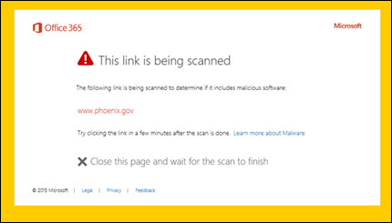

# Waarschuwingspagina's voor ATP Safe LinksATP Safe Links warning pages

> [!IMPORTANT]
> Dit artikel is bedoeld voor zakelijke klanten die [Office 365 Advanced Threat Protection](office-365-atp.md) hebben.This article is intended for business customers who have [Office 365 Advanced Threat Protection](office-365-atp.md). Zie [Geavanceerd Outlook.com beveiliging](https://support.office.com/article/882d2243-eab9-4545-a58a-b36fee4a46e2)als u Outlook.com, Microsoft 365 Family of Microsoft 365 Personal gebruikt en u op zoek bent naar informatie over veilige koppelingen in Outlook.If you are using Outlook.com, Microsoft 365 Family, or Microsoft 365 Personal, and you're looking for information about Safe Links in Outlook, see [Advanced Outlook.com security](https://support.office.com/article/882d2243-eab9-4545-a58a-b36fee4a46e2).

[Office 365 Advanced Threat Protection](office-365-atp.md) (ATP) helpt uw organisatie te beschermen tegen phishingpogingen en malware via functies, zoals [ATP Safe Links,](atp-safe-links.md) [ATP Safe Attachments](atp-safe-attachments.md)en [anti-phishing bescherming.](anti-phishing-protection.md)[Office 365 Advanced Threat Protection](office-365-atp.md) (ATP) helps protect your organization from phishing attempts and malware through features, such as [ATP Safe Links](atp-safe-links.md), [ATP Safe Attachments](atp-safe-attachments.md), and [anti-phishing protection](anti-phishing-protection.md). Wanneer er beveiliging is, worden koppelingen (URL's) in e-mailberichten en Office-documenten gecontroleerd.When protection is in place, links (URLs) in email messages and Office documents are checked. Als een URL als verdacht of kwaadaardig wordt geïdentificeerd, wordt u mogelijk geblokkeerd om de URL te openen wanneer u erop klikt.If a URL is identified as suspicious or malicious, you might be blocked from opening the URL when you click it. In plaats van rechtstreeks naar de site te gaan, ziet u mogelijk een waarschuwingspagina.Instead of going directly to the site, you might see a warning page instead.

Lees dit artikel om voorbeelden te zien van waarschuwingspagina's die kunnen worden weergegeven, samen met recente updates van waarschuwingspagina's.Read this article to see examples of warning pages that might appear, along with recent updates to warning pages.

## Voorbeelden van waarschuwingspagina'sExamples of warning pages

### ATP scant de linkATP is scanning the link

Een URL wordt gescand door ATP Safe Links.A URL is being scanned by ATP Safe Links. Je zou kunnen hebben om een paar momenten te wachten om de link opnieuw te proberen.You might have to wait a few moments to try the link again.

### Een URL bevindt zich in een verdacht e-mailberichtA URL is in a suspicious email message

De URL staat in een e-mailbericht dat lijkt op andere e-mailberichten die als verdacht worden beschouwd.The URL is in an email message that seems similar to other email messages that are considered suspicious. We raden u aan het e-mailbericht te controleren voordat u naar de site gaat.We recommend that you double-check the email message before proceeding to the site.

### Een URL bevindt zich in een bericht dat is geïdentificeerd als een phishing-pogingA URL is in a message identified as a phishing attempt

De URL staat in een e-mailbericht dat is geïdentificeerd als een phishing-aanval.The URL is in an email message that has been identified as a phishing attack. Als gevolg hiervan worden alle URL's in het e-mailbericht geblokkeerd.As a result, all URLs in the email message are blocked. Wij raden u aan niet naar de site te gaan.We recommend that you do not proceed to the site.

### Een site is geïdentificeerd als kwaadaardigA site has been identified as malicious

De URL verwijst naar een site die is geïdentificeerd als kwaadaardig.The URL points to a site that has been identified as malicious.    Wij raden u aan niet naar de site te gaan.We recommend that you do not proceed to the site.

### Een site is geblokkeerdA site is blocked

De URL is geblokkeerd voor uw organisatie.The URL is blocked for your organization. Er zijn verschillende redenen waarom een URL kan worden geblokkeerd.There are several reasons why a URL might be blocked. We raden u aan contact op te nemen met de Microsoft 365 voor bedrijfsbeheerder van uw organisatie.We recommend that you contact your organization's Microsoft 365 for business administrator.

### Er is een fout opgetredenAn error has occurred

Er is een fout opgetreden en de URL kan niet worden geopend.Some kind of error has occurred, and the URL cannot be opened.

## Recente updates voor waarschuwingspagina'sRecent updates to warning pages

Verschillende waarschuwingspagina's zijn onlangs bijgewerkt voor Office 365 ATP.Several warning pages were recently updated for Office 365 ATP. Als u de bijgewerkte pagina's nog niet ziet, zult u dat binnenkort doen.If you're not already seeing the updated pages, you will soon. De updates bevatten een nieuw kleurenschema, meer details en de mogelijkheid om door te gaan naar een site, ondanks de gegeven waarschuwing en aanbevelingen.The updates include a new color scheme, more details, and the ability to proceed to a site despite the given warning and recommendations.

### URL-scan in uitvoeringURL scan in progress

Oorspronkelijke waarschuwingspagina:Original warning page:

Bijgewerkte waarschuwingspagina:Updated warning page:

### Waarschuwing voor schadelijke siteMalicious site warning

Oorspronkelijke waarschuwingspagina:Original warning page:

Bijgewerkte waarschuwingspagina:Updated warning page:

### Geblokkeerde URL-waarschuwingBlocked URL warning

Oorspronkelijke waarschuwingspagina:Original warning page:

Bijgewerkte waarschuwingspagina:Updated warning page:

### Waarschuwingspagina 'Fout opgetreden'"Error occurred" warning page

Oorspronkelijke waarschuwingspagina:Original warning page:

Bijgewerkte waarschuwingspagina:Updated warning page:

