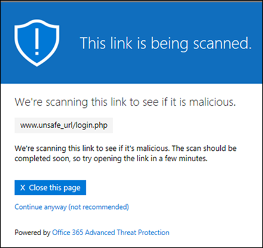

# Veilige koppelingen in Microsoft Defender voor Office 365Safe Links in Microsoft Defender for Office 365

[!INCLUDE [Microsoft 365 Defender rebranding](../includes/microsoft-defender-for-office.md)]

**Van toepassing op****Applies to**
- [Abonnement 1 en abonnement 2 voor Microsoft Defender voor Office 365Microsoft Defender for Office 365 plan 1 and plan 2](https://go.microsoft.com/fwlink/?linkid=2148715)
- [Microsoft 365 DefenderMicrosoft 365 Defender](https://go.microsoft.com/fwlink/?linkid=2118804)

> [!IMPORTANT]
> Dit artikel is bedoeld voor zakelijke klanten die [Microsoft Defender voor Office 365](office-365-atp.md) hebben.This article is intended for business customers who have [Microsoft Defender for Office 365](office-365-atp.md). Als u Outlook.com, Microsoft 365 Family of Microsoft 365 Personal gebruikt en op zoek bent naar informatie over Safelinks in Outlook, gaat u naar [Advanced Outlook.com security.](https://support.microsoft.com/office/882d2243-eab9-4545-a58a-b36fee4a46e2)If you're using Outlook.com, Microsoft 365 Family, or Microsoft 365 Personal, and you're looking for information about Safelinks in Outlook, see [Advanced Outlook.com security](https://support.microsoft.com/office/882d2243-eab9-4545-a58a-b36fee4a46e2).

Veilige koppelingen is een functie in Defender voor [Office 365](office-365-atp.md) waarmee inkomende e-mailberichten in e-mailberichten in de e-mailstroom kunnen worden gescand en herschreven, en verificatie via een time-of-click van URL's en koppelingen in e-mailberichten en andere locaties.Safe Links is a feature in [Defender for Office 365](office-365-atp.md) that provides URL scanning and rewriting of inbound email messages in mail flow, and time-of-click verification of URLs and links in email messages and other locations. Het scannen van veilige koppelingen vindt plaats naast de reguliere bescherming tegen spam en malware in binnenkomende [e-mailberichten](anti-spam-and-anti-malware-protection.md) in Exchange Online Protection (EOP).Safe Links scanning occurs in addition to the regular [anti-spam and anti-malware protection](anti-spam-and-anti-malware-protection.md) in inbound email messages in Exchange Online Protection (EOP). Met safe links scannen kunt u uw organisatie beschermen tegen schadelijke koppelingen die worden gebruikt in phishing en andere aanvallen.Safe Links scanning can help protect your organization from malicious links that are used in phishing and other attacks.

Beveiliging van veilige koppelingen is beschikbaar op de volgende locaties:Safe Links protection is available in the following locations:

- **E-mailberichten:** beveiliging tegen veilige koppelingen voor koppelingen in e-mailberichten wordt bepaald door het beleid voor veilige koppelingen.**Email messages**: Safe Links protection for links in email messages is controlled by Safe Links policies. Er is geen standaardbeleid voor veilige koppelingen. Om de beveiliging van veilige koppelingen in e-mailberichten te krijgen, moet u een of meer beleidsregels voor veilige koppelingen **maken.**There is no default Safe Links policy, **so to get the protection of Safe Links in email messages, you need to create one or more Safe Links policies**. Zie Beleidsregels voor veilige [koppelingen instellen in Microsoft Defender voor Office 365](set-up-atp-safe-links-policies.md)voor instructies.For instructions, see [Set up Safe Links policies in Microsoft Defender for Office 365](set-up-atp-safe-links-policies.md).

  Zie de sectie Veilige koppelingen voor e-mailberichten verderf in dit artikel voor meer informatie over het beschermen van veilige koppelingen voor e-mailberichten. For more information about Safe Links protection for email messages, see the [Safe Links settings for email messages](#safe-links-settings-for-email-messages) section later in this article.

- **Microsoft Teams** (momenteel in de preview-versie van TAP): Beveiliging van veilige koppelingen voor koppelingen in Teams-gesprekken, groepschats of van kanalen wordt ook bepaald door beleidsregels voor veilige koppelingen.**Microsoft Teams** (currently in TAP Preview): Safe Links protection for links in Teams conversations, group chats, or from channels is also controlled by Safe Links policies. Er is geen standaardbeleid voor veilige koppelingen. Om de beveiliging van veilige koppelingen in Teams te krijgen, moet u een of meer beleidsregels voor veilige koppelingen **maken.**There is no default Safe Links policy, **so to get the protection of Safe Links in Teams, you need to create one or more Safe Links policies**.

  Voor meer informatie over beveiliging tegen veilige koppelingen in Teams, bekijkt u de sectie Met veilige koppelingen voor [Microsoft Teams](#safe-links-settings-for-microsoft-teams) verder op dit artikel.For more information about Safe Links protection in Teams, see the [Safe Links settings for Microsoft Teams](#safe-links-settings-for-microsoft-teams) section later in this article.

- **Office 365-apps:** Beveiliging tegen veilige koppelingen voor Office 365-apps is beschikbaar in ondersteunde desktop-, mobiele en web-aps.**Office 365 apps**: Safe Links protection for Office 365 apps is available in supported desktop, mobile, and web aps. U **configureert** beveiliging tegen veilige koppelingen voor Office 365-apps in de globale instelling die buiten het beleid voor veilige koppelingen wordt gebruikt. You **configure** Safe Links protection for Office 365 apps in the global setting that are **outside** of Safe Links policies. Zie Algemene instellingen [configureren voor instellingen voor veilige koppelingen in Microsoft Defender voor Office 365](configure-global-settings-for-safe-links.md)voor instructies.For instructions, see [Configure global settings for Safe Links settings in Microsoft Defender for Office 365](configure-global-settings-for-safe-links.md).

  Beveiliging van veilige koppelingen voor Office 365-apps wordt echter alleen toegepast op gebruikers die zijn opgenomen in het actieve beleid voor veilige koppelingen. But, Safe Links protection for Office 365 apps is only **applied** to users who are included in active Safe Links policies. Als een gebruiker niet is opgenomen in een actief beleid voor veilige koppelingen, wordt de gebruiker niet beschermd tegen veilige koppelingen in ondersteunde Office 365-apps.If a user isn't included in an active Safe Links policy, the user doesn't get Safe Links protection in supported Office 365 apps.

  Zie de sectie Veilige koppelingen voor Office 365-apps verderf in dit artikel voor meer informatie over het beveiliging van veilige koppelingen in [Office 365-apps.](#safe-links-settings-for-office-365-apps)For more information about Safe Links protection in Office 365 apps, see the [Safe Links settings for Office 365 apps](#safe-links-settings-for-office-365-apps) section later in this article.

Dit artikel bevat gedetailleerde beschrijvingen van de volgende typen instellingen voor veilige koppelingen:This article includes detailed descriptions of the following types of Safe Links settings:

- **Instellingen in beleidsregels voor** veilige koppelingen: deze instellingen zijn alleen van toepassing op de gebruikers die zijn opgenomen in het specifieke beleid en de instellingen kunnen verschillen tussen beleidsregels.**Settings in Safe Links policies**: These settings apply only to the users who are included in the specific policies, and the settings might be different between policies. Dit zijn onder andere de volgende instellingen:These settings include:

  - [Instellingen voor veilige koppelingen voor e-mailberichtenSafe Links settings for email messages](#safe-links-settings-for-email-messages)
  - [Instellingen voor veilige koppelingen voor Microsoft TeamsSafe Links settings for Microsoft Teams](#safe-links-settings-for-microsoft-teams)
  - [Lijsten met 'De volgende URL's niet herschrijven' in beleidsregels voor veilige koppelingen"Do not rewrite the following URLs" lists in Safe Links policies](#do-not-rewrite-the-following-urls-lists-in-safe-links-policies)

- **Algemene instellingen voor veilige koppelingen:** deze instellingen worden globaal geconfigureerd, niet in het beleid voor veilige koppelingen.**Global Safe Links settings**: These settings are configured globally, not in Safe Links policies. De instellingen zijn echter alleen van toepassing op gebruikers die zijn opgenomen in het actieve beleid voor veilige koppelingen.But, the settings apply only to users who are included in active Safe Links policies. Dit zijn onder andere de volgende instellingen:These settings include:

  - [Instellingen voor veilige koppelingen voor Office 365-appsSafe Links settings for Office 365 apps](#safe-links-settings-for-office-365-apps)
  - [Lijst 'De volgende URL's blokkeren' voor Veilige koppelingen"Block the following URLs" list for Safe Links](#block-the-following-urls-list-for-safe-links)

In de volgende tabel worden scenario's beschreven voor veilige koppelingen in Microsoft 365- en Office 365-organisaties die Defender voor Office 365 bevatten (met andere woorden, het ontbreken van licenties is nooit een probleem in de voorbeelden).The following table describes scenarios for Safe Links in Microsoft 365 and Office 365 organizations that include Defender for Office 365 (in other words, lack of licensing is never an issue in the examples).

****

|ScenarioScenario|ResultaatResult|
|---|---|
|John is lid van de marketingafdeling.Jean is a member of the marketing department. Beveiliging tegen veilige koppelingen voor Office 365-apps is ingeschakeld in de algemene instellingen voor veilige koppelingen en er is een beleid voor veilige koppelingen dat geldt voor leden van de marketingafdeling.Safe Links protection for Office 365 apps is turned on in the global settings for Safe Links, and a Safe Links policy that applies to members of the marketing department exists. In een e-mailbericht opent John een PowerPoint-presentatie en klikt u vervolgens op een URL in de presentatie.Jean opens a PowerPoint presentation in an email message, and then clicks a URL in the presentation.|Jean wordt beveiligd door veilige koppelingen.Jean is protected by Safe Links. 
 John is opgenomen in een Beleid voor veilige koppelingen en Beveiliging tegen veilige koppelingen voor Office 365-apps is ingeschakeld.Jean is included in a Safe Links policy, and Safe Links protection for Office 365 apps is turned on. 
 Zie de sectie Met veilige koppelingen voor Office 365-apps verderf in dit artikel voor meer informatie over de vereisten voor beveiliging van veilige koppelingen in Office [365-apps.](#safe-links-settings-for-office-365-apps)For more information about the requirements for Safe Links protection in Office 365 apps, see the [Safe Links settings for Office 365 apps](#safe-links-settings-for-office-365-apps) section later in this article.|
|Voor chris's Microsoft 365 E5-organisatie is geen beleid voor veilige koppelingen geconfigureerd.Chris's Microsoft 365 E5 organization has no Safe Links policies configured. Chris ontvangt een e-mailbericht van een externe afzender met een URL naar een schadelijke website die hij uiteindelijk heeft geklikt.Chris receives an email from an external sender that contains a URL to a malicious website that he ultimately clicks.|Chris wordt niet beveiligd door veilige koppelingen.Chris is not protected by Safe Links. 
 Een beheerder moet ten minste één beleid voor veilige koppelingen maken dat iedereen inkomende e-mailberichten met veilige koppelingen kan persoonsgegevens bieden.An admin must create at least one Safe Links policy for anyone to get Safe Links protection in inbound email messages. Chris moet worden opgenomen in de beleidsvoorwaarden om veilige koppelingen te veilig te maken.Chris must be included in the conditions of policy to get Safe Links protection.|
|In de organisatie van Pat hebben geen beheerders beleidsregels voor veilige koppelingen gemaakt, maar beveiliging voor veilige koppelingen voor Office 365-apps is ingeschakeld.In Pat's organization, no admins have created any Safe Links policies, but Safe Links protection for Office 365 apps is turned on. Pat opent een Word-document en klikt op een URL in het bestand.Pat opens a Word document and clicks a URL in the file.|Pat wordt niet beveiligd door veilige koppelingen.Pat is not protected by Safe Links. 
 Hoewel beveiliging voor veilige koppelingen voor Office 365-apps globaal wordt ingeschakeld, is Pat niet opgenomen in actieve beleidsregels voor veilige koppelingen, zodat de beveiliging niet kan worden toegepast.Although Safe Links protection for Office 365 apps is turned on globally, Pat is not included in any active Safe Links policies, so the protection can't be applied.|
|In de organisatie van Luwte is geconfigureerd in de lijst De volgende URL's blokkeren `https://tailspintoys.com` in de algemene instellingen voor veilige koppelingen. In Lee's organization, `https://tailspintoys.com` is configured in the **Block the following URLs** list in the global settings for Safe Links. Er bestaat al een beleid voor veilige koppelingen met Lee.A Safe Links policy that includes Lee already exists. Lee ontvangt een e-mailbericht met de `https://tailspintoys.com/aboutus/trythispage` URL.Lee receives an email message that contains the URL `https://tailspintoys.com/aboutus/trythispage`. Lee klikt op de URL.Lee clicks the URL.|De URL wordt mogelijk automatisch geblokkeerd voor Lusje; Dit hangt af van de URL-vermelding in de lijst en van de e-mailclient die Lee heeft gebruikt.The URL might be automatically blocked for Lee; it depends on the URL entry in the list and the email client Lee used. Zie de lijst 'De volgende [URL's blokkeren'](#block-the-following-urls-list-for-safe-links) voor de sectie Veilige koppelingen verderop in dit artikel.For more information, see the ["Block the following URLs" list for Safe Links](#block-the-following-urls-list-for-safe-links) section later in this article.|
|Jamie en Julia werken beide voor contoso.com.Jamie and Julia both work for contoso.com. Lang geleden hebben beheerders beleidsregels voor veilige koppelingen geconfigureerd die van toepassing zijn op zowel Jamie als Julia.A long time ago, admins configured Safe Links policies that apply to both of Jamie and Julia. Jamie stuurt een e-mailbericht naar Julia, niet wetende dat het e-mailbericht een schadelijke URL bevat.Jamie sends an email to Julia, not knowing that the email contains a malicious URL.|Julia wordt beveiligd door veilige koppelingen **als** het beleid voor veilige koppelingen dat op haar van toepassing is, is geconfigureerd voor berichten tussen interne geadresseerden.Julia is protected by Safe Links **if** the Safe Links policy that applies to her is configured to apply to messages between internal recipients. Zie de sectie Veilige koppelingen [voor](#safe-links-settings-for-email-messages) e-mailberichten verder op dit artikel voor meer informatie.For more information, see the [Safe Links settings for email messages](#safe-links-settings-for-email-messages) section later in this article.|

## Instellingen voor veilige koppelingen voor e-mailberichtenSafe Links settings for email messages

Met veilige koppelingen scant u inkomende e-mail op bekende schadelijke hyperlinks.Safe Links scans incoming email for known malicious hyperlinks. Gescande URL's worden herschreven met het standaard-URL-voorvoegsel van `https://nam01.safelinks.protection.outlook.com` Microsoft:Scanned URLs are rewritten using the Microsoft standard URL prefix: `https://nam01.safelinks.protection.outlook.com`. Nadat de koppeling is herschreven, wordt deze geanalyseerd op mogelijk schadelijke inhoud.After the link is rewritten, it's analyzed for potentially malicious content.

Nadat een URL opnieuw is geschreven met Veilige koppelingen, blijft de URL herschreven, zelfs als het bericht wordt doorgestuurd of beantwoord.After Safe Links rewrites a URL, the URL remains rewritten, even if the message is forwarded or replied to. Extra koppelingen die aan het doorgestuurde of beantwoorde bericht worden toegevoegd, worden niet herschreven.Additional links that are added to the forwarded or replied to message are not rewritten.

De instellingen in beleidsregels voor veilige koppelingen die van toepassing zijn op e-mailberichten, worden in de volgende lijst beschreven:The settings in Safe Links policies that apply to email messages are described in the following list:

- **Selecteer de actie voor onbekende, mogelijk schadelijke URL's in** berichten: Hiermee schakelt u het scannen van veilige koppelingen in e-mailberichten in of uit.**Select the action for unknown potentially malicious URLs in messages**: Enables or disables Safe Links scanning in email messages. De aanbevolen waarde is **Aan.**The recommended value is **On**. Als u deze instelling in uitschakelen, worden de volgende acties ondernomen.Turning on this setting results in the following actions.

  - Scannen van veilige koppelingen is ingeschakeld in Outlook (C2R) in Windows.Safe Links scanning is enabled in Outlook (C2R) on Windows.
  - URL's worden herschreven en gebruikers worden omgeleid via beveiliging tegen veilige koppelingen wanneer ze op URL's in berichten klikken.URLs are rewritten and users are routed through Safe Links protection when they click URLs in messages.
  - Wanneer erop wordt geklikt, worden URL's gecontroleerd op een lijst met bekende schadelijke URL's en de lijst 'De volgende [URL's blokkeren'.](#block-the-following-urls-list-for-safe-links)When clicked, URLs are checked against a list of known malicious URLs and the ["Block the following URLs" list](#block-the-following-urls-list-for-safe-links).
  - URL's die geen geldige reputatie hebben, worden asynchroon op de achtergrond gedetoneerd.URLs that don't have a valid reputation are detonated asynchronously in the background.

- **Gebruik het scannen van realtime-URL's** op verdachte koppelingen en koppelingen die naar bestanden wijzen: hiermee kunt u koppelingen in realtime scannen, inclusief koppelingen in e-mailberichten die naar downloadbare inhoud wijzen.**Apply real-time URL scanning for suspicious links and links that point to files**: Enables real-time scanning of links, including links in email messages that point to downloadable content. De aanbevolen waarde is ingeschakeld.The recommended value is enabled.

  - **Wacht totdat het scannen van de URL is voltooid voordat het bericht wordt weergegeven:****Wait for URL scanning to complete before delivering the message**:

    - Ingeschakeld: berichten met URL's worden opgeslagen totdat het scannen is voltooid.Enabled: Messages that contain URLs are held until scanning is finished. Berichten worden alleen bezorgd nadat de URL's zijn bevestigd om veilig te zijn.Messages are delivered only after the URLs are confirmed to be safe. Dit is de aanbevolen waarde.This is the recommended value.
    - Uitgeschakeld: Als het scannen van URL's niet kan worden voltooid, bezorgt u het bericht toch.Disabled: If URL scanning can't complete, deliver the message anyway.

- Veilige koppelingen toepassen op **e-mailberichten** die binnen de organisatie worden verzonden: Hiermee schakelt u het scannen van veilige koppelingen in of uit op berichten die worden verzonden tussen interne afzenders en interne geadresseerden binnen dezelfde Exchange Online-organisatie.**Apply Safe Links to email messages sent within the organization**: Enables or disables Safe Links scanning on messages sent between internal senders and internal recipients within the same Exchange Online organization. De aanbevolen waarde is ingeschakeld.The recommended value is enabled.

- **Klikken op gebruikers niet bijhouden:** Hiermee schakelt u het opslaan van veilige koppelingen in of uit, klik op gegevens voor URL's waarin in e-mailberichten wordt geklikt.**Do not track user clicks**: Enables or disables storing Safe Links click data for URLs clicked in email messages. Deze instelling wordt aanbevolen niet te worden geselecteerd (om klikken van gebruikers bij te houden).The recommend value is to leave this setting unselected (to track user clicks).

  Het bijhouden van URL-klikken voor koppelingen in e-mailberichten die worden verzonden tussen interne afzenders en interne geadresseerden, wordt momenteel niet ondersteund.URL click tracking for links in email messages sent between internal senders and internal recipients is currently not supported.

- **Niet toestaan dat gebruikers doorklikken** naar de oorspronkelijke URL:  hiermee kunnen gebruikers niet door de waarschuwingspagina klikken of naar de oorspronkelijke URL klikken.**Do not allow users to click through to original URL**: Allows or blocks users from clicking through the [warning page](#warning-pages-from-safe-links) to the original URL. De aanbevolen waarde is ingeschakeld.The recommend value is enabled.

- **Herschrijf de volgende URL's niet** opnieuw: laat DE URL's zo staan.**Do not rewrite the following URLs**: Leaves URLs as they are. Houdt een aangepaste lijst bij van veilige URL's die u niet hoeft te scannen.Keeps a custom list of safe URLs that don't need scanning. De lijst is uniek voor elk beleid voor veilige koppelingen.The list is unique for each Safe Links policy. Zie de lijsten 'De volgende **URL's** niet herschrijven' verder in dit artikel voor meer informatie over het niet herschrijven van de volgende URL's-lijst. For more information about the **Do not rewrite the following URLs** list, see the ["Do not rewrite the following URLs" lists in Safe Links policies](#do-not-rewrite-the-following-urls-lists-in-safe-links-policies) section later in this article.

Zie beleidsinstellingen voor veilige koppelingen voor meer informatie over de aanbevolen waarden voor beleidsregels standaard en [strikt voor veilige koppelingen.](recommended-settings-for-eop-and-office365-atp.md#safe-links-policy-settings)For more information about the recommended values for Standard and Strict policy settings for Safe Links policies, see [Safe Links policy settings](recommended-settings-for-eop-and-office365-atp.md#safe-links-policy-settings).

- **Geadresseerdenfilters:** u moet de voorwaarden van de geadresseerde opgeven en uitzonderingen die bepalen op wie het beleid van toepassing is.**Recipient filters**: You need to specify the recipient conditions and exceptions that determine who the policy applies to. U kunt deze eigenschappen gebruiken voor voorwaarden en uitzonderingen:You can use these properties for conditions and exceptions:

  - **De ontvanger is****The recipient is**
  - **Het domein van de ontvanger is****The recipient domain is**
  - **De ontvanger is lid van****The recipient is a member of**

  U kunt een voorwaarde of uitzondering slechts eenmaal gebruiken, maar de voorwaarde of uitzondering kan meerdere waarden bevatten.You can only use a condition or exception once, but the condition or exception can contain multiple values. Meerdere waarden van dezelfde voorwaarde of uitzondering: gebruik OF-logica (bijvoorbeeld: _\<recipient1\>_ of _\<recipient2\>_).Multiple values of the same condition or exception use OR logic (for example, _\<recipient1\>_ or _\<recipient2\>_). Verschillende voorwaarden of uitzonderingen: gebruik EN-logica (bijvoorbeeld: _\<recipient1\>_ en _\<member of group 1\>_).Different conditions or exceptions use AND logic (for example, _\<recipient1\>_ and _\<member of group 1\>_).

- **Prioriteit:** als u meerdere beleidsregels maakt, kunt u de volgorde opgeven waarin ze worden toegepast.**Priority**: If you create multiple policies, you can specify the order that they're applied. Twee beleidsregels kunnen niet dezelfde prioriteit hebben en de verwerking van het beleid stopt nadat het eerste beleid is toegepast.No two policies can have the same priority, and policy processing stops after the first policy is applied.

  Voor meer informatie over de prioriteitvolgorde en het evalueren en toepassen van een beleid, raadpleegt u [volgorde en prioriteit van e-mailbeveiliging](how-policies-and-protections-are-combined.md).For more information about the order of precedence and how multiple policies are evaluated and applied, see [Order and precedence of email protection](how-policies-and-protections-are-combined.md).

### De manier waarop veilige koppelingen werken in e-mailberichtenHow Safe Links works in email messages

Op hoog niveau werkt beveiliging van veilige koppelingen voor URL's in e-mailberichten als volgende:At a high level, here's how Safe Links protection works on URLs in email messages:

1. Alle e-mailberichten worden verzonden via EOP, waar internetprotocolfilters (IP) en envelopfilters, op handtekeningen gebaseerde malwarebeveiliging, antispam- en anti-malwarefilters worden gebruikt voordat het bericht in het postvak van de geadresseerde wordt bezorgd.All email goes through EOP, where internet protocol (IP) and envelope filters, signature-based malware protection, anti-spam and anti-malware filters before the message is delivered to the recipient's mailbox.

2. De gebruiker opent het bericht in het postvak en klikt op een URL in het bericht.The user opens the message in their mailbox and clicks on a URL in the message.

3. Met veilige koppelingen wordt onmiddellijk de URL gecontroleerd voordat u de website opent:Safe Links immediately checks the URL before opening the website:

   - Als de URL is opgenomen in de lijst **De volgende URL's** blokkeren, wordt een [waarschuwing voor geblokkeerde URL's](#blocked-url-warning) geopend.If the URL is included in the **Block the following URLs** list, a [blocked URL warning](#blocked-url-warning) opens.

   - Als de URL naar een website wijst die schadelijk is, wordt een waarschuwingspagina voor een schadelijke [website](#malicious-website-warning) (of een andere waarschuwingspagina) geopend.If the URL points to a website that has been determined to be malicious, a [malicious website warning](#malicious-website-warning) page (or a different warning page) opens.

   - Als de URL naar een downloadbaar bestand wijst en het scannen van **de URL in realtime** op verdachte koppelingen en koppelingen naar bestanden is ingeschakeld in het beleid dat van toepassing is op de gebruiker, wordt het downloadbare bestand gecontroleerd.If the URL points to a downloadable file, and the **Apply real-time URL scanning for suspicious links and links that point to files** setting is enabled in the policy that applies to the user, the downloadable file is checked.

   - Als de URL veilig is, wordt de website geopend.If the URL is determined to be safe, the website opens.

## Instellingen voor veilige koppelingen voor Microsoft TeamsSafe Links settings for Microsoft Teams

> [!IMPORTANT]
> Vanaf maart 2020 is deze functie beschikbaar als preview-versie en is alleen beschikbaar voor leden van het Microsoft Teams Technology Adoption Program (TAP).As of March 2020, this feature is in Preview and is available only to members of the Microsoft Teams Technology Adoption Program (TAP). Bekijk de routekaart voor [Microsoft 365](https://www.microsoft.com/microsoft-365/roadmap?rtc=1&filters=&searchterms=Safe%2CLinks%2CProtection%2Cfor%2CMicrosoft%2CTeams)voor informatie over het releaseschema.For information about the release schedule, check out the [Microsoft 365 roadmap](https://www.microsoft.com/microsoft-365/roadmap?rtc=1&filters=&searchterms=Safe%2CLinks%2CProtection%2Cfor%2CMicrosoft%2CTeams).

U schakelt beveiliging tegen veilige koppelingen voor Microsoft Teams in of uit in beleidsregels voor veilige koppelingen.You enable or disable Safe Links protection for Microsoft Teams in Safe Links policies. U gebruikt de actie Selecteren voor onbekende of mogelijk schadelijke **URL's in de instelling Microsoft Teams.**Specifically, you use the **Select the action for unknown or potentially malicious URLs within Microsoft Teams** setting. De aanbevolen waarde is **Aan.**The recommended value is **On**.

De volgende instellingen in beleidsregels voor veilige koppelingen die van toepassing zijn op koppelingen in e-mailberichten, zijn ook van toepassing op koppelingen in Teams:The following settings in Safe Links policies that apply to links in email messages also apply to links in Teams:

- **Real-time URL's scannen op verdachte koppelingen en koppelingen die naar bestanden wijzen****Apply real-time URL scanning for suspicious links and links that point to files**
- **Klikken van gebruikers niet bijhouden****Do not track user clicks**
- **Gebruikers niet toestaan door te klikken naar de oorspronkelijke URL****Do not allow users to click through to original URL**

Deze instellingen worden uitgelegd in de vorige sectie [met instellingen voor veilige koppelingen voor e-mailberichten.](#safe-links-settings-for-email-messages)These settings are explained in the previous [Safe Links settings for email messages](#safe-links-settings-for-email-messages) section.

Nadat u Beveiliging voor veilige koppelingen voor Microsoft Teams hebt ingeschakeld, worden URL's in Teams gecontroleerd op een lijst met bekende schadelijke koppelingen wanneer de beveiligde gebruiker op de koppeling klikt (time-of-click-beveiliging).After you turn on Safe Links protection for Microsoft Teams, URLs in Teams are checked against a list of known malicious links when the protected user clicks the link (time-of-click protection). URL's worden niet herschreven.URLs are not rewritten. Als een koppeling schadelijk wordt gevonden, hebben gebruikers de volgende ervaringen:If a link is found to be malicious, users will have the following experiences:

- Als op de koppeling is geklikt in een Teams-gesprek, groepschat of vanuit kanalen, wordt de waarschuwingspagina zoals weergegeven in de onderstaande schermafbeelding weergegeven in de standaardwebbrowser.If the link was clicked in a Teams conversation, group chat, or from channels, the warning page as shown in the screenshot below will appear in the default web browser.
- Als u op de koppeling hebt geklikt vanaf een vastgemaakt tabblad, wordt de waarschuwingspagina weergegeven in de Teams-interface op dat tabblad. De optie voor het openen van de koppeling in een webbrowser is om veiligheidsredenen uitgeschakeld.If the link was clicked from a pinned tab, the warning page will appear in the Teams interface within that tab. The option to open the link in a web browser is disabled for security reasons.
- Afhankelijk van hoe gebruikers niet kunnen doorklikken naar de oorspronkelijke **URL-instelling** in het beleid, kan de gebruiker al dan niet doorklikken naar de oorspronkelijke URL (toch doorgaan **(niet aanbevolen)** in de schermafbeelding).Depending on how the **Do not allow users to click through to original URL** setting in the policy is configured, the user will or will not be allowed to click through to the original URL (**Continue anyway (not recommended)** in the screenshot). U wordt aangeraden de instelling Niet toestaan dat gebruikers doorklikken naar de oorspronkelijke **URL-instelling** in te stellen, zodat gebruikers niet kunnen doorklikken naar de oorspronkelijke URL.We recommend that you enable the **Do not allow users to click through to original URL** setting so users can't click through to the original URL.

Als de gebruiker die de koppeling heeft verzonden niet is opgenomen in een beleid voor veilige koppelingen waarin Teams-beveiliging is ingeschakeld, kan de gebruiker op de oorspronkelijke URL op zijn computer of apparaat klikken.If the user who sent the link isn't included in a Safe Links policy where Teams protection is enabled, the user is free to click through to the original URL on their computer or device.

Als u op **de knop Terug** gaan op de waarschuwingspagina klikt, wordt de gebruiker terug geplaatst naar de oorspronkelijke context of URL-locatie.Clicking the **Go Back** button on the warning page will return the user to their original context or URL location. Als u echter nogmaals op de oorspronkelijke koppeling klikt, wordt de URL opnieuw scant door Veilige koppelingen, zodat de waarschuwingspagina opnieuw wordt weergegeven.However, clicking on the original link again will cause Safe Links to rescan the URL, so the warning page will reappear.

### Hoe veilige koppelingen werken in TeamsHow Safe Links works in Teams

Op hoog niveau werkt safe links-beveiliging voor URL's in Microsoft Teams als volgende:At a high level, here's how Safe Links protection works for URLs in Microsoft Teams:

1. Een gebruiker start de Teams-app.A user starts the Teams app.

2. Microsoft 365 controleert of de organisatie van de gebruiker Microsoft Defender voor Office 365 bevat en dat de gebruiker is opgenomen in een actief beleid voor veilige koppelingen, waarbij beveiliging voor Microsoft Teams is ingeschakeld.Microsoft 365 verifies that the user's organization includes Microsoft Defender for Office 365, and that the user is included in an active Safe Links policy where protection for Microsoft Teams is enabled.

3. URL's worden gevalideerd op het moment dat de gebruiker klikt in chats, groepschats, kanalen en tabbladen.URLs are validated at the time of click for the user in chats, group chats, channels, and tabs.

## Instellingen voor veilige koppelingen voor Office 365-appsSafe Links settings for Office 365 apps

Met de beveiliging van veilige koppelingen voor Office 365-apps worden koppelingen in Office-documenten gecontroleerd, geen koppelingen in e-mailberichten (maar koppelingen in bijgevoegde Office-documenten in e-mailberichten worden gecontroleerd nadat het document is geopend).Safe Links protection for Office 365 apps checks links in Office documents, not links in email messages (but it can check links in attached Office documents in email messages after the document is opened).

Beveiliging tegen veilige koppelingen voor Office 365-apps heeft de volgende clientvereisten:Safe Links protection for Office 365 apps has the following client requirements:

- Microsoft 365-apps of Microsoft 365 Business Premium.Microsoft 365 Apps or Microsoft 365 Business Premium.
  - Huidige versies van Word, Excel en PowerPoint op Windows, Mac of in een webbrowser.Current versions of Word, Excel, and PowerPoint on Windows, Mac, or in a web browser.
  - Office-apps op iOS- of Android-apparaten.Office apps on iOS or Android devices.
  - Visio voor Windows.Visio on Windows.
  - OneNote in een webbrowser.OneNote in a web browser.

- Office 365-apps zijn geconfigureerd voor het gebruik van moderne verificatie.Office 365 apps are configured to use modern authentication. Zie Hoe moderne verificatie werkt voor [Office 2013-, Office 2016- en Office 2019-clientapps](https://docs.microsoft.com/microsoft-365/enterprise/modern-auth-for-office-2013-and-2016)voor meer informatie.For more information, see [How modern authentication works for Office 2013, Office 2016, and Office 2019 client apps](https://docs.microsoft.com/microsoft-365/enterprise/modern-auth-for-office-2013-and-2016).

- Gebruikers worden aangemeld met hun werk- of schoolaccount.Users are signed in using their work or school accounts. Zie Aanmelden bij [Office voor meer informatie.](https://support.microsoft.com/office/b9582171-fd1f-4284-9846-bdd72bb28426)For more information, see [Sign in to Office](https://support.microsoft.com/office/b9582171-fd1f-4284-9846-bdd72bb28426).

U configureert beveiliging tegen veilige koppelingen voor Office 365-apps in de algemene instellingen voor Veilige koppelingen, niet in het beleid voor veilige koppelingen.You configure Safe Links protection for Office 365 apps in the global settings for Safe Links, not in Safe Links policies. Maar om De beveiliging van veilige koppelingen voor Office 365-apps toe te staan, moet de gebruiker die het Office-document opent en op de koppeling klikt, worden opgenomen in een actief beleid voor veilige koppelingen.But, in order for Safe Links protection for Office 365 apps to be applied, the user who opens the Office document and clicks the link must be included in an active Safe Links policy.

De volgende instellingen voor veilige koppelingen zijn beschikbaar voor Office 365-apps:The following Safe Links settings are available for Office 365 apps:

- **Office 365-toepassingen:** Hiermee schakelt u scannen van veilige koppelingen in ondersteunde Office 365-apps in of uit.**Office 365 applications**: Enables or disables Safe Links scanning in supported Office 365 apps. De standaard- en aanbevolen waarde is **Ingeschakeld.**The default and recommended value is **On**.

- **Houd niet bij** wanneer gebruikers op Veilige koppelingen klikken: Hiermee schakelt u het opslaan van veilige koppelingen in of uit, klik op gegevens voor URL's waarop in de bureaubladversies van Word, Excel, PowerPoint en Visio wordt geklikt.**Do not track when users click Safe Links**: Enables or disables storing Safe Links click data for URLs clicked in the desktop versions Word, Excel, PowerPoint, and Visio. De aanbevolen waarde is **Uit,** wat betekent dat klikken van gebruikers worden bijgesneden.The recommended value is **Off**, which means user clicks are tracked.

- Laat gebruikers niet door veilige koppelingen naar de oorspronkelijke **URL** klikken: hiermee kunnen gebruikers niet door de waarschuwingspagina klikken naar de oorspronkelijke URL in de bureaubladversies van Word, Excel, PowerPoint en Visio. **Do not let users click through safe links to original URL**: Allows or blocks users from clicking through the [warning page](#warning-pages-from-safe-links) to the original URL in in the desktop versions Word, Excel, PowerPoint, and Visio. De standaardwaarde en aanbevolen waarde is **Ingeschakeld.**The default and recommended value is **On**.

Zie Beveiliging van veilige koppelingen configureren voor Office 365-apps als u de instellingen voor veilige koppelingen [voor Office 365-apps wilt configureren.](configure-global-settings-for-safe-links.md#configure-safe-links-protection-for-office-365-apps-in-the-security--compliance-center)To configure the Safe Links settings for Office 365 apps, see [Configure Safe Links protection for Office 365 apps](configure-global-settings-for-safe-links.md#configure-safe-links-protection-for-office-365-apps-in-the-security--compliance-center).

Zie Algemene instellingen voor veilige koppelingen voor meer informatie over de aanbevolen waarden voor standaard- en [strikte beleidsinstellingen.](recommended-settings-for-eop-and-office365-atp.md#global-settings-for-safe-links)For more information about the recommended values for Standard and Strict policy settings, see [Global settings for Safe Links](recommended-settings-for-eop-and-office365-atp.md#global-settings-for-safe-links).

### Hoe veilige koppelingen werken in Office 365-appsHow Safe Links works in Office 365 apps

Op hoog niveau kunt u de beveiliging van veilige koppelingen gebruiken voor URL's in Office 365-apps.At a high level, here's how Safe Links protection works for URLs in Office 365 apps. De ondersteunde Office 365-apps worden beschreven in het vorige gedeelte.The supported Office 365 apps are described in the previous section.

1. Een gebruiker meldt zich aan met zijn of haar werk- of schoolaccount in een organisatie die Microsoft 365-apps of Microsoft 365 Business Premium bevat.A user signs in using their work or school account in an organization that includes Microsoft 365 Apps or Microsoft 365 Business Premium.

2. De gebruiker wordt geopend en klikt op een koppeling naar een Office-document in een ondersteunde Office-app.The user opens and clicks on a link an Office document in a supported Office app.

3. Met veilige koppelingen wordt de URL onmiddellijk gecontroleerd voordat u de doelwebsite opent:Safe Links immediately checks the URL before opening the target website:

   - Als de URL is opgenomen in de lijst waarin Safe Links niet kan worden gescand (de lijst met de volgende **URL's** blokkeren), wordt een waarschuwingspagina voor geblokkeerde [URL's](#blocked-url-warning) geopend.If the URL is included in the list that skips Safe Links scanning (the **Block the following URLs** list) a [blocked URL warning](#blocked-url-warning) page opens.

   - Als de URL naar een website wijst die schadelijk is, wordt een waarschuwingspagina voor een schadelijke [website](#malicious-website-warning) (of een andere waarschuwingspagina) geopend.If the URL points to a website that has been determined to be malicious, a [malicious website warning](#malicious-website-warning) page (or a different warning page) opens.

   - Als de URL naar een downloadbaar bestand wijst en het beleid voor Veilige koppelingen dat van toepassing is op de gebruiker zo is geconfigureerd dat koppelingen naar downloadbare inhoud worden gescand (SCAN IN **realtime-URL's** toepassen op verdachte koppelingen en koppelingen naar bestanden), wordt het downloadbare bestand gecontroleerd.If the URL points to a downloadable file, and the Safe Links policy that applies to the user is configured to scan links to downloadable content (**Apply real-time URL scanning for suspicious links and links that point to files**), the downloadable file is checked.

   - Als de URL als veilig wordt beschouwd, wordt de gebruiker naar de website overgebracht.If the URL is considered safe, the user is taken to the website.

   - Als scannen van veilige koppelingen niet kan worden voltooid, wordt de beveiliging van veilige koppelingen niet triggers.If Safe Links scanning is unable to complete, Safe Links protection does not trigger. In Office-desktopcl clients wordt de gebruiker gewaarschuwd voordat deze naar de doelwebsite gaat.In Office desktop clients, the user will be warned before they proceed to the destination website.

> [!NOTE]
> Het kan enkele seconden aan het begin van elke sessie duren om te controleren of veilige koppelingen voor Office zijn ingeschakeld voor de gebruiker.It may take several seconds at the beginning of each session to verify that the user has Safe Links for Office enabled.

## Lijst 'De volgende URL's blokkeren' voor Veilige koppelingen"Block the following URLs" list for Safe Links

De **lijst met de volgende URL's** blokkeren definieert de koppelingen die altijd worden geblokkeerd door het scannen van veilige koppelingen op de volgende locaties:The **Block the following URLs** list defines the links that are always blocked by Safe Links scanning in the following locations:

- E-mailberichten.Email messages.
- Documenten in Office 365-apps in Windows en Mac.Documents in Office 365 apps in Windows and Mac.
- Documenten in Office voor iOS en Android.Documents in Office for iOS and Android.

Wanneer een gebruiker in een actief beleid voor veilige koppelingen op een geblokkeerde koppeling in een ondersteunde app klikt, wordt deze naar de waarschuwingspagina voor geblokkeerde [URL's](#blocked-url-warning) overgebracht.When a user in an active Safe Links policy clicks a blocked link in a supported app, they're taken to the [Blocked URL warning](#blocked-url-warning) page.

U configureert de lijst met URL's in de algemene instellingen voor veilige koppelingen.You configure the list of URLs in the global settings for Safe Links. Zie De lijst ['De volgende URL's blokkeren' configureren voor instructies.](configure-global-settings-for-safe-links.md#configure-the-block-the-following-urls-list-in-the-security--compliance-center)For instructions, see [Configure the "Block the following URLs" list](configure-global-settings-for-safe-links.md#configure-the-block-the-following-urls-list-in-the-security--compliance-center).

**Opmerkingen**:**Notes**:

- Zie De lijst met tenants [toestaan/blokkeren](tenant-allow-block-list.md)beheren voor een echt universele lijst met URL's die overal worden geblokkeerd.For a truly universal list of URLs that are blocked everywhere, see [Manage the Tenant Allow/Block List](tenant-allow-block-list.md).

- Limieten:Limits:
  - Het maximum aantal items is 500.The maximum number of entries is 500.
  - De maximumlengte van een vermelding is 128 tekens.The maximum length of an entry is 128 characters.
  - Alle items mogen niet meer dan 10.000 tekens bevatten.All of the entries can't exceed 10,000 characters.

- Voeg geen slash () toe aan `/` het einde van de URL.Don't include a forward slash (`/`) at the end of the URL. Gebruik bijvoorbeeld niet `https://www.contoso.com` `https://www.contoso.com/` .For example, use `https://www.contoso.com`, not `https://www.contoso.com/`.

- Met een alleen-url voor een domein (bijvoorbeeld of ) wordt elke `contoso.com` URL geblokkeerd die het domein `tailspintoys.com` bevat.A domain only-URL (for example `contoso.com` or `tailspintoys.com`) will block any URL that contains the domain.

- U kunt een subdomein blokkeren zonder het volledige domein te blokkeren.You can block a subdomain without blocking the full domain. De URL die het subdomein bevat, wordt bijvoorbeeld geblokkeerd, maar URL's met het volledige domein `toys.contoso.com*` worden niet `contoso.com` geblokkeerd.For example, `toys.contoso.com*` blocks any URL that contains the subdomain, but it doesn't block URLs that contain the full domain `contoso.com`.

- U kunt maximaal drie jokertekens ( `*` ) per URL-vermelding opnemen.You can include up to three wildcards (`*`) per URL entry.

### Syntaxis voor de lijst 'De volgende URL's blokkeren'Entry syntax for the "Block the following URLs" list

Voorbeelden van de waarden die u kunt invoeren en de resultaten hiervan worden in de volgende tabel beschreven:Examples of the values that you can enter and their results are described in the following table:

****

|ValueValue|ResultaatResult|
|---|---|
|`contoso.com` 
 ofor 
 `*contoso.com*`|Blokkeert het domein, subdomeinen en paden.Blocks the domain, subdomains, and paths. Deze worden bijvoorbeeld `https://www.contoso.com` `https://sub.contoso.com` `https://contoso.com/abc` geblokkeerd.For example, `https://www.contoso.com`, `https://sub.contoso.com`, and `https://contoso.com/abc` are blocked.|
|`https://contoso.com/a`|Blokken, `https://contoso.com/a` maar geen extra subpaths, zoals `https://contoso.com/a/b` .Blocks `https://contoso.com/a` but not additional subpaths like `https://contoso.com/a/b`.|
|`https://contoso.com/a*`|Blokken `https://contoso.com/a` en extra subpaths, zoals `https://contoso.com/a/b` .Blocks `https://contoso.com/a` and additional subpaths like `https://contoso.com/a/b`.|
|`https://toys.contoso.com*`|Hiermee wordt een subdomein (in dit voorbeeld) blokkeert, maar kunt u klikken toestaan naar `toys` andere domein-URL's (zoals `https://contoso.com` `https://home.contoso.com` of).Blocks a subdomain (`toys` in this example) but allow clicks to other domain URLs (like `https://contoso.com` or `https://home.contoso.com`).|
|

## Lijsten met de volgende URL's niet herschrijven in beleidsregels voor veilige koppelingen"Do not rewrite the following URLs" lists in Safe Links policies

> [!NOTE]
> Als uw organisatie gebruik maakt  van beleidsregels voor veilige koppelingen, zijn de volgende URL's-lijsten niet opnieuw schrijven de enige ondersteunde methode voor phishingtests van derden.If your organization use Safe Links policies, the **Do not rewrite the following URLs** lists are the only supported method for third party phishing tests.

Elk beleid voor veilige koppelingen bevat een lijst met veilige koppelingen die u kunt gebruiken om **URL's** op te geven die niet worden herschreven door scannen met veilige koppelingen.Each Safe Links policy contains a **Do not rewrite the following URLs** list that you can use to specify URLs that are not rewritten by Safe Links scanning. Met andere woorden, de lijst geeft gebruikers die zijn opgenomen in het beleid, toegang tot de opgegeven URL's die anders worden geblokkeerd door veilige koppelingen.In other words, the list allows users who are included in the policy to access the specified URLs that would otherwise be blocked by Safe Links. U kunt verschillende lijsten configureren in verschillende beleidsregels voor veilige koppelingen.You can configure different lists in different Safe Links policies. De verwerking van het beleid stopt nadat het eerste beleid (waarschijnlijk de hoogste prioriteit) op de gebruiker is toegepast.Policy processing stops after the first (likely, the highest priority) policy is applied to the user. De volgende **URL's-lijst** wordt dus slechts één keer opnieuw schrijven toegepast op een gebruiker die is opgenomen in meerdere actieve beleidsregels voor veilige koppelingen.So, only one **Do not rewrite the following URLs** list is applied to a user who is included in multiple active Safe Links policies.

Zie Beleidsregels voor veilige koppelingen maken of Beleid  voor veilige koppelingen wijzigen als u items aan de lijst wilt toevoegen in nieuwe of bestaande [beleidsregels voor veilige koppelingen.](set-up-atp-safe-links-policies.md#use-the-security--compliance-center-to-modify-safe-links-policies)To add entries to the list in new or existing Safe Links policies, see [Create Safe Links policies](set-up-atp-safe-links-policies.md#use-the-security--compliance-center-to-create-safe-links-policies) or [Modify Safe Links policies](set-up-atp-safe-links-policies.md#use-the-security--compliance-center-to-modify-safe-links-policies).

**Opmerkingen**:**Notes**:

- De volgende clients herkennen  de volgende URL's-lijsten in het beleid voor veilige koppelingen niet opnieuw.The following clients don't recognize the **Do not rewrite the following URLs** lists in Safe Links policies. Gebruikers die zijn opgenomen in het internet, kunnen worden geblokkeerd voor toegang tot de URL's op basis van de resultaten van het scannen van veilige koppelingen in deze clients:Users included in the polices can be blocked from accessing the URLs based on the results of Safe Links scanning in these clients:

  - Microsoft TeamsMicrosoft Teams
  - Office-web-appsOffice web apps

  Zie De lijst met tenants toestaan/blokkeren beheren voor een echt universele lijst met URL's die overal [zijn toegestaan.](tenant-allow-block-list.md)For a truly universal list of URLs that are allowed everywhere, see [Manage the Tenant Allow/Block List](tenant-allow-block-list.md).

- Overweeg om veelgebruikte interne URL's aan de lijst toe te voegen om de gebruikerservaring te verbeteren.Consider adding commonly used internal URLs to the list to improve the user experience. Als u bijvoorbeeld on-premises services hebt, zoals Skype voor Bedrijven of SharePoint, kunt u deze URL's toevoegen om scannen uit te sluiten.For example, if you have on-premises services, such as Skype for Business or SharePoint, you can add those URLs to exclude them from scanning.

- Als u de volgende **URL's** in het beleid voor veilige koppelingen nog niet opnieuw hebt geschreven, controleert u de lijsten en voegt u indien nodig jokertekens toe.If you already have **Do not rewrite the following URLs** entries in your Safe Links policies, be sure to review the lists and add wildcards as required. De lijst bevat bijvoorbeeld een item zoals dat is `https://contoso.com/a` en u besluit later subpathen zoals `https://contoso.com/a/b` .For example, your list has an entry like `https://contoso.com/a` and you later decide to include subpaths like `https://contoso.com/a/b`. In plaats van een nieuw item toe te voegen, voegt u een jokerteken toe aan de bestaande vermelding zodat deze `https://contoso.com/a/*` wordt.Instead of adding a new entry, add a wildcard to the existing entry so it becomes `https://contoso.com/a/*`.

- U kunt maximaal drie jokertekens ( `*` ) per URL-vermelding opnemen.You can include up to three wildcards (`*`) per URL entry. Jokertekens bevatten expliciet voorvoegsels of subdomeinen.Wildcards explicitly include prefixes or subdomains. De vermelding is bijvoorbeeld niet hetzelfde als, omdat personen subdomeinen en paden in het opgegeven `contoso.com` `*.contoso.com/*` domein kunnen `*.contoso.com/*` bezoeken.For example, the entry `contoso.com` is not the same as `*.contoso.com/*`, because `*.contoso.com/*` allows people to visit subdomains and paths in the specified domain.

### Syntaxis voor de lijst 'De volgende URL's niet herschrijven'Entry syntax for the "Do not rewrite the following URLs" list

Voorbeelden van de waarden die u kunt invoeren en de resultaten hiervan worden in de volgende tabel beschreven:Examples of the values that you can enter and their results are described in the following table:

****

|ValueValue|ResultaatResult|
|---|---|
|`contoso.com`|Hiermee kunt u toegang krijgen `https://contoso.com` tot, maar geen subdomeinen of paden.Allows access to `https://contoso.com` but not subdomains or paths.|
|`*.contoso.com/*`|Hiermee krijgt u toegang tot een domein, subdomeinen en paden `https://www.contoso.com` `https://www.contoso.com` (bijvoorbeeld, of `https://maps.contoso.com` `https://www.contoso.com/a` ).Allows access to a domain, subdomains, and paths (for example, `https://www.contoso.com`, `https://www.contoso.com`, `https://maps.contoso.com`, or `https://www.contoso.com/a`). 
 Deze vermelding is inherent beter dan omdat mogelijk frauduleuze `*contoso.com*` sites, zoals of `https://www.falsecontoso.com``https://www.false.contoso.completelyfalse.com`This entry is inherently better than `*contoso.com*`, because it doesn't allow potentially fraudulent sites, like `https://www.falsecontoso.com` or `https://www.false.contoso.completelyfalse.com`|
|`https://contoso.com/a`|Hiermee kunt u `https://contoso.com/a` toegang krijgen tot, maar geen subpathen, zoals `https://contoso.com/a/b`Allows access to `https://contoso.com/a`, but not subpaths like `https://contoso.com/a/b`|
|`https://contoso.com/a/*`|Hiermee kunt u `https://contoso.com/a` toegang krijgen tot en subpathen, zoals `https://contoso.com/a/b`Allows access to `https://contoso.com/a` and subpaths like `https://contoso.com/a/b`|
|

## Waarschuwingspagina's van veilige koppelingenWarning pages from Safe Links

Deze sectie bevat voorbeelden van de verschillende waarschuwingspagina's die worden geactiveerd door beveiliging tegen veilige koppelingen wanneer u op een URL klikt.This section contains examples of the various warning pages that are triggered by Safe Links protection when you click a URL.

Er zijn verschillende waarschuwingspagina's bijgewerkt.Note that several warning pages have been updated. Als u de bijgewerkte pagina's nog niet ziet, gebeurt dit binnenkort.If you're not already seeing the updated pages, you will soon. De bijgewerkte pagina's bevatten een nieuw kleurenschema, meer details en de mogelijkheid om door te gaan naar een site ondanks de gegeven waarschuwing en aanbevelingen.The updated pages include a new color scheme, more detail, and the ability to proceed to a site despite the given warning and recommendations.

### Melding scan wordt uitgevoerdScan in progress notification

De geklikte URL wordt gescand met veilige koppelingen.The clicked URL is being scanned by Safe Links. Mogelijk moet u even wachten voordat u de koppeling opnieuw probeert.You might need to wait a few moments before trying the link again.

De oorspronkelijke meldingspagina ziet er zo uit:The original notification page looked like this:

### Waarschuwing voor verdacht berichtSuspicious message warning

De klikde URL staat in een e-mailbericht dat lijkt op andere verdachte berichten.The clicked URL was in an email message that's similar to other suspicious messages. U wordt aangeraden het e-mailbericht nog eens te controleren voordat u verdergaat met de site.We recommend that you double-check the email message before proceeding to the site.

### Waarschuwing bij phishingpogingPhishing attempt warning

De geklikte URL staat in een e-mailbericht dat is geïdentificeerd als een phishing-aanval.The clicked URL was in an email message that has been identified as a phishing attack. Hierdoor worden alle URL's in het e-mailbericht geblokkeerd.As a result, all URLs in the email message are blocked. We raden u aan niet verder te gaan naar de site.We recommend that you do not proceed to the site.

### Waarschuwing over schadelijke websiteMalicious website warning

De geklikte URL wijst naar een site die als schadelijk is aangemerkt.The clicked URL points to a site that has been identified as malicious. We raden u aan niet verder te gaan naar de site.We recommend that you do not proceed to the site.

De oorspronkelijke waarschuwingspagina ziet er zo uit:The original warning page looked like this:

### Waarschuwing over geblokkeerde URLBlocked URL warning

De geklikte URL is handmatig geblokkeerd door een beheerder in uw organisatie (de lijst met de volgende **URL's** blokkeren in de algemene instellingen voor veilige koppelingen).The clicked URL has been manually blocked by an admin in your organization (the **Block the following URLs** list in the global settings for Safe Links). De koppeling is niet gescand op Veilige koppelingen omdat deze handmatig is geblokkeerd.The link was not scanned by Safe Links because it was manually blocked.

Er zijn verschillende redenen waarom een beheerder specifieke URL's handmatig zou blokkeren.There are several reasons why an admin would manually block specific URLs. Neem contact op met de beheerder als u denkt dat de site niet moet worden geblokkeerd.If you think the site should not be blocked, contact your admin.

De oorspronkelijke waarschuwingspagina ziet er zo uit:The original warning page looked like this:

### FoutwaarschuwingError warning

Er is een fout opgetreden en de URL kan niet worden geopend.Some kind of error has occurred, and the URL can't be opened.

De oorspronkelijke waarschuwingspagina ziet er zo uit:The original warning page looked like this:

