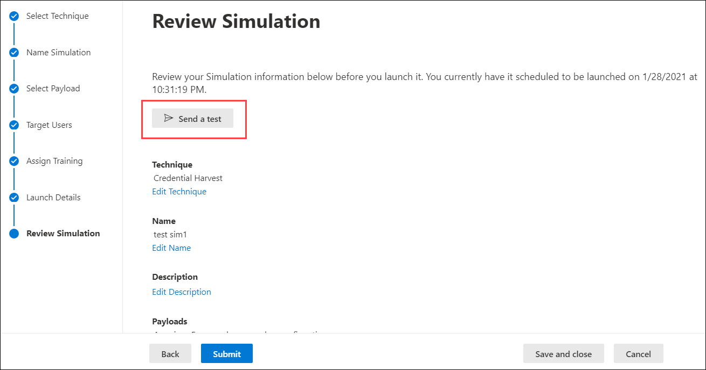

# Aandachtspunten voor implementatie van training voor aanvallen en veelgestelde vragen

Training voor de aanvalstraining is [nu algemeen beschikbaar.](https://techcommunity.microsoft.com/t5/microsoft-security-and/attack-simulation-training-in-microsoft-defender-for-office-365/ba-p/2037291) Met de training voor de aanval van een aanval kunnen organisaties met Microsoft 365 E5 of Microsoft Defender voor Office 365 Plan 2 social engineering-risico's meten en beheren door het maken en beheren van phishing-e-mails mogelijk te maken die mogelijk worden gemaakt door echte, ontsmette phishing-nettoladingen. Hypergerichte training, geleverd in samenwerking metNovanova-beveiliging, helpt de kennis te verbeteren en het gedrag van werknemers te wijzigen.

Zie Aan de slag met de trainingstraining voor de aanvalstraining voor de samensing van [aanvallen voor meer informatie.](attack-simulation-training-get-started.md)

Hoewel de hele creatie en planning van de gehele creatie- en planningservaring is ontworpen om zonder stroom en frictie te kunnen werken, moet u meestal alles plannen om de resultaten op een ondernemingsschaal uit te kunnen brengen. Dit artikel helpt om specifieke uitdagingen op te lossen die onze klanten zien wanneer ze hun eigen omgevingen gebruiken.

## Problemen met ervaringen van eindgebruikers

### Phishing-URL's van phishing geblokkeerd door Safe Browsing van Google

Een URL-reputatieservice kan een of meer URL's identificeren die worden gebruikt door de training voor de aanvalstraining als onveilig. Safe Browsing van Google in Google Chrome blokkeert sommige van de gesimuleerde phishing-URL's met een **misleidend bericht van de site.** Hoewel we met veel leveranciers van URL-reputatie werken om altijd onze url's voor de samenslulatie toe te staan, hebben we niet altijd volledige dekking.

Houd er rekening mee dat dit probleem niet van invloed is op Microsoft Edge.

Controleer als onderdeel van de planningsfase de beschikbaarheid van de URL in de ondersteunde webbrowsers voordat u de URL gebruikt in een phishing-campagne. Als de URL's worden geblokkeerd door Google Safe [Browsing,](https://support.google.com/chrome/a/answer/7532419) volgt u deze richtlijnen van Google voor het toestaan van toegang tot de URL's.

Raadpleeg [Aan de slag met de trainingstraining voor](attack-simulation-training-get-started.md) de aanvalsconsulatie voor de lijst met URL's die momenteel worden gebruikt door de trainingstraining voor de aanvalstraining.

### Phishing-phishing- en beheerders-URL's geblokkeerd door netwerkproxyoplossingen en filtert stuurprogramma's

Zowel phishing-URL's van phishing als beheerders-URL's kunnen worden geblokkeerd of afgekapt door uw tussenliggende beveiligingsapparaten of filters. Bijvoorbeeld:

- Firewalls
- WAF-oplossingen (Web Application Firewall)
- Filtert stuurprogramma's van derden (bijvoorbeeld kernelmodusfilters)

We hebben gezien dat er weinig klanten worden geblokkeerd op deze laag, maar het gebeurt wel. Als u problemen ondervindt, kunt u de volgende URL's configureren om scannen met uw beveiligingsapparaten of filters te omzeilen, zoals vereist:

- De gesimuleerde phishing-URL's zoals wordt beschreven in [Aan de slag met de training voor de aanvalsaanvallen.](attack-simulation-training-get-started.md)
- <https://security.microsoft.com/attacksimulator>
- <https://security.microsoft.com/attacksimulationreport>
- <https://security.microsoft.com/trainingassignments>

### Berichten met berichten die niet worden bezorgd bij alle specifieke gebruikers

Het is mogelijk dat het aantal gebruikers dat daadwerkelijk de e-mailberichten die worden verzonden, feitelijk is beperkt tot het aantal gebruikers dat het doel van de gebruikers is. De volgende typen gebruikers worden uitgesloten als onderdeel van doelvalidatie:

- Ongeldige e-mailadressen van geadresseerden.
- Gastgebruikers.
- Gebruikers die niet meer actief zijn in Azure Active Directory (Azure AD).

Alleen geldige, niet-gastgebruikers met een geldig postvak worden opgenomen in de validaties. Als u distributiegroepen of beveiligingsgroepen met e-mail gebruikt om gebruikers af te sturen, kunt u de cmdlet [Get-DistributionGroupMember](https://docs.microsoft.com/powershell/module/exchange/get-distributiongroupmember) in [Exchange Online PowerShell](https://docs.microsoft.com/powershell/exchange/connect-to-exchange-online-powershell) gebruiken om leden van distributiegroepen weer te geven en te valideren.

## Problemen met rapportage van de aanvalstrainingstraining

### Trainingsrapporten van de aanvalstrainingen bevatten geen details over activiteiten

Training voor de aanval van een aanval wordt geleverd met uitgebreide, actievolle inzichten die u op de hoogte houden van de voortgang van risico's van uw werknemers. Als de trainingsrapporten van de aanvalsfunctie niet worden gevuld met gegevens, moet u controleren of zoeken in het auditlogboek is ingeschakeld in uw organisatie (deze is standaard ingeschakeld).

Zoeken in het auditlogboek is vereist voor de training voor de aanvalsfunctie zodat gebeurtenissen kunnen worden vastgelegd, opgenomen en teruggelezen. Het uitschakelen van zoekopdrachten in het auditlogboek heeft de volgende gevolgen voor de training voor de attack-training:

- Rapportagegegevens zijn niet in alle rapporten beschikbaar. De rapporten worden leeg weergegeven.
- Trainingstoewijzingen zijn geblokkeerd omdat er geen gegevens beschikbaar zijn.

Zie Zoeken in auditlogboek in- of uitschakelen als u zoeken in het [auditlogboek wilt in- of uitschakelen.](../../compliance/turn-audit-log-search-on-or-off.md)

> [!NOTE]
> Lege activiteitsgegevens kunnen ook worden veroorzaakt doordat er geen E5-licenties zijn toegewezen aan gebruikers. Controleer of er ten minste één E5-licentie is toegewezen aan een actieve gebruiker om er zeker van te zijn dat rapportagegebeurtenissen worden vastgelegd en vastgelegd.

### Rapporten met rapporten die worden bijgewerkt, worden niet onmiddellijk bijgewerkt

Gedetailleerde rapporten over de rapporten over de analyse worden niet direct na het starten van een campagne bijgewerkt. Maakt u zich geen zorgen; dit gedrag is verwacht.

Elke campagne voor de campagne heeft een levenscyclus. Wanneer de planning voor het eerst wordt gemaakt, heeft de planning **de status Gepland.** Wanneer deulatie wordt gestart, wordt de overgang uitgevoerd **naar de status Wordt** uitgevoerd. Wanneer u klaar is, wordt de overgang van de overgang naar de **status Voltooid** uitgevoerd.

Terwijl eenulatie in de **geplande staat** is, zijn de rapporten van de rapporten over de rapporten grotendeels leeg. Tijdens deze fase wordt met de engine voor de zoekmachine de e-mailadressen van de doelgebruikers opgelost, distributiegroepen uitgebreid, gastgebruikers uit de lijst verwijderd enzovoort:

Zodra de computer in het **stadium Wordt** uitgevoerd, ziet u dat de informatie in de rapportage begint te overslinken:

Het kan tot 30 minuten duren voordat de afzonderlijke rapporten over de voortgangsrapporten zijn bijgewerkt na de overgang naar **de status Wordt** uitgevoerd. De rapportgegevens worden verder opgebouwd totdat deulatie de status **Voltooid** heeft bereikt. Updates voor rapporten vinden plaats met de volgende intervallen:

- Elke 10 minuten voor de eerste 60 minuten.
- Elke 15 minuten na 60 minuten tot 2 dagen.
- Elke 30 minuten na 2 dagen tot 7 dagen.
- Elke 60 minuten na zeven dagen.

Widgets op de **pagina Overzicht** bieden een korte momentopname van de op de tijd gebaseerde beveiligingssypiek van uw organisatie op basis van de momentopname. Omdat deze widgets een weerspiegeling zijn van uw algehele beveiligingsovergenomenheid en een lange reis, worden ze bijgewerkt nadat elke campagne is voltooid.

> [!NOTE]
> U kunt de optie **Exporteren op de** verschillende rapportagepagina's gebruiken om gegevens op te halen.

### Berichten die door gebruikers als phishing zijn gerapporteerd, worden niet weergegeven in rapporten over rapporten met rapporten over

Rapporten met rapporten over de aanvallen van de simulator geven details over gebruikersactiviteiten. Bijvoorbeeld:

- Gebruikers die op de koppeling in het bericht hebben geklikt.
- Gebruikers die hun referenties hebben gegeven.
- Gebruikers die het bericht als phishing hebben gerapporteerd.

Als berichten die door gebruikers als phishing zijn gerapporteerd, niet worden vastgelegd in de rapporten van de oefentraining voor aanvallen, is er mogelijk een Exchange-regel voor de e-mailstroom (ook wel transportregel genoemd) die de bezorging van de gerapporteerde berichten naar Microsoft blokkeert. Controleer of de bezorging van de volgende e-mailadressen niet wordt geblokkeerd door regels voor de e-mailstroom:

- junk@office365.microsoft.com
- abuse@messaging.microsoft.com
- phish@office365.microsoft.com
- not \_ junk@office365.microsoft.com

## Andere veelgestelde vragen

### V: Wat is de aanbevolen methode om gebruikers af te leiden voor campagnes?

A: Er zijn verschillende opties beschikbaar voor doelgebruikers:

- Neem alle gebruikers op (momenteel beschikbaar voor organisaties met minder dan 40.000 gebruikers).
- Kies specifieke gebruikers.
- Selecteer gebruikers in een CSV-bestand.
- Doelgroepen op basis van Azure AD-groep.

We hebben ontdekt dat campagnes waarbij de gerichte gebruikers worden geïdentificeerd door Azure AD-groepen, over het algemeen gemakkelijker te beheren zijn.

### V: Gelden er limieten voor het richten van gebruikers bij het importeren uit een CSV-bestand of het toevoegen van gebruikers?

A: De limiet voor het importeren van geadresseerden uit een CSV-bestand of het toevoegen van afzonderlijke geadresseerden aan eenulatie is 40.000.

Een geadresseerde kan een individuele gebruiker of een groep zijn. Een groep kan honderden of duizenden geadresseerden bevatten, waardoor er geen werkelijke limiet wordt geplaatst voor het aantal afzonderlijke gebruikers.

Het beheren van een groot CSV-bestand of het toevoegen van veel afzonderlijke geadresseerden kan lastig zijn. Het gebruik van Azure AD-groepen vereenvoudigt het algehele beheer van de resultaten.

### V: Levert Microsoft nettolading in andere talen?

A: Er zijn momenteel 5 gelokaliseerde nettolading beschikbaar. We hebben gezien dat directe of machine vertalingen van bestaande nettoladingen naar andere talen leiden tot onnauwkeurigheden en verminderde relevantie.

Als dat wordt gezegd, kunt u uw eigen nettolading maken in de taal van uw keuze met behulp van de aangepaste nettolading. We raden u ook ten zeerste aan om bestaande nettoladingen te gebruiken die zijn gebruikt om gebruikers in een bepaalde geografie te richten. Met andere woorden, laat de aanvallers de inhoud voor u lokaliseren.

### V: Hoe kan ik overschakelen naar andere talen voor mijn beheerportal en trainingservaring?

A: In Microsoft 365 of Office 365 is taalconfiguratie specifiek en gecentraliseerd voor elk gebruikersaccount. Zie De weergavetaal en tijdzone [wijzigen in Microsoft 365 voor Bedrijven](https://support.microsoft.com/office/6f238bff-5252-441e-b32b-655d5d85d15b)voor instructies over het wijzigen van uw taalinstelling.

Houd er rekening mee dat het synchroniseren van de configuratie tot 30 minuten kan duren voor alle services zijn gesynchroniseerd.

### V: Kan ik een testveroulatie activeren om te begrijpen hoe deze eruitziet voordat een volledige campagne wordt gestart?

A: Ja, dat is mogelijk. Op de laatste **pagina Van** de revisie van de wizard om een nieuwe activering te maken, is er een optie om een test **te verzenden.** Met deze optie wordt een voorbeeld van een phishingbericht naar de aangemelde gebruiker gestuurd. Nadat u het phishingbericht in uw Postvak IN hebt gevalideerd, kunt u de validatie indienen.

### V: Kan ik gebruikers die tot een andere tenant behoren, richten als onderdeel van dezelfde campagne voor de campagne?

A: Nee. Op dit moment worden er geen tenants voor andere tenants ondersteund. Controleer of al uw beoogde gebruikers zich in dezelfde tenant hebben. Alle gebruikers op verschillende tenants of gastgebruikers worden uitgesloten van de campagne voor de campagne die wordt uitgevoerd.

### V: Hoe werkt bezorging op regio al?

A: Bezorging op regio's maakt gebruik van het kenmerk TimeZone van het postvak van de doelgebruiker en 'not before' om te bepalen wanneer het bericht moet worden bezorgd. Kijk bijvoorbeeld eens naar het volgende scenario:

- Om 07:00 uur in de tijdzone Stille Oceaan (UTC-8) maakt en plant een beheerder een campagne die op dezelfde dag om 9:00 begint.
- UserA bevindt zich in de Eastern Time Zone (UTC-5).
- UserB bevindt zich ook in de stille tijdzone.

Om 9:00 uur op dezelfde dag wordt het bericht van de melding verzonden naar GebruikerB. Bij bezorging in de regio wordt het bericht niet op dezelfde dag naar UserA verzonden, omdat 09:00 uur Midden-tijd 12:00 uur Oost-tijd is. In plaats daarvan wordt het bericht op de volgende dag om 9:00 uur van 09:00 uur verzonden naar UserA.

Dus bij de eerste run van een campagne met 'regiospecifieke bezorging' ingeschakeld, kan het lijken dat het bericht alleen naar gebruikers in een bepaalde tijdzone is verzonden. Maar naarmate er meer gebruikers in het bereik komen, nemen de gerichte gebruikers toe.
