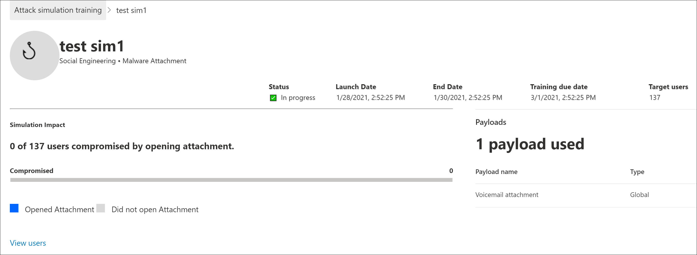

# Aandachtspunten voor implementatie van training voor aanvallen en veelgestelde vragenAttack simulation training deployment considerations and FAQ

Training voor de aanvalstraining is [nu algemeen beschikbaar.](https://techcommunity.microsoft.com/t5/microsoft-security-and/attack-simulation-training-in-microsoft-defender-for-office-365/ba-p/2037291)Attack simulation training is now [generally available](https://techcommunity.microsoft.com/t5/microsoft-security-and/attack-simulation-training-in-microsoft-defender-for-office-365/ba-p/2037291). Met de training voor de aanval van een aanval kunnen organisaties met Microsoft 365 E5 of Microsoft Defender voor Office 365 Plan 2 social engineering-risico's meten en beheren door het maken en beheren van phishing-e-mails mogelijk te maken die mogelijk worden gemaakt door echte, ontsmette phishing-nettoladingen.Attack simulation training enables Microsoft 365 E5 or Microsoft Defender for Office 365 Plan 2 organizations to measure and manage social engineering risk by allowing the creation and management of phishing simulations that are powered by real-world, de-weaponized phishing payloads. Hypergerichte training, geleverd in samenwerking metNovanova-beveiliging, helpt de kennis te verbeteren en het gedrag van werknemers te wijzigen.Hyper-targeted training, delivered in partnership with Terranova security, helps improve knowledge and change employee behavior.

Zie Aan de slag met de trainingstraining voor de aanvalstraining voor de samensing van [aanvallen voor meer informatie.](attack-simulation-training-get-started.md)For more information about getting started with Attack simulation training, see [Get started using Attack simulation training](attack-simulation-training-get-started.md).

Hoewel de hele creatie en planning van de gehele creatie- en planningservaring is ontworpen om zonder stroom en frictie te kunnen werken, moet u meestal alles plannen om de resultaten op een ondernemingsschaal uit te kunnen brengen.While the whole simulation creation and scheduling experience has been designed to be free-flowing and frictionless, running simulations at an enterprise scale often requires planning. Dit artikel helpt om specifieke uitdagingen op te lossen die onze klanten zien wanneer ze hun eigen omgevingen gebruiken.This article helps address specific challenges that we see as our customers run simulations in their own environments.

## Problemen met ervaringen van eindgebruikersIssues with end user experiences

### Phishing-URL's van phishing geblokkeerd door Safe Browsing van GooglePhishing simulation URLs blocked by Google Safe Browsing

Een URL-reputatieservice kan een of meer URL's identificeren die worden gebruikt door de training voor de aanvalstraining als onveilig.A URL reputation service might identify one or more of the URLs that are used by Attack simulation training as unsafe. Safe Browsing van Google in Google Chrome blokkeert sommige van de gesimuleerde phishing-URL's met een **misleidend bericht van de site.**Google Safe Browsing in Google Chrome blocks some of the simulated phishing URLs with a **Deceptive site ahead** message. Hoewel we met veel leveranciers van URL-reputatie werken om altijd onze url's voor de samenslulatie toe te staan, hebben we niet altijd volledige dekking.While we work with many URL reputation vendors to always allow our simulation URLs, we don't always have full coverage.

Houd er rekening mee dat dit probleem niet van invloed is op Microsoft Edge.Note that this issue does not affect Microsoft Edge.

Controleer als onderdeel van de planningsfase de beschikbaarheid van de URL in de ondersteunde webbrowsers voordat u de URL gebruikt in een phishing-campagne.As part of the planning phase, be sure to check the availability of the URL in your supported web browsers before you use the URL in a phishing campaign. Als de URL's worden geblokkeerd door Google Safe [Browsing,](https://support.google.com/chrome/a/answer/7532419) volgt u deze richtlijnen van Google voor het toestaan van toegang tot de URL's.If the URLs are blocked by Google Safe Browsing, [follow this guidance](https://support.google.com/chrome/a/answer/7532419) from Google to allow access to the URLs.

Raadpleeg [Aan de slag met de trainingstraining voor](attack-simulation-training-get-started.md) de aanvalsconsulatie voor de lijst met URL's die momenteel worden gebruikt door de trainingstraining voor de aanvalstraining.Refer to [Get started using Attack simulation training](attack-simulation-training-get-started.md) for the list of URLs that are currently used by Attack simulation training.

### Phishing-phishing- en beheerders-URL's geblokkeerd door netwerkproxyoplossingen en filtert stuurprogramma'sPhishing simulation and admin URLs blocked by network proxy solutions and filter drivers

Zowel phishing-URL's van phishing als beheerders-URL's kunnen worden geblokkeerd of afgekapt door uw tussenliggende beveiligingsapparaten of filters.Both phishing simulation URLs and admin URLs might be blocked or dropped by your intermediate security devices or filters. Bijvoorbeeld:For example:

- FirewallsFirewalls
- WAF-oplossingen (Web Application Firewall)Web Application Firewall (WAF) solutions
- Filtert stuurprogramma's van derden (bijvoorbeeld kernelmodusfilters)Third-party filter drivers (for example, kernel mode filters)

We hebben gezien dat er weinig klanten worden geblokkeerd op deze laag, maar het gebeurt wel.While we have seen few customers being blocked at this layer, it does happen. Als u problemen ondervindt, kunt u de volgende URL's configureren om scannen met uw beveiligingsapparaten of filters te omzeilen, zoals vereist:If you encounter problems, consider configuring the following URLs to bypass scanning by your security devices or filters as required:

- De gesimuleerde phishing-URL's zoals wordt beschreven in [Aan de slag met de training voor de aanvalsaanvallen.](attack-simulation-training-get-started.md)The simulated phishing URLs as described in [Get started using Attack simulation training](attack-simulation-training-get-started.md).
- <https://security.microsoft.com/attacksimulator>
- <https://security.microsoft.com/attacksimulationreport>
- <https://security.microsoft.com/trainingassignments>

### Berichten met berichten die niet worden bezorgd bij alle specifieke gebruikersSimulation messages not delivered to all targeted users

Het is mogelijk dat het aantal gebruikers dat daadwerkelijk de e-mailberichten die worden verzonden, feitelijk is beperkt tot het aantal gebruikers dat het doel van de gebruikers is.It's possible that the number of users who actually receive the simulation email messages is less than the number of users who were targeted by the simulation. De volgende typen gebruikers worden uitgesloten als onderdeel van doelvalidatie:The following types of users will be excluded as part of target validation:

- Ongeldige e-mailadressen van geadresseerden.Invalid recipient email addresses.
- Gastgebruikers.Guest users.
- Gebruikers die niet meer actief zijn in Azure Active Directory (Azure AD).Users that are no longer active in Azure Active Directory (Azure AD).

Alleen geldige, niet-gastgebruikers met een geldig postvak worden opgenomen in de validaties.Only valid, non-guest users with a valid mailbox will be included in simulations. Als u distributiegroepen of beveiligingsgroepen met e-mail gebruikt om gebruikers af te sturen, kunt u de cmdlet [Get-DistributionGroupMember](https://docs.microsoft.com/powershell/module/exchange/get-distributiongroupmember) in [Exchange Online PowerShell](https://docs.microsoft.com/powershell/exchange/connect-to-exchange-online-powershell) gebruiken om leden van distributiegroepen weer te geven en te valideren.If you use distribution groups or mail-enabled security groups to target users, you can use the [Get-DistributionGroupMember](https://docs.microsoft.com/powershell/module/exchange/get-distributiongroupmember) cmdlet in [Exchange Online PowerShell](https://docs.microsoft.com/powershell/exchange/connect-to-exchange-online-powershell) to view and validate distribution group members.

## Problemen met rapportage van de aanvalstrainingstrainingIssues with Attack simulation training reporting

### Trainingsrapporten van de aanvalstrainingen bevatten geen details over activiteitenAttack simulation training reports do not contain any activity details

Training voor de aanval van een aanval wordt geleverd met uitgebreide, actievolle inzichten die u op de hoogte houden van de voortgang van risico's van uw werknemers.Attack simulation training comes with rich, actionable insights that keep you informed of the threat readiness progress of your employees. Als de trainingsrapporten van de aanvalsfunctie niet worden gevuld met gegevens, moet u controleren of zoeken in het auditlogboek is ingeschakeld in uw organisatie (deze is standaard ingeschakeld).If Attack simulation training reports are not populated with data, verify that audit log search is turned on in your organization (it's on by default).

Zoeken in het auditlogboek is vereist voor de training voor de aanvalsfunctie zodat gebeurtenissen kunnen worden vastgelegd, opgenomen en teruggelezen.Audit log search is required by Attack simulation training so events can be captured, recorded, and read back. Het uitschakelen van zoekopdrachten in het auditlogboek heeft de volgende gevolgen voor de training voor de attack-training:Turning off audit log search has the following consequences for Attack simulation training:

- Rapportagegegevens zijn niet in alle rapporten beschikbaar.Reporting data is not available across all reports. De rapporten worden leeg weergegeven.The reports will appear empty.
- Trainingstoewijzingen zijn geblokkeerd omdat er geen gegevens beschikbaar zijn.Training assignments are blocked, because data is not available.

Zie Zoeken in auditlogboek in- of uitschakelen als u zoeken in het [auditlogboek wilt in- of uitschakelen.](../../compliance/turn-audit-log-search-on-or-off.md)To turn on audit log search, see [Turn audit log search on or off](../../compliance/turn-audit-log-search-on-or-off.md).

> [!NOTE]
> Lege activiteitsgegevens kunnen ook worden veroorzaakt doordat er geen E5-licenties zijn toegewezen aan gebruikers.Empty activity details can also be caused by no E5 licenses being assigned to users. Controleer of er ten minste één E5-licentie is toegewezen aan een actieve gebruiker om er zeker van te zijn dat rapportagegebeurtenissen worden vastgelegd en vastgelegd.Verify at least one E5 license is assigned to an active user to ensure that reporting events are captured and recorded.

### Rapporten met rapporten die worden bijgewerkt, worden niet onmiddellijk bijgewerktSimulation reports are not updated immediately

Gedetailleerde rapporten over de rapporten over de analyse worden niet direct na het starten van een campagne bijgewerkt.Detailed simulation reports are not updated immediately after you launch a campaign. Maakt u zich geen zorgen; dit gedrag is verwacht.Don't worry; this behavior is expected.

Elke campagne voor de campagne heeft een levenscyclus.Every simulation campaign has a lifecycle. Wanneer de planning voor het eerst wordt gemaakt, heeft de planning **de status Gepland.**When first created, the simulation is in the **Scheduled** state. Wanneer deulatie wordt gestart, wordt de overgang uitgevoerd **naar de status Wordt** uitgevoerd.When the simulation starts, it transitions to the **In progress** state. Wanneer u klaar is, wordt de overgang van de overgang naar de **status Voltooid** uitgevoerd.When completed, the simulation transitions to the **Completed** state.

Terwijl eenulatie in de **geplande staat** is, zijn de rapporten van de rapporten over de rapporten grotendeels leeg.While a simulation is in the **Scheduled** state, the simulation reports will be mostly empty. Tijdens deze fase wordt met de engine voor de zoekmachine de e-mailadressen van de doelgebruikers opgelost, distributiegroepen uitgebreid, gastgebruikers uit de lijst verwijderd enzovoort:During this stage, the simulation engine is resolving the target user email addresses, expanding distribution groups, removing guest users from the list, etc.:

Zodra de computer in het **stadium Wordt** uitgevoerd, ziet u dat de informatie in de rapportage begint te overslinken:Once the simulation enters the **In progress** stage, you will notice information starting to trickle into the reporting:

Het kan tot 30 minuten duren voordat de afzonderlijke rapporten over de voortgangsrapporten zijn bijgewerkt na de overgang naar **de status Wordt** uitgevoerd.It can take up to 30 minutes for the individual simulation reports to update after the transition to the **In progress** state. De rapportgegevens worden verder opgebouwd totdat deulatie de status **Voltooid** heeft bereikt.The report data continues to build until the simulation reaches the **Completed** state. Updates voor rapporten vinden plaats met de volgende intervallen:Reporting updates occur at the following intervals:

- Elke 10 minuten voor de eerste 60 minuten.Every 10 minutes for the first 60 minutes.
- Elke 15 minuten na 60 minuten tot 2 dagen.Every 15 minutes after 60 minutes until 2 days.
- Elke 30 minuten na 2 dagen tot 7 dagen.Every 30 minutes after 2 days until 7 days.
- Elke 60 minuten na zeven dagen.Every 60 minutes after 7 days.

Widgets op de **pagina Overzicht** bieden een korte momentopname van de op de tijd gebaseerde beveiligingssypiek van uw organisatie op basis van de momentopname.Widgets on the **Overview** page provide a quick snapshot of your organization's simulation-based security posture over time. Omdat deze widgets een weerspiegeling zijn van uw algehele beveiligingsovergenomenheid en een lange reis, worden ze bijgewerkt nadat elke campagne is voltooid.Because these widgets reflect your overall security posture and journey over time, they're updated after each simulation campaign is completed.

> [!NOTE]
> U kunt de optie **Exporteren op de** verschillende rapportagepagina's gebruiken om gegevens op te halen.You can use the **Export** option on the various reporting pages to extract data.

### Berichten die door gebruikers als phishing zijn gerapporteerd, worden niet weergegeven in rapporten over rapporten met rapporten overMessages reported as phishing by users aren't appearing in simulation reports

Rapporten met rapporten over de aanvallen van de simulator geven details over gebruikersactiviteiten.Simulation reports in Attack simulator training provide details on user activity. Bijvoorbeeld:For example:

- Gebruikers die op de koppeling in het bericht hebben geklikt.Users who clicked on the link in the message.
- Gebruikers die hun referenties hebben gegeven.Users who gave up their credentials.
- Gebruikers die het bericht als phishing hebben gerapporteerd.Users who reported the message as phishing.

Als berichten die door gebruikers als phishing zijn gerapporteerd, niet worden vastgelegd in de rapporten van de oefentraining voor aanvallen, is er mogelijk een Exchange-regel voor de e-mailstroom (ook wel transportregel genoemd) die de bezorging van de gerapporteerde berichten naar Microsoft blokkeert.If messages that users reported as phishing aren't captured in Attack simulation training simulation reports, there might be an Exchange mail flow rule (also known as a transport rule) that's blocking the delivery of the reported messages to Microsoft. Controleer of de bezorging van de volgende e-mailadressen niet wordt geblokkeerd door regels voor de e-mailstroom:Verify that any mail flow rules aren't blocking delivery to the following email addresses:

- junk@office365.microsoft.comjunk@office365.microsoft.com
- abuse@messaging.microsoft.comabuse@messaging.microsoft.com
- phish@office365.microsoft.comphish@office365.microsoft.com
- not \_ junk@office365.microsoft.comnot\_junk@office365.microsoft.com

## Andere veelgestelde vragenOther frequently asked questions

### V: Wat is de aanbevolen methode om gebruikers af te leiden voor campagnes?Q: What is the recommended method to target users for simulation campaigns?

A: Er zijn verschillende opties beschikbaar voor doelgebruikers:A: Several options are available to target users:

- Neem alle gebruikers op (momenteel beschikbaar voor organisaties met minder dan 40.000 gebruikers).Include all users (currently available to organizations with less than 40,000 users).
- Kies specifieke gebruikers.Choose specific users.
- Selecteer gebruikers in een CSV-bestand.Select users from a CSV file.
- Doelgroepen op basis van Azure AD-groep.Azure AD group-based targeting.

We hebben ontdekt dat campagnes waarbij de gerichte gebruikers worden geïdentificeerd door Azure AD-groepen, over het algemeen gemakkelijker te beheren zijn.We've found that campaigns where the targeted users are identified by Azure AD groups are generally easier to manage.

### V: Gelden er limieten voor het richten van gebruikers bij het importeren uit een CSV-bestand of het toevoegen van gebruikers?Q: Are there any limits in targeting users while importing from a CSV or adding users?

A: De limiet voor het importeren van geadresseerden uit een CSV-bestand of het toevoegen van afzonderlijke geadresseerden aan eenulatie is 40.000.A: The limit for importing recipients from a CSV file or adding individual recipients to a simulation is 40,000.

Een geadresseerde kan een individuele gebruiker of een groep zijn.A recipient can be an individual user or a group. Een groep kan honderden of duizenden geadresseerden bevatten, waardoor er geen werkelijke limiet wordt geplaatst voor het aantal afzonderlijke gebruikers.A group might contain hundreds or thousands of recipients, so an actual limit isn't placed on the number of individual users.

Het beheren van een groot CSV-bestand of het toevoegen van veel afzonderlijke geadresseerden kan lastig zijn.Managing a large CSV file or adding many individual recipients can be cumbersome. Het gebruik van Azure AD-groepen vereenvoudigt het algehele beheer van de resultaten.Using Azure AD groups will simplify the overall management of the simulation.

### V: Levert Microsoft nettolading in andere talen?Q: Does Microsoft provide payloads in other languages?

A: Er zijn momenteel 5 gelokaliseerde nettolading beschikbaar.A: Currently, there are 5 localized payloads available. We hebben gezien dat directe of machine vertalingen van bestaande nettoladingen naar andere talen leiden tot onnauwkeurigheden en verminderde relevantie.We've noticed than any direct or machine translations of existing payloads to other languages will lead to inaccuracies and decreased relevance.

Als dat wordt gezegd, kunt u uw eigen nettolading maken in de taal van uw keuze met behulp van de aangepaste nettolading.That being said, you can create your own payload in the language of your choice using the custom payload authoring experience. We raden u ook ten zeerste aan om bestaande nettoladingen te gebruiken die zijn gebruikt om gebruikers in een bepaalde geografie te richten.We also strongly recommend that you harvest existing payloads that were used to target users in a specific geography. Met andere woorden, laat de aanvallers de inhoud voor u lokaliseren.In other words, let the attackers localize the content for you.

### V: Hoe kan ik overschakelen naar andere talen voor mijn beheerportal en trainingservaring?Q: How can I switch to other languages for my admin portal and training experience?

A: In Microsoft 365 of Office 365 is taalconfiguratie specifiek en gecentraliseerd voor elk gebruikersaccount.A: In Microsoft 365 or Office 365, language configuration is specific and centralized for each user account. Zie De weergavetaal en tijdzone [wijzigen in Microsoft 365 voor Bedrijven](https://support.microsoft.com/office/6f238bff-5252-441e-b32b-655d5d85d15b)voor instructies over het wijzigen van uw taalinstelling.For instructions on how to change your language setting, see [Change your display language and time zone in Microsoft 365 for Business](https://support.microsoft.com/office/6f238bff-5252-441e-b32b-655d5d85d15b).

Houd er rekening mee dat het synchroniseren van de configuratie tot 30 minuten kan duren voor alle services zijn gesynchroniseerd.Note that the configuration change might take up to 30 minutes to synchronize across all services.

### V: Kan ik een testveroulatie activeren om te begrijpen hoe deze eruitziet voordat een volledige campagne wordt gestart?Q: Can I trigger a test simulation to understand what it looks like prior to launching a full-fledged campaign?

A: Ja, dat is mogelijk.A: Yes you can! Op de laatste **pagina Van** de revisie van de wizard om een nieuwe activering te maken, is er een optie om een test **te verzenden.**On the very last **Review Simulation** page in the wizard to create a new simulation, there's an option to **Send a test**. Met deze optie wordt een voorbeeld van een phishingbericht naar de aangemelde gebruiker gestuurd.This option will send a sample phishing simulation message to the currently logged in user. Nadat u het phishingbericht in uw Postvak IN hebt gevalideerd, kunt u de validatie indienen.After you validate the phishing message in your Inbox, you can submit the simulation.

### V: Kan ik gebruikers die tot een andere tenant behoren, richten als onderdeel van dezelfde campagne voor de campagne?Q: Can I target users that belong to a different tenant as part of the same simulation campaign?

A: Nee.A: No. Op dit moment worden er geen tenants voor andere tenants ondersteund.Currently, cross-tenant simulations are not supported. Controleer of al uw beoogde gebruikers zich in dezelfde tenant hebben.Verify that all of your targeted users are in the same tenant. Alle gebruikers op verschillende tenants of gastgebruikers worden uitgesloten van de campagne voor de campagne die wordt uitgevoerd.Any cross-tenant users or guest users will be excluded from the simulation campaign.

### V: Hoe werkt bezorging op regio al?Q: How does region aware delivery work?

A: Bezorging op regio's maakt gebruik van het kenmerk TimeZone van het postvak van de doelgebruiker en 'not before' om te bepalen wanneer het bericht moet worden bezorgd.A: Region aware delivery uses the TimeZone attribute of the targeted user's mailbox and 'not before' logic to determine when to deliver the message. Kijk bijvoorbeeld eens naar het volgende scenario:For example, consider the following scenario:

- Om 07:00 uur in de tijdzone Stille Oceaan (UTC-8) maakt en plant een beheerder een campagne die op dezelfde dag om 9:00 begint.At 7:00 AM in the Pacific time zone (UTC-8), an admin creates and schedules a campaign to start at 9:00 AM on the same day.
- UserA bevindt zich in de Eastern Time Zone (UTC-5).UserA is in the Eastern time zone (UTC-5).
- UserB bevindt zich ook in de stille tijdzone.UserB is also in the Pacific time zone.

Om 9:00 uur op dezelfde dag wordt het bericht van de melding verzonden naar GebruikerB.At 9:00 AM on the same day, the simulation message is sent to UserB. Bij bezorging in de regio wordt het bericht niet op dezelfde dag naar UserA verzonden, omdat 09:00 uur Midden-tijd 12:00 uur Oost-tijd is.With region-aware delivery, the message is not sent to UserA on the same day, because 9:00 AM Pacific time is 12:00 PM Eastern time. In plaats daarvan wordt het bericht op de volgende dag om 9:00 uur van 09:00 uur verzonden naar UserA.Instead, the message is sent to UserA at 9:00 AM Eastern time on the following day.

Dus bij de eerste run van een campagne met 'regiospecifieke bezorging' ingeschakeld, kan het lijken dat het bericht alleen naar gebruikers in een bepaalde tijdzone is verzonden.So, on the initial run of a campaign with region aware delivery enabled, it might appear that the simulation message was sent only to users in a specific time zone. Maar naarmate er meer gebruikers in het bereik komen, nemen de gerichte gebruikers toe.But, as time passes and more users come into scope, the targeted users will increase.
