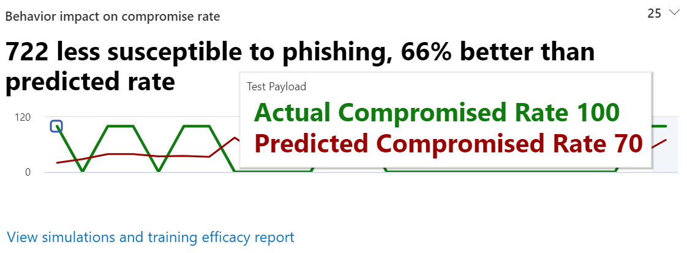

# Meer inzicht krijgen middels aanvalssimulatietrainingGain insights through Attack simulation training

Binnen de training voor de aanvals-training voor de overdenken biedt Microsoft u inzichten op basis van resultaten van de trainingsresultaten en trainingen die werknemers hebben door onderuit gehad.Within Attack simulation training, Microsoft provides you with insights based on outcomes of simulations and trainings that employees went through. Deze inzichten helpen u op de hoogte te blijven van de voortgang van risico's van uw werknemers en bevelen u aan om uw werknemers en uw omgeving beter voor te bereiden op aanvallen.These insights will help keep you informed on the threat readiness progress of your employees, as well as recommend next steps to better prepare your employees and your environment for attacks.

We werken voortdurend aan het uitbreiden van de inzichten die voor u beschikbaar zijn.We are continuously working on expanding the insights that are available to you. De invloed van het gedrag en de aanbevolen acties zijn momenteel beschikbaar.Behavior impact and recommended actions are currently available. Om te beginnen gaat u naar [de training voor de aanvalstraining in het Microsoft 365-beveiligingscentrum.](https://security.microsoft.com/attacksimulator?viewid=overview)To start, head over to [Attack simulation training in the Microsoft 365 security center](https://security.microsoft.com/attacksimulator?viewid=overview).

## Gedrag van invloed op de snelheid van compromisesBehavior impact on compromise rate

Op het **tabblad Overzicht** van de training voor de aanvallen van de aanval vindt u de invloed van het gedrag op de **compromise rate** card.On the **Overview** tab of Attack simulation training, you'll find the **behavior impact on compromise rate** card. Op deze kaart ziet u hoe werknemers de voorspellingen afwerkten die u hebt uitgevoerd in tegenstelling tot de **voorspelde compromissen.**This card shows how employees dealt with the simulations you ran in contrast to the **predicted compromise rate**. U kunt deze inzichten gebruiken om de voortgang bij te houden in de gereedheid van werknemers door meerdere resultaten te boeken ten opzichte van dezelfde groepen werknemers.You can use these insights to track progress in employees threat readiness by running multiple simulations against the same groups of employees.

In de grafiek ziet u:In the graph you can see:

- **Een voorspelde compromissnelheid** die de gemiddelde compromise rate voor voorspellingen weerspiegelt door hetzelfde type nettolading te gebruiken in andere Microsoft 365-tenants die gebruikmaken van training voor de aanvalstraining.**Predicted compromise rate** which reflects the average compromise rate for simulations using the same type of payload across other Microsoft 365 tenants that use Attack simulation training.
- **De werkelijke compromise rate** weerspiegelt het percentage werknemers dat voor de weerspiegeling is.**Actual compromise rate** reflects the percentage of employees that fell for the simulation.

Weerspiegelt bovendien het verschil tussen het werkelijke aantal werknemers dat is gecompromitteerd door de `<number> less susceptible to phishing` aanval en de voorspelde compromise rate.Additionally, `<number> less susceptible to phishing` reflects the difference between actual number of employees compromised by the attack and the predicted compromise rate. Dit aantal werknemers zal in de toekomst minder snel worden gehackt door soortgelijke aanvallen, terwijl dit geeft aan hoe werknemers het over het algemeen hebben gedaan in tegenstelling tot `<percent%> better than predicted rate` het voorspelde gekromde percentage.This number of employees is less likely to be compromised by similar attacks in the future, while `<percent%> better than predicted rate` indicates how employees did overall in contrast with the predicted compromise rate.

> [!div class="mx-imgBorder"]
> 

Als u een gedetailleerder rapport wilt bekijken, klikt u op **Resultaten van het trainingsrapport.**To see a more detailed report, click **View simulations and training efficacy report**. Dit rapport biedt dezelfde informatie met aanvullende context van de zelfreulatie (bijvoorbeeld een methode voor de techniek van de techniek voor de techniek van de techniek en het totale aantal gebruikers dat is gericht).This report provides the same information with additional context from the simulation itself (for example, simulation technique and total users targeted).

## Aanbevolen actiesRecommended actions

Als u [ **op het tabblad Animaties**](https://security.microsoft.com/attacksimulator?viewid=simulations)een weergave selecteert, gaat u naar de details van de animatie, waar u de sectie **Aanbevolen acties vindt.**On the [**Simulations** tab](https://security.microsoft.com/attacksimulator?viewid=simulations), selecting a simulation will take you to the simulation details, where you'll find the **Recommended actions** section.

In de sectie Aanbevolen acties worden aanbevelingen be gegeven die beschikbaar zijn in [Microsoft Secure Score.](../mtp/microsoft-secure-score.md)The recommended actions section details recommendations as available in [Microsoft Secure Score](../mtp/microsoft-secure-score.md). Deze aanbevelingen zijn gebaseerd op de nettolading die wordt gebruikt in deulatie en helpt u uw werknemers en uw omgeving te beschermen.These recommendations are based on the payload used in the simulation, and will help you protect your employees and your environment. Als u op elke actie voor kwaliteitsverbetering klikt, gaat u naar de details.Clicking on each improvement action will take you to its details.

> [!div class="mx-imgBorder"]
> 

## Verwante koppelingenRelated Links

[Aan de slag met aanvalssimulatietrainingGet started using Attack simulation training](attack-simulation-training-get-started.md)

[Een phishing-aanval makenCreate a phishing attack simulation](attack-simulation-training.md)

[een nettolading maken om uw mensen te trainencreate a payload for training your people](attack-simulation-training-payloads.md)
