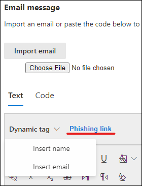
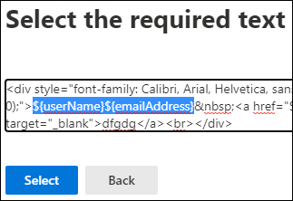

# Een aangepaste nettolading maken voor aanvalssimulatietraining

Microsoft biedt een robuuste nettolading-catalogus voor diverse social engineering-technieken voor het koppelen van uw aanvals training. U kunt echter wel aangepaste ladingen maken die beter voor uw organisatie kunnen worden gebruikt. In dit artikel wordt uitgelegd hoe u een nettolading maakt voor de training voor simulatie aanval in Microsoft Defender voor Office 365.

[!INCLUDE [Prerelease information](../includes/prerelease.md)]

U kunt een nettolading maken door te klikken op **een nettolading maken** op het [tabblad specifieke **nettoladingen**](https://security.microsoft.com/attacksimulator?viewid=payload) of in de [wizard simulatie maken](attack-simulation-training.md#selecting-a-payload).

In de eerste stap van de wizard selecteert u een type nettolading. **Momenteel is alleen e-mail beschikbaar**.

Selecteer vervolgens een gekoppelde methode. Zie voor meer informatie over technieken bij [het selecteren van een maatschappelijke techniek](attack-simulation-training.md#selecting-a-social-engineering-technique).

Geef in de volgende stap de naam uw nettolading. U kunt ook een beschrijving opgeven.

## Nettolading configureren

Nu is het tijd om uw nettolading aan te maken. Voer de naam en het e-mailadres van de afzender en het onderwerp van de e-mail in het gedeelte **Details van afzender** in. Selecteer een phishingwebsite in de opgegeven lijst. Deze URL wordt later ingesloten in de hoofdtekst van het bericht.

> [!TIP]
> U kunt een interne e-mail voor de afzender van uw nettolading kiezen, zodat de nettolading wordt weergegeven als de naam van een andere werknemer van het bedrijf. Hierdoor wordt de kans groter voor de nettolading en kunnen werknemers aan het risico van interne bedreigingen zorgen.

De RTF-editor is beschikbaar voor het maken van uw nettolading. U kunt ook een e-mailbericht importeren dat u vooraf hebt gemaakt. Wanneer u de hoofdtekst van het e-mailbericht maakt, profiteert u van de **dynamische Tags** om de e-mail te personaliseren met uw doelen. Klik op **phishing** om de eerder geselecteerde phishingwebsite toe te voegen aan de hoofdtekst van het bericht.

> [!TIP]
> Als u tijd wilt besparen, schakelt u de optie voor het **vervangen van alle koppelingen in het e-mailbericht met de phishingwebsite** in.

Wanneer u klaar bent met het maken van de nettolading, klikt u op **volgende**.

## Indicatoren toevoegen

Indicatoren stellen medewerkers in staat inzicht te krijgen in de aantasting van de aanval in toekomstige aanvallen. Als u wilt beginnen, klikt u op **indicator toevoegen**.

Selecteer een indicator die u wilt gebruiken in de vervolgkeuzelijst. Deze lijst is bedoeld voor de meest voorkomende aanwijzingen die worden weergegeven in malafide e-mailberichten. Als dit is geselecteerd, controleert u of de positie van de indicator is ingesteld op **in de hoofdtekst van het e-mailbericht** en klikt u op **tekst selecteren**. Markeer het gedeelte van uw nettolading waarbij deze indicator wordt weergegeven en klik op **selecteren**.

Voeg een aangepaste beschrijving toe om de indicator te beschrijven en klik in het frame met het voorbeeld van de indicator om een voorbeeld van de indicator te zien. Als u klaar bent, klikt u op **toevoegen**. Herhaal deze stappen totdat alle indicatoren in uw nettolading zijn besproken.

## Nettolading controleren

U bent klaar met het maken van uw nettolading. Nu is het tijd om de details te bekijken en een voorbeeld van uw nettolading te bekijken. Het voorbeeld bevat alle indicatoren die u hebt gemaakt. U kunt in deze stap elk deel van de nettolading bewerken. Als dit is voldaan, **verzendt** u uw nettolading.

> [!IMPORTANT]
> Nettoladingen die u hebt gemaakt, hebben de **Tenant** als de bron. Zorg er bij het selecteren van nettolading voor dat u de **Tenant** niet hoeft te filteren.
