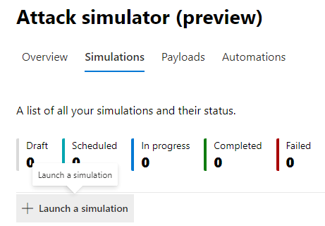
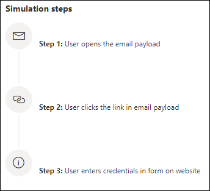
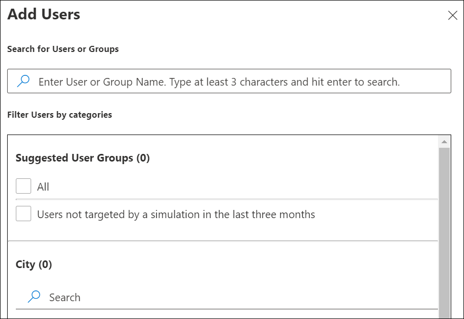

# Een phishing-aanval simuleren

Met de training voor de aanval van een aanval in Microsoft Defender voor Office 365 kunt u benigne cyberaanvallen op uw organisatie uitvoeren om uw beveiligingsbeleid en -procedures te testen en uw werknemers trainen om hen bewuster te maken en hun suscepterbaarheid voor aanvallen te verlagen. In dit artikel wordt u beschreven hoe u een gesimuleerde phishing-aanval kunt maken met behulp van de trainingstraining voor de aanvalstraining.

Zie Aan de slag met de trainingstraining voor de aanvalssyrulatie voor meer [informatie](attack-simulation-training-get-started.md)over de training voor de aanvalsinsulatie.

Als u een gesimuleerde phishing-aanval wilt starten, opent u het [Microsoft 365-beveiligingscentrum,](https://security.microsoft.com/)gaat u naar E-mail **& samenwerkingstraining** voor de aanval- of beveiligingstraining voor aanvallen en gaat u naar het tabblad \>  [**Animaties.**](https://security.microsoft.com/attacksimulator?viewid=simulations)

Selecteer **onder Lanceringen** de **optie + Start een lancering.**

> [!NOTE]
> U kunt op elk moment tijdens het maken van de creatie van de creatie opslaan en sluiten om de andersing op een later tijdstip te configureren.

## Een techniek voor sociaal netwerken selecteren

Selecteer uit vier verschillende technieken, geselecteerd op basis van de [MITRE ATT&CK® framework.](https://attack.mitre.org/techniques/enterprise/) Er zijn verschillende nettoladingen beschikbaar voor verschillende technieken:

- **Via referentiegegevens** wordt geprobeerd referenties te verzamelen door gebruikers naar een bekende website met invoervakken te halen om een gebruikersnaam en wachtwoord in te dienen.
- **Malwarebijlage** voegt een schadelijke bijlage toe aan een bericht. Wanneer de gebruiker de bijlage opent, wordt er willekeurige code uitgevoerd die de aanvaller kan helpen het apparaat van de doel binnen te halen.
- **Koppeling in bijlage** is een hybride type referentie voor hybride referenties. Een aanvaller voegt een URL toe aan een e-mailbijlage. De URL in de bijlage volgt dezelfde methode als referentiebouw.
- **Als u een koppeling** naar malware maakt, wordt er willekeurige code uitgevoerd van een bestand dat wordt gehost op een bekende service voor het delen van bestanden. Het bericht dat naar de gebruiker wordt verzonden, bevat een koppeling naar dit schadelijke bestand. Open het bestand en help de aanvaller het apparaat van het doel te ontgrendelen.
- **Met de URL** voor drive-by-code wordt de gebruiker door de schadelijke URL in het bericht naar een vertrouwde website gestuurd die op de muis wordt uitgevoerd en/of code op het apparaat van de gebruiker installeert.

> [!TIP]
> Als u op **Details weergeven in** de beschrijving van elke techniek klikt, worden meer informatie en de stappen voor de onderering van de techniek weergegeven.
>
> 

Nadat u de techniek hebt geselecteerd en op Volgende hebt **geklikt,** geeft u de vereenspeling een naam en desgewenst een beschrijving.

## Een nettolading selecteren

Vervolgens moet u een nettolading selecteren uit de bestaande nettoladingscatalogus.

Nettoladingen hebben een aantal gegevenspunten om u te helpen bij het kiezen:

- **Met de klikfrequentie** wordt geteld hoeveel personen op deze nettolading hebben geklikt.
- **Met een voorspelde** compromissnelheid wordt het percentage mensen voorspeld dat wordt gecompromitteerd door deze nettolading op basis van historische gegevens voor de nettolading van Microsoft Defender voor Office 365-klanten.
- **Met de bijen** die zijn gestart, wordt geteld hoe vaak deze nettolading is gebruikt in andere keer.
- **De complexiteit,** die beschikbaar is via **filters,** wordt berekend op basis van het aantal indicatoren in de nettolading die hints richt op het feit dat het een aanval wordt. Meer indicatoren leiden tot een lagere complexiteit.
- **Bron,** beschikbaar via **filters,** geeft aan of de nettolading is gemaakt in uw tenant of dat deze deel uitmaakt van de bestaande nettoladingscatalogus van Microsoft (global).

Selecteer een nettolading in de lijst om een voorbeeld van de nettolading te zien met aanvullende informatie.

Als u uw eigen nettolading wilt maken, lees dan een nettolading maken voor training [voor de aanvals-training.](attack-simulation-training-payloads.md)

## Doelgroepen

Nu is het tijd om het publiek van deze groep te selecteren. U kunt ervoor kiezen **om alle gebruikers in uw organisatie** op te nemen of alleen specifieke gebruikers en groepen op te **nemen.**

Wanneer u ervoor kiest om **alleen specifieke gebruikers en groepen op te** nemen, kunt u:

- Voeg gebruikers **toe,** zodat u gebruik kunt maken van de zoekfunctie van uw tenant, evenals geavanceerde zoek- en filtermogelijkheden, zoals gebruikers die in de afgelopen 3 maanden niet zijn gericht door eenulatie.
  
- **Door gegevens uit CSV-gegevens** te importeren, kunt u een vooraf gedefinieerde set gebruikers importeren voor deze vereenspeling.

## Training toewijzen

Het is raadzaam om training toe te wijzen voor elkeulatie, aangezien werknemers die de training volgen, minder gevoelig zijn voor soortgelijke aanvallen.

U kunt zelf trainingen aan u toegewezen krijgen of zelf cursussen en modules selecteren.

Selecteer de **einddatum van de** training om ervoor te zorgen dat werknemers hun training tijdig voltooien.

> [!NOTE]
> Als u zelf cursussen en modules selecteert, kunt u nog steeds de aanbevolen inhoud en alle beschikbare cursussen en modules zien.
>
> 

In de volgende stappen moet u **trainingen** toevoegen als u ervoor hebt gekozen om het zelf te selecteren en uw trainingslandingspagina aan te passen. U kunt een voorbeeld van de landingspagina van de training bekijken en de kop- en hoofdtekst ervan wijzigen.

## Details starten en controleren

Nu alles is geconfigureerd, kunt u deze automatisch starten of deze voor een latere datum plannen. U moet ook kiezen wanneer u deze vereenspeling wilt beëindigen. We stoppen met het vastleggen van de interactie met dezeulatie na de geselecteerde tijd.

**Schakel de bezorging van tijdzone** op regio's in om gesimuleerde aanvalsberichten aan uw werknemers te verzenden tijdens hun werkuren, afhankelijk van hun regio.

Wanneer u klaar bent, klikt u op **Volgende en** bekijkt u de details van de zelfedulatie. Klik op **Bewerken** op een van de onderdelen om terug te gaan en alle details te wijzigen die moeten worden gewijzigd. Klik op Verzenden als u klaar **bent.**
