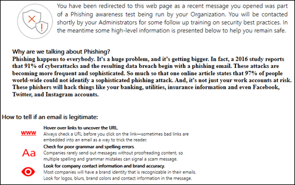

# Attack Simulator in Microsoft Defender voor Office 365

[!INCLUDE [Microsoft 365 Defender rebranding](../includes/microsoft-defender-for-office.md)]

**Van toepassing op** [Microsoft Defender voor Office 365-abonnement 2](https://go.microsoft.com/fwlink/?linkid=2148715)

Als uw organisatie beschikt over Microsoft Defender voor Office 365 Plan 2, dat functies voor bedreigingsonderzoek en antwoord [bevat,](office-365-ti.md)kunt u de Attack Simulator in het beveiligings- &-compliancecentrum gebruiken om realistische scenario's met aanvallen in uw organisatie uit te voeren. Deze gesimuleerde aanvallen kunnen u helpen om kwetsbaar gebruikers te identificeren en te vinden voordat een echte aanval uw bottom line beïnvloedt. Lees dit artikel voor meer informatie.

> [!NOTE]
> De ervaring met Attack Simulator v1 is overgeschakeld naar de alleen-lezen modus en vervangen door training voor de Attack simulator die wordt beschreven in Aan de slag met de trainingstraining voor de [aanvalstraining.](attack-simulation-training-get-started.md)
> De mogelijkheid om nieuwe validen vanaf deze site te starten is uitgeschakeld. Vanaf 24 januari 2021 hebt u echter nog steeds toegang tot rapporten voor worden uitgevoerd met een periode van 90 dagen.

## Wat moet u weten voordat u begint?

- Ga naar <https://protection.office.com/> om het Beveiligings- en compliancecentrum te openen. De attack simulator is beschikbaar op **Threat Management** \> **Attack simulator.** Ga rechtstreeks naar de attack simulator, open <https://protection.office.com/attacksimulator> .

- Zie de servicebeschrijving van Microsoft Defender voor Office 365 voor meer informatie over de beschikbaarheid van Attack Simulator in verschillende Microsoft [365-abonnementen.](https://docs.microsoft.com/office365/servicedescriptions/office-365-advanced-threat-protection-service-description)

- U moet lid zijn van de rollengroepen **Organisatiebeheer** of **Beveiligingsbeheerder.** Zie [Machtigingen in het beveiligings- en compliancecentrum](permissions-in-the-security-and-compliance-center.md) voor meer informatie over groepen in het Beveiligings- en compliancecentrum.

- Uw account moet worden geconfigureerd voor meervoudige verificatie (MFA) voor het maken en beheren van campagnes in Attack Simulator. Zie Meervoudige verificatie instellen voor [instructies.](https://docs.microsoft.com/microsoft-365/admin/security-and-compliance/set-up-multi-factor-authentication)

- Phishingcampagnes verzamelen en verwerken gebeurtenissen voor 30 dagen. Historische campagnegegevens zijn beschikbaar tot 90 dagen nadat u de campagne hebt gestart.

- Het analyseren van aanvallen en trainingsgerelateerde gegevens worden opgeslagen met andere klantgegevens voor Microsoft 365-services. Zie Microsoft [365-gegevenslocaties voor meer informatie.](/microsoft-365/enterprise/o365-data-locations)

- Er zijn geen bijbehorende PowerShell-cmdlets voor Attack Simulator.

## Phishingcampagnes

*Phishing* is een algemene term voor e-mailaanvallen die proberen gevoelige informatie te stelen in berichten die afkomstig lijken te zijn van legitieme of vertrouwde afzenders. *Phishing is* een gerichte phishing-aanval die gerichte en aangepaste inhoud gebruikt die specifiek is afgestemd op de specifieke ontvangers (meestal na een aanval op de ontvangers door de aanvaller).

In Attack Simulator zijn twee verschillende typen phishingcampagnes beschikbaar:

- **Phishing onder de aandacht brengen (referentiegegevens)**: de aanval probeert de ontvangers ervan te overtuigen op een URL in het bericht te klikken. Als de gebruiker op de koppeling klikt, wordt hem of haar gevraagd zijn of haar referenties in te voeren. Als ze dit doen, gaan ze naar een van de volgende locaties:

  - Een standaardpagina waarin wordt uitgelegd dat dit slechts een test was, en tips voor het herkennen van phishing-berichten.

    

  - Een aangepaste pagina (URL) die u opgeeft.

- **Phishing (bijlage)**- Bij de aanval wordt geprobeerd de ontvangers ervan te overtuigen een DOCX- of PDF-bijlage in het bericht te openen. De bijlage bevat dezelfde inhoud van de standaard phishing-koppeling, maar de eerste zin begint met " , u ziet dit bericht als een recent e-mailbericht dat u \<Display Name\> hebt geopend...".

> [!NOTE]
> Momenteel verlopen phishingcampagnes in Attack Simulator niet.

### Een phishingcampagne maken

Een belangrijk onderdeel van een phishingcampagne is het uiterlijk van het e-mailbericht dat naar de geadresseerden wordt verzonden. Als u het e-mailbericht wilt maken en configureren, hebt u de volgende opties:

- **Gebruik een ingebouwde e-mailsjabloon:** Er zijn twee ingebouwde sjablonen **beschikbaar:** Giveaway voor prijzen en **Salarisadministratie bijwerken.** U kunt nog enkele, alle of geen e-maileigenschappen van de sjabloon aanpassen wanneer u de campagne maakt en start.

- **Maak een herbruikbare e-mailsjabloon:** nadat u de e-mailsjabloon hebt gemaakt en opgeslagen, kunt u deze opnieuw gebruiken in toekomstige phishingcampagnes. U kunt nog enkele, alle of geen e-maileigenschappen van de sjabloon aanpassen wanneer u de campagne maakt en start.

- **Maak het e-mailbericht in de wizard:** u kunt het e-mailbericht rechtstreeks in de wizard maken tijdens het maken en starten van de phishingcampagne.

#### Stap 1 (optioneel): Een aangepaste e-mailsjabloon maken

Als u een van de ingebouwde sjablonen wilt gebruiken of het e-mailbericht rechtstreeks in de wizard wilt maken, kunt u deze stap overslaan.

1. Ga in het & Compliancecentrum naar **de threat management** Attack \> **simulator.**

2. Klik op **de pagina** Aanvallen nabootsen in de **secties Phishing (Referenties** worden ontvangen) of Phishing via phishing **(bijlage)** op **Details van aanval.**

   Het maakt niet uit waar u de sjabloon maakt. De beschikbare opties in de sjabloon zijn hetzelfde voor beide soorten phishing-aanvallen.

3. Klik op **de pagina Details** van aanval die wordt geopend in de sectie **Phishing-sjablonen** in het gebied **Sjablonen** maken op Nieuwe **sjabloon.**

4. De **wizard Phishingsjabloon** configureren wordt gestart in een nieuwe flyout. Voer in **de stap** Start een unieke weergavenaam voor de sjabloon in en klik op **Volgende.**

5. Configureer **de volgende instellingen** in de stap E-maildetails configureren:

   - **Van (Naam)**: De weergavenaam die wordt gebruikt voor de afzender van het bericht.

   - **Van (E-mail)**: Het e-mailadres van de afzender.

   - **URL van phishing-aanmeldingsserver:** klik op de vervolgkeuzelijst en selecteer een van de beschikbare URL's in de lijst. Dit is de URL waar gebruikers op kunnen klikken. De volgende opties zijn mogelijk:

     - <http://portal.docdeliveryapp.com>
     - <http://portal.docdeliveryapp.net>
     - <http://portal.docstoreinternal.com>
     - <http://portal.docstoreinternal.net>
     - <http://portal.hardwarecheck.net>
     - <http://portal.hrsupportint.com>
     - <http://portal.payrolltooling.com>
     - <http://portal.payrolltooling.net>
     - <http://portal.prizegiveaway.net>
     - <http://portal.prizesforall.com>
     - <http://portal.salarytoolint.com>
     - <http://portal.salarytoolint.net>

     > [!NOTE]
     >
     > Een URL-reputatieservice kan een of meer van deze URL's als onveilig identificeren. Controleer de beschikbaarheid van de URL in de ondersteunde webbrowsers voordat u de URL gebruikt in een phishing-campagne.

   - **Aangepaste URL van** landingspagina: voer een optionele landingspagina in waar gebruikers worden geplaatst als ze op de phishing-koppeling klikken en hun referenties invoeren. Deze koppeling vervangt de standaardlandingspagina. Als u bijvoorbeeld een interne informatietraining hebt, kunt u deze URL hier opgeven.

   - **Categorie:** deze instelling wordt momenteel niet gebruikt (alles wat u optreedt, wordt genegeerd).

   - **Onderwerp:** het **veld Onderwerp** van het e-mailbericht.

   Klik op Volgende wanneer u klaar **bent.**

6. Maak in **de stap E-mailbericht opstellen** de bericht zelf van het e-mailbericht. U kunt het tabblad **E-mail** (een uitgebreide HTML-editor) of het **tabblad** Bron (onbewerkte HTML-code) gebruiken.

   De HTML-opmaak kan zo eenvoudig of complex zijn als nodig is. U kunt afbeeldingen en tekst invoegen om de betrouwbaarheid van het bericht te vergroten in de e-mailclient van de geadresseerde.

   - `${username}` voegt de naam van de geadresseerde in.

   - `${loginserverurl}` voegt de **URL-waarde voor Phishing Login Server** uit de vorige stap in.

   Klik op Volgende wanneer u klaar **bent.**

7. Klik in **de stap** Bevestigen op **Voltooien.**

#### Stap 2: De phishingcampagne maken en starten

1. Ga in het & Compliancecentrum naar **de threat management** Attack \> **simulator.**

2. Maak op **de pagina** Simuleren aanvallen een van de volgende selecties op basis van het type campagne dat u wilt maken:

   - Klik in **de sectie Phishing phishing (referenties wordt te keer gaan)** op Aanval **starten** of klik op **Aanvalsdetails starten.** \> 

   - Klik in **de sectie Phishing (bijlage) op** Aanval starten **of** klik op **Aanvalsdetails starten.** \> 

3. De **wizard Phishing-aanval** configureren wordt gestart in een nieuwe flyout. Ga in **de stap** Start op een van de volgende stappen te werk:

   - Voer in **het** vak Naam een unieke weergavenaam voor de campagne in. Klik niet op **Sjabloon gebruiken,** want u maakt het e-mailbericht later in de wizard.

   - Klik **op Sjabloon gebruiken** en selecteer een ingebouwde of aangepaste e-mailsjabloon. Nadat u de sjabloon hebt geselecteerd, wordt **het** vak Naam automatisch ingevuld op basis van de sjabloon, maar u kunt de naam wijzigen.

   > [!div class="mx-imgBorder"]
   > 

   Klik op Volgende wanneer u klaar **bent.**

4. Ga in **de stap Geadresseerden van** het doel op een van de volgende stappen te werk:

   - Klik **op Adresboek** om de geadresseerden (gebruikers of groepen) voor de campagne te selecteren. Elke beoogde geadresseerde moet een Postvak IN van Exchange Online hebben. Als u op **Filteren en** **Toepassen** klikt zonder zoekcriteria in te voeren, worden alle geadresseerden geretourneerd en toegevoegd aan de campagne.

   - Klik **op Importeren** en Vervolgens Bestand **importeren** om een bestand met door komma's gescheiden waarden (CSV) of een bestand met e-mailadressen met door komma's gescheiden waarden te importeren. Elke regel moet het e-mailadres van de geadresseerde bevatten.

   Klik op Volgende wanneer u klaar **bent.**

5. Configureer **de volgende instellingen** in de stap E-maildetails configureren:

   Als u in de stap Begin een sjabloon **hebt** geselecteerd, zijn de meeste van deze waarden al geconfigureerd, maar u kunt deze wijzigen.

   - **Van (Naam)**: De weergavenaam die wordt gebruikt voor de afzender van het bericht.

   - **Van (E-mail)**: Het e-mailadres van de afzender. U kunt een echt of vervalst e-mailadres invoeren vanuit het e-maildomein van uw organisatie of u kunt een echt of vervalst extern e-mailadres invoeren. Een geldig e-mailadres van de afzender van uw organisatie wordt daadwerkelijk opgelost in de e-mailclient van de geadresseerde.

   - **URL van phishing-aanmeldingsserver:** klik op de vervolgkeuzelijst en selecteer een van de beschikbare URL's in de lijst. Dit is de URL waar gebruikers op kunnen klikken. De volgende opties zijn mogelijk:

     - <http://portal.docdeliveryapp.com>
     - <http://portal.docdeliveryapp.net>
     - <http://portal.docstoreinternal.com>
     - <http://portal.docstoreinternal.net>
     - <http://portal.hardwarecheck.net>
     - <http://portal.hrsupportint.com>
     - <http://portal.payrolltooling.com>
     - <http://portal.payrolltooling.net>
     - <http://portal.prizegiveaway.net>
     - <http://portal.prizesforall.com>
     - <http://portal.salarytoolint.com>
     - <http://portal.salarytoolint.net>

     > [!NOTE]
     >
     > - Alle URL's zijn opzettelijk http, niet https.
     >
     > - Een URL-reputatieservice kan een of meer van deze URL's als onveilig identificeren. Controleer de beschikbaarheid van de URL in de ondersteunde webbrowsers voordat u de URL gebruikt in een phishing-campagne.
     >
     > - U moet een URL selecteren. Voor **Phishing-campagnes (bijlage)** kunt u in de volgende stap de koppeling verwijderen uit de hoofd tekst van het bericht (anders bevat het bericht zowel een koppeling als **een** bijlage).

   - **Type bijlage:** deze instelling is alleen beschikbaar in **Phishing-campagnes (bijlage).** Klik op de vervolgkeuzepagina en selecteer **. DOCX** of **. PDF** uit de lijst.

   - **Bijlagenaam:** deze instelling is alleen beschikbaar in **Phishing-campagnes (bijlage).** Voer een bestandsnaam in voor de .docx- of .pdf-bijlage.

   - **Aangepaste URL van** landingspagina: voer een optionele landingspagina in waar gebruikers worden geplaatst als ze op de phishing-koppeling klikken en hun referenties invoeren. Deze koppeling vervangt de standaardlandingspagina. Als u bijvoorbeeld een interne informatietraining hebt, kunt u deze URL hier opgeven.

   - **Onderwerp:** het **veld Onderwerp** van het e-mailbericht.

   Klik op Volgende wanneer u klaar **bent.**

6. Maak in **de stap E-mailbericht opstellen** de bericht zelf van het e-mailbericht. Als u in de beginstap een sjabloon **hebt** geselecteerd, is de bericht zelf al geconfigureerd, maar u kunt deze aanpassen. U kunt het tabblad **E-mail** (een uitgebreide HTML-editor) of het **tabblad** Bron (onbewerkte HTML-code) gebruiken.

   De HTML-opmaak kan zo eenvoudig of complex zijn als nodig is. U kunt afbeeldingen en tekst invoegen om de betrouwbaarheid van het bericht te vergroten in de e-mailclient van de geadresseerde.

   - `${username}` voegt de naam van de geadresseerde in.

   - `${loginserverurl}`de **URL-waarde voor phishing-aanmeldingsserver.**

   Voor **Phishing-campagnes (bijlage)** moet u de koppeling verwijderen uit de hoofd tekst van  het bericht (anders bevat het bericht zowel een koppeling als een bijlage, en worden klikken op een koppeling niet bij te houden in een bijlagecampagne).

   > [!div class="mx-imgBorder"]
   > 

   Klik op Volgende wanneer u klaar **bent.**

7. Klik in **de stap** Bevestigen op **Voltooien om** de campagne te starten. Het phishingbericht wordt bezorgd bij de geadresseerden.

## Wachtwoord-aanvalcampagnes

Bij *een wachtwoord-aanval* wordt geprobeerd wachtwoorden te raden voor gebruikersaccounts in een organisatie, meestal nadat de aanvaller een of meer geldige gebruikersaccounts heeft geïdentificeerd.

In de Attack Simulator zijn twee verschillende typen campagnes voor wachtwoord-aanvallen beschikbaar om de complexiteit van de wachtwoorden van uw gebruikers te testen:

- **Wachtwoord voor een 1000-wachtwoord (aanval** van woordenlijsten) - Een force of een aanval van een *woordenlijst* maakt gebruik van een groot woordenlijstbestand met wachtwoorden op een gebruikersaccount, in de hoop dat een van deze wachtwoorden zal werken (veel wachtwoorden voor één account).  Onjuiste wachtwoordvergrendeling helpt forceer wachtwoordaanvallen.

  Voor de aanval van de woordenlijst kunt u een of meer wachtwoorden opgeven (handmatig ingevoerd of in een geüpload bestand) en u kunt een of meer gebruikers opgeven.

- **Wachtwoord-aanval:** bij een *wachtwoord-aanval* wordt hetzelfde wachtwoord gebruikt dat zorgvuldig wordt overwogen voor een lijst met gebruikersaccounts (één wachtwoord voor veel accounts). Wachtwoordaanvallen zijn moeilijker te detecteren dan forceer wachtwoordaanvallen (de kans op succes neemt toe wanneer een aanvaller een wachtwoord probeert te doen via tientallen of honderden accounts zonder het risico dat de verkeerde wachtwoordvergrendeling van de gebruiker struikelen).

  Voor de wachtwoord-aanval kunt u slechts één wachtwoord opgeven en u kunt een of meer gebruikers opgeven.

> [!NOTE]
> De wachtwoordaanvallen in Attack Simulator geven gebruikersnaam en wachtwoord basic-verificatie door aan een eindpunt, zodat ze ook werken met andere verificatiemethoden (AD FS, wachtwoordhashsynchronisatie, pass-through, PingFederate, enzovoort). Voor gebruikers die MFA hebben ingeschakeld, wordt de poging altijd als een fout geregistreerd, zelfs als de wachtwoord-aanval  het werkelijke wachtwoord probeert uit te voeren (met andere woorden: MFA-gebruikers worden nooit weergegeven in het aantal succesvolle pogingen van de campagne). Dit is het verwachte resultaat. MFA is een primaire methode om u te beschermen tegen wachtwoordaanvallen.

### Een wachtwoord-aanvalscampagne maken en starten

1. Ga in het & Compliancecentrum naar **de threat management** Attack \> **simulator.**

2. Maak op **de pagina** Simuleren aanvallen een van de volgende selecties op basis van het type campagne dat u wilt maken:

   - Klik in **de sectie Force Password (Dictionary Attack)** op Aanval **starten** of klik op **Aanvalsdetails** \> **starten.**

   - klik in **de sectie Wachtwoord voor een** aanval op Aanval starten **of** klik op **Aanvalsdetails** \> **starten.**

3. De **wizard Wachtwoord aanval** configureren wordt gestart in een nieuwe flyout. Voer in **de stap** Start een unieke weergavenaam voor de campagne in en klik op **Volgende.**

4. Ga in de stap **Doelgebruikers** op een van de volgende stappen te werk:

   - Klik **op Adresboek** om de geadresseerden (gebruikers of groepen) voor de campagne te selecteren. Elke beoogde geadresseerde moet een Postvak IN van Exchange Online hebben. Als u op **Filteren en** **Toepassen** klikt zonder zoekcriteria in te voeren, worden alle geadresseerden geretourneerd en toegevoegd aan de campagne.

   - Klik **op Importeren** en Vervolgens Bestand **importeren** om een bestand met door komma's gescheiden waarden (CSV) of een bestand met e-mailadressen met door komma's gescheiden waarden te importeren. Elke regel moet het e-mailadres van de geadresseerde bevatten.

   Klik op Volgende wanneer u klaar **bent.**

5. Kies in **de stap Aanvalsinstellingen** kiezen wat u wilt doen op basis van het campagnetype:

   - **ForceEr wachtwoord (aanval van woordenlijst)**: Ga op een van de volgende stappen te werk:

     - **Wachtwoorden handmatig invoeren:** typ een wachtwoord in het vak Druk op **Enter** om een wachtwoord toe te voegen en druk op Enter. Herhaal deze stap zo vaak als nodig is.

     - **Upload wachtwoorden uit een woordenlijstbestand:** klik op Uploaden om een bestaand tekstbestand te importeren dat één wachtwoord op elke regel en een lege laatste regel bevat.  Het tekstbestand mag niet groter zijn dan 10 MB en mag niet meer dan 30.000 wachtwoorden bevatten.

   - **Wachtwoord voor aanval:** voer één wachtwoord in het **wachtwoord(en) in** dat u wilt gebruiken in het aanvalsvak.

   Klik op Volgende wanneer u klaar **bent.**

6. Klik in **de stap** Bevestigen op **Voltooien om** de campagne te starten. De wachtwoorden die u hebt opgegeven, worden beschreven bij gebruikers die u hebt opgegeven.

## Campagneresultaten weergeven

Nadat u een campagne hebt gestart, kunt u de voortgang en resultaten controleren op de hoofdpagina **voor het simuleren van** aanvallen.

Actieve campagnes tonen een statusbalk, een voltooid percentage en het aantal (voltooide gebruikers) van (totaal aantal gebruikers). Als u op **de knop** Vernieuwen klikt, wordt de voortgang van alle actieve campagnes bijgewerkt. U kunt ook op **Beëindigen klikken om** een actieve campagne te stoppen.

Wanneer de campagne is voltooid, wordt de status gewijzigd in **Aanval voltooid.** U kunt de resultaten van de campagne weergeven door een van de volgende acties uit te voeren:

- Klik op de **hoofdpagina voor** het simuleren van aanvallen op **Rapport** weergeven onder de naam van de campagne.

- Klik op de **hoofdpagina voor het** simuleren van aanvallen op **Details** van aanvallen in de sectie voor het type aanval. Op de **pagina Details van aanval** die wordt geopend, selecteert u de campagne in de sectie **Aanvalsgeschiedenis.**

Met een van de vorige acties gaat u naar een pagina met de naam **Details van aanval.** De informatie die beschikbaar is op deze pagina voor elk type campagne, wordt beschreven in de volgende secties.

### Phishing-campagneresultaten (referenties, campagneresultaten)

De volgende informatie is beschikbaar op de **pagina Details van aanval** voor elke campagne:

- De duur (begindatum/-tijd en einddatum/-tijd) van de campagne.

- **Totaal aantal gerichte gebruikers**

- **Geslaagde pogingen:** het aantal gebruikers dat  op de koppeling heeft geklikt en hun referenties (elke gebruikersnaam en wachtwoordwaarde) heeft ingevoerd.

- **Overall Success Rate:** a percentage that's calculated by **Successful attempts** Total  /  **users targeted.**

- **Snelste klik:** de eerste gebruiker heeft na het starten van de campagne op de koppeling geklikt.

- **Gemiddelde klikken:** de som van de tijd die iedereen heeft genomen om op de koppeling te klikken, gedeeld door het aantal gebruikers dat op de koppeling heeft geklikt.

- **Klik op Succespercentage:** een percentage dat wordt berekend door (het aantal gebruikers dat op de koppeling heeft geklikt) / het totale aantal gebruikers dat op de koppeling **heeft geklikt.**

- **Snelste referenties:** hoe lang het de eerste gebruiker heeft nodig om zijn of haar referenties in te voeren na het starten van de campagne.

- **Gemiddelde referenties:** de som van de tijd die iedereen nodig had om zijn of haar referenties in te voeren, gedeeld door het aantal gebruikers dat de referenties heeft ingevoerd.

- **Referentiepercentage:** een percentage dat wordt berekend door (het aantal gebruikers dat hun referenties heeft ingevoerd) / **Het totale aantal gebruikers dat is gericht.**

- A bar graph that shows the **Link clicked** and **Credential supplie numbers** per day.

- Een cirkeldiagram met de koppeling **klik** **op** de opgegeven referenties en geen **percentages** voor de campagne.

- In **de sectie Gekromde** gebruikers worden de details vermeld van de gebruikers die op de koppeling hebben geklikt:

  - Het e-mailadres van de gebruiker

  - De datum/tijd waarop ze op de koppeling hebben geklikt.

  - Het IP-adres van de client.

  - Meer informatie over de versie van de gebruiker van Windows en de webbrowser.

  U kunt op **Exporteren klikken** om de resultaten te exporteren naar een CSV-bestand.

### Phishing-campagneresultaten (bijlage)

De volgende informatie is beschikbaar op de **pagina Details van aanval** voor elke campagne:

- De duur (begindatum/-tijd en einddatum/-tijd) van de campagne.

- **Totaal aantal gerichte gebruikers**

- **Geslaagde pogingen:** het aantal gebruikers dat de bijlage heeft geopend of gedownload en geopend (preview telt niet).

- **Overall Success Rate:** a percentage that's calculated by **Successful attempts** Total  /  **users targeted.**

- **Snelste tijd bij het openen** van bijlagen: hoe lang het de eerste gebruiker duurde om de bijlage te openen na het starten van de campagne.

- **Gemiddelde openstaande tijd voor bijlagen:** de som van de tijd die iedereen nodig had om de bijlage te openen, gedeeld door het aantal gebruikers dat de bijlage heeft geopend.

- **Succespercentage van geopende bijlage:** een percentage dat wordt berekend door (het aantal gebruikers dat de bijlage heeft geopend) / Het totale aantal gebruikers dat de bijlage **heeft geopend.**

### Campagneresultaten voor Het wachtwoord voor een forceer woordenlijst

De volgende informatie is beschikbaar op de **pagina Details van aanval** voor elke campagne:

- De duur (begindatum/-tijd en einddatum/-tijd) van de campagne.

- **Totaal aantal gerichte gebruikers**

- **Geslaagde pogingen:** het aantal gebruikers dat een van de opgegeven wachtwoorden heeft gebruikt.

- **Overall Success Rate:** a percentage that's calculated by **Successful attempts** Total  /  **users targeted.**

- In **de sectie Gekromde** gebruikers worden de e-mailadressen van de betrokken gebruikers vermeld. U kunt op **Exporteren klikken** om de resultaten te exporteren naar een CSV-bestand.

### Resultaten van wachtwoord-aanvalscampagne

De volgende informatie is beschikbaar op de **pagina Details van aanval** voor elke campagne:

- De duur (begindatum/-tijd en einddatum/-tijd) van de campagne.

- **Totaal aantal gerichte gebruikers**

- **Geslaagde pogingen:** het aantal gebruikers dat het opgegeven wachtwoord heeft gebruikt.

- **Overall Success Rate:** a percentage that's calculated by **Successful attempts** Total  /  **users targeted.**
