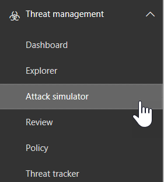

# Aanvalsimulator in ATPAttack Simulator in ATP

**Overzicht** Als u een globale beheerder of een beveiligingsbeheerder bent en uw organisatie office 365 Advanced Threat Protection Plan 2 heeft, waaronder [mogelijkheden voor bedreigingsonderzoek en -respons,](office-365-ti.md)u Attack Simulator gebruiken om realistische aanvalsscenario's in uw organisatie uit te voeren.**Summary** If you are a global administrator or a security administrator and your organization has Office 365 Advanced Threat Protection Plan 2, which includes [Threat Investigation and Response capabilities](office-365-ti.md), you can use Attack Simulator to run realistic attack scenarios in your organization. Dit kan u helpen kwetsbare gebruikers te identificeren en te vinden voordat een echte aanval van invloed is op uw bedrijfsresultaat.This can help you identify and find vulnerable users before a real attack impacts your bottom line. Lees dit artikel voor meer informatie.Read this article to learn more.

## Wat moet u weten voordat u begint?What do you need to know before you begin?

- Als u het Security & <https://protection.office.com/>Compliance Center wilt openen, gaat u naar .To open the Security & Compliance Center, go to <https://protection.office.com/>. Attack simulator is beschikbaar op **Threat management** \> **Attack simulator**.Attack simulator is available at **Threat management** \> **Attack simulator**.

  

- Zie de beschrijving van de Service Office [365 Advanced Threat Protection](https://docs.microsoft.com/office365/servicedescriptions/office-365-advanced-threat-protection-service-description)voor meer informatie over de beschikbaarheid van Attack Simulator voor verschillende Microsoft 365-abonnementen.For more information about the availability of Attack Simulator across different Microsoft 365 subscriptions, see [Office 365 Advanced Threat Protection service description](https://docs.microsoft.com/office365/servicedescriptions/office-365-advanced-threat-protection-service-description).

- U moet lid zijn van de rolgroepen **Organisatiebeheer** of **Beveiligingsbeheerder.**You need to be a member of the **Organization Management** or **Security Administrator** role groups. Zie Machtigingen in het Security & Compliance [Center](permissions-in-the-security-and-compliance-center.md)voor meer informatie over rolgroepen in het Security & Compliance Center.For more information about role groups in the Security & Compliance Center, see [Permissions in the Security & Compliance Center](permissions-in-the-security-and-compliance-center.md).

- Uw account moet zijn geconfigureerd voor multi-factor authenticatie (MFA) om campagnes te maken en te beheren in Attack Simulator.Your account needs to be configured for multi-factor authentication (MFA) to create and manage campaigns in Attack Simulator. Zie Meervoudige [verificatie instellen](https://docs.microsoft.com/office365/admin/security-and-compliance/set-up-multi-factor-authentication)voor instructies .For instructions, see [Set up multi-factor authentication](https://docs.microsoft.com/office365/admin/security-and-compliance/set-up-multi-factor-authentication).

Als u een aanval met succes wilt starten, moet u ervoor zorgen dat het account dat u gebruikt om gesimuleerde aanvallen uit te voeren, multi-factor authenticatie gebruikt.For an attack to be successfully launched, make sure that the account you are using to run simulated attacks is using multi-factor authentication. Bovendien moet u een globale beheerder of een beveiligingsbeheerder zijn.In addition, you must be a global administrator or a security administrator. (Zie Machtigingen in het Security [& Compliance Center](permissions-in-the-security-and-compliance-center.md)voor meer informatie over rollen en machtigingen.)(To learn more about roles and permissions, see [Permissions in the Security & Compliance Center](permissions-in-the-security-and-compliance-center.md).)

- Phishingcampagnes verzamelen en verwerken gebeurtenissen gedurende 30 dagen.Phishing campaigns will collect and process events for 30 days. Historische campagnegegevens zijn tot 90 dagen na de lancering van de campagne beschikbaar.Historical campaign data will be available for up to 90 days after you launch the campaign.

- Er zijn geen overeenkomstige PowerShell-cmdlets voor Attack Simulator.There are no corresponding PowerShell cmdlets for Attack Simulator.

## Spear phishing-campagnesSpear phishing campaigns

*Phishing* is een algemene term voor e-mailaanvallen die proberen gevoelige informatie te stelen in berichten die afkomstig lijken te zijn van legitieme of vertrouwde afzenders.*Phishing* is a generic term for email attacks that try to steal sensitive information in messages that appear to be from legitimate or trusted senders. *Spear phishing* is een gerichte phishing-aanval die gebruik maakt van zeer gerichte en aangepaste inhoud die specifiek is afgestemd op de beoogde ontvangers (meestal, na verkenning op de ontvangers door de aanvaller).*Spear phishing* is a targeted phishing attack that uses very focused and customized content that's specifically tailored to the targeted recipients (typically, after reconnaissance on the recipients by the attacker).

- U bent een globale beheerder of beveiligingsbeheerderYou are a global administrator or security administrator

In Attack Simulator zijn twee verschillende soorten spear phishing-campagnes beschikbaar:In Attack Simulator, two different types of spear phishing campaigns are available:

- [Multi-factor authenticatie/voorwaardelijke toegang](https://docs.microsoft.com/office365/admin/security-and-compliance/set-up-multi-factor-authentication) is ingeschakeld, voor ten minste het wereldwijde beheerdersaccount en beveiligingsbeheerders die Attack Simulator zullen gebruiken.[Multi-factor authentication/Conditional Access](https://docs.microsoft.com/office365/admin/security-and-compliance/set-up-multi-factor-authentication) is turned on, for at least the global administrator account and security administrators who will be using Attack Simulator. (Idealiter is multi-factor authenticatie/voorwaardelijke toegang ingeschakeld voor alle gebruikers in uw organisatie.)(Ideally, multi-factor authentication/conditional access is turned on for all users in your organization.)

  - Een standaardpagina die uitlegt dat dit slechts een test was en tips geeft voor het herkennen van phishingberichten.A default page that explains this was a just a test, and gives tips for recognizing phishing messages.

    

  - Een aangepaste pagina (URL) die u opgeeft.A custom page (URL) that you specify.

- **Spear phishing (bijlage)**: De aanval probeert de ontvangers te overtuigen om een .docx of .pdf bijlage in het bericht te openen.**Spear phishing (attachment)**: The attack tries to convince the recipients to open a .docx or .pdf attachment in the message. De bijlage bevat dezelfde inhoud van de standaard phishing-link, maar de eerste zin begint met "\<Display Name\>, u ziet dit bericht als een recent e-mailbericht dat u hebt geopend...".The attachment contains the same content from the default phishing link, but the first sentence starts with "\<Display Name\>, you are seeing this message as a recent email message you opened...".

> [!NOTE]
> Momenteel verlopen spear phishing-campagnes in Attack Simulator niet.Currently, spear phishing campaigns in Attack Simulator don't expire.

### Een spear phishing-campagne makenCreate a spear phishing campaign

Een belangrijk onderdeel van een spear phishing-campagne is de look en feel van het e-mailbericht dat wordt verzonden naar de beoogde ontvangers.An important part of any spear phishing campaign is the look and feel of the email message that's sent to the targeted recipients. Als u het e-mailbericht wilt maken en configureren, hebt u de volgende opties:To create and configure the email message, you have these options:

- **Gebruik een ingebouwde e-mailsjabloon:** er zijn twee ingebouwde sjablonen beschikbaar: **Prijsweggeefactie** en **salarisupdate.****Use a built-in email template**: Two built-in templates are available: **Prize Giveaway** and **Payroll Update**. U sommige, alle of geen van de e-maileigenschappen van de sjabloon verder aanpassen wanneer u de campagne maakt en start.You can further customize some, all, or none of the email properties from the template when you create and launch the campaign.

- **Een herbruikbare e-mailsjabloon maken:** nadat u de e-mailsjabloon hebt gemaakt en opgeslagen, u deze opnieuw gebruiken in toekomstige spearphishingcampagnes.**Create a reusable email template**: After you create and save the email template, you can use it again in future spear phishing campaigns. U sommige, alle of geen van de e-maileigenschappen van de sjabloon verder aanpassen wanneer u de campagne maakt en start.You can further customize some, all, or none of the email properties from the template when you create and launch the campaign.

- **Maak het e-mailbericht in de wizard:** U het e-mailbericht rechtstreeks in de wizard maken terwijl u de spear phishing-campagne maakt en start.**Create the email message in the wizard**: You can create the email message directly in the wizard as you create and launch the spear phishing campaign.

#### Stap 1 (optioneel): Een aangepaste e-mailsjabloon makenStep 1 (Optional): Create a custom email template

Als u een van de ingebouwde sjablonen gaat gebruiken of het e-mailbericht rechtstreeks in de wizard wilt maken, u deze stap overslaan.If you're going to use one of the built-in templates or create the email message directly in the wizard, you can skip this step.

1. Ga in het Security & Compliance Center naar **de threat management** \> **Attack simulator.**In the Security & Compliance Center, go to **Threat management** \> **Attack simulator**.

2. Klik op de pagina **Aanvallen simuleren** in de secties Spear **Phishing (Credentials Harvest)** of **Spear Phishing (Attachment)** op **Aanvalsgegevens.**On the **Simulate attacks** page, in either the **Spear Phishing (Credentials Harvest)** or **Spear Phishing (Attachment)** sections, click **Attack Details**.

   Het maakt niet uit waar u de sjabloon maakt.It doesn't matter where you create the template. De beschikbare opties in de sjabloon zijn hetzelfde voor beide soorten phishing-aanvallen.The available options in the template are the same for both types of phishing attacks.

3. Klik op de pagina **Details van aanvallen** die wordt geopend in de sectie **Phishingsjablonen** in het gebied **Sjablonen maken** op **Nieuwe sjabloon**.In the **Attack details** page that opens, in the **Phishing Templates** section, in the **Create Templates** area, click **New Template**.

4. De wizard **Phishingsjabloon configureren** begint in een nieuwe flyout.The **Configure Phishing Template** wizard starts in a new flyout. Voer in de stap **Start** een unieke weergavenaam voor de sjabloon in en klik op **Volgende**.In the **Start** step, enter a unique display name for the template, and then click **Next**.

5. Configureer in de stap **E-maildetails** configureren de volgende instellingen:In the **Configure email details** step, configure the following settings:

   - **Van (Naam):** de weergavenaam die wordt gebruikt voor de afzender van het bericht.**From (Name)**: The display name that's used for the message sender.

   - **Van (E-mail)**: Het e-mailadres van de afzender.**From (Email)**: The sender's email address.

   - **URL van de phishing-aanmeldingsserver**: klik op de vervolgkeuzelijst en selecteer een van de beschikbare URL's in de lijst.**Phishing Login Server URL**: Click the drop down and select one of the available URLs from the list. Dit is de URL waar gebruikers op in de verleiding komen om te klikken.This is the URL that users will be tempted to click. De keuzes zijn:The choices are:

     - <http://portal.docdeliveryapp.com>
     - <http://portal.docdeliveryapp.net>
     - <http://portal.docstoreinternal.com>
     - <http://portal.docstoreinternal.net>
     - <http://portal.hardwarecheck.net>
     - <http://portal.hrsupportint.com>
     - <http://portal.payrolltooling.com>
     - <http://portal.payrolltooling.net>
     - <http://portal.prizegiveaway.net>
     - <http://portal.prizesforall.com>
     - <http://portal.salarytoolint.com>
     - <http://portal.salarytoolint.net>

     > [!NOTE]
     > <ul><li>Alle URL's zijn opzettelijk http, niet https.All of the URLs are intentionally http, not https.</li><li>Een URL-reputatieservice kan een of meer van deze URL's als onveilig identificeren.A URL reputation service might identify one or more of these URLs as unsafe. Controleer de beschikbaarheid van de URL in uw ondersteunde webbrowsers voordat u de URL in een phishingcampagne gebruikt.Check the availability of the URL in your supported web browsers before you use the URL in a phishing campaign.</li></ul>

   - **Aangepaste URL van bestemmingspagina**: Voer een optionele bestemmingspagina in waar gebruikers worden genomen als ze op de phishing-link klikken en hun referenties invoeren.**Custom Landing Page URL**: Enter an optional landing page where users are taken if they click the phishing link and enter their credentials. Deze koppeling vervangt de standaardbestemmingspagina.This link replaces the default landing page. Als u bijvoorbeeld interne bewustzijnstraining hebt, u die URL hier opgeven.For example, if you have internal awareness training, you can specify that URL here.

   - **Categorie:** Momenteel wordt deze instelling niet gebruikt (alles wat u invoert wordt genegeerd).**Category**: Currently, this setting isn't used (anything you enter is ignored).

   - **Onderwerp:** Het veld **Onderwerp** van het e-mailbericht.**Subject**: The **Subject** field of the email message.

   Klik op **Volgende**als u klaar bent.When you're finished, click **Next**.

6. Maak in de **stap E-mail samenstellen** de berichttekst van het e-mailbericht.In the **Compose email** step, create the message body of the email message. U het tabblad **E-mail** (een uitgebreide HTML-editor) of het tabblad **Bron** (ruwe HTML-code) gebruiken.You can use the **Email** tab (a rich HTML editor) or the **Source** tab (raw HTML code).

   De HTML-opmaak kan zo eenvoudig of complex zijn als u nodig hebt.The HTML formatting can be as simple or complex as you need it to be. U afbeeldingen en tekst invoegen om de glievability van het bericht in de e-mailclient van de ontvanger te verbeteren.You can insert images and text to enhance the believability of the message in the recipient's email client.

   - `${username}`hiermee wordt de naam van de ontvanger ingevoegd.`${username}` inserts the recipient's name.

   - `${loginserverurl}`hiermee wordt de **URL-waarde van de phishing-aanmeldingsserver** van de vorige stap ingevoegd.`${loginserverurl}` inserts the **Phishing Login Server URL** value from the previous step.

   Klik op **Volgende**als u klaar bent.When you're finished, click **Next**.

7. Klik **in** de stap Bevestigen op **Voltooien.**In the **Confirm** step, click **Finish**.

#### Stap 2: Maak en start de spear phishing-campagneStep 2: Create and launch the spear phishing campaign

1. Ga in het Security & Compliance Center naar **de threat management** \> **Attack simulator.**In the Security & Compliance Center, go to **Threat management** \> **Attack simulator**.

2. Maak op de pagina **Aanvallen simuleren** een van de volgende selecties op basis van het type campagne dat u wilt maken:On the **Simulate attacks** page, make one of the following selections based on the type of campaign you want to create:

   - Klik in de sectie **Spear Phishing (Credentials Harvest)** op **Attack starten** of klik op Attack **Details** \> **Launch Attack**.In the **Spear Phishing (Credentials Harvest)** section, click **Launch Attack** or click **Attack Details** \> **Launch Attack**.

   - Klik in de sectie **Spear Phishing (Attachment)** op **Aanval starten** of klik op **Aanvalsgegevens** \> **Startaanval**.In the **Spear Phishing (Attachment)** section, click **Launch Attack** or click **Attack Details** \> **Launch Attack**.

3. De wizard **Phishing-aanval configureren** begint in een nieuwe flyout.The **Configure Phishing Attack** wizard starts in a new flyout. Ga in de stap **Start** een van de volgende stappen uit:In the **Start** step, do one of the following steps:

   - Voer in het vak **Naam** een unieke weergavenaam voor de campagne in.In the **Name** box, enter a unique display name for the campaign. Klik niet op **Sjabloon gebruiken,** omdat u het e-mailbericht later in de wizard maakt.Don't click **Use Template**, because you'll create the email message later in the wizard.

   - Klik **op Sjabloon gebruiken** en selecteer een ingebouwde of aangepaste e-mailsjabloon.Click **Use Template** and select a built-in or custom email template. Nadat u de sjabloon hebt geselecteerd, wordt het vak **Naam** automatisch ingevuld op basis van de sjabloon, maar u de naam wijzigen.After you select the template, the **Name** box is automatically filled based on the template, but you can change the name.

   

   Klik op **Volgende**als u klaar bent.When you're finished, click **Next**.

4. Ga in de stap **Doelontvangers** een van de volgende stappen uit:In the **Target recipients** step, do one of the following steps:

   - Klik **op Adresboek** om de ontvangers (gebruikers of groepen) voor de campagne te selecteren.Click **Address Book** to select the recipients (users or groups) for the campaign. Elke gerichte ontvanger moet een Exchange Online-postvak hebben.Each targeted recipient must have an Exchange Online mailbox. Als u op **Filteren** en **toepassen klikt** zonder zoekcriteria in te voeren, worden alle ontvangers geretourneerd en aan de campagne toegevoegd.If you click **Filter** and **Apply** without entering a search criteria, all recipients are returned and added to the campaign.

   - Klik **op Importeren** en vervolgens Bestand **importeren** om een door komma's gescheiden waarde (CSV) of een door de regel gescheiden bestand met e-mailadressen te importeren.Click **Import** then **File Import** to import a comma-separated value (CSV) or line-separated file of email addresses. Elke regel moet het e-mailadres van de ontvanger bevatten.Each line must contain the recipient's email address.

   Klik op **Volgende**als u klaar bent.When you're finished, click **Next**.

5. Configureer in de stap **E-maildetails** configureren de volgende instellingen:In the **Configure email details** step, configure the following settings:

   Als u een sjabloon hebt geselecteerd in de **stap Start,** zijn de meeste van deze waarden al geconfigureerd, maar u deze wijzigen.If you selected a template in the **Start** step, most of these values are already configured, but you can change them.

   - **Van (Naam):** de weergavenaam die wordt gebruikt voor de afzender van het bericht.**From (Name)**: The display name that's used for the message sender.

   - **Van (E-mail)**: Het e-mailadres van de afzender.**From (Email)**: The sender's email address. U een echt of nep e-mailadres invoeren vanuit het e-maildomein van uw organisatie, of u een echt of nep extern e-mailadres invoeren.You can enter a real or fake email address from your organization's email domain, or you can enter a real or fake external email address. Een geldig e-mailadres van uw organisatie wordt daadwerkelijk opgelost in de e-mailclient van de ontvanger.A valid sender email address from your organization will actually resolve in the recipient's email client.

   - **URL van de phishing-aanmeldingsserver**: klik op de vervolgkeuzelijst en selecteer een van de beschikbare URL's in de lijst.**Phishing Login Server URL**: Click the drop down and select one of the available URLs from the list. Dit is de URL waar gebruikers op in de verleiding komen om te klikken.This is the URL that users will be tempted to click. De keuzes zijn:The choices are:

     - <http://portal.docdeliveryapp.com>
     - <http://portal.docdeliveryapp.net>
     - <http://portal.docstoreinternal.com>
     - <http://portal.docstoreinternal.net>
     - <http://portal.hardwarecheck.net>
     - <http://portal.hrsupportint.com>
     - <http://portal.payrolltooling.com>
     - <http://portal.payrolltooling.net>
     - <http://portal.prizegiveaway.net>
     - <http://portal.prizesforall.com>
     - <http://portal.salarytoolint.com>
     - <http://portal.salarytoolint.net>

     > [!NOTE]
     > <ul><li>Alle URL's zijn opzettelijk http, niet https.All of the URLs are intentionally http, not https.</li><li>Een URL-reputatieservice kan een of meer van deze URL's als onveilig identificeren.A URL reputation service might identify one or more of these URLs as unsafe. Controleer de beschikbaarheid van de URL in uw ondersteunde webbrowsers voordat u de URL in een phishingcampagne gebruikt.Check the availability of the URL in your supported web browsers before you use the URL in a phishing campaign.</li><li>U moet een URL selecteren.You are required to select a URL. Voor <b>Spear Phishing-campagnes (Attachment)</b> u de koppeling in de volgende stap uit de hoofdtekst van het bericht verwijderen (anders bevat het bericht zowel een <b>koppeling</b> als een bijlage).For <b>Spear Phishing (Attachment)</b> campaigns, you can remove the link from the body of the message in the next step (otherwise, the message will contain both a link <b>and</b> an attachment).</li></ul>

   - **Bijlagetype:** deze instelling is alleen beschikbaar in **Spear Phishing-campagnes (Attachment).****Attachment Type**: This setting is only available in **Spear Phishing (Attachment)** campaigns. Klik op de vervolgkeuzelijst en selecteer **. DOCX** of **. PDF** uit de lijst.Click the drop down and select **.DOCX** or **.PDF** from the list.

   - **Naam van bijlage:** deze instelling is alleen beschikbaar in **Spear Phishing-campagnes (Attachment).****Attachment Name**: This setting is only available in **Spear Phishing (Attachment)** campaigns. Voer een bestandsnaam in voor de bijlage .docx of .pdf.Enter a filename for the .docx or .pdf attachment.

   - **Aangepaste URL van bestemmingspagina**: Voer een optionele bestemmingspagina in waar gebruikers worden genomen als ze op de phishing-link klikken en hun referenties invoeren.**Custom Landing Page URL**: Enter an optional landing page where users are taken if they click the phishing link and enter their credentials. Deze koppeling vervangt de standaardbestemmingspagina.This link replaces the default landing page. Als u bijvoorbeeld interne bewustzijnstraining hebt, u die URL hier opgeven.For example, if you have internal awareness training, you can specify that URL here.

   - **Onderwerp:** Het veld **Onderwerp** van het e-mailbericht.**Subject**: The **Subject** field of the email message.

   Klik op **Volgende**als u klaar bent.When you're finished, click **Next**.

6. Maak in de **stap E-mail samenstellen** de berichttekst van het e-mailbericht.In the **Compose email** step, create the message body of the email message. Als u een sjabloon hebt geselecteerd in de **stap Start,** is de berichttekst al geconfigureerd, maar u deze aanpassen.If you selected a template in the **Start** step, the message body is already configured, but you can customize it. U het tabblad **E-mail** (een uitgebreide HTML-editor) of het tabblad **Bron** (ruwe HTML-code) gebruiken.You can use the **Email** tab (a rich HTML editor) or the **Source** tab (raw HTML code).

   De HTML-opmaak kan zo eenvoudig of complex zijn als u nodig hebt.The HTML formatting can be as simple or complex as you need it to be. U afbeeldingen en tekst invoegen om de glievability van het bericht in de e-mailclient van de ontvanger te verbeteren.You can insert images and text to enhance the believability of the message in the recipient's email client.

   - `${username}`hiermee wordt de naam van de ontvanger ingevoegd.`${username}` inserts the recipient's name.

   - `${loginserverurl}`hiermee wordt de **URL-waarde van de phishing-aanmeldingsserver** ingevoegd.`${loginserverurl}` inserts the **Phishing Login Server URL** value.

   Voor **Spear Phishing-campagnes (Attachment)** moet u de koppeling uit de hoofdtekst van het bericht verwijderen (anders bevat het bericht zowel een **koppeling** als een bijlage en worden klikken op koppelingen niet bijgehouden in een bijlagecampagne).For **Spear Phishing (Attachment)** campaigns, you should remove the link from the body of the message (otherwise, the message will contain both a link **and** an attachment, and link clicks aren't tracked in an attachment campaign).

   

   Klik op **Volgende**als u klaar bent.When you're finished, click **Next**.

7. Klik **in** de stap Bevestigen op **Voltooien** om de campagne te starten.In the **Confirm** step, click **Finish** to launch the campaign. Het phishingbericht wordt geleverd aan de beoogde ontvangers.The phishing message is delivered to the targeted recipients.

## Campagnes voor wachtwoordaanvallenPassword attack campaigns

Een *wachtwoordaanval* probeert wachtwoorden voor gebruikersaccounts in een organisatie te raden, meestal nadat de aanvaller een of meer geldige gebruikersaccounts heeft geïdentificeerd.A *password attack* tries to guess passwords for user accounts in an organization, typically after the attacker has identified one or more valid user accounts.

In Attack Simulator zijn twee verschillende soorten wachtwoordaanvalscampagnes beschikbaar om de complexiteit van de wachtwoorden van uw gebruikers te testen:In Attack Simulator, two different types of password attack campaigns are available for you to test the complexity of your users' passwords:

- **Brute force wachtwoord (woordenboek aanval)**: Een *brute force* of *woordenboek* aanval maakt gebruik van een groot woordenboek bestand van wachtwoorden op een gebruikersaccount in de hoop dat een van hen zal werken (veel wachtwoorden tegen een account).**Brute force password (dictionary attack)**: A *brute force* or *dictionary* attack uses a large dictionary file of passwords on a user account with the hope that one of them will work (many passwords against one account). Onjuiste wachtwoordvergrendelingen helpen aanvallen op brute force-wachtwoorden af te schrikken.Incorrect password lock-outs help deter brute force password attacks.

  Voor de woordenboekaanval u een of meerdere wachtwoorden opgeven om te proberen (handmatig ingevoerd of in een geüpload bestand) en u een of meerdere gebruikers opgeven.For the dictionary attack, you can specify one or many passwords to try (manually entered or in an uploaded file), and you can specify one or many users.

- **Password spray attack**: Een *wachtwoord spray* aanval maakt gebruik van hetzelfde zorgvuldig overwogen wachtwoord tegen een lijst van gebruikersaccounts (een wachtwoord tegen veel accounts).**Password spray attack**: A *password spray* attack uses the same carefully considered password against a list of user accounts (one password against many accounts). Wachtwoord spray aanvallen zijn moeilijker te detecteren dan brute force wachtwoord aanvallen (de kans op succes toeneemt wanneer een aanvaller probeert een wachtwoord over tientallen of honderden accounts zonder het risico van struikelen van de gebruiker onjuiste wachtwoord lock-out).Password spray attacks are harder to detect than brute force password attacks (the probability of success increases when an attacker tries one password across dozens or hundreds of accounts without the risk of tripping the user's incorrect password lock-out).

  Voor de wachtwoordsprayaanval u slechts één wachtwoord opgeven om te proberen en u een of veel gebruikers opgeven.For the password spray attack, you can only specify one password to try, and you can specify one or many users.

> [!NOTE]
> De wachtwoordaanvallen in Attack Simulator geven gebruikersnaam en wachtwoord door Basisauth-aanvragen naar een eindpunt, dus ze werken ook met andere verificatiemethoden (AD FS, wachtwoordhashsynchronisatie, doorgeef, PingFederate, enz.).The password attacks in Attack Simulator pass username and password Basic auth requests to an endpoint, so they also work with other authentication methods (AD FS, password hash sync, pass-through, PingFederate, etc.). Voor gebruikers die MFA hebben ingeschakeld, zelfs als de wachtwoordaanval hun werkelijke wachtwoord probeert, wordt de poging altijd geregistreerd als een fout (met andere woorden, MFA-gebruikers zullen nooit worden weergegeven in het aantal **geslaagde pogingen** van de campagne).For users that have MFA enabled, even if the password attack tries their actual password, the attempt will always register as a failure (in other words, MFA users will never appear in the **Successful attempts** count of the campaign). Dit is het verwachte resultaat.This is the expected result. MFA is een primaire methode om te beschermen tegen wachtwoordaanvallen.MFA is a primary method to help protect against password attacks.

### Een wachtwoordaanvalscampagne maken en startenCreate and launch a password attack campaign

1. Ga in het Security & Compliance Center naar **de threat management** \> **Attack simulator.**In the Security & Compliance Center, go to **Threat management** \> **Attack simulator**.

2. Maak op de pagina **Aanvallen simuleren** een van de volgende selecties op basis van het type campagne dat u wilt maken:On the **Simulate attacks** page, make one of the following selections based on the type of campaign you want to create:

   - Klik in de sectie **Brute Force Password (Dictionary Attack)** op **Attack starten** of klik op **Aanvalsdetails** \> **Aanvalsaanval**.In the **Brute Force Password (Dictionary Attack)** section, click **Launch Attack** or click **Attack Details** \> **Launch Attack**.

   - klik in de sectie **Wachtwoordsprayaanval** op **Aanval starten** of klik op **Aanvalsdetails** \> **Startaanval**.in the **Password spray attack** section, click **Launch Attack** or click **Attack Details** \> **Launch Attack**.

3. De wizard **Wachtwoordaanval configureren** begint in een nieuwe flyout.The **Configure Password Attack** wizard starts in a new flyout. Voer in de stap **Start** een unieke weergavenaam voor de campagne in en klik op **Volgende**.In the **Start** step, enter a unique display name for the campaign, and then click **Next**.

4. Ga in de stap **Doelgebruikers** een van de volgende stappen uit:In the **Target users** step, do one of the following steps:

   - Klik **op Adresboek** om de ontvangers (gebruikers of groepen) voor de campagne te selecteren.Click **Address Book** to select the recipients (users or groups) for the campaign. Elke gerichte ontvanger moet een Exchange Online-postvak hebben.Each targeted recipient must have an Exchange Online mailbox. Als u op **Filteren** en **toepassen klikt** zonder zoekcriteria in te voeren, worden alle ontvangers geretourneerd en aan de campagne toegevoegd.If you click **Filter** and **Apply** without entering a search criteria, all recipients are returned and added to the campaign.

   - Klik **op Importeren** en vervolgens Bestand **importeren** om een door komma's gescheiden waarde (CSV) of een door de regel gescheiden bestand met e-mailadressen te importeren.Click **Import** then **File Import** to import a comma-separated value (CSV) or line-separated file of email addresses. Elke regel moet het e-mailadres van de ontvanger bevatten.Each line must contain the recipient's email address.

   Klik op **Volgende**als u klaar bent.When you're finished, click **Next**.

5. Kies in de stap **Aanvalsinstellingen kiezen** wat u moet doen op basis van het campagnetype:In the **Choose attack settings** step, choose what to do based on the campaign type:

   - **Brute Force Password (Dictionary Attack)**: Doe een van de volgende stappen:**Brute Force Password (Dictionary Attack)**: Do either of the following steps:

     - **Wachtwoorden handmatig invoeren**: Typ in het **voer druk om een wachtwoordvak toe te voegen** een wachtwoord en druk op ENTER.**Enter passwords manually**: In the **Press enter to add a password** box, type a password and then press ENTER. Herhaal deze stap zo vaak als nodig is.Repeat this step as many times as necessary.

     - **Wachtwoorden uploaden uit een woordenboekbestand:** klik op **Uploaden** om een bestaand tekstbestand te importeren dat één wachtwoord op elke regel en een lege laatste regel bevat.**Upload passwords from a dictionary file**: Click **Upload** to import an existing text file that contains one password on each line and a blank last line. Het tekstbestand moet 10 MB of minder groot zijn en mag niet meer dan 30000 wachtwoorden bevatten.The text file must be 10 MB or less in size, and can't contain more than 30000 passwords.

   - **Wachtwoordsprayaanval**: Voer in **Het wachtwoord(en) dat u in het aanvalsvak** wilt gebruiken één wachtwoord in.**Password spray attack**: In **The password(s) to use in the attack** box, enter one password.

   Klik op **Volgende**als u klaar bent.When you're finished, click **Next**.

6. Klik **in** de stap Bevestigen op **Voltooien** om de campagne te starten.In the **Confirm** step, click **Finish** to launch the campaign. De wachtwoorden die u hebt opgegeven, worden geprobeerd op gebruikers die u hebt opgegeven.The passwords you specified are tried on users you specified.

## Campagneresultaten weergevenView campaign results

Nadat u een campagne hebt gestart, u de voortgang en resultaten op de pagina **Aanvallen simuleren** controleren.After you launch a campaign, you can check the progress and results on the main **Simulate attacks** page.

Actieve campagnes tonen een statusbalk, een voltooid percentage waarde en "(voltooide gebruikers) van (totale gebruikers)" tellen.Active campaigns will show a status bar, a completed percentage value and "(completed users) of (total users)" count. Als u op **Vernieuwen** klikt, wordt de voortgang van actieve campagnes bijgewerkt.Clicking the **Refresh** button will update the progress of any active campaigns. U ook op **Beëindigen** klikken om een actieve campagne te stoppen.You can also click **Terminate** to stop an active campaign.

Wanneer de campagne is voltooid, worden de statuswijzigingen **in Attack voltooid.**When the campaign is finished, the status changes to **Attack completed**. U de resultaten van de campagne bekijken door een van de volgende acties uit te voeren:You can view the results of the campaign by doing either of the following actions:

- Klik op de pagina **Aanvallen simuleren** op **Rapport weergeven** onder de naam van de campagne.On the main **Simulate attacks** page, click **View Report** under the name of the campaign.

- Klik op de pagina **Aanvallen simuleren** op **Aanvalsgegevens** in de sectie voor het type aanval.On the main **Simulate attacks** page, click **Attack Details** in the section for the type of attack. Selecteer op de pagina **Details van aanvallen** die wordt geopend de campagne in de sectie **Aanvalsgeschiedenis.**On the **Attack details** page that opens, select the campaign in the **Attack History** section.

Een van de vorige acties brengt u naar een pagina met de naam **Attack details**.Either of the previous actions will take you to a page named **Attack details**. De informatie die beschikbaar is op deze pagina voor elk type campagne wordt beschreven in de volgende secties.The information that's available on this page for each type of campaign is described in the following sections.

### Spear Phishing (Credentials Harvest) campagneresultatenSpear Phishing (Credentials Harvest) campaign results

De volgende informatie is beschikbaar op de pagina **Details van de aanval** voor elke campagne:The following information is available on the **Attack details** page for each campaign:

- De duur (begindatum/-tijd en einddatum/tijd) van de campagne.The duration (start date/time and end date/time) of the campaign.

- **Totaal aantal gerichte gebruikers****Total users targeted**

- **Geslaagde pogingen:** het aantal gebruikers dat op de koppeling heeft geklikt **en** hun referenties heeft ingevoerd *(elke* gebruikersnaam en wachtwoordwaarde).**Successful attempts**: The number of users who clicked the link **and** entered their credentials (*any* username and password value).

- **Algemeen slagingspercentage**: Een percentage dat wordt berekend door **Succesvolle pogingen** / **Totaal aantal gebruikers gericht**.**Overall Success Rate**: A percentage that's calculated by **Successful attempts** / **Total users targeted**.

- **Snelste klik:** Hoe lang het duurde voordat de eerste gebruiker op de link klikte nadat u de campagne hebt gestart.**Fastest Click**: How long it took the first user to click the link after you launched the campaign.

- **Gemiddelde klik:** De som van hoe lang het duurde iedereen om de link gedeeld door het aantal gebruikers die op de link geklikt klikken.**Average Click**: The sum of how long it took everyone to click the link divided by the number of users who clicked the link.

- **Klik op Slagingspercentage:** een percentage dat wordt berekend door (aantal gebruikers dat op de link heeft geklikt) / **Totaal aantal gerichte gebruikers**.**Click Success Rate**: A percentage that's calculated by (number of users who clicked the link) / **Total users targeted**.

- **Snelste referenties:** hoe lang het duurde voordat de eerste gebruiker zijn of haar referenties invulde nadat u de campagne hebt gestart.**Fastest Credentials**: How long it took the first user to enter their credentials after you launched the campaign.

- **Gemiddelde referenties:** de som van hoe lang het duurde iedereen om hun referenties gedeeld door het aantal gebruikers die hun geloofsbrieven ingevoerd in te voeren.**Average Credentials**: The sum of how long it took everyone to enter their credentials divided by the number of users who entered their credentials.

- **Referentieslagpercentage:** een percentage dat wordt berekend door (aantal gebruikers dat hun referenties heeft ingevoerd) / **Totaal aantal gebruikers dat is getarget**.**Credential Success Rate**: A percentage that's calculated by (number of users who entered their credentials) / **Total users targeted**.

- Een staafdiagram met de **klikkoppeling** en **de opgegeven** nummers per dag.A bar graph that shows the **Link clicked** and **Credential supplied** numbers per day.

- Een cirkelgrafiek met de **klikkoppeling**, **opgegeven referenties**en **geen** percentages voor de campagne.A circle graph that shows the **Link clicked**, **Credential supplied**, and **None** percentages for the campaign.

- In de sectie **Gecompromitteerde gebruikers** worden de details weergegeven van de gebruikers die op de koppeling hebben geklikt:The **Compromised Users** section lists the details of the users who clicked the link:

  - Het e-mailadres van de gebruikerThe user's email address

  - De datum/tijd waarop ze op de link klikten.The date/time when they clicked the link.

  - Het IP-adres van de client.The client IP address.

  - Details over de versie van Windows en de webbrowser van de gebruiker.Details about the user's version of Windows and web browser.

  U op **Exporteren** klikken om de resultaten naar een CSV-bestand te exporteren.You can click **Export** to export the results to a CSV file.

### Campagneresultaten van Spear Phishing (Attachment)Spear Phishing (Attachment) campaign results

De volgende informatie is beschikbaar op de pagina **Details van de aanval** voor elke campagne:The following information is available on the **Attack details** page for each campaign:

- De duur (begindatum/-tijd en einddatum/tijd) van de campagne.The duration (start date/time and end date/time) of the campaign.

- **Totaal aantal gerichte gebruikers****Total users targeted**

- **Geslaagde pogingen:** het aantal gebruikers dat de bijlage heeft geopend of gedownload en geopend (voorbeeld telt niet mee).**Successful attempts**: The number of users who opened or downloaded and opened the attachment (preview doesn't count).

- **Algemeen slagingspercentage**: Een percentage dat wordt berekend door **Succesvolle pogingen** / **Totaal aantal gebruikers gericht**.**Overall Success Rate**: A percentage that's calculated by **Successful attempts** / **Total users targeted**.

- **Snelste bijlage open tijd:** Hoe lang het duurde de eerste gebruiker om de bijlage te openen nadat u de campagne gestart.**Fastest attachment open time**: How long it took the first user to open the attachment after you launched the campaign.

- **Gemiddelde bijlage open tijd**: De som van hoe lang het duurde iedereen om de bijlage te openen gedeeld door het aantal gebruikers die de bijlage geopend.**Average attachment open time**: The sum of how long it took everyone to open the attachment divided by the number of users who opened the attachment.

- **Attachment open slagingspercentage**: Een percentage dat wordt berekend door (aantal gebruikers die de bijlage hebben geopend) / **Totaal aantal gerichte gebruikers**.**Attachment open success rate**: A percentage that's calculated by (number of users who opened the attachment) / **Total users targeted**.

### Campagneresultaten van Brute Force Password (Dictionary Attack)Brute Force Password (Dictionary Attack) campaign results

De volgende informatie is beschikbaar op de pagina **Details van de aanval** voor elke campagne:The following information is available on the **Attack details** page for each campaign:

- De duur (begindatum/-tijd en einddatum/tijd) van de campagne.The duration (start date/time and end date/time) of the campaign.

- **Totaal aantal gerichte gebruikers****Total users targeted**

- **Succesvolle pogingen:** het aantal gebruikers dat een van de opgegeven wachtwoorden bleek te gebruiken.**Successful attempts**: The number of users who were found to be using one of the specified passwords.

- **Algemeen slagingspercentage**: Een percentage dat wordt berekend door **Succesvolle pogingen** / **Totaal aantal gebruikers gericht**.**Overall Success Rate**: A percentage that's calculated by **Successful attempts** / **Total users targeted**.

- In de sectie **Gecompromitteerde gebruikers** worden de e-mailadressen van de getroffen gebruikers weergegeven.The **Compromised Users** section lists the email addresses of the affected users. U op **Exporteren** klikken om de resultaten naar een CSV-bestand te exporteren.You can click **Export** to export the results to a CSV file.

### Wachtwoord spray aanval campagne resultatenPassword spray attack campaign results

De volgende informatie is beschikbaar op de pagina **Details van de aanval** voor elke campagne:The following information is available on the **Attack details** page for each campaign:

- De duur (begindatum/-tijd en einddatum/tijd) van de campagne.The duration (start date/time and end date/time) of the campaign.

- **Totaal aantal gerichte gebruikers****Total users targeted**

- **Geslaagde pogingen:** het aantal gebruikers dat het opgegeven wachtwoord bleek te gebruiken.**Successful attempts**: The number of users who were found to be using the specified password.

- **Algemeen slagingspercentage**: Een percentage dat wordt berekend door **Succesvolle pogingen** / **Totaal aantal gebruikers gericht**.**Overall Success Rate**: A percentage that's calculated by **Successful attempts** / **Total users targeted**.
