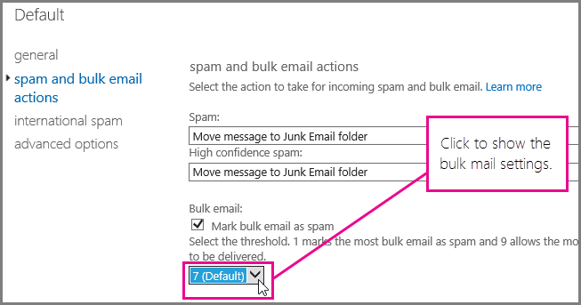

# <a name="customize-the-office-365-anti-spam-filter-with-these-settings"></a>Het Office 365-antispamfilter aanpassen met deze instellingen

Een beheerder kan verschillende instellingen van het Office 365-spamfilter gebruiken om te voorkomen dat ongewenste e-mail wordt verzonden naar het postvak van een gebruiker. Het Office 365-spamfilter kan ongewenste e-mail beter blokkeren en fout-negatieve berichten voorkomen als u de hier vermelde opties gebruikt. In deze context verwijst een fout-negatieve waarde naar e-mailspam of ongewenste e-mailberichten die naar een postvak van een gebruiker zijn verzonden.

## <a name="block-ip-addresses-with-a-connection-filter"></a>IP-adressen blokkeren met een verbindingsfilter

Uw Office 365-spamfilter aanpassen door het IP-adres van de afzender aan de IP-blokkeringslijst van het verbindingsfilter toe te voegen:

1. Verkrijg de kop van het bericht dat u wilt blokkeren in uw e-mailclient, bijvoorbeeld Outlook of de webversie van Outlook (voorheen genaamd Outlook Web App), zoals is beschreven in [Berichtkopanalyse](https://support.office.com/article/cd039382-dc6e-4264-ac74-c048563d212c).

2. Zoek het IP-adres na het CIP-label in de header X-Forefront-Antispam-Report met [berichtkopanalyse](https://testconnectivity.microsoft.com/?tabid=mha) of handmatig.

3. Voeg het IP-adres toe aan de IP-blokkeringslijst door de stappen te volgen in 'Gebruik het EAC om het standaardbeleid voor verbindingsfilters te bewerken' in [Het beleid van het verbindingsfilter configureren](configure-the-connection-filter-policy.md).

### <a name="block-bulk-mail-with-mail-flow-rules-transport-rules-or-the-spam-filter"></a>Bulkmail blokkeren met e-mailstroomregels (transportregels) of het spamfilter

Is de spam voornamelijk bulkmail zoals nieuwsbrieven of aanbiedingen? U kunt het spamfilter in Office 365 aanpassen als u [e-mailstroomregels gebruikt om het filteren van bulkmail te configureren](use-transport-rules-to-configure-bulk-email-filtering.md) of de instelling **Bulkmail** inschakelen in de [Geavanceerde spamfilteropties (ASF) in Office 365](advanced-spam-filtering-asf-options.md) van het spamfilter. Ga in het Exchange-beheercentrum aan de slag door te klikken op **Beveiliging**\> **Inhoudsfilter** en vervolgens dubbel te klikken op het filterbeleid dat u wilt aanpassen. Klik op **Acties voor spam en bulkmail** om de instellingen aan te passen zoals hier aangegeven.



### <a name="block-email-spam-using-spam-filter-block-lists"></a>Spam blokkeren met blokkeerlijsten voor spamfilters

[Configureer anti-spambeleid in Office 365](configure-your-spam-filter-policies.md) om in het spamfilter het verzendadres toe te voegen aan de lijst met geblokkeerde afzenders of het domein aan de lijst met geblokkeerde domeinen. E-mails van een afzender of domein op een blokkeerlijst voor spamfilters worden gemarkeerd als spam.

## <a name="email-users-can-also-help-ensure-that-false-negative-and-email-spam-is-blocked-with-office-365-spam-filter"></a>E‑mailgebruikers kunnen er ook voor helpen zorgen dat niet geïdentificeerde spamberichten en e‑mailspam worden geblokkeerd met het Office 365-spamfilter

Het helpt bij uw anti-spampogingen in Office 365 om de fout-positieve berichten en ongewenste e-mail te voorkomen als u de gebruikers vertelt dat zij het adres van de afzender van spam moeten toevoegen aan hun lijst met geblokkeerde afzenders in [Outlook](https://support.office.com/article/5ae3ea8e-cf41-4fa0-b02a-3b96e21de089) of [de webversie van Outlook](https://support.office.com/article/db786e79-54e2-40cc-904f-d89d57b7f41d). Ga aan de slag in Outlook Web App door te klikken op **Instellingen** \> **Opties** \> **Blokkeren of toestaan** en vervolgens de adressen toe te voegen aan de **Lijst met geblokkeerde afzenders** zoals hier weergegeven.


> [!NOTE]
> Zie voor meer gedetailleerde informatie over lijsten met veilige afzenders [Lijst maken met veilige afzenders in Office 365](create-safe-sender-lists-in-office-365.md).

## <a name="eop-only-customers-set-up-directory-synchronization"></a>Klanten met alleen EOP: adreslijstsynchronisatie instellen

Bovendien kunt u fout-negatieve e-mailspam voorkomen als u de instellingen van de gebruiker synchroniseert met de service via adreslijstsynchronisatie om ervoor te zorgen dat uw lijst met geblokkeerde afzenders wordt gevolgd. Zie 'Adreslijstsynchronisatie gebruiken voor het beheren van e-mailgebruikers' in E-mailgebruikers beheren in EOP voor meer informatie.

## <a name="eop-only-customers-who-are-not-using-directory-synchronization"></a>Klanten met alleen EOP die adreslijstsynchronisatie niet gebruiken

De EOP-service is ontworpen om de veilige en geblokkeerde afzenders van de gebruiker toe te passen als die informatie is gedeeld met de service. Als u een EOP-klant bent en Outlook gebruikt, maar geen adreslijstsynchronisatie hebt geconfigureerd om uw gebruikers te synchroniseren met Office 365, kunt u nog steeds voorkomen dat berichten in het Postvak IN van uw gebruikers worden afgeleverd door geblokkeerde afzenders te gebruiken. Mogelijk moet u enkele Exchange-regels voor de e‑mailstroom instellen in de volgende situaties:

- Als een bericht door de normale spamfilters van EOP wordt verwerkt en vervolgens wordt bezorgd bij een lokale on-premises Exchange-server, waarna EOP een spambeoordeling van SCL 1-4 (geen spam) toewijst, heeft de lokale lijst met geblokkeerde afzenders van de gebruiker voorrang over het oordeel van het EOP-spamfilter en wordt het bericht in de map Ongewenste e‑mail afgeleverd.

- Als een bericht in EOP SCL -1 krijgt toegewezen door een Exchange-regel voor de e‑mailstroom of omdat het IP-adres of domein in de lijst met toegestane afzenders staat, wordt de SCL met behulp van connectors doorgegeven aan de on-premises Exchange-server. In dit geval wordt de lijst met geblokkeerde afzenders van de gebruiker niet toegepast. U kunt dit wijzigen door een lokale regel voor de e‑mailstroom te maken waarmee de SCL wordt ingesteld op 0. Dit leidt ertoe dat Outlook de lokale lijst met geblokkeerde afzenders van de gebruiker toepast.

### <a name="to-set-up-a-mail-flow-rule-to-stop-messages-from-being-delivered-to-your-users-inbox-by-using-the-blocked-senders-list"></a>Een regel voor de e‑mailstroom instellen om te voorkomen dat berichten in het Postvak IN van de gebruikers worden bezorgd door de lijst met geblokkeerde afzenders te gebruiken

1. Open de Exchange-beheershell op de on-premises server. Voor informatie over het openen van de shell in uw on-premises Exchange-organisatie raadpleegt u[De Exchange-beheershell openen](https://docs.microsoft.com/powershell/exchange/exchange-server/open-the-exchange-management-shell).

2. Voer de volgende opdracht uit om op inhoud gefilterde spamberichten om te leiden naar de map Ongewenste e‑mail en de SCL bij te werken voor elk bericht dat is gemarkeerd als SCL -1:

   ```powershell
   New-TransportRule "NameForRule" -HeaderContainsMessageHeader "X-Forefront-Antispam-Report" -HeaderContainsWords "SCL:-1" -SetSCL 0
   ```

   Omdat de SCL op uw on-premises Exchange-server 0 is, worden berichten die geen spam zijn, afgeleverd in het Postvak IN van de gebruikers, maar kan de lokale lijst met geblokkeerde afzenders van de gebruikers die berichten nog steeds naar de map voor ongewenste e‑mail verzenden. Als u spamquarantaine gebruikt in EOP, is het toch mogelijk dat afzenders die op de lijst met veilige afzenders van de gebruiker staan, worden aangemerkt als spam en in quarantaine worden geplaatst. Als u echter de map Ongewenste e‑mail in uw lokale postvak gebruikt, kunnen veilige afzenders worden bezorgd in het Postvak IN.

> [!WARNING]
> Als u een regel voor de e‑mailstroom gebruikt om de SCL-waarde te wijzigen in 0 (of een andere waarde dan -1), worden alle Outlook-opties voor ongewenste e‑mail toegepast op het bericht. Dit betekent dat lijsten met geblokkeerde en veilige afzenders worden toegepast, maar ook dat berichten waarvan de afzender niet in de lijst met de lijst met geblokkeerde of veilige afzenders staat, mogelijk als ongewenste e‑mail worden gemarkeerd door het filter voor ongewenste e‑mail op de client. Als u wilt dat Outlook de lijsten met geblokkeerde en veilige afzenders verwerkt, maar het filter voor ongewenste e‑mail op de client niet gebruikt, moet u de optie 'Geen automatisch filter' instellen bij de opties voor ongewenste e‑mail van Outlook. 'Geen automatisch filter' is de standaardoptie in de nieuwste versies van Outlook, maar u moet deze instelling controleren om ervoor te zorgen dat het filter voor ongewenste e‑mail op de client niet wordt toegepast op de berichten. Als beheerder kunt u de optie Ongewenste e-mail in Outlook filteren, uitschakelen door de instructies te volgen in [Outlook: Policy setting to disable the Junk e‑mail UI and filtering mechanism](https://support.microsoft.com/kb/2180568) (Beleidsinstelling voor het uitschakelen van de UI voor ongewenste e-mail en het filtermechanisme).

## <a name="see-also"></a>Zie ook

[Beveiliging tegen spam in Office 365](anti-spam-protection.md)
