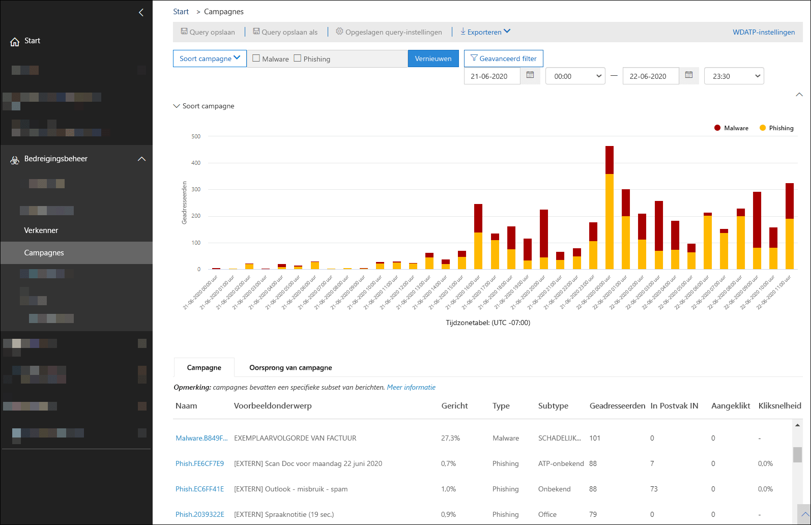
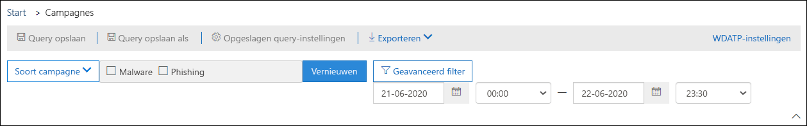
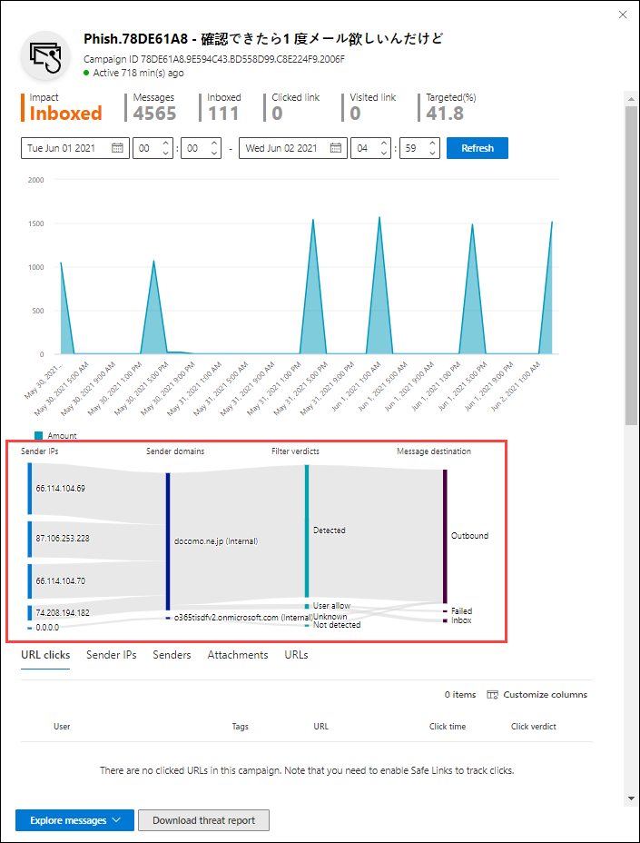

# Campagne weergaven in Microsoft Defender voor Office 365

[!INCLUDE [Microsoft 365 Defender rebranding](../includes/microsoft-defender-for-office.md)]

De weergave campagne is een functie in Microsoft Defender voor Office 365, abonnement 2 (bijvoorbeeld Microsoft 365 E5 of organisaties met een invoegtoepassing voor Office 365 voor Office). Met campagne weergaven in de beveiligings & nalevings centrum identificeert en categoriseert u phishing-aanvallen in de service. Met behulp van campagne weergaven kunt u:

- Onderzoek een efficiënt onderzoek en reageer op een malafide aanval.
- Beter inzicht in het reikwijdte van de aanval.
- Waarde weergeven voor beslissers.

Met campagne weergaven kunt u de grote afbeelding van een aanval sneller en helemaal compleet zien.

## Wat is een campagne?

Een campagne is een gecoördineerde aanval van een e-mailbericht voor een of meer organisaties. E-mail aanvallen waarbij referenties en bedrijfsgegevens worden gestolen, zijn een grote en lucrativee bedrijfstak. Aangezien technologieën in een inspanning toenemen, wijzigen ze hun methoden in een inspanning om ervoor te zorgen dat ze succes oplopen.

Microsoft profiteert van de enorme hoeveelheid anti-phishing, anti-spam en bescherming tegen malware via de volledige service, zodat u campagnes kunt identificeren. We analyseren en classificeren de informatie over aanvallen op basis van diverse factoren. Bijvoorbeeld:

- **Schadelijke bron**: de bron-IP-adressen en de e-mail domeinen van de afzender.
- **Berichteigenschappen**: de inhoud, stijl en Toon van de berichten.
- **Geadresseerden** van het bericht: met welke geadresseerden werken geadresseerden. Zoals de domeinnamen van de geadresseerden, de taakfuncties van de geadresseerde (beheerders, leidinggevenden, enzovoort), bedrijfstypen (groot, klein, openbaar, privé, enzovoort) en industrieën.
- **Nettolading** van een aanval: kwaadaardige koppelingen, bijlagen of andere nettoladingen in de berichten.

Een campagne kan korte tijd in beslag nemen of meerdere dagen, weken of maanden belopen met actieve en niet-actieve perioden. Er kan een campagne worden gestart voor uw specifieke organisatie of uw organisatie maakt deel uit van een grotere campagne in meerdere bedrijven.

## Campagne weergaven in het nalevings centrum voor beveiligings &

De weergave campagne is beschikbaar in het [beveiligings & compliance](https://protection.office.com) van een **Threat Management** \> **Campaigns**-campagne, of direct op <https://protection.office.com/campaigns> .

U kunt ook weergave van de campagne bekijken:

- **Threat Management** \> **Verkenner** \> **Weergave** \> Een **campagne**
- **Threat Management** \> **Verkenner** \> **Weergave** \> **Alle e-mailberichten** \> Tabblad **campagne**
- **Threat Management** \> **Verkenner** \> **Weergave** \> **Phishing** \> Tabblad **campagne**
- **Threat Management** \> **Verkenner** \> **Weergave** \> **Malware** \> Tabblad **campagne**

Voor de weergave van een campagne moet u lid zijn van de rollen groepen **Organisatiebeheer**, **beveiliging beheerder** of **beveiligings lezer** in het beveiligings & nalevings centrum. Zie [Machtigingen in het Beveiligings- & compliancecentrum](permissions-in-the-security-and-compliance-center.md) voor meer informatie.

## Overzicht van campagnes

Op de pagina overzicht vindt u informatie over alle campagnes.

Op het tabblad standaard **campagne** wordt in het gebied **type campagne** een staafdiagram weergegeven met het aantal geadresseerden per dag. In de grafiek worden standaard zowel de gegevens **phishing** als de **malware** weergegeven.

> [!TIP]
> Als u geen gegevens van een campagne ziet, probeer dan het datumbereik of de [filters](#filters-and-settings)te wijzigen.

De rest van de pagina overzicht bevat de volgende informatie op het tabblad **campagne** :

- **Naam**

- Voor **beeld van onderwerp**: het onderwerp van een van de berichten in de campagne. Houd er rekening mee dat alle berichten in de campagne niet noodzakelijkerwijs hetzelfde onderwerp hebben.

- **Targeted**: het percentage zoals berekend door: (het aantal geadresseerden van de campagne in uw organisatie)/(het totale aantal geadresseerden in de campagne voor alle organisaties in de service). Met deze waarde wordt aangegeven in welke mate de campagne uitsluitend wordt doorgestuurd naar uw organisatie (een hogere waarde) versus. ook op andere organisaties in de service (een lagere waarde).

- **Type**: deze waarde is een **phishing** of **malware**.

- **Subtype**: deze waarde bevat meer details over de campagne. Bijvoorbeeld:
  - **Phishing**: indien beschikbaar, het merk dat wordt door deze campagne verphishd. Bijvoorbeeld,, `Microsoft` , `365` `Unknown` `Outlook` of `DocuSign` .
  - **Malware**: bijvoorbeeld `HTML/PHISH` of `HTML/<MalwareFamilyName>` .

  Indien beschikbaar, het merk dat door deze campagne wordt verphishd. Wanneer de detectie wordt bestuurd door de technologie van Defender voor Office 365, wordt de **ATP-** voorvoegsel toegevoegd aan de waarde van het subtype.

- **Geadresseerden**: het aantal gebruikers dat is gericht op deze campagne.

- **Postvak in met postvak** in: het aantal gebruikers dat berichten van deze campagne heeft ontvangen in hun postvak in (niet bezorgd in de map Ongewenste e-mail).

- **Geklikt** op: het aantal gebruikers dat op de URL heeft geklikt of de bijlage in het malafide bericht heeft geopend.

- **Klik op rente**: het percentage zoals berekend door te **klikken** op  /  **Postvak in**. Deze waarde is een indicator van de effectiviteit van de campagne. Met andere woorden: als de geadresseerden het bericht als phishing konden identificeren en niet op de URL van de nettolading klikken.

  Houd er rekening mee dat **Klik op tarief** niet wordt gebruikt in malware-campagnes.

- **Bezocht**: hoeveel gebruikers hebben dit via de website van uw nettolading gemaakt. Als er op waarden werd **geklikt** , maar veilige koppelingen naar de website zijn geblokkeerd, is deze waarde nul.

Het tabblad **campagne oorsprong** bevat de berichten bronnen op een kaart van de wereld.

### Filters en instellingen

Boven aan de pagina met campagne weergaven vindt u diverse filter-en queryinstellingen waarmee u specifieke campagnes kunt zoeken en isoleren.

De meest basisfilters die u kunt uitvoeren, zijn de begindatum/-tijd en de einddatum en-tijd.

Als u de weergave verder wilt filteren, kunt u één eigenschap met meerdere waarden filteren door te klikken op de knop **campagnetype** , uw selectie te maken en vervolgens op **vernieuwen** te klikken.

De eigenschappen van de beschikbare campagne van de knop **campagnetype** worden beschreven in de volgende lijst:

- **Basis**:
  - **Type campagne**: Selecteer **malware** of **phishing**. Wanneer u de selecties uitschakelt, heeft dit hetzelfde resultaat als met beide.
  - **Naam van campagne**
  - **Subtype campagne**
  - **Afzender**
  - **Allen**
  - **Afzenderdomein**
  - **Onderwerp**
  - **Bestandsnaam van bijlage**
  - **Familie van malware**
  - **Tags**: gebruikers of groepen waarop de opgegeven gebruikerscode is toegepast (met inbegrip van prioriteits accounts). Zie voor meer informatie over gebruikers tags [User Tags](user-tags.md).
  - **Systeem overschrijvingen**
  - **Bezorgings actie**
  - **Extra actie**
  - **Richting**
  - **Detectietechnologie**
  - **Oorspronkelijke bezorgingslocatie**
  - **Nieuwste bezorgingslocatie**
  - **Systeem overschrijvingen**

- **Geavanceerd**:
  - **Internet bericht-id**: beschikbaar in het veld **bericht-id-** koptekst in de kop van het bericht. Een Voorbeeldwaarde is `<08f1e0f6806a47b4ac103961109ae6ef@server.domain>` (Let op de punthaken).
  - **Netwerkbericht-id**: een GUID-waarde die beschikbaar is in het veld **X-MS-Exchange-Organization-Network-Message-ID** in de kop van het bericht.
  - **IP van afzender**
  - **Bijlage sha256**: als u de sha256-hashwaarde van een bestand wilt zoeken in Windows, voert u de volgende opdracht uit op een opdrachtregel: `certutil.exe -hashfile "<Path>\<Filename>" SHA256` .
  - **Cluster-ID**
  - **ID van waarschuwings beleid**
  - **ZAP-URL-signaal**

- **Url's**:
  - **URL-domein**
  - **URL Domain en Path**
  - **URL**
  - **URL-pad**
  - **Klik op Verdict**

Voor uitgebreid filteren, waaronder filteren via meerdere eigenschappen, kunt u op de knop **Geavanceerd filter** klikken om een query te maken. De eigenschappen van dezelfde campagne zijn beschikbaar, maar met de volgende verbeteringen:

- U kunt op **een voorwaarde toevoegen** klikken om meerdere voorwaarden te selecteren.
- U kunt de operator **and** of **or** kiezen tussen voorwaarden.
- U kunt het item **voor de voorwaarde-groep** onder aan de lijst met voorwaarden selecteren om complexe samengestelde voorwaarden te vormen.

Wanneer u klaar bent, klikt u op de knop **query** .

Nadat u een basis-of Geavanceerd filter hebt gemaakt, kunt u dit opslaan met behulp van **query opslaan** of **query opslaan als**. Wanneer u later terugkeert naar de weergave campagne, kunt u een opgeslagen filter laden door te klikken op **opgeslagen queryinstellingen**.

Als u de grafiek of de lijst met campagnes wilt exporteren, klikt u op **exporteren** en selecteert u **grafiekgegevens exporteren** of **campagnelijst exporteren**.

Als u een abonnement voor Microsoft Defender voor eindpunten hebt, kunt u op **WDATP** klikken om verbinding te maken met de gegevens van de campagnes of de gegevens ervan te verbreken met Microsoft Defender for endpoints Zie [Microsoft Defender for Office 365 integreren met Microsoft Defender voor eindpunten](integrate-office-365-ti-with-wdatp.md)voor meer informatie.

## Campagne Details

Wanneer u op de naam van een campagne klikt, worden de gegevens van de campagne in een flyout weergegeven.

### Campagne-informatie

Boven in de weergave met campagnegegevens zijn de volgende gegevens van de campagne beschikbaar:

- **Id**: de unieke campagne-id.

- **Begonnen** en **beëindigd**: de begindatum en einddatum van de campagne. Houd er rekening mee dat deze datums mogelijk verder lopen dan de filter datums die u hebt geselecteerd op de pagina overzicht.

- **Impact**: deze sectie bevat de volgende gegevens voor het datumbereik dat u hebt geselecteerd (of die u in de tijdlijn selecteert):
  - Het totale aantal geadresseerden.
  - Het aantal berichten dat is verzonden naar het postvak in (dat wordt bezorgd in het postvak in, niet op de map Ongewenste E-mail).
  - Hoeveel gebruikers klikken op de URL-nettolading in het malafide bericht.
  - Howe veel gebruikers hebben de URL bezocht.

- **Targeted**: het percentage zoals berekend door: (het aantal geadresseerden van de campagne in uw organisatie)/(het totale aantal geadresseerden in de campagne voor alle organisaties in de service). Houd er rekening mee dat deze waarde wordt berekend over de volledige levensduur van de campagne en die niet wordt gewijzigd op basis van datumfilters.

- Een interactieve tijdlijn van een campagneactiviteit: de tijdlijn toont de activiteiten gedurende de hele levensduur van de campagne. Het gearceerd gebied bevat standaard het datumbereik filter dat u hebt geselecteerd in het overzicht. U kunt klikken en slepen om een specifiek beginpunt en eindpunt te selecteren, <u>waardoor de gegevens die worden weergegeven in het gebied met **impact** en op de rest van de pagina, zoals beschreven in de volgende secties, worden gewijzigd</u>.

U kunt op de titelbalk op de knop **campagne-afschrijven downloaden**  om de campagne details te downloaden naar een Word-document (standaard met de naam CampaignReport.docx). Houd er rekening mee dat het downloaden van de volledige levensduur van de campagne Details bevat (niet alleen de filter datums die u hebt geselecteerd).

### Campagne stroom

In het midden van de weergave met campagne Details worden belangrijke informatie over de campagne weergegeven in de sectie **stroom** in een horizontaal-stroomdiagram (genaamd een _Sankey_ -diagram). Met deze informatie kunt u inzicht krijgen in de elementen van de campagne en de potentiële impact van uw organisatie.

> [!TIP]
> De informatie die in het **stroom** diagram wordt weergegeven, wordt bepaald door het gearceerde datumbereik in de tijdlijn zoals beschreven in de vorige sectie.

Als u de muisaanwijzer over een horizontale band in het diagram houdt, ziet u het aantal gerelateerde berichten (bijvoorbeeld berichten van een bepaalde bron-IP, berichten van het bron-IP-adres met het opgegeven afzender domein, enzovoort).

Het diagram bevat de volgende informatie:

- **Ip's van afzender**
- **Zender domeinen**
- **Filter Verdicts**: verdict waarden zijn gerelateerd aan de beschikbare methoden voor phishing en spamfilters, zoals wordt beschreven in [anti spambericht koppen](anti-spam-message-headers.md). In de volgende tabel vindt u een beschrijving van de beschikbare waarden:

  ****

  |Waarde|Spam filter verdict|Beschrijving|
  |---|---|---|
  |**Ingesteld**|`SFV:SKN` 
 `SFV:SKI`|Het bericht is gemarkeerd als niet-spam en/of overgeslagen filters voordat ze worden geëvalueerd via spamfilters. Het bericht is bijvoorbeeld als geen spam gemarkeerd met een e-mail stroom regel (ook wel een transportregel genoemd). 
 Het bericht heeft geen spamfilters overgeslagen om andere redenen. De afzender en de geadresseerde lijken bijvoorbeeld in dezelfde organisatie.|
  |**Blokkeert**|`SFV:SKS`|Het bericht is gemarkeerd als spam voordat het werd geëvalueerd via spamfilters. Bijvoorbeeld met een e-mail stroom regel.|
  |**Aangetoond**|`SFV:SPM`|Het bericht is gemarkeerd als spam door het spamfilter.|
  |**Niet gedetecteerd**|`SFV:NSPM`|Het bericht is gemarkeerd als geen spam via spamfilters.|
  |**Uitgebracht**|`SFV:SKQ`|Het bericht heeft het filteren van spam genegeerd, omdat het is vrijgegeven uit Quarantine.|
  |**Tenant toestaan**\*|`SFV:SKA`|Het bericht heeft spam filteren genegeerd vanwege de instellingen in een antispambeleid. De afzender stond bijvoorbeeld in de lijst toegestane afzender of de lijst met toegestane domeinen.|
  |**Tenant blok**\*\*|`SFV:SKA`|Het bericht is geblokkeerd door spam te filteren op basis van de instellingen in een antispambeleid. De afzender stond bijvoorbeeld in de lijst toegestane afzender of de lijst met toegestane domeinen.|
  |**Gebruiker toestaan**\*|`SFV:SFE`|Het bericht is overgeslagen voor spam filteren omdat de afzender in de lijst met veilige afzenders van een gebruiker zich bevindt.|
  |**Gebruikers blok**\*\*|`SFV:BLK`|Het bericht is geblokkeerd door spam te filteren omdat de afzender in de lijst met geblokkeerde afzenders van een gebruiker was.|
  |**ZAP**|n/b|[Zero-Hour auto leegmaak (ZAP)](zero-hour-auto-purge.md) heeft het geleverde bericht verplaatst naar de map Ongewenste e-mail of Quarantine. U configureert de actie in uw antispambeleid.|
  |

  \* Controleer uw Antispambeleid, omdat het toegestane bericht waarschijnlijk door de dienst werd geblokkeerd.

  \*\* Controleer uw Antispambeleid, omdat deze berichten in quarantaine moeten worden geplaatst.

- **Bezorgingslocaties**: u wilt waarschijnlijk berichten onderzoeken die voor geadresseerden zijn afgeleverd (naar het postvak in of de map Ongewenste e-mail), zelfs als gebruikers niet op de URL van de nettolading in het bericht klikken. U kunt ook de in quarantaine geplaatste berichten verwijderen uit quarantaine. Zie voor meer informatie [Gequarantinee e-mailberichten in EOP](quarantine-email-messages.md).
  - **Map verwijderd**
  - **Drop**
  - **Extern**: de geadresseerde bevindt zich in de on-premises e-mail organisatie in hybride omgevingen.
  - **Mislukt**
  - **Ter**
  - **Postvak in**
  - **Map Ongewenste e-mail**
  - **Quarantaine**
  - **Unknown**

- **URL-klikken**: deze waarden worden beschreven in het volgende gedeelte.

> [!NOTE]
> Op alle lagen met meer dan 10 items worden de bovenste 10 items weergegeven, terwijl de rest in de **andere** lagen bijeen.

#### URL'S klikken

Wanneer een malafide bericht wordt bezorgd in het postvak in of de map Ongewenste E-mail van een geadresseerde, is er altijd een kans dat de gebruiker op de URL van de nettolading klikt. Het is niet mogelijk om op de URL te klikken, maar u moet eerst bepalen waarom het malafide e-mailbericht zelfs aan het postvak is bezorgd.

Als een gebruiker in het malafide e-mailbericht op de URL van de nettolading heeft geklikt, worden de acties weergegeven in het gebied voor de **URL-klikken** van het diagram in de weergave campagne Details.

- **Ingesteld**
- **BlockPage**: de geadresseerde heeft op de URL van de nettolading geklikt, maar de toegang tot de schadelijke website werd geblokkeerd door een beleid voor [veilige koppelingen](atp-safe-links.md) in uw organisatie.
- **BlockPageOverride**: de geadresseerde die in het bericht op de URL van de nettolading hebt geklikt, heeft veilige koppelingen geprobeerd ze te stoppen, maar ze kunnen het blok negeren. Controleer uw [beleid voor veilige koppelingen](set-up-atp-safe-links-policies.md) om te zien waarom gebruikers de verdict voor veilige koppelingen mogen negeren en doorgaan naar de schadelijke website.
- **PendingDetonationPage**: veilige bijlagen in Microsoft Defender voor Office 365 wordt geopend en onderzocht de URL van de nettolading in een virtuele computeromgeving.
- **PendingDetonationPageOverride**: de geadresseerde mag de detonatie procedure overschrijven en de URL openen zonder te hoeven wachten tot de resultaten.

### Tabvolgorde

Op de tabbladen in de weergave campagne Details kunt u de campagne verder onderzoeken.

> [!TIP]
> De informatie die wordt weergegeven op de tabbladen, wordt bepaald door het gearceerde datumbereik op de tijdlijn, zoals beschreven in de sectie [campagnegegevens](#campaign-information) .

- **URL-klikken**: als gebruikers niet op de URL van de nettolading in het bericht klikken, is dit gedeelte leeg. Als een gebruiker op de URL kon klikken, worden de volgende waarden ingevuld:
  - **Aanmeldings**\*
  - **URL**\*
  - **Klik op tijd**
  - **Klik op Verdict**

- **Ip's van afzender**
  - **IP van afzender**\*
  - **Totaal aantal**
  - **Postvak in**
  - **Niet in Postvak in**
  - **SPF doorgegeven**: de afzender is geauthenticeerd door het [beleidsraamwerk voor verzenders (SPF)](how-office-365-uses-spf-to-prevent-spoofing.md). Een afzender die niet voldoet aan de SPF-validatie, geeft een niet-geverifieerde afzender aan, of het bericht is spoofing voor een legitieme afzender.

- **Afzenders**
  - **Afzender**: dit is het werkelijke adres van de afzender in de SMTP-e-mail van de opdracht, wat niet het is: een e-mailadres dat gebruikers zien in hun e-mailclients.
  - **Totaal aantal**
  - **Postvak in**
  - **Niet in Postvak in**
  - **Dkim doorgegeven**: de afzender is geverifieerd door de [domein sleutels, die e-mail (dkim) heeft geïdentificeerd](support-for-validation-of-dkim-signed-messages.md). Een afzender die geen DKIM-validatie geeft, geeft een niet-geverifieerde afzender aan, of het bericht vervalst een legitiem afzender.
  - **DMARC doorgegeven**: de afzender is geverifieerd door [verificatie op basis van een domein op basis van een berichtverificatie, rapportering en conformiteit (DMARC)](use-dmarc-to-validate-email.md). Een afzender die geen DMARC-validatie geeft, geeft een niet-geverifieerde afzender aan, of het bericht vervalst een legitiem afzender.

- **Stukken**
  - **Namen**
  - **SHA256**
  - **Familie van malware**
  - **Totaal aantal**

- **URL**
  - **URL**\*
  - **Totaal aantal**

\* Als u op deze waarde klikt, wordt een nieuwe flyout geopend met meer informatie over het opgegeven item (gebruiker, URL, etc.) boven aan de weergave campagne Details. Als u wilt teruggaan naar de weergave met campagnegegevens, klikt u op **gereed** in de vervolgmenu nieuw.

### Hardwareknoppen

Met de knoppen in de weergave campagne Details kunt u de kracht van de bedreigings Verkenner gebruiken om de campagne verder te onderzoeken.

- **Campagne verkennen**: Hiermee opent u een nieuw tabblad Zoeken in de bedreiging van een nieuwe bedreiging met de waarde van de **campagne-id** als het zoekfilter.
- **Berichten in Postvak in verkennen**: Hiermee opent u een nieuw Zoek tabblad van de bedreigings Verkenner met behulp van de **campagne-id** en locatie van de **geadresseerde: Postvak in** als zoekfilter.
