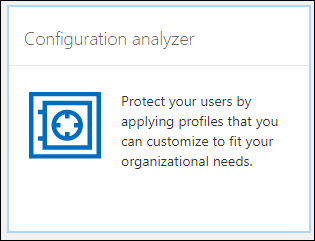
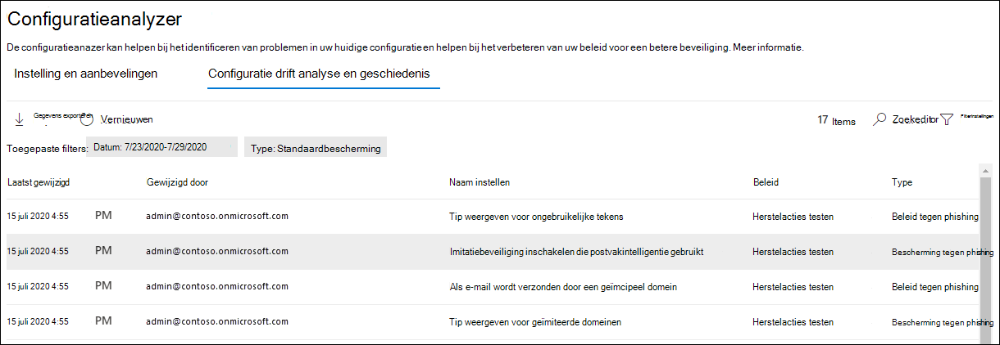

# Configuration analyzer voor beveiligingsbeleid in EOP en Microsoft Defender voor Office 365

[!INCLUDE [Microsoft 365 Defender rebranding](../includes/microsoft-defender-for-office.md)]

**Van toepassing op**
- [Exchange Online Protection](exchange-online-protection-overview.md)
- [Abonnement 1 en abonnement 2 voor Microsoft Defender voor Office 365](office-365-atp.md)
- [Microsoft 365 Defender](../mtp/microsoft-threat-protection.md)

Configuration Analyzer in het beveiligings- & Compliancecentrum biedt een centrale locatie voor het zoeken en herstellen van beveiligingsbeleid waarin de instellingen zich onder de instellingen Standaardbeveiliging en Strikt beveiligingsprofiel bevinden in vooraf ingestelde [beveiligingsbeleidsregels.](preset-security-policies.md)

De volgende soorten beleidsregels worden geanalyseerd met de configuration analyzer:

- **Beleidsregels voor Exchange Online Protection (EOP:** Dit geldt ook voor Microsoft 365-organisaties met Exchange Online-postvakken en zelfstandige EOP-organisaties zonder Exchange Online-postvakken:

  - [Antispambeleid.](configure-your-spam-filter-policies.md)
  - [Anti-malwarebeleid.](configure-anti-malware-policies.md)
  - [EOP Anti-phishingbeleid.](set-up-anti-phishing-policies.md#spoof-settings)

- Beleid van Microsoft Defender voor **Office 365:** dit geldt ook voor organisaties met Microsoft 365 E5- of Defender voor Office 365-abonnementen met invoegabonnementen:

  - Anti-phishingbeleid in Microsoft Defender voor Office 365, waaronder:

    - Dezelfde [spoof-instellingen](set-up-anti-phishing-policies.md#spoof-settings) die beschikbaar zijn in het anti-phishingbeleid van EOP.
    - [Imitatie-instellingen](set-up-anti-phishing-policies.md#impersonation-settings-in-anti-phishing-policies-in-microsoft-defender-for-office-365)
    - [Geavanceerde drempelwaarden voor phishing](set-up-anti-phishing-policies.md#advanced-phishing-thresholds-in-anti-phishing-policies-in-microsoft-defender-for-office-365)

  - [Beleid voor veilige koppelingen.](set-up-atp-safe-links-policies.md)

  - [Beleid voor veilige bijlagen.](set-up-atp-safe-attachments-policies.md)

De  waarden **voor** de beleidsinstelling Standaard en Strikt die als basislijnen worden gebruikt, worden beschreven in aanbevolen instellingen voor de beveiliging van EOP en Microsoft Defender voor [Office 365.](recommended-settings-for-eop-and-office365-atp.md)

## Wat moet u weten voordat u begint?

- U opent het beveiligings- en compliancecentrum in <https://protection.office.com/>. Als u rechtstreeks naar de **pagina Configuration analyzer wilt** gaan, gebruikt u <https://protection.office.com/configurationAnalyzer> .

- Zie [Verbinding maken met Exchange Online PowerShell](https://docs.microsoft.com/powershell/exchange/connect-to-exchange-online-powershell) als je verbinding wilt maken met Exchange Online PowerShell.

- Je moet beschikken over toegewezen machtigingen voor het uitvoeren van de procedures in dit onderwerp:
  - Als u de configuration **analyzer** wilt gebruiken en beveiligingsbeleid wilt verbeteren, moet u lid zijn van de rollengroepen **Organisatiebeheer** of **Beveiligingsbeheerder.**
  - Voor alleen-lezen toegang tot de configuration analyzer moet  u lid zijn van de rollengroepen Globale lezer of **Beveiligingslezer.**

  Zie [Machtigingen in het Beveiligings- & compliancecentrum](permissions-in-the-security-and-compliance-center.md) voor meer informatie.

  > [!NOTE]
  >  
  > - Gebruikers toevoegen aan de overeenkomstige Azure Active Directory-rol in het Microsoft 365-beheercentrum geeft gebruikers de benodigde machtigingen in het Beveiligings- en compliancecentrum _en_ machtigingen voor andere functies in Microsoft 365. Zie[Over beheerdersrollen](../../admin/add-users/about-admin-roles.md) voor meer informatie.
  >
  > - De functiegroep **Alleen-lezen organisatiebeheer** in [Exchange Online](https://docs.microsoft.com/Exchange/permissions-exo/permissions-exo#role-groups) geeft ook alleen-lezentoegang tot deze functie.

## De configuration analyzer in het beveiligings- & compliancecentrum gebruiken

Ga in het & Compliancecentrum naar **Threat Management** \> **Policy** Configuration \> **analyzer.**

De configuration analyzer heeft twee hoofdtabbladen:

- **Instellingen en aanbevelingen: u** kiest Standaard of Strikt en vergelijkt deze instellingen met uw bestaande beveiligingsbeleid. In de resultaten kunt u de waarden van uw instellingen aanpassen om ze naar hetzelfde niveau als Standaard of Strikt te brengen.

- **Configuratieanalyse en geschiedenis:** in deze weergave kunt u beleidswijzigingen in de tijd bijhouden.

### Tabblad Instellingen en aanbevelingen in de configuration analyzer

Standaard wordt het tabblad geopend in de vergelijking met het standaardbeveiligingsprofiel. U kunt overschakelen naar de vergelijking van het profiel Voor strikte beveiliging door te klikken op **Strikte aanbevelingen weergeven.** Als u wilt teruggaan, **selecteert u Standaardaanbevelingen weergeven.**

Standaard bevat de kolom **Groep-/instellingsnaam** een samengevouwen weergave van de verschillende typen beveiligingsbeleidsregels en het aantal instellingen dat moet worden verbeterd (indien van beide). De soorten beleidsregels zijn:

- **Antispam**
- **Anti-phishing**
- **Anti-malware**
- **Veilige bijlagen met ATP** (als Uw abonnement Microsoft Defender voor Office 365 omvat)
- **Veilige koppelingen met ATP** (als Uw abonnement Microsoft Defender voor Office 365 omvat)

In de standaardweergave is alles samengevouwen. Naast elk beleid ziet u een overzicht van de vergelijkingsresultaten van uw beleid (dat u kunt wijzigen) en de instellingen in het bijbehorende beleid voor de standaard- of strikte beveiligingsprofielen (die u niet kunt wijzigen). U ziet de volgende informatie voor het beveiligingsprofiel dat u wilt vergelijken:

- **Groen:** alle instellingen in alle bestaande beleidsregels zijn ten minste even veilig als het beveiligingsprofiel.
- **Oranje:** een klein aantal instellingen in het bestaande beleid is niet zo veilig als het beveiligingsprofiel.
- **Rood:** een aanzienlijk aantal instellingen in het bestaande beleid is niet zo veilig als het beveiligingsprofiel. Dit kunnen enkele instellingen in veel beleidsregels of veel instellingen in één beleid zijn.

Voor vergelijkingen ziet u de tekst: **Alle instellingen volgen** \<**Standard** or **Strict**\> **aanbevelingen.** Anders ziet u het aantal aanbevolen instellingen dat u kunt wijzigen.

Als u de naam **van de beleidsgroep/instelling** uitbreidt, worden alle beleidsregels en de bijbehorende instellingen in elk specifiek beleid die aandacht nodig hebben, bekend. Of u kunt een specifiek type beleid (bijvoorbeeld **antispambeleid)** uitbreiden om alleen die instellingen te zien in die soorten beleidsregels die uw aandacht vereisen.

Als de vergelijking geen aanbevelingen voor verbetering (groen) heeft, wordt er niets gevonden als u het beleid uitbreidt. Als er een aantal aanbevelingen voor verbetering (oranje of rood) is, worden de instellingen die aandacht nodig hebben, bekend en worden corresponderende informatie in de volgende kolommen gegeven:

- De naam van de instelling die uw aandacht vereist. In de vorige schermafbeelding is dit bijvoorbeeld de drempelwaarde voor bulkmail **in** een antispambeleid.

- **Beleid:** de naam van het betreffende beleid dat de instelling bevat.

- **Toegepast op:** het aantal gebruikers op waar de betreffende beleidsregels op worden toegepast.

- **Huidige configuratie:** de huidige waarde van de instelling.

- **Laatst gewijzigd:** de datum waarop het beleid voor het laatst is gewijzigd.

- **Aanbevelingen:** de waarde van de instelling in het standaard- of strikt beveiligingsprofiel. Als u de waarde van de instelling in uw beleid wilt wijzigen om deze overeen te laten komen met de aanbevolen waarde in het beveiligingsprofiel, klikt u op **Goedkeuren.** Als de wijziging is geslaagd, ziet u het bericht: **Aanbevelingen zijn aangenomen.** Klik **op** Vernieuwen om het beperkte aantal aanbevelingen en het verwijderen van de specifieke instelling/beleidsrij uit de resultaten te zien.

### Het tabblad Configuratieanalyse en Geschiedenis in de configuration analyzer

Op dit tabblad kunt u de wijzigingen bijhouden die u in uw aangepaste beveiligingsbeleid hebt aangebracht. Standaard wordt de volgende informatie weergegeven:

- **Laatst gewijzigd**
- **Gewijzigd door**
- **Naam van instelling**
- **Beleid**
- **Type**

Klik op **Filter** om de resultaten te filteren. In de **flyout** Filters die wordt weergegeven, kunt u een van de volgende filters selecteren:

- **Begintijd** en **eindtijd** (datum)
- **Standaardbeveiliging** of **strikte beveiliging**

Als u de resultaten naar een CSV-bestand wilt exporteren, klikt u op **Exporteren.**

