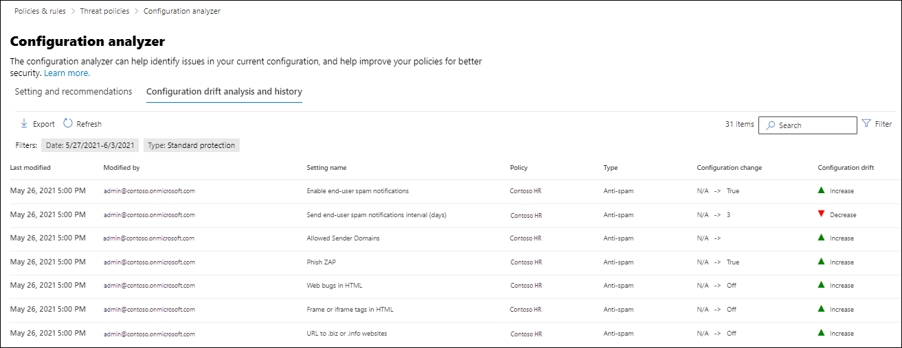

# Configuratieanalyse voor beveiligingsbeleid in EOP en Microsoft Defender voor Office 365Configuration analyzer for protection policies in EOP and Microsoft Defender for Office 365

[!INCLUDE [Microsoft 365 Defender rebranding](../includes/microsoft-defender-for-office.md)]

**Van toepassing op****Applies to**
- [Exchange Online ProtectionExchange Online Protection](exchange-online-protection-overview.md)
- [Abonnement 1 en abonnement 2 voor Microsoft Defender voor Office 365Microsoft Defender for Office 365 plan 1 and plan 2](office-365-atp.md)
- [Microsoft 365 DefenderMicrosoft 365 Defender](../mtp/microsoft-threat-protection.md)

Configuratieanalyse in het Beveiligings- & Compliancecentrum biedt een centrale locatie om beveiligingsbeleid te zoeken en op te lossen, waar de instellingen zich onder de instellingen Standaardbeveiligings- en Strikt beveiligingsprofiel bevinden in vooraf ingestelde [beveiligingsbeleidsregels.](preset-security-policies.md)Configuration analyzer in the Security & Compliance center provides a central location to find and fix security policies where the settings are below the Standard protection and Strict protection profile settings in [preset security policies](preset-security-policies.md).

De volgende typen beleid worden geanalyseerd door de configuratieanalyse:The following types of policies are analyzed by the configuration analyzer:

- **EOP-beleid (Exchange Online Protection)**: Dit geldt ook voor Microsoft 365-organisaties met Exchange Online-postvakken en zelfstandige EOP-organisaties zonder Exchange Online-postvakken:**Exchange Online Protection (EOP) policies**: This includes Microsoft 365 organizations with Exchange Online mailboxes and standalone EOP organizations without Exchange Online mailboxes:

  - [Antispambeleid.](configure-your-spam-filter-policies.md)[Anti-spam policies](configure-your-spam-filter-policies.md).
  - [Anti-malwarebeleid.](configure-anti-malware-policies.md)[Anti-malware policies](configure-anti-malware-policies.md).
  - [EOP Anti-phishingbeleid](set-up-anti-phishing-policies.md#spoof-settings).[EOP Anti-phishing policies](set-up-anti-phishing-policies.md#spoof-settings).

- **Microsoft Defender voor Office 365-beleid:** Dit geldt ook voor organisaties met Microsoft 365 E5- of Defender voor Office 365-invoegabonnementen:**Microsoft Defender for Office 365 policies**: This includes organizations with Microsoft 365 E5 or Defender for Office 365 add-on subscriptions:

  - Anti-phishingbeleid in Microsoft Defender voor Office 365, waaronder:Anti-phishing policies in Microsoft Defender for Office 365, which include:

    - Dezelfde [spoofinstellingen die](set-up-anti-phishing-policies.md#spoof-settings) beschikbaar zijn in het anti-phishingbeleid van EOP.The same [spoof settings](set-up-anti-phishing-policies.md#spoof-settings) that are available in the EOP anti-phishing policies.
    - [Instellingen voor imitatieImpersonation settings](set-up-anti-phishing-policies.md#impersonation-settings-in-anti-phishing-policies-in-microsoft-defender-for-office-365)
    - [Geavanceerde phishingdrempelsAdvanced phishing thresholds](set-up-anti-phishing-policies.md#advanced-phishing-thresholds-in-anti-phishing-policies-in-microsoft-defender-for-office-365)

  - [Beleid voor veilige koppelingen](set-up-atp-safe-links-policies.md).[Safe Links policies](set-up-atp-safe-links-policies.md).

  - [Beleid voor veilige bijlagen.](set-up-atp-safe-attachments-policies.md)[Safe Attachments policies](set-up-atp-safe-attachments-policies.md).

De **waarden standaard** en **strikt** beleid die als basislijnen worden gebruikt, worden beschreven in aanbevolen instellingen voor EOP- en Microsoft Defender voor Office [365-beveiliging.](recommended-settings-for-eop-and-office365-atp.md)The **Standard** and **Strict** policy setting values that are used as baselines are described in [Recommended settings for EOP and Microsoft Defender for Office 365 security](recommended-settings-for-eop-and-office365-atp.md).

## Wat moet u weten voordat u begint?What do you need to know before you begin?

- U opent het Beveiligings- en compliancecentrum in <https://protection.office.com/>.You open the Security & Compliance Center at <https://protection.office.com/>. Als u rechtstreeks naar de **pagina Configuratieanalyse wilt** gaan, gebruikt u <https://protection.office.com/configurationAnalyzer> .To go directly to the **Configuration analyzer** page, use <https://protection.office.com/configurationAnalyzer>.

- Zie [Verbinding maken met Exchange Online PowerShell](/powershell/exchange/connect-to-exchange-online-powershell) als je verbinding wilt maken met Exchange Online PowerShell.To connect to Exchange Online PowerShell, see [Connect to Exchange Online PowerShell](/powershell/exchange/connect-to-exchange-online-powershell).

- Je moet beschikken over toegewezen machtigingen voor het uitvoeren van de procedures in dit onderwerp:You need to be assigned permissions in the Security & Compliance Center before you can do the procedures in this article:
  - Als u de configuratieanalyse wilt gebruiken **en** updates voor beveiligingsbeleid wilt uitvoeren, moet u lid zijn van de rollengroepen **Organisatiebeheer** of **Beveiligingsbeheerder.**To use the configuration analyzer **and** make updates to security policies, you need to be a member of the **Organization Management** or **Security Administrator** role groups.
  - Voor alleen-lezen toegang tot de configuratieanalyse moet u lid zijn van de rollengroepen **Globale** lezer of **Beveiligingslezer.**For read-only access to the configuration analyzer, you need to be a member of the **Global Reader** or **Security Reader** role groups.

  Zie [Machtigingen in het Beveiligings- & compliancecentrum](permissions-in-the-security-and-compliance-center.md) voor meer informatie.For more information, see [Permissions in the Security & Compliance Center](permissions-in-the-security-and-compliance-center.md).

  > [!NOTE]
  >  
  > - Gebruikers toevoegen aan de overeenkomstige Azure Active Directory-rol in het Microsoft 365-beheercentrum geeft gebruikers de benodigde machtigingen in het Beveiligings- en compliancecentrum _en_ machtigingen voor andere functies in Microsoft 365.Adding users to the corresponding Azure Active Directory role in the Microsoft 365 admin center gives users the required permissions in the Security & Compliance Center _and_ permissions for other features in Microsoft 365. Zie[Over beheerdersrollen](../../admin/add-users/about-admin-roles.md) voor meer informatie.For more information, see [About admin roles](../../admin/add-users/about-admin-roles.md).
  >
  > - De functiegroep **Alleen-lezen organisatiebeheer** in [Exchange Online](/Exchange/permissions-exo/permissions-exo#role-groups) geeft ook alleen-lezentoegang tot deze functie.The **View-Only Organization Management** role group in [Exchange Online](/Exchange/permissions-exo/permissions-exo#role-groups) also gives read-only access to the feature.

## De configuratieanalyse gebruiken in het beveiligings- & compliancecentrumUse the configuration analyzer in the Security & Compliance Center

Ga in het & compliancecentrum naar **Beleidsanalyse voor bedreigingsbeheer** \>  \> .In the Security & Compliance Center, go to **Threat management** \> **Policy** \> **Configuration analyzer**.

De configuratieanalyse heeft twee hoofdtabbladen:The configuration analyzer has two main tabs:

- **Instellingen en aanbevelingen:** U kiest Standaard of Strikt en vergelijkt deze instellingen met uw bestaande beveiligingsbeleid.**Settings and recommendations**: You pick Standard or Strict and compare those settings to your existing security policies. In de resultaten kunt u de waarden van uw instellingen aanpassen om deze op hetzelfde niveau te brengen als Standaard of Strikt.In the results, you can adjust the values of your settings to bring them up to the same level as Standard or Strict.

- **Configuratiedriftanalyse en -geschiedenis:** met deze weergave kunt u beleidswijzigingen in de tijd bijhouden.**Configuration drift analysis and history**: This view allows you to track policy changes over time.

### Tabblad Instellingen en aanbevelingen in de configuratieanalyseSetting and recommendations tab in the configuration analyzer

Standaard wordt het tabblad geopend in de vergelijking met het standaardbeveiligingsprofiel.By default, the tab opens on the comparison to the Standard protection profile. U kunt overschakelen naar de vergelijking van het beveiligingsprofiel Strikt door op Strikte aanbevelingen **weergeven te klikken.**You can switch to the comparison of the Strict protection profile by clicking **View Strict recommendations**. Als u wilt teruggaan, **selecteert u Standaardaanbevelingen weergeven.**To switch back, select **View Standard recommendations**.

Standaard bevat de kolom **Beleidsgroep/instellingsnaam** een samengevouwen weergave van de verschillende typen beveiligingsbeleid en het aantal instellingen dat moet worden verbeterd (indien van beide).By default, the **Policy group/setting name** column contains a collapsed view of the different types of security policies and the number of settings that need improvement (if any). De typen beleidsregels zijn:The types of policies are:

- **Antispam****Anti-spam**
- **Anti-phishing****Anti-phishing**
- **Anti-malware****Anti-malware**
- **ATP Safe Attachments** (als uw abonnement Microsoft Defender voor Office 365 bevat)**ATP Safe Attachments** (if your subscription includes Microsoft Defender for Office 365)
- **ATP Safe Links** (als uw abonnement Microsoft Defender voor Office 365 bevat)**ATP Safe Links** (if your subscription includes Microsoft Defender for Office 365)

In de standaardweergave wordt alles samengevouwen.In the default view, everything is collapsed. Naast elk beleid ziet u een overzicht van de vergelijkingsresultaten van uw beleid (dat u kunt wijzigen) en de instellingen in het bijbehorende beleid voor de standaard- of strikte beveiligingsprofielen (die u niet kunt wijzigen).Next to each policy, there's a summary of comparison results from your policies (which you can modify) and the settings in the corresponding policies for the Standard or Strict protection profiles (which you can't modify). U ziet de volgende informatie voor het beveiligingsprofiel dat u vergelijkt met:You'll see the following information for the protection profile that you're comparing to:

- **Groen:** Alle instellingen in alle bestaande beleidsregels zijn ten minste even veilig als het beveiligingsprofiel.**Green**: All settings in all existing policies are at least as secure as the protection profile.
- **Oranje:** Een klein aantal instellingen in het bestaande beleid is niet zo veilig als het beveiligingsprofiel.**Amber**: A small number of settings in the existing policies are not as secure as the protection profile.
- **Rood:** Een aanzienlijk aantal instellingen in het bestaande beleid is niet zo veilig als het beveiligingsprofiel.**Red**: A significant number of settings in the existing policies are not as secure as the protection profile. Dit kunnen enkele instellingen zijn in veel beleidsregels of veel instellingen in één beleid.This could be a few settings in many policies or many settings in one policy.

Voor gunstige vergelijkingen ziet u de tekst: **Alle instellingen volgen** \<**Standard** or **Strict**\> **aanbevelingen.**For favorable comparisons, you'll see the text: **All settings follow** \<**Standard** or **Strict**\> **recommendations**. Anders ziet u het aantal aanbevolen instellingen dat u wilt wijzigen.Otherwise, you'll see the number of recommended settings to change.

Als u de **naam van de groep Beleid/instelling** uitv vouwt, worden alle beleidsregels en de bijbehorende instellingen in elk specifiek beleid die aandacht vereisen, openbaar.If you expand **Policy group/setting name**, all of the policies and the associated settings in each specific policy that require attention are revealed. U kunt ook een specifiek type beleid (bijvoorbeeld **Antispam)** uitbreiden om alleen die instellingen weer te geven in de beleidtypen die uw aandacht vereisen.Or, you can expand a specific type of policy (for example, **Anti-spam**) to see just those settings in those types of policies that require your attention.

Als de vergelijking geen aanbevelingen voor verbetering (groen) heeft, laat het uitbreiden van het beleid niets zien.If the comparison has no recommendations for improvement (green), expanding the policy reveals nothing. Als er een aantal aanbevelingen voor verbetering (oranje of rood) zijn, worden de instellingen die aandacht vereisen, onthuld en worden de bijbehorende informatie in de volgende kolommen aan het licht komen:If there are any number of recommendations for improvement (amber or red), the settings that require attention are revealed, and corresponding information is revealed in the following columns:

- De naam van de instelling die uw aandacht vereist.The name of the setting that requires your attention. In de vorige schermafbeelding is het bijvoorbeeld de drempelwaarde Voor bulksgewijs e-mail **in** een antispambeleid.For example, in the previous screenshot, it's the **Bulk email threshold** in an anti-spam policy.

- **Beleid:** de naam van het betreffende beleid dat de instelling bevat.**Policy**: The name of the affected policy that contains the setting.

- **Toegepast op**: Het aantal gebruikers waar het betreffende beleid op wordt toegepast.**Applied to**: The number of users that the affected policies are applied to.

- **Huidige configuratie:** de huidige waarde van de instelling.**Current configuration**: The current value of the setting.

- **Laatst gewijzigd:** de datum waarop het beleid voor het laatst is gewijzigd.**Last modified**: The date that the policy was last modified.

- **Aanbevelingen:** De waarde van de instelling in het beveiligingsprofiel Standaard of Strikt.**Recommendations**: The value of the setting in the Standard or Strict protection profile. Als u de waarde van de instelling in uw beleid wilt wijzigen op de aanbevolen waarde in het beveiligingsprofiel, klikt u op **Goedkeuren.**To change the value of the setting in your policy to match the recommended value in the protection profile, click **Adopt**. Als de wijziging is gelukt, ziet u het bericht: **Aanbevelingen zijn goedgekeurd.**If the change is successful, you'll see the message: **Recommendations successfully adopted**. Klik **op** Vernieuwen om het beperkte aantal aanbevelingen weer te geven en de specifieke rij met instellingen/beleid uit de resultaten te verwijderen.Click **Refresh** to see the reduced number of recommendations, and the removal of the specific setting/policy row from the results.

### Tabblad Configuratiedriftanalyse en -geschiedenis in de configuratieanalyseConfiguration drift analysis and history tab in the configuration analyzer

Op dit tabblad kunt u de wijzigingen bijhouden die u hebt aangebracht in uw aangepaste beveiligingsbeleid.This tab allows you to track the changes that you've made to your custom security policies. Standaard worden de volgende gegevens weergegeven:By default, the following information is displayed:

- **Laatst gewijzigd****Last modified**
- **Gewijzigd door****Modified by**
- **Naam instellen****Setting Name**
- **Beleid****Policy**
- **Type****Type**

Klik op **Filter** om de resultaten te filteren.To filter the results, click **Filter**. In het **flyout** Filters dat wordt weergegeven, kunt u kiezen uit de volgende filters:In the **Filters** flyout that appears, you can select from the following filters:

- **Begintijd** **en eindtijd** (datum)**Start time** and **End time** (date)
- **Standaardbeveiliging** of **Strikte beveiliging****Standard protection** or **Strict protection**

Als u de resultaten wilt exporteren naar een CSV-bestand, klikt u op **Exporteren.**To export the results to a .csv file, click **Export**.

