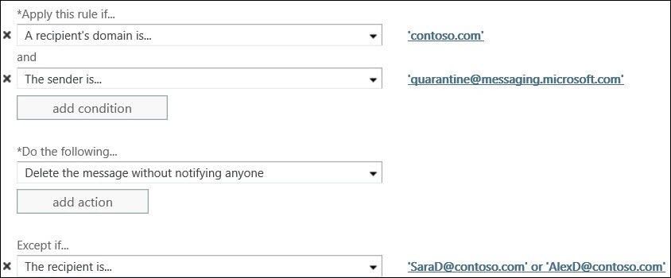

# Spammeldingen voor eindgebruikers configureren in EOPConfigure end-user spam notifications in EOP
  
> [!IMPORTANT]
> Dit onderwerp is voor zelfstandige klanten van Exchange Online Protection (EOP) die on-premises mailboxen beschermen.This topic is for Exchange Online Protection (EOP) standalone customers who are protecting on-premises mailboxes. Exchange Online-klanten die door de cloud gehoste postvakken beschermen, moeten in plaats daarvan het volgende onderwerp lezen: [Spammeldingen](configure-end-user-spam-notifications-in-exchange-online.md)voor eindgebruikers configureren in Exchange Online .Exchange Online customers who are protecting cloud-hosted mailboxes should read the following topic instead: [Configure end-user spam notifications in Exchange Online](configure-end-user-spam-notifications-in-exchange-online.md). 
  
U spammeldingen van eindgebruikers configureren voor het standaardbeleid voor spamfilter voor het hele bedrijf of voor aangepast spamfilterbeleid.You can configure end-user spam notifications for the default company-wide spam filter policy or for custom spam filter policies. Als u spammeldingen van eindgebruikers inschakelt, kunnen uw gebruikers hun eigen spam-, bulk- en phishingberichten beheren.Enabling end-user spam notification messages lets your users manage their own quarantined spam, bulk, and phishing messages. 
  
Spammeldingen van eindgebruikers bevatten een lijst met alle spamberichten die de eindgebruiker heeft ontvangen gedurende een periode die u configureert (u een waarde opgeven tussen 1 en 15 dagen).End-user spam notifications contain a list of all spam-quarantined messages that the end user has received during a time period that you configure (you can specify a value between 1 and 15 days). U ook de taal configureren waarin het meldingsbericht is geschreven.You can also configure the language in which the notification message is written.
  
Na ontvangst van een meldingsbericht kunnen eindgebruikers kiezen uit de volgende opties:After receiving a notification message, end users can choose from the following options:

**Afzender blokkeren** als u wilt dat Office 365 de afzender toevoegt aan de lijst met geblokkeerde afzenders.**Block Sender** if you want Office 365 to add the sender to your blocked senders list.

**Laat vrij** als het bericht geen spam is en u wilt dat Office 365 het bericht naar uw postvak verzendt.**Release** if the message isn't spam and you want Office 365 to send the message to your mailbox.

**Controleer** of u naar de quarantaineportal in het Beveiligings- en Nalevingscentrum wilt navigeren als u andere acties wilt uitvoeren, zoals Voorbeeld of Release.**Review** to navigate to the Quarantine Portal within the Security and Compliance Center if you want to take other actions, such as Preview or Release.
  
## Wat moet u weten voordat u begint?What do you need to know before you begin?

Geschatte tijd om te voltooien: 5 minutenEstimated time to complete: 5 minutes
  
U moet beschikken over bepaalde machtigingen om deze procedure of procedures te kunnen uitvoeren.You need to be assigned permissions before you can perform this procedure or procedures. Zie de vermelding 'Antispam' in het onderwerp [Functiemachtigingen in het eOP-onderwerp](feature-permissions-in-eop.md) om te zien welke machtigingen u nodig hebt.To see what permissions you need, see the "Anti-spam" entry in the [Feature permissions in EOP](feature-permissions-in-eop.md) topic. 
  
Zie [Sneltoetsen voor het Exchange-beheercentrum in Exchange Online voor](https://docs.microsoft.com/Exchange/accessibility/keyboard-shortcuts-in-admin-center)informatie over sneltoetsen die van toepassing kunnen zijn op de procedures in dit onderwerp.For information about keyboard shortcuts that may apply to the procedures in this topic, see [Keyboard shortcuts for the Exchange admin center in Exchange Online](https://docs.microsoft.com/Exchange/accessibility/keyboard-shortcuts-in-admin-center).
  
## De EAC gebruiken om spammeldingen van eindgebruikers te configurerenUse the EAC to configure end-user spam notifications

1. Navigeer in het Exchange Admin Center (EAC) naar**het spamfilter** **beveiliging** > .In the Exchange Admin Center (EAC), navigate to **Protection** > **Spam filter**.
    
2. Selecteer het inhoudsfilterbeleid waarvoor u spammeldingen van eindgebruikers wilt inschakelen (deze zijn standaard uitgeschakeld).Select the content filter policy for which you want to enable end-user spam notifications (they are disabled by default).
    
3. Klik in het rechterdeelvenster, waar de overzichtsgegevens over uw beleid worden weergegeven, op de koppeling **Spammeldingen voor** eindgebruikers configureren.In the right pane, where the summary information about your policy appears, click the **Configure End-user spam notifications** link. 
    
4. In het volgende dialoogvenster u de volgende opties configureren:In the subsequent dialog box, you can configure the following options:
    
1. **Spammeldingen** van eindgebruikers inschakelen Schakel dit selectievakje in om spammeldingen van eindgebruikers voor dit beleid in te schakelen.**Enable end-user spam notifications** Select this check box in order to enable end-user spam notifications for this policy. (Als dit beleid omgekeerd is ingeschakeld, u dit selectievakje uitschakelen om spammeldingen van eindgebruikers voor dit beleid uit te schakelen.)(Conversely, if this policy is enabled, you can clear this check box in order to disable end-user spam notifications for this policy.) 
    
2. **Stuur elke (dagen) spammeldingen van eindgebruikers** Geef op hoe vaak spammeldingen van eindgebruikers moeten worden verzonden.**Send end-user spam notifications every (days)** Specify how often to send end-user spam notifications. De standaardinstelling is 3 dagen.The default is 3 days. U opgeven tussen 1 en 15 dagen.You can specify between 1 and 15 days. Als u bijvoorbeeld 7 dagen opgeeft, bevat de melding een lijst met alle berichten die in de afgelopen 7 dagen voor die gebruiker zijn bedoeld en die in plaats daarvan naar de spamquarantaine zijn verzonden.If you specify 7 days, for example, the notification will include a list of all messages intended for that user within the past 7 days that were sent to the spam quarantine instead. 
    
3. **Meldingstaal** Selecteer met de vervolgkeuzelijst de taal om spammeldingen van eindgebruikers voor dit beleid te schrijven.**Notification language** Using the drop-down list, select the language in which to write end-user spam notifications for this policy. 
    
5. Klik **op Opslaan**.Click **save**. Een overzicht van de beleidsinstellingen van uw inhoudsfilter, inclusief de instellingen voor spammeldingen van uw eindgebruiker, wordt in het rechterdeelvenster weergegeven.A summary of your content filter policy settings, including your end-user spam notification settings, appears in the right pane.
    
> [!NOTE]
>  Spammeldingen van eindgebruikers zijn alleen functioneel voor het beleid voor inhoudsfilter dat is ingeschakeld.End-user spam notifications will only be functional for content filter policies that are enabled. > spammeldingen van eindgebruikers worden slechts één keer per dag verzonden.>  End-user spam notifications are only sent once per day. De levertijd van de melding kan niet worden gegarandeerd voor een specifieke klant en is niet configureerbaar.The delivery time of the notification cannot be guaranteed for any specific customer and is not configurable. 
  
 **Tip:** Als u spammeldingen van eindgebruikers wilt testen door ze naar een beperkte groep gebruikers te sturen voordat u ze volledig implementeert, maakt u een aangepast inhoudsfilterbeleid waarmee spammeldingen van eindgebruikers kunnen worden uitgevoerd voor de domeinen waarin de gebruikers zich bevinden.**Tip:** If you want to test end-user spam notifications by sending them to a limited set of users before fully implementing them, create a custom content filter policy that enables end-user spam notifications for the domains in which the users reside. Maak vervolgens in de EAC onder regels voor \*\*de e-mailstroom \> \*\*een e-mailstroomregel (ook wel een transportregel genoemd) om berichten te blokkeren vanaf quarantine@messaging.microsoft.com (het e-mailadres dat meldingen verzendt) met uitzonderingen voor de gebruikers die u de meldingen wilt ontvangen.Then, in the EAC, under **Mail flow \> rules**, create a mail flow rule (also known as a transport rule) to block messages from quarantine@messaging.microsoft.com (the email address that sends notifications) with exceptions for the users who you want to receive the notifications. De volgende afbeelding is een voorbeeld van het maken van een uitzondering voor twee gebruikers (SaraD en AlexD) van domein Contoso.com:The following image is an example of creating an exception for two users (SaraD and AlexD) from domain Contoso.com: 
  

  
## Voor meer informatieFor more information

[Uw spamfilterbeleid configurerenConfigure your spam filter policies](configure-your-spam-filter-policies.md)
  
