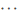

# <a name="configure-anti-phishing-policies-in-microsoft-defender-for-office-365"></a><span data-ttu-id="861f5-103">Anti-phishingbeleid configureren in Microsoft Defender voor Office 365</span><span class="sxs-lookup"><span data-stu-id="861f5-103">Configure anti-phishing policies in Microsoft Defender for Office 365</span></span>

[!INCLUDE [Microsoft 365 Defender rebranding](../includes/microsoft-defender-for-office.md)]

<span data-ttu-id="861f5-104">**Van toepassing op**</span><span class="sxs-lookup"><span data-stu-id="861f5-104">**Applies to**</span></span>
- [<span data-ttu-id="861f5-105">Abonnement 1 en abonnement 2 voor Microsoft Defender voor Office 365</span><span class="sxs-lookup"><span data-stu-id="861f5-105">Microsoft Defender for Office 365 plan 1 and plan 2</span></span>](defender-for-office-365.md)
- [<span data-ttu-id="861f5-106">Microsoft 365 Defender</span><span class="sxs-lookup"><span data-stu-id="861f5-106">Microsoft 365 Defender</span></span>](../defender/microsoft-365-defender.md)

<span data-ttu-id="861f5-107">Anti-phishingbeleid in [Microsoft Defender voor Office 365](defender-for-office-365.md) kan uw organisatie helpen beschermen tegen kwaadaardige phishingaanvallen op basis van imitaties en andere soorten phishingaanvallen.</span><span class="sxs-lookup"><span data-stu-id="861f5-107">Anti-phishing policies in [Microsoft Defender for Office 365](defender-for-office-365.md) can help protect your organization from malicious impersonation-based phishing attacks and other types of phishing attacks.</span></span> <span data-ttu-id="861f5-108">Zie [Anti-phishingbeveiliging](anti-phishing-protection.md)voor meer informatie over de verschillen tussen anti-phishingbeleid in Exchange Online Protection (EOP) en anti-phishingbeleid in Microsoft Defender voor Office 365.</span><span class="sxs-lookup"><span data-stu-id="861f5-108">For more information about the differences between anti-phishing policies in Exchange Online Protection (EOP) and anti-phishing policies in Microsoft Defender for Office 365, see [Anti-phishing protection](anti-phishing-protection.md).</span></span>

<span data-ttu-id="861f5-109">Beheerders kunnen het standaard anti-phishingbeleid weergeven, bewerken en configureren (maar niet verwijderen).</span><span class="sxs-lookup"><span data-stu-id="861f5-109">Admins can view, edit, and configure (but not delete) the default anti-phishing policy.</span></span> <span data-ttu-id="861f5-110">Voor meer granulariteit kunt u ook aangepaste anti-phishingbeleidsregels maken die van toepassing zijn op specifieke gebruikers, groepen of domeinen in uw organisatie.</span><span class="sxs-lookup"><span data-stu-id="861f5-110">For greater granularity, you can also create custom anti-phishing policies that apply to specific users, groups, or domains in your organization.</span></span> <span data-ttu-id="861f5-111">Aangepast beleid heeft altijd voorrang op het standaardbeleid, maar u kunt de prioriteit (uitvoervolgorde) wijzigen van uw aangepaste beleid.</span><span class="sxs-lookup"><span data-stu-id="861f5-111">Custom policies always take precedence over the default policy, but you can change the priority (running order) of your custom policies.</span></span>

<span data-ttu-id="861f5-112">U kunt anti-phishingbeleid configureren in Defender voor Office 365 in Microsoft 365 Defender-portal of in Exchange Online PowerShell.</span><span class="sxs-lookup"><span data-stu-id="861f5-112">You can configure anti-phishing policies in Defender for Office 365 in the Microsoft 365 Defender portal or in Exchange Online PowerShell.</span></span>

<span data-ttu-id="861f5-113">Zie [Anti-phishingbeleid](configure-anti-phishing-policies-eop.md)configureren in EOP voor informatie over het configureren van de meer beperkte anti-phishingbeleidsregels die beschikbaar zijn in Exchange Online Protection (dat wil zeggen organisaties zonder Defender voor Office 365).</span><span class="sxs-lookup"><span data-stu-id="861f5-113">For information about configuring the more limited in anti-phishing policies that are available in Exchange Online Protection (that is, organizations without Defender for Office 365), see [Configure anti-phishing policies in EOP](configure-anti-phishing-policies-eop.md).</span></span>

<span data-ttu-id="861f5-114">De basiselementen van een anti-phishingbeleid zijn:</span><span class="sxs-lookup"><span data-stu-id="861f5-114">The basic elements of an anti-phishing policy are:</span></span>

- <span data-ttu-id="861f5-115">**Het anti-phish-beleid:** geeft de phishingbeveiligingen aan die u wilt in- of uitschakelen en de acties om opties toe te passen.</span><span class="sxs-lookup"><span data-stu-id="861f5-115">**The anti-phish policy**: Specifies the phishing protections to enable or disable, and the actions to apply options.</span></span>
- <span data-ttu-id="861f5-116">**De anti-phish-regel:** hiermee geeft u de prioriteits- en geadresseerdefilters op (op wie het beleid van toepassing is) voor een anti-phish-beleid.</span><span class="sxs-lookup"><span data-stu-id="861f5-116">**The anti-phish rule**: Specifies the priority and recipient filters (who the policy applies to) for an anti-phish policy.</span></span>

<span data-ttu-id="861f5-117">Het verschil tussen deze twee elementen is niet duidelijk wanneer u anti-phishingbeleid beheert in Microsoft 365 Defender-portal:</span><span class="sxs-lookup"><span data-stu-id="861f5-117">The difference between these two elements isn't obvious when you manage anti-phishing policies in the Microsoft 365 Defender portal:</span></span>

- <span data-ttu-id="861f5-118">Wanneer u een beleid maakt, maakt u tegelijkertijd een anti-phish-regel en het bijbehorende anti-phish-beleid met dezelfde naam voor beide.</span><span class="sxs-lookup"><span data-stu-id="861f5-118">When you create a policy, you're actually creating an anti-phish rule and the associated anti-phish policy at the same time using the same name for both.</span></span>
- <span data-ttu-id="861f5-119">Wanneer u een beleid wijzigt, wijzigen instellingen met betrekking tot de naam, prioriteit, ingeschakeld of uitgeschakeld en geadresseerdefilters de anti-phish-regel.</span><span class="sxs-lookup"><span data-stu-id="861f5-119">When you modify a policy, settings related to the name, priority, enabled or disabled, and recipient filters modify the anti-phish rule.</span></span> <span data-ttu-id="861f5-120">Alle andere instellingen wijzigen het bijbehorende anti-phish-beleid.</span><span class="sxs-lookup"><span data-stu-id="861f5-120">All other settings modify the associated anti-phish policy.</span></span>
- <span data-ttu-id="861f5-121">Wanneer u een beleid verwijdert, worden de anti-phish-regel en het bijbehorende anti-phish-beleid verwijderd.</span><span class="sxs-lookup"><span data-stu-id="861f5-121">When you remove a policy, the anti-phish rule and the associated anti-phish policy are removed.</span></span>

<span data-ttu-id="861f5-122">In Exchange Online PowerShell beheert u het beleid en de regel afzonderlijk.</span><span class="sxs-lookup"><span data-stu-id="861f5-122">In Exchange Online PowerShell, you manage the policy and the rule separately.</span></span> <span data-ttu-id="861f5-123">Zie de sectie Gebruik Exchange Online PowerShell voor het configureren van [anti-phishingbeleid](#use-exchange-online-powershell-to-configure-anti-phishing-policies) verderop in dit artikel voor meer informatie.</span><span class="sxs-lookup"><span data-stu-id="861f5-123">For more information, see the [Use Exchange Online PowerShell to configure anti-phishing policies](#use-exchange-online-powershell-to-configure-anti-phishing-policies) section later in this article.</span></span>

<span data-ttu-id="861f5-124">Elke Defender voor Office 365 organisatie heeft een ingebouwd anti-phishingbeleid met de naam Office365 AntiPhish Default met de volgende eigenschappen:</span><span class="sxs-lookup"><span data-stu-id="861f5-124">Every Defender for Office 365 organization has a built-in anti-phishing policy named Office365 AntiPhish Default that has these properties:</span></span>

- <span data-ttu-id="861f5-125">Het beleid wordt toegepast op alle geadresseerden in de organisatie, ook al is er geen anti-phish-regel (ontvangersfilters) gekoppeld aan het beleid.</span><span class="sxs-lookup"><span data-stu-id="861f5-125">The policy is applied to all recipients in the organization, even though there's no anti-phish rule (recipient filters) associated with the policy.</span></span>
- <span data-ttu-id="861f5-126">Het beleid heeft de prioriteit **Laagste** die u niet kunt wijzigen (het beleid wordt altijd als laatste toegepast).</span><span class="sxs-lookup"><span data-stu-id="861f5-126">The policy has the custom priority value **Lowest** that you can't modify (the policy is always applied last).</span></span> <span data-ttu-id="861f5-127">Alle beleid dat u maakt heeft altijd een hogere prioriteit.</span><span class="sxs-lookup"><span data-stu-id="861f5-127">Any custom policies that you create always have a higher priority.</span></span>
- <span data-ttu-id="861f5-128">Het beleid is het standaardbeleid (de eigenschap **IsDefault** heeft de waarde `True`) en u kunt het standaardbeleid niet verwijderen.</span><span class="sxs-lookup"><span data-stu-id="861f5-128">The policy is the default policy (the **IsDefault** property has the value `True`), and you can't delete the default policy.</span></span>

<span data-ttu-id="861f5-129">Als u de effectiviteit van anti-phishingbeveiliging in Defender voor Office 365 wilt vergroten, kunt u aangepaste anti-phishingbeleidsregels maken met striktere instellingen die worden toegepast op specifieke gebruikers of groepen gebruikers.</span><span class="sxs-lookup"><span data-stu-id="861f5-129">To increase the effectiveness of anti-phishing protection in Defender for Office 365, you can create custom anti-phishing policies with stricter settings that are applied to specific users or groups of users.</span></span>

## <a name="what-do-you-need-to-know-before-you-begin"></a><span data-ttu-id="861f5-130">Wat moet u weten voordat u begint?</span><span class="sxs-lookup"><span data-stu-id="861f5-130">What do you need to know before you begin?</span></span>

- <span data-ttu-id="861f5-131">U opent de Microsoft 365 Defender-portal bij <https://security.microsoft.com>.</span><span class="sxs-lookup"><span data-stu-id="861f5-131">You open the Microsoft 365 Defender portal at <https://security.microsoft.com>.</span></span> <span data-ttu-id="861f5-132">Als u rechtstreeks naar de **pagina Anti-phishing wilt** gaan, gebruikt u <https://security.microsoft.com/antiphishing> .</span><span class="sxs-lookup"><span data-stu-id="861f5-132">To go directly to the **Anti-phishing** page, use <https://security.microsoft.com/antiphishing>.</span></span>

- <span data-ttu-id="861f5-133">Zie [Verbinding maken met Exchange Online PowerShell](/powershell/exchange/connect-to-exchange-online-powershell) als je verbinding wilt maken met Exchange Online PowerShell.</span><span class="sxs-lookup"><span data-stu-id="861f5-133">To connect to Exchange Online PowerShell, see [Connect to Exchange Online PowerShell](/powershell/exchange/connect-to-exchange-online-powershell).</span></span>

- <span data-ttu-id="861f5-134">U moet over toegewezen machtigingen beschikken in **Exchange Online** voordat u de procedures in dit artikel kunt uitvoeren:</span><span class="sxs-lookup"><span data-stu-id="861f5-134">You need to be assigned permissions in **Exchange Online** before you can do the procedures in this article:</span></span>
  - <span data-ttu-id="861f5-135">Als u anti-phishingbeleid wilt toevoegen, wijzigen en verwijderen, moet u lid zijn van de rollengroepen **Organisatiebeheer** of **Beveiligingsbeheerder.**</span><span class="sxs-lookup"><span data-stu-id="861f5-135">To add, modify, and delete anti-phishing policies, you need to be a member of the **Organization Management** or **Security Administrator** role groups.</span></span>
  - <span data-ttu-id="861f5-136">Als u alleen-lezen toegang wilt tot anti-phishingbeleid, moet u lid zijn van de rollengroepen **Globale** lezer of  <sup>\*</sup> Beveiligingslezer.</span><span class="sxs-lookup"><span data-stu-id="861f5-136">For read-only access to anti-phishing policies, you need to be a member of the **Global Reader** or **Security Reader** role groups<sup>\*</sup>.</span></span>

  <span data-ttu-id="861f5-137">Zie [Machtigingen in Exchange Online](/exchange/permissions-exo/permissions-exo) voor meer informatie.</span><span class="sxs-lookup"><span data-stu-id="861f5-137">For more information, see [Permissions in Exchange Online](/exchange/permissions-exo/permissions-exo).</span></span>

  <span data-ttu-id="861f5-138">**Opmerkingen**:</span><span class="sxs-lookup"><span data-stu-id="861f5-138">**Notes**:</span></span>

  - <span data-ttu-id="861f5-139">Gebruikers toevoegen aan de overeenkomstige Azure Active Directory-rol in het Microsoft 365-beheercentrum geeft gebruikers de benodigde machtigingen _en_ machtigingen voor andere functies in Microsoft 365.</span><span class="sxs-lookup"><span data-stu-id="861f5-139">Adding users to the corresponding Azure Active Directory role in the Microsoft 365 admin center gives users the required permissions _and_ permissions for other features in Microsoft 365.</span></span> <span data-ttu-id="861f5-140">Zie[Over beheerdersrollen](../../admin/add-users/about-admin-roles.md) voor meer informatie.</span><span class="sxs-lookup"><span data-stu-id="861f5-140">For more information, see [About admin roles](../../admin/add-users/about-admin-roles.md).</span></span>
  - <span data-ttu-id="861f5-141">De functiegroep **Alleen-lezen organisatiebeheer** in [Exchange Online](/Exchange/permissions-exo/permissions-exo#role-groups) geeft ook alleen-lezentoegang tot deze functie.</span><span class="sxs-lookup"><span data-stu-id="861f5-141">The **View-Only Organization Management** role group in [Exchange Online](/Exchange/permissions-exo/permissions-exo#role-groups) also gives read-only access to the feature.</span></span>

- <span data-ttu-id="861f5-142">Voor onze aanbevolen instellingen voor anti-phishingbeleid in Defender voor Office 365, zie [Anti-phishingbeleid in Defender voor Office 365 instellingen.](recommended-settings-for-eop-and-office365.md#anti-phishing-policy-settings-in-microsoft-defender-for-office-365)</span><span class="sxs-lookup"><span data-stu-id="861f5-142">For our recommended settings for anti-phishing policies in Defender for Office 365, see [Anti-phishing policy in Defender for Office 365 settings](recommended-settings-for-eop-and-office365.md#anti-phishing-policy-settings-in-microsoft-defender-for-office-365).</span></span>

- <span data-ttu-id="861f5-143">Maximaal 30 minuten toestaan dat een nieuw of bijgewerkt beleid wordt toegepast.</span><span class="sxs-lookup"><span data-stu-id="861f5-143">Allow up to 30 minutes for a new or updated policy to be applied.</span></span>

- <span data-ttu-id="861f5-144">Zie Bestelling en prioriteit van e-mailbeveiliging voor informatie over de toepassing van anti-phishingbeleid in de [filterpijplijn.](how-policies-and-protections-are-combined.md)</span><span class="sxs-lookup"><span data-stu-id="861f5-144">For information about where anti-phishing policies are applied in the filtering pipeline, see [Order and precedence of email protection](how-policies-and-protections-are-combined.md).</span></span>

## <a name="use-the-microsoft-365-defender-portal-to-create-anti-phishing-policies"></a><span data-ttu-id="861f5-145">Gebruik de Microsoft 365 Defender-portal om anti-phishingbeleid te maken</span><span class="sxs-lookup"><span data-stu-id="861f5-145">Use the Microsoft 365 Defender portal to create anti-phishing policies</span></span>

<span data-ttu-id="861f5-146">Als u een aangepast anti-phishingbeleid maakt in de Microsoft 365 Defender-portal, worden de anti-phish-regel en het bijbehorende anti-phish-beleid tegelijkertijd gemaakt met dezelfde naam voor beide.</span><span class="sxs-lookup"><span data-stu-id="861f5-146">Creating a custom anti-phishing policy in the Microsoft 365 Defender portal creates the anti-phish rule and the associated anti-phish policy at the same time using the same name for both.</span></span>

1. <span data-ttu-id="861f5-147">Ga in Microsoft 365 Defender-portal naar **E-mail & Samenwerkingsbeleid** & sectie Beleidsregels voor bedreigingsregels \>  \>  \>  \> **Anti-phishing**.</span><span class="sxs-lookup"><span data-stu-id="861f5-147">In the Microsoft 365 Defender portal, go to **Email & Collaboration** \> **Policies & Rules** \> **Threat policies** \> **Policies** section \> **Anti-phishing**.</span></span>

2. <span data-ttu-id="861f5-148">Klik op **de pagina Anti-phishing** op  **maken.**</span><span class="sxs-lookup"><span data-stu-id="861f5-148">On the **Anti-phishing** page, click  **Create**.</span></span>

3. <span data-ttu-id="861f5-149">De wizard van het beleid wordt geopend.</span><span class="sxs-lookup"><span data-stu-id="861f5-149">The policy wizard opens.</span></span> <span data-ttu-id="861f5-150">Configureer **deze instellingen op de** pagina Beleidsnaam:</span><span class="sxs-lookup"><span data-stu-id="861f5-150">On the **Policy name** page, configure these settings:</span></span>
   - <span data-ttu-id="861f5-151">**Naam**: een unieke beschrijvende naam voor het beleid.</span><span class="sxs-lookup"><span data-stu-id="861f5-151">**Name**: Enter a unique, descriptive name for the policy.</span></span>
   - <span data-ttu-id="861f5-152">**Beschrijving**: voer een optionele beschrijving in voor het beleid.</span><span class="sxs-lookup"><span data-stu-id="861f5-152">**Description**: Enter an optional description for the policy.</span></span>

   <span data-ttu-id="861f5-153">Wanneer u gereed bent, klikt u op **Volgende**.</span><span class="sxs-lookup"><span data-stu-id="861f5-153">When you're finished, click **Next**.</span></span>

4. <span data-ttu-id="861f5-154">Zoek op de pagina **Gebruikers, groepen en domeinen** die wordt weergegeven, de interne geadresseerden op wie het beleid van toepassing is (voorwaarden voor geadresseerden):</span><span class="sxs-lookup"><span data-stu-id="861f5-154">On the **Users, groups, and domains** page that appears, identify the internal recipients that the policy applies to (recipient conditions):</span></span>
   - <span data-ttu-id="861f5-155">**Gebruikers**: de opgegeven postvakken, e-mailgebruikers or e-mailcontactpersonen binnen uw organisatie.</span><span class="sxs-lookup"><span data-stu-id="861f5-155">**Users**: The specified mailboxes, mail users, or mail contacts in your organization.</span></span>
   - <span data-ttu-id="861f5-156">**Groepen**: de opgegeven distributiegroepen, beveiligingsgroepen met e-mail of Microsoft 365-groepen binnen uw organisatie.</span><span class="sxs-lookup"><span data-stu-id="861f5-156">**Groups**: The specified distribution groups, mail-enabled security groups, or Microsoft 365 Groups in your organization.</span></span>
   - <span data-ttu-id="861f5-157">**Domeinen**: alle geadresseerden in de opgegeven [geaccepteerde domeinen](/exchange/mail-flow-best-practices/manage-accepted-domains/manage-accepted-domains) binnen uw organisatie.</span><span class="sxs-lookup"><span data-stu-id="861f5-157">**Domains**: All recipients in the specified [accepted domains](/exchange/mail-flow-best-practices/manage-accepted-domains/manage-accepted-domains) in your organization.</span></span>

   <span data-ttu-id="861f5-158">Klik in het juiste vak, begin een waarde te typen en selecteer de gewenste waarde in de resultaten.</span><span class="sxs-lookup"><span data-stu-id="861f5-158">Click in the appropriate box, start typing a value, and select the value that you want from the results.</span></span> <span data-ttu-id="861f5-159">Herhaal deze stap zo vaak als nodig is.</span><span class="sxs-lookup"><span data-stu-id="861f5-159">Repeat this process as many times as necessary.</span></span> <span data-ttu-id="861f5-160">Als u een bestaande waarde wilt verwijderen, klikt u op verwijderen</span><span class="sxs-lookup"><span data-stu-id="861f5-160">To remove an existing value, click remove</span></span>  <span data-ttu-id="861f5-162">naast de waarde.</span><span class="sxs-lookup"><span data-stu-id="861f5-162">next to the value.</span></span>

   <span data-ttu-id="861f5-163">Voor gebruikers of groepen kunt u de meeste id's (naam, weergavenaam, alias, e-mailadres, accountnaam, enzovoort) gebruiken, maar de bijbehorende weergavenaam wordt weergegeven in de resultaten.</span><span class="sxs-lookup"><span data-stu-id="861f5-163">For users or groups, you can use most identifiers (name, display name, alias, email address, account name, etc.), but the corresponding display name is shown in the results.</span></span> <span data-ttu-id="861f5-164">Voer voor gebruikers een enkel sterretje (\*) in om alle beschikbare waarden weer te geven.</span><span class="sxs-lookup"><span data-stu-id="861f5-164">For users, enter an asterisk (\*) by itself to see all available values.</span></span>

   <span data-ttu-id="861f5-165">Meerdere waarden in dezelfde voorwaarde: gebruik OF-logica (bijvoorbeeld: _\<recipient1\>_ of _\<recipient2\>_).</span><span class="sxs-lookup"><span data-stu-id="861f5-165">Multiple values in the same condition use OR logic (for example, _\<recipient1\>_ or _\<recipient2\>_).</span></span> <span data-ttu-id="861f5-166">Verschillende voorwaarden: gebruik EN-logica (bijvoorbeeld: _\<recipient1\>_ en _\<member of group 1\>_).</span><span class="sxs-lookup"><span data-stu-id="861f5-166">Different conditions use AND logic (for example, _\<recipient1\>_ and _\<member of group 1\>_).</span></span>

   - <span data-ttu-id="861f5-167">**Deze gebruikers, groepen en domeinen uitsluiten**: als u uitzonderingen wilt toevoegen voor de interne geadresseerden op wie het beleid van toepassing is (uitzonderingen op ontvangers), selecteert u deze optie en configureert u de uitzonderingen.</span><span class="sxs-lookup"><span data-stu-id="861f5-167">**Exclude these users, groups, and domains**: To add exceptions for the internal recipients that the policy applies to (recpient exceptions), select this option and configure the exceptions.</span></span> <span data-ttu-id="861f5-168">De instellingen en het gedrag zijn exact hetzelfde als bij de voorwaarden.</span><span class="sxs-lookup"><span data-stu-id="861f5-168">The settings and behavior are exactly like the conditions.</span></span>

   <span data-ttu-id="861f5-169">Wanneer u gereed bent, klikt u op **Volgende**.</span><span class="sxs-lookup"><span data-stu-id="861f5-169">When you're finished, click **Next**.</span></span>

5. <span data-ttu-id="861f5-170">Configureer de volgende **instellingen & op de** pagina Phishing-beveiliging die wordt weergegeven:</span><span class="sxs-lookup"><span data-stu-id="861f5-170">On the **Phishing threshold & protection** page that appears, configure the following settings:</span></span>

   - <span data-ttu-id="861f5-171">**Drempelwaarde voor** phishing-e-mail: gebruik de schuifregelaar om een van de volgende waarden te selecteren:</span><span class="sxs-lookup"><span data-stu-id="861f5-171">**Phishing email threshold**: Use the slider to select one of the following values:</span></span>
     - <span data-ttu-id="861f5-172">**1 - Standaard** (Dit is de standaardwaarde.)</span><span class="sxs-lookup"><span data-stu-id="861f5-172">**1 - Standard** (This is the default value.)</span></span>
     - <span data-ttu-id="861f5-173">**2 - Agressief**</span><span class="sxs-lookup"><span data-stu-id="861f5-173">**2 - Aggressive**</span></span>
     - <span data-ttu-id="861f5-174">**3 - Agressiever**</span><span class="sxs-lookup"><span data-stu-id="861f5-174">**3 - More aggressive**</span></span>
     - <span data-ttu-id="861f5-175">**4 - Meest agressief**</span><span class="sxs-lookup"><span data-stu-id="861f5-175">**4 - Most aggressive**</span></span>

     <span data-ttu-id="861f5-176">Zie Advanced [phishing thresholds in anti-phishing policies in Microsoft Defender for Office 365](set-up-anti-phishing-policies.md#advanced-phishing-thresholds-in-anti-phishing-policies-in-microsoft-defender-for-office-365).</span><span class="sxs-lookup"><span data-stu-id="861f5-176">For more information, see [Advanced phishing thresholds in anti-phishing policies in Microsoft Defender for Office 365](set-up-anti-phishing-policies.md#advanced-phishing-thresholds-in-anti-phishing-policies-in-microsoft-defender-for-office-365).</span></span>

   - <span data-ttu-id="861f5-177">**Imitatie:** deze instellingen zijn een voorwaarde voor het beleid dat specifieke afzenders identificeert die moeten zoeken (afzonderlijk of per domein) in het Van-adres van binnenkomende berichten.</span><span class="sxs-lookup"><span data-stu-id="861f5-177">**Impersonation**: These settings are a condition for the policy that identifies specific senders to look for (individually or by domain) in the From address of inbound messages.</span></span> <span data-ttu-id="861f5-178">Zie Instellingen voor imitatie [in anti-phishingbeleid in Microsoft Defender](set-up-anti-phishing-policies.md#impersonation-settings-in-anti-phishing-policies-in-microsoft-defender-for-office-365)voor Office 365.</span><span class="sxs-lookup"><span data-stu-id="861f5-178">For more information, see [Impersonation settings in anti-phishing policies in Microsoft Defender for Office 365](set-up-anti-phishing-policies.md#impersonation-settings-in-anti-phishing-policies-in-microsoft-defender-for-office-365).</span></span>

     > [!NOTE]
     >
     > - <span data-ttu-id="861f5-179">In elk anti-phishingbeleid kunt u maximaal 60 beveiligde gebruikers opgeven (e-mailadressen van afzenders).</span><span class="sxs-lookup"><span data-stu-id="861f5-179">In each anti-phishing policy, you can specify a maximum of 60 protected users (sender email addresses).</span></span> <span data-ttu-id="861f5-180">U kunt niet dezelfde beveiligde gebruiker opgeven in meerdere beleidsregels.</span><span class="sxs-lookup"><span data-stu-id="861f5-180">You can't specify the same protected user in multiple policies.</span></span>
     >
     > - <span data-ttu-id="861f5-181">Gebruikersbeveiliging werkt niet als de afzender en geadresseerde eerder via e-mail hebben gecommuniceerd.</span><span class="sxs-lookup"><span data-stu-id="861f5-181">User impersonation protection does not work if the sender and recipient have previously communicated via email.</span></span> <span data-ttu-id="861f5-182">Als de afzender en geadresseerde nooit via e-mail hebben gecommuniceerd, wordt het bericht geïdentificeerd als een imitatiepoging.</span><span class="sxs-lookup"><span data-stu-id="861f5-182">If the sender and recipient have never communicated via email, the message will be identified as an impersonation attempt.</span></span>

     - <span data-ttu-id="861f5-183">**Gebruikers inschakelen om te beveiligen:** de standaardwaarde is uitgeschakeld (niet geselecteerd).</span><span class="sxs-lookup"><span data-stu-id="861f5-183">**Enable users to protect**: The default value is off (not selected).</span></span> <span data-ttu-id="861f5-184">Schakel het selectievakje in en klik vervolgens op de koppeling **Afzender(nn) beheren (nn)** die wordt weergegeven.</span><span class="sxs-lookup"><span data-stu-id="861f5-184">To turn it on, select the check box, and then click the **Manage (nn) sender(s)** link that appears.</span></span>

       <span data-ttu-id="861f5-185">Ga als volgt te werk in het fly-out Afzenders voor **imitatiebeveiliging** beheren dat wordt weergegeven:</span><span class="sxs-lookup"><span data-stu-id="861f5-185">In the **Manage senders for impersonation protection** flyout that appears, do the following steps:</span></span>

       - <span data-ttu-id="861f5-186">**Interne afzenders:** Klik  **intern**.</span><span class="sxs-lookup"><span data-stu-id="861f5-186">**Internal senders**: Click  **Select internal**.</span></span> <span data-ttu-id="861f5-187">Klik in het fly-out Interne **afzenders** toevoegen dat wordt weergegeven in het vak en selecteer een interne gebruiker in de lijst.</span><span class="sxs-lookup"><span data-stu-id="861f5-187">In the **Add internal senders** flyout that appears, click in the box and select an internal user from the list.</span></span> <span data-ttu-id="861f5-188">U kunt de lijst filteren door de gebruiker te typen en vervolgens de gebruiker te selecteren in de resultaten.</span><span class="sxs-lookup"><span data-stu-id="861f5-188">You can filter the list by typing the user, and then selecting the user from the results.</span></span> <span data-ttu-id="861f5-189">U kunt de meeste id's (naam, weergavenaam, alias, e-mailadres, accountnaam, enzovoort) gebruiken, maar de bijbehorende weergavenaam wordt weergegeven in de resultaten.</span><span class="sxs-lookup"><span data-stu-id="861f5-189">You can use most identifiers (name, display name, alias, email address, account name, etc.), but the corresponding display name is shown in the results.</span></span>

         <span data-ttu-id="861f5-190">Herhaal deze stap zo vaak als nodig is.</span><span class="sxs-lookup"><span data-stu-id="861f5-190">Repeat this step as many times as necessary.</span></span> <span data-ttu-id="861f5-191">Als u een bestaande waarde wilt verwijderen, klikt u op verwijderen</span><span class="sxs-lookup"><span data-stu-id="861f5-191">To remove an existing value, click remove</span></span>  <span data-ttu-id="861f5-193">naast de waarde.</span><span class="sxs-lookup"><span data-stu-id="861f5-193">next to the value.</span></span>

         <span data-ttu-id="861f5-194">Wanneer u klaar bent, klikt u op **Toevoegen**</span><span class="sxs-lookup"><span data-stu-id="861f5-194">When you're finished, click **Add**</span></span>

       - <span data-ttu-id="861f5-195">**Externe afzenders:** Klik  **extern**.</span><span class="sxs-lookup"><span data-stu-id="861f5-195">**External senders**: Click  **Select external**.</span></span> <span data-ttu-id="861f5-196">Voer in het flyout Externe **afzenders** toevoegen dat  wordt weergegeven, een weergavenaam in het vak Een naam toevoegen en een e-mailadres in het vak Een **vaild-e-mail** toevoegen in en klik vervolgens op **Toevoegen.**</span><span class="sxs-lookup"><span data-stu-id="861f5-196">In the **Add external senders** flyout that appears, enter a display name in the **Add a name** box and an email address in the **Add a vaild email** box, and then click **Add**.</span></span>

         <span data-ttu-id="861f5-197">Herhaal deze stap zo vaak als nodig is.</span><span class="sxs-lookup"><span data-stu-id="861f5-197">Repeat this step as many times as necessary.</span></span> <span data-ttu-id="861f5-198">Als u een bestaande waarde wilt verwijderen, klikt u op verwijderen</span><span class="sxs-lookup"><span data-stu-id="861f5-198">To remove an existing value, click remove</span></span>  <span data-ttu-id="861f5-200">naast de waarde.</span><span class="sxs-lookup"><span data-stu-id="861f5-200">next to the value.</span></span>

         <span data-ttu-id="861f5-201">Wanneer u klaar bent, klikt u op **Toevoegen**</span><span class="sxs-lookup"><span data-stu-id="861f5-201">When you're finished, click **Add**</span></span>

       <span data-ttu-id="861f5-202">Terug in de **flyout Afzenders beheren** voor imitatie, kunt u items verwijderen door een of meer items in de lijst te selecteren.</span><span class="sxs-lookup"><span data-stu-id="861f5-202">Back on the **Manage senders for impersonation** flyout, you can remove entries by selecting one or more entries from the list.</span></span> <span data-ttu-id="861f5-203">U kunt zoeken naar items met het  **Zoeken.**</span><span class="sxs-lookup"><span data-stu-id="861f5-203">You can search for entries using the  **Search** box.</span></span>

       <span data-ttu-id="861f5-204">Nadat u ten minste één item hebt geselecteerd, wordt het pictogram Geselecteerde gebruikers verwijderen pictogram Geselecteerde gebruikers verwijderen weergegeven, waarmee u de geselecteerde items   kunt verwijderen.</span><span class="sxs-lookup"><span data-stu-id="861f5-204">After you select at least one entry, the  **Remove selected users** icon appears, which you can use to remove the selected entries.</span></span>

       <span data-ttu-id="861f5-205">Klik op **Gereed** als u klaar bent.</span><span class="sxs-lookup"><span data-stu-id="861f5-205">When you're finished, click **Done**.</span></span>

     - <span data-ttu-id="861f5-206">**Domeinen beveiligen:** de standaardwaarde is uitgeschakeld (niet geselecteerd).</span><span class="sxs-lookup"><span data-stu-id="861f5-206">**Enable domains to protect**: The default value is off (not selected).</span></span> <span data-ttu-id="861f5-207">Als u deze optie wilt in- of uitschakelen, selecteert u het selectievakje en configureert u een of beide van de volgende instellingen:</span><span class="sxs-lookup"><span data-stu-id="861f5-207">To turn it on, select the check box, and then configure one or both of the following settings that appear:</span></span>
       - <span data-ttu-id="861f5-208">**Neem de domeinen op die ik bezit:** schakel het selectievakje in om deze instelling in te stellen.</span><span class="sxs-lookup"><span data-stu-id="861f5-208">**Include the domains I own**: To turn this setting on, select the check box.</span></span> <span data-ttu-id="861f5-209">Als u de domeinen wilt weergeven die u bezit, klikt u **op Mijn domeinen weergeven.**</span><span class="sxs-lookup"><span data-stu-id="861f5-209">To view the domains that you own, click **View my domains**.</span></span>
       - <span data-ttu-id="861f5-210">**Aangepaste domeinen opnemen:** Als u deze instelling wilt in- of uit- zetten, selecteert u het selectievakje en klikt u vervolgens op de koppeling Aangepaste **domein(nn) beheren (nn)** die wordt weergegeven.</span><span class="sxs-lookup"><span data-stu-id="861f5-210">**Include custom domains**: To turn this setting on, select the check box, and then click the **Manage (nn) custom domain(s)** link that appears.</span></span> <span data-ttu-id="861f5-211">Klik in het flyout Manage **custom domains for impersonation protection** flyout that appears, click Add  **domains**.</span><span class="sxs-lookup"><span data-stu-id="861f5-211">In the **Manage custom domains for impersonation protection** flyout that appears, click  **Add domains**.</span></span>

         <span data-ttu-id="861f5-212">Klik in **het flyout** Aangepaste domeinen toevoegen  dat wordt weergegeven in het vak Domein, voer een waarde in en druk vervolgens op Enter of selecteer de waarde die onder het vak wordt weergegeven.</span><span class="sxs-lookup"><span data-stu-id="861f5-212">In the **Add custom domains** flyout that appears, click in the **Domain** box, enter a value, and then press Enter or select the value that's displayed below the box.</span></span> <span data-ttu-id="861f5-213">Herhaal deze stap zo vaak als nodig is.</span><span class="sxs-lookup"><span data-stu-id="861f5-213">Repeat this step as many times as necessary.</span></span> <span data-ttu-id="861f5-214">Als u een bestaande waarde wilt verwijderen, klikt u op  naast de waarde.</span><span class="sxs-lookup"><span data-stu-id="861f5-214">To remove an existing value, click remove  next to the value.</span></span>

         <span data-ttu-id="861f5-215">Wanneer u klaar bent, klikt u op **Domeinen toevoegen**</span><span class="sxs-lookup"><span data-stu-id="861f5-215">When you're finished, click **Add domains**</span></span>

         > [!NOTE]
         > <span data-ttu-id="861f5-216">U kunt maximaal 50 domeinen hebben in alle anti-phishingbeleidsregels.</span><span class="sxs-lookup"><span data-stu-id="861f5-216">You can have a maximum of 50 domains in all anti-phishing policies.</span></span>

       <span data-ttu-id="861f5-217">Terug in de flyout Aangepaste domeinen beheren voor **imitatie,** kunt u items verwijderen door een of meer items uit de lijst te selecteren.</span><span class="sxs-lookup"><span data-stu-id="861f5-217">Back on the **Manage custom domains for impersonation** flyout, you can remove entries by selecting one or more entries from the list.</span></span> <span data-ttu-id="861f5-218">U kunt zoeken naar items met het  **Zoeken.**</span><span class="sxs-lookup"><span data-stu-id="861f5-218">You can search for entries using the  **Search** box.</span></span>

       <span data-ttu-id="861f5-219">Nadat u ten minste één item hebt geselecteerd, wordt het pictogram Domeinen verwijderen weergegeven, waarmee u de geselecteerde items   kunt verwijderen.</span><span class="sxs-lookup"><span data-stu-id="861f5-219">After you select at least one entry, the  **Delete** icon appears, which you can use to remove the selected entries.</span></span>

   - <span data-ttu-id="861f5-220">**Vertrouwde afzenders** en domeinen toevoegen: : Geef uitzonderingen op voor imitatiebeveiliging voor het beleid door op Vertrouwde **afzender(s) en domein(s) beheren (nn) te klikken.**</span><span class="sxs-lookup"><span data-stu-id="861f5-220">**Add trusted senders and domains**: : Specify impersonation protection exceptions for the policy by clicking on **Manage (nn) trusted sender(s) and domain(s)**.</span></span> <span data-ttu-id="861f5-221">Configureer de volgende instellingen in het flyout Manage **custom domains for impersonation protection** flyout that appears:</span><span class="sxs-lookup"><span data-stu-id="861f5-221">In the **Manage custom domains for impersonation protection** flyout that appears, configure the following settings:</span></span>
      - <span data-ttu-id="861f5-222">**Afzenders:** controleer of het tabblad **Afzender** is geselecteerd en klik op  toevoegen.</span><span class="sxs-lookup"><span data-stu-id="861f5-222">**Senders**: Verify the **Sender** tab is selected and click .</span></span> <span data-ttu-id="861f5-223">Voer in het fly-out Vertrouwde **afzenders** toevoegen in het vak een e-mailadres in en klik vervolgens op **Toevoegen.**</span><span class="sxs-lookup"><span data-stu-id="861f5-223">In the **Add trusted senders** flyout that appears, enter an email address in the box and then click **Add**.</span></span> <span data-ttu-id="861f5-224">Herhaal deze stap zo vaak als nodig is.</span><span class="sxs-lookup"><span data-stu-id="861f5-224">Repeat this step as many times as necessary.</span></span> <span data-ttu-id="861f5-225">Als u een bestaand item wilt verwijderen, klikt  item.</span><span class="sxs-lookup"><span data-stu-id="861f5-225">To remove an existing entry, click  for the entry.</span></span>

        <span data-ttu-id="861f5-226">Wanneer u klaar bent, klikt u op **Toevoegen.**</span><span class="sxs-lookup"><span data-stu-id="861f5-226">When you're finished, click **Add**.</span></span>

      - <span data-ttu-id="861f5-227">**Domeinen:** Selecteer het tabblad **Domein** en klik  toevoegen.</span><span class="sxs-lookup"><span data-stu-id="861f5-227">**Domains**: Select the **Domain** tab and click .</span></span>
  
        <span data-ttu-id="861f5-228">Klik in **het** fly-out Vertrouwde domeinen toevoegen  dat wordt weergegeven in het vak Domein, voer een waarde in en druk vervolgens op Enter of selecteer de waarde die onder het vak wordt weergegeven.</span><span class="sxs-lookup"><span data-stu-id="861f5-228">In the **Add trusted domains** flyout that appears, click in the **Domain** box, enter a value, and then press Enter or select the value that's displayed below the box.</span></span> <span data-ttu-id="861f5-229">Herhaal deze stap zo vaak als nodig is.</span><span class="sxs-lookup"><span data-stu-id="861f5-229">Repeat this step as many times as necessary.</span></span> <span data-ttu-id="861f5-230">Als u een bestaande waarde wilt verwijderen, klikt u op  naast de waarde.</span><span class="sxs-lookup"><span data-stu-id="861f5-230">To remove an existing value, click remove  next to the value.</span></span>

        <span data-ttu-id="861f5-231">Wanneer u klaar bent, klikt u op **Toevoegen.**</span><span class="sxs-lookup"><span data-stu-id="861f5-231">When you're finished, click **Add**.</span></span>

     <span data-ttu-id="861f5-232">In het **flyout** Aangepaste domeinen beheren voor imitatie kunt u items  verwijderen uit de tabbladen **Afzender** en Domein door een of meer items in de lijst te selecteren.</span><span class="sxs-lookup"><span data-stu-id="861f5-232">Back on the **Manage custom domains for impersonation** flyout, you can remove entries from the **Sender** and **Domain** tabs by selecting one or more entries from the list.</span></span> <span data-ttu-id="861f5-233">U kunt zoeken naar items met het  **Zoeken.**</span><span class="sxs-lookup"><span data-stu-id="861f5-233">You can search for entries using the  **Search** box.</span></span>

     <span data-ttu-id="861f5-234">Nadat u ten minste één item hebt geselecteerd, wordt **het** pictogram Verwijderen weergegeven, waarmee u de geselecteerde items kunt verwijderen.</span><span class="sxs-lookup"><span data-stu-id="861f5-234">After you select at least one entry, the **Delete** icon appears, which you can use to remove the selected entries.</span></span>

     <span data-ttu-id="861f5-235">Klik op **Gereed** als u klaar bent.</span><span class="sxs-lookup"><span data-stu-id="861f5-235">When you're finished, click **Done**.</span></span>

   - <span data-ttu-id="861f5-236">**Postvakintelligentie** inschakelen: de standaardwaarde is ingeschakeld (geselecteerd) en u wordt aangeraden deze aan te laten staan.</span><span class="sxs-lookup"><span data-stu-id="861f5-236">**Enable mailbox intelligence**: The default value is on (selected), and we recommend that you leave it on.</span></span> <span data-ttu-id="861f5-237">Schakel het selectievakje uit om het uit te schakelen.</span><span class="sxs-lookup"><span data-stu-id="861f5-237">To turn it off, clear the check box.</span></span>

     - <span data-ttu-id="861f5-238">**Beveiliging van imitatie op basis van intelligentie inschakelen:** deze instelling is alleen beschikbaar als **Postvakintelligentie** inschakelen is ingeschakeld (geselecteerd).</span><span class="sxs-lookup"><span data-stu-id="861f5-238">**Enable intelligence based impersonation protection**: This setting is available only if **Enable mailbox intelligence** is on (selected).</span></span> <span data-ttu-id="861f5-239">Met deze instelling kan postvakinformatie actie ondernemen voor berichten die worden geïdentificeerd als imitatiepogingen.</span><span class="sxs-lookup"><span data-stu-id="861f5-239">This setting allows mailbox intelligence to take action on messages that are identified as impersonation attempts.</span></span> <span data-ttu-id="861f5-240">U geeft de actie op die u moet ondernemen in de instelling Als **postvakintelligentie** een instelling voor een nagebootsde gebruiker op de volgende pagina detecteert.</span><span class="sxs-lookup"><span data-stu-id="861f5-240">You specify the action to take in the **If mailbox intelligence detects an impersonated user** setting on the next page.</span></span>

       <span data-ttu-id="861f5-241">U wordt aangeraden deze instelling in te stellen door het selectievakje in te stellen.</span><span class="sxs-lookup"><span data-stu-id="861f5-241">We recommend that you turn this setting on by selecting the check box.</span></span> <span data-ttu-id="861f5-242">Schakel het selectievakje uit om deze instelling uit te schakelen.</span><span class="sxs-lookup"><span data-stu-id="861f5-242">To turn this setting off, clear the check box.</span></span>

   - <span data-ttu-id="861f5-243">**Spoof:** Gebruik in deze sectie het selectievakje **Spoof intelligence in-** of uitschakelen.</span><span class="sxs-lookup"><span data-stu-id="861f5-243">**Spoof**: In this section, use the **Enable spoof intelligence** check box to turn spoof intelligence on or off.</span></span> <span data-ttu-id="861f5-244">De standaardwaarde is ingeschakeld (geselecteerd) en u wordt aangeraden deze aan te laten staan.</span><span class="sxs-lookup"><span data-stu-id="861f5-244">The default value is on (selected), and we recommend that you leave it on.</span></span> <span data-ttu-id="861f5-245">U geeft de actie op om berichten van geblokkeerde vervalste afzenders op te nemen in de instelling Als bericht wordt gedetecteerd als **spoof** op de volgende pagina.</span><span class="sxs-lookup"><span data-stu-id="861f5-245">You specify the action to take on messages from blocked spoofed senders in the **If message is detected as spoof** setting on the next page.</span></span>

     <span data-ttu-id="861f5-246">Schakel het selectievakje uit om spoofinformatie uit te schakelen.</span><span class="sxs-lookup"><span data-stu-id="861f5-246">To turn off spoof intelligence, clear the check box.</span></span>

     > [!NOTE]
     > <span data-ttu-id="861f5-247">U hoeft de bescherming tegen spoofing niet uit te schakelen als uw MX-record niet naar de Microsoft 365; u in plaats daarvan Verbeterde filtering voor verbindingslijnen inschakelen.</span><span class="sxs-lookup"><span data-stu-id="861f5-247">You don't need to turn off anti-spoofing protection if your MX record doesn't point to Microsoft 365; you enable Enhanced Filtering for Connectors instead.</span></span> <span data-ttu-id="861f5-248">Zie [Enhanced Filtering for Connectors in Exchange Online](/Exchange/mail-flow-best-practices/use-connectors-to-configure-mail-flow/enhanced-filtering-for-connectors).</span><span class="sxs-lookup"><span data-stu-id="861f5-248">For instructions, see [Enhanced Filtering for Connectors in Exchange Online](/Exchange/mail-flow-best-practices/use-connectors-to-configure-mail-flow/enhanced-filtering-for-connectors).</span></span>

   <span data-ttu-id="861f5-249">Wanneer u gereed bent, klikt u op **Volgende**.</span><span class="sxs-lookup"><span data-stu-id="861f5-249">When you're finished, click **Next**.</span></span>

6. <span data-ttu-id="861f5-250">Configureer de volgende instellingen op de pagina **Acties** die wordt weergegeven:</span><span class="sxs-lookup"><span data-stu-id="861f5-250">On the **Actions** page that appears, configure the following settings:</span></span>

   - <span data-ttu-id="861f5-251">**Berichtacties:** Configureer de volgende acties in deze sectie:</span><span class="sxs-lookup"><span data-stu-id="861f5-251">**Message actions**: Configure the following actions in this section:</span></span>
     - <span data-ttu-id="861f5-252">**Als bericht wordt gedetecteerd als een nagebootsde gebruiker:** Deze instelling is alleen beschikbaar als u **Gebruikers inschakelen** op de vorige pagina hebt geselecteerd.</span><span class="sxs-lookup"><span data-stu-id="861f5-252">**If message is detected as an impersonated user**: This setting is available only if you selected **Enable users to protect** on the previous page.</span></span> <span data-ttu-id="861f5-253">Selecteer een van de volgende acties in de vervolgkeuzelijst voor berichten waarin de afzender een van de beveiligde gebruikers is die u op de vorige pagina hebt opgegeven:</span><span class="sxs-lookup"><span data-stu-id="861f5-253">Select one of the following actions in the drop down list for messages where the sender is one of the protected users that you specified on the previous page:</span></span>
       - <span data-ttu-id="861f5-254">**Geen actie toepassen**</span><span class="sxs-lookup"><span data-stu-id="861f5-254">**Don't apply any action**</span></span>
       - <span data-ttu-id="861f5-255">**Bericht omleiden naar andere e-mailadressen**</span><span class="sxs-lookup"><span data-stu-id="861f5-255">**Redirect message to other email addresses**</span></span>
       - <span data-ttu-id="861f5-256">**Bericht verplaatsen naar de mappen ongewenste e-mail van de geadresseerden**</span><span class="sxs-lookup"><span data-stu-id="861f5-256">**Move message to the recipients' Junk Email folders**</span></span>
       - <span data-ttu-id="861f5-257">**Het bericht in quarantaine plaatsen**</span><span class="sxs-lookup"><span data-stu-id="861f5-257">**Quarantine the message**</span></span>
       - <span data-ttu-id="861f5-258">**Het bericht bezorgen en andere adressen toevoegen aan de BCC-regel**</span><span class="sxs-lookup"><span data-stu-id="861f5-258">**Deliver the message and add other addresses to the Bcc line**</span></span>
       - <span data-ttu-id="861f5-259">**Het bericht verwijderen voordat het wordt bezorgd**</span><span class="sxs-lookup"><span data-stu-id="861f5-259">**Delete the message before it's delivered**</span></span>

     - <span data-ttu-id="861f5-260">**Als het bericht wordt gedetecteerd** als een nagebootsd domein: Deze instelling is alleen beschikbaar als u **Domeinen inschakelen** op de vorige pagina hebt geselecteerd.</span><span class="sxs-lookup"><span data-stu-id="861f5-260">**If the message is detected as an impersonated domain**: This setting is available only if you selected **Enable domains to protect** on the previous page.</span></span> <span data-ttu-id="861f5-261">Selecteer een van de volgende acties in de vervolgkeuzelijst voor berichten met het e-mailadres van de afzender in een van de beveiligde domeinen die u op de vorige pagina hebt opgegeven:</span><span class="sxs-lookup"><span data-stu-id="861f5-261">Select one of the following actions in the drop down list for messages where the sender's email address is in one of the protected domains that you specified on the previous page:</span></span>
       - <span data-ttu-id="861f5-262">**Geen actie toepassen**</span><span class="sxs-lookup"><span data-stu-id="861f5-262">**Don't apply any action**</span></span>
       - <span data-ttu-id="861f5-263">**Bericht omleiden naar andere e-mailadressen**</span><span class="sxs-lookup"><span data-stu-id="861f5-263">**Redirect message to other email addresses**</span></span>
       - <span data-ttu-id="861f5-264">**Bericht verplaatsen naar de mappen ongewenste e-mail van de geadresseerden**</span><span class="sxs-lookup"><span data-stu-id="861f5-264">**Move message to the recipients' Junk Email folders**</span></span>
       - <span data-ttu-id="861f5-265">**Het bericht in quarantaine plaatsen**</span><span class="sxs-lookup"><span data-stu-id="861f5-265">**Quarantine the message**</span></span>
       - <span data-ttu-id="861f5-266">**Het bericht bezorgen en andere adressen toevoegen aan de BCC-regel**</span><span class="sxs-lookup"><span data-stu-id="861f5-266">**Deliver the message and add other addresses to the Bcc line**</span></span>
       - <span data-ttu-id="861f5-267">**Het bericht verwijderen voordat het wordt bezorgd**</span><span class="sxs-lookup"><span data-stu-id="861f5-267">**Delete the message before it's delivered**</span></span>

     - <span data-ttu-id="861f5-268">**Als met postvakinformatie een** nagebootsde gebruiker wordt gedetecteerd: Deze instelling is alleen beschikbaar als u **Intelligentie inschakelen** voor imitatiebeveiliging op de vorige pagina hebt geselecteerd.</span><span class="sxs-lookup"><span data-stu-id="861f5-268">**If mailbox intelligence detects an impersonated user**: This setting is available only if you selected **Enable intelligence for impersonation protection** on the previous page.</span></span> <span data-ttu-id="861f5-269">Selecteer een van de volgende acties in de vervolgkeuzelijst voor berichten die zijn geïdentificeerd als imitatiepogingen door postvakinformatie:</span><span class="sxs-lookup"><span data-stu-id="861f5-269">Select one of the following actions in the drop down list for messages that were identified as impersonation attempts by mailbox intelligence:</span></span>
       - <span data-ttu-id="861f5-270">**Geen actie toepassen**</span><span class="sxs-lookup"><span data-stu-id="861f5-270">**Don't apply any action**</span></span>
       - <span data-ttu-id="861f5-271">**Bericht omleiden naar andere e-mailadressen**</span><span class="sxs-lookup"><span data-stu-id="861f5-271">**Redirect message to other email addresses**</span></span>
       - <span data-ttu-id="861f5-272">**Bericht verplaatsen naar de mappen ongewenste e-mail van de geadresseerden**</span><span class="sxs-lookup"><span data-stu-id="861f5-272">**Move message to the recipients' Junk Email folders**</span></span>
       - <span data-ttu-id="861f5-273">**Het bericht in quarantaine plaatsen**</span><span class="sxs-lookup"><span data-stu-id="861f5-273">**Quarantine the message**</span></span>
       - <span data-ttu-id="861f5-274">**Het bericht bezorgen en andere adressen toevoegen aan de BCC-regel**</span><span class="sxs-lookup"><span data-stu-id="861f5-274">**Deliver the message and add other addresses to the Bcc line**</span></span>
       - <span data-ttu-id="861f5-275">**Het bericht verwijderen voordat het wordt bezorgd**</span><span class="sxs-lookup"><span data-stu-id="861f5-275">**Delete the message before it's delivered**</span></span>

     - <span data-ttu-id="861f5-276">**Als bericht wordt gedetecteerd als spoof:** Deze instelling is alleen beschikbaar als u **Spoofinformatie inschakelen** op de vorige pagina hebt geselecteerd.</span><span class="sxs-lookup"><span data-stu-id="861f5-276">**If message is detected as spoof**: This setting is available only if you selected **Enable spoof intelligence** on the previous page.</span></span> <span data-ttu-id="861f5-277">Selecteer een van de volgende acties in de vervolgkeuzelijst voor berichten van geblokkeerde vervalste afzenders:</span><span class="sxs-lookup"><span data-stu-id="861f5-277">Select one of the following actions in the drop down list for messages from blocked spoofed senders:</span></span>
       - <span data-ttu-id="861f5-278">**Bericht verplaatsen naar de mappen ongewenste e-mail van de geadresseerden**</span><span class="sxs-lookup"><span data-stu-id="861f5-278">**Move message to the recipients' Junk Email folders**</span></span>
       - <span data-ttu-id="861f5-279">**Het bericht in quarantaine plaatsen**</span><span class="sxs-lookup"><span data-stu-id="861f5-279">**Quarantine the message**</span></span>

   - <span data-ttu-id="861f5-280">**Veiligheidstips & indicatoren**: De volgende instellingen configureren:</span><span class="sxs-lookup"><span data-stu-id="861f5-280">**Safety tips & indicators**: Configure the following settings:</span></span>
     - <span data-ttu-id="861f5-281">**Gebruikers imiteren veiligheidstip:** deze instelling is alleen beschikbaar als u **Gebruikers inschakelen** op de vorige pagina hebt geselecteerd.</span><span class="sxs-lookup"><span data-stu-id="861f5-281">**Show user impersonation safety tip**: This setting is available only if you selected **Enable users to protect** on the previous page.</span></span>
     - <span data-ttu-id="861f5-282">**Domein nabootsing veiligheidstip:** deze instelling is alleen beschikbaar als u **Domeinen inschakelen** op de vorige pagina hebt geselecteerd.</span><span class="sxs-lookup"><span data-stu-id="861f5-282">**Show domain impersonation safety tip**: This setting is available only if you selected **Enable domains to protect** on the previous page.</span></span>
     - <span data-ttu-id="861f5-283">**Ongebruikelijke tekens voor gebruikers imiteren veiligheidstip** Deze instelling is alleen beschikbaar als u Gebruikers inschakelen voor **het beveiligen** of **inschakelen van** domeinen op de vorige pagina hebt geselecteerd.</span><span class="sxs-lookup"><span data-stu-id="861f5-283">**Show user impersonation unusual characters safety tip** This setting is available only if you selected **Enable users to protect** or **Enable domains to protect** on the previous page.</span></span>
     - <span data-ttu-id="861f5-284">**Toon (?) voor niet-nautische afzenders** voor spoof: Deze instelling is alleen beschikbaar als u **Spoof intelligence** op de vorige pagina inschakelen hebt geselecteerd.</span><span class="sxs-lookup"><span data-stu-id="861f5-284">**Show (?) for unauthenticated senders for spoof**: This setting is available only if you selected **Enable spoof intelligence** on the previous page.</span></span> <span data-ttu-id="861f5-285">Hiermee voegt u een vraagteken toe aan de foto van de afzender in het vak Van  in Outlook als het bericht niet door SPF- of DKIM-controles wordt gecontroleerd en het bericht niet door DMARC of samengestelde verificatie [komt.](email-validation-and-authentication.md#composite-authentication)</span><span class="sxs-lookup"><span data-stu-id="861f5-285">Adds a question mark to the sender's photo in the From box in Outlook if the message does not pass SPF or DKIM checks **and** the message does not pass DMARC or [composite authentication](email-validation-and-authentication.md#composite-authentication).</span></span>
     - <span data-ttu-id="861f5-286">**Tag 'via' tonen:** deze instelling is alleen beschikbaar als u **Spoof intelligence inschakelen** op de vorige pagina hebt geselecteerd.</span><span class="sxs-lookup"><span data-stu-id="861f5-286">**Show "via" tag**: This setting is available only if you selected **Enable spoof intelligence** on the previous page.</span></span> <span data-ttu-id="861f5-287">Hiermee voegt u een via-tag (chris@contoso.com via fabrikam.com) toe aan het Van-adres als deze verschilt van het domein in de DKIM-handtekening of het **MAIL FROM-adres.**</span><span class="sxs-lookup"><span data-stu-id="861f5-287">Adds a via tag (chris@contoso.com via fabrikam.com) to the From address if it's different from the domain in the DKIM signature or the **MAIL FROM** address.</span></span> <span data-ttu-id="861f5-288">De standaardwaarde is ingeschakeld (geselecteerd).</span><span class="sxs-lookup"><span data-stu-id="861f5-288">The default value is on (selected).</span></span> <span data-ttu-id="861f5-289">Schakel het selectievakje uit om het uit te schakelen.</span><span class="sxs-lookup"><span data-stu-id="861f5-289">To turn it off, clear the check box.</span></span>

       > [!NOTE]
       > <span data-ttu-id="861f5-290">Op dit moment is de taginstelling **'via'** tonen niet beschikbaar in alle organisaties.</span><span class="sxs-lookup"><span data-stu-id="861f5-290">Currently, the **Show "via" tag** setting is not available in all organizations.</span></span> <span data-ttu-id="861f5-291">Als u de taginstelling **'via'** tonen niet  hebt, worden het vraagteken en de via-tag beide gecontroleerd door de instelling Tonen **(?)** voor niet-genauteerde afzenders voor spoofinstelling in uw organisatie.</span><span class="sxs-lookup"><span data-stu-id="861f5-291">If you don't have the **Show "via" tag** setting, the question mark **and** the via tag are both controlled by the **Show (?) for unauthenticated senders for spoof** setting in your organization.</span></span>

     <span data-ttu-id="861f5-292">Schakel het selectievakje in om een instelling in te stellen.</span><span class="sxs-lookup"><span data-stu-id="861f5-292">To turn on a setting, select the check box.</span></span> <span data-ttu-id="861f5-293">Schakel het selectievakje uit om het uit te schakelen.</span><span class="sxs-lookup"><span data-stu-id="861f5-293">To turn it off, clear the check box.</span></span>

   <span data-ttu-id="861f5-294">Wanneer u gereed bent, klikt u op **Volgende**.</span><span class="sxs-lookup"><span data-stu-id="861f5-294">When you're finished, click **Next**.</span></span>

7. <span data-ttu-id="861f5-295">Controleer uw instellingen op de pagina **Controleren** die wordt weergegeven.</span><span class="sxs-lookup"><span data-stu-id="861f5-295">On the **Review** page that appears, review your settings.</span></span> <span data-ttu-id="861f5-296">U kunt in elke sectie **Bewerken** selecteren om de instellingen in de sectie te wijzigen.</span><span class="sxs-lookup"><span data-stu-id="861f5-296">You can select **Edit** in each section to modify the settings within the section.</span></span> <span data-ttu-id="861f5-297">U kunt ook op **Terug** klikken of de specifieke pagina in de wizard selecteren.</span><span class="sxs-lookup"><span data-stu-id="861f5-297">Or you can click **Back** or select the specific page in the wizard.</span></span>

   <span data-ttu-id="861f5-298">Wanneer u klaar bent, klikt u op **Verzenden.**</span><span class="sxs-lookup"><span data-stu-id="861f5-298">When you're finished, click **Submit**.</span></span>

8. <span data-ttu-id="861f5-299">Klik op de bevestigingspagina die wordt weergegeven op **Gereed**.</span><span class="sxs-lookup"><span data-stu-id="861f5-299">On the confirmation page that appears, click **Done**.</span></span>

## <a name="use-the-microsoft-365-defender-portal-to-view-anti-phishing-policies"></a><span data-ttu-id="861f5-300">Gebruik de Microsoft 365 Defender-portal om anti-phishingbeleid te bekijken</span><span class="sxs-lookup"><span data-stu-id="861f5-300">Use the Microsoft 365 Defender portal to view anti-phishing policies</span></span>

1. <span data-ttu-id="861f5-301">Ga in Microsoft 365 Defender-portal naar **E-mail & Samenwerkingsbeleid** & sectie Beleidsregels voor bedreigingsregels \>  \>  \>  \> **Anti-phishing**.</span><span class="sxs-lookup"><span data-stu-id="861f5-301">In the Microsoft 365 Defender portal, go to **Email & Collaboration** \> **Policies & Rules** \> **Threat policies** \> **Policies** section \> **Anti-phishing**.</span></span>

2. <span data-ttu-id="861f5-302">Op de **pagina Anti-phishing** worden de volgende eigenschappen weergegeven in de lijst met anti-phishingbeleidsregels:</span><span class="sxs-lookup"><span data-stu-id="861f5-302">On the **Anti-phishing** page, the following properties are displayed in the list of anti-phishing policies:</span></span>

   - <span data-ttu-id="861f5-303">**Naam**</span><span class="sxs-lookup"><span data-stu-id="861f5-303">**Name**</span></span>
   - <span data-ttu-id="861f5-304">**Status**</span><span class="sxs-lookup"><span data-stu-id="861f5-304">**Status**</span></span>
   - <span data-ttu-id="861f5-305">**Prioriteit**</span><span class="sxs-lookup"><span data-stu-id="861f5-305">**Priority**</span></span>
   - <span data-ttu-id="861f5-306">**Laatst gewijzigd**</span><span class="sxs-lookup"><span data-stu-id="861f5-306">**Last modified**</span></span>

3. <span data-ttu-id="861f5-307">Wanneer u een beleid selecteert door op de naam te klikken, worden de beleidsinstellingen weergegeven in een flyout.</span><span class="sxs-lookup"><span data-stu-id="861f5-307">When you select a policy by clicking on the name, the policy settings are displayed in a flyout.</span></span>

## <a name="use-the-microsoft-365-defender-portal-to-modify-anti-phishing-policies"></a><span data-ttu-id="861f5-308">Gebruik de Microsoft 365 Defender-portal om anti-phishingbeleid te wijzigen</span><span class="sxs-lookup"><span data-stu-id="861f5-308">Use the Microsoft 365 Defender portal to modify anti-phishing policies</span></span>

1. <span data-ttu-id="861f5-309">Ga in Microsoft 365 Defender-portal naar **E-mail & Samenwerkingsbeleid** & sectie Beleidsregels voor bedreigingsregels \>  \>  \>  \> **Anti-phishing**.</span><span class="sxs-lookup"><span data-stu-id="861f5-309">In the Microsoft 365 Defender portal, go to **Email & Collaboration** \> **Policies & Rules** \> **Threat policies** \> **Policies** section \> **Anti-phishing**.</span></span>

2. <span data-ttu-id="861f5-310">Selecteer op **de pagina Anti-phishing** een beleid in de lijst door op de naam te klikken.</span><span class="sxs-lookup"><span data-stu-id="861f5-310">On the **Anti-phishing** page, select a policy from the list by clicking on the name.</span></span>

3. <span data-ttu-id="861f5-311">U kunt in de flyout met beleidsdetails in elke sectie de optie **Bewerken** selecteren om de instellingen in de sectie te wijzigen.</span><span class="sxs-lookup"><span data-stu-id="861f5-311">In the policy details flyout that appears, select **Edit** in each section to modify the settings within the section.</span></span> <span data-ttu-id="861f5-312">Zie de portal Use [the Microsoft 365 Defender om anti-phishingbeleid](#use-the-microsoft-365-defender-portal-to-create-anti-phishing-policies) te maken eerder in dit artikel voor meer informatie over de instellingen.</span><span class="sxs-lookup"><span data-stu-id="861f5-312">For more information about the settings, see the [Use the Microsoft 365 Defender portal to create anti-phishing policies](#use-the-microsoft-365-defender-portal-to-create-anti-phishing-policies) section earlier in this article.</span></span>  

   <span data-ttu-id="861f5-313">Voor het standaard anti-phishingbeleid is de sectie **Gebruikers,** groepen en domeinen niet beschikbaar (het beleid is van toepassing op iedereen) en kunt u de naam van het beleid niet wijzigen.</span><span class="sxs-lookup"><span data-stu-id="861f5-313">For the default anti-phishing policy, the **Users, groups, and domains** section isn't available (the policy applies to everyone), and you can't rename the policy.</span></span>

<span data-ttu-id="861f5-314">Zie de volgende secties als u een beleid wilt in- of uitschakelen of de beleidsprioriteitsvolgorde wilt instellen.</span><span class="sxs-lookup"><span data-stu-id="861f5-314">To enable or disable a policy or set the policy priority order, see the following sections.</span></span>

### <a name="enable-or-disable-custom-anti-phishing-policies"></a><span data-ttu-id="861f5-315">Aangepaste anti-phishingbeleidsregels in- of uitschakelen</span><span class="sxs-lookup"><span data-stu-id="861f5-315">Enable or disable custom anti-phishing policies</span></span>

<span data-ttu-id="861f5-316">U kunt het standaard anti-phishingbeleid niet uitschakelen.</span><span class="sxs-lookup"><span data-stu-id="861f5-316">You can't disable the default anti-phishing policy.</span></span>

1. <span data-ttu-id="861f5-317">Ga in Microsoft 365 Defender-portal naar **E-mail & Samenwerkingsbeleid** & sectie Beleidsregels voor bedreigingsregels \>  \>  \>  \> **Anti-phishing**.</span><span class="sxs-lookup"><span data-stu-id="861f5-317">In the Microsoft 365 Defender portal, go to **Email & Collaboration** \> **Policies & Rules** \> **Threat policies** \> **Policies** section \> **Anti-phishing**.</span></span>

2. <span data-ttu-id="861f5-318">Selecteer op **de pagina Anti-phishing** een aangepast beleid in de lijst door op de naam te klikken.</span><span class="sxs-lookup"><span data-stu-id="861f5-318">On the **Anti-phishing** page, select a custom policy from the list by clicking on the name.</span></span>

3. <span data-ttu-id="861f5-319">Boven aan de flyout met beleidsdetails die wordt weergegeven, ziet u een van de volgende waarden:</span><span class="sxs-lookup"><span data-stu-id="861f5-319">At the top of the policy details flyout that appears, you'll see one of the following values:</span></span>
   - <span data-ttu-id="861f5-320">**Beleid uitgeschakeld**: als u het beleid wilt inschakelen, klikt u op  **Inschakelen** .</span><span class="sxs-lookup"><span data-stu-id="861f5-320">**Policy off**: To turn on the policy, click  **Turn on** .</span></span>
   - <span data-ttu-id="861f5-321">**Beleid ingeschakeld**: als u het beleid wilt uitschakelen, klikt u op  **Uitschakelen**.</span><span class="sxs-lookup"><span data-stu-id="861f5-321">**Policy on**: To turn off the policy, click  **Turn off**.</span></span>

4. <span data-ttu-id="861f5-322">Klik in het bevestigingsvenster dat wordt weergegeven op **Inschakelen** of **Uitschakelen**.</span><span class="sxs-lookup"><span data-stu-id="861f5-322">In the confirmation dialog that appears, click **Turn on** or **Turn off**.</span></span>

5. <span data-ttu-id="861f5-323">Klik in de flyout met beleidsdetails op **Sluiten**.</span><span class="sxs-lookup"><span data-stu-id="861f5-323">Click **Close** in the policy details flyout.</span></span>

<span data-ttu-id="861f5-324">Op de hoofdbeleidspagina wordt de waarde **Status** van het beleid weergegeven als **Ingeschakeld** of **Uitgeschakeld**.</span><span class="sxs-lookup"><span data-stu-id="861f5-324">Back on the main policy page, the **Status** value of the policy will be **On** or **Off**.</span></span>

### <a name="set-the-priority-of-custom-anti-phishing-policies"></a><span data-ttu-id="861f5-325">De prioriteit instellen van aangepast anti-phishingbeleid</span><span class="sxs-lookup"><span data-stu-id="861f5-325">Set the priority of custom anti-phishing policies</span></span>

<span data-ttu-id="861f5-326">Anti-phishingbeleid krijgt standaard een prioriteit die is gebaseerd op de volgorde waarin ze zijn gemaakt (nieuwere beleidsregels hebben een lagere prioriteit dan oudere beleidsregels).</span><span class="sxs-lookup"><span data-stu-id="861f5-326">By default, anti-phishing policies are given a priority that's based on the order they were created in (newer policies are lower priority than older policies).</span></span> <span data-ttu-id="861f5-327">Een lager prioriteitsnummer geeft een hogere prioriteit aan voor het beleid (0 is de hoogste) en beleid word verwerkt in prioriteitsvolgorde (beleid met hogere prioriteit wordt verwerkt voor beleid met lagere prioriteit).</span><span class="sxs-lookup"><span data-stu-id="861f5-327">A lower priority number indicates a higher priority for the policy (0 is the highest), and policies are processed in priority order (higher priority policies are processed before lower priority policies).</span></span> <span data-ttu-id="861f5-328">Twee beleidsregels kunnen niet dezelfde prioriteit hebben en de verwerking van het beleid stopt nadat het eerste beleid is toegepast.</span><span class="sxs-lookup"><span data-stu-id="861f5-328">No two policies can have the same priority, and policy processing stops after the first policy is applied.</span></span>

<span data-ttu-id="861f5-329">Als u de prioriteit van een beleid wilt wijzigen, klikt u op **Prioriteit verhogen** of **Prioriteit verlagen** in de eigenschappen van het beleid (u kunt het **Prioriteitsnummer** niet rechtstreeks wijzigen in de Microsoft 365 Defender-portal).</span><span class="sxs-lookup"><span data-stu-id="861f5-329">To change the priority of a policy, you click **Increase priority** or **Decrease priority** in the properties of the policy (you can't directly modify the **Priority** number in the Microsoft 365 Defender portal).</span></span> <span data-ttu-id="861f5-330">Het wijzigen van de prioriteit van een beleid is alleen zinvol als u meerdere beleidsregels hebt.</span><span class="sxs-lookup"><span data-stu-id="861f5-330">Changing the priority of a policy only makes sense if you have multiple policies.</span></span>

 <span data-ttu-id="861f5-331">**Opmerkingen**:</span><span class="sxs-lookup"><span data-stu-id="861f5-331">**Notes**:</span></span>

- <span data-ttu-id="861f5-332">In de Microsoft 365 Defender-portal kunt u alleen de prioriteit van het anti-phishingbeleid wijzigen nadat u deze hebt gemaakt.</span><span class="sxs-lookup"><span data-stu-id="861f5-332">In the Microsoft 365 Defender portal, you can only change the priority of the anti-phishing policy after you create it.</span></span> <span data-ttu-id="861f5-333">In PowerShell kunt u de standaardprioriteit overschrijven wanneer u de anti-phish-regel maakt (die van invloed kan zijn op de prioriteit van bestaande regels).</span><span class="sxs-lookup"><span data-stu-id="861f5-333">In PowerShell, you can override the default priority when you create the anti-phish rule (which can affect the priority of existing rules).</span></span>
- <span data-ttu-id="861f5-334">Anti-phishingbeleid wordt verwerkt in de volgorde waarin ze worden weergegeven (het eerste beleid heeft de **prioriteitswaarde** 0).</span><span class="sxs-lookup"><span data-stu-id="861f5-334">Anti-phishing policies are processed in the order that they're displayed (the first policy has the **Priority** value 0).</span></span> <span data-ttu-id="861f5-335">Het standaard anti-phishingbeleid heeft de prioriteitswaarde **Laag** en u kunt deze niet wijzigen.</span><span class="sxs-lookup"><span data-stu-id="861f5-335">The default anti-phishing policy has the priority value **Lowest**, and you can't change it.</span></span>

1. <span data-ttu-id="861f5-336">Ga in Microsoft 365 Defender-portal naar **E-mail & Samenwerkingsbeleid** & sectie Beleidsregels voor bedreigingsregels \>  \>  \>  \> **Anti-phishing**.</span><span class="sxs-lookup"><span data-stu-id="861f5-336">In the Microsoft 365 Defender portal, go to **Email & Collaboration** \> **Policies & Rules** \> **Threat policies** \> **Policies** section \> **Anti-phishing**.</span></span>

2. <span data-ttu-id="861f5-337">Selecteer op **de pagina Anti-phishing** een aangepast beleid in de lijst door op de naam te klikken.</span><span class="sxs-lookup"><span data-stu-id="861f5-337">On the **Anti-phishing** page, select a custom policy from the list by clicking on the name.</span></span>

3. <span data-ttu-id="861f5-338">Boven aan de flyout met beleidsgegevens die wordt weergegeven, ziet u **Prioriteit verhogen** of **Prioriteit verlagen** op basis van de huidige prioriteitswaarde en het aantal aangepaste beleidsregels:</span><span class="sxs-lookup"><span data-stu-id="861f5-338">At the top of the policy details flyout that appears, you'll see **Increase priority** or **Decrease priority** based on the current priority value and the number of custom policies:</span></span>
   - <span data-ttu-id="861f5-339">Het beleid met **prioriteitswaarde** **0** heeft alleen de **optie Prioriteit verlagen** beschikbaar.</span><span class="sxs-lookup"><span data-stu-id="861f5-339">The policy with the **Priority** value **0** has only the **Decrease priority** option available.</span></span>
   - <span data-ttu-id="861f5-340">Het beleid met de laagste **prioriteitswaarde** (bijvoorbeeld **3)** heeft alleen de optie **Prioriteit verhogen** beschikbaar.</span><span class="sxs-lookup"><span data-stu-id="861f5-340">The policy with the lowest **Priority** value (for example, **3**) has only the **Increase priority** option available.</span></span>
   - <span data-ttu-id="861f5-341">Als u drie of meer beleidsregels hebt, hebben de  beleidsregels  tussen de waarden met de hoogste en laagste prioriteit zowel de opties Prioriteit verhogen als Prioriteit verlagen beschikbaar.</span><span class="sxs-lookup"><span data-stu-id="861f5-341">If you have three or more policies, the policies between the highest and lowest priority values have both the **Increase priority** and **Decrease priority** options available.</span></span>

   <span data-ttu-id="861f5-342">Klik op het  **Prioriteit verhogen** of  **Prioriteit verlagen** om de **Prioriteitswaarde** te wijzigen.</span><span class="sxs-lookup"><span data-stu-id="861f5-342">Click  **Increase priority** or  **Decrease priority** to change the **Priority** value.</span></span>

4. <span data-ttu-id="861f5-343">Wanneer u klaar bent, klikt u in de flyout met beleidsdetails op **Sluiten**.</span><span class="sxs-lookup"><span data-stu-id="861f5-343">When you're finished, click **Close** in the policy details flyout.</span></span>

## <a name="use-the-microsoft-365-defender-portal-to-remove-custom-anti-phishing-policies"></a><span data-ttu-id="861f5-344">Gebruik de Microsoft 365 Defender-portal om aangepaste anti-phishingbeleidsregels te verwijderen</span><span class="sxs-lookup"><span data-stu-id="861f5-344">Use the Microsoft 365 Defender portal to remove custom anti-phishing policies</span></span>

<span data-ttu-id="861f5-345">Wanneer u de portal Microsoft 365 Defender gebruikt om een aangepast anti-phishingbeleid te verwijderen, worden de anti-phish-regel en het bijbehorende anti-phish-beleid beide verwijderd.</span><span class="sxs-lookup"><span data-stu-id="861f5-345">When you use the Microsoft 365 Defender portal to remove a custom anti-phishing policy, the anti-phish rule and the corresponding anti-phish policy are both deleted.</span></span> <span data-ttu-id="861f5-346">U kunt het standaard anti-phishingbeleid niet verwijderen.</span><span class="sxs-lookup"><span data-stu-id="861f5-346">You can't remove the default anti-phishing policy.</span></span>

1. <span data-ttu-id="861f5-347">Ga in Microsoft 365 Defender-portal naar **E-mail & Samenwerkingsbeleid** & sectie Beleidsregels voor bedreigingsregels \>  \>  \>  \> **Anti-phishing**.</span><span class="sxs-lookup"><span data-stu-id="861f5-347">In the Microsoft 365 Defender portal, go to **Email & Collaboration** \> **Policies & Rules** \> **Threat policies** \> **Policies** section \> **Anti-phishing**.</span></span>

2. <span data-ttu-id="861f5-348">Selecteer een aangepast beleid in de lijst door op de naam van het beleid te klikken.</span><span class="sxs-lookup"><span data-stu-id="861f5-348">Select a custom policy from the list by clicking on the name of the policy.</span></span> <span data-ttu-id="861f5-349">Klik boven aan de flyout met beleidsdetails die wordt weergegeven, op het  **Meer acties** \>  **Beleid verwijderen**.</span><span class="sxs-lookup"><span data-stu-id="861f5-349">At the top of the policy details flyout that appears, click  **More actions** \>  **Delete policy**.</span></span>

3. <span data-ttu-id="861f5-350">Klik in het bevestigingsvenster dat wordt weergegeven op **Ja**.</span><span class="sxs-lookup"><span data-stu-id="861f5-350">In the confirmation dialog that appears, click **Yes**.</span></span>

## <a name="use-exchange-online-powershell-to-configure-anti-phishing-policies"></a><span data-ttu-id="861f5-351">Gebruik Exchange Online PowerShell om anti-phishingbeleid te configureren</span><span class="sxs-lookup"><span data-stu-id="861f5-351">Use Exchange Online PowerShell to configure anti-phishing policies</span></span>

<span data-ttu-id="861f5-352">Zoals eerder beschreven, bestaat een antispambeleid uit een anti-phish-beleid en een anti-phish-regel.</span><span class="sxs-lookup"><span data-stu-id="861f5-352">As previously described, an anti-spam policy consists of an anti-phish policy and an anti-phish rule.</span></span>

<span data-ttu-id="861f5-353">In Exchange Online PowerShell is het verschil tussen anti-phish-beleid en anti-phish-regels duidelijk.</span><span class="sxs-lookup"><span data-stu-id="861f5-353">In Exchange Online PowerShell, the difference between anti-phish policies and anti-phish rules is apparent.</span></span> <span data-ttu-id="861f5-354">U beheert anti-phish-beleid met behulp van **\* de cmdlets -AntiPhishPolicy** en u beheert anti-phish-regels met behulp van de **\* cmdlets -AntiPhishRule.**</span><span class="sxs-lookup"><span data-stu-id="861f5-354">You manage anti-phish policies by using the **\*-AntiPhishPolicy** cmdlets, and you manage anti-phish rules by using the **\*-AntiPhishRule** cmdlets.</span></span>

- <span data-ttu-id="861f5-355">In PowerShell maakt u eerst het anti-phish-beleid en vervolgens maakt u de anti-phish-regel waarin het beleid wordt aangegeven waar de regel op van toepassing is.</span><span class="sxs-lookup"><span data-stu-id="861f5-355">In PowerShell, you create the anti-phish policy first, then you create the anti-phish rule that identifies the policy that the rule applies to.</span></span>
- <span data-ttu-id="861f5-356">In PowerShell wijzigt u de instellingen in het anti-phish-beleid en de anti-phish-regel afzonderlijk.</span><span class="sxs-lookup"><span data-stu-id="861f5-356">In PowerShell, you modify the settings in the anti-phish policy and the anti-phish rule separately.</span></span>
- <span data-ttu-id="861f5-357">Wanneer u een anti-phish-beleid verwijdert uit PowerShell, wordt de bijbehorende anti-phish-regel niet automatisch verwijderd en omgekeerd.</span><span class="sxs-lookup"><span data-stu-id="861f5-357">When you remove an anti-phish policy from PowerShell, the corresponding anti-phish rule isn't automatically removed, and vice versa.</span></span>

### <a name="use-powershell-to-create-anti-phishing-policies"></a><span data-ttu-id="861f5-358">PowerShell gebruiken om anti-phishingbeleid te maken</span><span class="sxs-lookup"><span data-stu-id="861f5-358">Use PowerShell to create anti-phishing policies</span></span>

<span data-ttu-id="861f5-359">Het maken van een anti-phishingbeleid in PowerShell is een proces in twee stappen:</span><span class="sxs-lookup"><span data-stu-id="861f5-359">Creating an anti-phishing policy in PowerShell is a two-step process:</span></span>

1. <span data-ttu-id="861f5-360">Maak het anti-phish-beleid.</span><span class="sxs-lookup"><span data-stu-id="861f5-360">Create the anti-phish policy.</span></span>
2. <span data-ttu-id="861f5-361">Maak de anti-phish-regel die het anti-phish-beleid aangeeft waar de regel op van toepassing is.</span><span class="sxs-lookup"><span data-stu-id="861f5-361">Create the anti-phish rule that specifies the anti-phish policy that the rule applies to.</span></span>

 <span data-ttu-id="861f5-362">**Opmerkingen**:</span><span class="sxs-lookup"><span data-stu-id="861f5-362">**Notes**:</span></span>

- <span data-ttu-id="861f5-363">U kunt een nieuwe anti-phish-regel maken en er een bestaand, niet-verbonden anti-phish-beleid aan toewijzen.</span><span class="sxs-lookup"><span data-stu-id="861f5-363">You can create a new anti-phish rule and assign an existing, unassociated anti-phish policy to it.</span></span> <span data-ttu-id="861f5-364">Een anti-phish-regel kan niet worden gekoppeld aan meer dan één anti-phish-beleid.</span><span class="sxs-lookup"><span data-stu-id="861f5-364">An anti-phish rule can't be associated with more than one anti-phish policy.</span></span>
- <span data-ttu-id="861f5-365">U kunt de volgende instellingen configureren voor nieuwe anti-phish-beleidsregels in PowerShell die pas beschikbaar zijn in de Microsoft 365 Defender-portal nadat u het beleid hebt gemaakt:</span><span class="sxs-lookup"><span data-stu-id="861f5-365">You can configure the following settings on new anti-phish policies in PowerShell that aren't available in the Microsoft 365 Defender portal until after you create the policy:</span></span>
  - <span data-ttu-id="861f5-366">Het nieuwe beleid maken als uitgeschakeld (_ingeschakeld op_ `$false` de cmdlet **New-AntiPhishRule).**</span><span class="sxs-lookup"><span data-stu-id="861f5-366">Create the new policy as disabled (_Enabled_ `$false` on the **New-AntiPhishRule** cmdlet).</span></span>
  - <span data-ttu-id="861f5-367">Stel de prioriteit van het beleid in tijdens het maken _(Prioriteit)_ _\<Number\>_ op de cmdlet **Nieuw-AntiPhishRule).**</span><span class="sxs-lookup"><span data-stu-id="861f5-367">Set the priority of the policy during creation (_Priority_ _\<Number\>_) on the **New-AntiPhishRule** cmdlet).</span></span>
- <span data-ttu-id="861f5-368">Een nieuw anti-phish-beleid dat u maakt in PowerShell, is niet zichtbaar in de Microsoft 365 Defender-portal totdat u het beleid toewijst aan een anti-phish-regel.</span><span class="sxs-lookup"><span data-stu-id="861f5-368">A new anti-phish policy that you create in PowerShell isn't visible in the Microsoft 365 Defender portal until you assign the policy to an anti-phish rule.</span></span>

#### <a name="step-1-use-powershell-to-create-an-anti-phish-policy"></a><span data-ttu-id="861f5-369">Stap 1: PowerShell gebruiken om een anti-phish-beleid te maken</span><span class="sxs-lookup"><span data-stu-id="861f5-369">Step 1: Use PowerShell to create an anti-phish policy</span></span>

<span data-ttu-id="861f5-370">Als u een anti-phish-beleid wilt maken, gebruikt u de volgende syntaxis:</span><span class="sxs-lookup"><span data-stu-id="861f5-370">To create an anti-phish policy, use this syntax:</span></span>

```PowerShell
New-AntiPhishPolicy -Name "<PolicyName>" [-AdminDisplayName "<Comments>"] <Additional Settings>
```

<span data-ttu-id="861f5-371">In dit voorbeeld wordt anti-phishbeleid met de naam Onderzoek quarantaine gemaakt met de volgende instellingen:</span><span class="sxs-lookup"><span data-stu-id="861f5-371">This example creates anti-phish policy named Research Quarantine with the following settings:</span></span>

- <span data-ttu-id="861f5-372">Het beleid is ingeschakeld (we gebruiken de parameter _Ingeschakeld_ niet en de standaardwaarde is `$true` ).</span><span class="sxs-lookup"><span data-stu-id="861f5-372">The policy is enabled (we aren't using the _Enabled_ parameter, and the default value is `$true`).</span></span>
- <span data-ttu-id="861f5-373">De beschrijving is: Het beleid van de onderzoeksafdeling.</span><span class="sxs-lookup"><span data-stu-id="861f5-373">The description is: Research department policy.</span></span>
- <span data-ttu-id="861f5-374">Hiermee wordt de beveiliging van organisatiedomeinen voor alle geaccepteerde domeinen en de bescherming van gerichte domeinen voor fabrikam.com.</span><span class="sxs-lookup"><span data-stu-id="861f5-374">Enables organization domains protection for all accepted domains, and targeted domains protection for fabrikam.com.</span></span>
- <span data-ttu-id="861f5-375">Hiermee geeft u Mai Fujito (mfujito@fabrikam.com) op als de gebruiker die u wilt beschermen tegen imitatie.</span><span class="sxs-lookup"><span data-stu-id="861f5-375">Specifies Mai Fujito (mfujito@fabrikam.com) as the user to protect from impersonation.</span></span>
- <span data-ttu-id="861f5-376">Hiermee schakelt u postvakintelligentie in.</span><span class="sxs-lookup"><span data-stu-id="861f5-376">Enables mailbox intelligence.</span></span>
- <span data-ttu-id="861f5-377">Hiermee schakelt u de beveiliging van postvakintelligentie in en geeft u de quarantaineactie op.</span><span class="sxs-lookup"><span data-stu-id="861f5-377">Enables mailbox intelligence protection, and specifies the quarantine action.</span></span>
- <span data-ttu-id="861f5-378">Hiermee schakelt u veiligheidstips in.</span><span class="sxs-lookup"><span data-stu-id="861f5-378">Enables safety tips.</span></span>

```powershell
New-AntiPhishPolicy -Name "Monitor Policy" -AdminDisplayName "Research department policy" -EnableOrganizationDomainsProtection $true -EnableTargetedDomainsProtection $true -TargetedDomainsToProtect fabrikam.com -TargetedDomainProtectionAction Quarantine -EnableTargetedUserProtection $true -TargetedUsersToProtect "Mai Fujito;mfujito@fabrikam.com" -TargetedUserProtectionAction Quarantine -EnableMailboxIntelligence $true -EnableMailboxIntelligenceProtection $true -MailboxIntelligenceProtectionAction Quarantine -EnableSimilarUsersSafetyTips $true -EnableSimilarDomainsSafetyTips $true -EnableUnusualCharactersSafetyTips $true
```

<span data-ttu-id="861f5-379">Zie [Nieuw-AntiPhishPolicy](/powershell/module/exchange/New-AntiPhishPolicy)voor gedetailleerde syntaxis- en parametergegevens.</span><span class="sxs-lookup"><span data-stu-id="861f5-379">For detailed syntax and parameter information, see [New-AntiPhishPolicy](/powershell/module/exchange/New-AntiPhishPolicy).</span></span>

#### <a name="step-2-use-powershell-to-create-an-anti-phish-rule"></a><span data-ttu-id="861f5-380">Stap 2: PowerShell gebruiken om een anti-phish-regel te maken</span><span class="sxs-lookup"><span data-stu-id="861f5-380">Step 2: Use PowerShell to create an anti-phish rule</span></span>

<span data-ttu-id="861f5-381">Als u een anti-phish-regel wilt maken, gebruikt u de volgende syntaxis:</span><span class="sxs-lookup"><span data-stu-id="861f5-381">To create an anti-phish rule, use this syntax:</span></span>

```PowerShell
New-AntiPhishRule -Name "<RuleName>" -AntiPhishPolicy "<PolicyName>" <Recipient filters> [<Recipient filter exceptions>] [-Comments "<OptionalComments>"]
```

<span data-ttu-id="861f5-382">In dit voorbeeld wordt een anti-phish-regel met de naam Onderzoeksafdeling gemaakt met de volgende voorwaarden:</span><span class="sxs-lookup"><span data-stu-id="861f5-382">This example creates an anti-phish rule named Research Department with the following conditions:</span></span>

- <span data-ttu-id="861f5-383">De regel is gekoppeld aan het anti phish-beleid met de naam Research Quarantine.</span><span class="sxs-lookup"><span data-stu-id="861f5-383">The rule is associated with the anti-phish policy named Research Quarantine.</span></span>
- <span data-ttu-id="861f5-384">De regel is van toepassing op leden van de groep met de naam Onderzoeksafdeling.</span><span class="sxs-lookup"><span data-stu-id="861f5-384">The rule applies to members of the group named Research Department.</span></span>
- <span data-ttu-id="861f5-385">Omdat we de parameter Prioriteit niet _gebruiken,_ wordt de standaardprioriteit gebruikt.</span><span class="sxs-lookup"><span data-stu-id="861f5-385">Because we aren't using the _Priority_ parameter, the default priority is used.</span></span>

```powershell
New-AntiPhishRule -Name "Research Department" -AntiPhishPolicy "Research Quarantine" -SentToMemberOf "Research Department"
```

<span data-ttu-id="861f5-386">Zie [Nieuw-AntiPhishRule](/powershell/module/exchange/New-AntiPhishRule)voor gedetailleerde syntaxis- en parametergegevens.</span><span class="sxs-lookup"><span data-stu-id="861f5-386">For detailed syntax and parameter information, see [New-AntiPhishRule](/powershell/module/exchange/New-AntiPhishRule).</span></span>

### <a name="use-powershell-to-view-anti-phish-policies"></a><span data-ttu-id="861f5-387">PowerShell gebruiken om anti-phish-beleid weer te geven</span><span class="sxs-lookup"><span data-stu-id="861f5-387">Use PowerShell to view anti-phish policies</span></span>

<span data-ttu-id="861f5-388">Gebruik de volgende syntaxis als u bestaande anti-phish-beleidsregels wilt weergeven:</span><span class="sxs-lookup"><span data-stu-id="861f5-388">To view existing anti-phish policies, use the following syntax:</span></span>

```PowerShell
Get-AntiPhishPolicy [-Identity "<PolicyIdentity>"] [| <Format-Table | Format-List> <Property1,Property2,...>]
```

<span data-ttu-id="861f5-389">In dit voorbeeld wordt een overzichtslijst met alle anti-phish-beleidsregels samen met de opgegeven eigenschappen weergegeven.</span><span class="sxs-lookup"><span data-stu-id="861f5-389">This example returns a summary list of all anti-phish policies along with the specified properties.</span></span>

```PowerShell
Get-AntiPhishPolicy | Format-Table Name,IsDefault
```

<span data-ttu-id="861f5-390">Dit voorbeeld retourneert alle eigenschapswaarden voor het anti-phish-beleid met de naam Leidinggevenden.</span><span class="sxs-lookup"><span data-stu-id="861f5-390">This example returns all the property values for the anti-phish policy named Executives.</span></span>

```PowerShell
Get-AntiPhishPolicy -Identity "Executives"
```

<span data-ttu-id="861f5-391">Zie [Get-AntiPhishPolicy (Get-AntiPhishPolicy)](/powershell/module/exchange/Get-AntiPhishPolicy)voor gedetailleerde syntaxis- en parametergegevens.</span><span class="sxs-lookup"><span data-stu-id="861f5-391">For detailed syntax and parameter information, see [Get-AntiPhishPolicy](/powershell/module/exchange/Get-AntiPhishPolicy).</span></span>

### <a name="use-powershell-to-view-anti-phish-rules"></a><span data-ttu-id="861f5-392">PowerShell gebruiken om anti-phish-regels weer te geven</span><span class="sxs-lookup"><span data-stu-id="861f5-392">Use PowerShell to view anti-phish rules</span></span>

<span data-ttu-id="861f5-393">Als u bestaande anti-phish-regels wilt bekijken, gebruikt u de volgende syntaxis:</span><span class="sxs-lookup"><span data-stu-id="861f5-393">To view existing anti-phish rules, use the following syntax:</span></span>

```PowerShell
Get-AntiPhishRule [-Identity "<RuleIdentity>"] [-State <Enabled | Disabled] [| <Format-Table | Format-List> <Property1,Property2,...>]
```

<span data-ttu-id="861f5-394">In dit voorbeeld wordt een overzichtslijst met alle anti-phish-regels samen met de opgegeven eigenschappen weergegeven.</span><span class="sxs-lookup"><span data-stu-id="861f5-394">This example returns a summary list of all anti-phish rules along with the specified properties.</span></span>

```PowerShell
Get-AntiPhishRule | Format-Table Name,Priority,State
```

<span data-ttu-id="861f5-395">Voer de volgende opdrachten uit om de lijst te filteren op ingeschakelde en uitgeschakelde regels:</span><span class="sxs-lookup"><span data-stu-id="861f5-395">To filter the list by enabled or disabled rules, run the following commands:</span></span>

```PowerShell
Get-AntiPhishRule -State Disabled | Format-Table Name,Priority
```

```PowerShell
Get-AntiPhishRule -State Enabled | Format-Table Name,Priority
```

<span data-ttu-id="861f5-396">Dit voorbeeld retourneert alle eigenschapswaarden voor de anti-phish-regel met de naam Contoso Executives.</span><span class="sxs-lookup"><span data-stu-id="861f5-396">This example returns all the property values for the anti-phish rule named Contoso Executives.</span></span>

```PowerShell
Get-AntiPhishRule -Identity "Contoso Executives"
```

<span data-ttu-id="861f5-397">Zie [Get-AntiPhishRule](/powershell/module/exchange/Get-AntiPhishrule)voor gedetailleerde syntaxis- en parametergegevens.</span><span class="sxs-lookup"><span data-stu-id="861f5-397">For detailed syntax and parameter information, see [Get-AntiPhishRule](/powershell/module/exchange/Get-AntiPhishrule).</span></span>

### <a name="use-powershell-to-modify-anti-phish-policies"></a><span data-ttu-id="861f5-398">PowerShell gebruiken om anti-phish-beleid te wijzigen</span><span class="sxs-lookup"><span data-stu-id="861f5-398">Use PowerShell to modify anti-phish policies</span></span>

<span data-ttu-id="861f5-399">Naast de volgende items zijn dezelfde instellingen beschikbaar wanneer u een anti-phish-beleid in PowerShell wijzigt als wanneer u het beleid maakt zoals beschreven in stap 1: PowerShell gebruiken om eerder in dit artikel een [anti-phish-beleid](#step-1-use-powershell-to-create-an-anti-phish-policy) te maken.</span><span class="sxs-lookup"><span data-stu-id="861f5-399">Other than the following items, the same settings are available when you modify an anti-phish policy in PowerShell as when you create the policy as described in the [Step 1: Use PowerShell to create an anti-phish policy](#step-1-use-powershell-to-create-an-anti-phish-policy) section earlier in this article.</span></span>

- <span data-ttu-id="861f5-400">De _schakelknop MakeDefault_ die het opgegeven beleid verandert in  het standaardbeleid (toegepast op iedereen, altijd Laagste prioriteit en u kunt het niet verwijderen) is alleen beschikbaar wanneer u een anti-phish-beleid wijzigt in PowerShell.</span><span class="sxs-lookup"><span data-stu-id="861f5-400">The _MakeDefault_ switch that turns the specified policy into the default policy (applied to everyone, always **Lowest** priority, and you can't delete it) is only available when you modify an anti-phish policy in PowerShell.</span></span>

- <span data-ttu-id="861f5-401">U kunt de naam van een anti-phish-beleid niet wijzigen (de cmdlet **Set-AntiPhishPolicy** heeft geen _naamparameter)._</span><span class="sxs-lookup"><span data-stu-id="861f5-401">You can't rename an anti-phish policy (the **Set-AntiPhishPolicy** cmdlet has no _Name_ parameter).</span></span> <span data-ttu-id="861f5-402">Wanneer u de naam van een anti-phishingbeleid wijzigt in Microsoft 365 Defender-portal, wijzigt u alleen de naam van de anti-phish-regel.</span><span class="sxs-lookup"><span data-stu-id="861f5-402">When you rename an anti-phishing policy in the Microsoft 365 Defender portal, you're only renaming the anti-phish _rule_.</span></span>

<span data-ttu-id="861f5-403">Als u een anti-phish-beleid wilt wijzigen, gebruikt u de volgende syntaxis:</span><span class="sxs-lookup"><span data-stu-id="861f5-403">To modify an anti-phish policy, use this syntax:</span></span>

```PowerShell
Set-AntiPhishPolicy -Identity "<PolicyName>" <Settings>
```

<span data-ttu-id="861f5-404">Zie [Set-AntiPhishPolicy](/powershell/module/exchange/Set-AntiPhishPolicy)voor gedetailleerde syntaxis- en parametergegevens.</span><span class="sxs-lookup"><span data-stu-id="861f5-404">For detailed syntax and parameter information, see [Set-AntiPhishPolicy](/powershell/module/exchange/Set-AntiPhishPolicy).</span></span>

### <a name="use-powershell-to-modify-anti-phish-rules"></a><span data-ttu-id="861f5-405">PowerShell gebruiken om anti-phish-regels te wijzigen</span><span class="sxs-lookup"><span data-stu-id="861f5-405">Use PowerShell to modify anti-phish rules</span></span>

<span data-ttu-id="861f5-406">De enige instelling die niet beschikbaar is wanneer u een anti-phish-regel in PowerShell wijzigt, is de _parameter_ Ingeschakeld waarmee u een uitgeschakelde regel kunt maken.</span><span class="sxs-lookup"><span data-stu-id="861f5-406">The only setting that isn't available when you modify an anti-phish rule in PowerShell is the _Enabled_ parameter that allows you to create a disabled rule.</span></span> <span data-ttu-id="861f5-407">Zie de volgende sectie als u bestaande anti-phish-regels wilt in- of uitschakelen.</span><span class="sxs-lookup"><span data-stu-id="861f5-407">To enable or disable existing anti-phish rules, see the next section.</span></span>

<span data-ttu-id="861f5-408">Anders zijn er geen extra instellingen beschikbaar wanneer u een anti-phish-regel in PowerShell wijzigt.</span><span class="sxs-lookup"><span data-stu-id="861f5-408">Otherwise, no additional settings are available when you modify an anti-phish rule in PowerShell.</span></span> <span data-ttu-id="861f5-409">Dezelfde instellingen zijn beschikbaar wanneer u een regel maakt zoals beschreven in stap 2: PowerShell gebruiken om eerder in dit artikel een [anti-phish-regelsectie](#step-2-use-powershell-to-create-an-anti-phish-rule) te maken.</span><span class="sxs-lookup"><span data-stu-id="861f5-409">The same settings are available when you create a rule as described in the [Step 2: Use PowerShell to create an anti-phish rule](#step-2-use-powershell-to-create-an-anti-phish-rule) section earlier in this article.</span></span>

<span data-ttu-id="861f5-410">Als u een anti-phish-regel wilt wijzigen, gebruikt u de volgende syntaxis:</span><span class="sxs-lookup"><span data-stu-id="861f5-410">To modify an anti-phish rule, use this syntax:</span></span>

```PowerShell
Set-AntiPhishRule -Identity "<RuleName>" <Settings>
```

<span data-ttu-id="861f5-411">Zie [Set-AntiPhishRule](/powershell/module/exchange/set-antiphishrule)voor gedetailleerde syntaxis- en parametergegevens.</span><span class="sxs-lookup"><span data-stu-id="861f5-411">For detailed syntax and parameter information, see [Set-AntiPhishRule](/powershell/module/exchange/set-antiphishrule).</span></span>

### <a name="use-powershell-to-enable-or-disable-anti-phish-rules"></a><span data-ttu-id="861f5-412">PowerShell gebruiken om anti-phish-regels in of uit te schakelen</span><span class="sxs-lookup"><span data-stu-id="861f5-412">Use PowerShell to enable or disable anti-phish rules</span></span>

<span data-ttu-id="861f5-413">Als u een anti-phish-regel in PowerShell in- of uitschakelen, wordt het hele anti-phishingbeleid (de anti-phish-regel en het toegewezen anti-phish-beleid) in- of uitgeschakeld.</span><span class="sxs-lookup"><span data-stu-id="861f5-413">Enabling or disabling an anti-phish rule in PowerShell enables or disables the whole anti-phishing policy (the anti-phish rule and the assigned anti-phish policy).</span></span> <span data-ttu-id="861f5-414">U kunt het standaard anti-phishingbeleid niet in- of uitschakelen (dit beleid wordt altijd toegepast op alle geadresseerden).</span><span class="sxs-lookup"><span data-stu-id="861f5-414">You can't enable or disable the default anti-phishing policy (it's always applied to all recipients).</span></span>

<span data-ttu-id="861f5-415">Als u een anti-phish-regel in PowerShell wilt in- of uitschakelen, gebruikt u de volgende syntaxis:</span><span class="sxs-lookup"><span data-stu-id="861f5-415">To enable or disable an anti-phish rule in PowerShell, use this syntax:</span></span>

```PowerShell
<Enable-AntiPhishRule | Disable-AntiPhishRule> -Identity "<RuleName>"
```

<span data-ttu-id="861f5-416">In dit voorbeeld wordt de anti-phish-regel marketingafdeling uitgeschakeld.</span><span class="sxs-lookup"><span data-stu-id="861f5-416">This example disables the anti-phish rule named Marketing Department.</span></span>

```PowerShell
Disable-AntiPhishRule -Identity "Marketing Department"
```

<span data-ttu-id="861f5-417">In dit voorbeeld wordt dezelfde regel ingeschakeld.</span><span class="sxs-lookup"><span data-stu-id="861f5-417">This example enables same rule.</span></span>

```PowerShell
Enable-AntiPhishRule -Identity "Marketing Department"
```

<span data-ttu-id="861f5-418">Zie [Enable-AntiPhishRule](/powershell/module/exchange/enable-antiphishrule) and Disable-AntiPhishRule (Inschakelen-AntiPhishRule en [Disable-AntiPhishRule)](/powershell/module/exchange/disable-antiphishrule)voor gedetailleerde syntaxis- en parametergegevens.</span><span class="sxs-lookup"><span data-stu-id="861f5-418">For detailed syntax and parameter information, see [Enable-AntiPhishRule](/powershell/module/exchange/enable-antiphishrule) and [Disable-AntiPhishRule](/powershell/module/exchange/disable-antiphishrule).</span></span>

### <a name="use-powershell-to-set-the-priority-of-anti-phish-rules"></a><span data-ttu-id="861f5-419">PowerShell gebruiken om de prioriteit van anti-phish-regels in te stellen</span><span class="sxs-lookup"><span data-stu-id="861f5-419">Use PowerShell to set the priority of anti-phish rules</span></span>

<span data-ttu-id="861f5-420">De hoogste prioriteit die u in kunt stellen op een regel is 0.</span><span class="sxs-lookup"><span data-stu-id="861f5-420">The highest priority value you can set on a rule is 0.</span></span> <span data-ttu-id="861f5-421">De laagste prioriteit die u kunt instellen is afhankelijk van het aantal regels.</span><span class="sxs-lookup"><span data-stu-id="861f5-421">The lowest value you can set depends on the number of rules.</span></span> <span data-ttu-id="861f5-422">Als u bijvoorbeeld vijf regels hebt, kunt u de waarden 0 t/m 4 gebruiken.</span><span class="sxs-lookup"><span data-stu-id="861f5-422">For example, if you have five rules, you can use the priority values 0 through 4.</span></span> <span data-ttu-id="861f5-423">Het wijzigen van de prioriteit van een bestaande regel kan een domino-effect hebben op andere regels.</span><span class="sxs-lookup"><span data-stu-id="861f5-423">Changing the priority of an existing rule can have a cascading effect on other rules.</span></span> <span data-ttu-id="861f5-424">Als u bijvoorbeeld vijf aangepaste regels hebt (prioriteiten 0 t/m 4) en u wijzigt de prioriteit van een regel in 2, dan wordt de bestaande regel met prioriteit 2 gewijzigd in 3 en de regel met prioriteit 3 wordt gewijzigd in 4.</span><span class="sxs-lookup"><span data-stu-id="861f5-424">For example, if you have five custom rules (priorities 0 through 4), and you change the priority of a rule to 2, the existing rule with priority 2 is changed to priority 3, and the rule with priority 3 is changed to priority 4.</span></span>

<span data-ttu-id="861f5-425">Als u de prioriteit van een anti-phish-regel wilt instellen in PowerShell, gebruikt u de volgende syntaxis:</span><span class="sxs-lookup"><span data-stu-id="861f5-425">To set the priority of an anti-phish rule in PowerShell, use the following syntax:</span></span>

```PowerShell
Set-AntiPhishRule -Identity "<RuleName>" -Priority <Number>
```

<span data-ttu-id="861f5-426">In dit voorbeeld wordt de prioriteit van de regel met de naam Marketing Department ingesteld op 2.</span><span class="sxs-lookup"><span data-stu-id="861f5-426">This example sets the priority of the rule named Marketing Department to 2.</span></span> <span data-ttu-id="861f5-427">Alle bestaande regels die een prioriteit hebben die minder of gelijk is aan 2, worden verlaagd met 1 (hun prioriteitsnummers worden verhoogd met 1).</span><span class="sxs-lookup"><span data-stu-id="861f5-427">All existing rules that have a priority less than or equal to 2 are decreased by 1 (their priority numbers are increased by 1).</span></span>

```PowerShell
Set-AntiPhishRule -Identity "Marketing Department" -Priority 2
```

<span data-ttu-id="861f5-428">**Opmerkingen**:</span><span class="sxs-lookup"><span data-stu-id="861f5-428">**Notes**:</span></span>

- <span data-ttu-id="861f5-429">Als u de prioriteit van een nieuwe regel wilt instellen wanneer u deze maakt, gebruikt u in plaats daarvan de parameter _Prioriteit_ op de cmdlet **New-AntiPhishRule.**</span><span class="sxs-lookup"><span data-stu-id="861f5-429">To set the priority of a new rule when you create it, use the _Priority_ parameter on the **New-AntiPhishRule** cmdlet instead.</span></span>

- <span data-ttu-id="861f5-430">Het standaard anti-phish-beleid heeft geen bijbehorende anti-phish-regel en heeft altijd de onmodifieerbare **prioriteitswaarde Laag**.</span><span class="sxs-lookup"><span data-stu-id="861f5-430">The default anti-phish policy doesn't have a corresponding anti-phish rule, and it always has the unmodifiable priority value **Lowest**.</span></span>

### <a name="use-powershell-to-remove-anti-phish-policies"></a><span data-ttu-id="861f5-431">PowerShell gebruiken om anti-phish-beleid te verwijderen</span><span class="sxs-lookup"><span data-stu-id="861f5-431">Use PowerShell to remove anti-phish policies</span></span>

<span data-ttu-id="861f5-432">Wanneer u PowerShell gebruikt om een anti-phish-beleid te verwijderen, wordt de bijbehorende anti-phish-regel niet verwijderd.</span><span class="sxs-lookup"><span data-stu-id="861f5-432">When you use PowerShell to remove an anti-phish policy, the corresponding anti-phish rule isn't removed.</span></span>

<span data-ttu-id="861f5-433">Als u een anti-phish-beleid in PowerShell wilt verwijderen, gebruikt u de volgende syntaxis:</span><span class="sxs-lookup"><span data-stu-id="861f5-433">To remove an anti-phish policy in PowerShell, use this syntax:</span></span>

```PowerShell
Remove-AntiPhishPolicy -Identity "<PolicyName>"
```

<span data-ttu-id="861f5-434">In dit voorbeeld wordt het anti-phish-beleid met de naam Marketingafdeling verwijderd.</span><span class="sxs-lookup"><span data-stu-id="861f5-434">This example removes the anti-phish policy named Marketing Department.</span></span>

```PowerShell
Remove-AntiPhishPolicy -Identity "Marketing Department"
```

<span data-ttu-id="861f5-435">Zie [Remove-AntiPhishPolicy (Verwijderen-AntiPhishPolicy)](/powershell/module/exchange/Remove-AntiPhishPolicy)voor gedetailleerde syntaxis- en parametergegevens.</span><span class="sxs-lookup"><span data-stu-id="861f5-435">For detailed syntax and parameter information, see [Remove-AntiPhishPolicy](/powershell/module/exchange/Remove-AntiPhishPolicy).</span></span>

### <a name="use-powershell-to-remove-anti-phish-rules"></a><span data-ttu-id="861f5-436">PowerShell gebruiken om anti-phish-regels te verwijderen</span><span class="sxs-lookup"><span data-stu-id="861f5-436">Use PowerShell to remove anti-phish rules</span></span>

<span data-ttu-id="861f5-437">Wanneer u PowerShell gebruikt om een anti-phish-regel te verwijderen, wordt het bijbehorende anti-phish-beleid niet verwijderd.</span><span class="sxs-lookup"><span data-stu-id="861f5-437">When you use PowerShell to remove an anti-phish rule, the corresponding anti-phish policy isn't removed.</span></span>

<span data-ttu-id="861f5-438">Als u een anti-phish-regel in PowerShell wilt verwijderen, gebruikt u de volgende syntaxis:</span><span class="sxs-lookup"><span data-stu-id="861f5-438">To remove an anti-phish rule in PowerShell, use this syntax:</span></span>

```PowerShell
Remove-AntiPhishRule -Identity "<PolicyName>"
```

<span data-ttu-id="861f5-439">In dit voorbeeld wordt de anti-phish-regel marketingafdeling verwijderd.</span><span class="sxs-lookup"><span data-stu-id="861f5-439">This example removes the anti-phish rule named Marketing Department.</span></span>

```PowerShell
Remove-AntiPhishRule -Identity "Marketing Department"
```

<span data-ttu-id="861f5-440">Zie [Remove-AntiPhishRule (Verwijderen-AntiPhishRule)](/powershell/module/exchange/Remove-AntiPhishRule)voor gedetailleerde syntaxis- en parametergegevens.</span><span class="sxs-lookup"><span data-stu-id="861f5-440">For detailed syntax and parameter information, see [Remove-AntiPhishRule](/powershell/module/exchange/Remove-AntiPhishRule).</span></span>

## <a name="how-do-you-know-these-procedures-worked"></a><span data-ttu-id="861f5-441">Hoe weet ik of deze procedures zijn geslaagd?</span><span class="sxs-lookup"><span data-stu-id="861f5-441">How do you know these procedures worked?</span></span>

<span data-ttu-id="861f5-442">Als u wilt controleren of u anti-phishingbeleid hebt geconfigureerd in Defender voor Office 365, gaat u als volgt te werk:</span><span class="sxs-lookup"><span data-stu-id="861f5-442">To verify that you've successfully configured anti-phishing policies in Defender for Office 365, do any of the following steps:</span></span>

- <span data-ttu-id="861f5-443">Ga in Microsoft 365 Defender-portal naar **E-mail & Samenwerkingsbeleid** & sectie Beleidsregels voor bedreigingsregels \>  \>  \>  \> **Anti-phishing**.</span><span class="sxs-lookup"><span data-stu-id="861f5-443">In the Microsoft 365 Defender portal, go to **Email & Collaboration** \> **Policies & Rules** \> **Threat policies** \> **Policies** section \> **Anti-phishing**.</span></span> <span data-ttu-id="861f5-444">Controleer de lijst met beleidsregels, de **statuswaarden** en de **prioriteitswaarden.**</span><span class="sxs-lookup"><span data-stu-id="861f5-444">Verify the list of policies, their **Status** values, and their **Priority** values.</span></span> <span data-ttu-id="861f5-445">Als u meer details wilt weergeven, selecteert u het beleid in de lijst door op de naam te klikken en de details weer te geven in de flyout die wordt weergegeven.</span><span class="sxs-lookup"><span data-stu-id="861f5-445">To view more details, select the policy from the list by clicking on the name and viewing the details in the flyout that appears.</span></span>

- <span data-ttu-id="861f5-446">Vervang Exchange Online PowerShell door de naam van het beleid of de regel en voer de volgende opdracht uit \<Name\> en controleer de instellingen:</span><span class="sxs-lookup"><span data-stu-id="861f5-446">In Exchange Online PowerShell, replace \<Name\> with the name of the policy or rule, and run the following command and verify the settings:</span></span>

  ```PowerShell
  Get-AntiPhishPolicy -Identity "<Name>"
  ```

  ```PowerShell
  Get-AntiPhishRule -Identity "<Name>"
  ```
