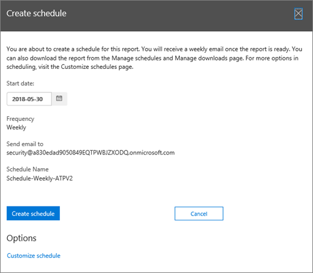

# Een planning maken voor een &amp; rapport in het Security Compliance CenterCreate a schedule for a report in the Security &amp; Compliance Center

In het &amp; Security Compliance Center zijn verschillende [rapporten en inzichten](reports-and-insights-in-security-and-compliance.md) beschikbaar om het beveiligingsteam van uw organisatie te helpen bedreigingen voor uw organisatie te beperken en aan te pakken.In the Security &amp; Compliance Center, several [reports and insights](reports-and-insights-in-security-and-compliance.md) are available to help your organization's security team mitigate and address threats to your organization. Als u lid bent van het beveiligingsteam van uw organisatie, u een planning voor een rapport maken.If you're a member of your organization's security team, you can create a schedule for a report. Het schema dat u maakt, kan een aangepaste datumbereiken bevatten die bij uw organisatie passen.The schedule you create can include a custom date ranges to suit your organization. 
  
## Een planning maken voor een rapportCreate a schedule for a report

> [!IMPORTANT]
> Zorg ervoor dat u over de benodigde machtigingen beschikt om deze taak uit te voeren.Make sure that you have the necessary permissions to perform this task. Over het algemeen hebben globale beheerders, beveiligingsbeheerders en &amp; beveiligingslezers toegang tot rapporten in het Security Compliance Center.In general, global administrators, security administrators, and security readers can access reports in the Security &amp; Compliance Center. Zie Machtigingen in het [Security &amp; Compliance Center](permissions-in-the-security-and-compliance-center.md)voor meer informatie over machtigingen.To learn more about permissions, see [Permissions in the Security &amp; Compliance Center](permissions-in-the-security-and-compliance-center.md).
  
1. Ga in het [Security &amp; Compliance Center](https://protection.office.com)naar **Reports** \> **Dashboard**.In the [Security &amp; Compliance Center](https://protection.office.com), go to **Reports** \> **Dashboard**.
    
2. Kies een van de volgende rapporten:Choose one of the following reports: 

    - DLP-beleid komt overeenDLP policy matches
    - RuiltransportregelExchange Transport Rule
    - DLP false positives and overrides DLP false positives and overrides DLP false positives and overrides DLPDLP false positives and overrides
    - Office 365 ATP-bestandstypenOffice 365 ATP file types
    - Office 365 ATP-berichtdispositieOffice 365 ATP message disposition
    - Malware gedetecteerd in e-mailMalware detected in email
    - Top malwareTop malware
    - Topafzenders en ontvangersTop senders and recipients
    - SpoofdetectiesSpoof detections
    - SpamdetectiesSpam detections
    - Verzonden en ontvangen e-mailSent and received email
    - DLP incidentenDLP incidents
    - VersleutelingsrapportEncryption report

    In dit voorbeeld kiezen we het rapport Advanced Threat Protection File Types.For this example, we'll choose the Advanced Threat Protection File Types report.
    
3. Kies in de linkerbovenhoek van het rapport **+ Schema maken**.In the upper left corner of the report, choose **+ Create schedule**. 
    
    

    > [!NOTE]
    > Niet alle rapporten hebben de knop **Schema maken maken.**Not all reports have the **+ Create schedule** button.
  
    Het dialoogvenster **Planning maken** wordt geopend.The **Create schedule** dialog box opens. 
    
4. Houd de standaardinstellingen bij en kies **Planning maken**of kies **Schema aanpassen**.Keep the default settings and choose **Create schedule**, or choose **Customize schedule**.
    
    
  
    Als u ervoor kiest uw rapportplanning aan te passen, u de frequentie van het rapport, het e-mailadres van een afzender en het e-mailadres van een geadresseerde opgeven.If you choose to customize your report schedule, you can specify the report's frequency, a sender's email address, and a recipient's email address. 
    
Zodra u een planning voor een rapport hebt gemaakt, wordt dat rapport automatisch via e-mail naar de e-mailadressen van de geadresseerden bezorgd.Once you have created a schedule for a report, that report will be delivered via email to recipients' email addresses automatically. 
  
## Verwante onderwerpenRelated topics

[Rapporten en inzichten &amp; in het Security Compliance CenterReports and insights in the Security &amp; Compliance Center](reports-and-insights-in-security-and-compliance.md)
  
[Schema's beheren voor &amp; rapporten in het Security Compliance CenterManage schedules for reports in the Security &amp; Compliance Center](manage-schedules-for-multiple-reports.md)
  
[Bestaande rapporten downloaden &amp; in het Security Compliance CenterDownload existing reports in the Security &amp; Compliance Center](download-existing-reports.md)
  
[Een aangepast rapport downloaden &amp; in het Security Compliance CenterDownload a custom report in the Security &amp; Compliance Center](set-up-and-download-a-custom-report.md)
  

