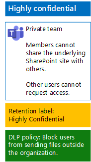

# Bestanden in teams beveiligen met bewaarlabels en DLP

 
Gebruik de stappen in dit artikel om bewaarlabels en DLP-beleid te ontwerpen en te implementeren voor baseline, gevoelige en zeer vertrouwelijke teams en hun onderliggende SharePoint-sites. Zie [Bestanden beveiligen in Microsoft Teams](secure-files-in-teams.md) voor meer informatie over deze drie beveiligingslagen.
  
## Hoe dit werkt

1. Maak de gewenste bewaarlabels en publiceer deze. Het kan maximaal 12 uur duren voordat deze worden gepubliceerd.
2. Voor de gewenste onderliggende SharePoint-sites bewerkt u de instellingen van de documentbibliotheek om de gewenste bewaarlabels toe te passen op items in de bibliotheek.
3. Maak DLP-beleid om actie te ondernemen op basis van bewaarlabels.

Wanneer gebruikers een document toevoegen aan de onderliggende SharePoint-sitebibliotheek voor het team, ontvangt het document standaard het toegewezen bewaarlabel. Gebruikers kunnen zo nodig het label wijzigen. Wanneer een gebruiker een document buiten de organisatie deelt, wordt met DLP gecontroleerd of een label is toegewezen en wordt actie ondernomen als een DLP-beleid overeenkomt met het label. DLP zal ook zoeken naar andere beleidsovereenkomsten, zoals het beschermen van bestanden met creditcardnummers als dit type beleid is geconfigureerd. 

## Bewaarlabels voor uw onderliggende SharePoint-sites

Er zijn drie fasen voor het maken en vervolgens toewijzen van bewaarlabels aan onderliggende SharePoint-sites.
  
### Stap 1: de namen van de bewaarlabels bepalen

In deze fase bepaalt u de namen van de bewaarlabels voor de vier niveaus van informatiebescherming die zijn toegepast op onderliggende SharePoint-sites. In de volgende tabel vindt u een overzicht van de aanbevolen namen voor elk niveau.
  
|**niveau van bescherming onderliggende SharePoint-sites**|**Labelnaam**|
|:-----|:-----|
|Basislijn-openbaar    |Intern openbaar    |
|Basislijn-persoonlijk    |Privé    |
|Gevoelig    |Gevoelig    |
|Zeer vertrouwelijk    |Zeer vertrouwelijk    |
   
### Stap 2: de bewaarlabels maken

In deze fase maakt en publiceert u uw vastgestelde labels voor de verschillende niveaus van informatiebescherming.
  
1. Meld u aan bij de [Microsoft 365-compliancecentrum](https://compliance.microsoft.com) met een account met de rol van Beveiligingsbeheerder of Bedrijfsbeheerder.
    
2. Klik op het tabblad **Start: Microsoft 365-compliancecentrum** van uw browser op **Classificaties > Labels**.
    
3. Klik op **Bewaarlabels > Een label maken**.
    
4. Typ in het deelvenster **Naam van uw label** de naam van het label en een beschrijving voor beheerders en gebruikers en klik vervolgens op **Volgende**.

5. Vul het deelvenster **Beschrijvende elementen van het bestandsplan** in zoals gewenst en klik vervolgens op **Volgende**.
    
6. Indien nodig kunt u in het deelvenster **Labelinstellingen** de **Retentie** instellen op **Aan** en de bewaarinstellingen configureren. Klik op **Volgende**.
    
7. Klik in het deelvenster **Uw instellingen controleren** op **Label maken**.
    
8. Voor extra labels klikt u op **een label maken** en herhaalt u de stappen 3-7 in deze procedure.
    

### De nieuwe etiketten publiceren

Vervolgens gebruikt u deze stappen om de nieuwe bewaarlabels te publiceren.
  
1. Klik in het deelvenster **labels** op het tabblad **bewaarlabels** en klik vervolgens op **labels publiceren**.
    
2. Klik in het deelvenster **Labels kiezen om te publiceren** op de optie **Labels kiezen om te publiceren**.
    
3. Klik op het deelvenster **Labels kiezen** op **Toevoegen**, selecteer alle vier de labels en klik op **toevoegen**.
    
4. Klik op **Gereed**.
    
5. Klik in het deelvenster **Labels kiezen om te publiceren** op **Volgende**.
    
6. Klik in het deelvenster **Locaties kiezen** op **Volgende**.
    
7. Typ in het deelvenster **uw beleid een naam geven** een naam voor uw set labels in **naam** en klik vervolgens op **volgende**.
    
8. Klik in het deelvenster **Uw instellingen controleren** op **Labels publiceren** en klik vervolgens op **Sluiten**.

    
### Stap 3: de bewaarlabels toepassen op uw onderliggende SharePoint-sites

Gebruik de volgende stappen om de bewaarlabels toe te passen op de mappen documenten van uw onderliggende SharePoint-sites.
  
1.  Klik in het team op **bestanden**en klik vervolgens op **openen in SharePoint**.

2. Klik op het nieuwe SharePoint-tabblad van uw browser op **documenten**.
    
3. Klik op het pictogram Instellingen en vervolgens op **Bibliotheekinstellingen**.
    
4. Klik onder **Machtigingen en beheer** op **Label op items in deze bibliotheek toepassen**.
    
5. Selecteer in **Instellingen-Label toepassen** het juiste bewaarlabel en klik vervolgens op **Opslaan**.
    
6. Sluit het tabblad voor de SharePoint-site.
    
7. Herhaal stap 1-6 om bewaarlabels toe te wijzen aan uw extra onderliggende SharePoint-sites.
    
Dit is de resulterende configuratie.
  

  
## DLP-beleid voor uw onderliggende SharePoint-sites

Volg deze stappen om een DLP-beleid te configureren waarmee gebruikers op de hoogte worden gesteld wanneer ze een document delen op een onderliggende SharePoint-site buiten de organisatie.

1. Meld u aan bij de [Microsoft 365-compliancecentrum](https://compliance.microsoft.com/) met een account met de rol van Beveiligingsbeheerder of Bedrijfsbeheerder.
    
2. Klik op het nieuwe tabblad **Microsoft 365-compliance** in uw browser op **Beleid > Preventie van gegevensverlies**.
    
3. Klik in het deelvenster **Start > Preventie van gegevensverlies** op **Een beleid maken**.
    
4. Klik in het deelvenster **Met een sjabloon beginnen of een aangepast beleid maken** op **Aangepast**en klik vervolgens op **Volgende**.
    
5. Typ in het deelvenster **Naam van uw beleid** de naam voor het DLP-beleid op gevoelig niveau in **Naam** en klik vervolgens op **Volgende**.
    
6. Klik in het deelvenster **Locaties kiezen** op **Laat mij specifieke locaties kiezen** en klik vervolgens op **Volgende**.
    
7. Schakel in de lijst met locaties de locaties **Exchange-e-mail**, **OneDrive-accounts** en **chat- en kanaalberichten in Teams** uit en klik vervolgens op **Volgende**.
    
8. Klik in het deelvenster **Het type inhoud aanpassen dat u wilt beveiligen** op **Bewerken**.
    
9. Klik in het deelvenster **Kies de typen inhoud die u wilt beveiligen** op **Toevoegen** in de vervolgkeuzelijst en klik vervolgens op **Retentielabels**.
    
10. Klik in het deelvenster **Retentielabels** op **Toevoegen**, selecteer het label **Gevoelig**, klik op **Toevoegen**en klik vervolgens op **Gereed**.
    
11. Klik in het deelvenster **Kies de typen inhoud die u wilt beveiligen** op **Opslaan**.
    
12. Klik in het deelvenster **Het type inhoud aanpassen dat u wilt beveiligen** op **Volgende**.

13. Klik in het deelvenster **Wat wilt u doen als we gevoelige informatie herkennen?** op **De tip en de e-mail aanpassen**.
    
14. Klik in het deelvenster **Beleidstips en e-mailmeldingen aanpassen** op **tekst voor beleidstip aanpassen**.
    
15. Typ of plak in het tekstvak een van de volgende tips:
    
  - Als u wilt delen met een gebruiker buiten de organisatie downloadt en opent u het bestand. Klik op Bestand, vervolgens op Document beveiligen en daarna op Versleutelen met wachtwoord en geef tot slot een sterk wachtwoord op. Stuur het wachtwoord in een afzonderlijk e-mailbericht of via een ander communicatiemiddel.
  - Zeer vertrouwelijke bestanden worden beveiligd met versleuteling. Alleen externe gebruikers die toegang hebben tot deze bestanden door de IT-afdeling, kunnen ze lezen.
    
    U kunt ook uw eigen beleidstip typen of plakken waarmee gebruikers worden geïnstrueerd hoe ze een bestand kunnen delen buiten uw organisatie.
    
16. Klik op **OK**.
    
17. Klik in het deelvenster **Wat wilt u doen als we gevoelige informatie herkennen?** op **Volgende**.
    
18. Klik in het deelvenster **Wilt u het beleid inschakelen of eerst testen?** op **Ja, schakel het meteen in** en klik vervolgens op **Volgende**.
    
19. Klik in het deelvenster **Uw instellingen controleren** op **Maken** en klik vervolgens op **Sluiten**.
    
Hier vindt u de configuratie voor gevoelige teams.
  

  
Gebruik vervolgens deze stappen om een DLP-beleid te configureren dat gebruikers blokkeert wanneer ze een document delen op een onderliggende SharePoint-site buiten de organisatie.
  
1. Klik op het nieuwe tabblad **Microsoft 365-compliance** in uw browser op **Beleid > Preventie van gegevensverlies**.
    
2. Klik in het deelvenster **Preventie van gegevensverlies** op **Een beleid maken**.
    
3. Klik in het deelvenster **Met een sjabloon beginnen of een aangepast beleid maken** op **Aangepast**en klik vervolgens op **Volgende**.
    
4. Typ in het deelvenster **Naam van uw beleid** de naam voor het DLP-beleid op zeer gevoelig niveau in **Naam** en klik vervolgens op **Volgende**.
    
5. Klik in het deelvenster **Locaties kiezen** op **Laat mij specifieke locaties kiezen** en klik vervolgens op **Volgende**.
    
6. Schakel in de lijst met locaties de locaties **Exchange-e-mail**, **OneDrive-accounts** en **chat- en kanaalberichten in Teams** uit en klik vervolgens op **Volgende**.
    
7. Klik in het deelvenster **Het type gevoelige inhoud aanpassen dat u wilt beveiligen** op **Bewerken**.
    
8. Klik in het deelvenster **Kies de typen inhoud die u wilt beveiligen** op **Toevoegen** in de vervolgkeuzelijst en klik vervolgens op **Bewaarlabels**.
    
9. Klik in het deelvenster **Retentielabels** op **Toevoegen**, selecteer het label **Zeer Vertrouwelijk**, klik op **Toevoegen**en klik vervolgens op **Gereed**.
    
10. Klik in het deelvenster **Kies de typen inhoud die u wilt beveiligen** op **Opslaan**.
    
12. Klik in het deelvenster **De typen gevoelige inhoud aanpassen die u wilt beveiligen** op **Volgende**.
    
13. Klik in het deelvenster **Wat wilt u doen als we gevoelige informatie herkennen?** op **De tip en de e-mail aanpassen**.
    
14. Klik in het deelvenster **Beleidstips en e-mailmeldingen aanpassen** op **tekst voor beleidstip aanpassen**.
    
15. Typ of plak in het tekstvak de volgende tekst:
    
  - Als u wilt delen met een gebruiker buiten de organisatie downloadt en opent u het bestand. Klik op Bestand, vervolgens op Document beveiligen en daarna op Versleutelen met wachtwoord en geef tot slot een sterk wachtwoord op. Stuur het wachtwoord in een afzonderlijk e-mailbericht of via een ander communicatiemiddel.
    
    U kunt ook uw eigen beleidstip typen of plakken waarmee gebruikers worden geïnstrueerd hoe ze een bestand kunnen delen buiten uw organisatie.
    
16. Klik op **OK**.
    
17. In het deelvenster **Wat wilt u doen als we gevoelige informatie detecteren?**, onder **Detecteren wanneer een bepaalde hoeveelheid gevoelige informatie in een keer wordt gedeeld**, klikt u op **Toegang beperken of de inhoud versleutelen** en klikt u vervolgens op **Volgende**.
    
18. Klik in het deelvenster **Wilt u het beleid inschakelen of eerst testen?** op **Ja, schakel het meteen in** en klik vervolgens op **Volgende**.
    
19. Klik in het deelvenster **Uw instellingen controleren** op **Maken** en klik vervolgens op **Sluiten**.
    
Hier vindt u de configuratie voor een team met een hoge vertrouwelijkheid.
  

  
## Volgende stap

[Bestanden in teams beveiligen met gevoeligheidslabels](deploy-teams-sensitivity-labels.md)
    
## Zie ook

[Bestanden beveiligen in Microsoft Teams](secure-files-in-teams.md)
  
[Cloud adoption and hybrid solutions](https://docs.microsoft.com/office365/enterprise/cloud-adoption-and-hybrid-solutions) (Overstappen op de cloud en hybride oplossingen)

