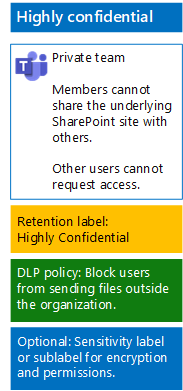

# Bestanden in teams beschermen met gevoeligheidslabels.Protect files in teams with sensitivity labels

Een zeer vertrouwelijk team heeft, in tegenstelling tot een gevoeligheidslabel voor sterk gereglementeerde gegevens die iedereen op een bestand kan toepassen, een eigen label of sublabel nodig, zodat toegewezen bestanden:Unlike a sensitivity label for highly regulated data that anyone can apply to any file, a highly confidential team needs its own label or sublabel so that assigned files:

- Afzonderlijk worden versleuteld.Are individually encrypted.
- Aangepaste machtigingen bevatten, zodat alleen leden van het team ze kunnen openen.Contain custom permissions so that only members of the team can open it.

Om dit extra beveiligingsniveau te halen voor bestanden die zijn opgeslagen op de SharePoint-site van een team, moet u een aangepast gevoeligheidslabel configureren dat een afzonderlijk label is of een sublabel van het algemene label voor sterk gereglementeerde bestanden.To accomplish this additional level of security for files stored in the underlying SharePoint site of a team, you must configure a customized sensitivity label that is either its own label or a sublabel of the general label for highly regulated data. Alleen teamleden zien het aangepaste etiket of sublabel in hun lijst met labels.Only team members will see the customized label or sublabel in their list of labels.

Gebruik een gevoeligheidslabel wanneer u een klein aantal labels nodig hebt voor zowel globaal gebruik als afzonderlijke privéteams.Use a sensitivity label when you need a small number of labels for both global use and individual private teams. 

Gebruik een gevoeligheids-sublabel wanneer u een groot aantal labels nodig hebt of als u labels wilt organiseren voor zeer vertrouwelijke teams onder het sterk gereglementeerde label.Use a sensitivity sublabel when you have a large number of labels or want to organize labels for highly confidential teams under the highly regulated label.

Gebruik [deze instructies](https://docs.microsoft.com/microsoft-365/compliance/encryption-sensitivity-labels) om een afzonderlijk label of sublabel met de volgende instellingen te configureren:Use [these instructions](https://docs.microsoft.com/microsoft-365/compliance/encryption-sensitivity-labels) to configure a separate label or a sublabel with the following settings:

- De naam van het label bevat de naam van het teamThe name of the label or sublabel contains the name of the team
- Versleuteling is ingeschakeldEncryption is enabled
- De Office 365-groep voor het team heeft machtigingen voor cocreatieThe Office 365 group for the team has Co-Author permissions

Na het maken van het nieuwe label of sublabel voor uw gebruikers, die ze vervolgens lokaal kunnen toepassen op bestanden voordat ze worden geüpload naar het team of later zodra het bestand is opgeslagen in het team.After creating, publish the new label or sublabel for your users, who can then apply them to files either locally before uploading them to the team or later once the file is stored in the team.

Hier vindt u de configuratie van het zeer vertrouwelijke team dat gebruikmaakt van gevoeligheidslabels voor bestandsversleuteling en machtigingen.Here is the configuration of the highly confidential team that uses sensitivity labels for file encryption and permissions.

## Zie ookSee Also

[Bestanden beveiligen in Microsoft TeamsSecure files in Microsoft Teams](secure-files-in-teams.md)
  
[Cloud adoption and hybrid solutions](https://docs.microsoft.com/office365/enterprise/cloud-adoption-and-hybrid-solutions) (Overstappen op de cloud en hybride oplossingen)[Cloud adoption and hybrid solutions](https://docs.microsoft.com/office365/enterprise/cloud-adoption-and-hybrid-solutions)
