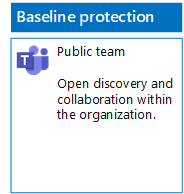
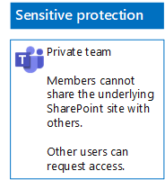
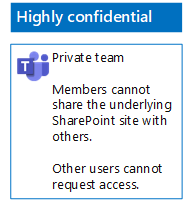

# Teams implementeren voor drie beveiligingslagen voor bestandenDeploy teams for three tiers of protection for files

Gebruik de stappen in dit artikel om basislijnteams en gevoelige en zeer vertrouwelijke teams te ontwerpen en te implementeren.Use the steps in this article to design and deploy baseline, sensitive, and highly confidential teams. Zie [Bestanden beveiligen in Microsoft Teams](secure-files-in-teams.md) voor meer informatie over deze drie beveiligingslagen.For more information about these three tiers of protection, see [Secure files in Microsoft Teams](secure-files-in-teams.md).

## BasislijnteamsBaseline teams

Basislijnbeveiliging omvat zowel openbare teams als privéteams.Baseline protection includes both public and private teams. Openbare teams kunnen door iedereen in de organisatie worden gedetecteerd en geopend.Public teams can be discovered and accessed by anybody in the organization. Privéteams kunnen alleen worden gedetecteerd en geopend door leden van de Microsoft 365-groep die is gekoppeld aan het team.Private sites can only be discovered and accessed by members of the Microsoft 365 group associated with the team. Met beide typen teams kunnen leden de site delen met anderen.Both of these types of teams allow members to share the site with others.

### OpenbaarPublic

Volg de instructies in [dit artikel](https://support.office.com/article/174adf5f-846b-4780-b765-de1a0a737e2b) om een basislijnteam met openbare toegang en machtigingen te maken.Follow the instructions in [this article](https://support.office.com/article/174adf5f-846b-4780-b765-de1a0a737e2b) to create a baseline Team with public access and permissions.

Dit is de resulterende configuratie.Here is your resulting configuration.

### PrivéPrivate

Volg de instructies in [dit artikel](https://support.office.com/article/174adf5f-846b-4780-b765-de1a0a737e2b) om een basislijnteam met persoonlijke toegang en machtigingen te maken.Follow the instructions in [this article](https://support.office.com/article/174adf5f-846b-4780-b765-de1a0a737e2b) to create a baseline Team with private access and permissions.

Dit is de resulterende configuratie.Here is your resulting configuration.

## Gevoelige teamsSensitive teams

Voor een gevoelig team begint u met [het maken van een privéteam](https://support.office.com/article/174adf5f-846b-4780-b765-de1a0a737e2b).For a sensitive team, you start by [creating a private team](https://support.office.com/article/174adf5f-846b-4780-b765-de1a0a737e2b).

Vervolgens configureert u de onderliggende SharePoint-site om het delen door teamleden te voorkomen.Next, you configure the underlying SharePoint site to prevent sharing by team members.

1. Klik op de werkbalk van het team op **Bestanden**.In the tool bar for the team, click **Files**.

2. Klik op het beletselteken en klik vervolgens op **Openen in SharePoint**.Click the ellipsis, and then click **Open in SharePoint**.

3. Klik op de werkbalk van de onderliggende SharePoint-site op het pictogram Instellingen en vervolgens op **Sitemachtigingen**.In the tool bar of the underlying SharePoint site, click the settings icon, and then click **Site permissions**.

4. Klik in het deelvenster **Sitemachtigingen** onder **Instellingen voor delen** op **Instellingen voor delen wijzigen**.In the **Site permissions** pane, under **Sharing Settings**, click **Change sharing settings**.

5. Kies onder **Machtigingen voor delen** de optie **Alleen site-eigenaren kunnen bestanden, mappen en de site delen** en klik vervolgens op **Opslaan**.Under **Sharing permissions**, choose **Only site owners can share files, folders, and the site**, and then click **Save**.

Dit is de resulterende configuratie.Here is your resulting configuration.

## Zeer vertrouwelijke teamsHighly confidential teams

Voor een zeer vertrouwelijk team begint u met [het maken van een privéteam](https://support.office.com/article/174adf5f-846b-4780-b765-de1a0a737e2b).With a highly confidential team, you start by [creating a private team](https://support.office.com/article/174adf5f-846b-4780-b765-de1a0a737e2b).

Vervolgens configureert u de onderliggende SharePoint-site om het delen door teamleden en het aanvragen van toegang door niet-leden van het team te voorkomen.Next, you configure the underlying SharePoint site to prevent sharing by team members and the requesting of access by non-members of the team.

1. Klik op de werkbalk van het team op **Bestanden**.In the tool bar for the team, click **Files**.

2. Klik op het beletselteken en klik vervolgens op **Openen in SharePoint**.Click the ellipsis, and then click **Open in SharePoint**.

3. Klik op de werkbalk van de onderliggende SharePoint-site op het pictogram Instellingen en vervolgens op **Sitemachtigingen**.In the tool bar of the underlying SharePoint site, click the settings icon, and then click **Site permissions**.

4. Klik in het deelvenster **Sitemachtigingen** onder **Instellingen voor delen** op **Instellingen voor delen wijzigen**.In the **Site permissions** pane, under **Sharing Settings**, click **Change sharing settings**.

5. Kies onder **Machtigingen voor delen**, **Alleen site-eigenaren kunnen bestanden, mappen en de site delen**.Under **Sharing permissions**, choose **Only site owners can share files, folders, and the site**.

6. Schakel **Toegangsaanvragen toestaan** uit en klik op **Opslaan**.Turn off **Allow access requests**, and then click **Save**.

Dit is de resulterende configuratie.Here is your resulting configuration.

## Volgende stapNext step

[Bestanden in teams beveiligen met retentielabels en DLPProtect files in teams with retention labels and DLP](deploy-teams-retention-DLP.md)

## Zie ookSee also

[Bestanden beveiligen in Microsoft TeamsSecure files in Microsoft Teams](secure-files-in-teams.md)

[Cloud adoption and hybrid solutions](https://docs.microsoft.com/office365/enterprise/cloud-adoption-and-hybrid-solutions) (Overstappen op de cloud en hybride oplossingen)[Cloud adoption and hybrid solutions](https://docs.microsoft.com/office365/enterprise/cloud-adoption-and-hybrid-solutions)
