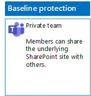

# Teams implementeren voor drie beveiligingslagen voor bestanden

Gebruik de stappen in dit artikel om basislijnteams en gevoelige en zeer vertrouwelijke teams te ontwerpen en te implementeren. Zie [Bestanden beveiligen in Microsoft Teams](secure-files-in-teams.md) voor meer informatie over deze drie beveiligingslagen.

## Basislijnteams

Basislijnbeveiliging omvat zowel openbare teams als privéteams. Openbare teams kunnen door iedereen in de organisatie worden gedetecteerd en geopend. Privéteams kunnen alleen worden gedetecteerd en geopend door leden van de Office 365-groep die is gekoppeld aan het team. Met beide typen teams kunnen leden de site delen met anderen.

### Openbaar

Volg de instructies in [dit artikel](https://support.office.com/article/174adf5f-846b-4780-b765-de1a0a737e2b) om een basislijnteam met openbare toegang en machtigingen te maken.

Dit is de resulterende configuratie.

### Privé

Volg de instructies in [dit artikel](https://support.office.com/article/174adf5f-846b-4780-b765-de1a0a737e2b) om een basislijnteam met persoonlijke toegang en machtigingen te maken.

Dit is de resulterende configuratie.

## Gevoelige teams

Voor een gevoelig team begint u met [het maken van een privéteam](https://support.office.com/article/174adf5f-846b-4780-b765-de1a0a737e2b).

Vervolgens configureert u de onderliggende SharePoint-site om het delen door teamleden te voorkomen.

1. Klik op de werkbalk van het team op **Bestanden**.

2. Klik op het beletselteken en klik vervolgens op **Openen in SharePoint**.

3. Klik op de werkbalk van de onderliggende SharePoint-site op het pictogram Instellingen en vervolgens op **Sitemachtigingen**.

4. Klik in het deelvenster **Sitemachtigingen** onder **Instellingen voor delen** op **Instellingen voor delen wijzigen**.

5. Kies onder **Machtigingen voor delen** de optie **Alleen site-eigenaren kunnen bestanden, mappen en de site delen** en klik vervolgens op **Opslaan**.

Dit is de resulterende configuratie.

## Zeer vertrouwelijke teams

Voor een zeer vertrouwelijk team begint u met [het maken van een privéteam](https://support.office.com/article/174adf5f-846b-4780-b765-de1a0a737e2b).

Vervolgens configureert u de onderliggende SharePoint-site om het delen door teamleden en het aanvragen van toegang door niet-leden van het team te voorkomen.

1. Klik op de werkbalk van het team op **Bestanden**.

2. Klik op het beletselteken en klik vervolgens op **Openen in SharePoint**.

3. Klik op de werkbalk van de onderliggende SharePoint-site op het pictogram Instellingen en vervolgens op **Sitemachtigingen**.

4. Klik in het deelvenster **Sitemachtigingen** onder **Instellingen voor delen** op **Instellingen voor delen wijzigen**.

5. Kies onder **Machtigingen voor delen**, **Alleen site-eigenaren kunnen bestanden, mappen en de site delen**.

6. Schakel **Toegangsaanvragen toestaan** uit en klik op **Opslaan**.

Dit is de resulterende configuratie.

## Volgende stap

[Bestanden in teams beveiligen met retentielabels en DLP](deploy-teams-retention-DLP.md)

## Zie ook

[Bestanden beveiligen in Microsoft Teams](secure-files-in-teams.md)

[Cloud adoption and hybrid solutions](https://docs.microsoft.com/office365/enterprise/cloud-adoption-and-hybrid-solutions) (Overstappen op de cloud en hybride oplossingen)
