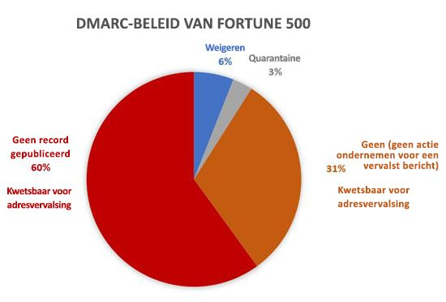

# <a name="email-authentication-in-eop"></a><span data-ttu-id="d3610-103">E-mailverificatie in EOP</span><span class="sxs-lookup"><span data-stu-id="d3610-103">Email authentication in EOP</span></span>

[!INCLUDE [Microsoft 365 Defender rebranding](../includes/microsoft-defender-for-office.md)]


<span data-ttu-id="d3610-104">E-mailverificatie (ook wel e-mailvalidatie genoemd) is een groep standaarden die probeert om spoofing (e-mailberichten van vervalste afzenders) te stoppen.</span><span class="sxs-lookup"><span data-stu-id="d3610-104">Email authentication (also known as email validation) is a group of standards that tries to stop spoofing (email messages from forged senders).</span></span> <span data-ttu-id="d3610-105">In alle Microsoft 365-organisaties maakt EOP gebruik van deze standaarden om binnenkomende e-mail te verifiëren:</span><span class="sxs-lookup"><span data-stu-id="d3610-105">In all Microsoft 365 organizations, EOP uses these standards to verify inbound email:</span></span>

- [<span data-ttu-id="d3610-106">SPF</span><span class="sxs-lookup"><span data-stu-id="d3610-106">SPF</span></span>](set-up-spf-in-office-365-to-help-prevent-spoofing.md)

- [<span data-ttu-id="d3610-107">DKIM</span><span class="sxs-lookup"><span data-stu-id="d3610-107">DKIM</span></span>](use-dkim-to-validate-outbound-email.md)

- [<span data-ttu-id="d3610-108">DMARC</span><span class="sxs-lookup"><span data-stu-id="d3610-108">DMARC</span></span>](use-dmarc-to-validate-email.md)

<span data-ttu-id="d3610-109">E-mailverificatie verifieert dat e-mailberichten van een afzender (bijvoorbeeld laura@contoso.com) legitiem zijn en afkomstig zijn van verwachte bronnen voor dat e-maildomein (bijvoorbeeld contoso.com).</span><span class="sxs-lookup"><span data-stu-id="d3610-109">Email authentication verifies that email messages from a sender (for example, laura@contoso.com) are legitimate and come from expected sources for that email domain (for example, contoso.com.)</span></span>

<span data-ttu-id="d3610-110">In de rest van dit artikel wordt uitgelegd hoe deze technologieën werken en hoe EOP ze gebruikt om binnenkomende e-mail te controleren.</span><span class="sxs-lookup"><span data-stu-id="d3610-110">The rest of this article explains how these technologies work, and how EOP uses them to check inbound email.</span></span>

## <a name="use-email-authentication-to-help-prevent-spoofing"></a><span data-ttu-id="d3610-111">E-mailverificatie gebruiken om spoofing te voorkomen</span><span class="sxs-lookup"><span data-stu-id="d3610-111">Use email authentication to help prevent spoofing</span></span>

<span data-ttu-id="d3610-112">DMARC voorkomt spoofing door het **Van** adres in berichten te onderzoeken.</span><span class="sxs-lookup"><span data-stu-id="d3610-112">DMARC prevents spoofing by examining the **From** address in messages.</span></span> <span data-ttu-id="d3610-113">Het **Van** adres is het e-mailadres van de afzender dat gebruikers zien in de e-mailclient.</span><span class="sxs-lookup"><span data-stu-id="d3610-113">The **From** address is the sender's email address that users see in their email client.</span></span> <span data-ttu-id="d3610-114">E-mail organisaties kunnen er ook voor zorgen dat het e-mail domein is doorgegeven aan SPF of DKIM.</span><span class="sxs-lookup"><span data-stu-id="d3610-114">Destination email organizations can also verify that the email domain has passed SPF or DKIM.</span></span> <span data-ttu-id="d3610-115">Met andere woorden, het domein is geverifieerd en daarom is het e-mailadres van de afzender niet vervalst.</span><span class="sxs-lookup"><span data-stu-id="d3610-115">In other words, the domain has been authenticated and therefore the sender's email address is not spoofed.</span></span>

<span data-ttu-id="d3610-116">Echter, DNS-records voor SPF, DKIM en DMARC (gezamenlijk bekend als e-mail verificatiebeleid) zijn optioneel.</span><span class="sxs-lookup"><span data-stu-id="d3610-116">However, DNS records for SPF, DKIM, and DMARC (collectively known as email authentication policies) are optional.</span></span> <span data-ttu-id="d3610-117">Domeinen met een sterk e-mail verificatiebeleid, zoals microsoft.com en skype.com, worden beschermd tegen spoofing.</span><span class="sxs-lookup"><span data-stu-id="d3610-117">Domains with strong email authentication policies like microsoft.com and skype.com are protected from spoofing.</span></span> <span data-ttu-id="d3610-118">Maar domeinen met een zwakkere e-mail verificatie, of helemaal geen beleid, zijn hoofddoelen om te worden vervalst.</span><span class="sxs-lookup"><span data-stu-id="d3610-118">But domains with weaker email authentication policies, or no policy at all, are prime targets for being spoofed.</span></span>

<span data-ttu-id="d3610-119">Slechts 9% van de domeinen van bedrijven in de Fortune 500 hanteerde in maart 2018 een sterk e-mailverificatiebeleid.</span><span class="sxs-lookup"><span data-stu-id="d3610-119">As of March 2018, only 9% of domains of companies in the Fortune 500 publish strong email authentication policies.</span></span> <span data-ttu-id="d3610-120">De resterende 91% van de bedrijven kan door een kwaadwillende worden gespooft.</span><span class="sxs-lookup"><span data-stu-id="d3610-120">The remaining 91% of companies might be spoofed by an attacker.</span></span> <span data-ttu-id="d3610-121">Tenzij er een ander filtermechanisme voor e-mail aanwezig is, kan e-mail van vervalste afzenders in deze domeinen aan gebruikers worden bezorgd.</span><span class="sxs-lookup"><span data-stu-id="d3610-121">Unless some other email filtering mechanism is in-place, email from spoofed senders in these domains might be delivered to users.</span></span>



<span data-ttu-id="d3610-123">Het aantal kleine en middelgrote bedrijven die een sterk e-mail verificatiebeleid publiceren, is kleiner.</span><span class="sxs-lookup"><span data-stu-id="d3610-123">The proportion of small-to-medium sized companies that publish strong email authentication policies is smaller.</span></span> <span data-ttu-id="d3610-124">En het nummer is nog kleiner voor e-mail domeinen buiten Noord-Amerika en West-Europa.</span><span class="sxs-lookup"><span data-stu-id="d3610-124">And the number is even smaller for email domains outside North America and western Europe.</span></span>

<span data-ttu-id="d3610-125">Het ontbreken van een sterk beleid voor e-mailverificatie is een groot probleem.</span><span class="sxs-lookup"><span data-stu-id="d3610-125">Lack of strong email authentication policies is a large problem.</span></span> <span data-ttu-id="d3610-126">Hoewel organisaties niet kunnen zien hoe e-mailverificatie werkt, zijn hackers volledig op de hoogte en kunnen ze hiervan profiteren van.</span><span class="sxs-lookup"><span data-stu-id="d3610-126">W while organizations might not understand how email authentication works, attackers fully understand, and they take advantage.</span></span> <span data-ttu-id="d3610-127">Vanwege phishing en de beperkte acceptatie van een sterk e-mailverificatiebeleid, gebruikt Microsoft *impliciete e-mailverificatie* om inkomende e-mail te controleren.</span><span class="sxs-lookup"><span data-stu-id="d3610-127">Because of phishing concerns and the limited adoption of strong email authentication policies, Microsoft uses *implicit email authentication* to check inbound email.</span></span>

<span data-ttu-id="d3610-128">Impliciete e-mailverificatie is gebaseerd een uitbreiding van het reguliere e-mailbeleid.</span><span class="sxs-lookup"><span data-stu-id="d3610-128">Implicit email authentication is an extension of regular email authentication policies.</span></span> <span data-ttu-id="d3610-129">Deze extensies bevatten de reputatie van de afzender, de geschiedenis van de afzender, de geschiedenis van de ontvanger, gedragsanalyse en andere geavanceerde technieken.</span><span class="sxs-lookup"><span data-stu-id="d3610-129">These extensions include: sender reputation, sender history, recipient history, behavioral analysis, and other advanced techniques.</span></span> <span data-ttu-id="d3610-130">Als er geen andere signalen van deze extensies worden verzonden, worden berichten die zijn verzonden vanuit domeinen die geen beleid voor e-mail verificatie gebruiken, gemarkeerd als spoof.</span><span class="sxs-lookup"><span data-stu-id="d3610-130">In the absence of other signals from these extensions, messages sent from domains that don't use email authentication policies will be marked as spoof.</span></span>

<span data-ttu-id="d3610-131">Zie [A Sea of Phish Part 2 - Enhanced Anti-spoofing in Microsoft 365](https://techcommunity.microsoft.com/t5/Security-Privacy-and-Compliance/Schooling-A-Sea-of-Phish-Part-2-Enhanced-Anti-spoofing/ba-p/176209) om de algemene aankondiging van Microsoft te lezen.</span><span class="sxs-lookup"><span data-stu-id="d3610-131">To see Microsoft's general announcement, see [A Sea of Phish Part 2 - Enhanced Anti-spoofing in Microsoft 365](https://techcommunity.microsoft.com/t5/Security-Privacy-and-Compliance/Schooling-A-Sea-of-Phish-Part-2-Enhanced-Anti-spoofing/ba-p/176209).</span></span>

## <a name="composite-authentication"></a><span data-ttu-id="d3610-132">Samengestelde verificatie</span><span class="sxs-lookup"><span data-stu-id="d3610-132">Composite authentication</span></span>

<span data-ttu-id="d3610-133">Als een domein geen traditionele SPF-, DKIM-en DMARC-records heeft, communiceren deze recordcontroles niet voldoende informatie over de status van de verificatie.</span><span class="sxs-lookup"><span data-stu-id="d3610-133">If a domain doesn't have traditional SPF, DKIM, and DMARC records, those record checks don't communicate enough authentication status information.</span></span> <span data-ttu-id="d3610-134">Microsoft heeft daarom een algoritme ontwikkeld voor impliciete e-mail verificatie.</span><span class="sxs-lookup"><span data-stu-id="d3610-134">Therefore, Microsoft has developed an algorithm for implicit email authentication.</span></span> <span data-ttu-id="d3610-135">Dit algoritme combineert meerdere signalen tot één waarde met de naam _Samengestelde verificatie_, of `compauth` afgekort.</span><span class="sxs-lookup"><span data-stu-id="d3610-135">This algorithm combines multiple signals into a single value called _composite authentication_, or `compauth` for short.</span></span> <span data-ttu-id="d3610-136">De `compauth`-waarde wordt in de koptekst **Verificatie-resultaten** in de berichtkoppen gestempeld.</span><span class="sxs-lookup"><span data-stu-id="d3610-136">The `compauth` value is stamped into the **Authentication-Results** header in the message headers.</span></span>

```text
Authentication-Results:
   compauth=<fail | pass | softpass | none> reason=<yyy>
```

<span data-ttu-id="d3610-137">Deze waarden worden uitgelegd in de [berichtkop Verificatie-resultaten](anti-spam-message-headers.md#authentication-results-message-header).</span><span class="sxs-lookup"><span data-stu-id="d3610-137">These values are explained at [Authentication-results message header](anti-spam-message-headers.md#authentication-results-message-header).</span></span>

<span data-ttu-id="d3610-138">Door de berichtkoppen te bekijken, kunnen beheerders of zelfs eindgebruikers nagaan hoe in Microsoft 365 is vastgesteld dat de afzender is vervalst.</span><span class="sxs-lookup"><span data-stu-id="d3610-138">By examining the message headers, admins or even end users can determine how Microsoft 365 determined that the sender is spoofed.</span></span>

## <a name="why-email-authentication-is-not-always-enough-to-stop-spoofing"></a><span data-ttu-id="d3610-139">Waarom e-mailverificatie niet altijd voldoende is om adresvervalsing te stoppen</span><span class="sxs-lookup"><span data-stu-id="d3610-139">Why email authentication is not always enough to stop spoofing</span></span>

<span data-ttu-id="d3610-140">Alleen vertrouwen op records voor e-mailverificatie om te bepalen of een inkomend bericht vervalst is, heeft de volgende beperkingen:</span><span class="sxs-lookup"><span data-stu-id="d3610-140">Relying only on email authentication records to determine if an incoming message is spoofed has the following limitations:</span></span>

- <span data-ttu-id="d3610-141">Het verzendende domein heeft mogelijk niet de vereiste DNS-records of de records zijn onjuist geconfigureerd.</span><span class="sxs-lookup"><span data-stu-id="d3610-141">The sending domain might lack the required DNS records, or the records are incorrectly configured.</span></span>

- <span data-ttu-id="d3610-142">Het brondomein heeft correct geconfigureerde DNS-records, maar dat domein komt niet overeen met het domein in het Van-adres.</span><span class="sxs-lookup"><span data-stu-id="d3610-142">The source domain has correctly configured DNS records, but that domain doesn't match the domain in the From address.</span></span> <span data-ttu-id="d3610-143">SPF en DKIM vereisen niet dat het domein wordt gebruikt in het Van-adres.</span><span class="sxs-lookup"><span data-stu-id="d3610-143">SPF and DKIM don't require the domain to be used in the From address.</span></span> <span data-ttu-id="d3610-144">Hackers of legitieme services kunnen een domein registreren, SPF en DKIM configureren voor het domein en een geheel ander domein gebruiken in het Van-adres.</span><span class="sxs-lookup"><span data-stu-id="d3610-144">Attackers or legitimate services can register a domain, configure SPF and DKIM for the domain, and use a completely different domain in the From address.</span></span> <span data-ttu-id="d3610-145">Berichten van afzenders in dit domein worden doorgegeven aan SPF en DKIM.</span><span class="sxs-lookup"><span data-stu-id="d3610-145">Messages from senders in this domain will pass SPF and DKIM.</span></span>

<span data-ttu-id="d3610-146">Samengestelde verificatie kan deze beperkingen verhelpen door berichten door te geven die anders niet door de e-mailverificatie zouden komen.</span><span class="sxs-lookup"><span data-stu-id="d3610-146">Composite authentication can address these limitations by passing messages that would otherwise fail email authentication checks.</span></span>

<span data-ttu-id="d3610-147">Voor de eenvoud zijn de volgende voorbeelden gericht op resultaten van e-mailverificatie.</span><span class="sxs-lookup"><span data-stu-id="d3610-147">For simplicity, the following examples concentrate on email authentication results.</span></span> <span data-ttu-id="d3610-148">Andere intelligentiefactoren in de back-end kunnen berichten die e-mailverificatie doorstaan identificeren als vervalst, of berichten die e-mailverificatie niet doorstaan identificeren als legitiem.</span><span class="sxs-lookup"><span data-stu-id="d3610-148">Other back-end intelligence factors could identify messages that pass email authentication as spoofed, or messages that fail email email authentication as legitimate.</span></span>

<span data-ttu-id="d3610-149">Het domein fabrikam.com heeft bijvoorbeeld geen SPF-, DKIM- of DMARC-records.</span><span class="sxs-lookup"><span data-stu-id="d3610-149">For example, the fabrikam.com domain has no SPF, DKIM, or DMARC records.</span></span> <span data-ttu-id="d3610-150">Berichten van afzenders van het fabrikam.com-domein kunnen samengestelde verificatie niet doorstaan (noteer de `compauth`waarde en reden):</span><span class="sxs-lookup"><span data-stu-id="d3610-150">Messages from senders in the fabrikam.com domain can fail composite authentication (note the `compauth` value and reason):</span></span>

```text
Authentication-Results: spf=none (sender IP is 10.2.3.4)
  smtp.mailfrom=fabrikam.com; contoso.com; dkim=none
  (message not signed) header.d=none; contoso.com; dmarc=none
  action=none header.from=fabrikam.com; compauth=fail reason=001
From: chris@fabrikam.com
To: michelle@contoso.com
```

<span data-ttu-id="d3610-151">Als fabrikam.com een SPF-record zonder DKIM configureert, kan het bericht samengestelde verificatie doorgeven.</span><span class="sxs-lookup"><span data-stu-id="d3610-151">If fabrikam.com configures an SPF without a DKIM record, the message can pass composite authentication.</span></span> <span data-ttu-id="d3610-152">Het domein waaraan SPF-controles zijn doorgegeven, wordt uitgelijnd met het domein in het Van-adres:</span><span class="sxs-lookup"><span data-stu-id="d3610-152">The domain that passed SPF checks is aligned with the domain in the From address:</span></span>

```text
Authentication-Results: spf=pass (sender IP is 10.2.3.4)
  smtp.mailfrom=fabrikam.com; contoso.com; dkim=none
  (message not signed) header.d=none; contoso.com; dmarc=bestguesspass
  action=none header.from=fabrikam.com; compauth=pass reason=109
From: chris@fabrikam.com
To: michelle@contoso.com
```

<span data-ttu-id="d3610-153">Als fabrikam.com een DKIM-record zonder SPF-record configureert, kan het bericht samengestelde verificatie doorgeven.</span><span class="sxs-lookup"><span data-stu-id="d3610-153">If fabrikam.com configures a DKIM record without an SPF record, the message can pass composite authentication.</span></span> <span data-ttu-id="d3610-154">Het domein in het DKIM-handtekening wordt uitgelijnd met het domein in het Van-adres:</span><span class="sxs-lookup"><span data-stu-id="d3610-154">The domain in the DKIM signature is aligned with the domain in the From address:</span></span>

```text
Authentication-Results: spf=none (sender IP is 10.2.3.4)
  smtp.mailfrom=fabrikam.com; contoso.com; dkim=pass
  (signature was verified) header.d=outbound.fabrikam.com;
  contoso.com; dmarc=bestguesspass action=none
  header.from=fabrikam.com; compauth=pass reason=109
From: chris@fabrikam.com
To: michelle@contoso.com
```

<span data-ttu-id="d3610-155">Als het domein in SPF of de DKIM-handtekening niet overeenkomt met het domein in het Van-adres, kan het bericht door samengestelde verificatie worden tegengehouden:</span><span class="sxs-lookup"><span data-stu-id="d3610-155">If the domain in SPF or the DKIM signature doesn't align with the domain in the From address, the message can fail composite authentication:</span></span>

```text
Authentication-Results: spf=none (sender IP is 192.168.1.8)
  smtp.mailfrom=maliciousdomain.com; contoso.com; dkim=pass
  (signature was verified) header.d=maliciousdomain.com;
  contoso.com; dmarc=none action=none header.from=contoso.com;
  compauth=fail reason=001
From: chris@contoso.com
To: michelle@fabrikam.com
```

## <a name="solutions-for-legitimate-senders-who-are-sending-unauthenticated-email"></a><span data-ttu-id="d3610-156">Oplossingen voor legitieme afzenders die niet-geverifieerde e-mail verzenden</span><span class="sxs-lookup"><span data-stu-id="d3610-156">Solutions for legitimate senders who are sending unauthenticated email</span></span>

<span data-ttu-id="d3610-157">In Microsoft 365 wordt bijgehouden wie niet-geverifieerde e-mail naar uw organisatie verzendt.</span><span class="sxs-lookup"><span data-stu-id="d3610-157">Microsoft 365 keeps track of who is sending unauthenticated email to your organization.</span></span> <span data-ttu-id="d3610-158">Als de service denkt dat de afzender niet legitiem is, worden berichten van deze afzender gemarkeerd als een samengestelde verificatiefout.</span><span class="sxs-lookup"><span data-stu-id="d3610-158">If the service thinks the sender is not legitimate, it will mark messages from this sender as a composite authentication failure.</span></span> <span data-ttu-id="d3610-159">U kunt dit voorkomen door de aanbevelingen in deze sectie te gebruiken.</span><span class="sxs-lookup"><span data-stu-id="d3610-159">To avoid this verdict, you can use the recommendations in this section.</span></span>

### <a name="configure-email-authentication-for-domains-you-own"></a><span data-ttu-id="d3610-160">Configureer e-mailverificatie voor uw domeinen</span><span class="sxs-lookup"><span data-stu-id="d3610-160">Configure email authentication for domains you own</span></span>

<span data-ttu-id="d3610-161">U kunt deze methode gebruiken om spoofing binnen organisaties en spoofing tussen domeinen op te lossen in gevallen waarbij u eigenaar bent van of interactie heeft met meerdere tenants.</span><span class="sxs-lookup"><span data-stu-id="d3610-161">You can use this method to resolve intra-org spoofing and cross-domain spoofing in cases where you own or interact with multiple tenants.</span></span> <span data-ttu-id="d3610-162">Het helpt ook adresvervalsing tussen domeinen op te lossen wanneer u naar andere klanten binnen Microsoft 365 verzendt of naar derden die worden gehost door andere providers.</span><span class="sxs-lookup"><span data-stu-id="d3610-162">It also helps resolve cross-domain spoofing where you send to other customers within Microsoft 365 or third parties that are hosted by other providers.</span></span>

- <span data-ttu-id="d3610-163">[SPF-records configureren](set-up-spf-in-office-365-to-help-prevent-spoofing.md) voor uw domeinen.</span><span class="sxs-lookup"><span data-stu-id="d3610-163">[Configure SPF records](set-up-spf-in-office-365-to-help-prevent-spoofing.md) for your domains.</span></span>

- <span data-ttu-id="d3610-164">[DKIM-records configureren](use-dkim-to-validate-outbound-email.md) voor uw primaire domeinen.</span><span class="sxs-lookup"><span data-stu-id="d3610-164">[Configure DKIM records](use-dkim-to-validate-outbound-email.md) for your primary domains.</span></span>

- <span data-ttu-id="d3610-165">[U kunt overwegen om DMARC-records in te stellen](use-dmarc-to-validate-email.md) voor uw domein om te bepalen wie uw legitieme afzenders zijn.</span><span class="sxs-lookup"><span data-stu-id="d3610-165">[Consider setting up DMARC records](use-dmarc-to-validate-email.md) for your domain to determine your legitimate senders.</span></span>

<span data-ttu-id="d3610-166">Microsoft biedt geen gedetailleerde implementatierichtlijnen voor SPF-, DKIM-en DMARC-records.</span><span class="sxs-lookup"><span data-stu-id="d3610-166">Microsoft doesn't provide detailed implementation guidelines for SPF, DKIM, and DMARC records.</span></span> <span data-ttu-id="d3610-167">Er is echter veel informatie online beschikbaar.</span><span class="sxs-lookup"><span data-stu-id="d3610-167">However, there's many information available online.</span></span> <span data-ttu-id="d3610-168">Er zijn ook andere bedrijven die uw organisatie kunnen helpen bij het opzetten van e-mailverificatierecords.</span><span class="sxs-lookup"><span data-stu-id="d3610-168">There are also third party companies dedicated to helping your organization setup email authentication records.</span></span>

#### <a name="you-dont-know-all-sources-for-your-email"></a><span data-ttu-id="d3610-169">U kent niet alle bronnen voor uw e-mailberichten</span><span class="sxs-lookup"><span data-stu-id="d3610-169">You don't know all sources for your email</span></span>

<span data-ttu-id="d3610-170">Veel domeinen publiceren geen SPF-records omdat ze niet alle e-mailbronnen kennen voor berichten in hun domein.</span><span class="sxs-lookup"><span data-stu-id="d3610-170">Many domains don't publish SPF records because they don't know all of the email sources for messages in their domain.</span></span> <span data-ttu-id="d3610-171">Begin met het publiceren van een SPF-record met alle e-mailbronnen die u kent (vooral waar uw zakelijke verkeer zich bevindt) en publiceer het neutrale SPF-beleid `?all`.</span><span class="sxs-lookup"><span data-stu-id="d3610-171">Start by publishing an SPF record that contains all of the email sources you know about (especially where your corporate traffic is located), and publish the neutral SPF policy `?all`.</span></span> <span data-ttu-id="d3610-172">Bijvoorbeeld:</span><span class="sxs-lookup"><span data-stu-id="d3610-172">For example:</span></span>

```text
fabrikam.com IN TXT "v=spf1 include:spf.fabrikam.com ?all"
```

<span data-ttu-id="d3610-173">Dit voorbeeld betekent dat e-mail van uw bedrijfsinfrastructuur e-mailverificatie doorstaat, maar e-mail van onbekende bronnen wordt gemarkeerd als neutraal.</span><span class="sxs-lookup"><span data-stu-id="d3610-173">This example means that email from your corporate infrastructure will pass email authentication, but email from unknown sources will fall back to neutral.</span></span>

<span data-ttu-id="d3610-174">Microsoft 365 behandelt inkomende e-mail van uw bedrijfsinfrastructuur als geverifieerd.</span><span class="sxs-lookup"><span data-stu-id="d3610-174">Microsoft 365 will treat inbound email from your corporate infrastructure as authenticated.</span></span> <span data-ttu-id="d3610-175">E-mail van niet-geïdentificeerde bronnen wordt mogelijk nog steeds gemarkeerd als spoof als de impliciete verificatie mislukt.</span><span class="sxs-lookup"><span data-stu-id="d3610-175">Email from unidentified sources might still be marked as spoof if it fails implicit authentication.</span></span> <span data-ttu-id="d3610-176">Dit is echter nog steeds een verbetering in plaats van dat alle e-mail door Microsoft 365 als spoof wordt gemarkeerd.</span><span class="sxs-lookup"><span data-stu-id="d3610-176">However, this is still an improvement from all email being marked as spoof by Microsoft 365.</span></span>

<span data-ttu-id="d3610-177">Als u eenmaal bent begonnen met een SPF-terugvalbeleid van `?all`, kunt u geleidelijk meer e-mailbronnen voor uw berichten ontdekken en opnemen en vervolgens uw SPF-record bijwerken met een strikter beleid.</span><span class="sxs-lookup"><span data-stu-id="d3610-177">Once you've gotten started with an SPF fallback policy of `?all`, you can gradually discover and include more email sources for your messages, and then update your SPF record with a stricter policy.</span></span>

### <a name="use-spoof-intelligence-to-configure-permitted-senders-of-unauthenticated-email"></a><span data-ttu-id="d3610-178">Spoof Intelligence gebruiken om toegestane afzenders van niet-geverifieerde e-mail te configureren</span><span class="sxs-lookup"><span data-stu-id="d3610-178">Use spoof intelligence to configure permitted senders of unauthenticated email</span></span>

<span data-ttu-id="d3610-179">U kunt [Spoof Intelligence](learn-about-spoof-intelligence.md) ook gebruiken om afzenders toe te staan niet-geverifieerde berichten naar uw organisatie te verzenden.</span><span class="sxs-lookup"><span data-stu-id="d3610-179">You can also use [spoof intelligence](learn-about-spoof-intelligence.md) to permit senders to transmit unauthenticated messages to your organization.</span></span>

<span data-ttu-id="d3610-180">Voor externe domeinen is de vervalste gebruiker het domein in het Van-adres, terwijl de verzendende infrastructuur het bron-IP-adres is (onderverdeeld in 24 CIDR-bereiken) of het organisatiedomein van het omgekeerde DNS(PTR)-record.</span><span class="sxs-lookup"><span data-stu-id="d3610-180">For external domains, the spoofed user is the domain in the From address, while the sending infrastructure is either the source IP address (divided up into /24 CIDR ranges), or the organizational domain of the reverse DNS (PTR) record.</span></span>

<span data-ttu-id="d3610-181">In de onderstaande schermafbeelding is het bron-IP-adres mogelijk 131.107.18.4 met het PTR-record outbound.mail.protection.outlook.com.</span><span class="sxs-lookup"><span data-stu-id="d3610-181">In the screenshot below, the source IP might be 131.107.18.4 with the PTR record outbound.mail.protection.outlook.com.</span></span> <span data-ttu-id="d3610-182">Dit wordt weergegeven als outlook.com voor de verzendende infrastructuur.</span><span class="sxs-lookup"><span data-stu-id="d3610-182">This would show up as outlook.com for the sending infrastructure.</span></span>

<span data-ttu-id="d3610-183">Om deze afzender toe te staan niet-geverifieerde e-mail te verzenden, wijzigt u **Nee** in **Ja**.</span><span class="sxs-lookup"><span data-stu-id="d3610-183">To permit this sender to send unauthenticated email, change the **No** to a **Yes**.</span></span>


### <a name="create-an-allow-entry-for-the-senderrecipient-pair"></a><span data-ttu-id="d3610-185">Een vermelding met toestemming maken voor het afzender/geadresseerde-paar</span><span class="sxs-lookup"><span data-stu-id="d3610-185">Create an allow entry for the sender/recipient pair</span></span>

<span data-ttu-id="d3610-186">Zie [Lijsten met veilige afzenders maken in Microsoft 365](create-safe-sender-lists-in-office-365.md) om spamfilters, sommige onderdelen van phish-filters, maar niet malwarefilters voor specifieke afzenders te omzeilen.</span><span class="sxs-lookup"><span data-stu-id="d3610-186">To bypass spam filtering, some parts of filtering for phishing, but not malware filtering for specific senders, see [Create safe sender lists in Microsoft 365](create-safe-sender-lists-in-office-365.md).</span></span>

### <a name="ask-the-sender-to-configure-email-authentication-for-domains-you-dont-own"></a><span data-ttu-id="d3610-187">Vraag de afzender om e-mailverificatie te configureren voor domeinen waarvan u niet de eigenaar bent</span><span class="sxs-lookup"><span data-stu-id="d3610-187">Ask the sender to configure email authentication for domains you don't own</span></span>

<span data-ttu-id="d3610-188">Vanwege het probleem van spam en phishing raadt Microsoft e-mailverificatie aan voor alle e-mailorganisaties.</span><span class="sxs-lookup"><span data-stu-id="d3610-188">Because of the problem of spam and phishing, Microsoft recommends email authentication for all email organizations.</span></span> <span data-ttu-id="d3610-189">In plaats van handmatige overschrijvingen in uw organisatie te configureren, kunt u een beheerder in het verzendende domein vragen om hun e-mailverificatierecords te configureren.</span><span class="sxs-lookup"><span data-stu-id="d3610-189">Instead of configuring manual overrides in your organization, you can ask an admin in the sending domain to configure their email authentication records.</span></span>

- <span data-ttu-id="d3610-190">Zelfs als ze in het verleden geen e-mailverificatierecords hoefden te publiceren, zouden ze dit wel moeten doen als ze e-mail naar Microsoft sturen.</span><span class="sxs-lookup"><span data-stu-id="d3610-190">Even if they didn't need to publish email authentication records in the past, they should do so if they send email to Microsoft.</span></span>

- <span data-ttu-id="d3610-191">U moet SPF instellen om de verzend-IP-adressen van het domein te publiceren en DKIM (indien beschikbaar) instellen om berichten digitaal te ondertekenen.</span><span class="sxs-lookup"><span data-stu-id="d3610-191">Set up SPF to publish the domain's sending IP addresses, and set up DKIM (if available) to digitally sign messages.</span></span> <span data-ttu-id="d3610-192">Ze moeten ook overwegen om DMARC-records in te stellen.</span><span class="sxs-lookup"><span data-stu-id="d3610-192">They should also consider setting up DMARC records.</span></span>

- <span data-ttu-id="d3610-193">Als ze bulkmailers gebruiken om namens hen e-mail te verzenden, controleer dan of het domein in het Van-adres (als het van hen is) overeenkomt met het domein dat SPF of DMARC doorgeeft.</span><span class="sxs-lookup"><span data-stu-id="d3610-193">If they use bulk senders to send email on their behalf, verify that the domain in the From address (if it belongs to them) aligns with the domain that passes SPF or DMARC.</span></span>

- <span data-ttu-id="d3610-194">Controleer of de volgende locaties (als ze deze gebruiken) zijn opgenomen in het SPF-record:</span><span class="sxs-lookup"><span data-stu-id="d3610-194">Verify the following locations (if they use them) are included in the SPF record:</span></span>

  - <span data-ttu-id="d3610-195">On-premises e-mailservers.</span><span class="sxs-lookup"><span data-stu-id="d3610-195">On-premises email servers.</span></span>
  - <span data-ttu-id="d3610-196">E-mail die is verzonden via een software-als-een-service (SaaS)-provider.</span><span class="sxs-lookup"><span data-stu-id="d3610-196">Email sent from a software-as-a-service (SaaS) provider.</span></span>
  - <span data-ttu-id="d3610-197">E-mail die is verzonden via een cloudservice (Microsoft Azure, GoDaddy, Rackspace, Amazon Web Services, enz).</span><span class="sxs-lookup"><span data-stu-id="d3610-197">Email sent from a cloud-hosting service (Microsoft Azure, GoDaddy, Rackspace, Amazon Web Services, etc.).</span></span>

- <span data-ttu-id="d3610-198">Voor kleine domeinen die worden gehost door een internetprovider, configureert u de SPF-record volgens hun instructies.</span><span class="sxs-lookup"><span data-stu-id="d3610-198">For small domains that are hosted by an ISP, configure the SPF record according to the instructions from the ISP.</span></span>

<span data-ttu-id="d3610-199">Hoewel het in het begin misschien moeilijk is om zendende domeinen zo ver te krijgen dat ze verifiëren, zullen ze na verloop van tijd, als er meer en meer e-mailfilters hun e-mail als ongewenst markeren of zelfs afwijzen, de juiste records instellen voor betere aflevering.</span><span class="sxs-lookup"><span data-stu-id="d3610-199">While it may be difficult at first to get sending domains to authenticate, over time, as more and more email filters start junking or even rejecting their email, it will cause them to set up the proper records to ensure better delivery.</span></span> <span data-ttu-id="d3610-200">Bovendien kan hun deelname helpen bij het bestrijden van phishing en kan het de mogelijkheid van phishing in hun organisatie of organisaties waarnaar ze e-mail sturen, verminderen.</span><span class="sxs-lookup"><span data-stu-id="d3610-200">Also, their participation can help in the fight against phishing, and can reduce the possibility of phishing in their organization or organizations that they send email to.</span></span>

#### <a name="information-for-infrastructure-providers-isps-esps-or-cloud-hosting-services"></a><span data-ttu-id="d3610-201">Informatie voor infrastructuurproviders (ISP's, ESP's of cloudhostingservices)</span><span class="sxs-lookup"><span data-stu-id="d3610-201">Information for infrastructure providers (ISPs, ESPs, or cloud hosting services)</span></span>

<span data-ttu-id="d3610-202">Als u de e-mail van een domein host of een hosting-infrastructuur biedt die e-mail kan verzenden, moet u de volgende stappen uitvoeren:</span><span class="sxs-lookup"><span data-stu-id="d3610-202">If you host a domain's email or provide hosting infrastructure that can send email, you should do the following steps:</span></span>

- <span data-ttu-id="d3610-203">Zorg ervoor dat uw klanten beschikken over de documentatie waarin wordt uitgelegd hoe zij hun SPF-records moeten configureren</span><span class="sxs-lookup"><span data-stu-id="d3610-203">Ensure your customers have documentation that explains how your customers should configure their SPF records</span></span>

- <span data-ttu-id="d3610-204">U kunt DKIM-handtekeningen ondertekenen voor uitgaande e-mail, zelfs als de klant deze niet expliciet instelt (met een standaarddomein).</span><span class="sxs-lookup"><span data-stu-id="d3610-204">Consider signing DKIM-signatures on outbound email, even if the customer doesn't explicitly set it up (sign with a default domain).</span></span> <span data-ttu-id="d3610-205">U kunt zelfs het e-mailbericht met DKIM-handtekeningen dubbel ondertekenen (eenmaal met het domein van de klant als ze het hebben ingesteld, en een tweede keer met de handtekening van de DKIM van uw organisatie).</span><span class="sxs-lookup"><span data-stu-id="d3610-205">You can even double-sign the email with DKIM signatures (once with the customer's domain if they have set it up, and a second time with your company's DKIM signature)</span></span>

<span data-ttu-id="d3610-206">Bezorging aan Microsoft is niet gegarandeerd, zelfs niet als u e-mail verifieert die afkomstig is van uw platform, maar het zorgt er in ieder geval voor dat Microsoft uw e-mail niet als spam markeert, omdat deze niet is geverifieerd.</span><span class="sxs-lookup"><span data-stu-id="d3610-206">Deliverability to Microsoft is not guaranteed even if you authenticate email originating from your platform, but at least it ensures that Microsoft does not junk your email because it isn't authenticated.</span></span>

## <a name="related-links"></a><span data-ttu-id="d3610-207">Verwante koppelingen</span><span class="sxs-lookup"><span data-stu-id="d3610-207">Related links</span></span>

<span data-ttu-id="d3610-208">Zie voor meer informatie over aanbevolen procedures voor serviceproviders [M3AAWG aanbevolen procedures voor mobiele berichten voor serviceproviders](https://www.m3aawg.org/sites/default/files/m3aawg-mobile-messaging-best-practices-service-providers-2015-08_0.pdf).</span><span class="sxs-lookup"><span data-stu-id="d3610-208">For more information about service providers best practices, see [M3AAWG Mobile Messaging Best Practices for Service Providers](https://www.m3aawg.org/sites/default/files/m3aawg-mobile-messaging-best-practices-service-providers-2015-08_0.pdf).</span></span>

<span data-ttu-id="d3610-209">Meer informatie over de manier waarop Office 365 SPF gebruikt en DKIM-validatie ondersteunt:</span><span class="sxs-lookup"><span data-stu-id="d3610-209">Learn how Office 365 uses SPF and supports DKIM validation:</span></span>

- [<span data-ttu-id="d3610-210">Meer informatie over SPF</span><span class="sxs-lookup"><span data-stu-id="d3610-210">More about SPF</span></span>](how-office-365-uses-spf-to-prevent-spoofing.md)

- [<span data-ttu-id="d3610-211">Meer informatie over DKIM</span><span class="sxs-lookup"><span data-stu-id="d3610-211">More about DKIM</span></span>](support-for-validation-of-dkim-signed-messages.md)
