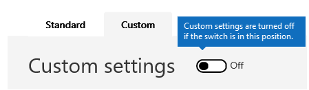

# <a name="enable-or-disable-safety-tips-in-office-365"></a>Veiligheidstips in- of uitschakelen in Office 365

Exchange Online Protection (EOP) voegt een veiligheidstip toe aan e-mailberichten die het levert. Deze veiligheidstips bieden ontvangers een snelle, visuele manier om te bepalen of een bericht afkomstig is van een veilige, geverifieerde afzender, als het bericht is gemarkeerd als spam door Office 365, als het bericht iets verdachts bevat, zoals een phishing-scam, of als externe afbeeldingen geblokkeerd. Beheerders van Office 365 en EOP-zelfstandige bestanden kunnen een instelling voor spambeleid bewerken om veiligheidstips in of uit te schakelen die worden weergegeven in e-mail in Outlook en andere bureaublad-e-mailclients.

Office 365 maakt standaard veiligheidstips voor uw organisatie en we raden u aan deze standaard in staat te stellen om spam- en phishingaanvallen te bestrijden. U veiligheidstips voor de webversie van Outlook niet uitschakelen.

Zie [Veiligheidstips in e-mailberichten in Office 365](safety-tips-in-office-365.md) voor voorbeelden en informatie over de informatie die in veiligheidstips wordt weergegeven.

In dit onderwerp:

- [Veiligheidstips inschakelen of uitschakelen met behulp van &amp; het Office 365 Security Compliance Center](enable-or-disable-safety-tips.md#SandCCsafetytip)

- [Veiligheidstips inschakelen of uitschakelen met PowerShell](enable-or-disable-safety-tips.md#pshellsafetytip)

## <a name="to-enable-or-disable-safety-tips-by-using-the-office-365-security-amp-compliance-center"></a>Veiligheidstips inschakelen of uitschakelen met behulp van &amp; het Office 365 Security Compliance Center
<a name="SandCCsafetytip"> </a>

1. Ga naar [https://protection.office.com](https://protection.office.com).

2. Meld u aan bij Office 365 met uw werk- of schoolaccount.

3. Kies **Beleid voor bedreigingsbeheer** \> **.**

4. Kies op de pagina **Beleid** **anti-spam**.

    

5. Kies op de pagina **Anti-spam-instellingen** het tabblad **Aangepast.**

    

6. Kies indien nodig de aangepaste **instellingenschakelaar** om aangepaste instellingen in te schakelen. Als de aangepaste instellingen-switch is ingesteld op **Uit,** u het beleid voor spamfilters niet wijzigen.

    

7. Vouw het spambeleid uit dat u wilt wijzigen en kies **het beleid bewerken**. Kies bijvoorbeeld de pijl-omlaag naast **het standaardspamfilterbeleid**. Of, als u wilt, u een nieuw beleid maken door **een beleid toevoegen**te kiezen.

8. Spam- **en bulkacties** uitbreiden.

9. Als u veiligheidstips wilt inschakelen, schakelt u onder **Veiligheidstips**het selectievakje **Aan** in. Schakel het selectievakje **Aan** uit om veiligheidstips uit te schakelen.

10. Selecteer **Save**.

## <a name="to-enable-or-disable-safety-tips-by-using-powershell"></a>Veiligheidstips inschakelen of uitschakelen met PowerShell
<a name="pshellsafetytip"> </a>

Beheerders kunnen Exchange Online PowerShell gebruiken om veiligheidstips in te schakelen of uit te schakelen. Gebruik de cmdlet Set-HostedContentFilterPolicy om veiligheidstips in een spamfilterbeleid in of uit te schakelen.

1. Maak verbinding met Exchange Online PowerShell. Zie Verbinding [maken met Exchange Online PowerShell](https://docs.microsoft.com/powershell/exchange/exchange-online/connect-to-exchange-online-powershell/connect-to-exchange-online-powershell)voor informatie.

2. Voer de cmdlet Set-HostedContentFilterPolicy uit om veiligheidstips in te schakelen of uit te schakelen:

   ```powershell
   Set-HostedContentFilterPolicy -Identity "policy name " -InlineSafetyTipsEnabled <$true | $false>
   ```

Waar:

- *beleidsnaam* is de naam van het beleid dat u wilt wijzigen, bijvoorbeeld **standaard**.

- `$true`maakt veiligheidstips voor het spamfilterbeleid mogelijk.

- `$false`schakelt veiligheidstips uit voor het spamfilterbeleid.

Als u bijvoorbeeld veiligheidstips voor het standaardspamfilterbeleid wilt uitschakelen, voert u de volgende opdracht uit:

```powershell
Set-HostedContentFilterPolicy -Identity "default" -InlineSafetyTipsEnabled $false
```

Zie [Beleid voor inhoudsopties instellen voor](https://docs.microsoft.com/powershell/module/exchange/antispam-antimalware/set-hostedcontentfilterpolicy)meer informatie over deze cmdlet.

## <a name="still-need-help"></a>Nog steeds hulp nodig?
<a name="pshellsafetytip"> </a>

Als u veiligheidstips hebt uitgeschakeld, maar ze nog steeds in uw e-mailberichten ziet, controleert u deze dingen:

- U veiligheidstips voor de webversie van Outlook niet uitschakelen. Probeer dezelfde e-mail weer te geven in een andere client, zoals Outlook.

- Veiligheidstips zijn standaard beschikbaar voor iedereen die EOP gebruikt, dit geldt ook voor iedereen die Office 365 heeft. Als u wilt voorkomen dat veiligheidstips in e-mail worden weergegeven, moet u deze uitschakelen met behulp van een spamfilterbeleid zoals beschreven in dit onderwerp. Zodra u het beleid hebt ingesteld, moet u ervoor zorgen dat het is ingeschakeld. Zie [Uw spamfilterbeleid](configure-your-spam-filter-policies.md)configureren voor informatie over het inschakelen van het beleid voor spamfilters .

Zie [Office 365 Email Anti-Spam Protection](anti-spam-protection.md)voor meer manieren om spam en phishing te bestrijden.
