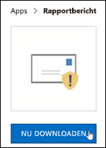
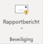
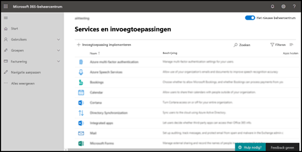
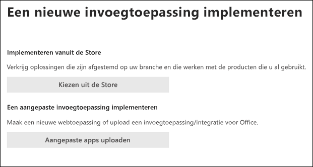
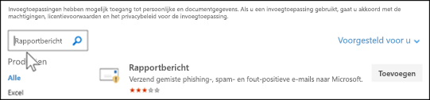
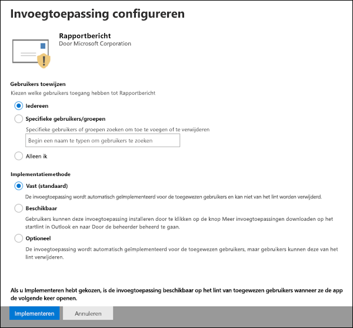
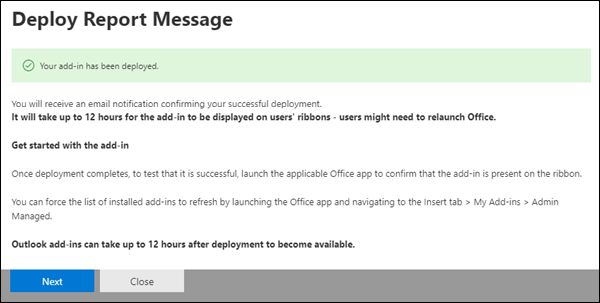
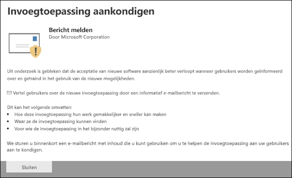
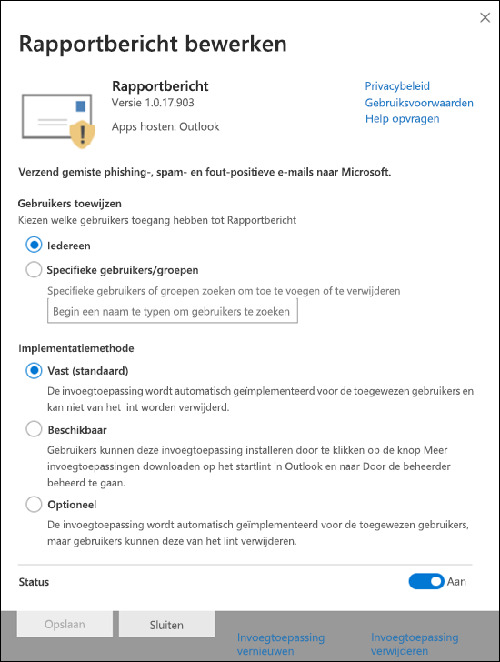

# De invoegtoepassing Bericht rapporteren inschakelenEnable the Report Message add-in

> [!NOTE]
> Als u een beheerder bent in een Microsoft 365-organisatie met Exchange Online-postvakken, raden we u aan de portal Inzendingen te gebruiken in het Beveiligings- & Compliance Center.If you're an admin in a Microsoft 365 organization with Exchange Online mailboxes, we recommend that you use the Submissions portal in the Security & Compliance Center. Zie [Het indienen van beheerders gebruiken om vermoedelijke spam, phish, URL's en bestanden in te dienen bij Microsoft.](admin-submission.md)For more information, see [Use Admin Submission to submit suspected spam, phish, URLs, and files to Microsoft](admin-submission.md).

Met de invoegtoepassing Rapportbericht voor Outlook en Outlook op het web (voorheen Outlook Web App) kunnen mensen eenvoudig valse positieven (goede e-mail gemarkeerd als slecht) of valse negatieven (slechte e-mail toegestaan) melden aan Microsoft en haar gelieerde ondernemingen voor analyse.The Report Message add-in for Outlook and Outlook on the web (formerly known as Outlook Web App) enables people to easily report false positives (good email marked as bad) or false negatives (bad email allowed) to Microsoft and its affiliates for analysis. Microsoft gebruikt deze inzendingen om de effectiviteit van e-mailbeveiligingstechnologieën te verbeteren.Microsoft uses these submissions to improve the effectiveness of email protection technologies.

Stel dat mensen veel berichten melden als phishing.For example, suppose that people are reporting a lot of messages as phishing. Deze informatie wordt weergegeven in het [beveiligingsdashboard](security-dashboard.md) en andere rapporten.This information surfaces in the [Security Dashboard](security-dashboard.md) and other reports. Het beveiligingsteam van uw organisatie kan deze informatie gebruiken als een indicatie dat het antiphishingbeleid mogelijk moet worden bijgewerkt.Your organization's security team can use this information as an indication that anti-phishing policies might need to be updated. Als mensen veel berichten rapporteren die als ongewenste e-mail zijn gemarkeerd als Niet-ongewenstee e-mail met behulp van de invoegtoepassing Rapportbericht, moet het beveiligingsteam van uw organisatie mogelijk [het antispambeleid](configure-your-spam-filter-policies.md)aanpassen.Or, if people are reporting a lot of messages that were flagged as junk mail as Not Junk by using the Report Message add-in, your organization's security team might need to adjust [anti-spam policies](configure-your-spam-filter-policies.md).

Als uw organisatie bovendien [Office 365 Advanced Threat Protection Plan 1](office-365-atp.md) of Plan [2](office-365-ti.md)gebruikt, biedt de invoegtoepassing Rapportbericht het beveiligingsteam van uw organisatie nuttige informatie die ze kunnen gebruiken om het beveiligingsbeleid te bekijken en bij te werken.In addition, if your organization is using [Office 365 Advanced Threat Protection Plan 1](office-365-atp.md) or [Plan 2](office-365-ti.md), the Report Message add-in provides your organization's security team with useful information they can use to review and update security policies.

Beheerders kunnen de invoegtoepassing Rapportbericht voor de organisatie inschakelen en individuele gebruikers kunnen het zelf installeren.Admins can enable the Report Message add-in for the organization, and individual users can install it for themselves.

Als u een individuele gebruiker bent, u [de invoegtoepassing Bericht melden voor uzelf inschakelen.](#get-the-report-message-add-in-for-yourself)If you're an individual user, you can [enable the Report Message add-in for yourself](#get-the-report-message-add-in-for-yourself).

Als u een globale beheerder of een Exchange Online-beheerder bent en Exchange is geconfigureerd om OAuth-verificatie te gebruiken, u [de invoegtoepassing Bericht rapport voor uw organisatie inschakelen.](#get-and-enable-the-report-message-add-in-for-your-organization)If you're a global administrator or an Exchange Online administrator, and Exchange is configured to use OAuth authentication, you can [enable the Report Message add-in for your organization](#get-and-enable-the-report-message-add-in-for-your-organization). De invoegtoepassing Rapportbericht is nu beschikbaar via [gecentraliseerde implementatie.](https://docs.microsoft.com/office365/admin/manage/centralized-deployment-of-add-ins)The Report Message Add-In is now available through [Centralized Deployment](https://docs.microsoft.com/office365/admin/manage/centralized-deployment-of-add-ins).

## Wat moet u weten voordat u begint?What do you need to know before you begin?

- De invoegtoepassing Rapportbericht werkt met de meeste Microsoft 365-abonnementen en de volgende producten:The Report Message add-in works with most Microsoft 365 subscriptions and the following products:

  - De webversie van OutlookOutlook on the web
  - Outlook 2013 SP1 of hogerOutlook 2013 SP1 or later
  - Outlook 2016 voor MacOutlook 2016 for Mac
  - Outlook opgenomen in Microsoft 365-apps voor EnterpriseOutlook included with Microsoft 365 apps for Enterprise

- De invoegtoepassing Rapportbericht is momenteel niet beschikbaar voor:The Report Message add-in is currently not available for:

  - Postvakken in on-premises Exchange-organisatiesMailboxes in on-premises Exchange organizations
  - GCC-, GCC HIGH- of DoD-abonnementenGCC, GCC HIGH, or DoD subscriptions

- U configureren dat gerapporteerde berichten worden gekopieerd of doorgestuurd naar een postvak dat u opgeeft.You can configure reported messages to be copied or redirected to a mailbox that you specify. Zie [Een postvak opgeven voor het indienen van spam- en phishingberichten in Exchange Online voor](user-submission.md)meer informatie.For more information, see [Specify a mailbox for user submissions of spam and phishing messages in Exchange Online](user-submission.md).

- Uw bestaande webbrowser moet werken met de invoegtoepassing Bericht rapporteren.Your existing web browser should work with the Report Message add-in. Maar als u merkt dat de invoegtoepassing niet beschikbaar is of niet werkt zoals verwacht, probeert u een andere browser.But, if you notice the add-in is not available or not working as expected, try a different browser.

- Voor organisatorische installaties moet de organisatie worden geconfigureerd om OAuth-verificatie te gebruiken.For organizational installs, the organization needs to be configured to use OAuth authentication. Zie [Bepalen of gecentraliseerde implementatie van invoegingen voor uw organisatie werkt](../../admin/manage/centralized-deployment-of-add-ins.md)voor meer informatie.For more information, see [Determine if Centralized Deployment of add-ins works for your organization](../../admin/manage/centralized-deployment-of-add-ins.md).

- Beheerders moeten lid zijn van de rolgroep Globale beheerders.Admins need to be a member of the Global admins role group. Zie [Machtigingen in het Beveiligings- & compliancecentrum](permissions-in-the-security-and-compliance-center.md) voor meer informatie.For more information, see [Permissions in the Security & Compliance Center](permissions-in-the-security-and-compliance-center.md).

## De invoegtoepassing Rapportbericht zelf opvragenGet the Report Message add-in for yourself

1. Ga naar de Microsoft AppSource <https://appsource.microsoft.com/marketplace/apps> bij en zoek naar de invoegtoepassing Bericht rapport.Go to the Microsoft AppSource at <https://appsource.microsoft.com/marketplace/apps> and search for the Report Message add-in. Ga naar <https://appsource.microsoft.com/product/office/wa104381180> .To go directly to the Report Message add-in, go to <https://appsource.microsoft.com/product/office/wa104381180>.

2. Klik **op NU KRIJGEN.**Click **GET IT NOW**.

   

3. Bekijk in het dialoogvenster dat wordt weergegeven de gebruiksvoorwaarden en het privacybeleid en klik op **Doorgaan**.In the dialog that appears, review the terms of use and privacy policy, and then click **Continue**.

4. Meld u aan met uw werk- of schoolaccount (voor zakelijk gebruik) of uw Microsoft-account (voor persoonlijk gebruik).Sign in using your work or school account (for business use) or your Microsoft account (for personal use).

Nadat de invoegtoepassing is geïnstalleerd en ingeschakeld, ziet u de volgende pictogrammen:After the add-in is installed and enabled, you'll see the following icons:

- In Outlook ziet het pictogram er als volgt uit:In Outlook, the icon looks like this:

  

- In de webversie van Outlook ziet het pictogram er als volgt uit:In Outlook on the web, the icon looks like this:

  

Zie [De invoegtoepassing Rapportbericht gebruiken](https://support.office.com/article/b5caa9f1-cdf3-4443-af8c-ff724ea719d2)voor meer informatie over het gebruik van de invoegtoepassing Rapport.To learn how to use the add-in, see [Use the Report Message add-in](https://support.office.com/article/b5caa9f1-cdf3-4443-af8c-ff724ea719d2).

## De invoegtoepassing Rapportbericht voor uw organisatie opvragen en inschakelenGet and enable the Report Message add-in for your organization

> [!NOTE]
> Het kan tot 12 uur duren voordat de invoegtoepassing in uw organisatie wordt weergegeven.It could take up to 12 hours for the add-in to appear in your organization.

1. Ga in het Microsoft 365-beheercentrum naar de pagina **Services & invoegtoepassing** <https://admin.microsoft.com/AdminPortal/Home#/Settings/ServicesAndAddIns> op , en klik vervolgens op **Invoegtoepassing implementeren**.In the Microsoft 365 admin center, go to the **Services & add-ins** page at <https://admin.microsoft.com/AdminPortal/Home#/Settings/ServicesAndAddIns>, and then click **Deploy Add-In**.

   

2. Bekijk de informatie in de flyout Implementeren die wordt weergegeven door een nieuwe flyout voor **invoeging** en klik op **Volgende**.In the **Deploy a new add-in** flyout that appears, review the information, and then click **Next**.

3. Klik op de volgende pagina op **Kiezen uit de Store**.On the next page, click **Choose from the Store**.

   

4. Klik op de **invoegpagina Selecteren** die wordt weergegeven in het vak **Zoeken,** voer **Bericht melden**in en klik vervolgens op Zoekpictogram **zoeken**  .In the **Select add-in** page that appears, click in the **Search** box, enter **Report Message**, and then click **Search** . Zoek in de lijst met resultaten **rapportbericht** en klik op **Toevoegen**.In the list of results, find **Report Message** and then click **Add**.

   

5. Bekijk in het dialoogvenster dat wordt weergegeven de licentie- en privacygegevens en klik op **Doorgaan**.In the dialog that appears, review the licensing and privacy information, and then click **Continue**.

6. Configureer de volgende instellingen op de pagina **Invoegpagina configureren** die wordt weergegeven:In the **Configure add-in** page that appears, configure the following settings:

   - **Toegewezen gebruikers**: Selecteer een van de volgende waarden:**Assigned users**: Select one of the following values:

     - **Iedereen** (standaard)**Everyone** (default)
     - **Specifieke gebruikers /groepen****Specific users / groups**
     - **Alleen ik****Just me**

   - **Implementatiemethode:** Selecteer een van de volgende waarden:**Deployment method**: Select one of the following values:

     - **Fixed (Default)**: De invoegtoepassing wordt automatisch geïmplementeerd bij de opgegeven gebruikers en deze kunnen niet worden verwijderd.**Fixed (Default)**: The add-in is automatically deployed to the specified users and they can't remove it.
     - **Beschikbaar:** Gebruikers kunnen de add-in installeren bij **Home** \> **Get-ins** \> **Admin-managed**.**Available**: Users can install the add-in at **Home** \> **Get add-ins** \> **Admin-managed**.
     - **Optioneel**: de invoegtoepassing wordt automatisch geïmplementeerd bij de opgegeven gebruikers, maar ze kunnen ervoor kiezen om de invoeging te verwijderen.**Optional**: The add-in is automatically deployed to the specified users, but they can choose to remove it.

   

   Klik op **Implementeren**als u klaar bent.When you're finished, click **Deploy**.

7. Op de pagina **Bericht implementeren** dat wordt weergegeven, ziet u een voortgangsrapport gevolgd door een bevestiging dat de invoegtoepassing is geïmplementeerd.In the **Deploy Report Message** page that appears, you'll see a progress report followed by a confirmation that the add-in was deployed. Nadat u de informatie hebt gelezen, klikt u op **Volgende**.After you read the information, click **Next**.

   

8. Bekijk de informatie op de **invoegpagina aankondigen** die wordt weergegeven en klik op **Sluiten**.On the **Announce add-in** page that appears, review the information, and then click **Close**.

   

## Meer informatie over het gebruik van de invoegtoepassing RapportberichtLearn how to use the Report Message add-in

Mensen die de invoegtoepassing aan hen hebben toegewezen, zien de volgende pictogrammen:People who have the add-in assigned to them will see the following icons:

- In Outlook ziet het pictogram er als volgt uit:In Outlook, the icon looks like this:

  

- In de webversie van Outlook ziet het pictogram er als volgt uit:In Outlook on the web, the icon looks like this:

  

Wanneer u gebruikers op de hoogte stelt van de invoegtoepassing Bericht melden, voegt u een koppeling toe naar [De invoegtoepassing Rapportbericht gebruiken.](https://support.office.com/article/b5caa9f1-cdf3-4443-af8c-ff724ea719d2)When you notify users about the Report Message add-in, include a link to [Use the Report Message add-in](https://support.office.com/article/b5caa9f1-cdf3-4443-af8c-ff724ea719d2).

## Instellingen voor de invoegtoepassing Rapportbericht controleren of bewerkenReview or edit settings for the Report Message add-in

1. Ga in het Microsoft 365-beheercentrum naar de pagina **Services &-invoegtoepassing** op <https://admin.microsoft.com/AdminPortal/Home#/Settings/ServicesAndAddIns> .In the Microsoft 365 admin center, go to the **Services & add-ins** page at <https://admin.microsoft.com/AdminPortal/Home#/Settings/ServicesAndAddIns>.

   

2. Zoek en selecteer de **invoegtoepassing Rapportbericht.**Find and select the **Report Message** add-in.

3. Bekijk en bewerk de instellingen waar nodig voor uw organisatie in de flyout **Van rapportbericht bewerken** die wordt weergegeven.In the **Edit Report Message** flyout that appears, review and edit settings as appropriate for your organization. Klik op **Opslaan** wanneer u gereed bent.When you're finished, click **Save**.

   

## Gerapporteerde berichten weergeven en bekijkenView and review reported messages

Als u berichten wilt controleren die gebruikers aan Microsoft rapporteren, hebt u de volgende opties:To review messages that users report to Microsoft, you have these options:

- Gebruik de portal Voor inzendingen voor beheerders.Use the Admin Submissions portal. Zie [Inzendingen van gebruikers bij Microsoft weergeven voor](admin-submission.md#view-user-submissions-to-microsoft)meer informatie.For more information, see [View user submissions to Microsoft](admin-submission.md#view-user-submissions-to-microsoft).

- Maak een regel voor e-mailstroom (ook wel transportregel genoemd) om kopieën van gerapporteerde berichten te verzenden.Create a mail flow rule (also known as a transport rule) to send copies of reported messages. Zie Regels [voor e-mailstromen gebruiken om te zien wat uw gebruikers aan Microsoft rapporteren.](use-mail-flow-rules-to-see-what-your-users-are-reporting-to-microsoft.md)For instructions, see [Use mail flow rules to see what your users are reporting to Microsoft](use-mail-flow-rules-to-see-what-your-users-are-reporting-to-microsoft.md).
