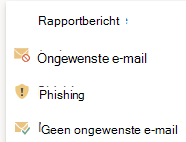

# Het rapportbericht of de phishing-invoegvoegingen rapporteren inschakelenEnable the Report Message or the Report Phishing add-ins

[!INCLUDE [Microsoft 365 Defender rebranding](../includes/microsoft-defender-for-office.md)]

**Van toepassing op****Applies to**
- [Exchange Online ProtectionExchange Online Protection](exchange-online-protection-overview.md)
- [Abonnement 1 en abonnement 2 voor Microsoft Defender voor Office 365Microsoft Defender for Office 365 plan 1 and plan 2](defender-for-office-365.md)
- [Microsoft 365 DefenderMicrosoft 365 Defender](../defender/microsoft-365-defender.md)

> [!NOTE]
> Als u een beheerder bent in een Microsoft 365-organisatie met Exchange Online-postvakken, raden we u aan de portal Inzendingen te gebruiken in de Microsoft 365 Defender-portal.If you're an admin in a Microsoft 365 organization with Exchange Online mailboxes, we recommend that you use the Submissions portal in the Microsoft 365 Defender portal. Zie Beheerdersinzending gebruiken om [verdachte spam, phish, URL's en](admin-submission.md)bestanden in te dienen bij Microsoft voor meer informatie.For more information, see [Use Admin Submission to submit suspected spam, phish, URLs, and files to Microsoft](admin-submission.md).

Met de invoegvoegingen Rapportbericht en Rapport phishing voor de webversie van Outlook en Outlook (voorheen Bekend als Outlook Web App) kunnen personen eenvoudig onwaar-positieven (goede e-mail die als slecht is gemarkeerd) of onwaar negatieven (slechte e-mail toegestaan) rapporteren aan Microsoft en haar gelieerde bedrijven voor analyse.The Report Message and Report Phishing add-ins for Outlook and Outlook on the web (formerly known as Outlook Web App) enable people to easily report false positives (good email marked as bad) or false negatives (bad email allowed) to Microsoft and its affiliates for analysis.

Microsoft gebruikt deze inzendingen om de effectiviteit van e-mailbeveiligingstechnologieën te verbeteren.Microsoft uses these submissions to improve the effectiveness of email protection technologies. Stel dat mensen veel berichten rapporteren met de invoeging Phishing melden.For example, suppose that people are reporting many messages using the Report Phishing add-in. Deze informatie wordt in het beveiligingsdashboard en andere rapporten opgedoken.This information surfaces in the Security Dashboard and other reports. Het beveiligingsteam van uw organisatie kan deze informatie gebruiken als een indicatie dat anti-phishingbeleid mogelijk moet worden bijgewerkt.Your organization's security team can use this information as an indication that anti-phishing policies might need to be updated.

U kunt de invoeging Rapportbericht of Phishing melden installeren.You can install either the Report Message or Report Phishing add-in. Als u wilt dat uw gebruikers zowel spam- als phishingberichten rapporteren, implementeert u de invoeging Rapportbericht in uw organisatie.If you want your users to report both spam and phishing messages, deploy the Report Message add-in in your organization. Zie De invoegvoegapp Rapportbericht inschakelen voor meer informatie.For more information, see Enable the Report Message add-in.

De invoegoptie Rapportbericht biedt de optie om zowel spam- als phishingberichten te rapporteren.The Report Message add-in provides the option to report both spam and phishing messages. Beheerders kunnen de invoeging Rapportbericht voor de organisatie inschakelen en afzonderlijke gebruikers kunnen het zelf installeren.Admins can enable the Report Message add-in for the organization, and individual users can install it for themselves.

De invoegvoegvoegoptie Phishing melden biedt de optie om alleen phishingberichten te rapporteren.The Report Phishing add-in provides the option to report only phishing messages. Beheerders kunnen de invoeging Phishing melden inschakelen voor de organisatie en afzonderlijke gebruikers kunnen deze zelf installeren.Admins can enable the Report Phishing add-in for the organization, and individual users can install it for themselves.

Als u een individuele gebruiker bent, kunt u beide invoegvoegingen voor uzelf inschakelen.If you're an individual user, you can enable both the add-ins for yourself.

Als u een globale beheerder of een Exchange Online-beheerder bent en Exchange is geconfigureerd voor het gebruik van OAuth-verificatie, kunt u de invoeging Rapportbericht en de invoeging Phishingrapport voor uw organisatie inschakelen.If you're a global administrator or an Exchange Online administrator, and Exchange is configured to use OAuth authentication, you can enable the Report Message add-in and the Report Phishing add-in for your organization. Beide invoegvoegingen zijn nu beschikbaar via [Gecentraliseerde implementatie.](../../admin/manage/centralized-deployment-of-add-ins.md)Both add-ins are now available through [Centralized Deployment](../../admin/manage/centralized-deployment-of-add-ins.md).

## Wat moet u weten voordat u begint?What do you need to know before you begin?

- Zowel de invoeging Report Message als de invoeging Report Phishing werkt met de meeste Microsoft 365-abonnementen en de volgende producten:Both the Report Message add-in and the Report Phishing add-in works with most Microsoft 365 subscriptions and the following products:
  - Webversie van OutlookOutlook on the web
  - Outlook 2013 SP1 of hogerOutlook 2013 SP1 or later
  - Outlook 2016 voor MacOutlook 2016 for Mac
  - Outlook inbegrepen bij Microsoft 365-apps voor EnterpriseOutlook included with Microsoft 365 apps for Enterprise
  - Outlook-app voor iOS en AndroidOutlook app for iOS and Android

- Beide invoegvakken zijn niet beschikbaar voor gedeelde postvakken of postvakken in on-premises Exchange-organisaties.Both add-ins are not available for shared mailboxes or mailboxes in on-premises Exchange organizations.

- Uw bestaande webbrowser moet werken met zowel de invoegvoegingen Rapportbericht als Phishing melden. Maar als u merkt dat de invoegvoeging niet beschikbaar is of niet werkt zoals verwacht, probeert u een andere browser.Your existing web browser should work with both the Report Message and Report Phishing add-ins. But, if you notice the add-in is not available or not working as expected, try a different browser.

- Voor organisatie-installaties moet de organisatie zijn geconfigureerd voor het gebruik van OAuth-verificatie.For organizational installs, the organization needs to be configured to use OAuth authentication. Zie Bepalen of gecentraliseerde implementatie van invoegvoegingen werkt [voor uw organisatie voor meer informatie.](../../admin/manage/centralized-deployment-of-add-ins.md)For more information, see [Determine if Centralized Deployment of add-ins works for your organization](../../admin/manage/centralized-deployment-of-add-ins.md).

- Beheerders moeten lid zijn van de rollengroep Globale beheerders.Admins need to be a member of the Global admins role group. Zie Machtigingen [in de Microsoft 365 Defender-portal](permissions-microsoft-365-security-center.md)voor meer informatie.For more information, see [Permissions in the Microsoft 365 Defender portal](permissions-microsoft-365-security-center.md).

- Zie Fout-positieven en onwaar negatieven rapporteren in Outlook voor meer informatie over het rapporteren van een bericht met de functie [Rapportbericht.](report-false-positives-and-false-negatives.md)For more information on how to report a message using the Report Message feature, see [Report false positives and false negatives in Outlook](report-false-positives-and-false-negatives.md).

> [!IMPORTANT]
> We raden de ingebouwde rapportageervaring in Outlook niet aan, omdat het beleid voor het indienen van gebruikers niet [kan worden gebruikt.](./user-submission.md)We don't recommend the built-in reporting experience in Outlook because it can't use the [user submission policy](./user-submission.md). We raden u aan in plaats daarvan de invoeging Rapportbericht of de invoeging Phishing melden te gebruiken.We recommend using the Report Message add-in or the Report Phishing add-in instead.

## De invoegvoegvoegvoeging Rapportbericht ontvangenGet the Report Message add-in

### De invoeging Rapportbericht voor uzelf krijgenGet the Report Message add-in for yourself

1. Ga naar de Microsoft AppSource bij <https://appsource.microsoft.com/marketplace/apps> en zoek naar de invoeging Rapportbericht.Go to the Microsoft AppSource at <https://appsource.microsoft.com/marketplace/apps> and search for the Report Message add-in. Als u rechtstreeks naar de invoeging Rapportbericht wilt gaan, gaat u naar <https://appsource.microsoft.com/product/office/wa104381180> .To go directly to the Report Message add-in, go to <https://appsource.microsoft.com/product/office/wa104381180>.

2. Klik **op NU krijgen.**Click **GET IT NOW**.

   

3. Bekijk in het dialoogvenster dat wordt weergegeven de gebruiksvoorwaarden en het privacybeleid en klik vervolgens op **Doorgaan.**In the dialog that appears, review the terms of use and privacy policy, and then click **Continue**.

4. Meld u aan met uw werk- of schoolaccount (voor zakelijk gebruik) of uw Microsoft-account (voor persoonlijk gebruik).Sign in using your work or school account (for business use) or your Microsoft account (for personal use).

Nadat de invoegvoegvoeging is geïnstalleerd en ingeschakeld, ziet u de volgende pictogrammen:After the add-in is installed and enabled, you'll see the following icons:

- In Outlook ziet het pictogram er als volgende uit:In Outlook, the icon looks like this:

  > [!div class="mx-imgBorder"]
  > 

- In de webversie van Outlook ziet het pictogram er als volgende uit:In Outlook on the web, the icon looks like this:

  > [!div class="mx-imgBorder"]
  > 

### De invoegvoegvoeging Rapportbericht voor uw organisatie ontvangenGet the Report Message add-in for your organization

> [!NOTE]
> Het kan tot 12 uur duren voordat de invoegvoeging wordt weergegeven in uw organisatie.It could take up to 12 hours for the add-in to appear in your organization.

1. Ga in het Microsoft 365-beheercentrum naar **de** pagina Instellingen \> **invoegvoegingen** op <https://admin.microsoft.com/AdminPortal/Home#/Settings/AddIns> .In the Microsoft 365 admin center, go to the **Settings** \> **Add-ins** page at <https://admin.microsoft.com/AdminPortal/Home#/Settings/AddIns>. Als u de invoegpagina niet ziet,  gaat u naar de koppeling Geïntegreerde apps met instellingen boven aan de pagina Geïntegreerde  \>  \>  **apps.**If you don't see the **Add-in** Page, go to the **Settings** \> **Integrated apps** \> **Add-ins** link on the top of the **Integrated apps** page.

2. Selecteer **Invoegvoegvoeging implementeren** boven aan de pagina en selecteer vervolgens **Volgende.**Select **Deploy Add-in** at the top of the page, and then select **Next**.

   

3. Controleer de informatie in het **fly-out Nieuwe invoegsel** implementeren dat wordt weergegeven en klik vervolgens op **Volgende.**In the **Deploy a new add-in** flyout that appears, review the information, and then click **Next**.

4. Klik op de volgende pagina op **Kiezen uit de Store.**On the next page, click **Choose from the Store**.

   

5. Klik in het vak Zoeken op de  pagina Selecteer **invoegbericht** dat wordt weergegeven, voer **Rapportbericht** in en klik vervolgens op **zoekpictogram**  .In the **Select add-in** page that appears, click in the **Search** box, enter **Report Message**, and then click **Search** . Zoek rapportbericht in de lijst met **resultaten** en klik vervolgens op **Toevoegen.**In the list of results, find **Report Message** and then click **Add**.

   

6. Controleer in het dialoogvenster dat wordt weergegeven de licentie- en privacygegevens en klik vervolgens op **Doorgaan.**In the dialog that appears, review the licensing and privacy information, and then click **Continue**.

7. Configureer de volgende instellingen op de **pagina Invoeging** configureren die wordt weergegeven:In the **Configure add-in** page that appears, configure the following settings:

   - **Toegewezen gebruikers:** Selecteer een van de volgende waarden:**Assigned users**: Select one of the following values:
     - **Iedereen** (standaard)**Everyone** (default)
     - **Specifieke gebruikers/groepen****Specific users / groups**
     - **Alleen ik****Just me**

   - **Implementatiemethode:** Selecteer een van de volgende waarden:**Deployment method**: Select one of the following values:
     - **Opgelost (standaard)**: De invoeging wordt automatisch geïmplementeerd voor de opgegeven gebruikers en kan niet worden verwijderd.**Fixed (Default)**: The add-in is automatically deployed to the specified users and they can't remove it.
     - **Beschikbaar:** Gebruikers kunnen de invoegvoeging installeren bij **Home** \> **Get-invoegvoegingen** beheerd door \> **beheerder.****Available**: Users can install the add-in at **Home** \> **Get add-ins** \> **Admin-managed**.
     - **Optioneel:** De invoeging wordt automatisch geïmplementeerd voor de opgegeven gebruikers, maar ze kunnen ervoor kiezen deze te verwijderen.**Optional**: The add-in is automatically deployed to the specified users, but they can choose to remove it.

   

   Wanneer u klaar bent, klikt u op **Implementeren.**When you're finished, click **Deploy**.

8. Op de **pagina Rapportbericht** implementeren dat wordt weergegeven, ziet u een voortgangsrapport, gevolgd door een bevestiging dat de invoegvoeging is geïmplementeerd.In the **Deploy Report Message** page that appears, you'll see a progress report followed by a confirmation that the add-in was deployed. Nadat u de informatie hebt gelezen, klikt u op **Volgende**.After you read the information, click **Next**.

   

9. Controleer de gegevens op de **pagina Invoeging** aankondigen die wordt weergegeven en klik op **Sluiten.**On the **Announce add-in** page that appears, review the information, and then click **Close**.

   

## Instellingen controleren of bewerken voor de invoegvoegbewerking RapportberichtReview or edit settings for the Report Message add-in

1. Ga in het Microsoft 365-beheercentrum  naar de pagina Instellingen \> **invoegvoegingen** op <https://admin.microsoft.com/AdminPortal/Home#/Settings/AddIns> .In the Microsoft 365 admin center, go to the go to the **Settings** \> **Add-ins** page at <https://admin.microsoft.com/AdminPortal/Home#/Settings/AddIns>. Als u de invoegpagina niet ziet,  gaat u naar de koppeling Geïntegreerde apps met instellingen boven aan de pagina Geïntegreerde  \>  \>  **apps.**If you don't see the **Add-in** Page, go to the **Settings** \> **Integrated apps** \> **Add-ins** link on the top of the **Integrated apps** page.

   

2. Zoek en selecteer de **invoeging Rapportbericht.**Find and select the **Report Message** add-in.

3. In het **flyout Rapportbericht bewerken** dat wordt weergegeven, controleert en bewerkt u de instellingen die geschikt zijn voor uw organisatie.In the **Edit Report Message** flyout that appears, review and edit settings as appropriate for your organization. Klik op **Opslaan** wanneer u gereed bent.When you're finished, click **Save**.

   

## De invoeging Phishing meldenGet the Report Phishing add-in

### De invoeging Report Phishing voor uzelf krijgenGet the Report Phishing add-in for yourself

1. Ga naar de Microsoft AppSource op <https://appsource.microsoft.com/marketplace/apps> en zoek naar de invoeging Phishing melden.Go to the Microsoft AppSource at <https://appsource.microsoft.com/marketplace/apps> and search for the Report Phishing add-in.

2. Klik **op NU krijgen.**Click **GET IT NOW**.

3. Bekijk in het dialoogvenster dat wordt weergegeven de gebruiksvoorwaarden en het privacybeleid en klik vervolgens op **Doorgaan.**In the dialog that appears, review the terms of use and privacy policy, and then click **Continue**.

4. Meld u aan met uw werk- of schoolaccount (voor zakelijk gebruik) of uw Microsoft-account (voor persoonlijk gebruik).Sign in using your work or school account (for business use) or your Microsoft account (for personal use).

Nadat de invoegvoegvoeging is geïnstalleerd en ingeschakeld, ziet u de volgende pictogrammen:After the add-in is installed and enabled, you'll see the following icons:

- In Outlook ziet het pictogram er als volgende uit:In Outlook, the icon looks like this:

  

- In de webversie van Outlook ziet het pictogram er als volgende uit:In Outlook on the web, the icon looks like this:

  > [!div class="mx-imgBorder"]
  > 

### De invoeging Phishingrapport voor uw organisatie ontvangenGet the Report Phishing add-in for your organization

> [!NOTE]
> Het kan tot 12 uur duren voordat de invoegvoeging wordt weergegeven in uw organisatie.It could take up to 12 hours for the add-in to appear in your organization.

1. Ga in het Microsoft 365-beheercentrum  naar de pagina Instellingen \> **invoegvoegingen** op <https://admin.microsoft.com/AdminPortal/Home#/Settings/AddIns> .In the Microsoft 365 admin center, go to the go to the **Settings** \> **Add-ins** page at <https://admin.microsoft.com/AdminPortal/Home#/Settings/AddIns>. Als u de invoegpagina niet ziet,  gaat u naar de koppeling Geïntegreerde apps met instellingen boven aan de pagina Geïntegreerde  \>  \>  **apps.**If you don't see the **Add-in** Page, go to the **Settings** \> **Integrated apps** \> **Add-ins** link on the top of the **Integrated apps** page.

2. Selecteer **Invoegvoegvoeging implementeren** boven aan de pagina en selecteer vervolgens **Volgende.**Select **Deploy Add-in** at the top of the page, and then select **Next**.

   

3. Controleer de informatie in het **fly-out Nieuwe invoegsel** implementeren dat wordt weergegeven en klik vervolgens op **Volgende.**In the **Deploy a new add-in** flyout that appears, review the information, and then click **Next**.

4. Klik op de volgende pagina op **Kiezen uit de Store.**On the next page, click **Choose from the Store**.

   

5. Klik in het vak Zoeken op de  **pagina** Invoeg toevoegen selecteren die wordt weergegeven, voer **Rapport phishing** in en klik vervolgens op **zoekpictogram**  .In the **Select add-in** page that appears, click in the **Search** box, enter **Report Phishing**, and then click **Search** . Zoek in de lijst met resultaten **naar Rapport phishing** en klik vervolgens op **Toevoegen.**In the list of results, find **Report Phishing** and then click **Add**.

6. Controleer in het dialoogvenster dat wordt weergegeven de licentie- en privacygegevens en klik vervolgens op **Doorgaan.**In the dialog that appears, review the licensing and privacy information, and then click **Continue**.

7. Configureer de volgende instellingen op de **pagina Invoeging** configureren die wordt weergegeven:In the **Configure add-in** page that appears, configure the following settings:

   - **Toegewezen gebruikers:** Selecteer een van de volgende waarden:**Assigned users**: Select one of the following values:
     - **Iedereen** (standaard)**Everyone** (default)
     - **Specifieke gebruikers/groepen****Specific users / groups**
     - **Alleen ik****Just me**

   - **Implementatiemethode:** Selecteer een van de volgende waarden:**Deployment method**: Select one of the following values:
     - **Opgelost (standaard)**: De invoeging wordt automatisch geïmplementeerd voor de opgegeven gebruikers en kan niet worden verwijderd.**Fixed (Default)**: The add-in is automatically deployed to the specified users and they can't remove it.
     - **Beschikbaar:** Gebruikers kunnen de invoegvoeging installeren bij **Home** \> **Get-invoegvoegingen** beheerd door \> **beheerder.****Available**: Users can install the add-in at **Home** \> **Get add-ins** \> **Admin-managed**.
     - **Optioneel:** De invoeging wordt automatisch geïmplementeerd voor de opgegeven gebruikers, maar ze kunnen ervoor kiezen deze te verwijderen.**Optional**: The add-in is automatically deployed to the specified users, but they can choose to remove it.

   Wanneer u klaar bent, klikt u op **Implementeren.**When you're finished, click **Deploy**.

8. Op de **pagina Rapport phishing implementeren** dat wordt weergegeven, ziet u een voortgangsrapport, gevolgd door een bevestiging dat de invoeging is geïmplementeerd.In the **Deploy Report Phishing** page that appears, you'll see a progress report followed by a confirmation that the add-in was deployed. Nadat u de informatie hebt gelezen, klikt u op **Volgende**.After you read the information, click **Next**.

9. Controleer de gegevens op de **pagina Invoeging** aankondigen die wordt weergegeven en klik op **Sluiten.**On the **Announce add-in** page that appears, review the information, and then click **Close**.

## Instellingen controleren of bewerken voor de invoeging PhishingrapportReview or edit settings for the Report Phishing add-in

1. Ga in het Microsoft 365-beheercentrum  naar de pagina Instellingen \> **invoegvoegingen** op <https://admin.microsoft.com/AdminPortal/Home#/Settings/AddIns> .In the Microsoft 365 admin center, go to the go to the **Settings** \> **Add-ins** page at <https://admin.microsoft.com/AdminPortal/Home#/Settings/AddIns>. Als u de invoegpagina niet ziet,  gaat u naar de koppeling Geïntegreerde apps met instellingen boven aan de pagina Geïntegreerde  \>  \>  **apps.**If you don't see the **Add-in** Page, go to the **Settings** \> **Integrated apps** \> **Add-ins** link on the top of the **Integrated apps** page.

2. Zoek en selecteer de **invoeging Phishing** melden.Find and select the **Report Phishing** add-in.

3. In het **flyout Rapport phishing bewerken** dat de instellingen voor uw organisatie wordt weergegeven, controleren en bewerken.In the **Edit Report Phishing** flyout that appears, review, and edit settings as appropriate for your organization. Klik op **Opslaan** wanneer u gereed bent.When you're finished, click **Save**.
