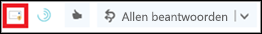
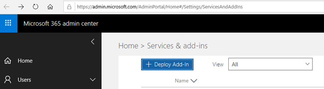
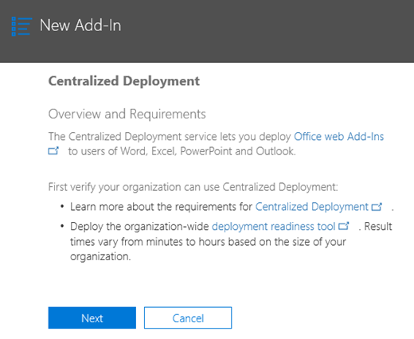

# De invoegtoepassing Rapportbericht inschakelenEnable the Report Message add-in

> [!NOTE]
> De invoegtoepassing Rapportbericht voor Outlook en Outlook op de web is niet precies hetzelfde als het [Outlook Junk Email-filter,](https://support.office.com/article/5ae3ea8e-cf41-4fa0-b02a-3b96e21de089)hoewel beide kunnen worden gebruikt om e-mail te markeren als ongewenste e-mail, geen ongewenste e-mail of een phishing-poging.The Report Message add-in for Outlook and Outlook on the web is not exactly the same thing as the [Outlook Junk Email Filter](https://support.office.com/article/5ae3ea8e-cf41-4fa0-b02a-3b96e21de089), although both can be used to mark email as junk, not junk, or a phishing attempt. Het verschil is dat de invoegtoepassing Bericht rapport voor Outlook en Outlook op het web Microsoft informeert over verkeerd geclassificeerde e-mail, terwijl het Outlook Junk Email Filter wordt gebruikt om e-mailberichten in het postvak van een gebruiker te ordenen.The difference is, the Report Message add-in for Outlook and Outlook on the web notifies Microsoft about misclassified email, whereas the Outlook Junk Email Filter is used to organize email messages in a user's mailbox.

## OverzichtOverview

Met de invoegtoepassing Rapportbericht voor Outlook en Outlook op de web (voorheen Outlook Web App) kunnen mensen eenvoudig verkeerd geclassificeerde e-mail, veilig of kwaadaardig, melden aan Microsoft en haar gelieerde ondernemingen voor analyse.The Report Message add-in for Outlook and Outlook on the web (formerly known as Outlook Web App) enables people to easily report misclassified email, whether safe or malicious, to Microsoft and its affiliates for analysis. Microsoft gebruikt deze inzendingen om de effectiviteit van e-mailbeveiligingstechnologieën te verbeteren.Microsoft uses these submissions to improve the effectiveness of email protection technologies. Als uw organisatie bovendien [Office 365 Advanced Threat Protection Plan 1](office-365-atp.md) of Plan [2](office-365-ti.md)gebruikt, biedt de invoegtoepassing Rapportbericht het beveiligingsteam van uw organisatie nuttige informatie die ze kunnen gebruiken om het beveiligingsbeleid te bekijken en bij te werken.In addition, if your organization is using [Office 365 Advanced Threat Protection Plan 1](office-365-atp.md) or [Plan 2](office-365-ti.md), the Report Message add-in provides your organization's security team with useful information they can use to review and update security policies.

Stel dat mensen veel berichten melden als phishing.For example, suppose that people are reporting a lot of messages as phishing. Deze informatie wordt weergegeven in het [beveiligingsdashboard](security-dashboard.md) en andere rapporten.This information surfaces in the [Security Dashboard](security-dashboard.md) and other reports. Het beveiligingsteam van uw organisatie kan deze informatie gebruiken als een indicatie dat het antiphishingbeleid mogelijk moet worden bijgewerkt.Your organization's security team can use this information as an indication that anti-phishing policies might need to be updated. Als mensen veel berichten rapporteren die als ongewenste e-mail zijn gemarkeerd als Niet-ongewenstee e-mail met behulp van de invoegtoepassing Rapportbericht, moet het beveiligingsteam van uw organisatie mogelijk [het antispambeleid](configure-your-spam-filter-policies.md)aanpassen.Or, if people are reporting a lot of messages that were flagged as junk mail as Not Junk by using the Report Message add-in, your organization's security team might need to adjust [anti-spam policies](configure-your-spam-filter-policies.md).

De invoegtoepassing Rapportbericht werkt met de meeste Office 365-abonnementen en de volgende producten:The Report Message add-in works with most Office 365 subscriptions and the following products:

- De webversie van OutlookOutlook on the web
- Outlook 2013 SP1Outlook 2013 SP1
- Outlook 2016Outlook 2016
- Outlook 2016 voor MacOutlook 2016 for Mac
- Outlook inbegrepen bij Office 365 ProPlusOutlook included with Office 365 ProPlus

De invoegtoepassing Rapportbericht is momenteel niet beschikbaar voor:The Report Message add-in is currently not available for:

- Postvakken in on-premises Exchange-organisatiesMailboxes in on-premises Exchange organizations
- GCC-, GCC HIGH- of DoD-abonnementenGCC, GCC HIGH, or DoD subscriptions

Uw bestaande webbrowser moet volstaan om de invoegtoepassing Rapportbericht te laten werken. Als u echter merkt dat de invoegtoepassing niet beschikbaar is of niet werkt zoals verwacht, probeert u een andere browser.Your existing web browser should suffice for the Report Message add-in to work; however, if you notice the add-in is not available or not working as expected, try a different browser.

Als u een individuele gebruiker bent, u [de invoegtoepassing Bericht melden voor uzelf inschakelen.](#get-the-report-message-add-in-for-yourself)If you're an individual user, you can [enable the Report Message add-in for yourself](#get-the-report-message-add-in-for-yourself).

Als u een globale office 365-beheerder of een Exchange Online-beheerder bent en Exchange is geconfigureerd om OAuth-verificatie te gebruiken, u [de invoegtoepassing Bericht melden voor uw organisatie inschakelen.](#get-and-enable-the-report-message-add-in-for-your-organization)If you're an Office 365 global administrator or an Exchange Online administrator, and Exchange is configured to use OAuth authentication, you can [enable the Report Message add-in for your organization](#get-and-enable-the-report-message-add-in-for-your-organization). De invoegtoepassing Rapportbericht is nu beschikbaar via [gecentraliseerde implementatie.](https://docs.microsoft.com/office365/admin/manage/centralized-deployment-of-add-ins)The Report Message Add-In is now available through [Centralized Deployment](https://docs.microsoft.com/office365/admin/manage/centralized-deployment-of-add-ins).

## De invoegtoepassing Rapportbericht zelf opvragenGet the Report Message add-in for yourself

1. Zoek in [Microsoft AppSource](https://appsource.microsoft.com/marketplace/apps)naar de [invoegtoepassing Bericht](https://appsource.microsoft.com/product/office/wa104381180)rapport .In [Microsoft AppSource](https://appsource.microsoft.com/marketplace/apps), search for the [Report Message add-in](https://appsource.microsoft.com/product/office/wa104381180).

2. Kies **GET IT NOW**.Choose **GET IT NOW**.

   

3. Bekijk de gebruiksvoorwaarden en het privacybeleid.Review the terms of use and privacy policy. Kies **Continue**.Then choose **Continue**.

4. Meld u aan bij Office 365 met uw werk- of schoolaccount (voor zakelijk gebruik) of uw Microsoft-account (voor persoonlijk gebruik).Sign in to Office 365 using your work or school account (for business use) or your Microsoft account (for personal use).

Nadat de invoegtoepassing is geïnstalleerd en ingeschakeld, ziet u de volgende pictogrammen:After the add-in is installed and enabled, you'll see the following icons:

- In Outlook ziet het pictogram er als volgt uit:In Outlook, the icon looks like this:

  

- In de webversie van Outlook (voorheen Outlook Web App) ziet het pictogram er als volgt uit:In Outlook on the web (formerly known as Outlook Web App), the icon looks like this:

  

> [!TIP]
> Lees als volgende stap hoe [u de invoegtoepassing Rapportbericht](https://support.office.com/article/b5caa9f1-cdf3-4443-af8c-ff724ea719d2)gebruikt .As a next step, learn how to [Use the Report Message add-in](https://support.office.com/article/b5caa9f1-cdf3-4443-af8c-ff724ea719d2).

## De invoegtoepassing Rapportbericht voor uw organisatie opvragen en inschakelenGet and enable the Report Message add-in for your organization

> [!IMPORTANT]
> U moet een globale office 365-beheerder of een Exchange Online-beheerder zijn om deze taak te voltooien.You must be an Office 365 global administrator or an Exchange Online Administrator to complete this task. Bovendien moet Exchange zijn geconfigureerd om OAuth-verificatie te gebruiken Voor meer informatie, zie [Exchange-vereisten (Gecentraliseerde implementatie van invoegingen)](https://docs.microsoft.com/office365/admin/manage/centralized-deployment-of-add-ins).In addition, Exchange must be configured to use OAuth authentication To learn more, see [Exchange requirements (Centralized Deployment of add-ins)](https://docs.microsoft.com/office365/admin/manage/centralized-deployment-of-add-ins).

1. Ga naar de [pagina Services &-invoegtoepassing](https://admin.microsoft.com/AdminPortal/Home#/Settings/ServicesAndAddIns) in het Microsoft 365-beheercentrum.Go to the [Services & add-ins page](https://admin.microsoft.com/AdminPortal/Home#/Settings/ServicesAndAddIns) in the Microsoft 365 admin center.

   

2. Kies **+ Invoegtoepassing implementeren**.Choose **+ Deploy Add-in**.

   

3. Bekijk de informatie in het scherm **Nieuwe invoegtoepassing** en kies **Volgende**.In the **New Add-In** screen, review the information, and then choose **Next**.

   

4. Selecteer **Ik wil een invoegtoepassing toevoegen in de Office Store**en kies **Volgende**.Select **I want to add an Add-In from the Office Store**, and then choose **Next**.

   

5. Zoek naar **Rapportbericht**en kies in de lijst met resultaten naast de **invoegtoepassing Rapportbericht**de optie **Toevoegen**.Search for **Report Message**, and in the list of results, next to the **Report Message Add-In**, choose **Add**.

   

6. Bekijk in het scherm **Bericht melden** de informatie en kies **Volgende**.On the **Report Message** screen, review the information, and then choose **Next**.

   

7. Geef de standaardinstellingen van de gebruiker voor Outlook op en kies **Volgende**.Specify the user default settings for Outlook, and  then choose **Next**.

   

8. Geef op wie de invoegtoepassing Rapportbericht krijgt en kies **Opslaan**.Specify who gets the Report Message Add-in, and then choose **Save**.

   

> [!TIP]
> We raden u aan [een regel in te stellen om een kopie van e-mailberichten te laten melden door uw gebruikers.](#set-up-a-rule-to-get-a-copy-of-email-messages-reported-by-your-users)We recommend [setting up a rule to get a copy of email messages reported by your users](#set-up-a-rule-to-get-a-copy-of-email-messages-reported-by-your-users).

Afhankelijk van wat u hebt geselecteerd wanneer u de invoegtoepassing (stap 7-8 hierboven) instelt, hebben mensen in uw organisatie de [invoegtoepassing Rapportbericht](https://support.office.com/article/b5caa9f1-cdf3-4443-af8c-ff724ea719d2) beschikbaar.Depending on what you selected when you set up the add-in (steps 7-8 above), people in your organization will have the [Report Message add-in](https://support.office.com/article/b5caa9f1-cdf3-4443-af8c-ff724ea719d2) available. Mensen in uw organisatie zien de volgende pictogrammen:People in your organization will see the following icons:

- In Outlook ziet het pictogram er als volgt uit:In Outlook, the icon looks like this:

  

- In de webversie van Outlook ziet het pictogram er als volgt uit:In Outlook on the web, the icon looks like this:

  

> [!TIP]
> Wanneer u gebruikers op de hoogte stelt van de invoegtoepassing Bericht melden, voegt u een koppeling toe naar [De invoegtoepassing Rapportbericht gebruiken.](https://support.office.com/article/b5caa9f1-cdf3-4443-af8c-ff724ea719d2)When you notify users about the Report Message add-in, include a link to [Use the Report Message add-in](https://support.office.com/article/b5caa9f1-cdf3-4443-af8c-ff724ea719d2).

## Een regel instellen om een kopie van e-mailberichten te laten melden door uw gebruikersSet up a rule to get a copy of email messages reported by your users

> [!IMPORTANT]
> U moet een Exchange Online-beheerder zijn om deze taak uit te voeren.You must be an Exchange Online Administrator to perform this task.

U een regel instellen om een kopie van e-mailberichten te laten melden door gebruikers in uw organisatie.You can set up a rule to get a copy of email messages reported by users in your organization. U doet dit nadat u de invoegtoepassing Rapportbericht voor uw organisatie hebt gedownload en ingeschakeld.You do this after you have downloaded and enabled the Report Message add-in for your organization.

1. Kies in het Exchange-beheercentrum **de regels voor e-mailstroom** \> **rules**.In the Exchange admin center, choose **mail flow** \> **rules**.

2. Kies **+** \> **Een nieuwe regel maken**.Choose **+** \> **Create a new rule**.

3. Typ **in** het vak Naam een naam, zoals Inzendingen.In the **Name** box, type a name, such as Submissions.

4. Kies De **geadresseerdeadres bevat in**de lijst **Deze regel toepassen als** deze lijst bevat... .In the **Apply this rule if** list, choose **The recipient address includes...**.

5. Voeg in het scherm Woorden `junk@office365.microsoft.com` of `phish@office365.microsoft.com` **woordgroepen opgeven** toe en kies **OK**.In the **specify words or phrases** screen, add `junk@office365.microsoft.com` and `phish@office365.microsoft.com`, and then choose **OK**.

   

6. Kies **Do the following...** **bcc het bericht naar...**.In the **Do the following...** list, choose **Bcc the message to...**.

7. Voeg een globale beheerder, beveiligingsbeheerder en/of beveiligingslezer toe die een kopie van elk e-mailbericht moet ontvangen dat mensen aan Microsoft rapporteren en kies **OK.**Add a global administrator, security administrator, and/or security reader who should receive a copy of each email message that people report to Microsoft, and then choose **OK**.

   

8. Selecteer **Deze regel controleren met ernstniveau**en kies **Gemiddeld**.Select **Audit this rule with severity level**, and choose **Medium**.

9. Kies **onder Een modus kiezen voor deze regel**de optie **Afdwingen**.Under **Choose a mode for this rule**, choose **Enforce**.

   

10. Selecteer **Save**.Choose **Save**.

Wanneer iemand in uw organisatie een e-mailbericht meldt met de invoegtoepassing Rapportbericht, ontvangt uw globale beheerder, beveiligingsbeheerder en/of beveiligingslezer een kopie van dat bericht wanneer iemand in uw organisatie een e-mailbericht meldt met de invoegtoepassing Rapportbericht.With this rule in place, whenever someone in your organization reports an email message using the Report Message add-in, your global administrator, security administrator, and/or security reader will receive a copy of that message. Met deze informatie u beleid instellen of aanpassen, zoals het beleid voor [veilige koppelingen van Office 365](atp-safe-links.md) OF uw [antispaminstellingen.](anti-spam-protection.md)This information can enable you to set up or adjust policies, such as [Office 365 ATP Safe Links](atp-safe-links.md) policies, or your [anti-spam](anti-spam-protection.md) settings.

## Meer informatie over het gebruik van de invoegtoepassing RapportberichtLearn how to use the Report Message add-in

Zie [De invoegtoepassing Rapportbericht gebruiken](https://support.office.com/article/b5caa9f1-cdf3-4443-af8c-ff724ea719d2).See [Use the Report Message add-in](https://support.office.com/article/b5caa9f1-cdf3-4443-af8c-ff724ea719d2).

## Instellingen voor de invoegtoepassing Rapportbericht controleren of bewerkenReview or edit settings for the Report Message add-in

U de standaardinstellingen voor de invoegtoepassing Rapportbericht op de [pagina Services & invoegtoepassing](https://admin.microsoft.com/AdminPortal/Home#/Settings/ServicesAndAddIns)bekijken en bewerken.You can review and edit the default settings for the Report Message add-in on the [Services & Add-Ins page](https://admin.microsoft.com/AdminPortal/Home#/Settings/ServicesAndAddIns).

> [!IMPORTANT]
> U moet een globale office 365-beheerder of een Exchange Online-beheerder zijn om deze taak te voltooien.You must be an Office 365 global administrator or an Exchange Online Administrator to complete this task.

1. Ga naar de [pagina Services &-invoegtoepassing](https://admin.microsoft.com/AdminPortal/Home#/Settings/ServicesAndAddIns) in het Microsoft 365-beheercentrum.Go to the [Services & add-ins page](https://admin.microsoft.com/AdminPortal/Home#/Settings/ServicesAndAddIns) in the Microsoft 365 admin center.

   

2. Zoek en selecteer de invoegtoepassing Rapportbericht.Find and select the Report Message add-in.

   

3. Bekijk en bewerk de instellingen in het scherm Bericht melden, indien van toepassing voor uw organisatie.On the Report Message screen, review and edit settings as appropriate for your organization.

   

## Verwante onderwerpenRelated topics

[De invoegtoepassing Rapportbericht gebruikenUse the Report Message add-in](https://support.office.com/article/b5caa9f1-cdf3-4443-af8c-ff724ea719d2)

[E-mailbeveiligingsrapporten weergeven in het Security &amp; Compliance CenterView email security reports in the Security &amp; Compliance Center](view-email-security-reports.md)

[Rapporten weergeven voor geavanceerde bedreigingsbeveiliging van Office 365View reports for Office 365 Advanced Threat Protection](view-reports-for-atp.md)

[Explorer gebruiken in &amp; het Security Compliance CenterUse Explorer in the Security &amp; Compliance Center](threat-explorer.md)
