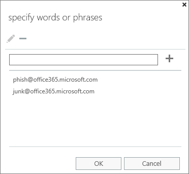

# De invoegtoepassing Rapportbericht inschakelen

> [!NOTE]
> De invoegtoepassing Rapportbericht voor Outlook en Outlook op de web is niet precies hetzelfde als het [Outlook Junk Email-filter,](https://support.office.com/article/5ae3ea8e-cf41-4fa0-b02a-3b96e21de089)hoewel beide kunnen worden gebruikt om e-mail te markeren als ongewenste e-mail, geen ongewenste e-mail of een phishing-poging. Het verschil is dat de invoegtoepassing Bericht rapport voor Outlook en Outlook op het web Microsoft informeert over verkeerd geclassificeerde e-mail, terwijl het Outlook Junk Email Filter wordt gebruikt om e-mailberichten in het postvak van een gebruiker te ordenen.

## Overzicht

Met de invoegtoepassing Rapportbericht voor Outlook en Outlook op de web (voorheen Outlook Web App) kunnen mensen eenvoudig verkeerd geclassificeerde e-mail, veilig of kwaadaardig, melden aan Microsoft en haar gelieerde ondernemingen voor analyse. Microsoft gebruikt deze inzendingen om de effectiviteit van e-mailbeveiligingstechnologieën te verbeteren. Als uw organisatie bovendien [Office 365 Advanced Threat Protection Plan 1](office-365-atp.md) of Plan [2](office-365-ti.md)gebruikt, biedt de invoegtoepassing Rapportbericht het beveiligingsteam van uw organisatie nuttige informatie die ze kunnen gebruiken om het beveiligingsbeleid te bekijken en bij te werken.

Stel dat mensen veel berichten melden als phishing. Deze informatie wordt weergegeven in het [beveiligingsdashboard](security-dashboard.md) en andere rapporten. Het beveiligingsteam van uw organisatie kan deze informatie gebruiken als een indicatie dat het antiphishingbeleid mogelijk moet worden bijgewerkt. Als mensen veel berichten rapporteren die als ongewenste e-mail zijn gemarkeerd als Niet-ongewenstee e-mail met behulp van de invoegtoepassing Rapportbericht, moet het beveiligingsteam van uw organisatie mogelijk [het antispambeleid](configure-your-spam-filter-policies.md)aanpassen.

De invoegtoepassing Rapportbericht werkt met de meeste Office 365-abonnementen en de volgende producten:

- De webversie van Outlook
- Outlook 2013 SP1
- Outlook 2016
- Outlook 2016 voor Mac
- Outlook inbegrepen bij Office 365 ProPlus

De invoegtoepassing Rapportbericht is momenteel niet beschikbaar voor:

- Postvakken in on-premises Exchange-organisaties
- GCC-, GCC HIGH- of DoD-abonnementen

Uw bestaande webbrowser moet volstaan om de invoegtoepassing Rapportbericht te laten werken. Als u echter merkt dat de invoegtoepassing niet beschikbaar is of niet werkt zoals verwacht, probeert u een andere browser.

Als u een individuele gebruiker bent, u [de invoegtoepassing Bericht melden voor uzelf inschakelen.](#get-the-report-message-add-in-for-yourself)

Als u een globale office 365-beheerder of een Exchange Online-beheerder bent en Exchange is geconfigureerd om OAuth-verificatie te gebruiken, u [de invoegtoepassing Bericht melden voor uw organisatie inschakelen.](#get-and-enable-the-report-message-add-in-for-your-organization) De invoegtoepassing Rapportbericht is nu beschikbaar via [gecentraliseerde implementatie.](https://docs.microsoft.com/office365/admin/manage/centralized-deployment-of-add-ins)

## De invoegtoepassing Rapportbericht zelf opvragen

1. Zoek in [Microsoft AppSource](https://appsource.microsoft.com/marketplace/apps)naar de [invoegtoepassing Bericht](https://appsource.microsoft.com/product/office/wa104381180)rapport .

2. Kies **GET IT NOW**.

   

3. Bekijk de gebruiksvoorwaarden en het privacybeleid. Kies **Continue**.

4. Meld u aan bij Office 365 met uw werk- of schoolaccount (voor zakelijk gebruik) of uw Microsoft-account (voor persoonlijk gebruik).

Nadat de invoegtoepassing is geïnstalleerd en ingeschakeld, ziet u de volgende pictogrammen:

- In Outlook ziet het pictogram er als volgt uit:

  

- In de webversie van Outlook (voorheen Outlook Web App) ziet het pictogram er als volgt uit:

  

> [!TIP]
> Lees als volgende stap hoe [u de invoegtoepassing Rapportbericht](https://support.office.com/article/b5caa9f1-cdf3-4443-af8c-ff724ea719d2)gebruikt .

## De invoegtoepassing Rapportbericht voor uw organisatie opvragen en inschakelen

> [!IMPORTANT]
> U moet een globale office 365-beheerder of een Exchange Online-beheerder zijn om deze taak te voltooien. Bovendien moet Exchange zijn geconfigureerd om OAuth-verificatie te gebruiken Voor meer informatie, zie [Exchange-vereisten (Gecentraliseerde implementatie van invoegingen)](https://docs.microsoft.com/office365/admin/manage/centralized-deployment-of-add-ins).

1. Ga naar de [pagina Services &-invoegtoepassing](https://admin.microsoft.com/AdminPortal/Home#/Settings/ServicesAndAddIns) in het Microsoft 365-beheercentrum.

   

2. Kies **+ Invoegtoepassing implementeren**.

   

3. Bekijk de informatie in het scherm **Nieuwe invoegtoepassing** en kies **Volgende**.

   

4. Selecteer **Ik wil een invoegtoepassing toevoegen in de Office Store**en kies **Volgende**.

   

5. Zoek naar **Rapportbericht**en kies in de lijst met resultaten naast de **invoegtoepassing Rapportbericht**de optie **Toevoegen**.

   

6. Bekijk in het scherm **Bericht melden** de informatie en kies **Volgende**.

   

7. Geef de standaardinstellingen van de gebruiker voor Outlook op en kies **Volgende**.

   

8. Geef op wie de invoegtoepassing Rapportbericht krijgt en kies **Opslaan**.

   

> [!TIP]
> We raden u aan [een regel in te stellen om een kopie van e-mailberichten te laten melden door uw gebruikers.](#set-up-a-rule-to-get-a-copy-of-email-messages-reported-by-your-users)

Afhankelijk van wat u hebt geselecteerd wanneer u de invoegtoepassing (stap 7-8 hierboven) instelt, hebben mensen in uw organisatie de [invoegtoepassing Rapportbericht](https://support.office.com/article/b5caa9f1-cdf3-4443-af8c-ff724ea719d2) beschikbaar. Mensen in uw organisatie zien de volgende pictogrammen:

- In Outlook ziet het pictogram er als volgt uit:

  

- In de webversie van Outlook ziet het pictogram er als volgt uit:

  

> [!TIP]
> Wanneer u gebruikers op de hoogte stelt van de invoegtoepassing Bericht melden, voegt u een koppeling toe naar [De invoegtoepassing Rapportbericht gebruiken.](https://support.office.com/article/b5caa9f1-cdf3-4443-af8c-ff724ea719d2)

## Een regel instellen om een kopie van e-mailberichten te laten melden door uw gebruikers

> [!IMPORTANT]
> U moet een Exchange Online-beheerder zijn om deze taak uit te voeren.

U een regel instellen om een kopie van e-mailberichten te laten melden door gebruikers in uw organisatie. U doet dit nadat u de invoegtoepassing Rapportbericht voor uw organisatie hebt gedownload en ingeschakeld.

1. Kies in het Exchange-beheercentrum **de regels voor e-mailstroom** \> **rules**.

2. Kies **+** \> **Een nieuwe regel maken**.

3. Typ **in** het vak Naam een naam, zoals Inzendingen.

4. Kies De **geadresseerdeadres bevat in**de lijst **Deze regel toepassen als** deze lijst bevat... .

5. Voeg in het scherm Woorden `junk@office365.microsoft.com` of `phish@office365.microsoft.com` **woordgroepen opgeven** toe en kies **OK**.

   

6. Kies **Do the following...** **bcc het bericht naar...**.

7. Voeg een globale beheerder, beveiligingsbeheerder en/of beveiligingslezer toe die een kopie van elk e-mailbericht moet ontvangen dat mensen aan Microsoft rapporteren en kies **OK.**

   

8. Selecteer **Deze regel controleren met ernstniveau**en kies **Gemiddeld**.

9. Kies **onder Een modus kiezen voor deze regel**de optie **Afdwingen**.

   

10. Selecteer **Save**.

Wanneer iemand in uw organisatie een e-mailbericht meldt met de invoegtoepassing Rapportbericht, ontvangt uw globale beheerder, beveiligingsbeheerder en/of beveiligingslezer een kopie van dat bericht wanneer iemand in uw organisatie een e-mailbericht meldt met de invoegtoepassing Rapportbericht. Met deze informatie u beleid instellen of aanpassen, zoals het beleid voor [veilige koppelingen van Office 365](atp-safe-links.md) OF uw [antispaminstellingen.](anti-spam-protection.md)

## Meer informatie over het gebruik van de invoegtoepassing Rapportbericht

Zie [De invoegtoepassing Rapportbericht gebruiken](https://support.office.com/article/b5caa9f1-cdf3-4443-af8c-ff724ea719d2).

## Instellingen voor de invoegtoepassing Rapportbericht controleren of bewerken

U de standaardinstellingen voor de invoegtoepassing Rapportbericht op de [pagina Services & invoegtoepassing](https://admin.microsoft.com/AdminPortal/Home#/Settings/ServicesAndAddIns)bekijken en bewerken.

> [!IMPORTANT]
> U moet een globale office 365-beheerder of een Exchange Online-beheerder zijn om deze taak te voltooien.

1. Ga naar de [pagina Services &-invoegtoepassing](https://admin.microsoft.com/AdminPortal/Home#/Settings/ServicesAndAddIns) in het Microsoft 365-beheercentrum.

   

2. Zoek en selecteer de invoegtoepassing Rapportbericht.

   

3. Bekijk en bewerk de instellingen in het scherm Bericht melden, indien van toepassing voor uw organisatie.

   

## Verwante onderwerpen

[De invoegtoepassing Rapportbericht gebruiken](https://support.office.com/article/b5caa9f1-cdf3-4443-af8c-ff724ea719d2)

[E-mailbeveiligingsrapporten weergeven in het Security &amp; Compliance Center](view-email-security-reports.md)

[Rapporten weergeven voor geavanceerde bedreigingsbeveiliging van Office 365](view-reports-for-atp.md)

[Explorer gebruiken in &amp; het Security Compliance Center](threat-explorer.md)
