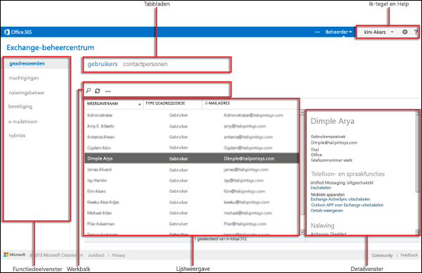

# Exchange-beheercentrum in Exchange Online ProtectionExchange admin center in Exchange Online Protection

Het Exchange-beheercentrum (EAC) is de webgebaseerde beheerconsole voor Microsoft Exchange Online Protection (EOP).The Exchange admin center (EAC) is the web-based management console for Microsoft Exchange Online Protection (EOP).

Op zoek naar de Exchange Server-versie van dit onderwerp?Looking for the Exchange Server version of this topic? Zie [Exchange-beheercentrum in Exchange Server](https://docs.microsoft.com/exchange/architecture/client-access/exchange-admin-center).See [Exchange admin center in Exchange Server](https://docs.microsoft.com/exchange/architecture/client-access/exchange-admin-center).

Op zoek naar de Exchange Online versie van dit onderwerp?Looking for the Exchange Online version of this topic? Zie [Exchange-beheercentrum in Exchange Online](https://docs.microsoft.com/exchange/exchange-admin-center).See [Exchange admin center in Exchange Online](https://docs.microsoft.com/exchange/exchange-admin-center).

## Toegang tot de EACAccessing the EAC

In de meeste gevallen krijgen EOP-klanten toegang tot de EAC via het Microsoft 365-beheercentrum.In most cases, EOP customers will access the EAC through the Microsoft 365 admin center. U vindt een link naar EOP in het vervolgkeuzemenu in de tegel **Beheerder,** die naast de tegel **Ik** staat.You can find a link to EOP in the drop-down menu in the **Admin** tile, which is next to the **Me** tile. Klik op de tegel **Beheerder** en selecteer **Exchange Online Protection** in het vervolgkeuzemenu dat naar de EAC moet worden gebracht.Click the **Admin** tile and select **Exchange Online Protection** from the drop-down menu to be taken to the EAC.

U ook rechtstreeks via de volgende URL `https://admin.protection.outlook.com/ecp/<companydomain>`toegang krijgen tot de eac-aanmeldingspagina:.You can also access the EAC sign in page directly via the following URL: `https://admin.protection.outlook.com/ecp/<companydomain>`. Bijvoorbeeld `https://admin.protection.outlook.com/ecp/contoso.onmicrosoft.com`.For example, `https://admin.protection.outlook.com/ecp/contoso.onmicrosoft.com`. Na het opgeven van uw gebruikersreferenties wordt u rechtstreeks naar de EAC gebracht.After specifying your user credentials you will be taken directly into the EAC.

## Veelvoorkomende gebruikersinterface-elementen in de EACCommon user interface elements in the EAC

In deze sectie worden de elementen van de gebruikersinterface beschreven die in de EAC worden gevonden.This section describes the user interface elements that are found in the EAC.

### FunctievensterFeature Pane

Dit is het eerste navigatieniveau voor de meeste taken die u in de EAC uitvoert.This is the first level of navigation for most of the tasks you'll perform in the EAC. Het functievenster is ingedeeld op functiegebieden.The feature pane is organized by feature areas.

1. **Geadresseerden:** hier ziet u interne gebruikers en externe contactpersonen.**Recipients**: This is where you'll view internal users and external contacts.

2. **Machtigingen:** hier beheert u beheerdersrollen.**Permissions**: This where you'll manage administrator roles.

3. **Compliance Management:** Hier vindt u controlelogboeken en rapporten, zoals het rapport van de groep beheerdersfuncties.**Compliance Management**: This is where you'll find audit logs and reports, such as the administrator role group report.

4. **Bescherming:** Hier beheert u anti-malware- en antispambescherming voor uw organisatie en beheert u berichten in quarantaine.**Protection**: This is where you'll manage anti-malware and anti-spam protection for your organization, as well as manage messages in quarantine.

5. **Mail Flow:** Hier beheert u regels, geaccepteerde domeinen en connectoren en waar u naartoe gaat om berichttracering uit te voeren.**Mail Flow**: This is where you'll manage rules, accepted domains, and connectors, as well as where you'll go to perform message trace.

### TabbladenTabs

De tabbladen zijn uw tweede niveau van navigatie.The tabs are your second level of navigation. Elk van de functiegebieden bevat verschillende tabbladen, die elk een functie vertegenwoordigen.Each of the feature areas contains various tabs, each representing a feature.

### WerkbalkToolbar

Wanneer u op de meeste tabbladen klikt, ziet u een werkbalk.When you click most tabs, you'll see a toolbar. De werkbalk heeft pictogrammen die een specifieke actie uitvoeren.The toolbar has icons that perform a specific action. In de volgende tabel worden de pictogrammen en hun acties beschreven.The following table describes the icons and their actions.

|**Pictogram****Icon**|**Naam****Name**|**Actie****Action**|
|:-----|:-----|:-----|
||Toevoegen, NieuwAdd, New|Gebruik dit pictogram om een nieuw object te maken.Use this icon to create a new object. Sommige van deze pictogrammen hebben een bijbehorende pijl-omlaag waarop u klikken om extra objecten weer te geven die u maken.Some of these icons have an associated down arrow you can click to show additional objects you can create.|
||BewerkenEdit|Gebruik dit pictogram om een object te bewerken.Use this icon to edit an object.|
||VerwijderenDelete|Gebruik dit pictogram om een object te verwijderen.Use this icon to delete an object. Sommige verwijderpictogrammen hebben een pijl-omlaag waarop u klikken om extra opties weer te geven.Some delete icons have a down arrow you can click to show additional options.|
||ZoekSearch|Gebruik dit pictogram om een zoekvak te openen waarin u de zoekterm typen voor een object dat u wilt vinden.Use this icon to open a search box in which you can type the search phrase for an object you want to find.|
||VernieuwenRefresh|Gebruik dit pictogram om de lijstweergave te vernieuwen.Use this icon to refresh the list view.|
||Meer optiesMore options|Gebruik dit pictogram om meer acties weer te geven die u voor de objecten van dat tabblad uitvoeren.Use this icon to view more actions you can perform for that tab's objects. In \*\* \> Ontvangers\*\* die bijvoorbeeld op dit pictogram klikken, wordt de optie weergegeven om een **geavanceerd zoeken**uit te voeren.For example, in **Recipients \> Users** clicking this icon shows the option to perform an **Advanced Search**.|
||Pijl-omhoog en pijl-omlaagUp arrow and down arrow|Gebruik deze pictogrammen om de prioriteit van een object omhoog of omlaag te verplaatsen.Use these icons to move an object's priority up or down.|
||VerwijderenRemove|Gebruik dit pictogram om objecten uit een lijst te verwijderen.Use this icon to remove objects from a list.|

### LijstweergaveList View

Wanneer u een tabblad selecteert, ziet u in de meeste gevallen een lijstweergave.When you select a tab, in most cases you'll see a list view. De zichtbaarbare limiet met de EAC-lijstweergave is ongeveer 10.000 objecten.The viewable limit with the EAC list view is approximately 10,000 objects. Bovendien is paging opgenomen, zodat u pagina naar resultaten.In addition, paging is included so that you can page to results.

### Details vensterDetails Pane

Wanneer u een object selecteert in de lijstweergave, wordt informatie over dat object weergegeven in het detailvenster.When you select an object from the list view, information about that object is displayed in the details pane. In sommige gevallen bevat het detailvenster beheertaken.In some cases the details pane includes management tasks.

### Mijn tegel en HelpMe tile and Help

Met de tegel **Ik** u de EAC afmelden en u als andere gebruiker aanmelden.The **Me** tile allows you to sign out the EAC and sign in as a different user. In het vervolgkeuzemenu Help-pictogram-pictogram **Help** u de volgende acties uitvoeren:From the **Help** drop-down menu, you can perform the following actions:

1. **Help:**  op Help-pictogram om de online help-inhoud te bekijken.**Help**: Click  to view the online help content.

2. **Help-bel uitschakelen:** in de Help-bel worden contextuele help voor velden weergegeven wanneer u een object maakt of bewerkt.**Disable Help bubble**: The Help bubble displays contextual help for fields when you create or edit an object. U de Help-bel uitschakelen of inschakelen als deze is uitgeschakeld.You can turn off the Help bubble or turn it on if it has been disabled.

3. **Auteursrecht**: Klik op deze link om de copyright verklaring voor Exchange Online Protection te lezen.**Copyright**: Click this link to read the copyright notice for Exchange Online Protection.

4. **Privacy**: Klik hier om het privacybeleid voor Exchange Online Protection te lezen.**Privacy**: Click to read the privacy policy for Exchange Online Protection.

## Ondersteunde browsersSupported Browsers

Voor de beste ervaring met de EAC raden we u aan altijd de nieuwste browsers, Office-clients en apps te gebruiken.For the best experience using the EAC, we recommend that you always use the latest browsers, Office clients, and apps. We raden u ook aan software-updates te installeren wanneer deze beschikbaar zijn.We also recommend that you install software updates when they become available. Zie [Systeemvereisten voor Office voor](https://products.office.com/office-system-requirements)meer informatie over de ondersteunde browsers en systeemvereisten voor de service.For more information about the supported browsers and system requirements for the service, see [System requirements for Office](https://products.office.com/office-system-requirements).

## Ondersteunde talen in EOPSupported languages in EOP

De volgende talen worden ondersteund en beschikbaar voor Exchange Online Protection.The following languages are supported and available for Exchange Online Protection.

- AmharicAmharic

- ArabischArabic

- Baskisch (Baskisch)Basque (Basque)

- Bengaals (India)Bengali (India)

- BulgaarsBulgarian

- CatalaansCatalan

- Chinees (vereenvoudigd)Chinese (Simplified)

- Chinees (traditioneel)Chinese (Traditional)

- KroatischCroatian

- TsjechischCzech

- DeensDanish

- NederlandsDutch

- NederlandsDutch

- EngelsEnglish

- EstischEstonian

- Filipijns (Filippijnen)Filipino (Philippines)

- FinsFinnish

- FransFrench

- GalicischGalician

- DuitsGerman

- GrieksGreek

- GujaratiGujarati

- HebreeuwsHebrew

- HindiHindi

- HongaarsHungarian

- IJslandsIcelandic

- IndonesischIndonesian

- ItaliaansItalian

- JapansJapanese

- KannadaKannada

- KazachstaansKazakh

- KiswahiliKiswahili

- KoreaansKorean

- LetsLatvian

- LitouwsLithuanian

- Maleis (Brunei Darussalam)Malay (Brunei Darussalam)

- Maleis (Maleisië)Malay (Malaysia)

- MalajalamMalayalam

- MarathiMarathi

- Noors (Bokmål)Norwegian (Bokmål)

- Noors (Nynorsk)Norwegian (Nynorsk)

- OriyaOriya

- PerzischPersian

- PoolsPolish

- Portugees (Brazilië)Portuguese (Brazil)

- Portugees (Portugal)Portuguese (Portugal)

- RoemeensRomanian

- RussischRussian

- Servisch (Cyrillisch, Servië)Serbian (Cyrillic, Serbia)

- Servisch (Latijn)Serbian (Latin)

- SlowaaksSlovak

- SloveensSlovenian

- SpaansSpanish

- ZweedsSwedish

- TamilTamil

- TeluguTelugu

- ThaisThai

- TurksTurkish

- OekraïensUkrainian

- UrduUrdu

- VietnameesVietnamese

- WelshWelsh

