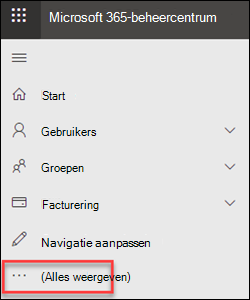
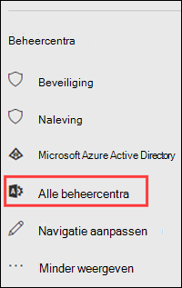

# Exchange-beheercentrum in zelfstandige EOPExchange admin center in standalone EOP

Het Exchange-beheercentrum (EAC) is een webgebaseerde beheerconsole voor zelfstandige Exchange Online Protection (EOP).The Exchange admin center (EAC) is a web-based management console for standalone Exchange Online Protection (EOP).

Op zoek naar de Exchange Online-versie van dit onderwerp?Looking for the Exchange Online version of this topic? Zie [Exchange-beheercentrum in Exchange Online](https://docs.microsoft.com/exchange/exchange-admin-center).See [Exchange admin center in Exchange Online](https://docs.microsoft.com/exchange/exchange-admin-center).

## Open de EAC in EOPOpen the EAC in EOP

Zelfstandige EOP-klanten hebben toegang tot de EAC via de volgende methoden:Standalone EOP customers can access the EAC by using the following methods:

- **Vanuit het Microsoft 365-beheercentrum:****From the Microsoft 365 admin center**:

  1. Ga naar <https://admin.microsoft.com> en klik op Alles **weergeven**.Go to <https://admin.microsoft.com> and click **Show all**.

     

  2. Klik in de sectie **Beheercentra** die wordt weergegeven op **Alle beheercentra**.In the **Admin centers** section that appears, click **All admin centers**.

     

  3. Klik op de pagina **Alle beheercentra** die wordt weergegeven op **Exchange Online Protection**.On the **All admin centers** page that appears, click **Exchange Online Protection**.

- Ga direct naar `https://admin.protection.outlook.com/ecp/` .Go directly to `https://admin.protection.outlook.com/ecp/`.

## Algemene gebruikersinterface-elementen in de EAC in EOPCommon user interface elements in the EAC in EOP

In deze sectie worden de elementen van de gebruikersinterface beschreven die in de EAC worden gevonden.This section describes the user interface elements that are found in the EAC.

### FunctiedeelvensterFeature Pane

Dit is het eerste navigatieniveau voor de meeste taken die u in de EAC uitvoert.This is the first level of navigation for most of the tasks you'll perform in the EAC. Het functievenster is geordend op functiegebieden.The feature pane is organized by feature areas.

- **Ontvangers**: Hier u groepen en externe contactpersonen bekijken.**Recipients**: This is where you'll view groups and external contacts.

- **Machtigingen:** hier beheert u beheerdersrollen.**Permissions**: This where you'll manage admin roles.

- **Compliance Management**: Hier vindt u het rapport van de beheerdersrolgroep en het rapport van het beheercontrolelogboek.**Compliance Management**: This is where you'll find the administrator role group report and the admin audit log report.

- **Beveiliging:** hier u anti-malwarebeleid, het standaardbeleid voor verbindingsfilter en DKIM beheren.**Protection**: This is where you can manage anti-malware policies, the default connection filter policy, and DKIM.

  > [!NOTE]
  > U moet het anti-malwarebeleid en het standaardverbindingsfilterbeleid beheren in het Beveiligings& Compliance Center.You should manage anti-malware policies and the default connection filter policy in the Security & Compliance Center. Zie [Beleid voor antimalware configureren in EOP](configure-anti-malware-policies.md) en [Verbindingsfiltering configureren in EOP](configure-the-connection-filter-policy.md)voor meer informatie.For more information, see [Configure anti-malware policies in EOP](configure-anti-malware-policies.md) and [Configure connection filtering in EOP](configure-the-connection-filter-policy.md).

- **E-mailstroom:** hier beheert u de regels voor e-mailstroom (ook wel transportregels genoemd), geaccepteerde domeinen en connectoren, evenals waar u berichttracering uitvoeren.**Mail Flow**: This is where you'll manage mail flow rules (also known as transport rules), accepted domains, and connectors, as well as where you can go to run message trace.

- **Hybride:** hier u de [wizard Hybride configuratie](https://docs.microsoft.com/Exchange/hybrid-configuration-wizard)uitvoeren en u de Exchange Online [PowerShell-module](https://docs.microsoft.com/powershell/exchange/exchange-online/connect-to-exchange-online-powershell/mfa-connect-to-exchange-online-powershell)installeren.**Hybrid**: This is where you can run the [Hybrid Configuration Wizard](https://docs.microsoft.com/Exchange/hybrid-configuration-wizard), and where you can install the [Exchange Online PowerShell module](https://docs.microsoft.com/powershell/exchange/exchange-online/connect-to-exchange-online-powershell/mfa-connect-to-exchange-online-powershell).

### TabbladenTabs

De tabbladen zijn uw tweede niveau van navigatie.The tabs are your second level of navigation. Elk van de functiegebieden bevat verschillende tabbladen, die elk een functie vertegenwoordigen.Each of the feature areas contains various tabs, each representing a feature.

### WerkbalkToolbar

Wanneer u op de meeste tabbladen klikt, ziet u een werkbalk.When you click most tabs, you'll see a toolbar. De werkbalk heeft pictogrammen die een specifieke actie uitvoeren.The toolbar has icons that perform a specific action. In de volgende tabel worden de pictogrammen en hun acties beschreven.The following table describes the icons and their actions.

||||
|---|---|---|
|**Pictogram****Icon**|**Naam****Name**|**Actie****Action**|
||Toevoegen, NieuwAdd, New|Gebruik dit pictogram om een nieuw object te maken.Use this icon to create a new object. Sommige van deze pictogrammen hebben een bijbehorende pijl-omlaag waarop u klikken om extra objecten weer te geven die u maken.Some of these icons have an associated down arrow you can click to show additional objects you can create.|
||BewerkenEdit|Gebruik dit pictogram om een object te bewerken.Use this icon to edit an object.|
||VerwijderenDelete|Gebruik dit pictogram om een object te verwijderen.Use this icon to delete an object. Sommige pictogrammen verwijderen hebben een pijl-omlaag waarop u klikken om extra opties weer te geven.Some delete icons have a down arrow you can click to show additional options.|
||ZoekSearch|Gebruik dit pictogram om een zoekvak te openen waarin u de zoekwoord typen voor een object dat u wilt vinden.Use this icon to open a search box in which you can type the search phrase for an object you want to find.|
||VernieuwenRefresh|Gebruik dit pictogram om de lijstweergave te vernieuwen.Use this icon to refresh the list view.|
||Meer optiesMore options|Gebruik dit pictogram om meer acties weer te geven die u voor de objecten van dat tabblad uitvoeren.Use this icon to view more actions you can perform for that tab's objects. In Ontvangers \*\* \> geeft gebruikers die\*\* op dit pictogram klikken bijvoorbeeld de optie aan om een geavanceerd **zoekopdracht**uit te voeren .For example, in **Recipients \> Users** clicking this icon shows the option to perform an **Advanced Search**.|
||Pijl-omhoog en pijl-omlaagUp arrow and down arrow|Gebruik deze pictogrammen om de prioriteit van een object omhoog of omlaag te verplaatsen.Use these icons to move an object's priority up or down.|
||VerwijderenRemove|Gebruik dit pictogram om objecten uit een lijst te verwijderen.Use this icon to remove objects from a list.|
|

### LijstweergaveList View

Wanneer u een tabblad selecteert, ziet u in de meeste gevallen een lijstweergave.When you select a tab, in most cases you'll see a list view. De weergavebare limiet met de EAC-lijstweergave is ongeveer 10.000 objecten.The viewable limit with the EAC list view is approximately 10,000 objects. Daarnaast is paging opgenomen, zodat u pagina naar de resultaten.In addition, paging is included so that you can page to results.

### Deelvenster DetailsDetails Pane

Wanneer u een object selecteert in de lijstweergave, wordt informatie over dat object weergegeven in het detailvenster.When you select an object from the list view, information about that object is displayed in the details pane. In sommige gevallen bevat het detailvenster beheertaken.In some cases the details pane includes management tasks.

### Tegel en Help voor mijMe tile and Help

Met **Me** de me-tegel u de EAC afmelden en u aanmelden als een andere gebruiker.The **Me** tile allows you to sign out the EAC and sign in as a different user. In **Help**de  kunt u de volgende acties uitvoeren:From the **Help** drop-down menu, you can perform the following actions:

- **Help:** Klik op  om de online help-inhoud te bekijken.**Help**: Click  to view the online help content.

- **Feedback**: Feedback geven.**Feedback**: Leave feedback.

- **Community**: Plaats een vraag voor het vinden van antwoorden in de community forums.**Community**: Post a question for find answers in the community forums.

- **Help-belbellen uitschakelen:** in de Help-bel wordt contextuele hulp weergegeven voor velden wanneer u een object maakt of bewerkt.**Disable Help bubble**: The Help bubble displays contextual help for fields when you create or edit an object. U de Help-bel uitschakelen of inschakelen als deze is uitgeschakeld.You can turn off the Help bubble or turn it on if it has been disabled.

- **Command Logging weergeven:** er wordt een nieuw venster geopend waarin de gelijkwaardige PowerShell-opdrachten worden weergegeven op basis van wat u in EAC hebt geconfigureerd.**Show Command Logging**: A new window opens that shows the equivalent PowerShell commands based on what you configured in EAC.

## Ondersteunde browsersSupported Browsers

Voor de beste ervaring met de EAC raden we u aan altijd de nieuwste browsers, Office-clients en apps te gebruiken.For the best experience using the EAC, we recommend that you always use the latest browsers, Office clients, and apps. We raden u ook aan software-updates te installeren wanneer deze beschikbaar zijn.We also recommend that you install software updates when they become available. Zie [Systeemvereisten voor Office voor](https://products.office.com/office-system-requirements)meer informatie over de ondersteunde browsers en systeemvereisten voor de service.For more information about the supported browsers and system requirements for the service, see [System requirements for Office](https://products.office.com/office-system-requirements).

## Ondersteunde talenSupported languages

De volgende talen worden ondersteund en beschikbaar voor de EAC in standalone EOP.The following languages are supported and available for the EAC in standalone EOP.

- AmharicAmharic

- ArabischArabic

- Baskisch (Baskisch)Basque (Basque)

- Bengaals (India)Bengali (India)

- BulgaarsBulgarian

- CatalaansCatalan

- Chinees (vereenvoudigd)Chinese (Simplified)

- Chinees (Traditioneel)Chinese (Traditional)

- KroatischCroatian

- TsjechischCzech

- DeensDanish

- NederlandsDutch

- NederlandsDutch

- EngelsEnglish

- EstischEstonian

- Filipijnse (Filippijnen)Filipino (Philippines)

- FinsFinnish

- FransFrench

- GalicischGalician

- DuitsGerman

- GrieksGreek

- GujaratiGujarati

- HebreeuwsHebrew

- HindiHindi

- HongaarsHungarian

- IJslandsIcelandic

- IndonesischIndonesian

- ItaliaansItalian

- JapansJapanese

- KannadaKannada

- KazachstaansKazakh

- KiswahiliKiswahili

- KoreaansKorean

- LetsLatvian

- LitouwsLithuanian

- Maleis (Brunei Darussalam)Malay (Brunei Darussalam)

- Maleis (Maleisië)Malay (Malaysia)

- MalajalamMalayalam

- MarathiMarathi

- Noors (Bokmål)Norwegian (Bokmål)

- Noors (Nynorsk)Norwegian (Nynorsk)

- OriyaOriya

- PerzischPersian

- PoolsPolish

- Portugees (Brazilië)Portuguese (Brazil)

- Portugees (Portugal)Portuguese (Portugal)

- RoemeensRomanian

- RussischRussian

- Servisch (Cyrillisch, Servië)Serbian (Cyrillic, Serbia)

- Servisch (Latijn)Serbian (Latin)

- SlowaaksSlovak

- SloveensSlovenian

- SpaansSpanish

- ZweedsSwedish

- TamilTamil

- TeluguTelugu

- ThaisThai

- TurksTurkish

- OekraïensUkrainian

- UrduUrdu

- VietnameesVietnamese

- WelshWelsh
