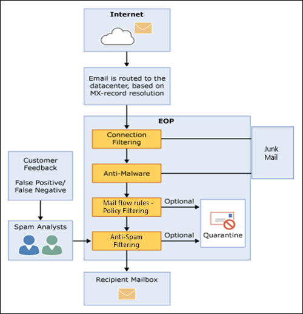

# Overzicht Exchange Online Protection

Exchange Online Protection (EOP) is de cloudgebaseerde filterservice die uw organisatie helpt beschermen tegen spam en malware. EOP is opgenomen in alle Microsoft 365-organisaties met Exchange Online-postvakken.

Maar EOP is ook beschikbaar in de volgende on-premises scenario's:

- **In een op zichzelf staand scenario:** EOP biedt cloudgebaseerde e-mailbescherming voor uw on-premises Exchange-organisatie of voor een andere on-premises SMTP-e-mailoplossing.

- **In een hybride implementatie:** EOP kan worden geconfigureerd om uw e-mailomgeving te beschermen en e-mailroutering te beheren wanneer u een mix van on-premises en cloudpostvakken hebt.

In deze scenario's kan EOP het beheer van uw e-mailomgeving vereenvoudigen en veel van de lasten verlichten die gepaard gaan met het onderhouden van on-premises hardware en software.

De rest van dit onderwerp legt uit hoe EOP werkt in standalone en hybride omgevingen.

## Hoe EOP werkt

Om te begrijpen hoe EOP werkt, helpt het om te zien hoe het binnenkomende e-mail verwerkt:

- Een binnenkomend bericht gaat in eerste instantie door het filteren van verbindingen, die de reputatie van de afzender controleert en het bericht op malware inspecteert. De meerderheid van spam wordt gestopt op dit punt en verwijderd door EOP. Zie [Verbindingsfiltering configureren](configure-the-connection-filter-policy.md) voor meer informatie.

- Berichten gaan door middel van beleidsfiltering, waarbij berichten worden geëvalueerd op basis van aangepaste e-mailstroomregels (ook wel transportregels genoemd) die u maakt of afdwingt vanuit een sjabloon. U bijvoorbeeld een regel hebben die een melding naar een manager stuurt wanneer e-mail van een specifieke afzender wordt verzonden. Op dit punt worden ook gegevensverliespreventiecontroles uitgevoerd (Exchange Enterprise CAL met Services).

- Vervolgens gaan berichten door anti-spam filtering (ook wel content filtering genoemd). Een bericht dat is bepaald als spam kan worden verzonden naar de map Ongewenste e-mail van een gebruiker of naar de quarantaine, onder andere opties. Zie [Antispambeleid configureren](configure-your-spam-filter-policies.md) voor meer informatie.

- Nadat een bericht al deze beveiligingslagen met succes heeft doorgeeft, wordt het aan de ontvanger geleverd.

Zie [Bestellen en voorrang op e-mailbeveiliging voor](how-policies-and-protections-are-combined.md)meer informatie.

### EOP datacenters

EOP draait op een wereldwijd netwerk van datacenters die zijn ontworpen om de beste beschikbaarheid te bieden. Als een datacenter bijvoorbeeld niet meer beschikbaar is, worden e-mailberichten automatisch naar een ander datacenter doorgestuurd zonder onderbreking van de service. Servers in elk datacenter accepteren namens u berichten, waardoor een scheidingslaag tussen uw organisatie en het internet wordt geboden, waardoor de belasting op uw servers wordt verminderd. Via dit zeer beschikbare netwerk kan Microsoft ervoor zorgen dat e-mail uw organisatie tijdig bereikt.

EOP voert load balancing uit tussen datacenters, maar alleen binnen een regio. Als u in één regio bent ingericht, worden al uw berichten verwerkt met behulp van de e-mailroutering voor die regio. In de volgende lijst ziet u hoe regionale e-mailroutering werkt voor de EOP-datacenters:

- In Europa, het Midden-Oosten en Afrika (EMEA) bevinden alle Exchange Online-mailboxen zich in EMEA-datacenters en worden alle berichten doorgestuurd via EMEA-datacenters voor EOP-filtering.

- In Asia-Pacific (APAC) bevinden alle Exchange Online-postvakken zich in APAC-datacenters en worden berichten momenteel doorgestuurd via APAC-datacenters voor EOP-filtering.

- In Noord- en Zuid-Amerika worden diensten op de volgende locaties gedistribueerd:

  - Zuid-Amerika: Exchange Online-postvakken bevinden zich in datacenters in Brazilië en Chili. Alle berichten worden doorgestuurd via lokale datacenters voor EOP-filtering. In quarantaine geplaatste berichten worden opgeslagen in het datacenter waar de tenant zich bevindt.

  - Canada: Exchange Online-postvakken bevinden zich in datacenters in Canada. Alle berichten worden doorgestuurd via lokale datacenters voor EOP-filtering. In quarantaine geplaatste berichten worden opgeslagen in het datacenter waar de tenant zich bevindt.

  - Verenigde Staten: Exchange Online-postvakken bevinden zich in Amerikaanse datacenters. Alle berichten worden doorgestuurd via lokale datacenters voor EOP-filtering. In quarantaine geplaatste berichten worden opgeslagen in het datacenter waar de tenant zich bevindt.

- Voor de Government Community Cloud (GCC) bevinden alle Exchange Online-postvakken zich in Amerikaanse datacenters en worden alle berichten doorgestuurd via Amerikaanse datacenters voor EOP-filtering.

## EOP-plannen en -functies voor on-premises e-mailorganisaties

De beschikbare EOP-abonnementen zijn:

- **EOP standalone**: U schrijft u in bij EOP om uw on-premises e-mailorganisatie te beschermen.

- **EOP-functies in Exchange Online:** Elk abonnement dat Exchange Online bevat (standalone of als onderdeel van Microsoft 365) gebruikt EOP om uw Exchange Online-postvakken te beschermen.

- **Exchange Enterprise CAL met Services:** Als u een on-premises Exchange-organisatie hebt waar u extra Exchange Enterprise CAL met Services-licenties hebt gekocht, maakt EOP deel uit van de meegeleverde services.

Zie de beschrijving van de [Service Exchange Online Protection](https://docs.microsoft.com/office365/servicedescriptions/exchange-online-protection-service-description/exchange-online-protection-service-description)voor informatie over vereisten, belangrijke limieten en beschikbaarheid van functies in alle EOP-abonnementen.

## EOP instellen voor on-premises e-mailorganisaties

Het opzetten van EOP kan eenvoudig zijn, vooral in het geval van een kleine organisatie met een handvol nalevingsregels. Als u echter een grote organisatie hebt met meerdere domeinen, aangepaste nalevingsregels of hybride e-mailstroom, kan het instellen meer planning en tijd in beslag nemen.

Als u EOP al hebt gekocht, raadpleegt u [Uw EOP-service instellen](set-up-your-eop-service.md) om ervoor te zorgen dat u alle stappen hebt voltooid die nodig zijn om EOP te configureren om uw berichtenomgeving te beschermen.

## EOP Help voor beheerders

De Help-inhoud voor EOP-beheerders bestaat uit de volgende categorieën op het hoogste niveau:

- [Overzicht van Exchange Online Protection](exchange-online-protection-overview.md): Introduceert hoe EOP werkt en biedt links naar aanvullende informatie.

- [EOP-functies](eop-features.md): Biedt een lijst met functies die beschikbaar zijn in EOP.

- [Uw EOP-service instellen:](set-up-your-eop-service.md)biedt stappen voor het instellen van uw EOP-service en koppelingen naar aanvullende informatie.

- [Overschakelen naar EOP van Google Postini, de Barracuda Spam and Virus Firewall, of Cisco IronPort:](switch-to-eop-from-google-postini-the-barracuda-spam-and-virus-firewall-or-cisco.md)Beschrijft het proces voor het overschakelen naar EOP van een ander e-mailbeveiligingsproduct.

- [Ontvangers beheren in standalone EOP:](manage-recipients-in-eop.md)beschrijft hoe u e-mailgebruikers en -groepen in EOP beheert.

- [E-mailstroom in EOP](mail-flow-in-eop.md): beschrijft hoe u aangepaste e-mailstroomscenario's configureert met connectors, hoe domeinen die aan de service zijn gekoppeld beheren en hoe u de functie Directory Based Edge Blocking (DBEB) inschakelen.

- [Aanbevolen procedures voor het configureren van EOP:](best-practices-for-configuring-eop.md)beschrijft aanbevolen configuratie-instellingen en overwegingen voor nadat u uw service hebt ingesteld en ingericht.

- [Controlerapporten in standalone EOP](auditing-reports-in-eop.md): beschrijft hoe u controlerapporten gebruiken om configuratiewijzigingen in de service bij te houden.

- [Bescherming tegen spam en malware in EOP:](anti-spam-and-anti-malware-protection.md)Beschrijft spamfiltering en malwarefiltering en laat zien hoe u deze zo goed mogelijk aanpassen aan de behoeften van uw organisatie. Beschrijft ook taken die beheerders en eindgebruikers kunnen uitvoeren op in quarantaine geplaatste berichten.

- [Rapportage en berichttracering in Exchange Online Protection](reporting-and-message-trace-in-exchange-online-protection.md): beschrijft de beschikbare rapporten en hulpprogramma's voor het oplossen van problemen.

- [Exchange-beheercentrum in standalone EOP:](exchange-admin-center-in-exchange-online-protection-eop.md)beschrijft hoe u toegang krijgt tot en navigeert via de EAC-beheerinterface (Exchange-beheercentrum) om uw EOP-service te beheren.

- [Exchange Online Protection PowerShell](https://docs.microsoft.com/powershell/exchange/exchange-online-protection-powershell): biedt informatie over externe PowerShell, waarmee u uw EOP-service beheren vanaf de opdrachtregel.

- [Hulp en ondersteuning voor EOP](help-and-support-for-eop.md) Biedt informatie over het verkrijgen van hulp en technische ondersteuning.
