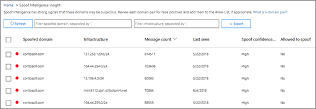

# Stapsgewijze instructies - Van een dashboard tot een inzichtWalkthrough - From a dashboard to an insight

Als u nieuw bent [in rapporten en inzichten &amp; in het Office 365 Security Compliance Center,](reports-and-insights-in-security-and-compliance.md)u mogelijk zien hoe u eenvoudig navigeren van een dashboard naar een inzicht en aanbevolen acties.If you're new to [reports and insights in the Office 365 Security &amp; Compliance Center](reports-and-insights-in-security-and-compliance.md), it might help to see how you can easily navigate from a dashboard to an insight and recommended actions. 
  
Dit is een van de vele &amp; walkthroughs voor het Security Compliance Center.This is one of several walkthroughs for the Security &amp; Compliance Center. Zie de sectie [Gerelateerde onderwerpen](#related-topics) om extra walkthroughs te bekijken.To see additional walkthroughs, see the [Related topics](#related-topics) section. 
  
## Walkthrough: van een dashboard naar een inzichtWalkthrough: From a dashboard to an insight

Laten we door de stroom van een dashboard naar een rapport lopen naar een inzicht en actie.Let's walk through the flow from a dashboard to a report to an insight and action. (Dit is een kort [voorbeeld van spoofintelligentie.)](learn-about-spoof-intelligence.md)(This is a brief [spoof intelligence](learn-about-spoof-intelligence.md) example.) 
  
1. We beginnen met het beveiligingsdashboard in het [Security &amp; Compliance Center.](https://protection.office.com)We begin with the Security dashboard in the [Security &amp; Compliance Center](https://protection.office.com). (Ga naar **Dashboard voor bedreigingsbeheer** \> **.)**(Go to **Threat management** \> **Dashboard**.)  
  
2. In de rij **Insights** zien we een inzicht dat we bepaalde domeinen moeten bekijken die mogelijk verdacht zijn.In the **Insights** row, we notice an insight indicating we need to review some domains that might be suspicious. (Klik **in** de rij Insights op **Domeinparen**.)(In the **Insights** row, click **Domain pairs**.)  
  
3. We krijgen een lijst met activiteiten met betrekking tot spoof informatie.We get a list of activities related to spoof intelligence. Dit zijn gevallen waarin e-mailberichten zijn verzonden die eruit zien alsof ze afkomstig zijn van onze organisatie, maar in feite van een andere organisatie zijn verzonden.These are instances where email messages were sent that look like they came from our organization but were, in fact, sent from another organization. Het doel is om te bepalen of de vervalste berichten zijn geautoriseerd of niet.The goal is to determine whether the spoofed messages are authorized or not.  In deze lijst kunnen we de informatie sorteren op aantal berichten, datum waarop de spoofing voor het laatst is gedetecteerd en meer.In this list, we can sort the information by message count, date the spoofing was last detected, and more. (Klik op kolomkoppen, zoals **aantal berichten** of **Laatst gezien** om te zien hoe sorteren werkt.)(Click column headings, such as **Message count** or **Last seen** to see how sorting works.) 
    
4. Als u een item in de lijst selecteert, wordt een detailvenster geopend waarin we aanvullende informatie kunnen zien, waaronder vergelijkbare e-mailberichten die zijn gedetecteerd.Selecting an item in the list opens a details pane where we can see additional information, including similar email messages that were detected. (Klik op een item in de lijst en bekijk de informatie en aanbevelingen.)(Click an item in the list, and review the information and recommendations.)  
  
5. Merk op dat we boven aan het deelvenster de mogelijkheid hebben om de afzender toe te voegen aan de lijst met toegestane afzenders van onze organisatie.Notice that at the top of the pane, we have the option to add the sender to our organization's allowed senders list. (Selecteer niet **toevoegen aan de lijst 'AllowedtoSpoof' als** u zeker weet dat u dit wilt doen.(Do not select **Add to 'AllowedtoSpoof' sender allow list** until you are sure you want to do this. [Spoofinformatie configureren in Office 365](learn-about-spoof-intelligence.md).)[Configure spoof intelligence in Office 365](learn-about-spoof-intelligence.md).) 
  
Op deze manier kunnen we van een dashboard naar inzichten en aanbevolen acties gaan.In this way, we can move from a dashboard to insights and recommended actions.
  
## Verwante onderwerpenRelated topics

[Walkthrough: Van inzicht tot een gedetailleerd rapportWalkthrough: From an insight to a detailed report](from-an-insight-to-a-detailed-report.md)
  
[Walkthrough: Van een gedetailleerd rapport naar een inzichtWalkthrough: From a detailed report to an insight](from-a-detailed-report-to-an-insight.md)
  

